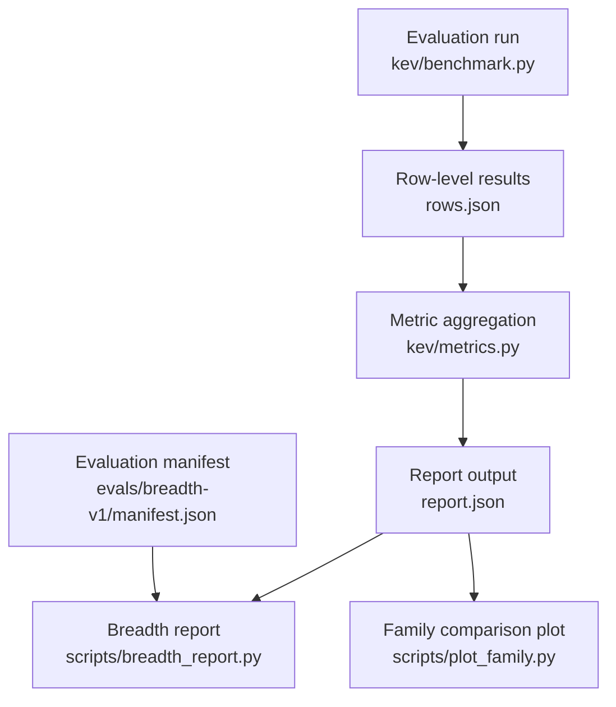
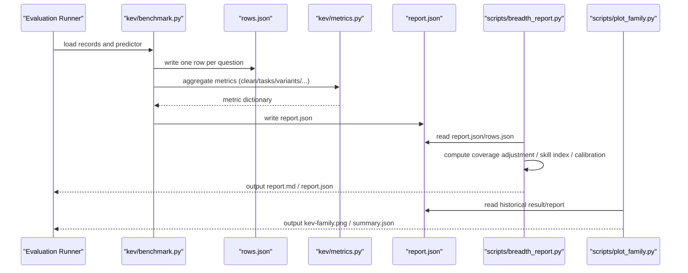
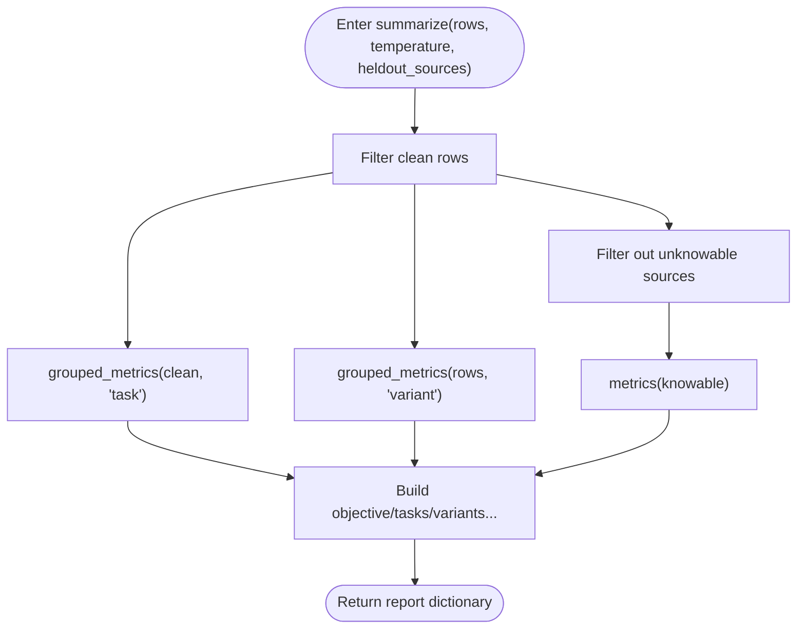
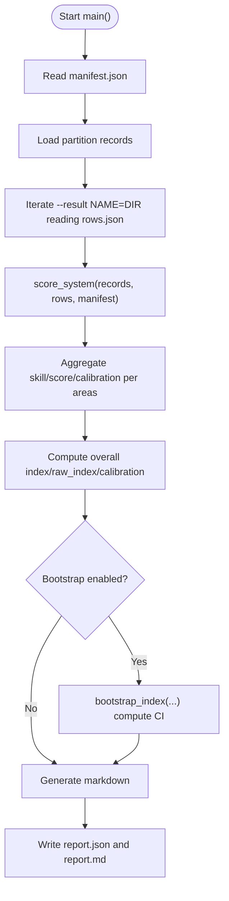
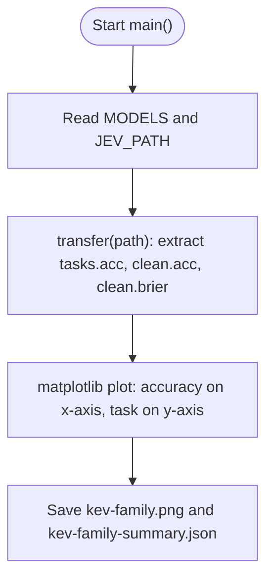
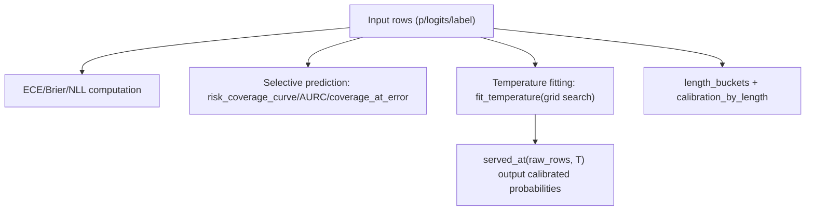
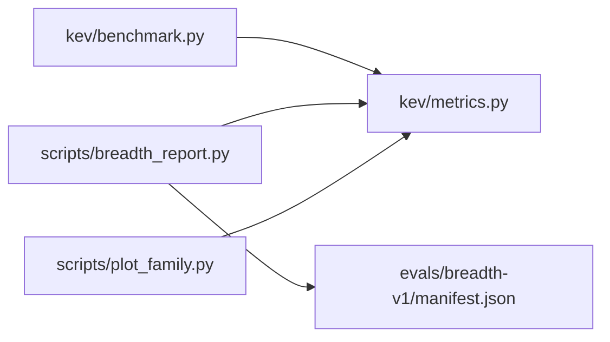

## Table of Contents
1. [Overview](#overview)
2. [Project Structure](#project-structure)
3. [Core Components](#core-components)
4. [Architecture Overview](#architecture-overview)
5. [Detailed Component Analysis](#detailed-component-analysis)
6. [Dependency Analysis](#dependency-analysis)
7. [Performance and Interpretability Considerations](#performance-and-interpretability-considerations)
8. [Troubleshooting Guide](#troubleshooting-guide)
9. [Conclusion](#conclusion)
10. [Appendix](#appendix)

## Overview
This document targets the "analysis and visualization" workflow for Kev evaluation results, focusing on the following goals:
- Interpreting the complete structure of report.json (key fields such as objective, clean, tasks, variants, calibration)
- Using script tools for result analysis: breadth_report.py for breadth evaluation reports; plot_family.py for model-family comparison
- Model comparison methods: performance-difference statistics, significance testing (paired cluster resampling)
- Calibration curve plotting and analysis methods (ECE, Brier, NLL, selective prediction)
- Common analysis patterns: decomposition by task type, analysis by confidence interval, time-series trend analysis
- Custom analysis script development guide and Jupyter Notebook interactive analysis practice
- Best practices for result interpretation and common pitfalls

## Project Structure
Kev's result analysis and visualization revolve around "evaluation run → row-level results → metric aggregation → reports and charts". The key paths are as follows:
- Evaluation run: kev.benchmark converts predictions into rows.json, and generates report.json
- Metric computation: kev.metrics provides accuracy, calibration (ECE/Brier/NLL), selective prediction, temperature fitting, Bootstrap, etc.
- Breadth report: scripts/breadth_report.py, based on evals/breadth-v1/manifest.json, computes coverage-adjusted skill index, area summaries, and overall ECE
- Family comparison: scripts/plot_family.py reads historical result/report files and plots the comparison of the Kev family and Jev on OOD tasks

**Diagram Sources**
- [benchmark.py:124-168](file://kev/benchmark.py#L124-L168)
- [metrics.py:64-100](file://kev/metrics.py#L64-L100)
- [breadth_report.py:160-195](file://scripts/breadth_report.py#L160-L195)
- [plot_family.py:31-70](file://scripts/plot_family.py#L31-L70)
- [manifest.json:83-123](file://evals/breadth-v1/manifest.json#L83-L123)

**Section Sources**
- [benchmark.py:124-168](file://kev/benchmark.py#L124-L168)
- [metrics.py:64-100](file://kev/metrics.py#L64-L100)
- [breadth_report.py:160-195](file://scripts/breadth_report.py#L160-L195)
- [plot_family.py:31-70](file://scripts/plot_family.py#L31-L70)
- [manifest.json:83-123](file://evals/breadth-v1/manifest.json#L83-L123)

## Core Components
- Evaluation and report generation (kev/benchmark.py)
  - Expands each prediction into a "question-level row", writes rows.json
  - Aggregates metrics such as clean/tasks/variants/heldout_tasks/permutation, writes report.json
- Metrics and calibration (kev/metrics.py)
  - Accuracy, ECE, Brier, NLL, selective prediction (coverage-risk curve, AURC, threshold selection)
  - Temperature fitting, cross-validated temperature, paired Bootstrap, length-bucket calibration
- Breadth evaluation report (scripts/breadth_report.py)
  - Area division and dataset metrics based on manifest.json
  - Coverage-adjusted score, chance level, skill index (clip((score-chance)/(1-chance)))
  - Overall decision index (Decision Index 0.2 style), as well as ECE/Brier/NLL calibration
  - Optional paired-record-clustered Bootstrap gives index confidence intervals
- Model-family comparison (scripts/plot_family.py)
  - Extracts task accuracy and overall Brier from historical result/report
  - Plots the Kev family vs Jev horizontal comparison chart on frozen OOD suites

**Section Sources**
- [benchmark.py:73-103](file://kev/benchmark.py#L73-L103)
- [metrics.py:64-100](file://kev/metrics.py#L64-L100)
- [breadth_report.py:28-34](file://scripts/breadth_report.py#L28-L34)
- [breadth_report.py:112-136](file://scripts/breadth_report.py#L112-L136)
- [plot_family.py:25-29](file://scripts/plot_family.py#L25-L29)

## Architecture Overview
The following diagram shows the end-to-end flow from raw predictions to the final report and visualization, including key data structures and processing logic.

**Diagram Sources**
- [benchmark.py:124-168](file://kev/benchmark.py#L124-L168)
- [metrics.py:64-100](file://kev/metrics.py#L64-L100)
- [breadth_report.py:160-195](file://scripts/breadth_report.py#L160-L195)
- [plot_family.py:31-70](file://scripts/plot_family.py#L31-L70)

## Detailed Component Analysis

### report.json structure explained (based on benchmark.py)
- objective: negative macro-average clean dev-set NLL (equal weight per task), reflecting overall log loss
- clean: aggregated metrics for known samples (source≠unknowable) (acc, ece, brier, nll, mean_conf, selective prediction metrics, etc.)
- tasks: metrics grouped by the task field (e.g. mmlu, paws, qnli, etc.)
- variants: metrics grouped by the variant field (clean, permuted, etc.)
- heldout_tasks: metrics for the task subset from untrained sources (determined by manifest.holdout_sources)
- permutation: mean max probability difference and flip rate under option-rotation perturbation
- temperature: temperature used at scoring time (default 1.0)
- calibrated_clean: clean metrics after applying the additional temperature
- metric_policy: metric policy description (including NLL floor value, whether to renormalize returned probabilities, etc.)
- coverage/latency_ms/calibration: coverage, latency distribution, calibration metadata (inference_temperature, logits_recorded, etc.)

**Diagram Sources**
- [benchmark.py:73-103](file://kev/benchmark.py#L73-L103)

**Section Sources**
- [benchmark.py:73-103](file://kev/benchmark.py#L73-L103)

### breadth_report.py: breadth evaluation report
- Input: suite manifest (evals/breadth-v1/manifest.json), system result directories (rows.json + optional report.json)
- Key steps:
  - Compute score/chance/skill/answered/accuracy_answered per dataset
  - Aggregate skill/score and pooled calibration (ECE/Brier/NLL/mean_conf) per area
  - Overall index = 100 × mean skill across areas; raw_index = 100 × mean score across areas
  - Supports paired-record-clustered Bootstrap to compute the 95% CI of the index and the relative-difference CI
- Output: report.json (containing suite, sources, systems, uncertainty) and report.md

**Diagram Sources**
- [breadth_report.py:160-195](file://scripts/breadth_report.py#L160-L195)
- [breadth_report.py:112-136](file://scripts/breadth_report.py#L112-L136)
- [breadth_report.py:79-103](file://scripts/breadth_report.py#L79-L103)

**Section Sources**
- [breadth_report.py:28-34](file://scripts/breadth_report.py#L28-L34)
- [breadth_report.py:41-64](file://scripts/breadth_report.py#L41-L64)
- [breadth_report.py:79-103](file://scripts/breadth_report.py#L79-L103)
- [breadth_report.py:112-136](file://scripts/breadth_report.py#L112-L136)
- [breadth_report.py:160-195](file://scripts/breadth_report.py#L160-L195)

### plot_family.py: model-family comparison
- Reads historical result/report files (development partition), extracts per-task accuracy and overall acc/brier
- Plots horizontal bar/scatter charts, marking the gaps and close points between Kev versions and Jev
- Outputs image and summary JSON (per-task accuracy and overall metrics for models/jev)

**Diagram Sources**
- [plot_family.py:25-29](file://scripts/plot_family.py#L25-L29)
- [plot_family.py:31-70](file://scripts/plot_family.py#L31-L70)

**Section Sources**
- [plot_family.py:25-29](file://scripts/plot_family.py#L25-L29)
- [plot_family.py:31-70](file://scripts/plot_family.py#L31-L70)

### Model comparison methods and significance testing
- Performance-difference statistics:
  - Directly compare clean.tasks or breadth_report's dataset/area/overall skill/index
  - From a selective-prediction perspective: coverage_at_5pct_error, aurc, error_rate_at_0_9
- Significance testing (paired Bootstrap):
  - metrics.paired_bootstrap: resampling at the "source-group" unit, computing the 95% CI of metric differences
  - breadth_report.bootstrap_index: paired resampling clustered by records within a dataset, estimating the CI of the index and its difference
- Recommendations:
  - Prefer reporting differences with CIs; avoid drawing conclusions from point estimates alone
  - For non-linear metrics (ECE, AURC, coverage), statistic must be recomputed rather than simply differenced

**Section Sources**
- [metrics.py:372-426](file://kev/metrics.py#L372-L426)
- [breadth_report.py:79-103](file://scripts/breadth_report.py#L79-L103)

### Calibration curve plotting and analysis
- Metric basics:
  - ECE: weighted absolute deviation of errors after confidence binning
  - Brier: mean squared error between the probability vector and the one-hot target
  - NLL: log loss based on logits or floored probabilities
- Selective prediction:
  - risk_coverage_curve: accumulate errors in descending confidence order, obtaining the coverage-risk curve
  - area_under_risk_coverage: area under the curve (AURC)
  - coverage_at_error: maximum coverage under a fixed error budget
- Temperature fitting and calibration:
  - fit_temperature: minimize micro/macro-average NLL on a 0.25..4 grid
  - served_at/raw_row/tempered_row: unify row representations across different temperatures
- Long-context calibration:
  - calibration_by_length: compute acc/ece/brier/confident_error_rate bucketed by state_tokens

**Diagram Sources**
- [metrics.py:15-21](file://kev/metrics.py#L15-L21)
- [metrics.py:64-100](file://kev/metrics.py#L64-L100)
- [metrics.py:135-146](file://kev/metrics.py#L135-L146)
- [metrics.py:276-294](file://kev/metrics.py#L276-L294)
- [metrics.py:206-221](file://kev/metrics.py#L206-L221)

**Section Sources**
- [metrics.py:15-21](file://kev/metrics.py#L15-L21)
- [metrics.py:64-100](file://kev/metrics.py#L64-L100)
- [metrics.py:135-146](file://kev/metrics.py#L135-L146)
- [metrics.py:276-294](file://kev/metrics.py#L276-L294)
- [metrics.py:206-221](file://kev/metrics.py#L206-L221)

### Common analysis patterns
- Decomposition by task type
  - Use grouped_metrics(rows, "task") or report.clean.tasks to view per-task accuracy/ECE/Brier/NLL
  - Focus on knowledge-type (MMLU), language understanding (QNLI), retrieval classification (PAWS/TweetEval), rule/policy tasks
- Analysis by confidence interval
  - Use top_bins (0.9/0.95/0.99) to view high-confidence error rate and coverage
  - Combine with selective metrics (fraction=0.5/0.8) to observe accuracy improvement when "only answering high-confidence"
- Time-series trend analysis
  - Collect multiple rounds of readout or runs/*/report.json, plot trend lines of clean.acc, ECE, Brier by round/trial
  - Use paired_bootstrap to judge whether differences between adjacent rounds are significant

**Section Sources**
- [metrics.py:183-187](file://kev/metrics.py#L183-L187)
- [metrics.py:64-100](file://kev/metrics.py#L64-L100)

### Custom analysis script development guide
- Input data
  - rows.json: one row per question, containing p/logits/label/task/source/variant, etc.
  - report.json: already aggregated clean/tasks/variants/heldout_tasks, etc.
- Common functions
  - metrics(metrics.py): compute acc/ece/brier/nll/selective, etc.
  - grouped_metrics(metrics.py): group aggregation by task/source/variant
  - risk_coverage_curve/area_under_risk_coverage/coverage_at_error: selective prediction
  - fit_temperature/served_at/raw_row/tempered_row: temperature fitting and calibration
  - paired_bootstrap: paired Bootstrap significance testing
- Recommended steps
  - Load rows.json, filter clean and source≠unknowable
  - Call metrics(rows) to obtain overall metrics
  - Call grouped_metrics(rows, "task") for task-dimension decomposition
  - To compare two systems, use paired_bootstrap(candidate, reference)
  - Output tables and charts (matplotlib/pandas), with CI and sample size attached

**Section Sources**
- [metrics.py:64-100](file://kev/metrics.py#L64-L100)
- [metrics.py:183-187](file://kev/metrics.py#L183-L187)
- [metrics.py:135-146](file://kev/metrics.py#L135-L146)
- [metrics.py:276-294](file://kev/metrics.py#L276-L294)
- [metrics.py:372-426](file://kev/metrics.py#L372-L426)

### Jupyter Notebook interactive data analysis
- Environment setup
  - Install dependencies (numpy, matplotlib, pandas)
  - Add scripts and kev to the Python path
- Typical workflow
  - Load rows.json and report.json
  - Use metrics.grouped_metrics to group by task/source
  - Use matplotlib to plot how ECE/Brier/NLL vary across tasks
  - Use paired_bootstrap for significance testing of metric differences between two systems
  - Export charts and tables as PNG/CSV

[This section is conceptual guidance and does not directly analyze specific files]

## Dependency Analysis
- Module coupling
  - benchmark.py depends on metrics.py for metric aggregation
  - breadth_report.py depends on manifest.json to define areas and datasets, and on metrics.py to compute calibration
  - plot_family.py depends on historical result/report files, independent of the runtime model
- External dependencies
  - numpy for numerical computation
  - matplotlib for plotting (plot_family.py)
  - The evaluation manifest (manifest.json) defines datasets, areas, metrics, and chance levels

**Diagram Sources**
- [benchmark.py:124-168](file://kev/benchmark.py#L124-L168)
- [breadth_report.py:160-195](file://scripts/breadth_report.py#L160-L195)
- [plot_family.py:31-70](file://scripts/plot_family.py#L31-L70)
- [manifest.json:83-123](file://evals/breadth-v1/manifest.json#L83-L123)

**Section Sources**
- [benchmark.py:124-168](file://kev/benchmark.py#L124-L168)
- [breadth_report.py:160-195](file://scripts/breadth_report.py#L160-L195)
- [plot_family.py:31-70](file://scripts/plot_family.py#L31-L70)
- [manifest.json:83-123](file://evals/breadth-v1/manifest.json#L83-L123)

## Performance and Interpretability Considerations
- Performance
  - Parallel prediction: RemotePredictor supports concurrent requests; LocalPredictor executes sequentially on a single GPU
  - Long context: long_rows records whether the long-row kernel path is triggered
  - Latency statistics: median/p95 latency
- Interpretability
  - confidence_bias: positive bias suggests an untrained read head; near zero or negative suggests optimization
  - unknowable_report: measures the model's awareness of its own uncertainty
  - length_buckets: calibration degradation in long context

**Section Sources**
- [benchmark.py:106-122](file://kev/benchmark.py#L106-L122)
- [benchmark.py:160-168](file://kev/benchmark.py#L160-L168)
- [metrics.py:167-180](file://kev/metrics.py#L167-L180)
- [metrics.py:190-221](file://kev/metrics.py#L190-L221)

## Troubleshooting Guide
- Probability validation failure
  - Key mismatch or probability sum not equal to 1: check predictor output keys and sum(p)
- Context overflow
  - ContextOverflow: record failure.json, enable skip_overlong if necessary and check rejected.json
- Empty-set error
  - metrics(rows) requires non-empty; ensure filter conditions are correct (clean and source≠unknowable)
- Temperature fitting error
  - Requires raw logits; if rows are already calibrated, first restore with raw_row before fitting
- Paired comparison inconsistency
  - paired_bootstrap requires candidate and reference to have exactly the same clean examples and option order

**Section Sources**
- [benchmark.py:36-45](file://kev/benchmark.py#L36-L45)
- [benchmark.py:139-148](file://kev/benchmark.py#L139-L148)
- [metrics.py:64-66](file://kev/metrics.py#L64-L66)
- [metrics.py:232-243](file://kev/metrics.py#L232-L243)
- [metrics.py:372-396](file://kev/metrics.py#L372-L396)

## Conclusion
- report.json provides comprehensive metrics and calibration information from overall to task level
- breadth_report.py integrates coverage adjustment, chance level, and skill index into a readable decision index
- plot_family.py intuitively presents the performance differences between the Kev family and Jev on OOD tasks
- Through the selective prediction, temperature fitting, and Bootstrap provided by metrics.py, rigorous comparison and interpretation can be performed
- It is recommended to always attach confidence intervals and sample size in reports, to avoid misjudging tiny differences

[This section is a summary and does not directly analyze specific files]

## Appendix
- Quick command reference
  - Breadth report: uv run python scripts/breadth_report.py --suite evals/breadth-v1 --result NAME=DIR --out out_dir
  - Family comparison: uv run python scripts/plot_family.py
- Key paths
  - Evaluation run: kev/benchmark.py
  - Metric library: kev/metrics.py
  - Breadth manifest: evals/breadth-v1/manifest.json

[This section is supplementary information and does not directly analyze specific files]
