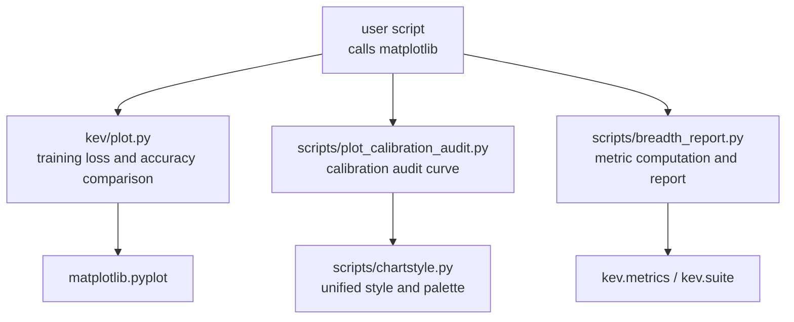
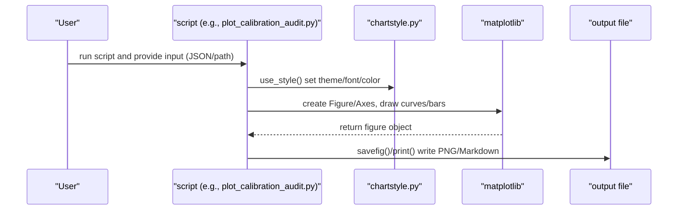
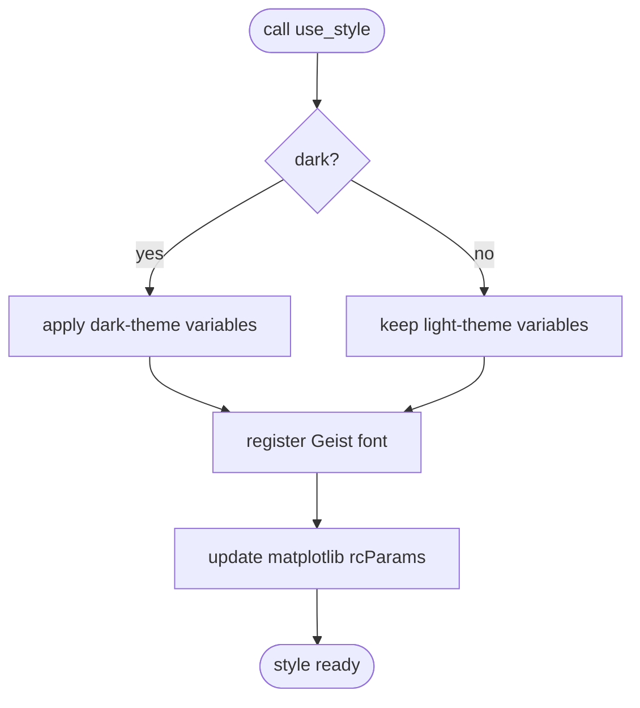
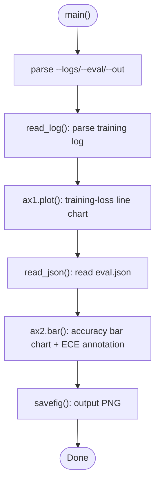
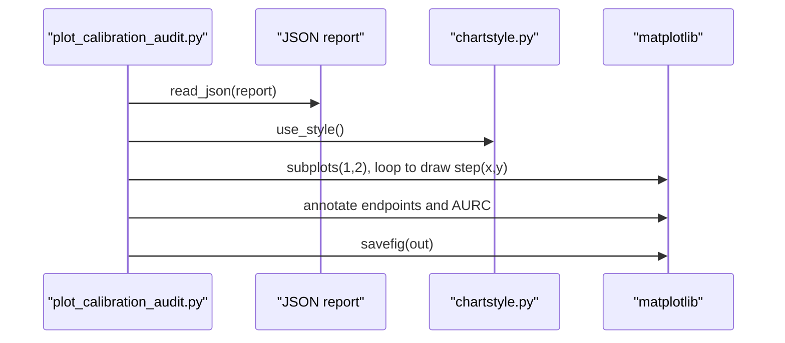
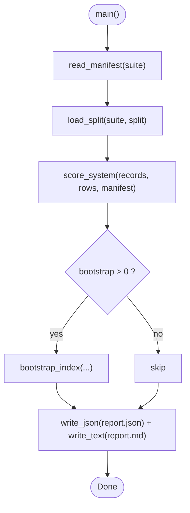
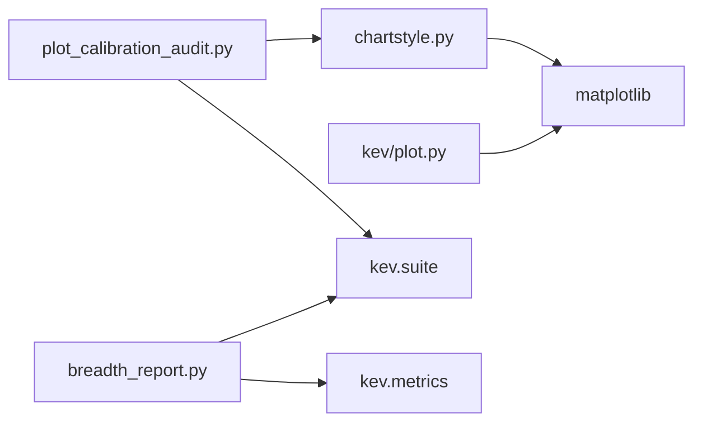
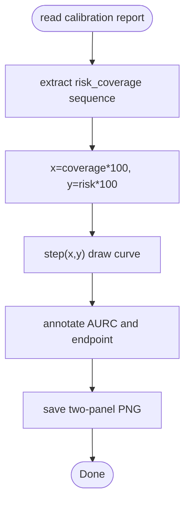

## Table of Contents
1. [Introduction](#introduction)
2. [Project Structure](#project-structure)
3. [Core Components](#core-components)
4. [Architecture Overview](#architecture-overview)
5. [Detailed Component Analysis](#detailed-component-analysis)
6. [Dependency Analysis](#dependency-analysis)
7. [Performance and Export](#performance-and-export)
8. [Interactive Visualization Options](#interactive-visualization-options)
9. [Calibration Curve Plotting and Analysis](#calibration-curve-plotting-and-analysis)
10. [Chart Style and Custom Development](#chart-style-and-custom-development)
11. [Visualization Strategies for Different Data Types](#visualization-strategies-for-different-data-types)
12. [Result Interpretation Guide](#result-interpretation-guide)
13. [Troubleshooting](#troubleshooting)
14. [Conclusion](#conclusion)

## Introduction
This guide targets the visualization needs of evaluation results. It focuses on the plotting capabilities and style system already present in the repository, explaining how to generate common charts such as bar charts, line charts, and scatter plots; explains the style configuration of chartstyle.py; documents the plotting and analysis methods for calibration curves; gives implementation ideas for interactive visualization; provides suggestions for custom-style extension; and summarizes the best visualization strategies for different data types, export/sharing methods, and key result-interpretation points.

## Project Structure
The code directly related to visualization is mainly distributed in the following locations:
- scripts/chartstyle.py: unified chart style, palette, fonts, and layout utility functions
- kev/plot.py: example plotting script for training loss and benchmark comparison
- scripts/plot_calibration_audit.py: calibration audit (risk-coverage) curve plotting script
- scripts/breadth_report.py: breadth evaluation report generation (including metric computation and Markdown output)

**Diagram Sources**
- [plot.py:1-60](file://kev/plot.py#L1-L60)
- [plot_calibration_audit.py:1-75](file://scripts/plot_calibration_audit.py#L1-L75)
- [breadth_report.py:1-200](file://scripts/breadth_report.py#L1-L200)
- [chartstyle.py:1-137](file://scripts/chartstyle.py#L1-L137)

**Section Sources**
- [plot.py:1-60](file://kev/plot.py#L1-L60)
- [plot_calibration_audit.py:1-75](file://scripts/plot_calibration_audit.py#L1-L75)
- [breadth_report.py:1-200](file://scripts/breadth_report.py#L1-L200)
- [chartstyle.py:1-137](file://scripts/chartstyle.py#L1-L137)

## Core Components
- Style system (chartstyle.py)
  - Provides global rcParams settings, font loading, light/dark theme switching, axis-border cleanup, and layout tools for titles/body/rule-lines/statistics
  - Built-in Vercel brand-color conversion and Kev/JEV/neutral color-series mapping
- Training loss and accuracy comparison (kev/plot.py)
  - Parses training logs and plots a log-scale training-loss line chart
  - Reads eval.json and plots a multi-model accuracy bar chart with ECE annotation
- Calibration audit curve (scripts/plot_calibration_audit.py)
  - Reads the risk_coverage sequence from the calibration audit report JSON and plots a two-panel curve of "low-error region" and "full range"
  - Uses chartstyle for a unified look, outputting AURC and endpoint annotations
- Breadth evaluation report (scripts/breadth_report.py)
  - Computes coverage-adjusted accuracy, chance level, skill index, and calibration metrics (ECE/Brier/NLL)
  - Outputs report.json and report.md, supporting paired-record-cluster Bootstrap confidence intervals

**Section Sources**
- [chartstyle.py:1-137](file://scripts/chartstyle.py#L1-L137)
- [plot.py:1-60](file://kev/plot.py#L1-L60)
- [plot_calibration_audit.py:1-75](file://scripts/plot_calibration_audit.py#L1-L75)
- [breadth_report.py:1-200](file://scripts/breadth_report.py#L1-L200)

## Architecture Overview
The visualization flow is typically driven by a user script that renders static images through matplotlib; the style layer is uniformly managed by chartstyle.py, ensuring a consistent visual language across scripts.

**Diagram Sources**
- [plot_calibration_audit.py:14-70](file://scripts/plot_calibration_audit.py#L14-L70)
- [chartstyle.py:65-87](file://scripts/chartstyle.py#L65-L87)

## Detailed Component Analysis

### Style System (chartstyle.py)
- Theme and palette
  - oklch_to_hex converts design tokens to sRGB hex
  - GRAY/BLUE/AMBER/GREEN/RED palettes; the KEV series distinguishes brightness by model size
  - DARK theme inverts the grayscale and KEV brightness order to ensure readability on a black background
- Global style
  - use_style(dark=False) sets font family, text/grid/axis colors, ticks, borderless legend, etc.
  - strip(ax) cleans up axis borders, keeping only necessary edges
- Layout tools
  - heading/body/rule/stat add titles, body text, rule lines, and statistics under the figure coordinate system
  - hbars draws a horizontal bar chart with a zero baseline, a single-label column, and a right-side value column, supporting emphasized rows and sub-labels

**Diagram Sources**
- [chartstyle.py:65-87](file://scripts/chartstyle.py#L65-L87)

**Section Sources**
- [chartstyle.py:17-55](file://scripts/chartstyle.py#L17-L55)
- [chartstyle.py:65-137](file://scripts/chartstyle.py#L65-L137)

### Training Loss and Accuracy Comparison (kev/plot.py)
- Training-loss line chart
  - Parses epoch/step/loss from the log via regular expressions
  - Uses optimizer step count as the x-axis and cross-entropy loss as the y-axis (log scale), marking epoch-boundary dashed lines
- Accuracy bar chart
  - Reads eval.json, comparing zero-shot base/instruct with kev-0.5b
  - Annotates ECE on each task, and the overall title summarizes ALL accuracy and ECE

**Diagram Sources**
- [plot.py:26-55](file://kev/plot.py#L26-L55)

**Section Sources**
- [plot.py:17-55](file://kev/plot.py#L17-L55)

### Calibration Audit Curve (scripts/plot_calibration_audit.py)
- Input: calibration audit report JSON (containing models[].risk_coverage sequence)
- Processing:
  - Validate that all curves are based on the same sample size
  - Iterate over models, using coverage*100 and risk*100 as x/y to draw a step line
  - Annotate each curve's endpoint and AURC in the right panel
- Output: two-panel PNG (low-error region and full range), unified style

**Diagram Sources**
- [plot_calibration_audit.py:14-69](file://scripts/plot_calibration_audit.py#L14-L69)
- [chartstyle.py:65-87](file://scripts/chartstyle.py#L65-L87)

**Section Sources**
- [plot_calibration_audit.py:14-69](file://scripts/plot_calibration_audit.py#L14-L69)

### Breadth Evaluation Report (scripts/breadth_report.py)
- Metric computation
  - dataset_score: coverage-adjusted accuracy, chance level, skill index, answered proportion
  - bootstrap_index: paired-record-cluster Bootstrap, yielding the 95% interval of indices and their differences
  - calibration: ECE/Brier/NLL/mean_conf
- Output
  - report.json: complete structured results
  - report.md: tables and textual explanation

**Diagram Sources**
- [breadth_report.py:160-195](file://scripts/breadth_report.py#L160-L195)

**Section Sources**
- [breadth_report.py:28-136](file://scripts/breadth_report.py#L28-L136)
- [breadth_report.py:160-195](file://scripts/breadth_report.py#L160-L195)

## Dependency Analysis
- External dependencies
  - matplotlib (Agg backend, suitable for GUI-less environments)
  - numpy (numerical computation)
  - json/pathlib (I/O)
- Internal dependencies
  - kev.suite: JSON read/write, dataset manifest and split loading
  - kev.metrics: calibration metrics (ECE/Brier/NLL)
  - kev.benchmark.labels: label mapping

**Diagram Sources**
- [chartstyle.py:11-14](file://scripts/chartstyle.py#L11-L14)
- [plot.py:6-9](file://kev/plot.py#L6-L9)
- [plot_calibration_audit.py:9-11](file://scripts/plot_calibration_audit.py#L9-L11)
- [breadth_report.py:21-23](file://scripts/breadth_report.py#L21-L23)

**Section Sources**
- [chartstyle.py:11-14](file://scripts/chartstyle.py#L11-L14)
- [plot.py:6-9](file://kev/plot.py#L6-L9)
- [plot_calibration_audit.py:9-11](file://scripts/plot_calibration_audit.py#L9-L11)
- [breadth_report.py:21-23](file://scripts/breadth_report.py#L21-L23)

## Performance and Export
- Rendering backend
  - Use matplotlib.use("Agg") to avoid GUI dependencies, suitable for servers and batch processing
- Resolution and size
  - plot.py defaults to dpi=160, plot_calibration_audit.py defaults to dpi=150
  - Balance clarity and file size by modifying figsize/dpi
- Output formats
  - PNG: suitable for reports and paper figures
  - Markdown: breadth_report.py outputs readable tables and explanations
- Batch-processing suggestions
  - Reuse chartstyle.use_style() to reduce repeated initialization
  - Merge multiple subplots into one Figure to reduce I/O overhead

**Section Sources**
- [plot.py:33-55](file://kev/plot.py#L33-L55)
- [plot_calibration_audit.py:23-69](file://scripts/plot_calibration_audit.py#L23-L69)
- [breadth_report.py:191-195](file://scripts/breadth_report.py#L191-L195)

## Interactive Visualization Options
The current repository is mainly based on static plotting. If interactivity is needed, the following options can be considered:
- Based on Bokeh/Holoviews
  - Convert existing pandas/numpy data into a Bokeh ColumnDataSource
  - Use hv.Curve/hv.Bar to build interactive curves/bar charts
- Based on Streamlit/Gradio
  - Wrap chartstyle and plotting functions as page components
  - Provide parameter controls (theme, color, threshold) to refresh charts in real time
- Based on Plotly
  - Convert risk_coverage and accuracy data into Plotly traces
  - Add zoom, hover tooltips, and PNG/SVG export

Note: the above are conceptual options and do not directly correspond to specific implementation files in the repository.

## Calibration Curve Plotting and Analysis
- Risk-Coverage Curve
  - x-axis: percentage of accepted questions (coverage*100)
  - y-axis: error rate among accepted questions (risk*100)
  - The closer the curve is to the lower-left corner, the better it means "maintaining a lower error rate at a higher acceptance rate"; the smaller the AURC, the better
- Plotting steps
  - Extract the risk_coverage sequence from the report
  - Use step(x, y, where="pre") to draw a step curve
  - Two-panel display: left focuses on the low-error region, right shows the full range
  - Annotate each curve's AURC and endpoint
- Analysis points
  - Compare the risk of different models/variants at the same coverage
  - Pay attention to curve inflection points and plateau segments to identify "high-confidence but high-risk" regions
  - Combine ECE/Brier/NLL to comprehensively evaluate calibration quality

**Diagram Sources**
- [plot_calibration_audit.py:27-69](file://scripts/plot_calibration_audit.py#L27-L69)

**Section Sources**
- [plot_calibration_audit.py:27-69](file://scripts/plot_calibration_audit.py#L27-L69)

## Chart Style and Custom Development
- Use chartstyle's unified API
  - use_style(dark=True/False) to switch themes
  - strip(ax) to clean up borders
  - heading/body/rule/stat for quick layout
  - hbars to draw standardized horizontal bar charts
- Custom colors and series
  - Add new keys in the KEV/NEUTRAL/JEV dictionaries, or synchronize the mapping in DARK
  - Use oklch_to_hex to generate colors consistent with design tokens
- Fonts and layout
  - Automatically register the Geist font, falling back to DejaVu Sans
  - Control grid, ticks, legend, and other details via rcParams
- Extension suggestions
  - Add a new plot_type function (e.g., scatter/heatmap) following hbars' parameter conventions
  - Encapsulate common combinations as compose(fig, axes, title, body, stats)

**Section Sources**
- [chartstyle.py:17-55](file://scripts/chartstyle.py#L17-L55)
- [chartstyle.py:65-137](file://scripts/chartstyle.py#L65-L137)

## Visualization Strategies for Different Data Types
- Categorical accuracy/coverage
  - Use hbars or bar to show multi-model comparison, with a zero baseline and a right-side value column
  - Emphasize key rows (emphasize) and add sub-labels for explanation
- Time series/training process
  - Use plot to draw line charts, with log scale when necessary
  - Use axvline to mark important nodes (e.g., end of epoch)
- Calibration curve
  - Use step to draw a step curve, focusing different intervals via two panels
  - Annotate AURC and endpoints for easy horizontal comparison
- Distribution/scatter
  - Use scatter to show the relationship between predicted probability and ground-truth label
  - Combine with binned histograms to observe calibration bias

[This section is general guidance and does not directly analyze specific files]

## Result Interpretation Guide
- Training-loss line chart
  - Observe the downward trend and convergence speed; fluctuations may occur at epoch boundaries
  - The lower and more stable the final loss, the better the fit usually is
- Accuracy bar chart
  - Compare baseline with the target model, focusing on improvement magnitude and stability
  - Lower ECE means better calibration; combine with accuracy to judge "accurate and trustworthy"
- Risk-coverage curve
  - Closer to the lower-left is better; the smaller the AURC, the better it means "maintaining a lower error rate while accepting more questions"
  - Combine ECE/Brier/NLL to comprehensively evaluate calibration quality
- Breadth evaluation report
  - The Skill index (chance-corrected) better reflects true capability
  - Pay attention to the answered proportion and chance level to avoid misjudging the impact of rejected samples

[This section is general guidance and does not directly analyze specific files]

## Troubleshooting
- Missing font
  - Symptom: title/body display is abnormal
  - Handling: confirm the Geist font exists; use_style attempts to register it and falls back to DejaVu Sans on failure
- Inconsistent theme colors
  - Symptom: chart colors do not match expectations
  - Handling: check whether use_style(dark=True) was called, and read BG/TEXT etc. via module-level constants after calling
- Calibration curve error
  - Symptom: ValueError: curves must describe equal-size populations
  - Handling: ensure all models' risk_coverage are based on the same sample size
- Output file conflict
  - Symptom: FileExistsError
  - Handling: ensure the output path does not exist or delete the old file first

**Section Sources**
- [chartstyle.py:65-87](file://scripts/chartstyle.py#L65-L87)
- [plot_calibration_audit.py:21-29](file://scripts/plot_calibration_audit.py#L21-L29)

## Conclusion
This guide reviews the key components and usage related to evaluation-result visualization in the repository: a unified style system centered on chartstyle.py, together with the typical chart templates provided by kev/plot.py and scripts/plot_calibration_audit.py, can quickly generate high-quality static visualizations. For interactive needs, ecosystems such as Bokeh/Streamlit/Plotly can be introduced on top of the existing data pipeline. Through comprehensive analysis of risk-coverage curves and calibration metrics, the model's accuracy and reliability can be evaluated more thoroughly.
