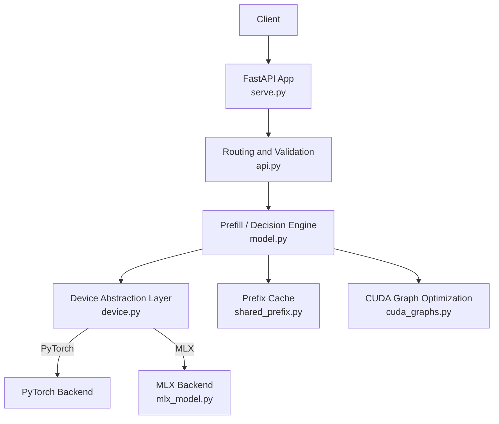
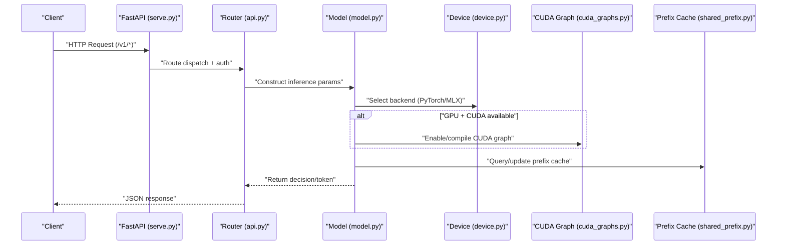
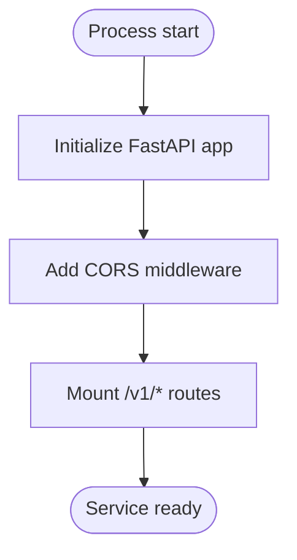
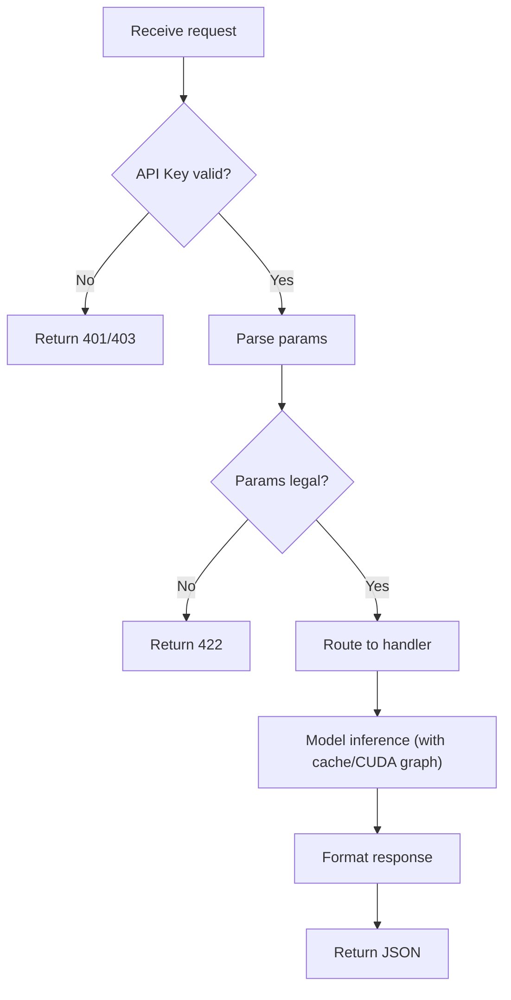
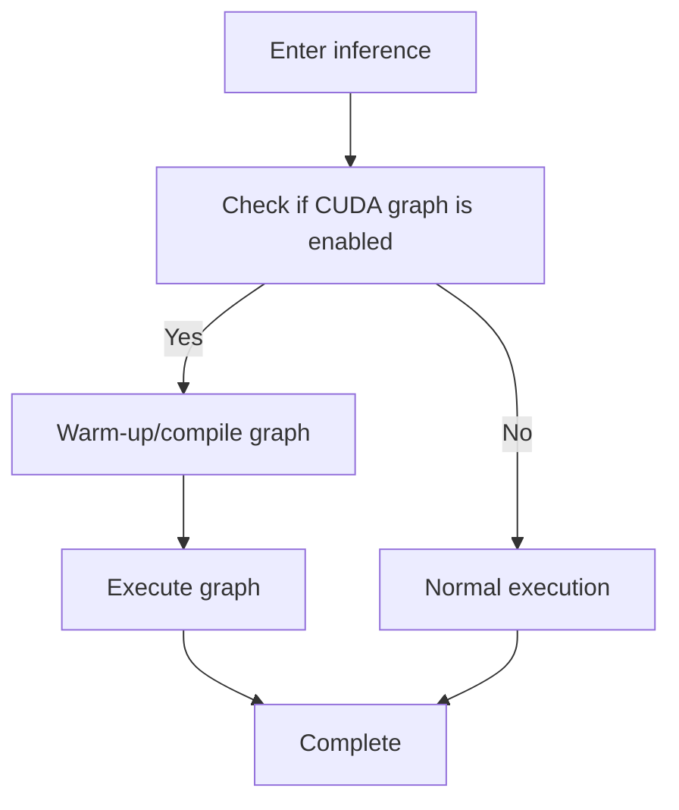
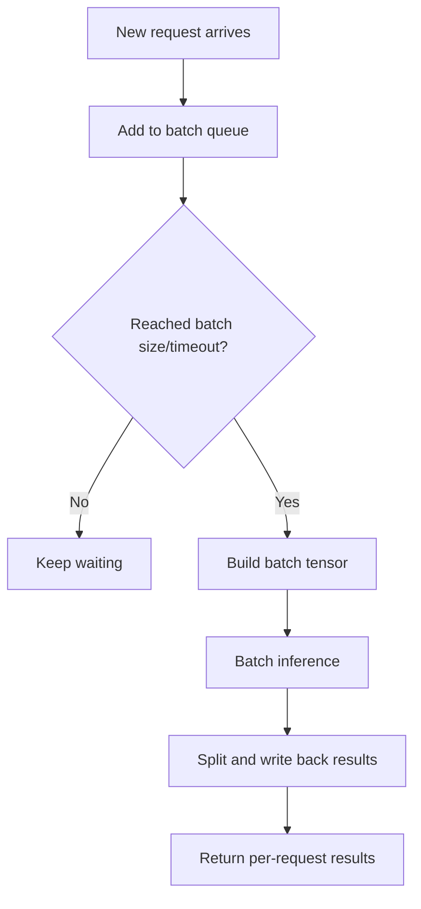
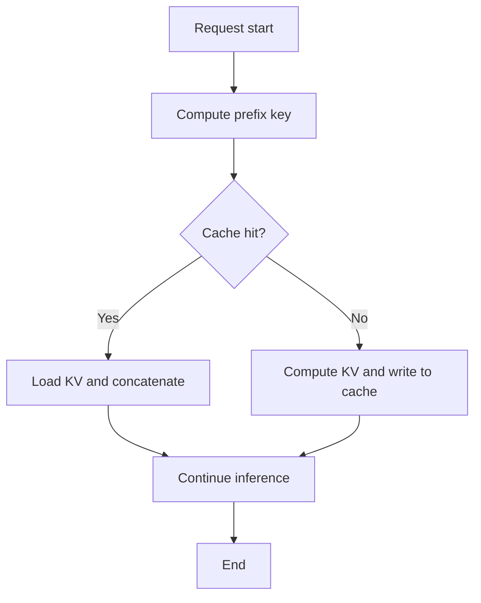
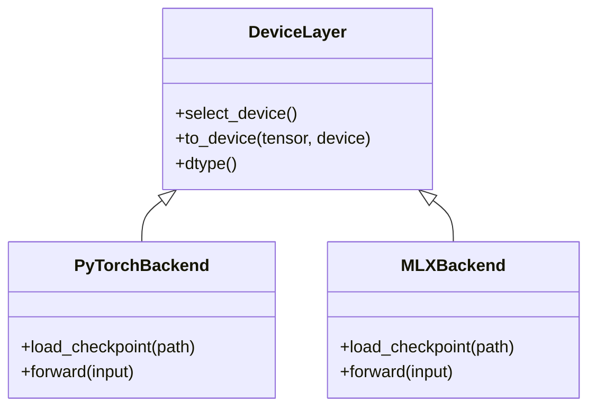
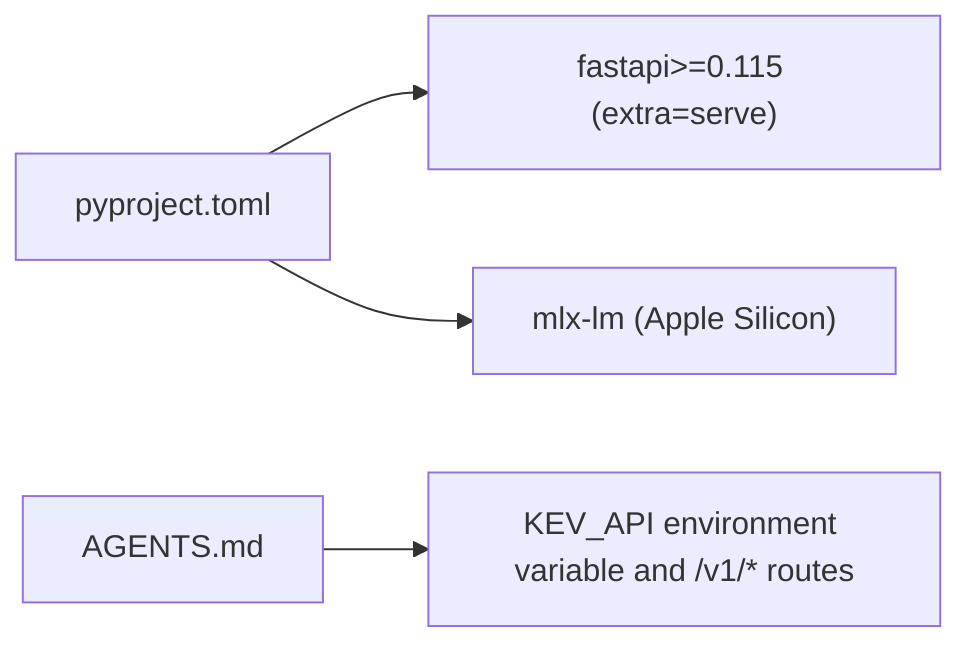

## Table of Contents
1. [Introduction](#introduction)
2. [Project Structure](#project-structure)
3. [Core Components](#core-components)
4. [Architecture Overview](#architecture-overview)
5. [Detailed Component Analysis](#detailed-component-analysis)
6. [Dependency Analysis](#dependency-analysis)
7. [Performance Considerations](#performance-considerations)
8. [Troubleshooting Guide](#troubleshooting-guide)
9. [Conclusion](#conclusion)
10. [Appendix](#appendix)

## Introduction
This document covers the deployment and usage of the Kev inference service, focusing on FastAPI-side startup configuration, request processing flow, and response formatting; it explains how CUDA graph optimization, batching, and prefix caching improve inference throughput and latency; it documents the device abstraction layer's unified interface for the PyTorch and MLX backends as well as CPU/GPU/Apple Silicon; it gives configuration items such as port binding, API key validation, and dtype selection; and it provides best practices for batch-size tuning, memory optimization, concurrency handling, monitoring and logging, along with common troubleshooting.

## Project Structure
The Kev inference service uses FastAPI as the HTTP entry point, with the core logic inside the kev package:
- Service entry and routing: serve.py, api.py
- Model and device abstraction: model.py, device.py, mlx_model.py
- Performance optimization: cuda_graphs.py (CUDA Graph), shared_prefix.py (prefix cache)
- Dependencies and optional features: pyproject.toml (FastAPI and serve extras)
- Usage instructions and environment variables: AGENTS.md (FastAPI address, Playground proxy notes)

Diagram sources
- [serve.py:227-230](file://kev/serve.py#L227-L230)
- [api.py:1-50](file://kev/api.py#L1-L50)
- [model.py:1-50](file://kev/model.py#L1-L50)
- [device.py:1-50](file://kev/device.py#L1-L50)
- [mlx_model.py:1-50](file://kev/mlx_model.py#L1-L50)
- [cuda_graphs.py:1-50](file://kev/cuda_graphs.py#L1-L50)
- [shared_prefix.py:1-50](file://kev/shared_prefix.py#L1-L50)

Section sources
- [serve.py:1-30](file://kev/serve.py#L1-L30)
- [AGENTS.md:336-340](file://AGENTS.md#L336-L340)

## Core Components
- FastAPI app and middleware: create the FastAPI instance, register CORS, mount routes, and unify error responses.
- Routing and authentication: provide endpoints such as /v1/systemone and /v1/models, supporting API Key validation.
- Model loading and inference: encapsulate the prefill and decision process, interfacing with the device abstraction layer.
- Device abstraction layer: unify the PyTorch and MLX backends, hiding CPU/GPU/Apple Silicon differences.
- Performance optimization:
  - CUDA graph: reduce kernel launch overhead and stabilize small-batch inference latency.
  - Batching: merge similar requests to improve GPU utilization.
  - Prefix cache: reuse historical KV states to reduce repeated context computation cost.

Section sources
- [serve.py:17-20](file://kev/serve.py#L17-L20)
- [serve.py:206-230](file://kev/serve.py#L206-L230)
- [api.py:1-50](file://kev/api.py#L1-L50)
- [model.py:1-50](file://kev/model.py#L1-L50)
- [device.py:1-50](file://kev/device.py#L1-L50)
- [cuda_graphs.py:1-50](file://kev/cuda_graphs.py#L1-L50)
- [shared_prefix.py:1-50](file://kev/shared_prefix.py#L1-L50)

## Architecture Overview
The diagram below shows the critical path from HTTP request to model inference, including authentication, route dispatch, device selection, CUDA graph execution, prefix cache hit, and result return.

Diagram sources
- [serve.py:227-230](file://kev/serve.py#L227-L230)
- [api.py:1-50](file://kev/api.py#L1-L50)
- [model.py:1-50](file://kev/model.py#L1-L50)
- [device.py:1-50](file://kev/device.py#L1-L50)
- [cuda_graphs.py:1-50](file://kev/cuda_graphs.py#L1-L50)
- [shared_prefix.py:1-50](file://kev/shared_prefix.py#L1-L50)

## Detailed Component Analysis

### FastAPI Service Startup and Configuration
- App initialization: create the FastAPI instance and set the title.
- Middleware: enable CORS to support Playground cross-origin access.
- Route mounting: register endpoints such as /v1/systemone and /v1/models.
- Process and concurrency: synchronous endpoints run in a thread pool, limited by batch size and queue.
- Environment variables and ports: the service address is exposed via environment variables by default; the Playground accesses it through a reverse proxy on the browser side.

Diagram sources
- [serve.py:227-230](file://kev/serve.py#L227-L230)
- [serve.py:17-20](file://kev/serve.py#L17-L20)
- [AGENTS.md:336-340](file://AGENTS.md#L336-L340)

Section sources
- [serve.py:17-20](file://kev/serve.py#L17-L20)
- [serve.py:206-230](file://kev/serve.py#L206-L230)
- [AGENTS.md:336-340](file://AGENTS.md#L336-L340)

### Request Processing Flow and Response Formatting
- Authentication: validate based on the API Key in the request header or parameters; on failure return a standard error body.
- Parameter parsing: convert input messages, system prompts, sampling parameters, etc. into internal data structures.
- Inference scheduling: call the model prefill and decision logic, triggering batch merging when necessary.
- Response wrapping: unified JSON format, including decision results, metadata, and timing statistics.

Diagram sources
- [api.py:1-50](file://kev/api.py#L1-L50)
- [serve.py:206-230](file://kev/serve.py#L206-L230)

Section sources
- [api.py:1-50](file://kev/api.py#L1-L50)
- [serve.py:206-230](file://kev/serve.py#L206-L230)

### CUDA Graph Optimization
- Goal: reduce kernel launch and synchronization overhead, stabilizing short-sequence inference latency.
- Applicability: fixed-shape or normalizable input batches, with GPU driver and CUDA versions meeting requirements.
- Lifecycle: first warm-up compiles the graph, subsequent runs reuse it; on exception falls back to the normal execution path.

Diagram sources
- [cuda_graphs.py:1-50](file://kev/cuda_graphs.py#L1-L50)
- [model.py:1-50](file://kev/model.py#L1-L50)

Section sources
- [cuda_graphs.py:1-50](file://kev/cuda_graphs.py#L1-L50)
- [model.py:1-50](file://kev/model.py#L1-L50)

### Batching Mechanism
- Purpose: aggregate multiple similar requests to maximize GPU parallelism.
- Strategy: trigger merging by time window or threshold; prioritize merging requests with a shared prefix.
- Risk: tail latency may rise, requiring timeout and priority control.

Diagram sources
- [model.py:1-50](file://kev/model.py#L1-L50)
- [serve.py:206-230](file://kev/serve.py#L206-L230)

Section sources
- [model.py:1-50](file://kev/model.py#L1-L50)
- [serve.py:206-230](file://kev/serve.py#L206-L230)

### Prefix Cache Mechanism
- Principle: cache the KV states of historical contexts; on a hit, skip the repeated computation.
- Key design: based on features such as the system prompt, user message hash, and length.
- Eviction policy: LRU/TTL and VRAM upper-bound control.

Diagram sources
- [shared_prefix.py:1-50](file://kev/shared_prefix.py#L1-L50)
- [model.py:1-50](file://kev/model.py#L1-L50)

Section sources
- [shared_prefix.py:1-50](file://kev/shared_prefix.py#L1-L50)
- [model.py:1-50](file://kev/model.py#L1-L50)

### Device Abstraction Layer (PyTorch and MLX)
- Abstraction goal: unify device selection and tensor operations across CPU/GPU/Apple Silicon.
- Backend implementations:
  - PyTorch: suitable for NVIDIA GPUs and CPU.
  - MLX: suitable for Apple Silicon.
- Runtime switching: automatically detect the backend based on environment or configure it explicitly.

Diagram sources
- [device.py:1-50](file://kev/device.py#L1-L50)
- [mlx_model.py:1-50](file://kev/mlx_model.py#L1-L50)
- [model.py:1-50](file://kev/model.py#L1-L50)

Section sources
- [device.py:1-50](file://kev/device.py#L1-L50)
- [mlx_model.py:1-50](file://kev/mlx_model.py#L1-L50)
- [model.py:1-50](file://kev/model.py#L1-L50)

## Dependency Analysis
- FastAPI is an optional dependency, installed via extra=serve; the playground accesses the /kev path through a reverse proxy to avoid browser CORS issues.
- The MLX backend is introduced via extra dependencies on Apple Silicon.

Diagram sources
- [pyproject.toml:38-40](file://pyproject.toml#L38-L40)
- [AGENTS.md:336-340](file://AGENTS.md#L336-L340)

Section sources
- [pyproject.toml:38-40](file://pyproject.toml#L38-L40)
- [AGENTS.md:336-340](file://AGENTS.md#L336-L340)

## Performance Considerations
- Batch size setting
  - Adjust based on VRAM capacity and latency targets; long-context scenarios suggest smaller batch sizes to lower peak VRAM.
  - Evaluate actual gains in combination with prefix cache hit rate.
- Memory optimization
  - Enable the prefix cache and set a reasonable TTL/LRU upper bound.
  - Use half precision or lower-precision types (e.g., float16/bfloat16), paying attention to numerical stability.
  - Disable unnecessary debug output and intermediate-state saving.
- Concurrency handling
  - FastAPI synchronous endpoints use a thread pool for concurrency by default; horizontal scaling can be done via a reverse proxy or container orchestration.
  - For high-concurrency scenarios, enable request rate limiting and queue-depth protection.
- CUDA graph
  - Enable only in scenarios with stable shapes; frequent shape changes cause frequent recompilation.
  - The warm-up phase should cover typical input distributions.
- Monitoring and logging
  - Record per-request time, batch size, cache hit rate, device utilization, and VRAM usage.
  - Use structured logging for easy aggregation and analysis; instrument slow requests and exception paths.

[This section is general guidance and does not directly analyze specific files]

## Troubleshooting Guide
- Cannot connect to the service
  - Check whether the KEV_API environment variable and port are correct; confirm the Playground proxy path /kev is configured.
- Authentication failure
  - Verify whether the API Key is passed correctly; whether the server has key validation enabled.
- Out of memory
  - Reduce batch size, enable prefix cache, lower precision, or shorten the context length.
- CUDA graph exception
  - Check the driver and CUDA versions; disable CUDA graph and fall back to the normal path.
- MLX backend unavailable
  - Confirm that the MLX-related dependencies are installed on Apple Silicon; environment variables do not force PyTorch.

Section sources
- [AGENTS.md:336-340](file://AGENTS.md#L336-L340)
- [serve.py:206-230](file://kev/serve.py#L206-L230)
- [cuda_graphs.py:1-50](file://kev/cuda_graphs.py#L1-L50)
- [mlx_model.py:1-50](file://kev/mlx_model.py#L1-L50)

## Conclusion
The Kev inference service provides a clean HTTP interface via FastAPI, combining a device abstraction layer that is compatible with both PyTorch and MLX backends, and significantly improving performance on GPU through CUDA graph, batching, and prefix cache. Reasonable batch size, precision, and cache strategies, together with complete monitoring and logging, yield a stable and efficient inference experience across different hardware platforms.

[This section is summary content and does not directly analyze specific files]

## Appendix
- Common configuration items
  - Port binding: configure via environment variable or reverse proxy; the default service address is specified by KEV_API.
  - API key validation: enable on the server side and carry the key on the client side.
  - Dtype selection: choose float32/float16/bfloat16 based on device capability and precision requirements.
- Reference files
  - FastAPI app and routing: serve.py, api.py
  - Device and backends: device.py, mlx_model.py, model.py
  - Performance optimization: cuda_graphs.py, shared_prefix.py
  - Dependencies and environment: pyproject.toml, AGENTS.md

[This section is supplementary information and does not directly analyze specific files]
