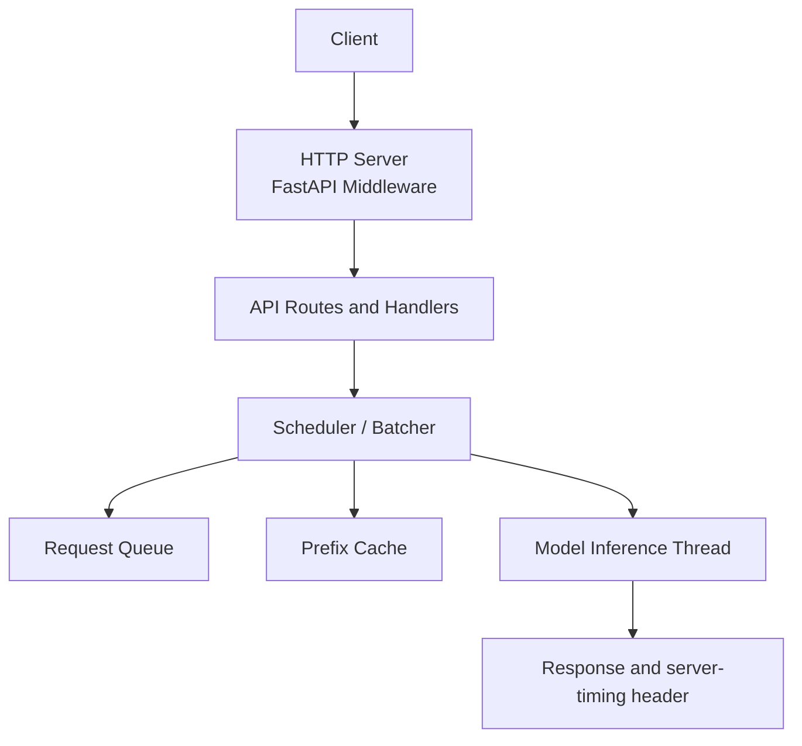
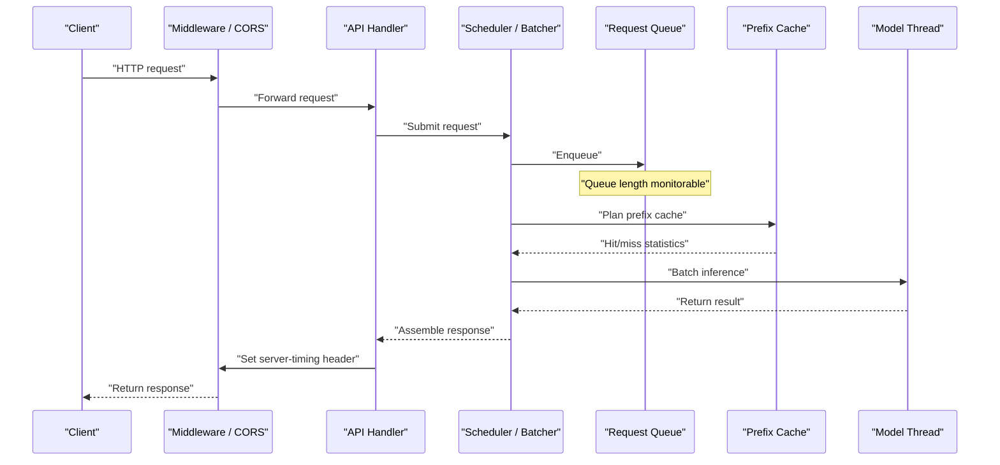
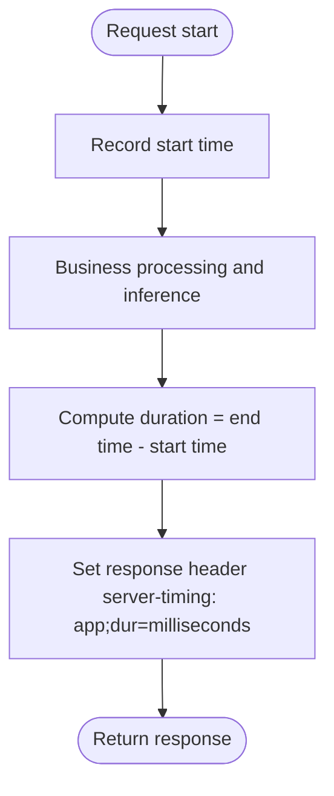
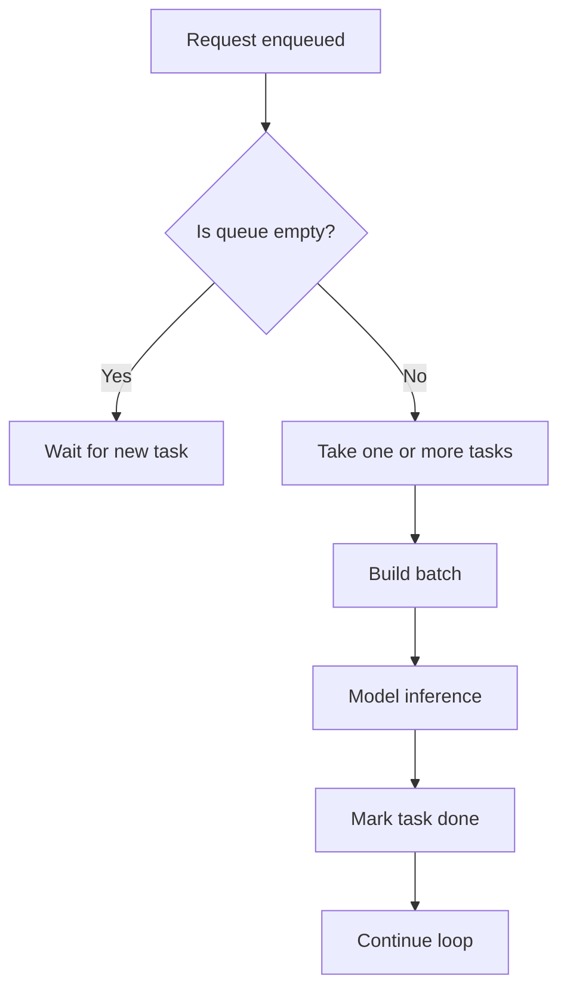
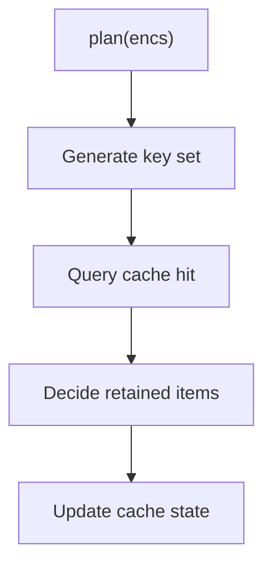
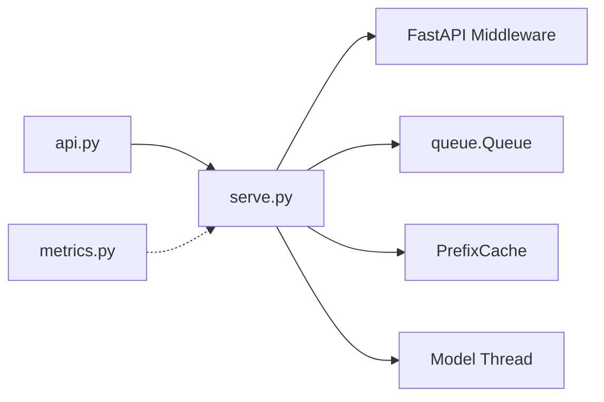

## Table of Contents
1. [Introduction](#introduction)
2. [Project Structure](#project-structure)
3. [Core Components](#core-components)
4. [Architecture Overview](#architecture-overview)
5. [Detailed Component Analysis](#detailed-component-analysis)
6. [Dependency Analysis](#dependency-analysis)
7. [Performance Considerations](#performance-considerations)
8. [Diagnostics Guide](#diagnostics-guide)
9. [Conclusion](#conclusion)
10. [Appendix](#appendix)

## Introduction
This document is aimed at the production operation and observability of the Kev inference service, focusing on the following goals:
- Built-in monitoring metrics: batch count, request count, queue length, prefix cache hit rate, OOM retry count, etc.
- How to use the server-timing response header and the distinction between in-process time and network transfer time.
- Logging strategy: the format and content of request logs, error logs, and performance logs.
- External monitoring system integration: suggestions for connecting tools such as Prometheus and Grafana.
- Configuration and usage of health check endpoints.
- Diagnostics: memory leak detection, performance bottleneck identification, and error pattern analysis.
- Production best practices and example alert rules.

## Project Structure
The entry point of the Kev inference service is in serve.py, which is responsible for starting the HTTP service, registering middleware, handling requests, maintaining the model thread and queue, managing the prefix cache, and setting response headers. The API layer api.py provides the external interface definitions; metrics.py provides evaluation and measurement utilities; AGENTS.md contains descriptions of server-timing.

**Diagram sources**
- [serve.py:228-240](file://kev/serve.py#L228-L240)
- [serve.py:112-177](file://kev/serve.py#L112-L177)
- [serve.py:143-167](file://kev/serve.py#L143-L167)

**Section sources**
- [serve.py:112-177](file://kev/serve.py#L112-L177)
- [serve.py:228-240](file://kev/serve.py#L228-L240)

## Core Components
- HTTP service and middleware: enable CORS, expose necessary response headers (including server-timing).
- Request scheduling and batching: place requests into a queue, retrieve and execute inference in batches.
- Prefix cache: cache shared prefixes to improve throughput and reduce repeated computation.
- Model thread: a separate thread executes batched inference to avoid blocking request threads.
- Response headers and timing: attach server-timing to the response, marking in-process time.

Key responsibility mapping:
- Queue length: reflected by the length of queue.Queue, usable for monitoring queue backlogs.
- Batch count: each time one or more tasks are taken from the queue to form a batch; batch size can be obtained via statistics.
- Request count: every request entering the API should be counted (can be implemented in middleware or handlers).
- Prefix cache hit rate: derived from the hit/miss statistics of PrefixCache.
- OOM retry count: when out of memory occurs, the retry count can be recorded for alerting.

**Section sources**
- [serve.py:112-177](file://kev/serve.py#L112-L177)
- [serve.py:228-240](file://kev/serve.py#L228-L240)

## Architecture Overview
The diagram below shows the processing flow of a typical request, including the interaction between middleware, API handlers, scheduler, queue, prefix cache, and model thread, as well as where the server-timing header is written.

**Diagram sources**
- [serve.py:228-240](file://kev/serve.py#L228-L240)
- [serve.py:143-177](file://kev/serve.py#L143-L177)

## Detailed Component Analysis

### Server Timing Header server-timing
- Purpose: attach server-timing to the response header, marking "in-process time", so as to distinguish it from network transfer time.
- Field meaning: app;dur=... indicates the processing time within the current process (milliseconds), convenient for front-end or gateway visualization and comparison.
- Exposed header: the middleware needs to add server-timing to expose_headers so the client can read it.

**Diagram sources**
- [serve.py:228-240](file://kev/serve.py#L228-L240)

**Section sources**
- [serve.py:228-240](file://kev/serve.py#L228-L240)
- [AGENTS.md:327](file://AGENTS.md#L327)

### Queue and Batching
- Queue: uses queue.Queue to hold pending requests, supporting concurrent access.
- Batching: the model thread periodically takes tasks from the queue and aggregates them into batches as much as possible to improve throughput.
- Stop logic: when the service stops, clear the queue and notify waiters of failure.

**Diagram sources**
- [serve.py:143-167](file://kev/serve.py#L143-L167)
- [serve.py:124-128](file://kev/serve.py#L124-L128)

**Section sources**
- [serve.py:143-167](file://kev/serve.py#L143-L167)
- [serve.py:124-128](file://kev/serve.py#L124-L128)

### Prefix Cache
- Purpose: cache shared prefixes to reduce repeated computation and improve overall throughput.
- Key operations: plan(encs) is used to plan which prefixes need to be cached, which are hits, and which are retained.
- Metric: hit rate = hit count / (hit count + miss count).

**Diagram sources**
- [serve.py:177-180](file://kev/serve.py#L177-L180)

**Section sources**
- [serve.py:177-180](file://kev/serve.py#L177-L180)

### Metrics and Measurement
- metrics.py provides evaluation and measurement utilities, such as calibration, choice prediction, and temperature fitting.
- In production, these metrics can be used as offline evaluation or online sampling metrics, exported in combination with Prometheus.

**Section sources**
- [metrics.py:1-200](file://kev/metrics.py#L1-L200)

## Dependency Analysis
- serve.py depends on FastAPI middleware to expose the server-timing header.
- serve.py internally couples the queue, prefix cache, and model thread, forming a highly cohesive service core.
- api.py provides the external interface and collaborates with the scheduler in serve.py.
- metrics.py is an evaluation and calibration utility that usually does not directly participate in the online path, but can serve as a source of offline or sampled metrics.

**Diagram sources**
- [serve.py:228-240](file://kev/serve.py#L228-L240)
- [serve.py:112-177](file://kev/serve.py#L112-L177)

**Section sources**
- [serve.py:112-177](file://kev/serve.py#L112-L177)
- [serve.py:228-240](file://kev/serve.py#L228-L240)

## Performance Considerations
- Batch size tuning: adjust batch size based on GPU/CPU resources and latency targets, balancing throughput and latency.
- Queue length monitoring: when the queue length keeps growing, it may indicate insufficient backend processing capacity or a blockage.
- Prefix cache hit rate: a low hit rate may cause repeated computation; the input distribution or cache strategy needs optimization.
- server-timing analysis: compare the app duration with the end-to-end duration to identify the ratio of network transfer to backend processing.

[This section is general guidance and requires no specific file references]

## Diagnostics Guide

### Memory Leak Detection
- Observe the process memory growth trend and locate the leak point using GC logs and heap snapshots.
- Watch whether the prefix cache grows unbounded; limit the cache size or cleanup strategy if necessary.
- Monitor the OOM retry count; if it triggers frequently, check the batch size and VRAM usage.

**Section sources**
- [serve.py:112-177](file://kev/serve.py#L112-L177)

### Performance Bottleneck Identification
- Use server-timing to analyze the proportion of in-process time and identify hot paths.
- Monitor queue length and batching cycles to judge whether there is backpressure or blockage.
- Analyze the prefix cache hit rate and optimize input features to reduce misses.

**Section sources**
- [serve.py:228-240](file://kev/serve.py#L228-L240)
- [serve.py:143-177](file://kev/serve.py#L143-L177)

### Error Pattern Analysis
- Capture and record exception types, stack traces, and context information for easy classification and attribution.
- Handle and prompt specifically for exceptions when the queue stops (e.g., "service stopped").
- Count and alert on OOM retries to avoid a cascading failure effect.

**Section sources**
- [serve.py:124-128](file://kev/serve.py#L124-L128)

## Conclusion
The Kev inference service exposes the server-timing header through middleware, clearly distinguishing in-process time from network transfer time; improves throughput and efficiency through the queue and prefix cache; and provides evaluation and calibration capabilities through metrics.py. In production, it is recommended to build a complete monitoring and alerting system with Prometheus and Grafana, focusing on queue length, batch count, prefix cache hit rate, and OOM retry count, and using server-timing for performance profiling and problem localization.

[This section is summary content and requires no specific file references]

## Appendix

### Built-in Monitoring Metrics List
- Batch count: the number of requests processed per batch.
- Request count: the total number of requests entering the API.
- Queue length: the current number of requests waiting to be processed.
- Prefix cache hit rate: the ratio of hits to total requests.
- OOM retry count: the number of retries triggered by out-of-memory.

[This section is a conceptual list and requires no specific file references]

### External Monitoring System Integration Suggestions
- Prometheus: expose the above metrics through a custom collector, or use an existing library (such as prometheus-client) for instrumentation.
- Grafana: create a dashboard showing queue length, batch count, hit rate, OOM retries, and server-timing distribution.
- Log aggregation: centrally collect request logs, error logs, and performance logs into platforms such as ELK/Loki for easy search and analysis.

[This section is general guidance and requires no specific file references]

### Health Check Endpoints
- It is recommended to provide a /health or /ready endpoint that returns summary information such as service status, GPU availability, queue length, and cache hit rate.
- Use this endpoint for liveness and readiness probes in load balancers or orchestration platforms.

[This section is general guidance and requires no specific file references]

### Production Best Practices and Example Alert Rules
- Queue length keeps rising above a threshold: trigger scaling out or rate limiting.
- Prefix cache hit rate below a threshold: check the input distribution and cache strategy.
- OOM retry count spikes: alert immediately and automatically degrade or scale out.
- server-timing in-process P95 duration rises: investigate hot paths and resource contention.

[This section is general guidance and requires no specific file references]
