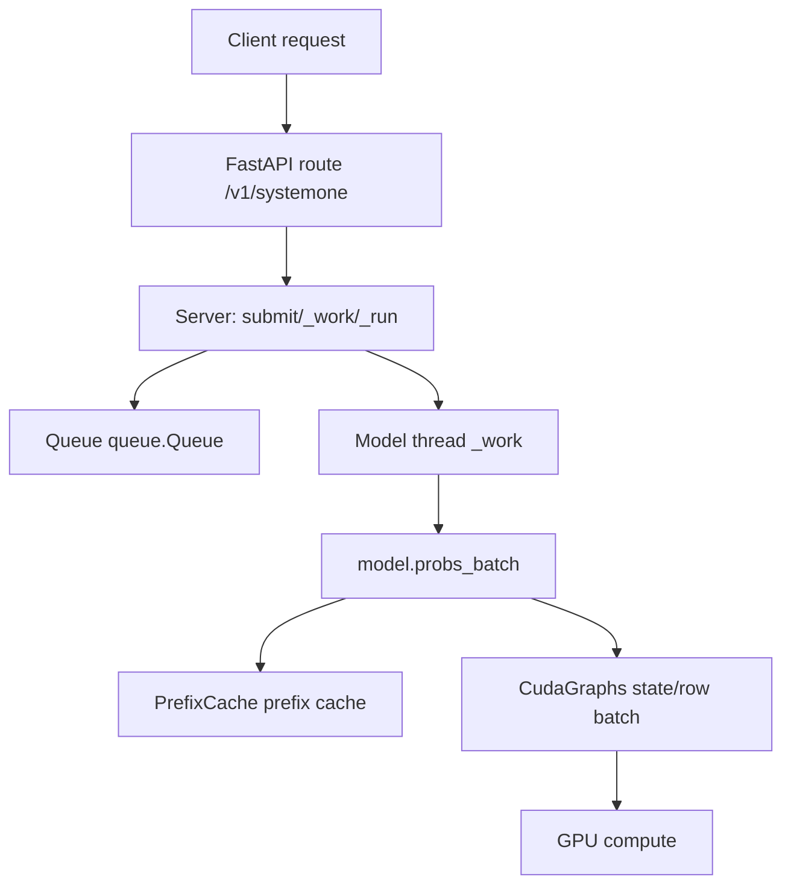
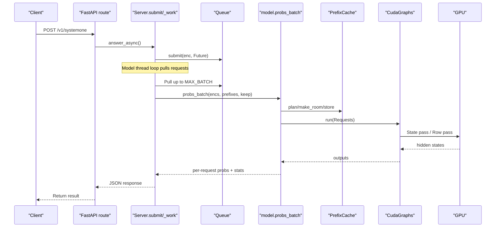
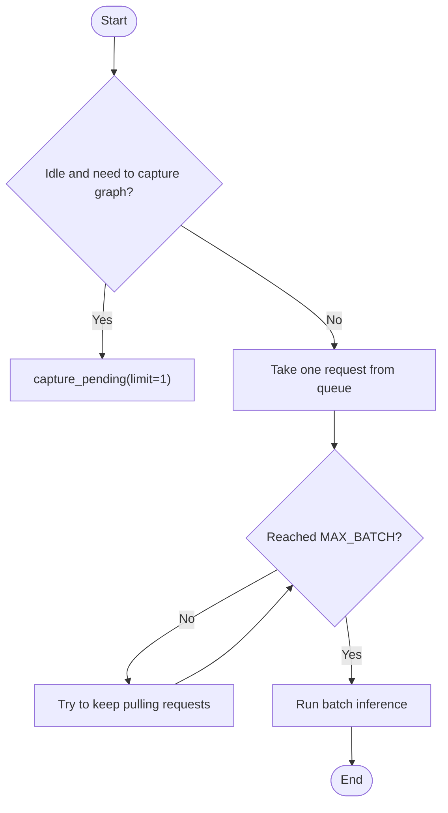
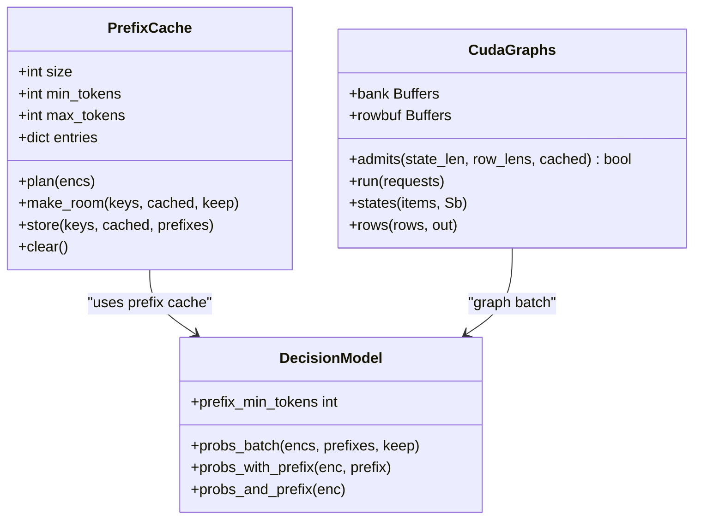
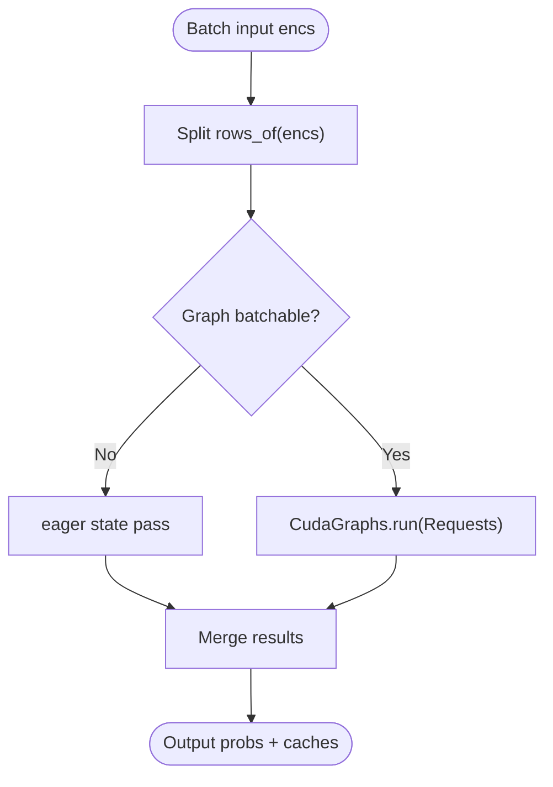
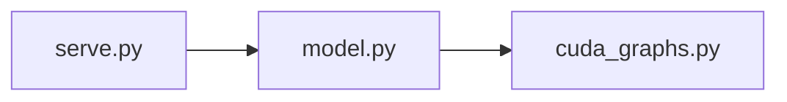

## Table of Contents
1. [Introduction](#introduction)
2. [Project Structure](#project-structure)
3. [Core Components](#core-components)
4. [Architecture Overview](#architecture-overview)
5. [Detailed Component Analysis](#detailed-component-analysis)
6. [Dependency Analysis](#dependency-analysis)
7. [Performance Considerations](#performance-considerations)
8. [Troubleshooting Guide](#troubleshooting-guide)
9. [Conclusion](#conclusion)
10. [Appendix](#appendix)

## Introduction
This document targets the "batch processing mechanism" in the Kev inference service. It systematically explains how requests are grouped, how lengths are grouped, how dynamic batch size is adjusted, and the role and tuning method of the MAX_BATCH configuration. The document also covers GPU memory optimization (prefix cache, CUDA Graphs, row batching), pipeline design (coordination of state batching and row batching), and provides latency vs throughput trade-off strategies, performance analysis methods, and optimization cases under different load scenarios.

## Project Structure
The batch processing in this project mainly involves three modules:
- Service-layer scheduling and queue: responsible for receiving requests, maintaining the model thread, and pulling requests by MAX_BATCH to execute batch inference.
- Model-layer batch interface: provides interfaces such as probs_batch, probs_with_prefix, probs_and_prefix, supporting state prefix reuse and row batching.
- CUDA Graphs batching: records and replays graphs for the state pass and row pass of the hybrid architecture (Qwen3.5) on CUDA, reducing kernel launch overhead.

**Diagram sources**
- [serve.py:150-191](file://kev/serve.py#L150-L191)
- [model.py:464-492](file://kev/model.py#L464-L492)
- [cuda_graphs.py:267-299](file://kev/cuda_graphs.py#L267-L299)

**Section sources**
- [serve.py:150-191](file://kev/serve.py#L150-L191)
- [model.py:464-492](file://kev/model.py#L464-L492)
- [cuda_graphs.py:267-299](file://kev/cuda_graphs.py#L267-L299)

## Core Components
- Service layer (Server)
  - A single model thread batch-pulls requests from the queue, pulling up to MAX_BATCH requests before executing them together.
  - Protects each batch execution with a lock to avoid concurrent access to shared resources.
  - Maintains batch statistics (batches, batched_requests) and queue length.
- Prefix cache (PrefixCache)
  - An LRU-based strategy caches state prefixes (KV + DeltaNet state), limiting the maximum number of entries and total token count.
  - Proactively cleans up entries that will be replaced or evicted before the batch runs, reducing OOM risk.
- Model batching (DecisionModel.probs_batch)
  - Splits multiple requests into a "state pass" and a "row pass", reusing cached state prefixes.
  - Runs a separate eager state pass first for long-state requests, then enters graph batching.
- CUDA Graphs (CudaGraphs)
  - Records graphs separately for the state pass and row pass, grouping by length to reduce padding waste.
  - Uses fixed-size bank and row buffers to avoid repeated allocation and improve throughput.

**Section sources**
- [serve.py:38-90](file://kev/serve.py#L38-L90)
- [serve.py:93-191](file://kev/serve.py#L93-L191)
- [model.py:464-492](file://kev/model.py#L464-L492)
- [cuda_graphs.py:146-189](file://kev/cuda_graphs.py#L146-L189)

## Architecture Overview
The diagram below shows the complete path from HTTP request to GPU computation, including the collaboration of batch processing, prefix cache, and CUDA Graphs.

**Diagram sources**
- [serve.py:200-220](file://kev/serve.py#L200-L220)
- [serve.py:150-191](file://kev/serve.py#L150-L191)
- [model.py:464-492](file://kev/model.py#L464-L492)
- [cuda_graphs.py:267-299](file://kev/cuda_graphs.py#L267-L299)

## Detailed Component Analysis

### Scheduling Algorithm: Request Grouping, Length Grouping, and Dynamic Batch Size
- Request grouping
  - The model thread tries to capture CUDA Graphs when idle; when a request is enqueued, it first takes one from the queue as the batch start, then appends as many requests as possible until MAX_BATCH is reached.
  - This strategy is simple and efficient, suitable for quickly aggregating requests under burst traffic to improve GPU utilization.
- Length grouping
  - CUDA Graphs internally groups state lengths and row lengths separately (length_groups) to minimize the extra computation from padding.
  - Grouping uses dynamic programming, aiming to minimize total padded tokens while ensuring each pass has at least PASS_TOKENS of computation to avoid pure memory-access bottlenecks.
- Dynamic batch size adjustment
  - In the current implementation, MAX_BATCH is a fixed upper bound; the actual batch size is determined by queue backlog.
  - If dynamic adjustment is needed, the number pulled per round can be adaptively adjusted in _work based on queue length, GPU utilization, or latency target.

**Diagram sources**
- [serve.py:150-170](file://kev/serve.py#L150-L170)
- [cuda_graphs.py:76-90](file://kev/cuda_graphs.py#L76-L90)

**Section sources**
- [serve.py:150-170](file://kev/serve.py#L150-L170)
- [cuda_graphs.py:76-90](file://kev/cuda_graphs.py#L76-L90)

### MAX_BATCH Configuration Parameters and Tuning
- Role
  - Controls the maximum number of requests the model thread pulls from the queue at once, directly affecting the batch size upper bound and GPU parallelism.
  - Note: requests of MAX_BATCH are further split by kev.cuda_graphs to fit its buffer limits.
- Tuning suggestions
  - Low-latency priority: appropriately reduce MAX_BATCH to shorten queue wait time, but this may lower throughput.
  - High-throughput priority: increase MAX_BATCH to fully utilize GPU parallelism, but this increases tail latency.
  - Combined with queue monitoring: observe s.queue.qsize() and s.batched_requests, dynamically adjust MAX_BATCH to balance latency and throughput.
  - Note CUDA Graphs limitations: an overly large batch may cause graph capture failure or frequent fallback to eager mode.

**Section sources**
- [serve.py:33-35](file://kev/serve.py#L33-L35)
- [serve.py:158-160](file://kev/serve.py#L158-L160)
- [serve.py:309-311](file://kev/serve.py#L309-L311)

### GPU Memory Optimization Techniques
- Prefix cache (PrefixCache)
  - Limits the number of cache entries and total token count, with an LRU eviction strategy.
  - Proactively cleans up entries that will be replaced before the batch runs, avoiding old states residing long-term and causing OOM.
  - On OOM, clears the cache and retries to ensure service stability.
- CUDA Graphs buffer pool
  - Uses fixed-size bank and row buffers to avoid repeated allocation.
  - State pass left-padded, row pass right-padded, precise mask ensures numerical equivalence.
  - On graph capture failure, automatically falls back to eager mode without affecting service availability.
- Row batching
  - Treats each question as an independent causal row, reusing state prefixes and avoiding redundant state computation.
  - Controls the number of rows per pass via rows_per_pass to prevent single-batch memory explosion.

**Diagram sources**
- [serve.py:38-90](file://kev/serve.py#L38-L90)
- [cuda_graphs.py:146-189](file://kev/cuda_graphs.py#L146-L189)
- [model.py:464-492](file://kev/model.py#L464-L492)

**Section sources**
- [serve.py:38-90](file://kev/serve.py#L38-L90)
- [cuda_graphs.py:146-189](file://kev/cuda_graphs.py#L146-L189)
- [model.py:464-492](file://kev/model.py#L464-L492)

### Pipeline Design: Coordination of State Batching and Row Batching
- State batching
  - Merges multiple new-state requests to execute the state pass, sharing state entries in the bank.
  - Only keeps the DynamicCache of states that need to be cached; other states are discarded directly to reduce copy overhead.
- Row batching
  - Each question's row continues to correspond to the state's bank entry, reads KV and DeltaNet states, then computes the hidden state.
  - Row pass is grouped by length, further split by buffer capacity, ensuring it does not exceed the GRAPH_TOKENS limit.
- Coordination mechanism
  - model.probs_batch first determines which requests can go through graph batching and which need an eager state pass.
  - For long-state requests, first runs a separate eager state pass, then merges its rows into the graph batch.

**Diagram sources**
- [model.py:464-492](file://kev/model.py#L464-L492)
- [cuda_graphs.py:267-299](file://kev/cuda_graphs.py#L267-L299)

**Section sources**
- [model.py:464-492](file://kev/model.py#L464-L492)
- [cuda_graphs.py:267-299](file://kev/cuda_graphs.py#L267-L299)

### Impact of Batch Processing on Latency and Throughput
- Latency
  - Batch processing increases queue wait time but reduces the per-request model time (latency_ms).
  - CUDA Graphs significantly reduce warm latency, reducing kernel launch overhead.
- Throughput
  - Larger batch size improves GPU utilization, increasing requests/s.
  - Length grouping reduces padding waste, further improving throughput.
- Trade-off
  - Low-latency scenario: reduce MAX_BATCH, enable prefix cache, avoid overly long states.
  - High-throughput scenario: increase MAX_BATCH, enable CUDA Graphs, leverage length grouping.

**Section sources**
- [README.md:355-373](file://README.md#L355-L373)
- [serve.py:186-191](file://kev/serve.py#L186-L191)

### Batch Processing Performance Analysis Tools and Methods
- Batch size selection strategy
  - Observe s.batches, s.batched_requests, s.queue.qsize() to evaluate whether the batch size is reasonable.
  - Stress test under different MAX_BATCH values, comparing latency_ms and requests/s.
- Memory usage monitoring
  - Monitor GPU VRAM peak, paying attention to EAGER_STATES limit and prefix cache usage.
  - Use torch.cuda.memory_allocated() and torch.cuda.max_memory_allocated() to track the peak.
- Performance bottleneck identification
  - If CUDA Graphs capture failures increase, check shape buckets and BUFFER capacity.
  - If row batching frequently splits, check ROW_PASS_TOKENS and GRAPH_TOKENS settings.

**Section sources**
- [serve.py:309-311](file://kev/serve.py#L309-L311)
- [cuda_graphs.py:44-56](file://kev/cuda_graphs.py#L44-L56)
- [model.py:41-47](file://kev/model.py#L41-L47)

### Batch Processing Optimization Cases under Different Load Scenarios
- Burst traffic handling
  - Increase MAX_BATCH to quickly aggregate requests and reduce queue jitter.
  - Enable CUDA Graphs to reduce kernel launch overhead.
  - Monitor queue length and dynamically adjust MAX_BATCH if necessary.
- Stable traffic optimal configuration
  - Keep a moderate MAX_BATCH to avoid excessive queuing.
  - Enable prefix cache to reuse common state prefixes.
  - Adjust length_groups parameters to optimize padding efficiency.

**Section sources**
- [serve.py:150-170](file://kev/serve.py#L150-L170)
- [cuda_graphs.py:76-90](file://kev/cuda_graphs.py#L76-L90)

## Dependency Analysis
- The service layer depends on the model-layer interface (probs_batch, probs_with_prefix, etc.).
- The model layer depends on CUDA Graphs for graph batching.
- CUDA Graphs depends on the fixed buffer pool and length grouping algorithm.

**Diagram sources**
- [serve.py:150-191](file://kev/serve.py#L150-L191)
- [model.py:464-492](file://kev/model.py#L464-L492)
- [cuda_graphs.py:267-299](file://kev/cuda_graphs.py#L267-L299)

**Section sources**
- [serve.py:150-191](file://kev/serve.py#L150-L191)
- [model.py:464-492](file://kev/model.py#L464-L492)
- [cuda_graphs.py:267-299](file://kev/cuda_graphs.py#L267-L299)

## Performance Considerations
- Batch size vs latency trade-off: increasing batch size improves throughput but increases latency.
- Benefits of CUDA Graphs: significantly reduces warm latency, reducing kernel launch overhead.
- Prefix cache efficiency: reuses state prefixes, avoiding redundant computation.
- Length grouping optimization: reduces padding waste, improving GPU utilization.

[This section is general guidance and requires no specific file analysis]

## Troubleshooting Guide
- OOM issues
  - Check whether the prefix cache is too large, and adjust PREFIX_CACHE_SIZE and PREFIX_MAX_TOKENS if necessary.
  - Monitor the EAGER_STATES limit to avoid too many long states residing simultaneously.
- CUDA Graphs capture failure
  - Check whether the shape bucket is reasonable, and adjust parameters such as GRAPH_STATE and GRAPH_ROW.
  - Observe the failed count to confirm whether it frequently falls back to eager mode.
- Abnormal latency increase
  - Check whether MAX_BATCH is too large, causing excessive queue wait time.
  - Monitor queue length and batch size, dynamically adjust the batching strategy.

**Section sources**
- [serve.py:172-191](file://kev/serve.py#L172-L191)
- [cuda_graphs.py:223-254](file://kev/cuda_graphs.py#L223-L254)

## Conclusion
Kev's batch processing mechanism achieves efficient GPU utilization and stable latency through the coordination of service-layer scheduling, model-layer batching, and CUDA Graphs graph batching. The MAX_BATCH configuration is the key tuning point and needs to be optimized according to load characteristics. The prefix cache and length grouping further improve memory efficiency and computation efficiency. In actual deployment, key metrics should be continuously monitored and the batching strategy dynamically adjusted to balance latency and throughput.

[This section is a summary and requires no specific file analysis]

## Appendix
- Environment variables and configuration
  - KEV_PREFIX_CACHE: prefix cache size
  - KEV_PREFIX_MIN_TOKENS: minimum cached token count
  - KEV_PREFIX_MAX_TOKENS: maximum cached token count
  - KEV_CUDA_GRAPHS: whether to enable CUDA Graphs
  - MAX_BATCH: maximum batch size (code constant)

**Section sources**
- [serve.py:27-35](file://kev/serve.py#L27-L35)
