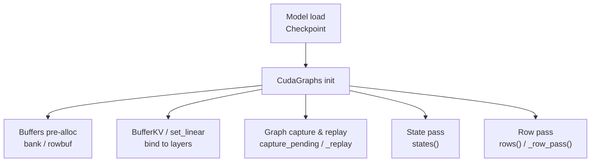
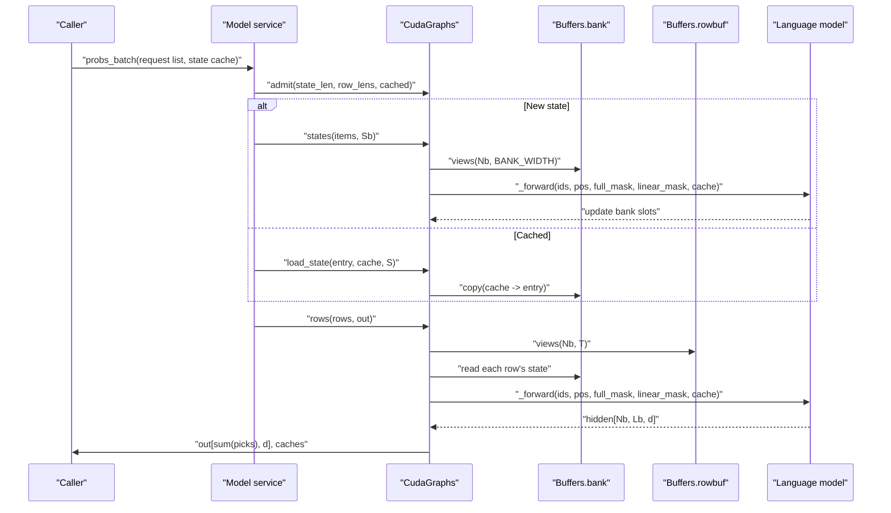
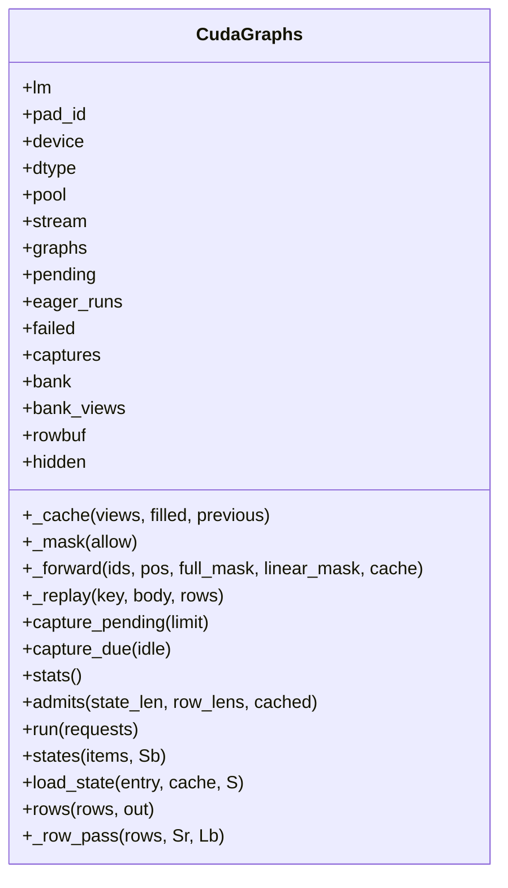
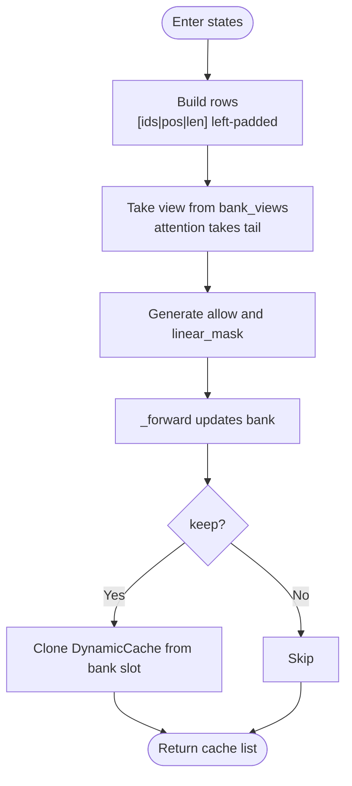
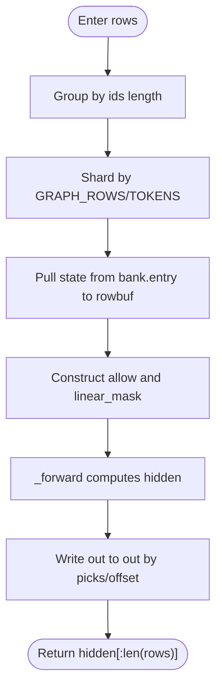
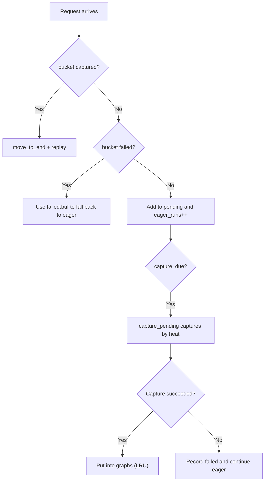
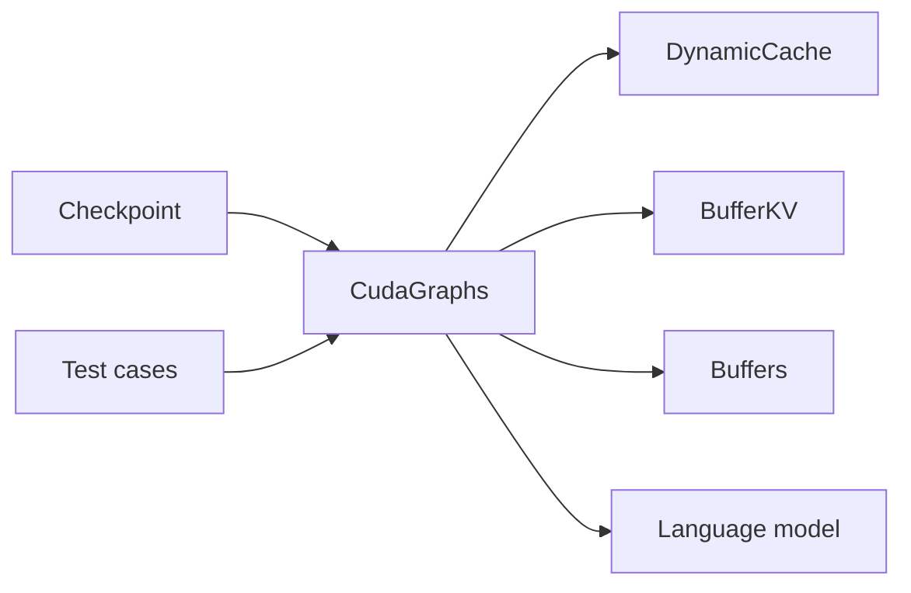

## Table of Contents
1. [Introduction](#introduction)
2. [Project Structure](#project-structure)
3. [Core Components](#core-components)
4. [Architecture Overview](#architecture-overview)
5. [Detailed Component Analysis](#detailed-component-analysis)
6. [Dependency Analysis](#dependency-analysis)
7. [Performance Considerations](#performance-considerations)
8. [Troubleshooting Guide](#troubleshooting-guide)
9. [Conclusion](#conclusion)

## Introduction
This document targets the CUDA graph optimization subsystem, focusing on the design and implementation of the `CudaGraphs` class. It systematically explains the graph capture mechanism, replay flow, memory management strategy, and the working principles of the state pass and row pass. It also covers buffer layout, mask handling, shape alignment, LRU eviction and hot-bucket detection in the graph cache, the dynamic capture mechanism, and explains how the pre-allocated buffer designs of the `BufferKV` and `Buffers` classes avoid Python object overhead. Finally, it provides performance benchmark suggestions and a common troubleshooting path.

## Project Structure
The CUDA graph optimization code is concentrated in `kev/cuda_graphs.py` and is integrated via `Checkpoint` at model load time; test cases verify the consistency between the graph path and the eager path.

**Diagram sources**
- [cuda_graphs.py:165-189](file://kev/cuda_graphs.py#L165-L189)
- [cuda_graphs.py:190-204](file://kev/cuda_graphs.py#L190-L204)
- [cuda_graphs.py:206-263](file://kev/cuda_graphs.py#L206-L263)
- [cuda_graphs.py:301-375](file://kev/cuda_graphs.py#L301-L375)

**Section sources**
- [cuda_graphs.py:165-375](file://kev/cuda_graphs.py#L165-L375)
- [checkpoint.py:126-126](file://kev/checkpoint.py#L126-L126)

## Core Components
- CudaGraphs: encapsulates the graph capture, replay, caching, and scheduling logic, maintaining the shared memory pool, streams, graph dictionary, pending buckets, failed buckets, and other states.
- Buffers: a two-dimensional view buffer manager based on fixed capacity and step size, used for pre-allocation of banks and rows and view slicing, avoiding frequent allocation and Python object creation.
- BufferKV: binds the attention layer's key/value tensors directly to Buffers' views, reducing copies and object overhead.
- DynamicCache: as a high-level cache interface, it is replaced inside the graph by CudaGraphs with BufferKV or set_linear to the underlying views.

Key responsibility division:
- Capture phase: warm-up + capture, using a separate stream and thread_local error mode to avoid GC/synchronization blocking.
- Replay phase: reuse graphs by bucket key; on a miss, fall back to eager execution and add to pending.
- State pass: batch-construct the initial state of attention/DeltaNet, writing into the designated bank slots.
- Row pass: pull each row's state from the bank, compute the hidden representation, and write back the output by selection index.

**Section sources**
- [cuda_graphs.py:165-189](file://kev/cuda_graphs.py#L165-L189)
- [cuda_graphs.py:190-204](file://kev/cuda_graphs.py#L190-L204)
- [cuda_graphs.py:206-263](file://kev/cuda_graphs.py#L206-L263)
- [cuda_graphs.py:301-375](file://kev/cuda_graphs.py#L301-L375)

## Architecture Overview
The diagram below shows the overall flow after a request arrives: first an admit decision, then either a state pass or reuse of bank slots depending on whether it is a new state, then a unified entry into the row pass to complete token-level inference, and finally writing out the result and an optional state cache.

**Diagram sources**
- [cuda_graphs.py:267-299](file://kev/cuda_graphs.py#L267-L299)
- [cuda_graphs.py:301-330](file://kev/cuda_graphs.py#L301-L330)
- [cuda_graphs.py:332-375](file://kev/cuda_graphs.py#L332-L375)

## Detailed Component Analysis

### CudaGraphs Class Design and Behavior
- Initialization
  - Records the model, pad_id, device, and dtype.
  - Creates the shared memory pool and capture stream, maintains the graph cache, pending buckets, eager count, and failed buckets.
  - Obtains the DynamicCache layout via a single eager probe, validating that only specific layer types are supported.
  - Pre-allocates the bank and rowbuf, preparing the hidden buffer.
- Cache and mask
  - `_cache`: replaces DynamicCache's layers with BufferKV or set_linear, so attention and linear layers read/write the bank views directly.
  - `_mask`: generates the additive mask, with dtype consistent with the model.
- Replay and capture
  - `_replay`: reuses graphs by bucket key; on a miss, falls back to eager execution and copies the rows into the shared buf.
  - `capture_pending`: prioritizes capturing by eager_runs heat, using a separate stream and thread_local capture error mode; on failure, keeps the eager run and records the failure reason.
  - `capture_due`: triggers capture when idle or when a hot bucket reaches the threshold.
- Batch processing entry
  - `run`: groups by state length, first states then rows, concatenates output to out, returns each request's state cache.
  - `states`: batch-constructs new states, writes into bank slots, returns the caches that need to persist.
  - `load_state`: copies an external cache into the bank slot.
  - `rows`/`_row_pass`: groups by row length, pulls state from the bank, computes the hidden representation, and writes out by picks index.

**Diagram sources**
- [cuda_graphs.py:165-375](file://kev/cuda_graphs.py#L165-L375)

**Section sources**
- [cuda_graphs.py:165-375](file://kev/cuda_graphs.py#L165-L375)

### State Pass Working Principle
- Input items: [(ids, pos, keep)], each with at most Sb <= GRAPH_STATE tokens.
- Build left-padded rows: [ids | positions | real length], padded up to Nb = count_bucket(len(items)).
- Mask allow: ensures causality and valid positions; linear_mask: indicates which rows use linear attention.
- Views: take the slice of the corresponding slot from bank_views; the attention layer only takes the tail after BANK_WIDTH - Sb.
- Forward: _forward sends ids/pos/mask/cache into the model, updating the bank slots.
- Output: for states with keep=True, clone an independent DynamicCache from the bank slot for later request reuse.

**Diagram sources**
- [cuda_graphs.py:301-330](file://kev/cuda_graphs.py#L301-L330)

**Section sources**
- [cuda_graphs.py:301-330](file://kev/cuda_graphs.py#L301-L330)

### Row Pass Working Principle
- Input rows: a row set containing ids, pos, state_len, entry, offset, picks.
- Grouping and sharding: group by ids length, shard in batches by GRAPH_ROWS and GRAPH_TOKENS limits.
- View and state pull: copy state from the bank's entry slot into the rowbuf view; attention only takes the first Sr positions.
- Mask allow: combine Sr, plen, rowlen, and q/k position relationship to construct the causal mask; linear_mask: determined by row length to indicate linear attention.
- Forward: _forward computes hidden[Nb, Lb, d].
- Write out: index_copy the selected hidden vectors into out by picks and offset.

**Diagram sources**
- [cuda_graphs.py:340-375](file://kev/cuda_graphs.py#L340-L375)

**Section sources**
- [cuda_graphs.py:340-375](file://kev/cuda_graphs.py#L340-L375)

### Buffer Layout, Mask Handling, and Shape Alignment
- Buffer layout
  - bank: [GRAPH_STATES, heads, BANK_WIDTH, dim] (attention), or [GRAPH_STATES, *state] (DeltaNet).
  - rowbuf: [Nb, T], T = Sr + Lb, Sr is the power-of-two aligned state length, Lb is the row length bucket.
- Mask handling
  - `_mask`: converts the boolean allow into an additive mask, with dtype consistent with the model.
  - state pass: allow is controlled by q/k and pad; linear_mask is i >= pad.
  - row pass: allow combines Sr, plen, rowlen, and q/k; linear_mask is a row-length flag.
- Shape alignment
  - Use bucket/count_bucket/pow2 to align lengths, ensuring stable static shapes during graph capture.
  - Left padding and right alignment (attention tail) avoid out-of-bounds and redundant computation.

**Section sources**
- [cuda_graphs.py:183-189](file://kev/cuda_graphs.py#L183-L189)
- [cuda_graphs.py:198-204](file://kev/cuda_graphs.py#L198-L204)
- [cuda_graphs.py:301-375](file://kev/cuda_graphs.py#L301-L375)

### Graph Cache System: LRU, Hot Bucket Detection, and Dynamic Capture
- LRU eviction
  - graphs uses an ordered dict; access moves to end; when exceeding GRAPHS_KEPT, pops the least recently used item.
- Hot bucket detection
  - eager_runs counts each bucket's eager runs; capture_pending prioritizes capturing the most frequent pending bucket.
  - capture_due triggers capture when idle or max eager_runs >= HOT_BUCKET.
- Dynamic capture
  - capture_pending uses a separate stream and thread_local capture error mode; on failure, explicitly ends the allocator route to avoid polluting subsequent captures.
  - Warm-up before capture, to avoid autotuning or lazy setup during capture.

**Diagram sources**
- [cuda_graphs.py:206-263](file://kev/cuda_graphs.py#L206-L263)

**Section sources**
- [cuda_graphs.py:206-263](file://kev/cuda_graphs.py#L206-L263)

### BufferKV and Buffers: Pre-allocated Buffers and Zero Python Object Overhead
- Buffers
  - Pre-allocates a fixed-capacity contiguous buffer and provides views(N, M) slice views, avoiding per-allocation and Python object creation.
  - bank and rowbuf serve state and row data respectively, with views sharing memory with the original buffer.
- BufferKV
  - Binds the attention layer's keys/values directly to Buffers' views, avoiding intermediate objects and copies.
- set_linear
  - Binds the DeltaNet linear layer's parameters to Buffers views, keeping view semantics consistent with the attention layer.

These designs allow the in-graph forward to directly read/write bank/rowbuf, reducing Python/GIL and allocation overhead, improving throughput and stability.

**Section sources**
- [cuda_graphs.py:183-189](file://kev/cuda_graphs.py#L183-L189)
- [cuda_graphs.py:190-204](file://kev/cuda_graphs.py#L190-L204)

## Dependency Analysis
- CudaGraphs depends on torch.cuda.graph/stream/pool and the model configuration; it abstracts through the DynamicCache layer type and injects underlying views via BufferKV/set_linear.
- Checkpoint can optionally enable cuda_graphs when loading the model, so that graph optimization is used in the inference path.
- Test cases verify the numerical consistency between the graph path and the eager path, covering boundary scenarios such as new states, cached states, and over-long rows/states.

**Diagram sources**
- [checkpoint.py:126-126](file://kev/checkpoint.py#L126-L126)
- [cuda_graphs.py:165-375](file://kev/cuda_graphs.py#L165-L375)
- [test_model.py:321-351](file://tests/test_model.py#L321-L351)

**Section sources**
- [checkpoint.py:126-126](file://kev/checkpoint.py#L126-L126)
- [test_model.py:321-351](file://tests/test_model.py#L321-L351)

## Performance Considerations
- Graph capture time
  - The first capture includes warm-up and cuBLAS/Triton setup, recommended to run during idle periods or background threads; capture_due can auto-trigger based on idle and hot-bucket thresholds.
- Replay speedup
  - The replay path on a graph hit avoids Python scheduling and allocation, usually significantly reducing latency; on a miss, it falls back to eager without affecting correctness.
- Memory usage
  - bank and rowbuf are pre-allocated at fixed size, avoiding peak jitter; failed captures clean up the allocator route to prevent leaks.
- Shape alignment and grouping
  - Use bucket/count_bucket/pow2 to align lengths, reducing graph invalidation and re-capture frequency; shard by GRAPH_ROWS/TOKENS to balance throughput and memory.

[This section is general guidance and does not directly analyze specific files]

## Troubleshooting Guide
- Graph capture failure
  - Symptom: a bucket's capture fails, the log shows the failure reason, and the bucket continues to run in eager mode.
  - Possible causes: new shape causes OOM, resource contention during capture, or exception under the thread_local error mode.
  - Fix: check whether the input length exceeds GRAPH_STATE/GRAPH_ROW; adjust the batch size; ensure capture_pending runs in idle or background threads.
- Out of memory
  - Symptom: OOM reported during capture.
  - Fix: increase GRAPH_STATES/GRAPH_ROWS or reduce batch; ensure capture_pending is not triggered frequently under high load; manually call capture_pending to control timing if necessary.
- Numerical inconsistency
  - Symptom: large difference between graph path and eager path results.
  - Fix: refer to test cases to ensure dtype and fused options are consistent; check whether different cache paths are mixed; verify that mask and padding are correct.

**Section sources**
- [cuda_graphs.py:223-254](file://kev/cuda_graphs.py#L223-L254)
- [test_model.py:321-351](file://tests/test_model.py#L321-L351)

## Conclusion
CudaGraphs achieves a stable low-latency graph inference path through pre-allocated buffers, view binding, the two-stage state/row pipeline, and intelligent caching strategy. Its LRU eviction, hot-bucket detection, and dynamic capture mechanism balance throughput with robustness and maintainability. Combined with the zero-object-overhead design of BufferKV/Buffers, the system has good scalability in long-context and multi-request concurrent scenarios. In actual deployment, attention should be paid to shape alignment, capture timing, and memory budget to obtain the best performance and stability.
