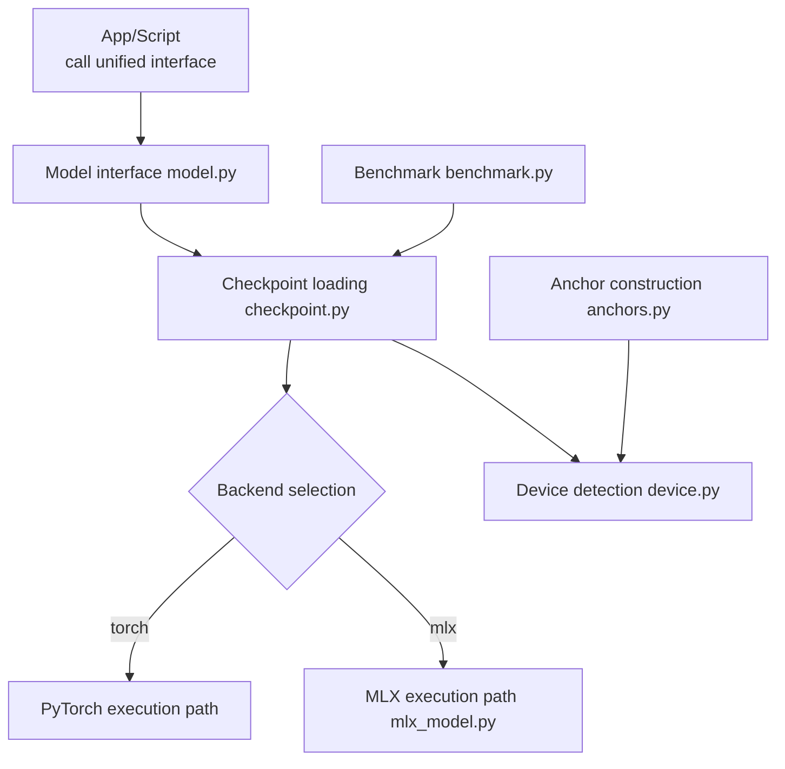
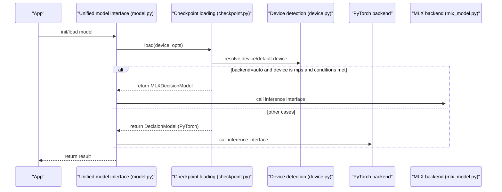
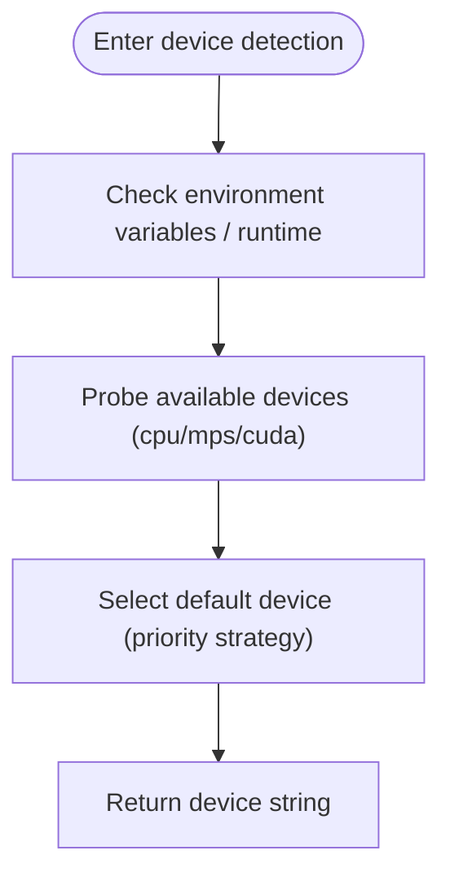
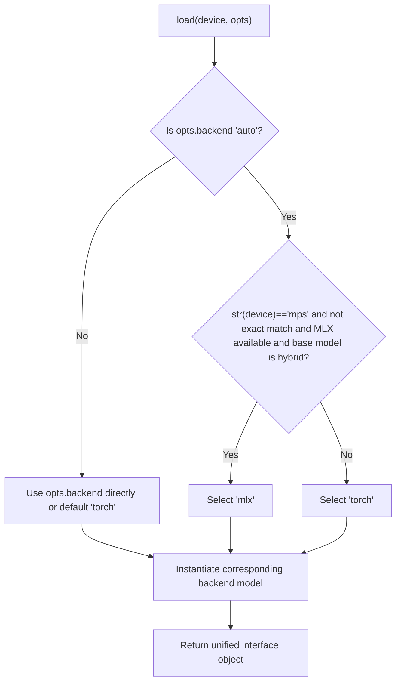
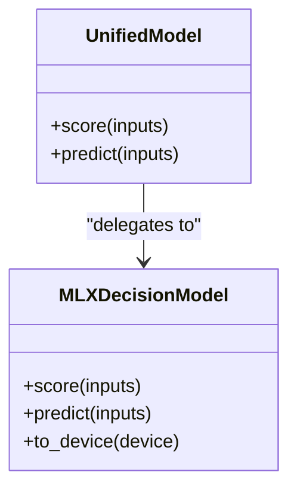
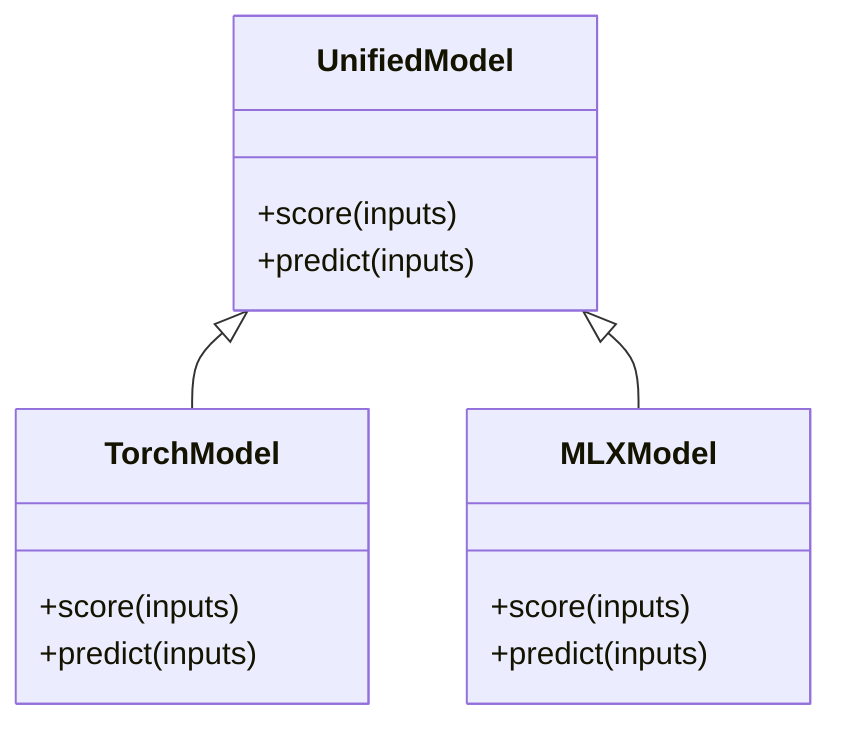
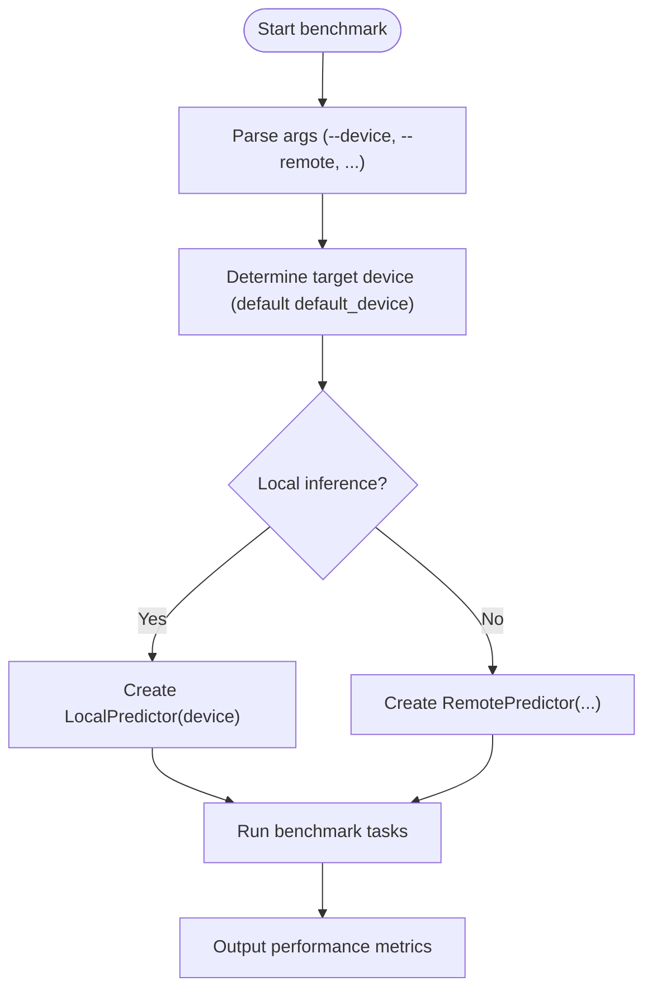
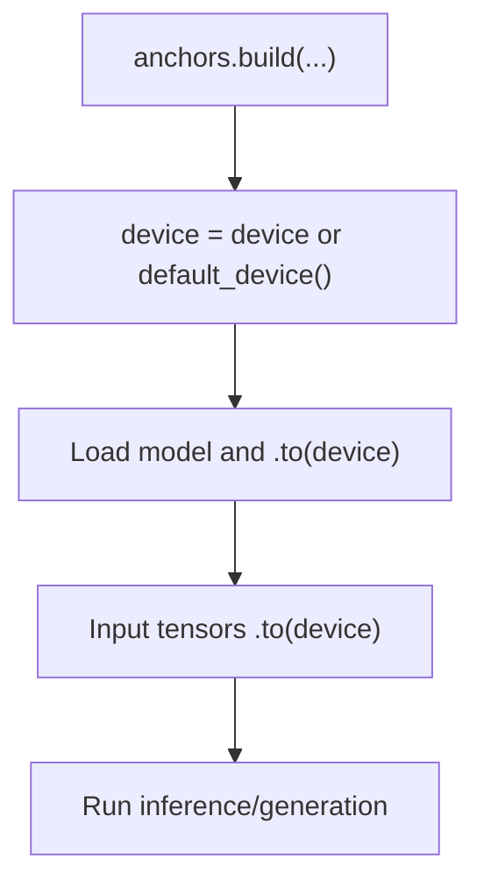
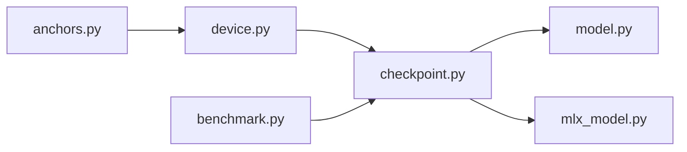

## Table of Contents
1. [Introduction](#introduction)
2. [Project Structure](#project-structure)
3. [Core Components](#core-components)
4. [Architecture Overview](#architecture-overview)
5. [Detailed Component Analysis](#detailed-component-analysis)
6. [Dependency Analysis](#dependency-analysis)
7. [Performance Considerations](#performance-considerations)
8. [Troubleshooting Guide](#troubleshooting-guide)
9. [Conclusion](#conclusion)
10. [Appendix](#appendix)

## Introduction
This technical document focuses on the "device abstraction layer", aiming to provide developers with an in-depth explanation of the implementation principles of a unified device interface and the cross-backend (PyTorch, MLX) adaptation mechanism. The document covers the performance differences and optimization strategies across CPU, GPU, and Apple Silicon (MPS), systematically explains the device detection algorithm, memory management, and compute resource allocation mechanism, and gives cross-device compatibility solutions (data type conversion, memory copy optimization, parallel scheduling). It also includes deployment guides and environment tuning suggestions on different hardware platforms, as well as diagnosis and solutions for common device-related problems.

## Project Structure
The key code around the device abstraction layer is concentrated in the following modules:
- kev/device.py: device detection and default device selection logic
- kev/checkpoint.py: load options, backend selection (torch/MLX/auto), device-to-backend mapping
- kev/mlx_model.py: MLX backend model wrapper and inference interface
- kev/model.py: unified model interface (for upper-layer business use)
- kev/benchmark.py: benchmark entry point, supports cpu/mps/cuda device parameters
- kev/anchors.py: usage of default_device in the example construction flow

**Diagram sources**
- [checkpoint.py:219-228](file://kev/checkpoint.py#L219-L228)
- [device.py:1-200](file://kev/device.py#L1-L200)
- [mlx_model.py:1-200](file://kev/mlx_model.py#L1-L200)
- [model.py:1-200](file://kev/model.py#L1-L200)
- [benchmark.py:170-210](file://kev/benchmark.py#L170-L210)
- [anchors.py:30-40](file://kev/anchors.py#L30-L40)

**Section sources**
- [checkpoint.py:219-228](file://kev/checkpoint.py#L219-L228)
- [device.py:1-200](file://kev/device.py#L1-L200)
- [mlx_model.py:1-200](file://kev/mlx_model.py#L1-L200)
- [model.py:1-200](file://kev/model.py#L1-L200)
- [benchmark.py:170-210](file://kev/benchmark.py#L170-L210)
- [anchors.py:30-40](file://kev/anchors.py#L30-L40)

## Core Components
- Device detection and default device selection: provides a unified device string (cpu/mps/cuda) and default device acquisition capability for consistent use by upper-layer modules.
- Backend selection and loading: uses LoadOptions.backend and the environment variable KEV_BACKEND to decide between torch or mlx; when set to auto, intelligently selects by combining device type and base model characteristics.
- MLX backend adaptation: exposes a scoring interface consistent with PyTorch via MLXDecisionModel, hiding underlying differences.
- Unified model interface: exposes a consistent predict/score API to the outside, internally routing to the specific backend implementation.
- Benchmark tool: supports running benchmarks on a specified device, facilitating cross-platform comparison of throughput and latency.

**Section sources**
- [device.py:1-200](file://kev/device.py#L1-L200)
- [checkpoint.py:219-228](file://kev/checkpoint.py#L219-L228)
- [mlx_model.py:1-200](file://kev/mlx_model.py#L1-L200)
- [model.py:1-200](file://kev/model.py#L1-L200)
- [benchmark.py:170-210](file://kev/benchmark.py#L170-L210)

## Architecture Overview
The device abstraction layer sits above the "unified model interface" and, through the "checkpoint loader", completes backend selection and instantiation, ultimately dispatching computation to the specific backend (PyTorch or MLX). The device detection module runs through the entire lifecycle, ensuring that data and model always reside on the appropriate device.

**Diagram sources**
- [checkpoint.py:219-228](file://kev/checkpoint.py#L219-L228)
- [device.py:1-200](file://kev/device.py#L1-L200)
- [mlx_model.py:1-200](file://kev/mlx_model.py#L1-L200)
- [model.py:1-200](file://kev/model.py#L1-L200)

## Detailed Component Analysis

### Device Detection and Default Device Selection (device.py)
- Key points
  - Provides a default device string (e.g. cpu/mps/cuda) for unified use by all modules.
  - Acts as the authoritative source for device selection, avoiding scattered device judgment logic.
- Design pattern
  - Singleton-style configuration: centrally manages device information, reducing coupling.
- Typical usage
  - Directly call the default device at entry points such as anchor construction and benchmark testing to ensure consistency.

**Diagram sources**
- [device.py:1-200](file://kev/device.py#L1-L200)

**Section sources**
- [device.py:1-200](file://kev/device.py#L1-L200)
- [anchors.py:30-40](file://kev/anchors.py#L30-L40)
- [benchmark.py:170-210](file://kev/benchmark.py#L170-L210)

### Backend Selection and Loading (checkpoint.py)
- Key points
  - LoadOptions.backend supports three modes: torch, mlx, and auto.
  - When backend=auto, if the device is mps and the base model is hybrid and MLX is available, select the MLX backend; otherwise fall back to torch.
  - Supports forcing the backend via the KEV_BACKEND environment variable.
- Key flow
  - Validate the legality of the backend value.
  - Automatically decide based on device and base model characteristics.
  - Return the specific model class for the corresponding backend (DecisionModel or MLXDecisionModel).

**Diagram sources**
- [checkpoint.py:219-228](file://kev/checkpoint.py#L219-L228)

**Section sources**
- [checkpoint.py:219-228](file://kev/checkpoint.py#L219-L228)

### MLX Backend Adaptation (mlx_model.py)
- Key points
  - Wraps the MLX inference path, exposing a scoring interface consistent with PyTorch.
  - Responsible for MLX-side data type and memory layout adaptation.
- Integration
  - Returned by the checkpoint loader on demand in auto mode as MLXDecisionModel.
  - The upper layer need not be aware of backend differences and calls uniformly through the interface of model.py.

**Diagram sources**
- [mlx_model.py:1-200](file://kev/mlx_model.py#L1-L200)
- [model.py:1-200](file://kev/model.py#L1-L200)

**Section sources**
- [mlx_model.py:1-200](file://kev/mlx_model.py#L1-L200)
- [model.py:1-200](file://kev/model.py#L1-L200)

### Unified Model Interface (model.py)
- Key points
  - Exposes a consistent score/predict interface to the outside, hiding backend differences.
  - Internally forwards based on the backend already selected at load time.
- Design principles
  - High cohesion and low coupling: the upper layer depends only on the unified interface and does not care about the specific backend implementation.

**Diagram sources**
- [model.py:1-200](file://kev/model.py#L1-L200)

**Section sources**
- [model.py:1-200](file://kev/model.py#L1-L200)

### Benchmark Tool (benchmark.py)
- Key points
  - Supports the --device parameter to select cpu/mps/cuda, defaulting to default_device().
  - Can switch between LocalPredictor/RemotePredictor, facilitating throughput and latency evaluation on different hardware.
- Use cases
  - Quickly verify inference performance on different devices, assisting hardware selection and parameter tuning.

**Diagram sources**
- [benchmark.py:170-210](file://kev/benchmark.py#L170-L210)

**Section sources**
- [benchmark.py:170-210](file://kev/benchmark.py#L170-L210)

### Device Usage in Anchor Construction (anchors.py)
- Key points
  - When constructing anchor data, prefer default_device() and move tensors to the target device when needed.
  - The choice of dtype depends on the device type (e.g. bfloat16 for non-CPU, float32 for CPU).

**Diagram sources**
- [anchors.py:30-40](file://kev/anchors.py#L30-L40)

**Section sources**
- [anchors.py:30-40](file://kev/anchors.py#L30-L40)

## Dependency Analysis
- Component coupling
  - model.py depends on checkpoint.py to complete backend selection and instantiation.
  - checkpoint.py depends on device.py to obtain device information.
  - mlx_model.py is returned on demand by checkpoint.py as a backend implementation.
- External dependencies
  - The PyTorch (CUDA/MPS) and MLX libraries.
  - The KEV_BACKEND environment variable controls backend behavior.

**Diagram sources**
- [device.py:1-200](file://kev/device.py#L1-L200)
- [checkpoint.py:219-228](file://kev/checkpoint.py#L219-L228)
- [mlx_model.py:1-200](file://kev/mlx_model.py#L1-L200)
- [model.py:1-200](file://kev/model.py#L1-L200)
- [benchmark.py:170-210](file://kev/benchmark.py#L170-L210)
- [anchors.py:30-40](file://kev/anchors.py#L30-L40)

**Section sources**
- [device.py:1-200](file://kev/device.py#L1-L200)
- [checkpoint.py:219-228](file://kev/checkpoint.py#L219-L228)
- [mlx_model.py:1-200](file://kev/mlx_model.py#L1-L200)
- [model.py:1-200](file://kev/model.py#L1-L200)
- [benchmark.py:170-210](file://kev/benchmark.py#L170-L210)
- [anchors.py:30-40](file://kev/anchors.py#L30-L40)

## Performance Considerations
- CPU
  - Suitable for lightweight inference and debugging; use float32 dtype to ensure numerical stability.
  - Throughput can be tuned via batch size and sequence length.
- GPU (CUDA)
  - bfloat16 is recommended to improve throughput and VRAM efficiency; enable CUDA Graphs (if any) to reduce kernel launch overhead.
  - Pay attention to VRAM fragmentation and concurrent request count, and set batch size and context length reasonably.
- Apple Silicon (MPS)
  - In auto mode, if the base model is hybrid and MLX is available, the MLX backend is preferred for better performance.
  - Note the impact of the MPS attention backend selection (SDPA/eager) on performance.

[This section is general performance guidance and does not involve specific file analysis]

## Troubleshooting Guide
- Backend selection anomaly
  - Symptom: MLX is expected but torch is actually used.
  - Troubleshoot: confirm whether the device is mps; check the KEV_BACKEND environment variable; confirm whether MLX is installed and the base model is hybrid.
  - Reference: backend selection logic and auto determination rules.
- Device mismatch causing OOM
  - Symptom: VRAM shortage on MPS/CUDA.
  - Troubleshoot: check dtype settings (bfloat16 for non-CPU); reduce batch size or sequence length; confirm that the model and input are on the same device.
  - Reference: dtype and to(device) handling in anchor construction.
- Unstable benchmark results
  - Symptom: large throughput fluctuations across runs.
  - Troubleshoot: close unrelated processes; fix the random seed; warm up the model; avoid frequent device switching.
  - Reference: benchmark entry and device parameter passing.

**Section sources**
- [checkpoint.py:219-228](file://kev/checkpoint.py#L219-L228)
- [anchors.py:30-40](file://kev/anchors.py#L30-L40)
- [benchmark.py:170-210](file://kev/benchmark.py#L170-L210)

## Conclusion
The device abstraction layer seamlessly integrates the PyTorch and MLX execution paths into a consistent model interface through a unified device detection and backend selection mechanism. This design guarantees cross-platform compatibility while providing clear extension points for performance optimization. Developers can flexibly switch hardware backends and obtain a stable and consistent inference experience without modifying upper-layer business code.

[This section is a summary and does not involve specific file analysis]

## Appendix
- Deployment and environment configuration suggestions
  - Install PyTorch (with CUDA or MPS support) and the MLX library.
  - Force the backend via the KEV_BACKEND environment variable, or use LoadOptions.backend="auto" in code to let the system select automatically.
  - On Apple Silicon, prefer the MLX backend (hybrid base model) for better performance.
- Common commands and parameters
  - Benchmark: specify --device as cpu/mps/cuda to observe throughput and latency changes.
  - Anchor construction: pass --device or use the default device to ensure dtype matches the device.

[This section is supplementary information and does not involve specific file analysis]
