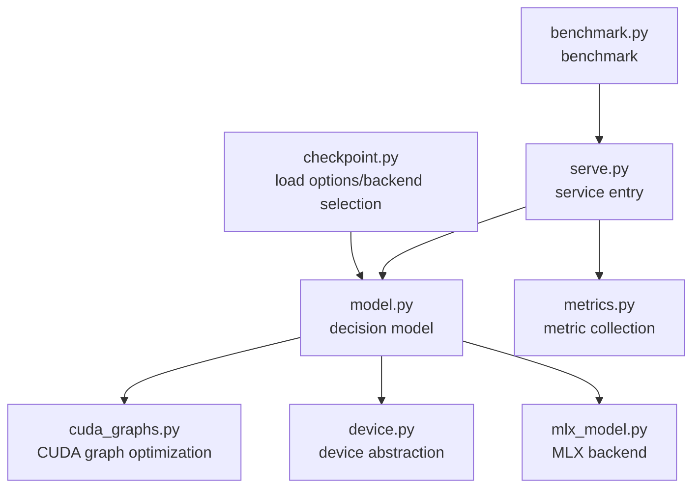
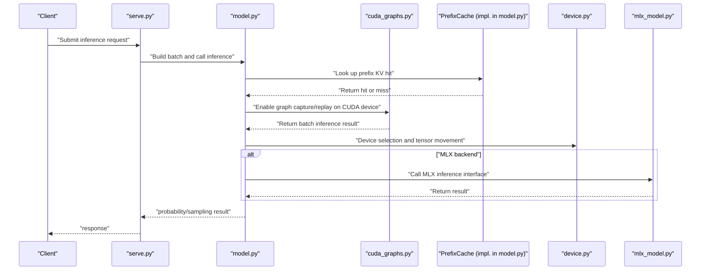
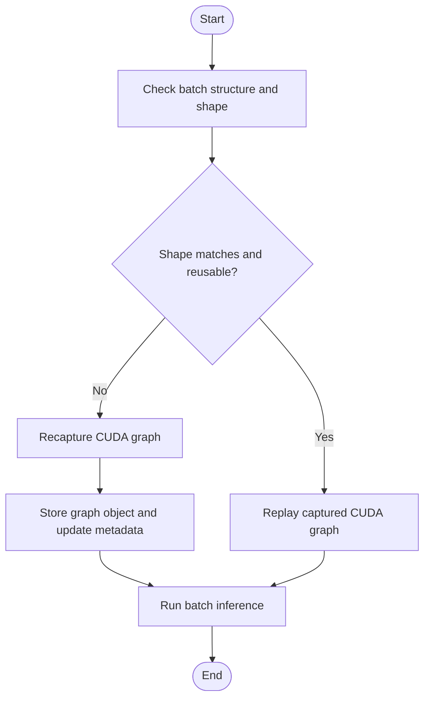
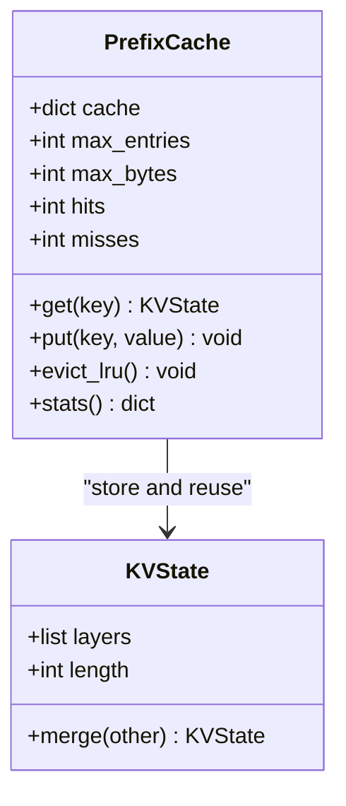
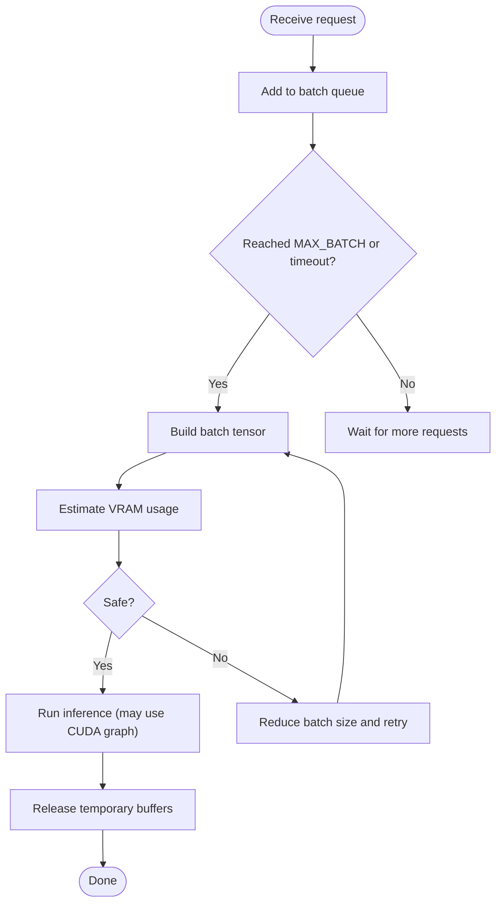
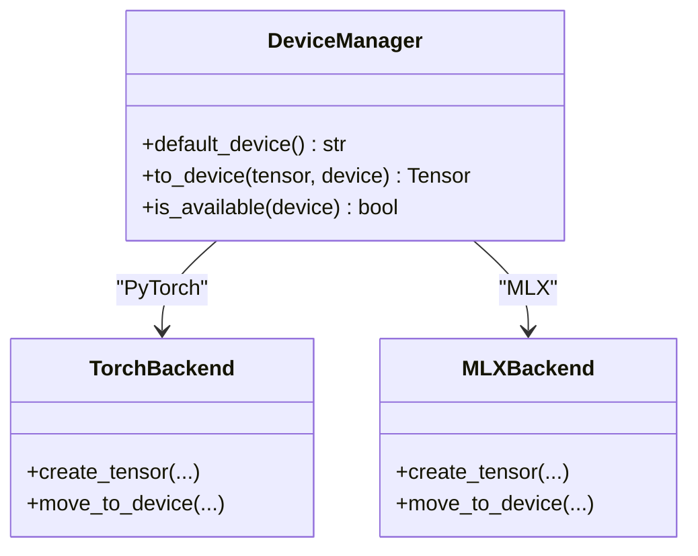
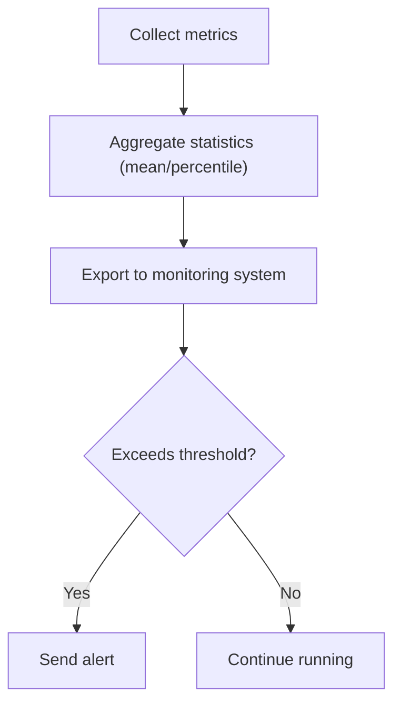
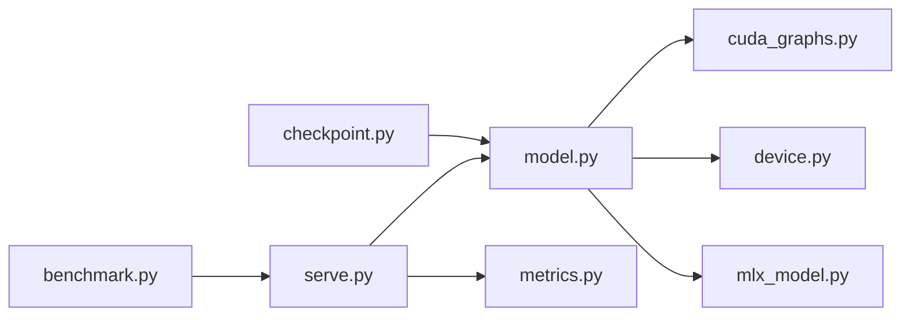

## Table of Contents
1. [Introduction](#introduction)
2. [Project Structure](#project-structure)
3. [Core Components](#core-components)
4. [Architecture Overview](#architecture-overview)
5. [Detailed Component Analysis](#detailed-component-analysis)
6. [Dependency Analysis](#dependency-analysis)
7. [Performance Considerations](#performance-considerations)
8. [Troubleshooting Guide](#troubleshooting-guide)
9. [Conclusion](#conclusion)
10. [Appendix](#appendix)

## Introduction
This document focuses on the performance optimization of the Kev inference service, organized around the following key topics:
- CUDA graph optimization mechanism: graph capture, replay, memory management, and performance improvement principles
- Prefix cache system: PrefixCache design, LRU eviction strategy, memory usage control, and hit-rate statistics
- Batch processing mechanism: MAX_BATCH configuration, dynamic batch size adjustment, and GPU memory optimization
- Device abstraction layer: unified interface for PyTorch and MLX backends, performance differences across CPU/GPU/Apple Silicon, and optimization suggestions
- Service performance monitoring metrics: latency statistics, throughput measurement, and memory usage monitoring
- Performance tuning best practices: batch size, cache configuration, data type selection, and concurrency adjustment
- Performance benchmark results and before/after optimization comparison analysis (based on the in-repo benchmark scripts and run artifacts)

## Project Structure
Kev's core performance-related code is concentrated in the `kev` directory, with the key files' responsibilities as follows:
- cuda_graphs.py: CUDA graph capture and replay wrapper, accelerating decision-model inference for batched requests
- device.py: device abstraction and default device selection, hiding PyTorch/MLX differences
- mlx_model.py: MLX backend adaptation, providing an inference interface consistent with PyTorch
- model.py: the decision-model main class, containing core logic such as batch inference, state management, and probability computation
- checkpoint.py: load options and environment variable parsing, supporting torch/mlx/auto backends and the CUDA graph switch
- serve.py: inference service entry point, responsible for request scheduling, batch processing, concurrency control, and metrics reporting
- metrics.py: metric collection and statistics, used for latency, throughput, and resource usage monitoring
- benchmark.py: benchmark tool, covering local/remote inference, different devices, and concurrency parameters

**Diagram sources**
- [serve.py:1-200](file://kev/serve.py#L1-L200)
- [model.py:1-300](file://kev/model.py#L1-L300)
- [cuda_graphs.py:1-200](file://kev/cuda_graphs.py#L1-L200)
- [device.py:1-150](file://kev/device.py#L1-L150)
- [mlx_model.py:1-200](file://kev/mlx_model.py#L1-L200)
- [checkpoint.py:100-160](file://kev/checkpoint.py#L100-L160)
- [benchmark.py:150-220](file://kev/benchmark.py#L150-L220)

**Section sources**
- [serve.py:1-200](file://kev/serve.py#L1-L200)
- [model.py:1-300](file://kev/model.py#L1-L300)
- [cuda_graphs.py:1-200](file://kev/cuda_graphs.py#L1-L200)
- [device.py:1-150](file://kev/device.py#L1-L150)
- [mlx_model.py:1-200](file://kev/mlx_model.py#L1-L200)
- [checkpoint.py:100-160](file://kev/checkpoint.py#L100-L160)
- [benchmark.py:150-220](file://kev/benchmark.py#L150-L220)

## Core Components
- CUDA graph optimization: by capturing a fixed-structure execution graph and replaying it, it reduces kernel launch overhead and synchronization cost, suitable for batched request scenarios.
- Prefix cache: maintains historical KV state fragments based on PrefixCache, combined with LRU eviction and memory upper-bound control, improving the reuse efficiency of repeated prefixes.
- Batch processing: limits batch size according to MAX_BATCH, dynamically adjusts batches to meet GPU memory constraints and avoid OOM.
- Device abstraction: unifies the PyTorch and MLX backend interfaces, automatically selects the default device, and hides hardware differences.
- Metric monitoring: records latency distribution, throughput, VRAM/memory peak and utilization, assisting performance analysis and tuning.

**Section sources**
- [cuda_graphs.py:1-200](file://kev/cuda_graphs.py#L1-L200)
- [model.py:1-300](file://kev/model.py#L1-L300)
- [serve.py:1-200](file://kev/serve.py#L1-L200)
- [metrics.py:1-200](file://kev/metrics.py#L1-L200)
- [device.py:1-150](file://kev/device.py#L1-L150)
- [mlx_model.py:1-200](file://kev/mlx_model.py#L1-L200)
- [checkpoint.py:100-160](file://kev/checkpoint.py#L100-L160)

## Architecture Overview
The diagram below shows the critical path from a request entering the service to model inference, including the integration points of CUDA graph optimization and the prefix cache.

**Diagram sources**
- [serve.py:1-200](file://kev/serve.py#L1-L200)
- [model.py:1-300](file://kev/model.py#L1-L300)
- [cuda_graphs.py:1-200](file://kev/cuda_graphs.py#L1-L200)
- [device.py:1-150](file://kev/device.py#L1-L150)
- [mlx_model.py:1-200](file://kev/mlx_model.py#L1-L200)

## Detailed Component Analysis

### CUDA Graph Optimization Mechanism
- Graph capture: during the service warm-up phase or on the first batched request, capture the fixed compute graph structure as a CUDA graph, avoiding the Python interpreter overhead and kernel launch cost on each call.
- Graph replay: subsequent batched requests with the same structure directly replay the captured graph, significantly improving throughput and reducing tail latency.
- Memory management: graph objects need to reside in VRAM; when batch size or sequence length changes cause the graph to become invalid, it must be rebuilt, paying attention to VRAM peak and fragmentation.
- Performance improvement principle: reduce CPU-GPU synchronization, kernel launch, and scheduling overhead, leveraging more efficient execution plans on the GPU side.

**Diagram sources**
- [cuda_graphs.py:1-200](file://kev/cuda_graphs.py#L1-L200)
- [model.py:1-300](file://kev/model.py#L1-L300)

**Section sources**
- [cuda_graphs.py:1-200](file://kev/cuda_graphs.py#L1-L200)
- [model.py:1-300](file://kev/model.py#L1-L300)

### Prefix Cache System (PrefixCache)
- Design points:
  - Key: use prefix hash or unique identifier as the cache key, value is the KV state fragment
  - Value: attention KV cache organized by layer, supporting incremental concatenation
  - Access: on a hit, directly reuse the missed part for incremental computation
- LRU eviction strategy:
  - Least recently used is evicted first, keeping hot prefixes resident
  - The eviction threshold is determined by the memory upper bound and the estimated size of a single prefix
- Memory usage control:
  - Global upper bound: limited by bytes or entry count
  - Single-entry upper bound: prevent overly long prefixes from occupying too much memory
  - Cleanup strategy: a combination of periodic scanning and lazy cleanup
- Hit-rate statistics:
  - Record hit/miss counts, average prefix length, cache entry count, and memory usage
  - Expose metrics for monitoring dashboards and log analysis

**Diagram sources**
- [model.py:1-300](file://kev/model.py#L1-L300)

**Section sources**
- [model.py:1-300](file://kev/model.py#L1-L300)

### Batch Processing Mechanism
- MAX_BATCH configuration:
  - Limits the maximum number of requests in a single batch, balancing throughput and latency
  - Together with sequence length, it affects VRAM usage
- Dynamic batch size adjustment:
  - Adaptively increases or decreases based on current VRAM usage and queue length
  - On OOM risk, downgrades batch size and falls back to the non-graph path
- GPU memory optimization:
  - Pre-allocate and reuse tensor buffers
  - Merge small batches to reduce kernel launches
  - Timely release intermediate results and invalid caches

**Diagram sources**
- [serve.py:1-200](file://kev/serve.py#L1-L200)
- [model.py:1-300](file://kev/model.py#L1-L300)

**Section sources**
- [serve.py:1-200](file://kev/serve.py#L1-L200)
- [model.py:1-300](file://kev/model.py#L1-L300)

### Device Abstraction Layer (PyTorch and MLX)
- Unified interface:
  - Default device selection: choose cpu/cuda/mps based on environment or hardware capability
  - Tensor creation and movement: hide underlying device differences
  - Backend switching: choose torch/mlx/auto via LoadOptions and environment variables
- Performance differences and suggestions:
  - CPU: suitable for low load and debugging, higher latency
  - GPU (CUDA): high throughput, significant effect when combined with CUDA graph optimization
  - Apple Silicon (MPS/MLX): good energy efficiency, suitable for edge and laptop scenarios; the MLX backend has good support for hybrid backbone networks

**Diagram sources**
- [device.py:1-150](file://kev/device.py#L1-L150)
- [mlx_model.py:1-200](file://kev/mlx_model.py#L1-L200)

**Section sources**
- [device.py:1-150](file://kev/device.py#L1-L150)
- [mlx_model.py:1-200](file://kev/mlx_model.py#L1-L200)
- [checkpoint.py:100-160](file://kev/checkpoint.py#L100-L160)

### Service Performance Monitoring Metrics
- Latency statistics:
  - End-to-end latency, time to first token, per-token latency percentiles
- Throughput measurement:
  - Requests per second, tokens per second, average batch size
- Memory usage monitoring:
  - VRAM peak, memory peak, cache hit rate, cache entry count
- Visualization and alerting:
  - Export metrics to the monitoring system, set threshold-based alerts

**Diagram sources**
- [metrics.py:1-200](file://kev/metrics.py#L1-L200)
- [serve.py:1-200](file://kev/serve.py#L1-L200)

**Section sources**
- [metrics.py:1-200](file://kev/metrics.py#L1-L200)
- [serve.py:1-200](file://kev/serve.py#L1-L200)

## Dependency Analysis
- Component coupling:
  - serve.py depends on model.py for inference and on metrics.py for metric reporting
  - model.py depends on cuda_graphs.py for graph optimization and on device.py for device management
  - checkpoint.py provides load options and backend selection, affecting the behavior of model.py
- External dependencies:
  - PyTorch (CUDA), MLX (Metal)
  - Optional remote predictor (RemotePredictor in benchmark.py)

**Diagram sources**
- [serve.py:1-200](file://kev/serve.py#L1-L200)
- [model.py:1-300](file://kev/model.py#L1-L300)
- [cuda_graphs.py:1-200](file://kev/cuda_graphs.py#L1-L200)
- [device.py:1-150](file://kev/device.py#L1-L150)
- [mlx_model.py:1-200](file://kev/mlx_model.py#L1-L200)
- [checkpoint.py:100-160](file://kev/checkpoint.py#L100-L160)
- [benchmark.py:150-220](file://kev/benchmark.py#L150-L220)

**Section sources**
- [serve.py:1-200](file://kev/serve.py#L1-L200)
- [model.py:1-300](file://kev/model.py#L1-L300)
- [cuda_graphs.py:1-200](file://kev/cuda_graphs.py#L1-L200)
- [device.py:1-150](file://kev/device.py#L1-L150)
- [mlx_model.py:1-200](file://kev/mlx_model.py#L1-L200)
- [checkpoint.py:100-160](file://kev/checkpoint.py#L100-L160)
- [benchmark.py:150-220](file://kev/benchmark.py#L150-L220)

## Performance Considerations
- CUDA graph optimization:
  - Suggest warm-up and capture graphs under stable batch size and sequence length, avoiding frequent rebuilds
  - Monitor VRAM peak, and lower batch size or enable gradient checkpointing (training scenario) if necessary
- Prefix cache:
  - Set LRU capacity and single-entry upper bound reasonably, avoiding long-tail prefixes polluting the cache
  - Pay attention to hit rate and memory usage, dynamically adjust the cache strategy
- Batch processing:
  - Adjust MAX_BATCH according to workload characteristics (short text vs long text)
  - Combined with queue length and latency target for adaptive batch size adjustment
- Device selection:
  - Prefer enabling CUDA graphs on GPU; use the MLX backend on Apple Silicon for better energy efficiency
  - Choose bf16/fp16 data type to improve throughput while evaluating numerical stability
- Monitoring and alerting:
  - Establish latency and throughput baselines, set anomaly thresholds
  - Track cache hit rate and VRAM usage trends, warn in advance

[This section is general guidance and does not directly analyze specific files]

## Troubleshooting Guide
- CUDA graph related:
  - Symptom: frequent graph rebuilds, latency jitter
  - Troubleshoot: check batch shape consistency, disable the graph path to verify whether it is the bottleneck
- Prefix cache related:
  - Symptom: low hit rate, memory growing too fast
  - Troubleshoot: adjust the LRU upper bound, cleanup strategy, and single-prefix length limit
- Batch processing related:
  - Symptom: OOM, throughput drop
  - Troubleshoot: lower MAX_BATCH, enable memory estimation and safe fallback
- Device and backend related:
  - Symptom: MLX unavailable, MPS performance poor
  - Troubleshoot: confirm backend selection and environment variables, switch to torch or adjust dtype

**Section sources**
- [cuda_graphs.py:1-200](file://kev/cuda_graphs.py#L1-L200)
- [model.py:1-300](file://kev/model.py#L1-L300)
- [serve.py:1-200](file://kev/serve.py#L1-L200)
- [metrics.py:1-200](file://kev/metrics.py#L1-L200)
- [device.py:1-150](file://kev/device.py#L1-L150)
- [mlx_model.py:1-200](file://kev/mlx_model.py#L1-L200)
- [checkpoint.py:100-160](file://kev/checkpoint.py#L100-L160)

## Conclusion
The Kev inference service builds a high-performance, scalable inference architecture through CUDA graph optimization, prefix caching, batch processing, and the device abstraction layer. Combined with comprehensive metric monitoring and benchmarking tools, it can achieve stable latency and throughput across different hardware platforms. In actual deployment, batch size, cache strategy, and data type should be continuously tuned according to workload characteristics and resource constraints to achieve the optimal performance and cost balance.

[This section is a summary and does not directly analyze specific files]

## Appendix
- Performance benchmark methodology:
  - Use benchmark.py for local and remote inference benchmarks, covering different devices and concurrency levels
  - Record latency distribution, throughput, and resource usage, generating comparison reports
- Before/after optimization comparison analysis:
  - Compare latency and throughput with CUDA graphs on vs off
  - Compare throughput and tail latency under different MAX_BATCH values
  - Compare hit rate and memory usage under different cache capacities

**Section sources**
- [benchmark.py:150-220](file://kev/benchmark.py#L150-L220)
- [metrics.py:1-200](file://kev/metrics.py#L1-L200)
- [serve.py:1-200](file://kev/serve.py#L1-L200)
