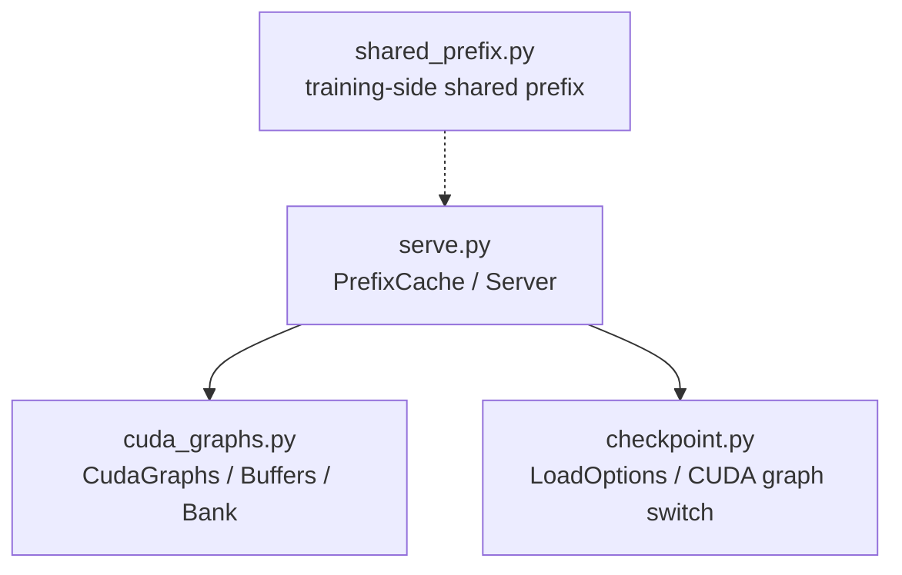
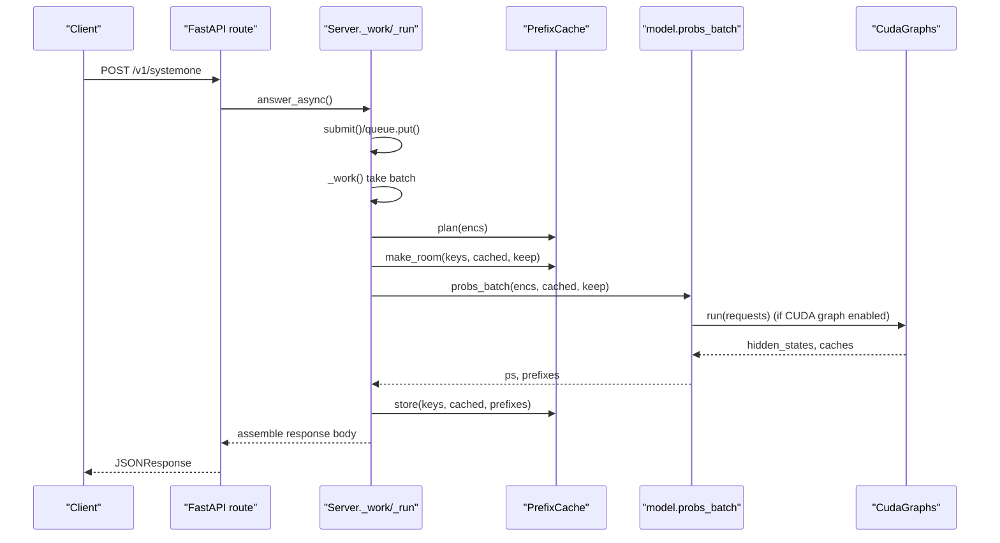
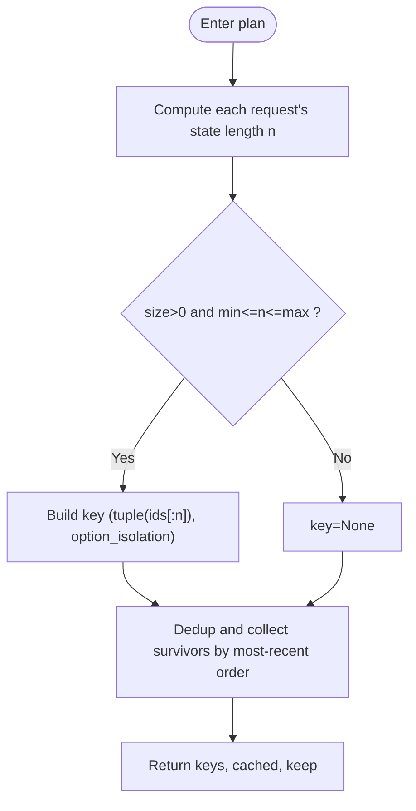
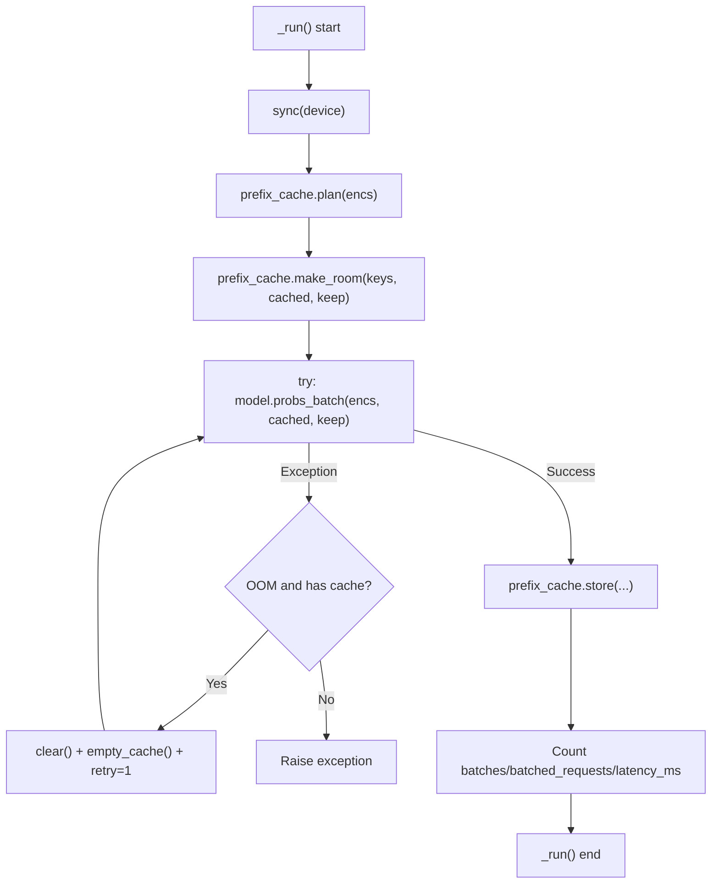
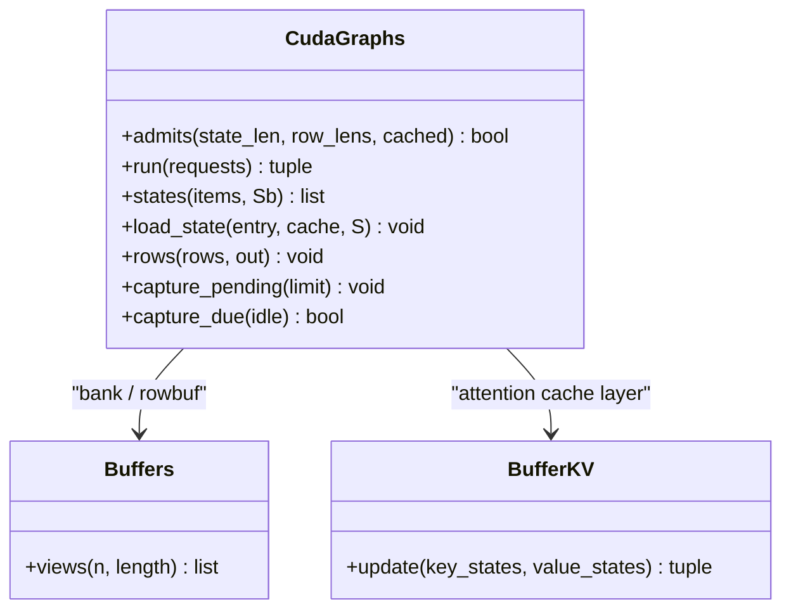
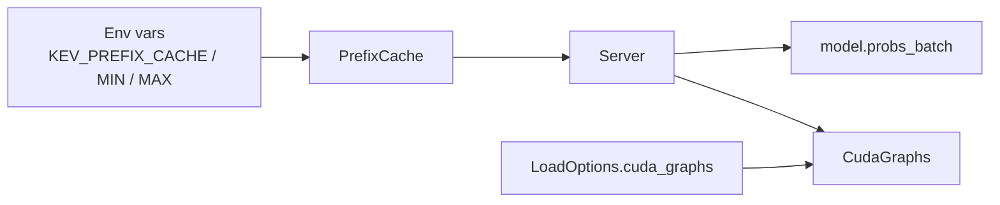

## Table of Contents
1. [Introduction](#introduction)
2. [Project Structure](#project-structure)
3. [Core Components](#core-components)
4. [Architecture Overview](#architecture-overview)
5. [Detailed Component Analysis](#detailed-component-analysis)
6. [Dependency Analysis](#dependency-analysis)
7. [Performance Considerations](#performance-considerations)
8. [Troubleshooting Guide](#troubleshooting-guide)
9. [Conclusion](#conclusion)
10. [Appendix](#appendix)

## Introduction
This technical document focuses on the "prefix cache system", centering on the design and implementation of the `PrefixCache` class, and systematically explains the following topics:
- Cache key generation strategy, LRU eviction algorithm, and memory usage control
- Hit-rate statistics, cache capacity limits, and automatic cleanup strategy
- Integration with CUDA graphs, including the state bank layout and access patterns
- Cache lifecycle management: creation, update, invalidation, and reclamation
- Performance monitoring metrics: hit rate, average access time, memory usage, etc.
- Configuration tuning suggestions and deployment best practices

This prefix cache is used to reuse "state prefixes" (i.e. model context) in the inference service, avoiding redundant computation, thereby significantly reducing latency and improving throughput.

## Project Structure
The prefix cache related code is mainly distributed across the following modules:
- serve.py: provides the PrefixCache class and Server scheduling logic, responsible for request enqueueing, batch processing, CUDA graph capture timing, and the cache's plan/store/make_room flow
- cuda_graphs.py: defines the CUDA graph runtime framework, the state bank layout, row buffers, and batch grouping strategy, as well as dynamic adaptation with the dynamic cache
- shared_prefix.py: the training-side shared prefix forward path (not directly coupled with this cache, but helpful for understanding KV/DeltaNet state semantics)
- checkpoint.py: load options and CUDA graph switch, determining whether the service enables CUDA graphs

Diagram sources
- [serve.py:38-90](file://kev/serve.py#L38-L90)
- [cuda_graphs.py:146-189](file://kev/cuda_graphs.py#L146-L189)
- [checkpoint.py:111-125](file://kev/checkpoint.py#L111-L125)

Section sources
- [serve.py:38-90](file://kev/serve.py#L38-L90)
- [cuda_graphs.py:146-189](file://kev/cuda_graphs.py#L146-L189)
- [checkpoint.py:111-125](file://kev/checkpoint.py#L111-L125)

## Core Components
- PrefixCache: an in-process LRU-based cache that maintains a "state prefix -> cache object" mapping, supporting hit/miss counts, OOM retry counts, and eviction by dual limits on count and token count
- Server: encapsulates the model thread, request queue, CUDA graph capture timing, and coordinates prefix_cache.plan/make_room/model.probs_batch/prefix_cache.store in _run
- CudaGraphs: manages the CUDA graph lifecycle, batch grouping, state bank, and row buffers, providing methods such as admits/run/states/load_state/rows
- Buffers: pre-allocates flat buffers for the attention and DeltaNet layers, exposed as views to replays of different shapes

Section sources
- [serve.py:38-90](file://kev/serve.py#L38-L90)
- [serve.py:93-191](file://kev/serve.py#L93-L191)
- [cuda_graphs.py:146-189](file://kev/cuda_graphs.py#L146-L189)
- [cuda_graphs.py:267-376](file://kev/cuda_graphs.py#L267-L376)

## Architecture Overview
The diagram below shows the critical path of a request from HTTP to model forward to response return, as well as the collaboration points between the prefix cache and CUDA graphs.

Diagram sources
- [serve.py:249-252](file://kev/serve.py#L249-L252)
- [serve.py:150-191](file://kev/serve.py#L150-L191)
- [cuda_graphs.py:273-299](file://kev/cuda_graphs.py#L273-L299)

## Detailed Component Analysis

### PrefixCache: LRU Prefix Cache
Design points
- Cache key: (state token tuple, option_isolation); only participates in caching when the length is within [min_tokens, max_tokens]
- Capacity constraints: limited simultaneously by the number of entries size and the total token count max_tokens of all entries
- Eviction strategy: LRU, preferring to keep recently used entries; store() loops eviction after insertion until the constraints are satisfied
- Batch optimization: plan() first filters a candidate set that "may still survive after this batch ends", avoiding short-term-hit entries polluting the LRU order
- OOM recovery: _run() clears the cache and reruns once on out-of-memory, recording oom_retries

Key methods
- plan(encs): generates a key for each request, looks up existing cache, and determines whether a new state needs to be kept
- over(keys): determines whether a set of keys exceeds the count or token limit
- make_room(keys, cached, keep): pre-deletes old entries that will be evicted in this batch, reducing contention
- store(keys, cached, prefixes): counts hits/misses, inserts in LRU order, and triggers eviction if necessary
- clear(): clears the entire cache

Diagram sources
- [serve.py:52-61](file://kev/serve.py#L52-L61)

Section sources
- [serve.py:38-90](file://kev/serve.py#L38-L90)

### Server: Request Scheduling and Prefix Cache Integration
Responsibilities
- Manages the model thread and request queue, executing model.probs_batch in batches
- Calls PrefixCache.plan/make_room/store before and after each batch
- Depending on CUDA graph capability, triggers capture_pending when idle or when the hot-bucket threshold is reached
- Uniformly wraps TypeSafe-compatible request/response formats, and outputs latency_ms and prefix_cache_hit

Key flow
- submit(): validates request length, encodes, and enqueues
- _work(): pulls a batch of requests, acquires lock, then calls _run()
- _run(): plans cache, reserves space, runs forward, stores results, counts metrics
- wait_idle(): waits for the queue to empty and graph capture to complete

Diagram sources
- [serve.py:172-191](file://kev/serve.py#L172-L191)

Section sources
- [serve.py:93-191](file://kev/serve.py#L93-L191)

### CudaGraphs: CUDA Graphs and State Bank
Design points
- Two sets of shared buffers:
  - State bank: each layer's attention K/V or DeltaNet state, with a fixed layout, so the row pass can read any state written by a state pass in the same way
  - Row buffers: temporary buffer for each question row, aggregated row by row and written back to output
- Batch grouping: grouped by length bucket/count_bucket to reduce shape explosion; length_groups uses dynamic programming to minimize padded tokens
- Graph capture: first runs eagerly to join pending, then asynchronously captures when idle or when the HOT_BUCKET threshold is reached; on failure degrades to eager
- State copy: load_state() copies the DynamicCache into the bank entry; states() returns the cache that can be saved by PrefixCache

Key methods
- admits(state_len, row_lens, cached): determines whether a request is suitable for the CUDA graph path
- run(requests): groups, state pass, row pass, returns picked hidden states and caches
- states(items, Sb): batch state pass, returns the cache that needs to persist
- load_state(entry, cache, S): loads the cached state into the bank entry
- rows(rows, out): batch row pass, writes the results at the needed positions directly into out

Diagram sources
- [cuda_graphs.py:146-189](file://kev/cuda_graphs.py#L146-L189)
- [cuda_graphs.py:267-376](file://kev/cuda_graphs.py#L267-L376)

Section sources
- [cuda_graphs.py:146-189](file://kev/cuda_graphs.py#L146-L189)
- [cuda_graphs.py:267-376](file://kev/cuda_graphs.py#L267-L376)

### Training-side Shared Prefix (Background Reference)
shared_prefix.py defines Prefix and the shared prefix forward, helping to understand how KV and DeltaNet states are passed between layers. Although it does not directly participate in the serving-side cache, its description of "state semantics" helps understand the content and access patterns of cache entries.

Section sources
- [shared_prefix.py:30-70](file://kev/shared_prefix.py#L30-L70)
- [shared_prefix.py:99-132](file://kev/shared_prefix.py#L99-L132)

## Dependency Analysis
- PrefixCache relies on environment variables PREFIX_CACHE_SIZE/PREFIX_MIN_TOKENS/PREFIX_MAX_TOKENS to control behavior
- Server depends on model.probs_batch and optional CudaGraphs; whether it is enabled is decided via LoadOptions.cuda_graphs
- CudaGraphs relies on the layout conventions of transformers.cache_utils.DynamicLayer/LinearAttentionLayer, and pre-allocates memory via Buffers

Diagram sources
- [serve.py:27-31](file://kev/serve.py#L27-L31)
- [checkpoint.py:111-125](file://kev/checkpoint.py#L111-L125)

Section sources
- [serve.py:27-31](file://kev/serve.py#L27-L31)
- [checkpoint.py:111-125](file://kev/checkpoint.py#L111-L125)

## Performance Considerations
- Hit rate and throughput: a high hit rate means more requests can directly reuse the state prefix, reducing redundant computation; combined with CUDA graphs, it reduces kernel launch and Python scheduling overhead
- Batch size and grouping: MAX_BATCH and length_groups jointly determine the total token count and padding ratio within a batch, affecting GPU utilization and latency
- Graph capture cost: the first capture takes about a few hundred milliseconds, and frequent captures should be avoided; the HOT_BUCKET and idle strategies balance the capture timing of hot buckets
- Memory pressure: long states (e.g. 64k) occupy a lot of VRAM; PrefixCache.max_tokens and BANK_WIDTH need to be tuned together to avoid OOM

[This section is general performance discussion and requires no specific file references]

## Troubleshooting Guide
Common issues and localization
- Low hit rate: check whether PREFIX_MIN_TOKENS is too high causing short prefixes not to be cached; confirm whether option_isolation is reasonable
- Frequent OOM retries: observe the growth of oom_retries; appropriately lower PREFIX_CACHE_SIZE or max_tokens, or increase BANK_WIDTH (determined by model and hardware)
- CUDA graph capture failure: check the graphs.stats().failed list; failed buckets fall back to the eager path without affecting service availability
- Latency jitter: pay attention to the call frequency of capture_due and capture_pending; ensure capture happens during idle periods

Observable metrics
- Hit rate: hits / (hits + misses)
- Average latency: latency_ms (from response usage)
- Cache size: cached_states = len(entries)
- OOM retry count: oom_retries
- Graph state: captured/kept/pending/failed

Section sources
- [serve.py:172-191](file://kev/serve.py#L172-L191)
- [serve.py:298-312](file://kev/serve.py#L298-L312)
- [cuda_graphs.py:223-263](file://kev/cuda_graphs.py#L223-L263)

## Conclusion
The prefix cache system effectively reuses cross-request state prefixes through PrefixCache's LRU strategy and dual capacity constraints, significantly reducing redundant computation cost; combined with CUDA graphs, it further reduces kernel launch and scheduling overhead. Reasonable configuration (min/max tokens, size, BANK_WIDTH, MAX_BATCH) and monitoring (hit rate, latency, OOM retries, graph capture state) are the keys to ensuring stable high-performance operation.

[This section is a summary and requires no specific file references]

## Appendix

### Configuration and Environment Variables
- KEV_PREFIX_CACHE: upper limit on the number of cache entries, 0 means disabled
- KEV_PREFIX_MIN_TOKENS: minimum state token count threshold, below which no caching
- KEV_PREFIX_MAX_TOKENS: upper limit on the total token count of all cached entries
- KEV_CUDA_GRAPHS: whether to enable CUDA graphs (enabled on CUDA by default)
- KEV_FUSED: whether to enable fused operators (used with CUDA graphs)
- KEV_TRUNCATE_STATES: whether to truncate over-long states instead of rejecting them

Section sources
- [serve.py:27-33](file://kev/serve.py#L27-L33)
- [checkpoint.py:143-145](file://kev/checkpoint.py#L143-L145)

### Performance Monitoring Interface
- /v1/models returns prefix_cache and cuda_graphs statistics, facilitating collection by external monitoring systems

Section sources
- [serve.py:298-312](file://kev/serve.py#L298-L312)
