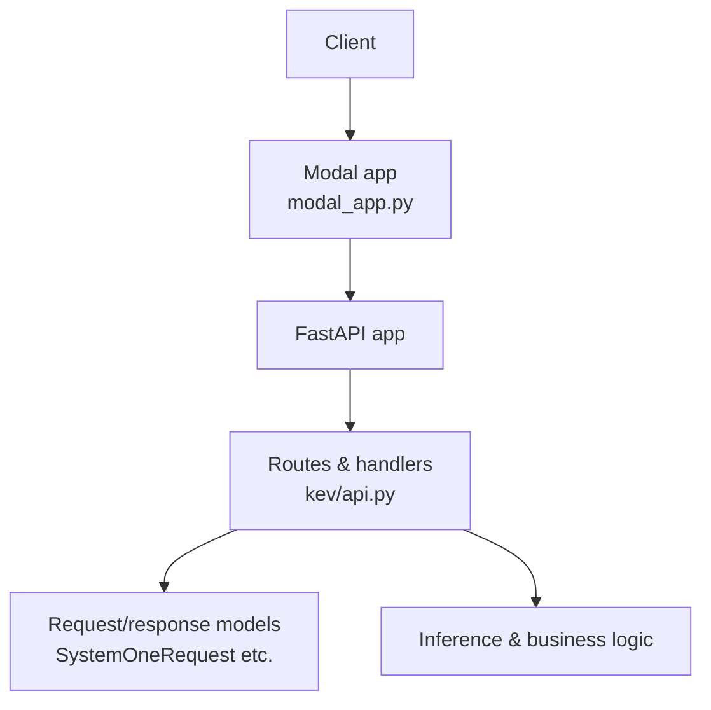
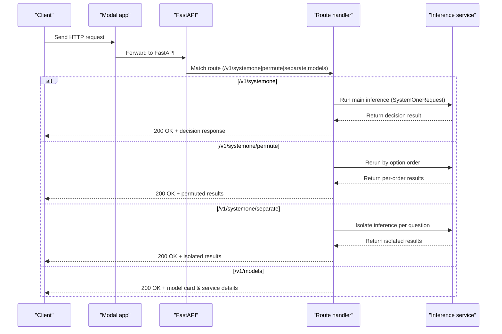
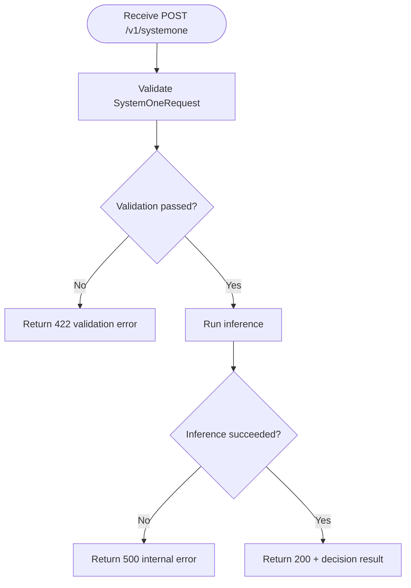
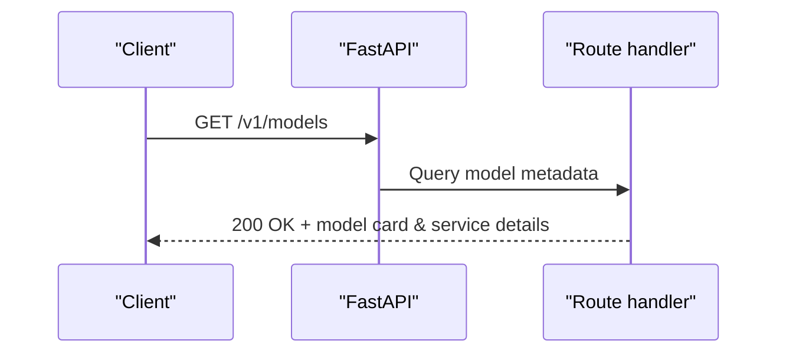
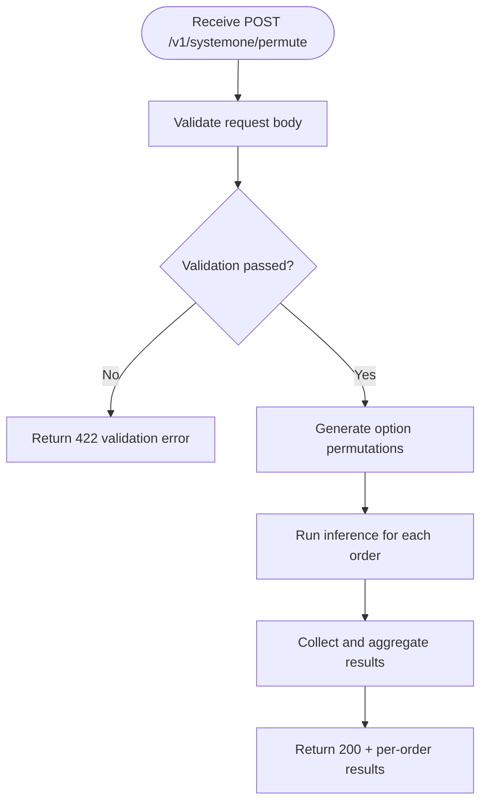
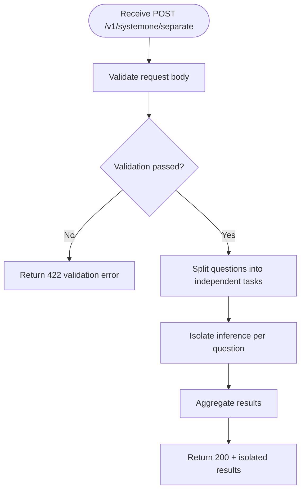
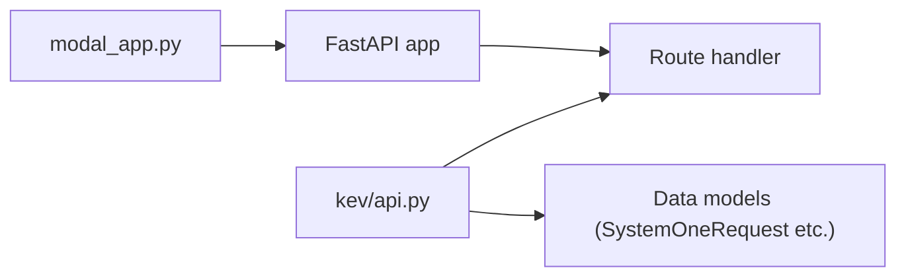

## Table of Contents
1. [Introduction](#introduction)
2. [Project Structure](#project-structure)
3. [Core Components](#core-components)
4. [Architecture Overview](#architecture-overview)
5. [Detailed Endpoint Description](#detailed-endpoint-description)
6. [Dependency Analysis](#dependency-analysis)
7. [Performance and Rate Limiting](#performance-and-rate-limiting)
8. [Troubleshooting Guide](#troubleshooting-guide)
9. [Conclusion](#conclusion)

## Introduction
This document targets Kev's TypeSafe RESTful API, focusing on the following four endpoints:
- POST /v1/systemone: the main decision inference endpoint, receiving a SystemOneRequest and returning the decision result.
- GET /v1/models: model information query, returning the model card and service details.
- POST /v1/systemone/permute: option order test, re-running a single Choice question under different option orders.
- POST /v1/systemone/separate: question isolation test, processing each question separately.

The document provides, for each endpoint, the HTTP method, URL pattern, request body structure, response format, status codes, and error-handling examples, as well as authentication requirements, rate limiting, and best-practice suggestions.

## Project Structure
Kev's API service is started via a Modal app, with routes defined in kev/api.py. The overall structure is as follows:
- modal_app.py: Modal app entry point, responsible for mounting the FastAPI app and configuring the runtime environment.
- kev/api.py: FastAPI routes and request/response data models (including SystemOneRequest, etc.), with their definitions and implementations.
- README.md: project overview and usage instructions, including deployment and basic invocation guidance.

Diagram sources
- [modal_app.py:1-200](file://modal_app.py#L1-L200)
- [kev/api.py:1-200](file://kev/api.py#L1-L200)

Section sources
- [README.md:1-200](file://README.md#L1-L200)
- [modal_app.py:1-200](file://modal_app.py#L1-L200)
- [kev/api.py:1-200](file://kev/api.py#L1-L200)

## Core Components
- FastAPI routing layer: defines endpoints such as /v1/systemone, /v1/systemone/permute, /v1/systemone/separate, /v1/models.
- Data models: Pydantic models such as SystemOneRequest are used to validate request bodies and construct response bodies.
- Business logic: encapsulates the inference flow, option rearrangement, and question isolation strategies.
- Error handling: uniformly maps exceptions to HTTP status codes and structured error messages.

Section sources
- [kev/api.py:1-200](file://kev/api.py#L1-L200)

## Architecture Overview
The diagram below shows the end-to-end flow from client to backend processing, highlighting the responsibilities and interactions of the four endpoints.

Diagram sources
- [modal_app.py:1-200](file://modal_app.py#L1-L200)
- [kev/api.py:1-200](file://kev/api.py#L1-L200)

## Detailed Endpoint Description

### POST /v1/systemone (Main Decision Inference)
- Method: POST
- URL: /v1/systemone
- Authentication: may require an auth header depending on the deployment configuration; if auth is not enabled, no extra header is needed.
- Request body: SystemOneRequest (fields subject to the actual model definition); typical fields include:
  - Problem description or context
  - Option list (Choice-related)
  - Optional parameters (such as temperature, max generation length, etc.)
- Response body: decision result object, containing the final choice, confidence, inference summary, etc.
- Success status code: 200
- Common errors:
  - 400 request body validation failure (missing field or wrong type)
  - 422 model validation failure (Pydantic validation error)
  - 500 internal error (inference exception)

Diagram sources
- [kev/api.py:1-200](file://kev/api.py#L1-L200)

Section sources
- [kev/api.py:1-200](file://kev/api.py#L1-L200)

### GET /v1/models (Model Information Query)
- Method: GET
- URL: /v1/models
- Authentication: per the system default policy (auth may not be required).
- Request body: none
- Response body: array of model cards and service details, including:
  - Model name/version
  - Capability tags (e.g. Choice, reasoning, long context, etc.)
  - Service availability, latency metrics, quota information, etc.
- Success status code: 200
- Common errors:
  - 500 internal error (metadata load failure)

Diagram sources
- [kev/api.py:1-200](file://kev/api.py#L1-L200)

Section sources
- [kev/api.py:1-200](file://kev/api.py#L1-L200)

### POST /v1/systemone/permute (Option Order Test)
- Method: POST
- URL: /v1/systemone/permute
- Authentication: per the system default policy.
- Request body: input for a single Choice question (can reuse some fields of SystemOneRequest), specifying the option set to permute and the ordering strategy.
- Response body: comparison of inference results under different option orders, for evaluating order sensitivity.
- Success status code: 200
- Common errors:
  - 400 incomplete request body or missing required fields
  - 422 model validation failure
  - 500 internal error (permutation or multiple inference failures)

Diagram sources
- [kev/api.py:1-200](file://kev/api.py#L1-L200)

Section sources
- [kev/api.py:1-200](file://kev/api.py#L1-L200)

### POST /v1/systemone/separate (Question Isolation Test)
- Method: POST
- URL: /v1/systemone/separate
- Authentication: per the system default policy.
- Request body: batch input containing multiple questions; the server processes each question independently to avoid mutual interference.
- Response body: independent inference result for each question, for diagnosing interference effects in multi-question scenarios.
- Success status code: 200
- Common errors:
  - 400 incorrect request body structure
  - 422 model validation failure
  - 500 internal error (single or multiple question inference failure)

Diagram sources
- [kev/api.py:1-200](file://kev/api.py#L1-L200)

Section sources
- [kev/api.py:1-200](file://kev/api.py#L1-L200)

## Dependency Analysis
- Routes and models: the routes and request/response models for all endpoints are defined in kev/api.py.
- App entry: modal_app.py is responsible for mounting the FastAPI app and runtime configuration.
- External dependencies: the inference service and underlying model loading logic are provided by backend modules; the API layer only handles protocol and validation.

Diagram sources
- [modal_app.py:1-200](file://modal_app.py#L1-L200)
- [kev/api.py:1-200](file://kev/api.py#L1-L200)

Section sources
- [modal_app.py:1-200](file://modal_app.py#L1-L200)
- [kev/api.py:1-200](file://kev/api.py#L1-L200)

## Performance and Rate Limiting
- Concurrency and batching: /v1/systemone/permute and /v1/systemone/separate may trigger multiple inferences; it is recommended to apply client-side throttling and retry backoff.
- Caching and warm-up: /v1/models should cache model metadata to reduce repeated query overhead.
- Rate limiting: if rate limiting is enabled on the deployment side (e.g. based on IP or user token), follow the limit hints in the response headers (such as Retry-After).
- Timeout and retry: for long-running inferences, exponential backoff retry is recommended to avoid cascading failures.

[This section is general guidance and does not directly analyze specific files]

## Troubleshooting Guide
- 422 validation error: check whether the request body fields conform to the SystemOneRequest definition, ensuring required fields exist and have correct types.
- 500 internal error: check the server logs to locate the inference exception; for permute/separate, confirm whether the number of questions and option scale are too large.
- Authentication failure: confirm that the correct auth header is included (if enabled), and check the token validity period and permission scope.
- Rate limiting: when 429 occurs, back off and retry based on the limit information in the response headers.

Section sources
- [kev/api.py:1-200](file://kev/api.py#L1-L200)

## Conclusion
Kev's TypeSafe API provides clear decision inference and diagnostic capabilities through FastAPI. /v1/systemone serves as the main inference endpoint, and together with /v1/systemone/permute and /v1/systemone/separate can be used to evaluate option-order sensitivity and inter-question interference. /v1/models provides model capabilities and service metadata, facilitating integrators in choosing appropriate models and services. It is recommended to combine authentication, rate limiting, and monitoring alerts in production environments to ensure stable and controllable service quality.
