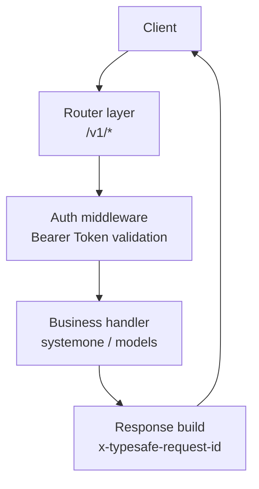
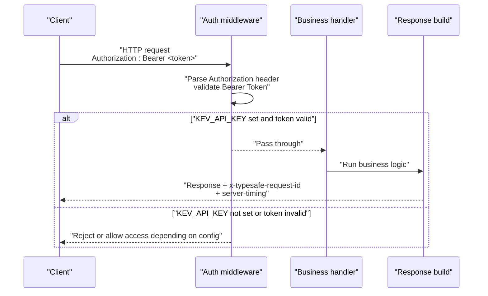
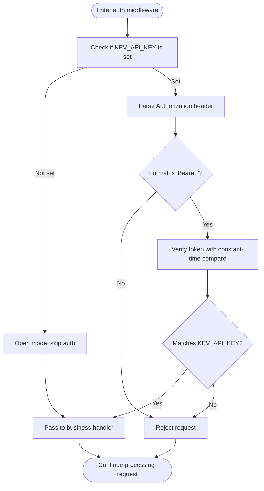
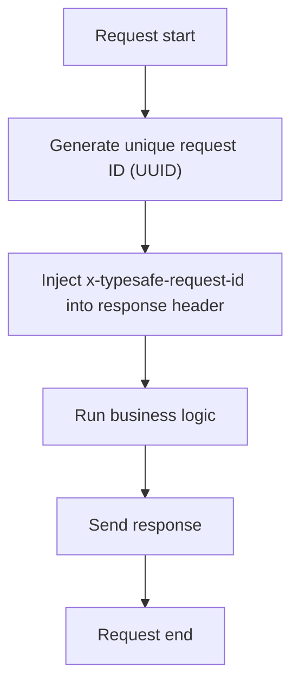
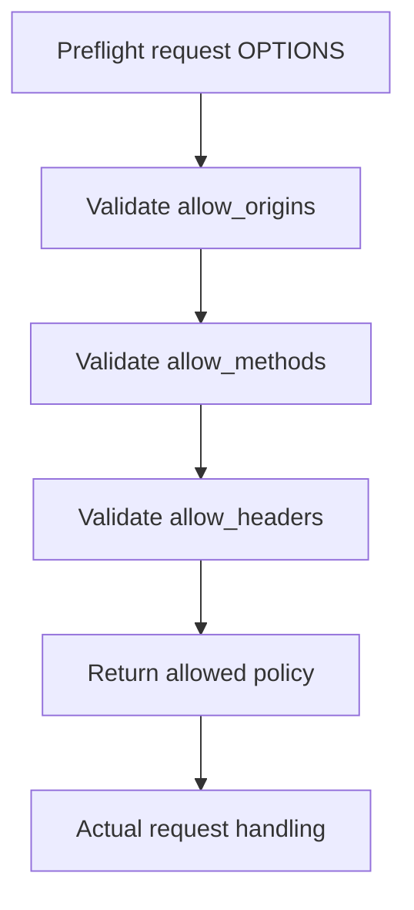
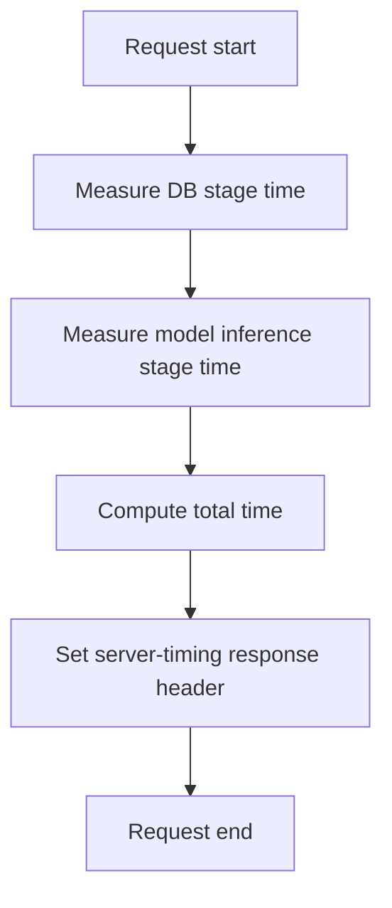
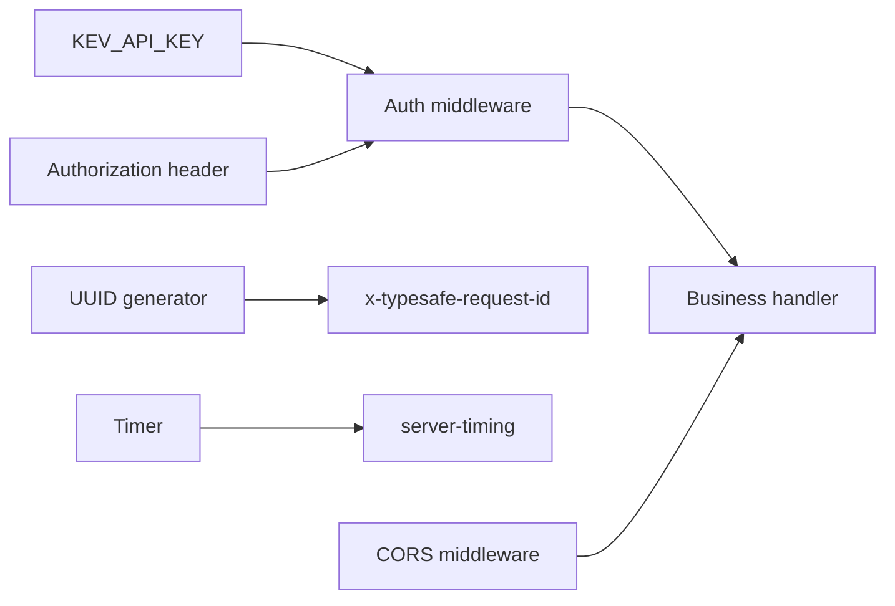

## Table of Contents
1. [Introduction](#introduction)
2. [Project Structure](#project-structure)
3. [Core Components](#core-components)
4. [Architecture Overview](#architecture-overview)
5. [Detailed Component Analysis](#detailed-component-analysis)
6. [Dependency Analysis](#dependency-analysis)
7. [Performance Considerations](#performance-considerations)
8. [Troubleshooting Guide](#troubleshooting-guide)
9. [Conclusion](#conclusion)
10. [Appendix](#appendix)

## Introduction
This document focuses on the TypeSafe-compatible API authentication and observability mechanisms of Kev, organized around the following topics:
- Bearer Token authentication pattern and Authorization header parsing
- The KEV_API_KEY environment variable controlling the open / enforced-authentication operating modes
- Generation of the x-typesafe-request-id response header and request tracking
- CORS middleware configuration points for allow_origins, allow_methods, and allow_headers
- Performance monitoring via the server-timing response header
- Security best practices (key management, HTTPS, log desensitization, etc.)

Note: the repository documentation states that TypeSafe-compatible interfaces support Bearer authentication on the /v1/* paths; when KEV_API_KEY is not set, it is in open-service mode, and when set, it is in enforced-authentication mode. Additionally, every response carries an x-typesafe-request-id so clients can track requests.

Section sources
- [README.md:249-257](file://README.md#L249-L257)
- [AGENTS.md:309-327](file://AGENTS.md#L309-L327)

## Project Structure
Kev's TypeSafe-compatible service is organized with FastAPI-style routes, and the authentication and observability logic mainly sits in the API layer and the middleware layer. According to the repository documentation, the TypeSafe-compatible endpoints include:
- POST /v1/systemone
- GET /v1/models
- Other /v1/* routes

These endpoints require `Authorization: Bearer <key>` when authentication is enabled, and return an x-typesafe-request-id in all responses.

Diagram sources
- [README.md:249-257](file://README.md#L249-L257)
- [AGENTS.md:309-327](file://AGENTS.md#L309-L327)

Section sources
- [README.md:249-257](file://README.md#L249-L257)
- [AGENTS.md:309-327](file://AGENTS.md#L309-L327)

## Core Components
- Authentication middleware (TypeSafe-compatible)
  - Supports Bearer Token authentication
  - Parses the token via the Authorization header
  - Decides whether to enable enforced authentication based on KEV_API_KEY
- Request ID middleware
  - Injects an x-typesafe-request-id into every response
  - Used for cross-link request tracking
- CORS middleware
  - Allows custom allow_origins, allow_methods, allow_headers
- Performance monitoring
  - Exposes key stage timings via the server-timing response header

Section sources
- [README.md:249-257](file://README.md#L249-L257)
- [AGENTS.md:309-327](file://AGENTS.md#L309-L327)

## Architecture Overview
The diagram below shows the lifecycle of a typical TypeSafe-compatible request: from receiving the request, parsing authentication, running the business logic, to returning the response with observability headers attached.

Diagram sources
- [README.md:249-257](file://README.md#L249-L257)
- [AGENTS.md:309-327](file://AGENTS.md#L309-L327)

## Detailed Component Analysis

### Bearer Token Authentication and Authorization Header Parsing
- Authentication trigger conditions
  - When the KEV_API_KEY environment variable exists, /v1/* routes enforce `Authorization: Bearer <key>`
  - When KEV_API_KEY is not set, the service is in open mode and can be accessed without authentication
- Authorization header parsing
  - Standard format: Authorization: Bearer <token>
  - The server must correctly extract the token and compare it with KEV_API_KEY
- Secure comparison
  - It is recommended to use a constant-time comparison function (such as hmac.compare_digest) to avoid timing attacks
  - This implementation detail does not appear directly in the repository documentation but belongs to security best practices

Diagram sources
- [README.md:249-257](file://README.md#L249-L257)
- [AGENTS.md:309-327](file://AGENTS.md#L309-L327)

Section sources
- [README.md:249-257](file://README.md#L249-L257)
- [AGENTS.md:309-327](file://AGENTS.md#L309-L327)

### x-typesafe-request-id Response Header
- Function
  - Every response includes an x-typesafe-request-id, making it easy for clients to correlate requests and responses
  - Can be used for distributed tracing, problem localization, and auditing
- Generation and management
  - Usually generated as a unique identifier based on UUID
  - It is recommended to inject it uniformly in the middleware to avoid omissions

Diagram sources
- [README.md:249-257](file://README.md#L249-L257)
- [AGENTS.md:309-327](file://AGENTS.md#L309-L327)

Section sources
- [README.md:249-257](file://README.md#L249-L257)
- [AGENTS.md:309-327](file://AGENTS.md#L309-L327)

### CORS Middleware Configuration
- Goal
  - Allow cross-origin requests, adapting to front-end or third-party callers
- Key parameters
  - allow_origins: list of allowed origins (e.g. specific domains or wildcard)
  - allow_methods: allowed HTTP methods (GET, POST, PUT, DELETE, OPTIONS, etc.)
  - allow_headers: allowed request headers (Content-Type, Authorization, X-Requested-With, etc.)
- Suggestions
  - Avoid using * as allow_origins in production
  - Only expose necessary methods and headers to reduce the attack surface

Diagram sources
- [README.md:249-257](file://README.md#L249-L257)
- [AGENTS.md:309-327](file://AGENTS.md#L309-L327)

Section sources
- [README.md:249-257](file://README.md#L249-L257)
- [AGENTS.md:309-327](file://AGENTS.md#L309-L327)

### server-timing Performance Monitoring
- Function
  - Exposes timings of key stages via the server-timing response header
  - Helps clients and servers jointly analyze performance bottlenecks
- Common metrics
  - db: database query time
  - model: model inference time
  - total: total processing time
- Usage suggestions
  - Only record high-precision timings when necessary to avoid impacting performance
  - Combine with x-typesafe-request-id for end-to-end tracing

Diagram sources
- [README.md:249-257](file://README.md#L249-L257)
- [AGENTS.md:309-327](file://AGENTS.md#L309-L327)

Section sources
- [README.md:249-257](file://README.md#L249-L257)
- [AGENTS.md:309-327](file://AGENTS.md#L309-L327)

## Dependency Analysis
- Authentication middleware dependencies
  - Environment variable KEV_API_KEY
  - Authorization header parsing logic
  - Constant-time comparison function (recommended)
- Observability dependencies
  - UUID generator (for x-typesafe-request-id)
  - Timer (for server-timing)
- CORS dependencies
  - Built-in framework or third-party CORS middleware

Diagram sources
- [README.md:249-257](file://README.md#L249-L257)
- [AGENTS.md:309-327](file://AGENTS.md#L309-L327)

Section sources
- [README.md:249-257](file://README.md#L249-L257)
- [AGENTS.md:309-327](file://AGENTS.md#L309-L327)

## Performance Considerations
- Authentication overhead
  - Constant-time comparison has small overhead for long keys, but expensive operations should still be avoided on high-frequency paths
- Observability overhead
  - Generation and injection of server-timing and x-typesafe-request-id should be lightweight and efficient
- CORS preflight
  - Configure allow_* reasonably to reduce unnecessary preflight requests

[This section is general guidance and does not directly analyze specific files]

## Troubleshooting Guide
- Authentication failure
  - Check whether KEV_API_KEY is set correctly
  - Confirm the Authorization header format is Bearer <token>
  - Verify that the token matches KEV_API_KEY
- Missing x-typesafe-request-id
  - Check whether the response-building middleware is bypassed
  - Confirm the middleware chain order is correct
- CORS error
  - Check whether allow_origins, allow_methods, allow_headers include the values required by the request
- server-timing missing
  - Check whether the timing logic is interrupted by an exception
  - Confirm the response header injection is not overwritten by subsequent middleware

Section sources
- [README.md:249-257](file://README.md#L249-L257)
- [AGENTS.md:309-327](file://AGENTS.md#L309-L327)

## Conclusion
Kev's TypeSafe-compatible API provides flexible authentication and observability capabilities: it is in open mode when KEV_API_KEY is not set, and enforced Bearer Token authentication when set; every response carries an x-typesafe-request-id for easy tracking; optional server-timing helps performance analysis; the CORS middleware allows fine-grained control of cross-origin behavior. Production deployments should follow security best practices, ensuring key safety, enabling HTTPS, and desensitizing sensitive information in logs.

[This section is a summary and does not directly analyze specific files]

## Appendix
- Environment variables
  - KEV_API_KEY: if set, enables enforced Bearer Token authentication; if not set, open mode
- Response headers
  - x-typesafe-request-id: unique identifier per request
  - server-timing: performance stage timings
- Security suggestions
  - Use a constant-time comparison function (such as hmac.compare_digest)
  - Restrict the CORS scope in production
  - Enable HTTPS and minimize sensitive information in logs

Section sources
- [README.md:249-257](file://README.md#L249-L257)
- [AGENTS.md:309-327](file://AGENTS.md#L309-L327)
