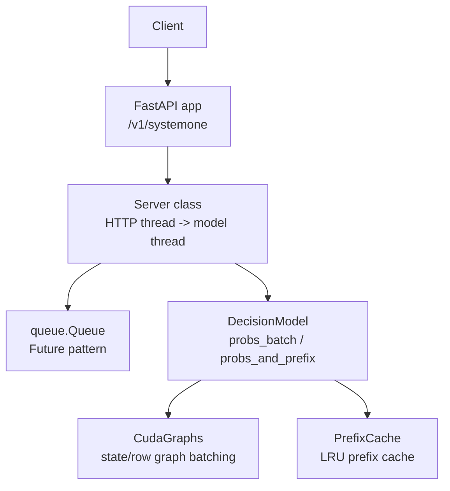
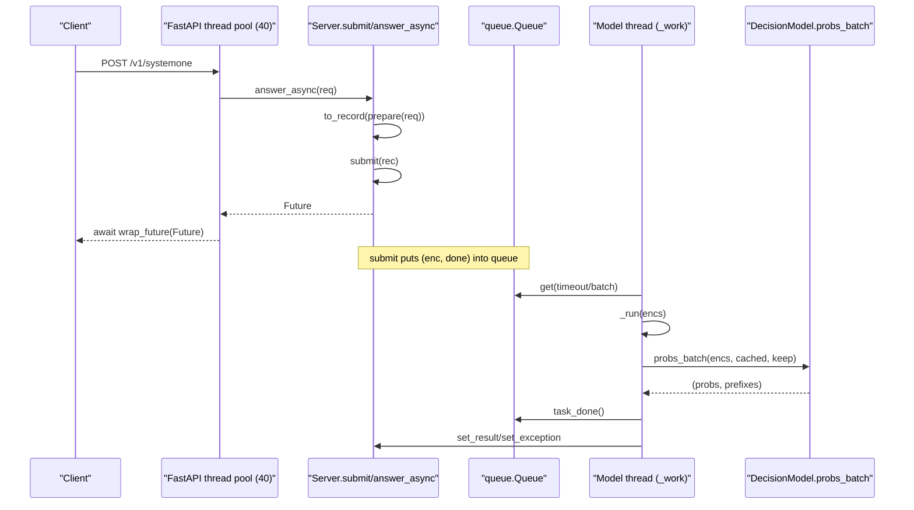
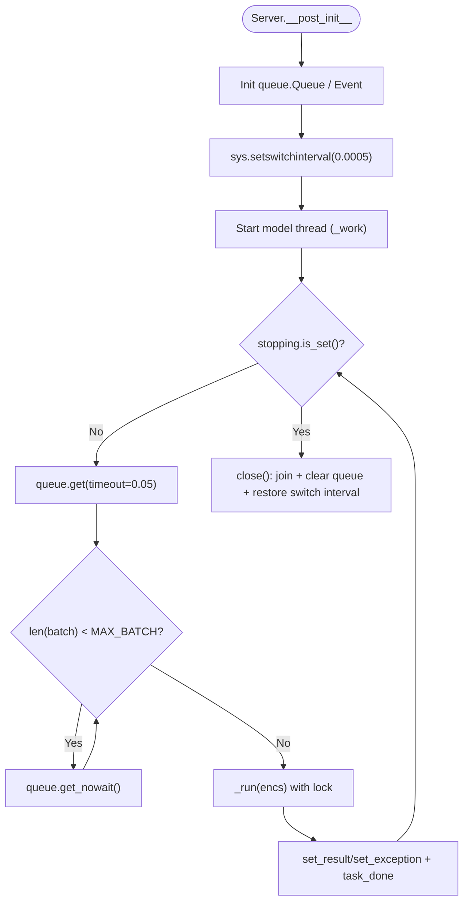
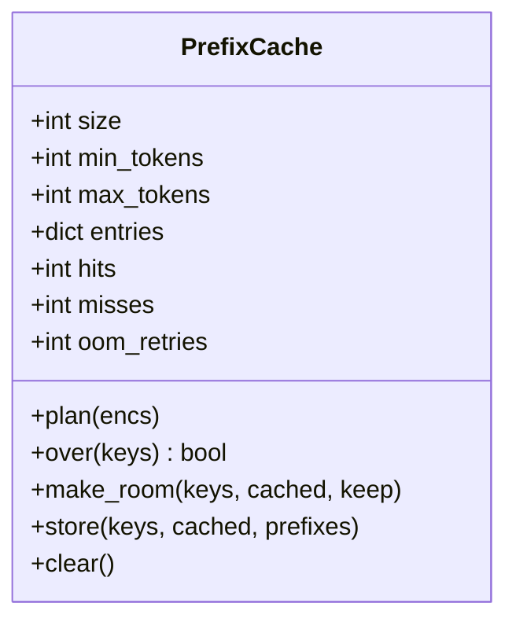
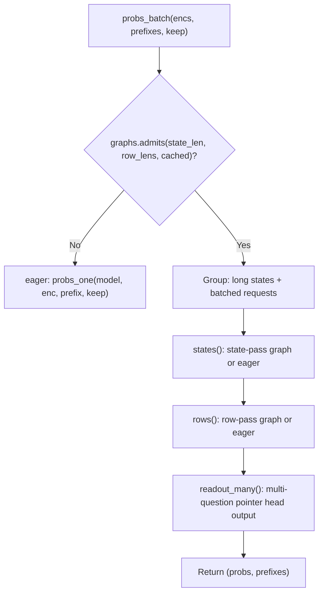
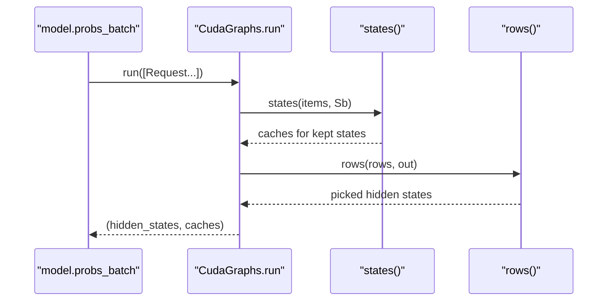
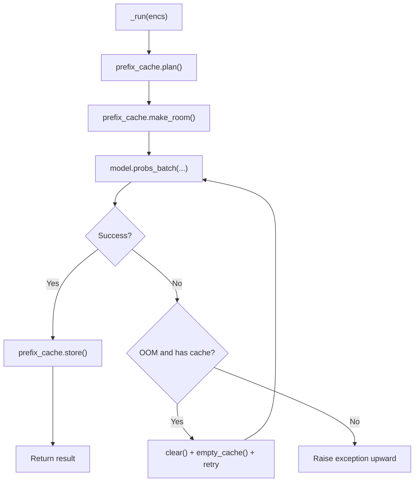
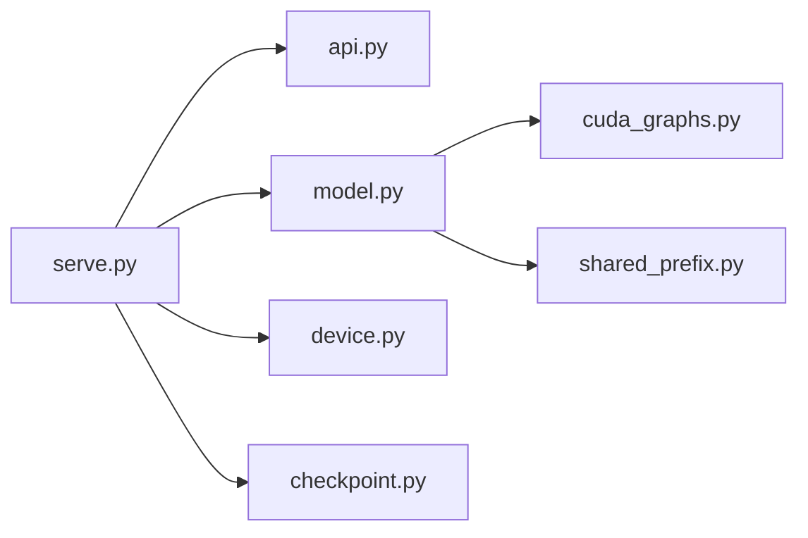

## Table of Contents
1. [Introduction](#introduction)
2. [Project Structure](#project-structure)
3. [Core Components](#core-components)
4. [Architecture Overview](#architecture-overview)
5. [Detailed Component Analysis](#detailed-component-analysis)
6. [Dependency Analysis](#dependency-analysis)
7. [Performance Considerations](#performance-considerations)
8. [Troubleshooting Guide](#troubleshooting-guide)
9. [Conclusion](#conclusion)

## Introduction
This document focuses on the concurrency handling mechanism of the Kev inference service, highlighting:
- The Server class thread architecture: the main thread handles HTTP requests, and the model thread executes inference tasks.
- The queue.Queue work queue and the Future pattern: submit() submits tasks, _work() consumes them in batches.
- MAX_BATCH size control, threading.Lock synchronization, and sys.setswitchinterval() GIL optimization.
- The async handling flow: answer_async() wraps a Future via asyncio.wrap_future(), and FastAPI's default 40-thread pool.
- Memory management strategy: PrefixCache LRU eviction, OOM retry, and CUDA Graph capture optimization.
- Performance tuning suggestions and common issue troubleshooting.

## Project Structure
The inference service entry point of this project is in kev.serve, the core inference interface is in kev.model, the TypeSafe request/response mapping is in kev.api, the CUDA Graph batching is in kev.cuda_graphs, and the training-time shared prefix is in kev.shared_prefix.

Diagram sources
- [serve.py:93-220](file://kev/serve.py#L93-L220)
- [model.py:243-509](file://kev/model.py#L243-L509)
- [cuda_graphs.py:165-376](file://kev/cuda_graphs.py#L165-L376)

Section sources
- [serve.py:1-344](file://kev/serve.py#L1-L344)
- [model.py:1-509](file://kev/model.py#L1-L509)
- [api.py:1-166](file://kev/api.py#L1-L166)
- [cuda_graphs.py:1-376](file://kev/cuda_graphs.py#L1-L376)
- [shared_prefix.py:1-142](file://kev/shared_prefix.py#L1-L142)

## Core Components
- Server: wraps Checkpoint, Tokenizer, model instance, PrefixCache, Queue, Lock, and the background model thread; provides interfaces such as submit/probs/answer/answer_async/_body.
- PrefixCache: maintains KV/state prefixes keyed by (state token ids, option_isolation), supporting size/min_tokens/max_tokens constraints and LRU eviction.
- DecisionModel: unified inference interface (encode/forward/probs/probs_and_prefix/probs_with_prefix/probs_batch), supporting both packed and row forms, as well as CUDA Graph batching.
- CudaGraphs: CUDA Graph batching for the hybrid Qwen3.5 backend, including state pass and row pass, sharing bank/row buffers, with deferred capture.
- api: TypeSafe request/response data models and serialization logic.

Section sources
- [serve.py:38-220](file://kev/serve.py#L38-L220)
- [model.py:243-509](file://kev/model.py#L243-L509)
- [cuda_graphs.py:165-376](file://kev/cuda_graphs.py#L165-L376)
- [api.py:17-166](file://kev/api.py#L17-L166)

## Architecture Overview
Kev adopts a decoupled design of "HTTP thread + single model thread":
- The HTTP thread is responsible for parsing requests, encoding, enqueuing, and returning a Future.
- The model thread batch-pulls tasks from the queue, calls model.probs_batch under a lock to run inference, and then writes the results back to the Future.
- sys.setswitchinterval(0.0005) shortens the Python interpreter switch interval, reducing the time the model thread waits for the event loop.
- FastAPI runs synchronous endpoints in a 40-thread pool, but answer_async uses wrap_future so the request does not occupy a worker thread, only holding the Future.

Diagram sources
- [serve.py:132-209](file://kev/serve.py#L132-L209)
- [model.py:464-492](file://kev/model.py#L464-L492)

## Detailed Component Analysis

### Server Thread Architecture and Queue Mechanism
- Thread responsibility separation
  - HTTP thread: parse requests, admit validation, encode, submit to queue, return Future.
  - Model thread: loop to take tasks from the queue, consume in batches, run inference under a lock, write back results.
- Queue and Future
  - submit() creates a Future, enqueues (enc, done), and returns the Future.
  - _work() first blocks to take one task, then non-blockingly pulls up to MAX_BATCH, then calls _run under a lock.
  - Each request's result is written to the Future via done.set_result/set_exception.
- Synchronization and switches
  - threading.Lock protects each batch's model access and CUDA Graph capture.
  - sys.setswitchinterval(0.0005) lowers the GIL switch period, mitigating event-loop blocking caused by the model thread holding the GIL for long stretches.
- Shutdown flow
  - close() sets the stopping event, joins the model thread, clears the Futures in the queue and raises an exception, and restores the switch interval.

Diagram sources
- [serve.py:111-170](file://kev/serve.py#L111-L170)

Section sources
- [serve.py:93-209](file://kev/serve.py#L93-L209)

### Batching and MAX_BATCH
- MAX_BATCH = 64: the model thread pulls at most 64 requests at once for batching.
- _work() first blocks to get one task, then non-blockingly pulls as many as possible until MAX_BATCH is reached or the queue is empty.
- Intra-batch error handling: if any request fails, all Futures corresponding to the batch receive the exception; simultaneously the traceback frames are cleared to release tensor references.

Section sources
- [serve.py:34-35](file://kev/serve.py#L34-L35)
- [serve.py:150-170](file://kev/serve.py#L150-L170)

### Async Handling and FastAPI Thread Pool
- answer_async()
  - Wraps the Future returned by submit() with asyncio.wrap_future() so the event loop can await it.
  - The comment notes that FastAPI uses a 40-thread pool for synchronous endpoints; since answer_async does not block the worker thread, the container can process multiple requests concurrently, limited by queue throughput and the model thread's batching capacity.
- prepare()/to_record()
  - Preprocesses state (optional date-fact injection) and converts a SystemOneRequest into an internal record.

Section sources
- [serve.py:205-209](file://kev/serve.py#L205-L209)
- [serve.py:223-225](file://kev/serve.py#L223-L225)
- [api.py:102-117](file://kev/api.py#L102-L117)

### Prefix Cache PrefixCache (LRU)
- Key design: (tuple(state_ids[:n]), bool(option_isolation)), where n is the state token count.
- Capacity limits: size (number of states), max_tokens (upper bound on total tokens of all states), min_tokens (states shorter than this threshold are not cached).
- plan(): computes the key for each request, hits the prefix, and decides whether to keep the new prefix.
- make_room(): proactively discards entries that will be evicted before the batch runs, avoiding competition between old and new states for VRAM.
- store(): records hits/misses and inserts in LRU order; when max_tokens is exceeded, pops the oldest entry.
- oom_retries: counts the number of OOM cache-clear retries.

Diagram sources
- [serve.py:38-90](file://kev/serve.py#L38-L90)

Section sources
- [serve.py:38-90](file://kev/serve.py#L38-L90)

### Model Inference and Batching (DecisionModel)
- Interface contract: encode/forward/probs/probs_and_prefix/probs_with_prefix/probs_batch, etc.
- Two inference forms
  - packed: processes the entire sequence at once with a block causal mask.
  - rows: each question as an independent causal row, suitable for long sequences or hybrid backends.
- probs_batch
  - Splits requests based on CUDA Graph capability: requests that need eager prefix computation first are handled separately, the rest go through the graphed path.
  - Returns per-request probabilities and prefixes (may be None).
- prefix/probs_and_prefix/probs_with_prefix
  - Precisely reuses state prefixes (KV and necessary hidden states) to avoid redundant computation.
  - Keeps the row form for hybrid backends; the attention-only backend can use packed.

Diagram sources
- [model.py:464-505](file://kev/model.py#L464-L505)
- [cuda_graphs.py:273-376](file://kev/cuda_graphs.py#L273-L376)

Section sources
- [model.py:243-509](file://kev/model.py#L243-L509)

### CUDA Graph Batching (CudaGraphs)
- Goal: for the hybrid Qwen3.5 backend, graph the state pass and row pass separately to reduce kernel launch overhead.
- Buffer design
  - State bank: each layer's attention KV and DeltaNet state, fixed layout, right-aligned storage of state.
  - Row buffer (rowbuf): each layer's attention and DeltaNet state, used for the row pass.
- Bucketing and grouping
  - bucket()/count_bucket(): bucket lengths and counts to reduce shape explosion.
  - length_groups(): dynamic-programming grouping to minimize padded tokens.
- Capture strategy
  - capture_pending(): captures after idle or when a hot bucket reaches HOT_BUCKET eager runs.
  - On capture failure, degrades to eager, without affecting the service.
- Execution flow
  - run(requests): groups by state length, first states() to generate/reuse state, then rows() to compute row hidden, and finally aggregate picks.

Diagram sources
- [cuda_graphs.py:273-376](file://kev/cuda_graphs.py#L273-L376)
- [model.py:464-492](file://kev/model.py#L464-L492)

Section sources
- [cuda_graphs.py:1-376](file://kev/cuda_graphs.py#L1-L376)

### Memory Management and OOM Retry
- PrefixCache OOM retry
  - When model.probs_batch raises within _run(), it checks whether it is an OOM and there are cached states; if so, it clears the cache and retries once.
  - After clearing, calls empty_cache(device) to release VRAM fragmentation.
- PrefixCache proactive eviction
  - make_room() proactively deletes states that are about to be evicted before the batch starts, avoiding competition between old and new states for VRAM.
- CUDA Graph capture failure
  - On capture failure, capture_pending() records the failed bucket and continues to execute eagerly, without interrupting the service.

Diagram sources
- [serve.py:172-191](file://kev/serve.py#L172-L191)
- [cuda_graphs.py:223-254](file://kev/cuda_graphs.py#L223-L254)

Section sources
- [serve.py:172-191](file://kev/serve.py#L172-L191)
- [cuda_graphs.py:223-254](file://kev/cuda_graphs.py#L223-L254)

### Shared Prefix (Training-time)
- shared_prefix.py provides the training-time shared state prefix for the hybrid backend, avoiding recomputing state for each branch.
- The Prefix object simulates cache behavior, supporting update/update_conv_state/update_recurrent_state, and extracts state by branch owner in branch(owner).
- branch_hidden() left-pads the state and right-pads the branches, executes the state pass and branch pass layer by layer, ensuring correct gradient backpropagation.

Section sources
- [shared_prefix.py:1-142](file://kev/shared_prefix.py#L1-L142)

## Dependency Analysis
- serve.py depends on
  - api: SystemOneRequest, to_record, to_answers, with_date_facts.
  - checkpoint: Checkpoint, LoadOptions.
  - device: default_device, empty_cache, out_of_memory, sync.
  - model: SERVE_MAX_STATE, ContextOverflow, admit.
- model.py depends on
  - cuda_graphs: Request (imported only within probs_batch to avoid spatial packing issues).
- cuda_graphs.py depends on
  - transformers: DynamicCache, LinearAttentionLayer.
- shared_prefix.py depends on
  - torch.distributed.fsdp: FSDPModule, register_fsdp_forward_method.

Diagram sources
- [serve.py:14-25](file://kev/serve.py#L14-L25)
- [model.py:482-482](file://kev/model.py#L482-L482)
- [cuda_graphs.py:40-42](file://kev/cuda_graphs.py#L40-L42)
- [shared_prefix.py:26-27](file://kev/shared_prefix.py#L26-L27)

Section sources
- [serve.py:14-25](file://kev/serve.py#L14-L25)
- [model.py:482-482](file://kev/model.py#L482-L482)
- [cuda_graphs.py:40-42](file://kev/cuda_graphs.py#L40-L42)
- [shared_prefix.py:26-27](file://kev/shared_prefix.py#L26-L27)

## Performance Considerations
- Batch size MAX_BATCH
  - Increasing it improves throughput but raises queue latency and peak VRAM; it is recommended to tune it with load stress testing.
- GIL switch interval
  - sys.setswitchinterval(0.0005) significantly reduces contention between the model thread and the event loop; this configuration should be kept in production.
- CUDA Graph capture
  - The first capture has ~0.4s overhead; it is recommended to warm up during idle periods or capture on demand (capture_due).
  - On capture failure, automatically degrades to eager without affecting service availability.
- Prefix cache hit rate
  - Reasonably set PREFIX_CACHE_SIZE, PREFIX_MIN_TOKENS, PREFIX_MAX_TOKENS to balance hit rate and VRAM usage.
- Data type and backend
  - Default bf16 improves speed; if necessary, KEV_DTYPE=fp32 ensures numerical consistency.
  - Fused Qwen3.5 kernels can reduce GPU time; a prompt is shown when FLA is not installed.

[This section is general performance guidance and requires no specific file analysis]

## Troubleshooting Guide
- Context overflow (422)
  - Symptom: state too long or question row too long, triggering ContextOverflow.
  - Solution: shorten the document, split the request, or enable KEV_TRUNCATE_STATES=1 to truncate the first segment.
- Server stopped (503)
  - Symptom: submitting after close() raises 503.
  - Solution: ensure the process exits normally, avoiding being force-killed during CUDA calls.
- OOM retry
  - Symptom: batch OOM, PrefixCache cleared and retried.
  - Solution: check PREFIX_MAX_TOKENS, MAX_BATCH, GRAPH_STATE/ROW limits; reduce concurrency if necessary.
- CUDA Graph capture failure
  - Symptom: log prints capture failure, bucket falls back to eager.
  - Solution: watch the failed stats; if failures are frequent, consider disabling cuda_graphs or adjusting shape buckets.
- High latency
  - Symptom: latency_ms rises.
  - Troubleshoot: observe the batches, queued, prefix_cache, and cuda_graphs metrics from /v1/models; confirm whether it is in the warm-up phase.

Section sources
- [serve.py:138-145](file://kev/serve.py#L138-L145)
- [serve.py:124-130](file://kev/serve.py#L124-L130)
- [serve.py:172-191](file://kev/serve.py#L172-L191)
- [cuda_graphs.py:223-254](file://kev/cuda_graphs.py#L223-L254)
- [serve.py:298-312](file://kev/serve.py#L298-L312)

## Conclusion
Kev's concurrency handling achieves high throughput and low blocking through a clear division of labor between "HTTP thread + single model thread", combined with queue.Queue and the Future pattern; MAX_BATCH, threading.Lock, and GIL switch optimization jointly guarantee stability and performance; the LRU and OOM retry of PrefixCache, and the deferred capture and degradation strategy of CUDA Graphs, further improve resource utilization and service resilience. In production environments, it is recommended to tune batch size, cache parameters, and graph capture strategy according to load characteristics, and continuously monitor the runtime metrics exposed by /v1/models.
