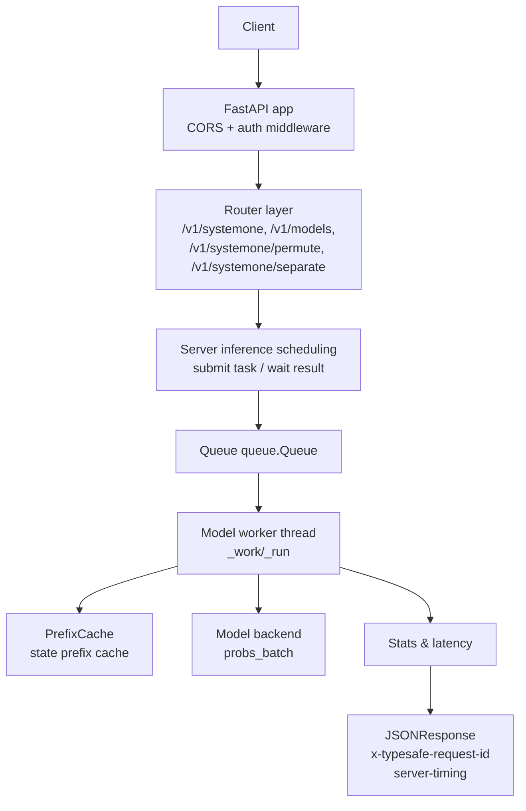
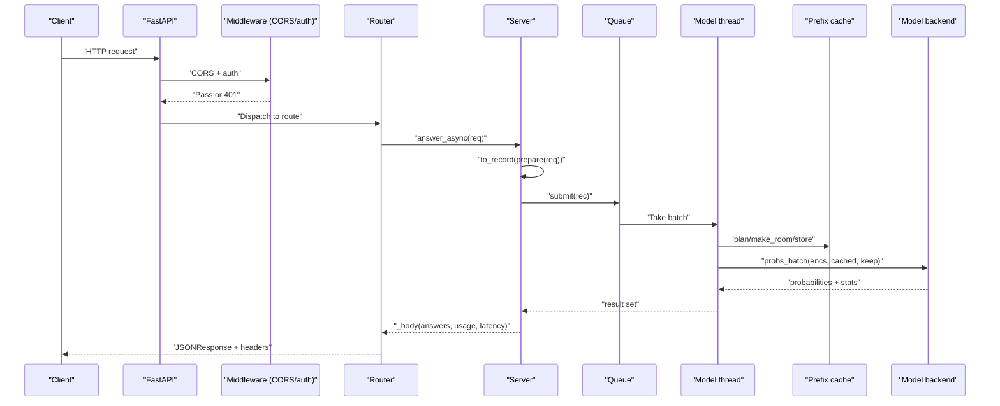
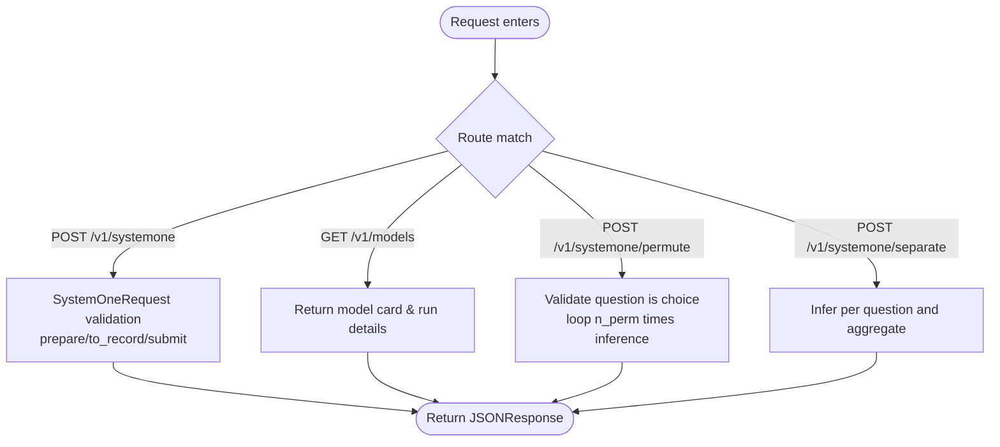
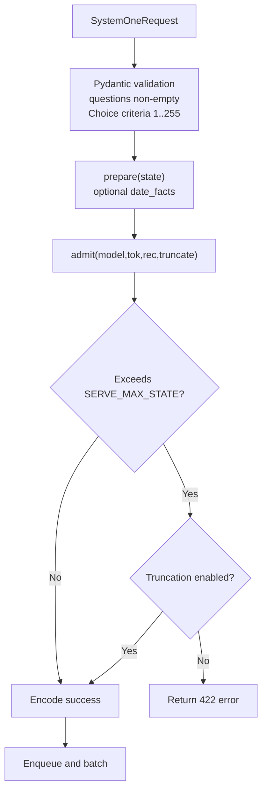
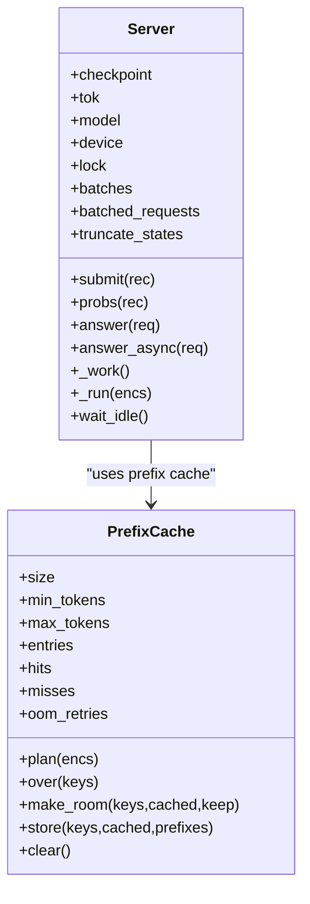
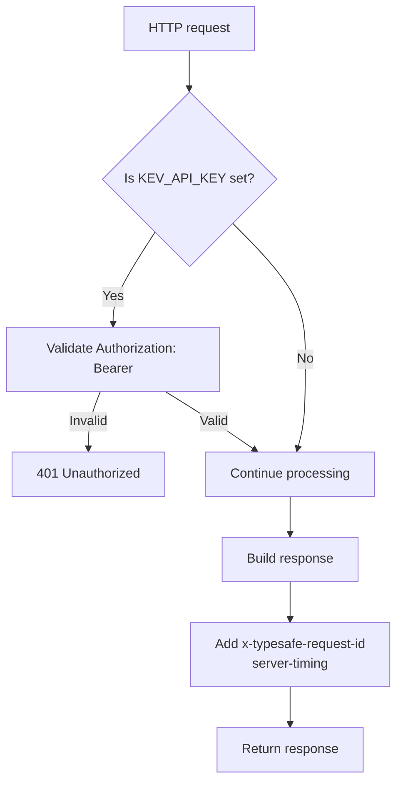
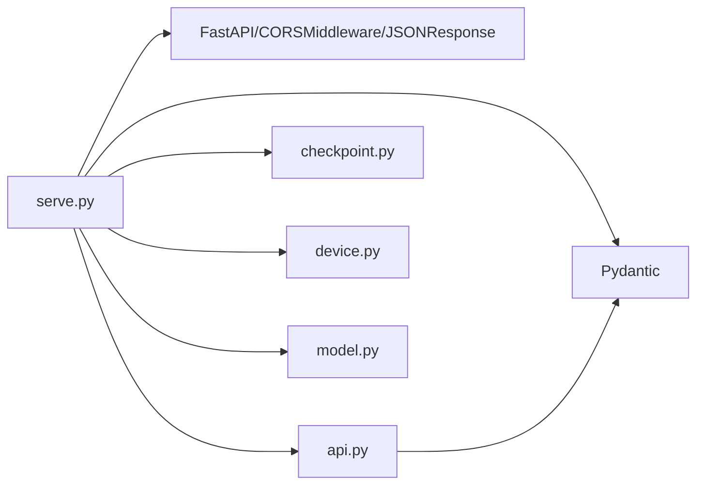

## Table of Contents
1. [Introduction](#introduction)
2. [Project Structure](#project-structure)
3. [Core Components](#core-components)
4. [Architecture Overview](#architecture-overview)
5. [Detailed Component Analysis](#detailed-component-analysis)
6. [Dependency Analysis](#dependency-analysis)
7. [Performance and Concurrency Characteristics](#performance-and-concurrency-characteristics)
8. [Troubleshooting Guide](#troubleshooting-guide)
9. [Conclusion](#conclusion)

## Introduction
This document targets HTTP request handling for the Kev inference service, focusing on the TypeSafe-compatible API endpoints and the complete request lifecycle: from FastAPI receiving the request, authentication and CORS middleware, Pydantic data validation, context-length checking and overflow handling, thread-pool and queue-driven async inference, to finally returning a structured answer. The document also covers the following endpoints:
- POST /v1/systemone: the main decision inference endpoint
- GET /v1/models: model information query
- POST /v1/systemone/permute: option order test
- POST /v1/systemone/separate: question isolation test

## Project Structure
The Kev inference service consists of two core modules:
- kev/serve.py: FastAPI app, routes, middleware, Server inference scheduling, prefix cache, environment variable configuration, and startup logic
- kev/api.py: TypeSafe-compatible request/response data structures, question type definitions, probability and confidence computation, and output token statistics

Diagram sources
- [serve.py:228-242](file://kev/serve.py#L228-L242)
- [serve.py:249-312](file://kev/serve.py#L249-L312)
- [serve.py:93-220](file://kev/serve.py#L93-L220)

Section sources
- [serve.py:1-13](file://kev/serve.py#L1-L13)
- [serve.py:228-344](file://kev/serve.py#L228-L344)
- [api.py:1-166](file://kev/api.py#L1-L166)

## Core Components
- SystemOneRequest: the TypeSafe-compatible request body, containing state, model, questions (at least one)
- Question union type: Noul, Choice, Score, corresponding to boolean, multiple-choice, and ordered scoring respectively
- Server: wraps Checkpoint, Tokenizer, Model, and device info; manages prefix cache, queue, worker thread, and batching
- PrefixCache: an LRU-style state prefix cache, limited by size and max_tokens, supporting OOM recovery
- Middleware: CORS and Bearer Token authentication, injecting x-typesafe-request-id and server-timing

Section sources
- [api.py:17-46](file://kev/api.py#L17-L46)
- [serve.py:38-90](file://kev/serve.py#L38-L90)
- [serve.py:93-220](file://kev/serve.py#L93-L220)
- [serve.py:228-242](file://kev/serve.py#L228-L242)

## Architecture Overview
The diagram below shows the lifecycle of a typical request: the client sends a request, which passes through CORS and authentication middleware, enters the router layer, calls Server.answer_async, which internally encodes the request and puts it into the queue; the model thread runs inference in batches, and finally assembles and returns the response.

Diagram sources
- [serve.py:228-242](file://kev/serve.py#L228-L242)
- [serve.py:249-252](file://kev/serve.py#L249-L252)
- [serve.py:200-220](file://kev/serve.py#L200-L220)
- [serve.py:132-191](file://kev/serve.py#L132-L191)

## Detailed Component Analysis

### TypeSafe-compatible API Endpoints
- POST /v1/systemone
  - Function: receives SystemOneRequest, returns answers, usage, latency_ms
  - Flow: prepare -> to_record -> submit -> model thread batching -> _body
  - Key behavior: optional date-fact preprocessing, context-length check, truncation flag
- GET /v1/models
  - Function: returns the models list, each model containing name, description, release_date, and run details (backend, dtype, temperature, prefix_cache, batches, etc.)
- POST /v1/systemone/permute
  - Function: reruns a single Choice question under n_perm option orders, returns runs, argmax_stable, spread
  - Constraints: the question must exist and be of type choice; n_perm ranges 1..64
- POST /v1/systemone/separate
  - Function: infers each question of the same state separately N times, aggregating answers with usage and latency_ms

Diagram sources
- [serve.py:249-312](file://kev/serve.py#L249-L312)

Section sources
- [serve.py:249-312](file://kev/serve.py#L249-L312)

### Request Validation Mechanism
- Pydantic model validation
  - SystemOneRequest: state is arbitrary JSONContent, model defaults to "kev-latest", questions dict has at least one item
  - Question union type:
    - Noul: type="noul", instructions optional, criteria may be empty
    - Choice: type="choice", criteria dict, count 1..MAX_OPTIONS (255)
    - Score: type="score", criteria list, length 1..MAX_OPTIONS
- Input length and context overflow
  - SERVE_MAX_STATE: states exceeding this length are rejected (422), or, when KEV_TRUNCATE_STATES=1 is enabled, only the first few tokens are read, and the response marks truncated and usage.state_tokens/state_tokens_used
  - The admit function performs the pre-encoding context check, raising ContextOverflow or ValueError
- Optional preprocessing
  - prepare: when KEV_DATE_FACTS=1 is enabled, appends date_facts field or paragraph to state

Diagram sources
- [api.py:17-46](file://kev/api.py#L17-L46)
- [serve.py:132-145](file://kev/serve.py#L132-L145)
- [serve.py:223-226](file://kev/serve.py#L223-L226)

Section sources
- [api.py:17-46](file://kev/api.py#L17-L46)
- [serve.py:132-145](file://kev/serve.py#L132-L145)
- [serve.py:223-226](file://kev/serve.py#L223-L226)

### Concurrent Handling Mechanism
- Thread model
  - Single model thread: Server._work continuously takes tasks from queue.Queue and executes them together once up to MAX_BATCH (default 64) requests are accumulated
  - Event loop and thread decoupled: answer_async uses asyncio.wrap_future to avoid blocking FastAPI's worker threads
- Queue and Future
  - submit puts (enc, done) into the queue and returns a Future; the model thread sets the result or exception upon completion
- Lock and synchronization
  - threading.Lock protects model access and CUDA graph capture
  - sys.setswitchinterval is reduced to lower the batch-processing time inflation caused by GIL waits
- Batching and graph capture
  - model.probs_batch supports shared state and row-level pass; CUDA graphs capture pending graphs when idle or needed

Diagram sources
- [serve.py:38-90](file://kev/serve.py#L38-L90)
- [serve.py:93-220](file://kev/serve.py#L93-L220)

Section sources
- [serve.py:93-220](file://kev/serve.py#L93-L220)

### Authentication Middleware and Tracing
- Bearer Token authentication
  - When KEV_API_KEY is set, all /v1 paths must carry Authorization: Bearer <key>, otherwise 401 is returned
  - When KEV_API_KEY is not set, it is an open server (local default)
- CORS configuration
  - allow_origins=["*"], allow_methods=["*"], allow_headers=["*"]
  - expose_headers exposes x-typesafe-request-id and server-timing
- Request ID tracing
  - Response header x-typesafe-request-id: prefers reusing the value from the request header, otherwise generates a UUID hex
  - server-timing: records in-app elapsed time (milliseconds)

Diagram sources
- [serve.py:228-242](file://kev/serve.py#L228-L242)

Section sources
- [serve.py:228-242](file://kev/serve.py#L228-L242)

### Request Format Examples and Error Response Best Practices
- Request body example (POST /v1/systemone)
  - state: arbitrary JSONContent (string, object, array, scalar, null)
  - model: string, default "kev-latest"
  - questions: keys are question IDs, values are Question (Noul/Choice/Score)
- Response body structure
  - model: the model name used in the request
  - answers: answers mapped by question ID, containing type, choice/score/noul, probabilities, confidence
  - usage: input_tokens, output_tokens; if truncation is enabled, includes state_tokens, state_tokens_used
  - latency_ms: model inference time (milliseconds)
  - truncated: only present in truncation mode, indicating whether state was truncated
- Common errors
  - 401: missing or invalid API Key
  - 422: context overflow or illegal input (e.g. Choice criteria count out of bounds)
  - 503: server is shutting down

Section sources
- [serve.py:249-312](file://kev/serve.py#L249-L312)
- [api.py:149-166](file://kev/api.py#L149-L166)

## Dependency Analysis
- serve.py depends on
  - FastAPI, CORSMiddleware, JSONResponse
  - Pydantic BaseModel, Field
  - api.SystemOneRequest, to_record, to_answers, output_tokens, with_date_facts
  - checkpoint.Checkpoint, LoadOptions, fused_available, is_hub_id
  - device.default_device, empty_cache, out_of_memory, sync
  - model.SERVE_MAX_STATE, ContextOverflow, admit
- api.py depends on
  - Pydantic BaseModel, Field, model_validator
  - datetime, re, json

Diagram sources
- [serve.py:14-25](file://kev/serve.py#L14-L25)
- [serve.py:228-344](file://kev/serve.py#L228-L344)
- [api.py:1-166](file://kev/api.py#L1-L166)

Section sources
- [serve.py:14-25](file://kev/serve.py#L14-L25)
- [serve.py:228-344](file://kev/serve.py#L228-L344)
- [api.py:1-166](file://kev/api.py#L1-L166)

## Performance and Concurrency Characteristics
- Batch upper bound: MAX_BATCH=64, reducing kernel launch overhead
- CUDA Graphs: enabled by default on CUDA devices, captures graphs during warm-up to significantly reduce first-token latency
- Fused kernels: enables fused Qwen3.5 kernels when available, reducing GPU time
- Prefix cache: caches state prefixes with an LRU policy; a hit can skip repeated forward computation of state
- Memory safety: on OOM, automatically clears the prefix cache and retries once; if still failing, raises the exception upward
- Thread-switch optimization: shortens the Python switch interval to reduce the impact of GIL waits on batching

Section sources
- [serve.py:27-35](file://kev/serve.py#L27-L35)
- [serve.py:150-191](file://kev/serve.py#L150-L191)
- [serve.py:315-339](file://kev/serve.py#L315-L339)

## Troubleshooting Guide
- 401 Unauthorized
  - Symptom: returns {"detail": "missing or invalid API key; send Authorization: Bearer <KEV_API_KEY>"}
  - Troubleshoot: confirm KEV_API_KEY is set and the Authorization: Bearer <key> header is carried in the request
- 422 Context overflow
  - Symptom: state exceeding SERVE_MAX_STATE is rejected
  - Solution: enable KEV_TRUNCATE_STATES=1, or trim state on the client side
- 503 Service stopped
  - Symptom: Server.stopping is set, submit raises 503
  - Troubleshoot: check the process exit signal or graceful shutdown logic
- OOM recovery
  - Symptom: model thread catches out_of_memory exception, clears prefix cache and retries once
  - Troubleshoot: monitor prefix_cache.oom_retries and memory reserved/allocated
- Low prefix cache hit rate
  - Symptom: abnormal hits/misses ratio
  - Troubleshoot: adjust PREFIX_CACHE_SIZE, PREFIX_MIN_TOKENS, PREFIX_MAX_TOKENS

Section sources
- [serve.py:232-242](file://kev/serve.py#L232-L242)
- [serve.py:132-145](file://kev/serve.py#L132-L145)
- [serve.py:172-191](file://kev/serve.py#L172-L191)

## Conclusion
The Kev inference service provides TypeSafe-compatible API endpoints through FastAPI, combined with strict Pydantic data validation, context-length checking, and prefix caching, achieving high-throughput, low-latency decision inference. The authentication middleware and CORS configuration ensure security and cross-origin availability, and the thread-pool and queue-driven async inference improves resource utilization. On the operations side, behavior can be finely controlled via environment variables, and request tracing and performance observation can be performed via response headers.
