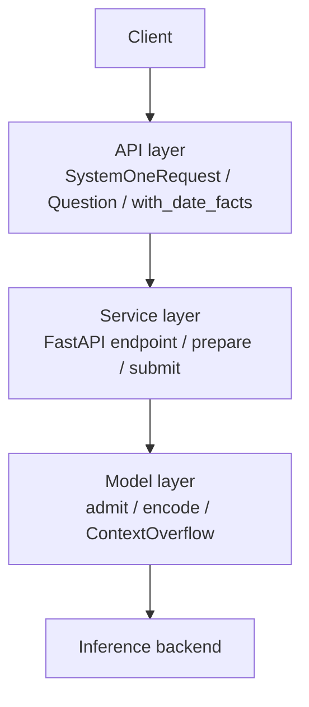
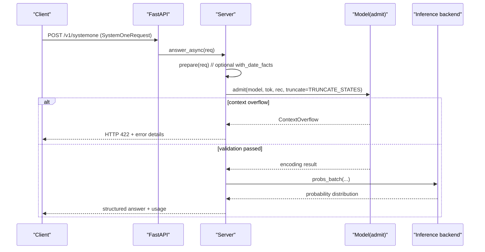
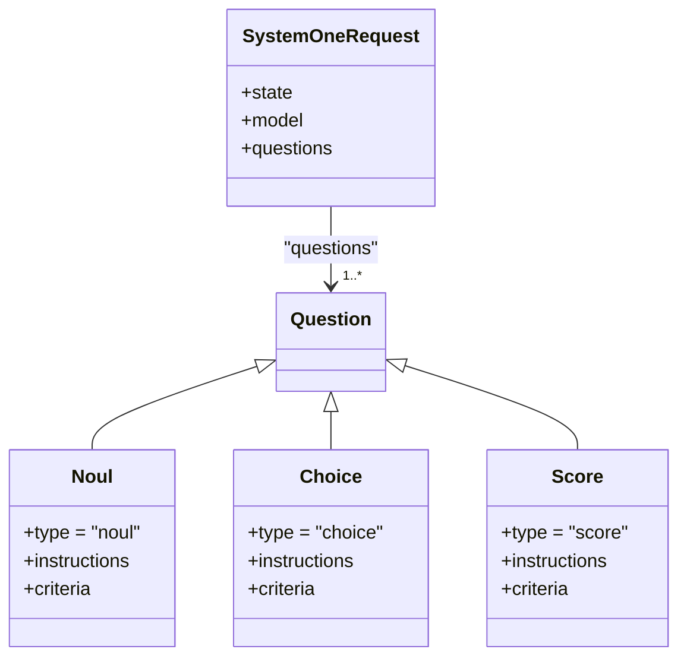
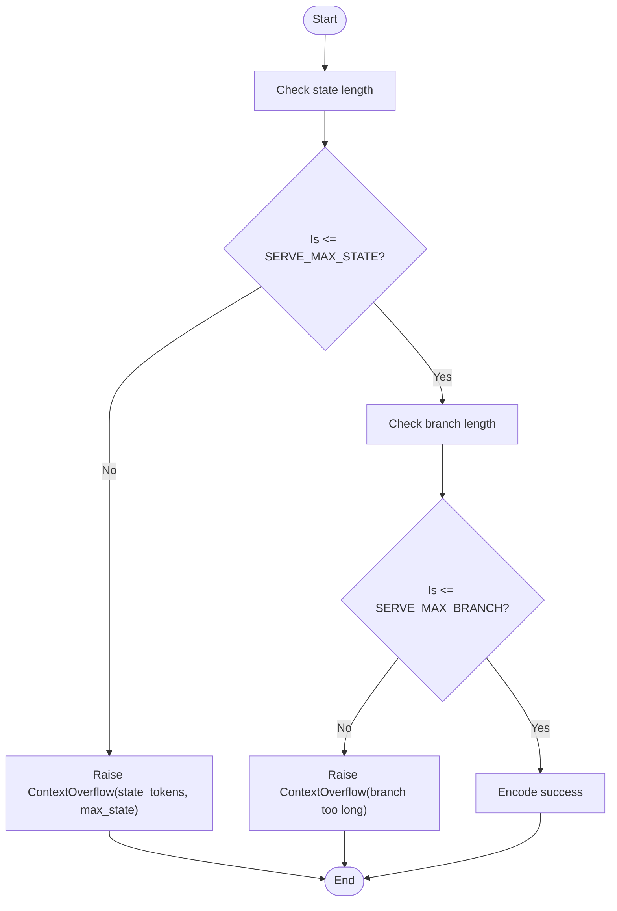
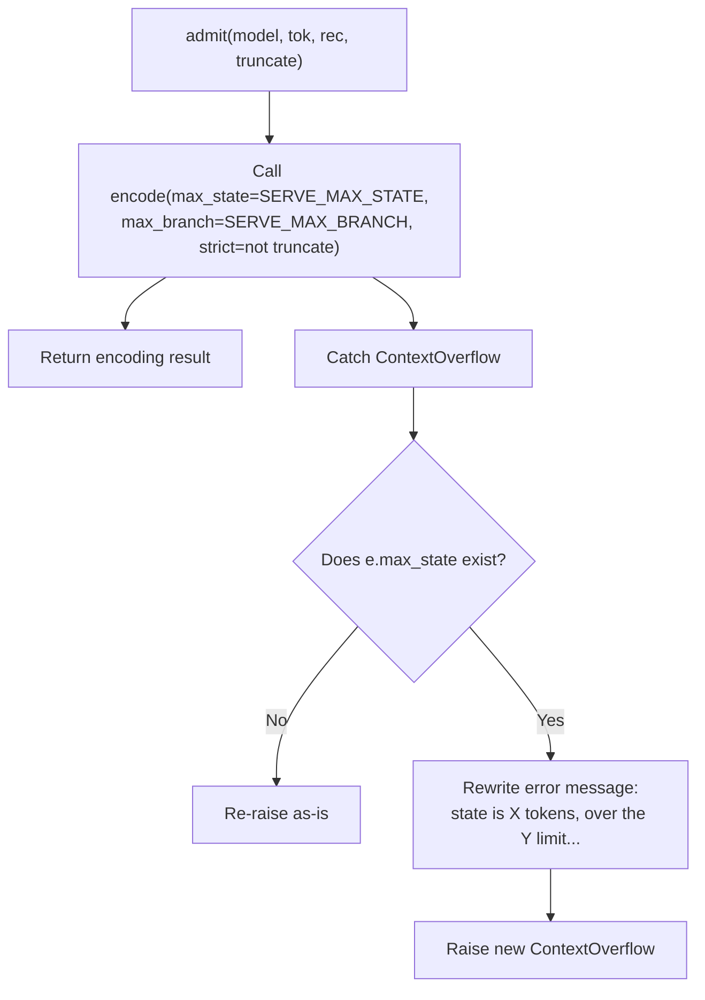
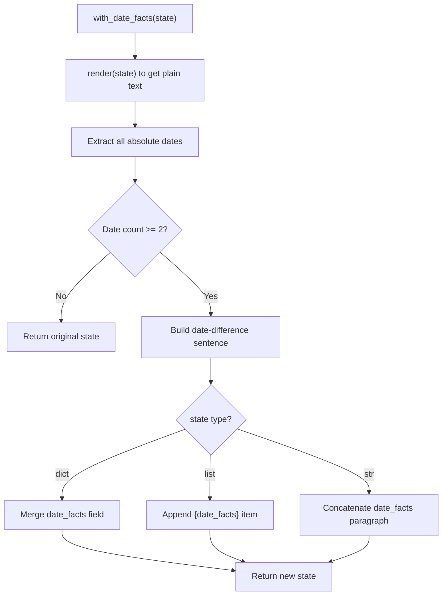
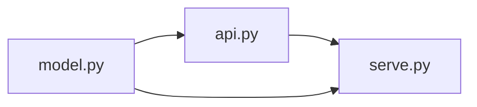

## Table of Contents
1. [Introduction](#introduction)
2. [Project Structure](#project-structure)
3. [Core Components](#core-components)
4. [Architecture Overview](#architecture-overview)
5. [Detailed Component Analysis](#detailed-component-analysis)
6. [Dependency Analysis](#dependency-analysis)
7. [Performance and Limitations](#performance-and-limitations)
8. [Troubleshooting Guide](#troubleshooting-guide)
9. [Conclusion](#conclusion)

## Introduction
This document targets Kev's request validation mechanism, focusing on the following goals:
- Field validation rules of the SystemOneRequest data model, especially the structure of the questions dict, the question.type type check, and the constraints on the criteria field.
- Input length checking mechanism: the SERVE_MAX_STATE context-length limit and the SERVE_MAX_BRANCH branch-count limit.
- ContextOverflow exception handling and the validation logic of admit().
- How the with_date_facts() preprocessing function works and the DATE_FACTS environment variable configuration.
- Examples of common validation errors and their solutions (invalid question type, over-long context, missing required fields, etc.).

## Project Structure
This topic involves three key modules:
- API layer: defines the TypeSafe-compatible request model and question structures, and provides date-fact preprocessing.
- Model layer: defines encoding, context limits, exception types, and "admission" validation.
- Service layer: FastAPI interface, request preprocessing, error mapping, and response wrapping.

**Diagram sources**
- [api.py:43-46](file://kev/api.py#L43-L46)
- [serve.py:249-252](file://kev/serve.py#L249-L252)
- [model.py:130-142](file://kev/model.py#L130-L142)

**Section sources**
- [api.py:17-46](file://kev/api.py#L17-L46)
- [serve.py:249-252](file://kev/serve.py#L249-L252)
- [model.py:130-142](file://kev/model.py#L130-L142)

## Core Components
- SystemOneRequest: contains three fields state, model, questions; questions must be a non-empty dict.
- Question union type: supports three types noul, choice, score, each with different constraints on criteria.
- SERVE_MAX_STATE/SERVE_MAX_BRANCH: the server-side upper bounds on context and branch length.
- ContextOverflow: a context-overflow exception carrying state_tokens and max_state information.
- admit(): the unified server-side "admission" validation entry, wrapping the strict mode and truncation strategy of encode.
- with_date_facts(): optional preprocessing that injects date-difference facts into the state.

**Section sources**
- [api.py:43-46](file://kev/api.py#L43-L46)
- [api.py:17-40](file://kev/api.py#L17-L40)
- [model.py:18-20](file://kev/model.py#L18-L20)
- [model.py:50-58](file://kev/model.py#L50-L58)
- [model.py:130-142](file://kev/model.py#L130-L142)
- [api.py:84-91](file://kev/api.py#L84-L91)

## Architecture Overview
After a request enters FastAPI, type parsing and basic validation are performed first, then optional date-fact preprocessing, then strict context-length validation via admit(), and finally it is handed to the model thread for batching and returns an answer.

**Diagram sources**
- [serve.py:249-252](file://kev/serve.py#L249-L252)
- [serve.py:223-225](file://kev/serve.py#L223-L225)
- [serve.py:132-145](file://kev/serve.py#L132-L145)
- [model.py:130-142](file://kev/model.py#L130-L142)

## Detailed Component Analysis

### SystemOneRequest and Question Validation Rules
- SystemOneRequest
  - state: JSONContent (string, object, array, scalar, or null).
  - model: string, default "kev-latest".
  - questions: dict[str, Question], and must contain at least one key-value pair (min_length=1).
- Question union type
  - Noul
    - type: Literal["noul"]
    - instructions: optional
    - criteria: optional dict, used to provide false/true description text.
  - Choice
    - type: Literal["choice"]
    - instructions: optional
    - criteria: required dict, option count must be between 1..MAX_OPTIONS (255).
  - Score
    - type: Literal["score"]
    - instructions: optional
    - criteria: required list, element count between 1..MAX_OPTIONS (255).

**Diagram sources**
- [api.py:43-46](file://kev/api.py#L43-L46)
- [api.py:17-40](file://kev/api.py#L17-L40)

**Section sources**
- [api.py:43-46](file://kev/api.py#L43-L46)
- [api.py:17-40](file://kev/api.py#L17-L40)

### Input Length Checking: SERVE_MAX_STATE and SERVE_MAX_BRANCH
- SERVE_MAX_STATE: the maximum state length (including the <state> separator) allowed by the server, default 65536 tokens.
- SERVE_MAX_BRANCH: the maximum length of each question's "row" (state + that question's branch), default SERVE_MAX_STATE + 8192.
- Validation location
  - encode(): when strict=True, if state exceeds max_state it raises ContextOverflow; if a question's branch is too long it also raises ContextOverflow.
  - admit(): calls encode(max_state=SERVE_MAX_STATE, max_branch=SERVE_MAX_BRANCH, strict=not truncate). If a state-overflow exception occurs, it rewrites the message to hint how to fix it (shorten the document or split the request).

**Diagram sources**
- [model.py:18-20](file://kev/model.py#L18-L20)
- [model.py:87-127](file://kev/model.py#L87-L127)
- [model.py:130-142](file://kev/model.py#L130-L142)

**Section sources**
- [model.py:18-20](file://kev/model.py#L18-L20)
- [model.py:87-127](file://kev/model.py#L87-L127)
- [model.py:130-142](file://kev/model.py#L130-L142)

### ContextOverflow Exception Handling and admit() Logic
- ContextOverflow
  - Inherits from ValueError, additionally carrying state_tokens and max_state fields, making it easy for the upper layer to distinguish "state too long" from "branch too long".
- admit()
  - Uses SERVE_MAX_STATE and SERVE_MAX_BRANCH as upper bounds.
  - When truncate=False (default), strict=True, any overflow raises an error.
  - When truncate=True (controlled by KEV_TRUNCATE_STATES), an over-long state is truncated to the first SERVE_MAX_STATE tokens, and the encoding result records state_truncated and state_tokens.
  - If a state-overflow exception is caught, it rewrites the error message to clearly tell the user how to fix it (shorten the document or split the request).

**Diagram sources**
- [model.py:50-58](file://kev/model.py#L50-L58)
- [model.py:130-142](file://kev/model.py#L130-L142)

**Section sources**
- [model.py:50-58](file://kev/model.py#L50-L58)
- [model.py:130-142](file://kev/model.py#L130-L142)

### with_date_facts() Preprocessing and DATE_FACTS Configuration
- with_date_facts(state)
  - Extracts absolute dates from the rendered state (such as "Month day, year" or "YYYY-MM-DD").
  - If two or more distinct dates exist, generates a sentence description for each pair (e.g. "X is Z days after Y").
  - For a dict-type state, returns a copy with an added date_facts field; for a list, appends an object with date_facts; for a string, appends a paragraph at the end.
- Environment variable
  - KEV_DATE_FACTS=1: enables date-fact preprocessing on the server side (the DATE_FACTS flag in serve.py).
  - Preprocessing happens in prepare(req) and applies to all requests.

**Diagram sources**
- [api.py:66-91](file://kev/api.py#L66-L91)
- [serve.py:30-32](file://kev/serve.py#L30-L32)
- [serve.py:223-225](file://kev/serve.py#L223-L225)

**Section sources**
- [api.py:66-91](file://kev/api.py#L66-L91)
- [serve.py:30-32](file://kev/serve.py#L30-L32)
- [serve.py:223-225](file://kev/serve.py#L223-L225)

## Dependency Analysis
- The data models defined in api.py are imported and used by serve.py (SystemOneRequest, to_record, to_answers, output_tokens, with_date_facts).
- serve.py performs context validation via model.admit and converts ContextOverflow into HTTP 422.
- model.py exposes constants (SERVE_MAX_STATE, SERVE_MAX_BRANCH), exceptions (ContextOverflow), and core encoding logic (encode, admit).

**Diagram sources**
- [serve.py:21-25](file://kev/serve.py#L21-L25)
- [api.py:102-117](file://kev/api.py#L102-L117)
- [model.py:130-142](file://kev/model.py#L130-L142)

**Section sources**
- [serve.py:21-25](file://kev/serve.py#L21-L25)
- [api.py:102-117](file://kev/api.py#L102-L117)
- [model.py:130-142](file://kev/model.py#L130-L142)

## Performance and Limitations
- Context length
  - SERVE_MAX_STATE=65536: the upper bound on a single request's state tokens (including <state>).
  - SERVE_MAX_BRANCH=SERVE_MAX_STATE+8192: the upper bound on each question's "row".
- Truncation strategy
  - By default, over-long states are rejected (HTTP 422).
  - Setting KEV_TRUNCATE_STATES=1 reads the first SERVE_MAX_STATE tokens and marks truncated and usage.state_tokens/state_tokens_used in the response.
- Date-fact preprocessing
  - KEV_DATE_FACTS=1 adds a small amount of text, which may affect token counting and context usage.

**Section sources**
- [model.py:18-20](file://kev/model.py#L18-L20)
- [serve.py:30-32](file://kev/serve.py#L30-L32)
- [serve.py:211-220](file://kev/serve.py#L211-L220)

## Troubleshooting Guide

### Common Errors and Causes
- Invalid question type
  - Symptom: Pydantic validation failure.
  - Cause: question.type is not one of "noul"/"choice"/"score".
  - Fix: ensure question.type is one of the three.
- Missing or illegal criteria
  - Choice: criteria must be a non-empty dict with option count between 1..255.
  - Score: criteria must be a non-empty list with element count between 1..255.
  - Noul: criteria may be empty, but if provided it must be a dict.
  - Fix: supply criteria according to the type and ensure the option count is valid.
- Over-long context
  - Symptom: HTTP 422, error message contains "state exceeds ..." or "branch too long".
  - Cause: state exceeds SERVE_MAX_STATE or a question's branch exceeds SERVE_MAX_BRANCH.
  - Fix:
    - Shorten the document or split the long document into multiple requests.
    - If truncation is needed, set KEV_TRUNCATE_STATES=1 when starting the service, and watch the truncated and usage.state_tokens/state_tokens_used fields in the response.
- Missing required field
  - Symptom: Pydantic validation failure (e.g. questions is empty).
  - Cause: SystemOneRequest.questions requires at least one key-value pair.
  - Fix: ensure questions is non-empty and each question's type and criteria conform to the specification.

### Localization Steps
1. Confirm whether question.type is "noul"/"choice"/"score".
2. Check whether criteria conforms to the constraints of the corresponding type (Choice dict 1..255; Score list 1..255; Noul optional dict).
3. If a 422 occurs containing "state exceeds" or "branch too long":
   - Prefer shortening state or splitting the request.
   - If truncation is needed, enable KEV_TRUNCATE_STATES=1 and check the truncated flag in the response.
4. If KEV_DATE_FACTS=1 is enabled, note that date facts add a small amount of text that may affect token counting.

**Section sources**
- [api.py:17-40](file://kev/api.py#L17-L40)
- [api.py:43-46](file://kev/api.py#L43-L46)
- [model.py:18-20](file://kev/model.py#L18-L20)
- [model.py:87-127](file://kev/model.py#L87-L127)
- [serve.py:132-145](file://kev/serve.py#L132-L145)
- [serve.py:211-220](file://kev/serve.py#L211-L220)

## Conclusion
Kev's request validation is built around three layers: type and structure validation at the API layer, context-length and branch limits at the model layer, and error mapping and optional preprocessing at the service layer. Understanding the constraints of SystemOneRequest and Question, the limits of SERVE_MAX_STATE/SERVE_MAX_BRANCH, the handling of ContextOverflow, and the behavior of with_date_facts() helps construct and debug requests stably in production. When an overflow occurs, prefer shortening or splitting the context; if necessary, enable the truncation strategy and watch the truncation flag in the response.
