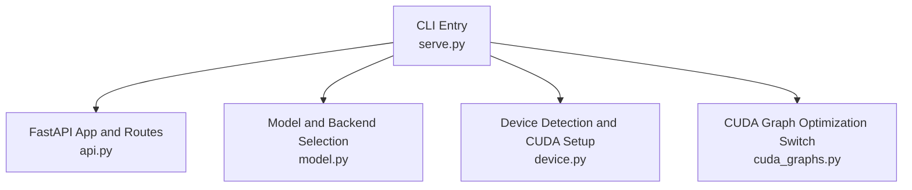
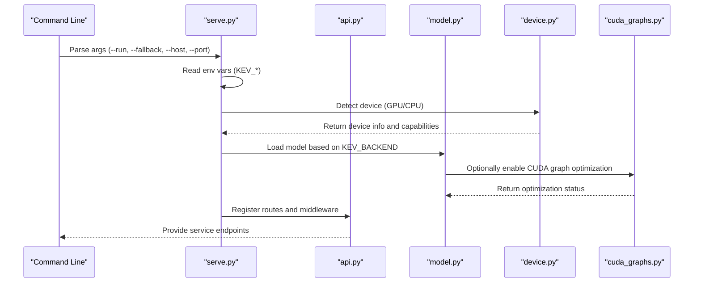
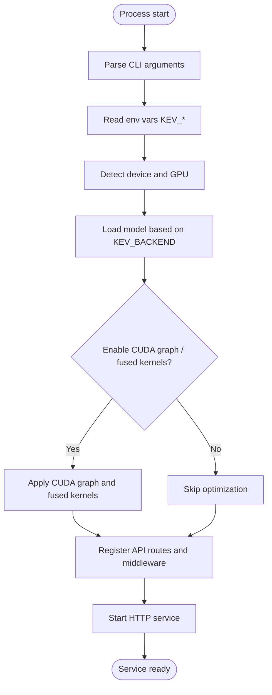
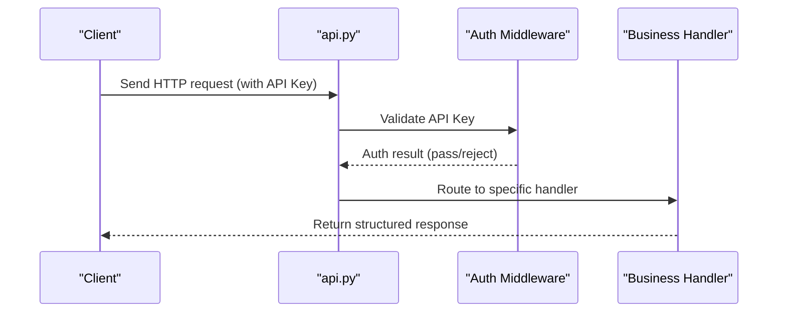
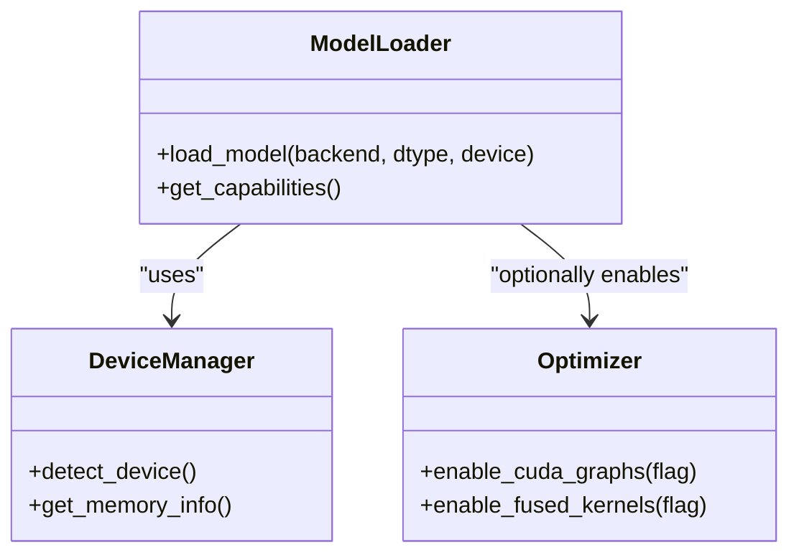
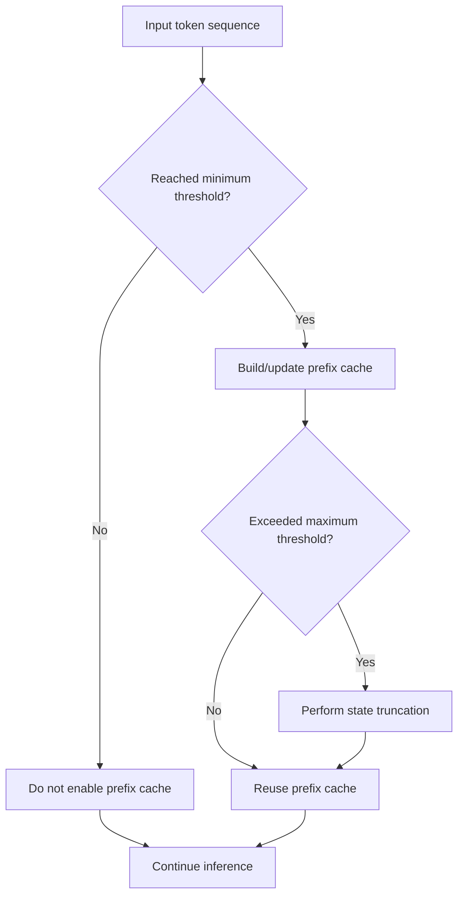
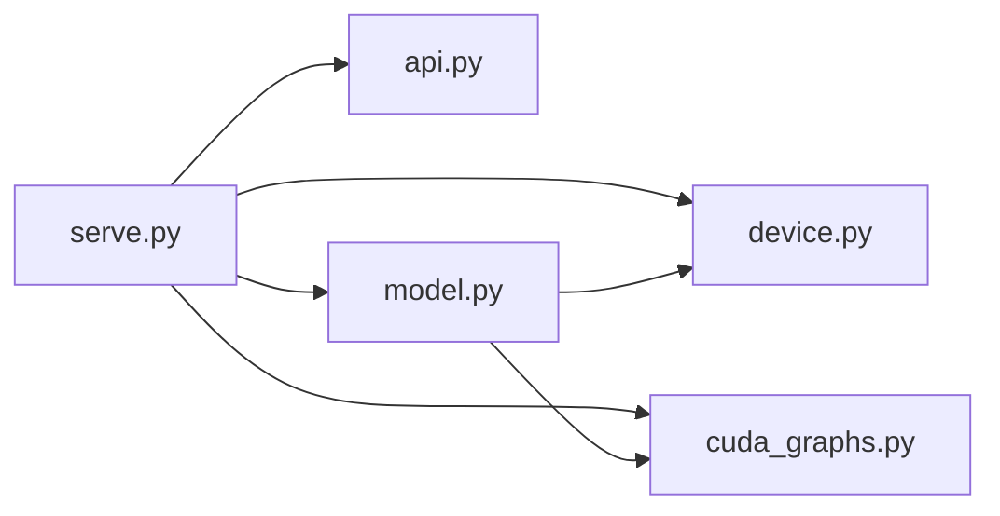

## Table of Contents
1. [Introduction](#introduction)
2. [Project Structure](#project-structure)
3. [Core Components](#core-components)
4. [Architecture Overview](#architecture-overview)
5. [Detailed Component Analysis](#detailed-component-analysis)
6. [Dependency Analysis](#dependency-analysis)
7. [Performance Considerations](#performance-considerations)
8. [Troubleshooting Guide](#troubleshooting-guide)
9. [Conclusion](#conclusion)

## Introduction
This document is aimed at the deployment and operations personnel of the Kev inference service. It systematically explains the FastAPI service's startup parameters, environment variable configuration, and service startup flow (model loading, device detection, default configuration), and provides best practices and common troubleshooting suggestions for local development, production, and cloud deployment. The document is strictly analyzed and summarized based on the repository source code to ensure accurate and traceable content.

## Project Structure
The entry point of the Kev inference service is in kev/serve.py, the FastAPI app and routes are defined in kev/api.py, the model abstraction and backend selection logic are in kev/model.py, and device detection and CUDA-related settings are in kev/device.py and kev/cuda_graphs.py.

**Diagram sources**
- [serve.py:1-200](file://kev/serve.py#L1-L200)
- [api.py:1-200](file://kev/api.py#L1-L200)
- [model.py:1-200](file://kev/model.py#L1-L200)
- [device.py:1-200](file://kev/device.py#L1-L200)
- [cuda_graphs.py:1-200](file://kev/cuda_graphs.py#L1-L200)

**Section sources**
- [serve.py:1-200](file://kev/serve.py#L1-L200)
- [api.py:1-200](file://kev/api.py#L1-L200)
- [model.py:1-200](file://kev/model.py#L1-L200)
- [device.py:1-200](file://kev/device.py#L1-L200)
- [cuda_graphs.py:1-200](file://kev/cuda_graphs.py#L1-L200)

## Core Components
- CLI argument parsing: provides options such as --run, --fallback, --host, --port, used to specify the run mode, fallback strategy, listening address, and port.
- Environment variable configuration: includes KEV_API_KEY (API key authentication), KEV_BACKEND (backend selection), KEV_DTYPE (data type), KEV_CUDA_GRAPHS (CUDA graph optimization), KEV_FUSED (fused kernels), KEV_PREFIX_CACHE (prefix cache size), KEV_PREFIX_MIN_TOKENS, KEV_PREFIX_MAX_TOKENS (cache token limits), KEV_TRUNCATE_STATES (state truncation), etc.
- Service startup flow: initialize the FastAPI app, parse arguments and environment variables, detect devices and GPU, load the model, register routes and middleware, and start the server.
- Key module responsibilities:
  - serve.py: CLI arguments and service lifecycle management.
  - api.py: FastAPI routes, request processing, and response formatting.
  - model.py: model instantiation, backend selection, and inference interface encapsulation.
  - device.py: device detection, GPU/CPU selection, and memory information.
  - cuda_graphs.py: CUDA Graph enablement and warm-up logic.

**Section sources**
- [serve.py:1-200](file://kev/serve.py#L1-L200)
- [api.py:1-200](file://kev/api.py#L1-L200)
- [model.py:1-200](file://kev/model.py#L1-L200)
- [device.py:1-200](file://kev/device.py#L1-L200)
- [cuda_graphs.py:1-200](file://kev/cuda_graphs.py#L1-L200)

## Architecture Overview
The diagram below shows the overall call chain from the command line to the inference response, covering argument parsing, environment configuration, device detection, model loading, and API routing.

**Diagram sources**
- [serve.py:1-200](file://kev/serve.py#L1-L200)
- [api.py:1-200](file://kev/api.py#L1-L200)
- [model.py:1-200](file://kev/model.py#L1-L200)
- [device.py:1-200](file://kev/device.py#L1-L200)
- [cuda_graphs.py:1-200](file://kev/cuda_graphs.py#L1-L200)

## Detailed Component Analysis

### CLI Arguments and Startup Flow
- --run: specifies the run mode or task type, affecting service behavior and available endpoints.
- --fallback: the fallback strategy when the main path fails, e.g., switching to a backup backend or a degraded inference mode.
- --host: the host address the FastAPI service listens on, commonly 0.0.0.0 or 127.0.0.1.
- --port: the port the FastAPI service listens on, e.g., 8000, 8080, etc.

Startup flow key points:
1. Parse CLI arguments.
2. Read the KEV_* environment variables for configuration overrides.
3. Detect device and GPU availability.
4. Select and load the model based on KEV_BACKEND.
5. Optionally enable CUDA graph optimization and fused kernels.
6. Register API routes and middleware (including authentication).
7. Start the HTTP server.

**Diagram sources**
- [serve.py:1-200](file://kev/serve.py#L1-L200)
- [model.py:1-200](file://kev/model.py#L1-L200)
- [device.py:1-200](file://kev/device.py#L1-L200)
- [cuda_graphs.py:1-200](file://kev/cuda_graphs.py#L1-L200)

**Section sources**
- [serve.py:1-200](file://kev/serve.py#L1-L200)

### Environment Variable Configuration Details
- KEV_API_KEY: API key, used for request authentication; when not set, authentication may be disabled or an error is raised.
- KEV_BACKEND: backend selection, determines the model implementation and inference engine.
- KEV_DTYPE: data type, controls the precision of model weights and computation (e.g., float16, float32).
- KEV_CUDA_GRAPHS: boolean switch, enables CUDA graph optimization to improve throughput.
- KEV_FUSED: boolean switch, enables fused kernels to reduce operator overhead.
- KEV_PREFIX_CACHE: prefix cache size, typically in tokens or VRAM capacity.
- KEV_PREFIX_MIN_TOKENS: minimum token threshold that triggers the prefix cache.
- KEV_PREFIX_MAX_TOKENS: maximum token upper bound for the prefix cache.
- KEV_TRUNCATE_STATES: state truncation strategy, controlling state length limits under long-context scenarios.

Configuration priority recommendations:
- CLI arguments take precedence over environment variables.
- Environment variables take precedence over code defaults.
- For sensitive items (such as KEV_API_KEY), it is recommended to inject them via an external secrets management service.

**Section sources**
- [serve.py:1-200](file://kev/serve.py#L1-L200)
- [model.py:1-200](file://kev/model.py#L1-L200)
- [device.py:1-200](file://kev/device.py#L1-L200)
- [cuda_graphs.py:1-200](file://kev/cuda_graphs.py#L1-L200)

### API Routes and Authentication
- Authentication mechanism: validates the Authorization header or custom header field in the request via KEV_API_KEY.
- Route organization: divided by functional domain (e.g., inference, health check, metrics), with a unified error response format.
- Middleware: includes logging, rate limiting, CORS, request body size limits, etc.

**Diagram sources**
- [api.py:1-200](file://kev/api.py#L1-L200)

**Section sources**
- [api.py:1-200](file://kev/api.py#L1-L200)

### Model Loading and Backend Selection
- Backend selection: dynamically load the corresponding model implementation based on KEV_BACKEND.
- Data type: KEV_DTYPE controls the precision of weights and computation.
- Device binding: place the model on the appropriate device (CPU/GPU) based on the detection result of device.py.
- Optimization switches: combine KEV_CUDA_GRAPHS and KEV_FUSED to decide whether to enable low-level optimizations.

**Diagram sources**
- [model.py:1-200](file://kev/model.py#L1-L200)
- [device.py:1-200](file://kev/device.py#L1-L200)
- [cuda_graphs.py:1-200](file://kev/cuda_graphs.py#L1-L200)

**Section sources**
- [model.py:1-200](file://kev/model.py#L1-L200)
- [device.py:1-200](file://kev/device.py#L1-L200)
- [cuda_graphs.py:1-200](file://kev/cuda_graphs.py#L1-L200)

### Prefix Cache and State Truncation
- Prefix cache: controls cache hits and capacity via KEV_PREFIX_CACHE, KEV_PREFIX_MIN_TOKENS, KEV_PREFIX_MAX_TOKENS.
- State truncation: KEV_TRUNCATE_STATES is used to trim historical states in long-context scenarios to avoid VRAM overflow.

**Diagram sources**
- [serve.py:1-200](file://kev/serve.py#L1-L200)
- [model.py:1-200](file://kev/model.py#L1-L200)

**Section sources**
- [serve.py:1-200](file://kev/serve.py#L1-L200)
- [model.py:1-200](file://kev/model.py#L1-L200)

## Dependency Analysis
- serve.py depends on api.py, model.py, device.py, cuda_graphs.py.
- api.py depends on the auth middleware and business handlers.
- model.py depends on device.py and cuda_graphs.py to complete device binding and optimization.
- External dependencies: FastAPI, Uvicorn, PyTorch/TensorFlow (depending on backend), HuggingFace Transformers (if used).

**Diagram sources**
- [serve.py:1-200](file://kev/serve.py#L1-L200)
- [api.py:1-200](file://kev/api.py#L1-L200)
- [model.py:1-200](file://kev/model.py#L1-L200)
- [device.py:1-200](file://kev/device.py#L1-L200)
- [cuda_graphs.py:1-200](file://kev/cuda_graphs.py#L1-L200)

**Section sources**
- [serve.py:1-200](file://kev/serve.py#L1-L200)
- [api.py:1-200](file://kev/api.py#L1-L200)
- [model.py:1-200](file://kev/model.py#L1-L200)
- [device.py:1-200](file://kev/device.py#L1-L200)
- [cuda_graphs.py:1-200](file://kev/cuda_graphs.py#L1-L200)

## Performance Considerations
- Data type: prefer lower precision (e.g., float16) where precision permits, to reduce VRAM usage and improve throughput.
- CUDA graph optimization: enabling KEV_CUDA_GRAPHS in high-concurrency scenarios with stable batch sizes reduces scheduling overhead.
- Fused kernels: enabling KEV_FUSED on supported backends reduces inter-operator communication cost.
- Prefix cache: reasonably set KEV_PREFIX_MIN_TOKENS and KEV_PREFIX_MAX_TOKENS to improve hit rate and control VRAM.
- State truncation: enable KEV_TRUNCATE_STATES in long-context scenarios to avoid OOM.

[This section is general guidance and requires no specific file references]

## Troubleshooting Guide
- Service cannot start:
  - Check whether --host and --port are consistent with the system firewall or container port mapping.
  - Confirm that the backend library pointed to by KEV_BACKEND is correctly installed.
- Authentication failure:
  - Verify whether KEV_API_KEY is correctly injected and whether the key name in the request header matches.
- Out of memory:
  - Lower the KEV_DTYPE precision or disable KEV_CUDA_GRAPHS/KEV_FUSED.
  - Adjust KEV_PREFIX_CACHE, KEV_PREFIX_MIN_TOKENS, KEV_PREFIX_MAX_TOKENS, and KEV_TRUNCATE_STATES.
- Device detection anomaly:
  - Check the CUDA driver and runtime versions, and confirm GPU visibility.
  - Disable GPU-related optimizations in a CPU-only environment.

**Section sources**
- [serve.py:1-200](file://kev/serve.py#L1-L200)
- [api.py:1-200](file://kev/api.py#L1-L200)
- [model.py:1-200](file://kev/model.py#L1-L200)
- [device.py:1-200](file://kev/device.py#L1-L200)
- [cuda_graphs.py:1-200](file://kev/cuda_graphs.py#L1-L200)

## Conclusion
Through the source-code analysis of the Kev inference service, we have clarified the roles and priorities of CLI arguments and environment variables, sorted out the key steps and module responsibilities of the service startup, and provided configuration recommendations and troubleshooting methods for different deployment scenarios. It is recommended to first validate the pipeline with minimal configuration during local development, and perform fine-grained tuning in production and cloud deployments based on hardware characteristics and security requirements.
