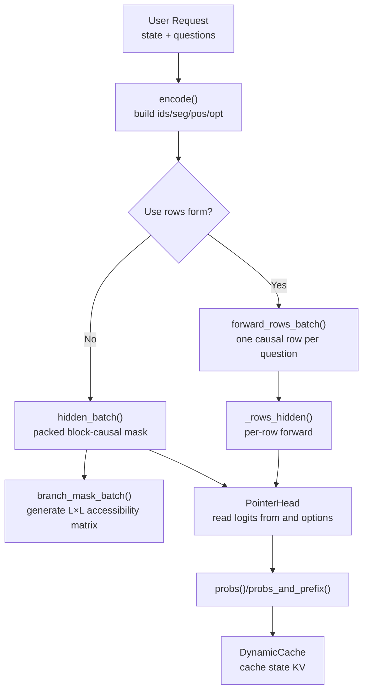
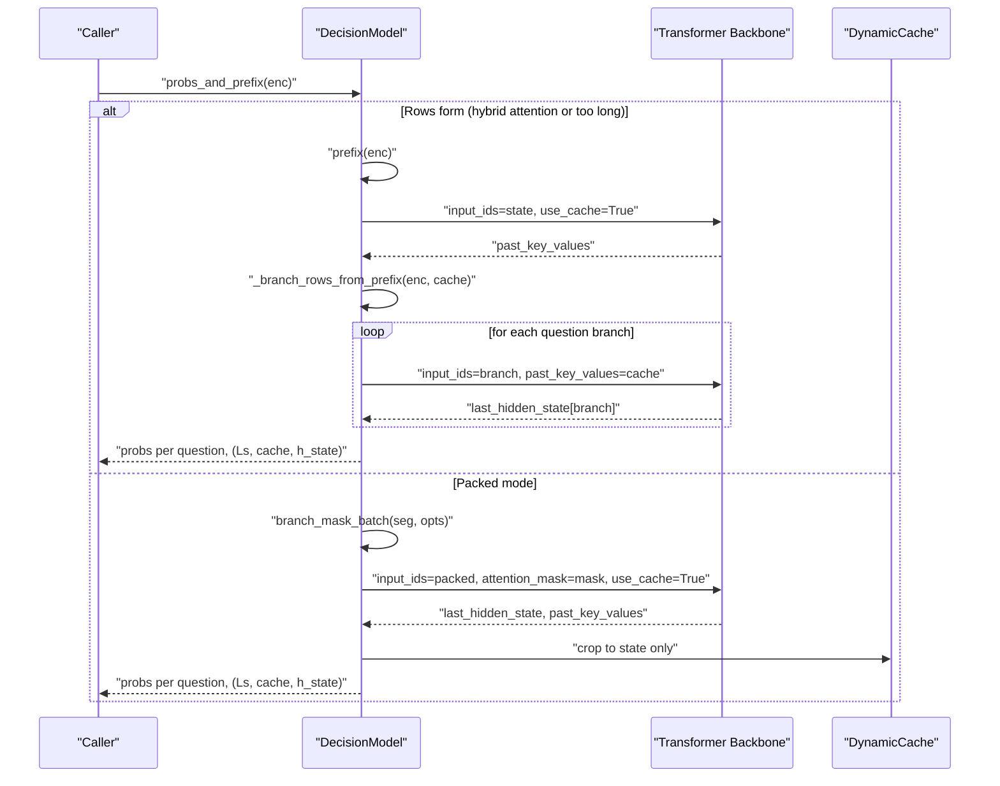
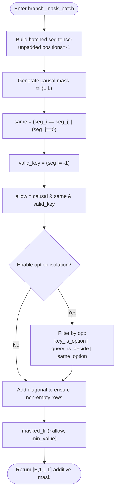
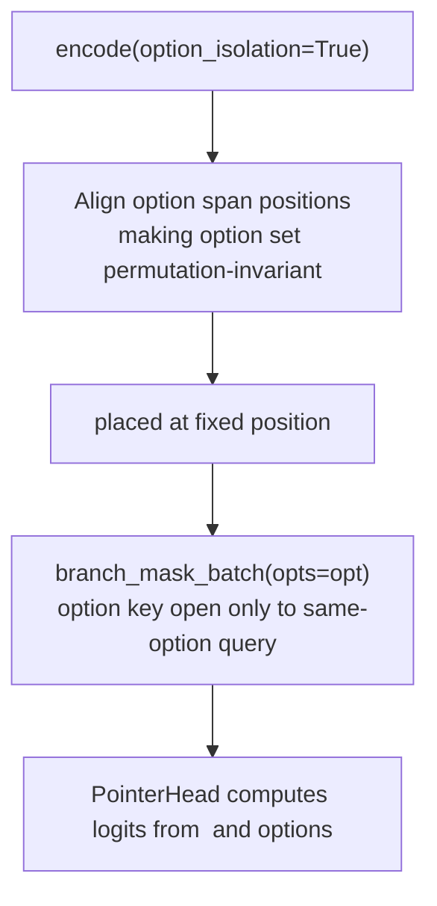
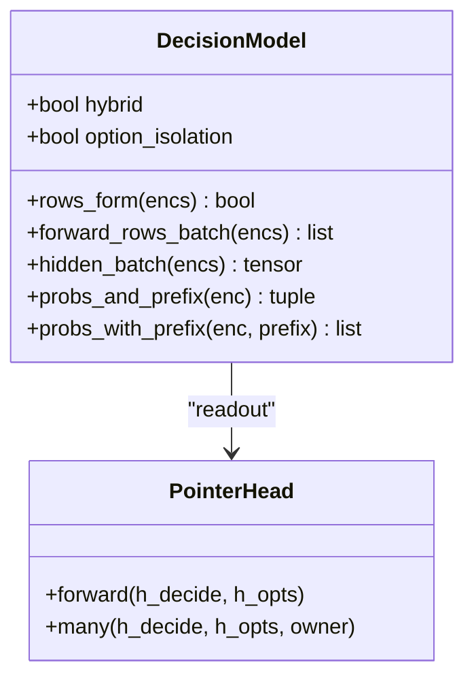
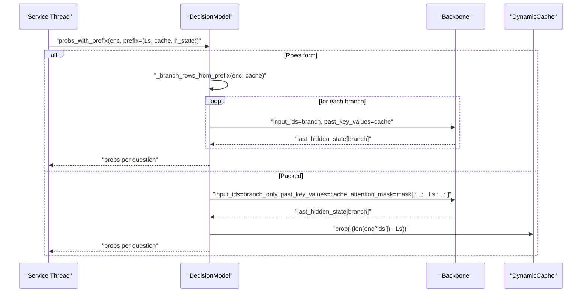
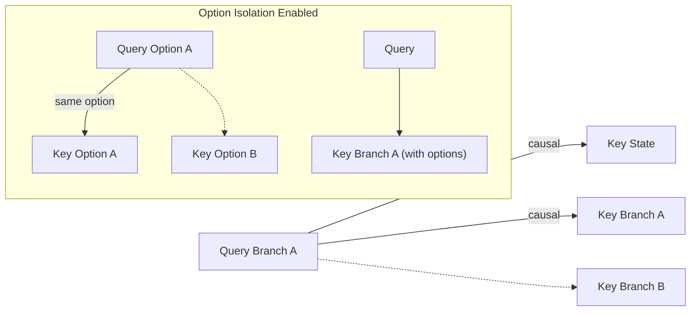
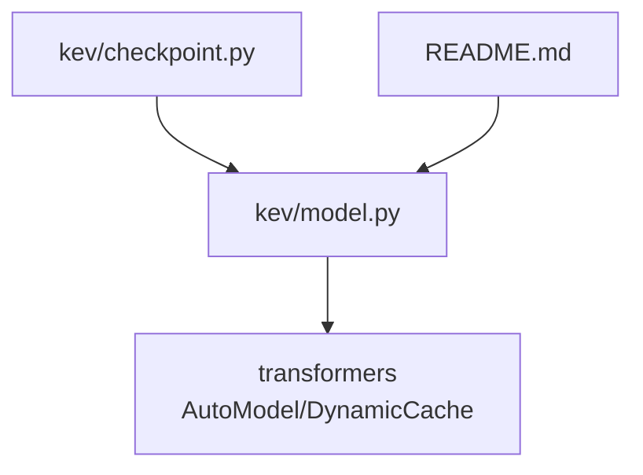

## Table of Contents
1. [Introduction](#introduction)
2. [Project Structure](#project-structure)
3. [Core Components](#core-components)
4. [Architecture Overview](#architecture-overview)
5. [Detailed Component Analysis](#detailed-component-analysis)
6. [Dependency Analysis](#dependency-analysis)
7. [Performance and Optimization](#performance-and-optimization)
8. [Troubleshooting Guide](#troubleshooting-guide)
9. [Conclusion](#conclusion)

## Introduction
This document focuses on the implementation of the attention mechanism in the Kev decision model, explaining the following topics:
- How the block-causal mask ensures that "state tokens" are only accessed by question branches, and that different question branches are mutually isolated.
- In option-isolation mode (option_isolation=True), each option span can only see the state, the instructions, and its own option.
- Why hybrid attention models (Gated DeltaNet) cannot use the block-causal mask, and how the equivalent function is achieved through the "rows form".
- How the prefix cache mechanism caches the KV pairs of state tokens via DynamicCache to reduce repeated computation.
- An attention visibility diagram to help beginners understand, while providing implementation details and optimization suggestions for experts.

## Project Structure
Kev's core attention logic is concentrated in the model definition and inference flow, with the key files as follows:
- kev/model.py: defines the core implementation of encoding, masking, model classes, prefix cache, etc.
- README.md: explains the behavioral differences between hybrid attention models and the rows form.
- kev/checkpoint.py: passes configurations such as option_isolation when loading the checkpoint.

Diagram sources
- [model.py:87-127](file://kev/model.py#L87-L127)
- [model.py:154-185](file://kev/model.py#L154-L185)
- [model.py:329-383](file://kev/model.py#L329-L383)
- [model.py:416-462](file://kev/model.py#L416-L462)

Section sources
- [model.py:1-509](file://kev/model.py#L1-L509)

## Core Components
- Encoder encode: packs the state and multiple question branches into a unified sequence, recording meta-information such as segment, position, and option index.
- Block-causal mask branch_mask / branch_mask_batch: generates the attention mask in packed mode, ensuring cross-branch and cross-option invisibility (unless allowed).
- Rows form rows_form / forward_rows_batch: when the model is hybrid attention or the sequence is too long, runs each question as an independent causal row.
- Prefix cache prefix / probs_and_prefix / probs_with_prefix: uses DynamicCache to cache the KV of state tokens, avoiding repeated computation.
- PointerHead: computes selection probabilities from the representations of the <decide> token and the option tokens.

Section sources
- [model.py:87-127](file://kev/model.py#L87-L127)
- [model.py:154-185](file://kev/model.py#L154-L185)
- [model.py:329-383](file://kev/model.py#L329-L383)
- [model.py:416-462](file://kev/model.py#L416-L462)
- [model.py:205-224](file://kev/model.py#L205-L224)

## Architecture Overview
The diagram below shows Kev's end-to-end attention processing flow, including both the packed and rows paths, as well as the use of the prefix cache.

Diagram sources
- [model.py:416-462](file://kev/model.py#L416-L462)
- [model.py:329-383](file://kev/model.py#L329-L383)
- [model.py:154-185](file://kev/model.py#L154-L185)

## Detailed Component Analysis

### Block-Causal Mask: branch_mask and branch_mask_batch
- Goal: in packed input, let each query attend only to the keys it is "allowed to access".
- Rules:
  - Causal constraint: j ≤ i.
  - Same-segment constraint: seg[j] == seg[i], or j belongs to the state segment (seg[j]==0), so the state can be accessed by all branches, but branches are mutually invisible.
  - Padding safety: right-padding positions do not participate in attention; the diagonal is forcibly retained to prevent an entire row from being masked.
  - Option isolation (optional): when opts is present, the keys of an option span are open only to queries of the same option; <decide> can access all tokens of its branch.

Diagram sources
- [model.py:154-185](file://kev/model.py#L154-L185)

Section sources
- [model.py:154-185](file://kev/model.py#L154-L185)

### Option Isolation Mode: option_isolation=True
- Encoding stage:
  - Each option span shares the same relative position, making the option representation invariant to order permutation.
  - <decide> is fixed at a fixed position after the longest option.
- Masking stage:
  - The keys of an option token are open only to queries of the same option.
  - <decide> can access all tokens of its branch (state, instructions, all options).
  - Instruction tokens do not see the option span (causal constraint).

Diagram sources
- [model.py:87-127](file://kev/model.py#L87-L127)
- [model.py:159-185](file://kev/model.py#L159-L185)

Section sources
- [model.py:87-127](file://kev/model.py#L87-L127)
- [model.py:159-185](file://kev/model.py#L159-L185)

### Hybrid Attention Model (Gated DeltaNet) and the Rows Form
- Why block-causal mask cannot be used:
  - Hybrid attention includes Gated DeltaNet layers, which are recurrent and do not respect the attention mask.
  - Therefore the block-causal constraint cannot be correctly enforced in packed mode.
- Rows form solution:
  - Treat each question as an independent causal row: state + branch.
  - Rows are completely independent, naturally satisfying isolation; the state is computed only once and the KV cache is reused.
  - When the packed sequence exceeds ROW_PASS_TOKENS, it also switches to the rows form to avoid an overly large L×L mask.

Diagram sources
- [model.py:243-278](file://kev/model.py#L243-L278)
- [model.py:205-224](file://kev/model.py#L205-L224)
- [model.py:329-383](file://kev/model.py#L329-L383)

Section sources
- [model.py:69-73](file://kev/model.py#L69-L73)
- [model.py:243-278](file://kev/model.py#L243-L278)
- [model.py:329-383](file://kev/model.py#L329-L383)
- [README.md:271](file://README.md#L271)

### Prefix Cache Mechanism: DynamicCache
- Purpose: avoid repeatedly computing the hidden states and KV of state tokens.
- Key methods:
  - prefix: runs only the state tokens and returns (n_state_tokens, past_key_values, last_hidden_state).
  - probs_and_prefix: completes the full inference in one go and returns a reusable state prefix.
  - probs_with_prefix: runs only the branch based on an existing prefix, and crops the cache back to the state length after completion.
- Behavioral differences:
  - Rows form (hybrid attention or too long): the miss path first computes the state prefix, then runs the branches per row.
  - Packed mode: runs packed directly, then crops past_key_values to the state length.

Diagram sources
- [model.py:416-462](file://kev/model.py#L416-L462)

Section sources
- [model.py:416-462](file://kev/model.py#L416-L462)

### Attention Visibility Visualization
- Visibility matrix illustration in packed mode (simplified):
  - Rows: query positions; columns: key positions.
  - The state segment (seg=0) is open to all branches.
  - Causal visibility within the same branch (j ≤ i).
  - Different branches are mutually invisible.
  - When option isolation is enabled, an option key is open only to the same-option query; <decide> is fully open to its branch.

Diagram sources
- [model.py:154-185](file://kev/model.py#L154-L185)
- [model.py:87-127](file://kev/model.py#L87-L127)

## Dependency Analysis
- model.py depends on transformers' AutoModel/AutoModelForCausalLM and DynamicCache.
- checkpoint.py passes through metadata such as option_isolation when loading the checkpoint.
- README.md explicitly explains the behavior of hybrid attention models and the equivalence of the rows form.

Diagram sources
- [model.py:1-10](file://kev/model.py#L1-L10)
- [checkpoint.py:56-64](file://kev/checkpoint.py#L56-L64)
- [checkpoint.py:244-309](file://kev/checkpoint.py#L244-L309)
- [README.md:271](file://README.md#L271)

Section sources
- [model.py:1-10](file://kev/model.py#L1-L10)
- [checkpoint.py:56-64](file://kev/checkpoint.py#L56-L64)
- [checkpoint.py:244-309](file://kev/checkpoint.py#L244-L309)
- [README.md:271](file://README.md#L271)

## Performance and Optimization
- Rows-form batching:
  - rows_per_pass controls the number of rows processed per forward pass, avoiding excessive memory peaks.
  - During training, keep the whole batch to maintain the computation graph; during inference, chunk to reduce VRAM usage.
- Shape bucketing (MPS):
  - SHAPE_BUCKET aligns sequence lengths to a multiple to warm up kernels and improve MPS performance.
- Long-row optimization:
  - When the packed sequence exceeds ROW_PASS_TOKENS, automatically switch to the rows form to avoid an overly large L×L mask.
- Prefix cache:
  - Reusing the state KV cache significantly reduces repeated computation cost; in serving scenarios, prefer probs_and_prefix/probs_with_prefix.
- Special handling for hybrid attention:
  - Always use the rows form to avoid an invalid mask; reduce repeated computation by sharing the state prefix.

Section sources
- [model.py:41-48](file://kev/model.py#L41-L48)
- [model.py:301-314](file://kev/model.py#L301-L314)
- [model.py:329-383](file://kev/model.py#L329-L383)
- [model.py:416-462](file://kev/model.py#L416-L462)

## Troubleshooting Guide
- Hybrid attention conflicts with option isolation:
  - If option_isolation=True is enabled but the backbone is hybrid attention (Gated DeltaNet), an error is raised because this mode relies on the packed mask.
- Mixing option isolation within a batch:
  - You cannot mix option_isolated and plain encodings within the same batch.
- Context overflow:
  - When the state or branch exceeds the limit, a ContextOverflow is raised; you need to shorten the input or split the request.
- Prefix mismatch:
  - probs_with_prefix requires the passed prefix to have a state length consistent with the current enc, otherwise it errors.

Section sources
- [model.py:243-278](file://kev/model.py#L243-L278)
- [model.py:316-324](file://kev/model.py#L316-L324)
- [model.py:446-462](file://kev/model.py#L446-L462)
- [model.py:50-58](file://kev/model.py#L50-L58)

## Conclusion
Kev's attention mechanism uses both the block-causal mask and the rows form, balancing precision and efficiency:
- On attention-only backbones, packed mode with the block-causal mask achieves strict branch and option isolation.
- On hybrid attention backbones, the rows form naturally satisfies isolation needs and avoids repeated computation through the prefix cache.
- The option-isolation mode ensures permutation invariance of the option representation and safe visibility through position alignment and masking strategy.
- The prefix cache mechanism significantly improves serving throughput, especially in long-state and multi-question scenarios.
