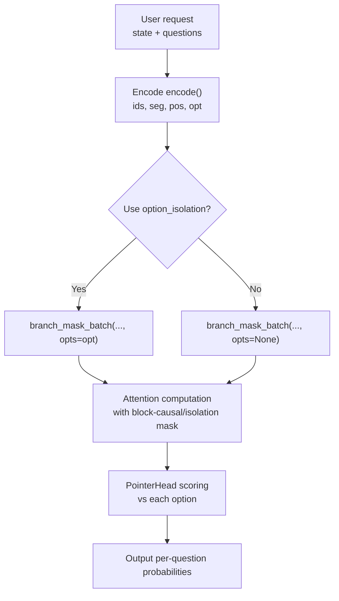
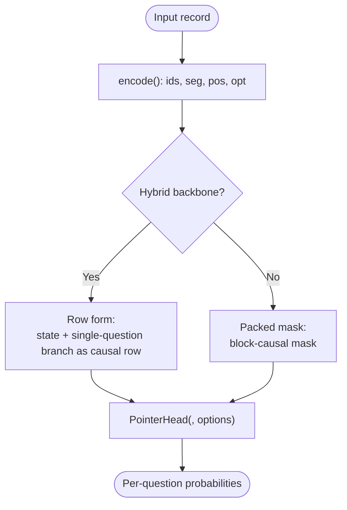
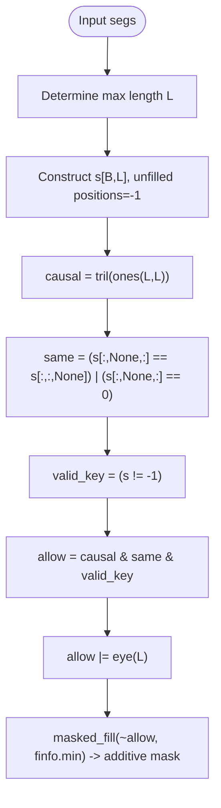
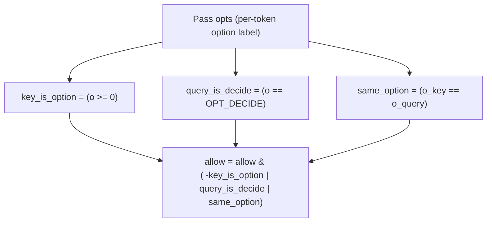
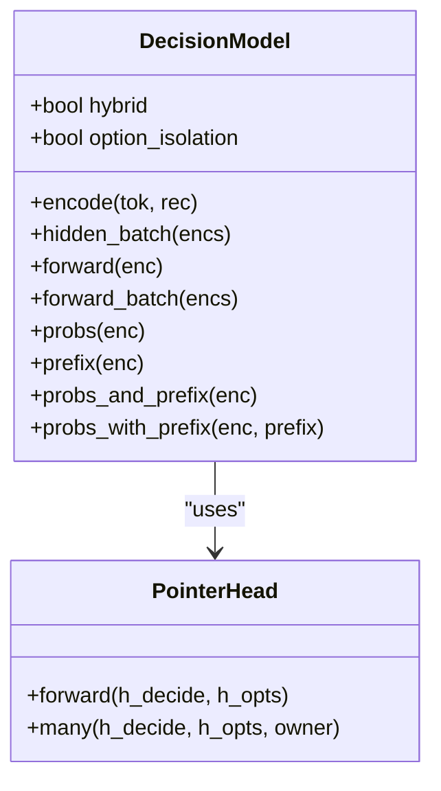
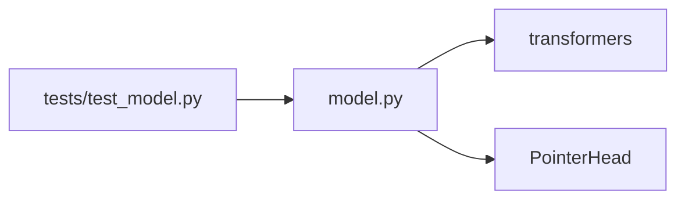
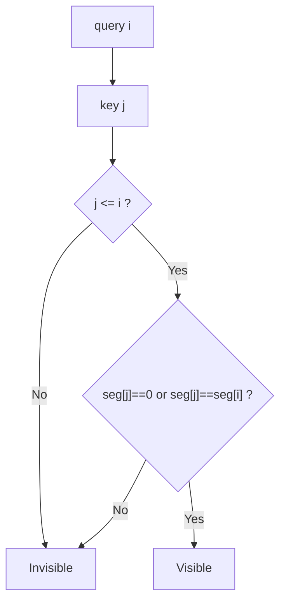
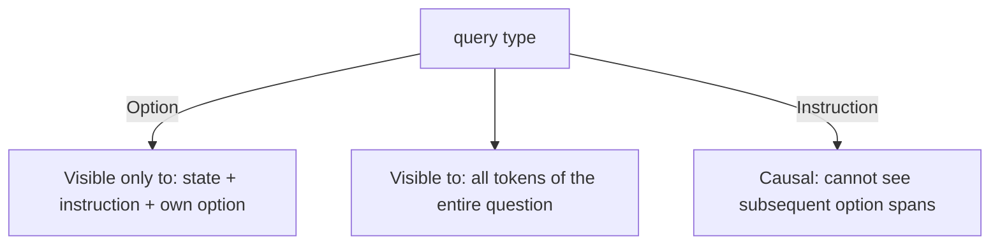
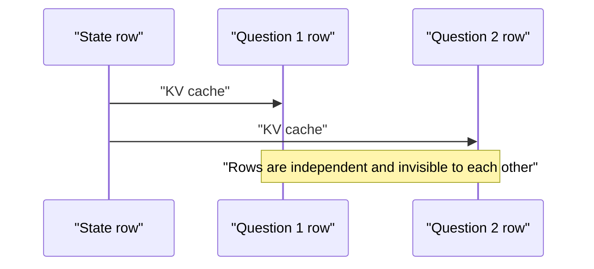

## Table of Contents
1. [Introduction](#introduction)
2. [Project Structure](#project-structure)
3. [Core Components](#core-components)
4. [Architecture Overview](#architecture-overview)
5. [Detailed Component Analysis](#detailed-component-analysis)
6. [Dependency Analysis](#dependency-analysis)
7. [Performance Considerations](#performance-considerations)
8. [Troubleshooting Guide](#troubleshooting-guide)
9. [Conclusion](#conclusion)
10. [Appendix: Attention Matrix Visualization Examples](#appendix-attention-matrix-visualization-examples)

## Introduction
This document focuses on the attention mechanism and mask design in the Kev decision model, emphasizing the following questions:
- How the block-causal mask ensures "each question can only attend to its corresponding options," while allowing all questions to share state information.
- The implementation logic of the mask's mathematical condition attend(i,j) iff j<=i and (seg[j]==0 or seg[j]==seg[i]).
- The additional constraints in option_isolation mode: option tokens can only attend to the state, instruction, and their own option; the `<decide>` token can attend to all tokens of the entire question.
- The difference between hybrid attention architectures (Qwen3.5) and traditional pure-attention architectures, and why hybrid architectures cannot use the block-causal mask.
- Attention basics for beginners, plus scalable mask design and performance optimization suggestions for experts.

## Project Structure
Kev's core inference and training code is concentrated in the kev package, where the attention mask and model forward flow are provided by model.py; README.md gives high-level architecture descriptions; tests/test_model.py contains key tests for mask and row-form equivalence, and cache hits.

Diagram Sources
- [model.py:87-127](file://kev/model.py#L87-L127)
- [model.py:154-185](file://kev/model.py#L154-L185)
- [model.py:205-223](file://kev/model.py#L205-L223)

Section Sources
- [README.md:260-278](file://README.md#L260-L278)
- [model.py:87-127](file://kev/model.py#L87-L127)
- [model.py:154-185](file://kev/model.py#L154-L185)
- [model.py:205-223](file://kev/model.py#L205-L223)

## Core Components
- Encoder encode(): concatenates state and multiple question branches into one sequence, maintaining seg (segment number), pos (position), opt (option label).
- Mask generation branch_mask()/branch_mask_batch(): implements the block-causal mask and the optional option_isolation constraints.
- Pointer head PointerHead: scores using the hidden vectors of `<decide>` and each `</opt>`, yielding option probabilities.
- DecisionModel: wraps the backbone (Qwen), switching between the "packed mask" and "row form" paths, and providing prefix caching.

Section Sources
- [model.py:87-127](file://kev/model.py#L87-L127)
- [model.py:154-185](file://kev/model.py#L154-L185)
- [model.py:205-223](file://kev/model.py#L205-L223)
- [model.py:243-394](file://kev/model.py#L243-L394)

## Architecture Overview
Kev adopts the design of "causal language model backbone + block-causal branch mask + pointer readout." For pure-attention backbones, state and multiple questions are packed into one sequence, and the mask ensures cross-question isolation; for hybrid backbones like Qwen3.5/3.8 (which contain Gated DeltaNet layers), because the recurrent layers do not respect the attention mask, it must degrade to "row form": each question runs as an independent causal row of state+branch, reusing the state via the KV cache.

Diagram Sources
- [model.py:69-73](file://kev/model.py#L69-L73)
- [model.py:259-263](file://kev/model.py#L259-L263)
- [model.py:329-333](file://kev/model.py#L329-L333)
- [model.py:364-394](file://kev/model.py#L364-L394)

Section Sources
- [README.md:260-278](file://README.md#L260-L278)
- [model.py:69-73](file://kev/model.py#L69-L73)
- [model.py:259-263](file://kev/model.py#L259-L263)
- [model.py:329-333](file://kev/model.py#L329-L333)
- [model.py:364-394](file://kev/model.py#L364-L394)

## Detailed Component Analysis

### Encoder and Segment Semantics
encode() organizes the input as:
- one state (seg=0)
- several question branches (seg=k, k>=1), each branch containing an instruction, several option spans, and ending with `<decide>`
- maintains opt: state/instruction is OPT_NONE, within an option span it is the option ordinal, `<decide>` is OPT_DECIDE

When option_isolation=True, each option span within the same question is treated as an independent sub-branch and shares the same position id; `<decide>` is fixed after the longest span, ensuring permutation invariance of the option representation and its attention alignment with `<decide>`.

Section Sources
- [model.py:87-127](file://kev/model.py#L87-L127)

### Block-Causal Mask: branch_mask() and branch_mask_batch()
- Basic rule: attend(i,j) iff j<=i and (seg[j]==0 or seg[j]==seg[i])
  - j<=i: causal constraint, forbidding future information leakage
  - seg[j]==0: allows attending to the state segment
  - seg[j]==seg[i]: allows attending only to the same-question branch
- The batched version supports right-padding, diagonal preservation (avoiding fully-masked rows), and masking of padding keys.

Diagram Sources
- [model.py:154-185](file://kev/model.py#L154-L185)

Section Sources
- [model.py:154-185](file://kev/model.py#L154-L185)

### Additional Constraints of option_isolation
When opts is passed, branch_mask_batch() adds two rules:
- An option key (key) belonging to some option span can be attended by a query only if one of the following holds:
  - the query is `<decide>` (OPT_DECIDE)
  - the query and key belong to the same option (same_option)
- Instruction tokens naturally cannot see subsequent option spans (causal constraint), so instructions never see any option span.

This achieves:
- Option tokens can only attend to: state, the question's instruction, and their own option span
- `<decide>` can attend to all tokens of the entire question (including other options)

Diagram Sources
- [model.py:176-184](file://kev/model.py#L176-L184)

Section Sources
- [model.py:176-184](file://kev/model.py#L176-L184)

### Pointer Head: From `<decide>` to Option Probabilities
PointerHead uses the hidden vector of `<decide>` and the hidden vector of each `</opt>` to score via dot product, then applies softmax to obtain option probabilities. Temperature T=1 is used during training; a calibration temperature can be applied at inference.

Section Sources
- [model.py:205-223](file://kev/model.py#L205-L223)

### Hybrid Architecture and Row Form
- is_hybrid() detects whether there are linear_attention layers (Qwen3.5).
- The DecisionModel.hybrid flag determines:
  - Non-hybrid: prefer the packed mask (packed block-causal)
  - Hybrid: force row form (rows_form), because the recurrent layer does not respect the attention mask
- rows_of() splits the packed encoding into state and per-question branches; forward_rows_batch() runs each question as an independent causal row and reuses the state via the prefix cache.

Diagram Sources
- [model.py:69-73](file://kev/model.py#L69-L73)
- [model.py:243-394](file://kev/model.py#L243-L394)
- [model.py:205-223](file://kev/model.py#L205-L223)

Section Sources
- [model.py:69-73](file://kev/model.py#L69-L73)
- [model.py:243-394](file://kev/model.py#L243-L394)

### Why Hybrid Architectures Cannot Use the Block-Causal Mask
- Hybrid backbones contain recurrent layers such as Gated DeltaNet, which ignore the attention mask, so the packed mask cannot guarantee cross-question isolation.
- Solution: uniformly use row form for all hybrid backbones, i.e., each question runs as an independent state+branch causal row, naturally isolated; reuse the state via the KV cache to avoid redundant computation.

Section Sources
- [README.md:260-278](file://README.md#L260-L278)
- [model.py:259-263](file://kev/model.py#L259-L263)
- [model.py:329-333](file://kev/model.py#L329-L333)
- [model.py:364-394](file://kev/model.py#L364-L394)

## Dependency Analysis
- model.py depends on transformers' AutoModel/AutoModelForCausalLM and DynamicCache.
- DecisionModel determines whether the backbone is hybrid based on config.layer_types.
- tests/test_model.py verifies:
  - Numerical consistency between row form and packed mask on pure-attention backbones
  - The isolation of row form and prefix cache behavior on hybrid backbones
  - Shape bucket alignment and batched mask behavior

Diagram Sources
- [model.py:1-8](file://kev/model.py#L1-L8)
- [model.py:69-73](file://kev/model.py#L69-L73)
- [test_model.py:115-132](file://tests/test_model.py#L115-L132)
- [test_model.py:164-195](file://tests/test_model.py#L164-L195)

Section Sources
- [model.py:1-8](file://kev/model.py#L1-L8)
- [model.py:69-73](file://kev/model.py#L69-L73)
- [test_model.py:115-132](file://tests/test_model.py#L115-L132)
- [test_model.py:164-195](file://tests/test_model.py#L164-L195)

## Performance Considerations
- Choice between row form and packed mask:
  - Non-hybrid backbone: when the packed sequence exceeds ROW_PASS_TOKENS, automatically switch to row form to avoid L×L mask memory growth.
  - Hybrid backbone: always use row form.
- Prefix cache:
  - Non-hybrid backbone: probs_and_prefix/probs_with_prefix reuse the state's KV cache, reducing redundant computation.
  - Hybrid backbone: always uses row form, but also reuses the KV cache.
- Shape bucket alignment on MPS devices: in MPS eval mode, sequence lengths are aligned by SHAPE_BUCKET to improve kernel warm-up effects.

Section Sources
- [model.py:41-47](file://kev/model.py#L41-L47)
- [model.py:301-314](file://kev/model.py#L301-L314)
- [model.py:329-333](file://kev/model.py#L329-L333)
- [model.py:416-462](file://kev/model.py#L416-L462)

## Troubleshooting Guide
- Context overflow:
  - An overly long state or a single-question branch triggers ContextOverflow; the serving side can truncate the state via a truncate strategy, but evaluation does not use truncation.
- Hybrid backbone and option_isolation:
  - option_isolation requires the packed mask, which hybrid backbones do not support, so an error is raised.
- Batch consistency:
  - You cannot mix option_isolated and non-isolated encodings in the same batch.

Section Sources
- [model.py:50-57](file://kev/model.py#L50-L57)
- [model.py:130-142](file://kev/model.py#L130-L142)
- [model.py:263-264](file://kev/model.py#L263-L264)
- [model.py:316-324](file://kev/model.py#L316-L324)

## Conclusion
Kev achieves precise isolation of multi-question decisions and efficient state sharing through "block-causal mask + pointer head." For pure-attention backbones, the packed mask guarantees cross-question isolation; for Qwen3.5/3.8 hybrid backbones, because the recurrent layers do not respect the mask, it uniformly degrades to row form and reuses the state via the KV cache. option_isolation further restricts inter-option visibility, giving the option representation and its attention with `<decide>` stronger symmetry and stability.

## Appendix: Attention Matrix Visualization Examples
The following examples show the visibility relationships between tokens under different modes. The horizontal axis is the key (j), and the vertical axis is the query (i).

- Basic block-causal mask (no option_isolation)
  - Condition: j<=i and (seg[j]==0 or seg[j]==seg[i])
  - Meaning: each token can only see its own question and the state; different questions are invisible to each other.

Diagram Sources
- [model.py:154-185](file://kev/model.py#L154-L185)

- option_isolation mode
  - Option tokens: only visible to state, instruction, and their own option
  - `<decide>`: visible to all tokens of the entire question
  - Instruction tokens: under the causal constraint, cannot see subsequent option spans

Diagram Sources
- [model.py:176-184](file://kev/model.py#L176-L184)

- Row form (hybrid backbone)
  - Each question runs as an independent causal row: state + branch
  - Cross-question isolation is guaranteed by "row independence"; the state is reused via the KV cache

Diagram Sources
- [model.py:329-333](file://kev/model.py#L329-L333)
- [model.py:364-394](file://kev/model.py#L364-L394)
