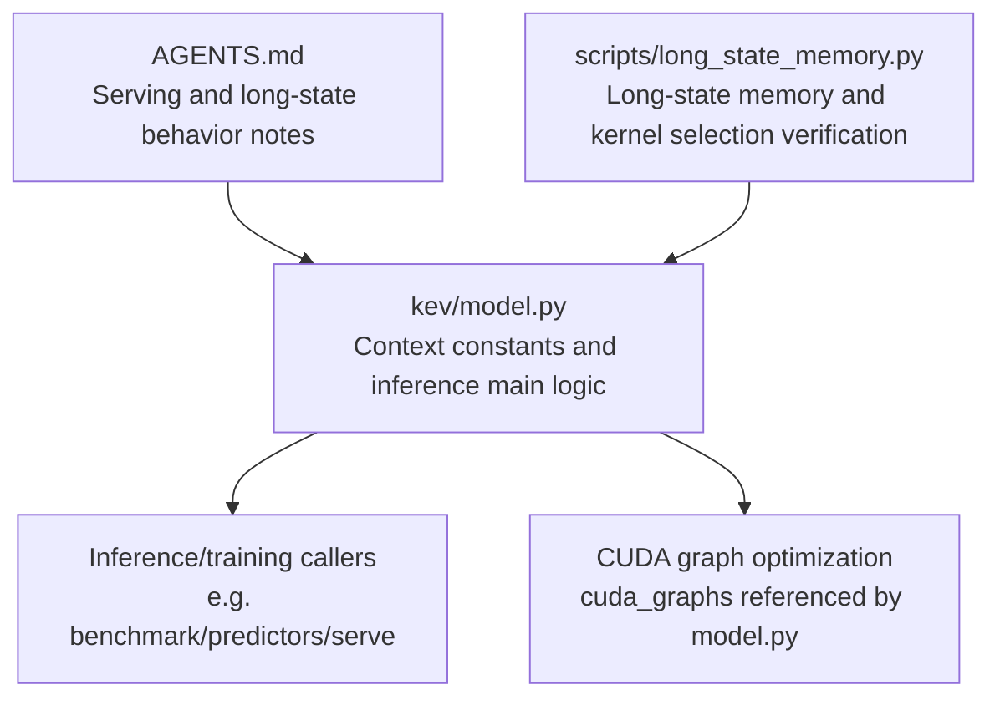
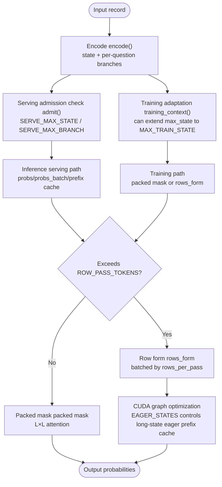
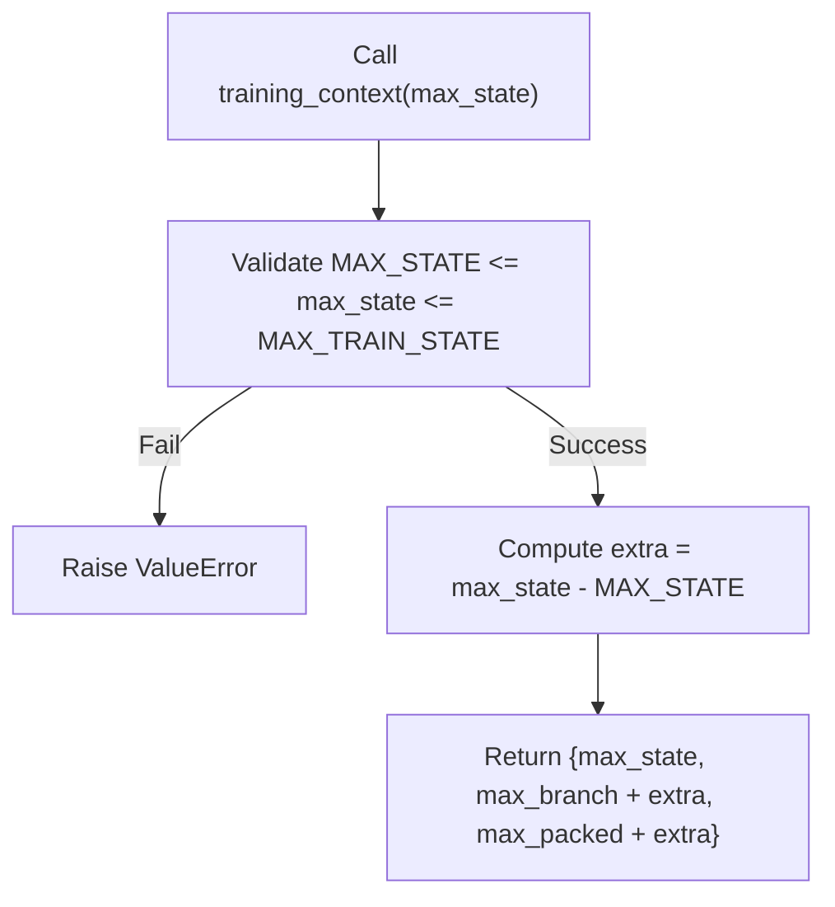
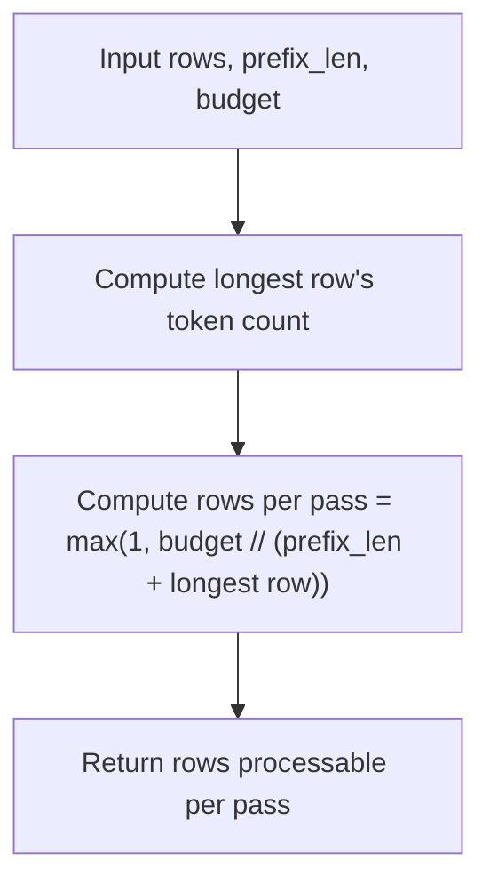
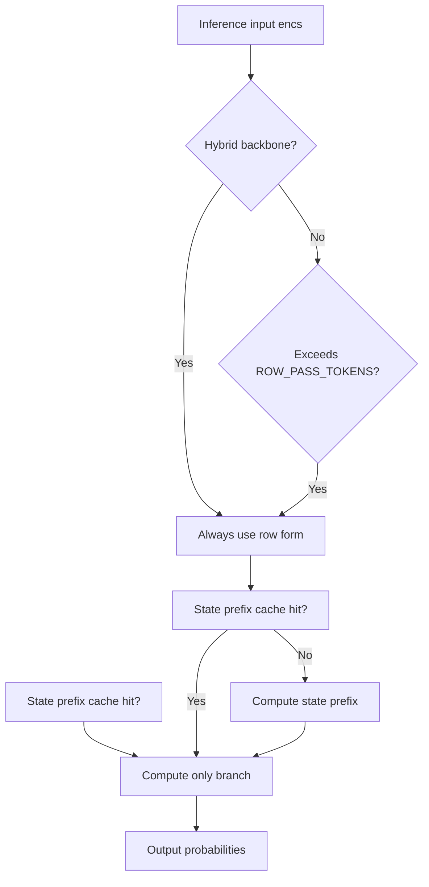
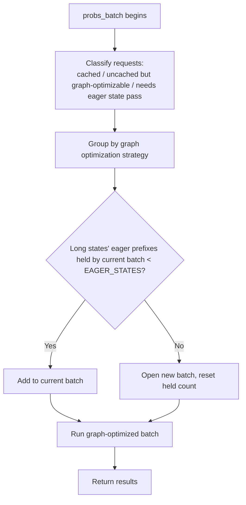
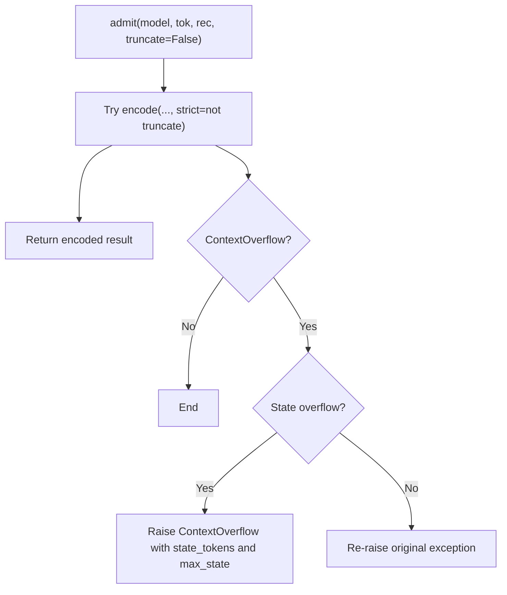
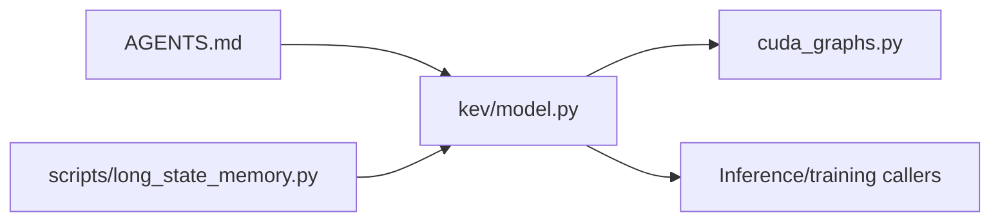

## Table of Contents
1. [Introduction](#introduction)
2. [Project Structure](#project-structure)
3. [Core Components](#core-components)
4. [Architecture Overview](#architecture-overview)
5. [Detailed Component Analysis](#detailed-component-analysis)
6. [Dependency Analysis](#dependency-analysis)
7. [Performance and Memory Considerations](#performance-and-memory-considerations)
8. [Troubleshooting Guide](#troubleshooting-guide)
9. [Conclusion](#conclusion)
10. [Appendix: Configuration Examples and Tuning Suggestions](#appendix-configuration-examples-and-tuning-suggestions)

## Introduction
This document focuses on "context management" and "length limits" in the Kev decision model, explaining the following key design points:
- The relationship between the training context upper bound, the inference serving upper bound, and the packed record upper bound.
- How `training_context()` dynamically extends the training context to support larger state lengths.
- The batching strategy of `rows_per_pass()`: under a fixed token budget, how to reasonably allocate inference requests within memory limits, balancing throughput and latency.
- The role of the `ROW_PASS_TOKENS` threshold: when to switch from the "packed mask" path to the "row form" path.
- The role of `EAGER_STATES` in CUDA graph optimization: controlling the number of eagerly prefix-cached long states.
- Concept explanations for beginners, plus memory optimization and performance tuning suggestions for experts.

## Project Structure
Kev's context and length limits are primarily defined in the model module and are referenced in multiple places along inference, training, and serving paths. The core files relevant to this document include:
- `kev/model.py`: defines all context constants and the encoding and inference main logic.
- `AGENTS.md`: provides engineering explanations of serving context, CUDA behavior, and long-state behavior.
- `scripts/long_state_memory.py`: used to verify attention kernel selection, memory usage, and numerical consistency under long states.

Chart Sources
- [kev/model.py:12-28](file://kev/model.py#L12-L28)
- [AGENTS.md:311-332](file://AGENTS.md#L311-L332)
- [scripts/long_state_memory.py:1-17](file://scripts/long_state_memory.py#L1-L17)

Section Sources
- [kev/model.py:12-28](file://kev/model.py#L12-L28)
- [AGENTS.md:311-332](file://AGENTS.md#L311-L332)

## Core Components
This section reviews the key constants and functions directly related to context management:
- Training context limits: `MAX_STATE`, `MAX_BRANCH`, `MAX_PACKED`
- Inference serving context limits: `SERVE_MAX_STATE`, `SERVE_MAX_BRANCH`, `SERVE_MAX_PACKED`
- Maximum training state upper bound: `MAX_TRAIN_STATE`
- Row-form switch threshold: `ROW_PASS_TOKENS`
- Long-state eager prefix cache upper bound: `EAGER_STATES`
- Dynamic training context construction: `training_context(max_state)`
- Rows-per-pass calculation: `rows_per_pass(rows, prefix_len=0, budget=ROW_PASS_TOKENS)`

These constants together form a two-layer constraint of "training-acceptable range" and "serving-acceptable range," and through `training_context()` extend the training-time state upper bound to the serving upper bound while keeping each question's branch token budget unchanged.

Section Sources
- [kev/model.py:12-28](file://kev/model.py#L12-L28)
- [kev/model.py:31-47](file://kev/model.py#L31-L47)

## Architecture Overview
The following diagram shows how Kev uses context length limits along the two paths of "training" and "inference serving":

Chart Sources
- [kev/model.py:31-47](file://kev/model.py#L31-L47)
- [kev/model.py:130-143](file://kev/model.py#L130-L143)
- [kev/model.py:329-333](file://kev/model.py#L329-L333)
- [kev/model.py:464-492](file://kev/model.py#L464-L492)

## Detailed Component Analysis

### Context Length Limit Constants and Design Considerations
- `MAX_STATE = 384`: default training state length upper bound.
- `MAX_BRANCH = 1024`: default per-question branch length upper bound during training.
- `MAX_PACKED = 2048`: default total packed record length upper bound during training.
- `SERVE_MAX_STATE = 65536`: maximum state length allowed by inference serving.
- `SERVE_MAX_BRANCH = SERVE_MAX_STATE + 8192`: the total length upper bound of state plus one question's branch allowed by inference serving.
- `SERVE_MAX_PACKED = SERVE_MAX_STATE + SERVE_MAX_BRANCH`: the total packed record length upper bound allowed by inference serving.
- `MAX_TRAIN_STATE = SERVE_MAX_STATE`: the maximum state length allowed for training is consistent with serving, ensuring training data can cover serving scenarios.
- `ROW_PASS_TOKENS = 16384`: determines whether the "row form" path is used at inference; records exceeding this threshold use the more memory-efficient row form.
- `EAGER_STATES = 4`: in CUDA graph optimization, a single batched run holds at most 4 long states' eagerly prefix caches.

The interrelationships of these constants are as follows:
- The training side uses `training_context()` to raise `max_state` from the default 384 to any valid value, up to `MAX_TRAIN_STATE`.
- The inference side uses `admit()` to enforce `SERVE_MAX_STATE` and `SERVE_MAX_BRANCH`, preventing overly long states from entering serving.
- The inference path automatically switches to "row form" based on `ROW_PASS_TOKENS`, avoiding memory explosion from L×L masks.
- CUDA graph optimization controls the number of long-state eager prefix caches via `EAGER_STATES`, avoiding holding too many KV states at once.

Section Sources
- [kev/model.py:12-28](file://kev/model.py#L12-L28)
- [AGENTS.md:311-332](file://AGENTS.md#L311-L332)

### `training_context()`: Dynamically Adjusting the Training Context
The core role of `training_context(max_state)` is:
- Validate that `max_state` is within the range `[MAX_STATE, MAX_TRAIN_STATE]`.
- Compute the extra state length `extra = max_state - MAX_STATE`.
- Return the new training context:
  - `max_state`: the user-specified state upper bound.
  - `max_branch`: `MAX_BRANCH + extra`, ensuring each question's branch budget grows equally with the state.
  - `max_packed`: `MAX_PACKED + extra`, ensuring the total packed record length also grows equally with the state.

The significance of this design is:
- Training can support larger state lengths, adapting to datasets containing longer documents.
- It keeps "each question's branch token budget" unchanged, avoiding breaking the semantic budget of the question structure while only enlarging the state.
- The training upper bound is limited to the serving upper bound `MAX_TRAIN_STATE`, ensuring training data does not exceed the context range acceptable to serving.

Chart Sources
- [kev/model.py:31-38](file://kev/model.py#L31-L38)

Section Sources
- [kev/model.py:31-38](file://kev/model.py#L31-L38)

### `rows_per_pass()`: Batching Strategy and Memory Control
The computation of `rows_per_pass(rows, prefix_len=0, budget=ROW_PASS_TOKENS)` is:
- The number of tokens carried by each row is approximately `prefix_len + len(row)`.
- The number of rows a single pass can hold is `max(1, budget // (prefix_len + max(len(r) for r in rows)))`.
- At least 1 is returned, ensuring that even if the budget is insufficient, one row can still be processed.

The design goals of this function:
- Under a fixed token budget `budget`, control the memory peak of a single forward pass.
- Because rows are independent and the answer does not depend on the specific chunking, a large number of questions can be safely processed in batches.
- When a shared state prefix exists, `prefix_len` significantly affects the rows per pass, balancing "throughput" and "latency."

Chart Sources
- [kev/model.py:41-47](file://kev/model.py#L41-L47)

Section Sources
- [kev/model.py:41-47](file://kev/model.py#L41-L47)

### `ROW_PASS_TOKENS`: Switch Threshold Between Row Form and Packed Form
`ROW_PASS_TOKENS = 16384` is an important switch on the inference path:
- For attention-only backbones, if the packed sequence length exceeds this threshold, the "row form" is used.
- The row form builds an independent causal row for each question, avoiding unbounded memory growth from the L×L mask.
- Hybrid backbones (e.g., Qwen3.5's Gated DeltaNet) always use the row form, because their recurrent layers cannot correctly honor the packed mask.

Additionally, the serving path selects different execution methods based on whether the state prefix cache is hit:
- Miss: compute the state prefix first, then the question branch.
- Hit: compute only the question branch, reusing the KV cache.

Chart Sources
- [kev/model.py:329-333](file://kev/model.py#L329-L333)
- [kev/model.py:416-462](file://kev/model.py#L416-L462)

Section Sources
- [kev/model.py:329-333](file://kev/model.py#L329-L333)
- [kev/model.py:416-462](file://kev/model.py#L416-L462)

### `EAGER_STATES`: Long-State Prefix Cache in CUDA Graph Optimization
In `DecisionModel.probs_batch()`, CUDA graph optimization groups a batch of requests for execution. For long-state requests that miss the cache, the system first runs an eager state pass, then continues with the graph-optimized row pass.

`EAGER_STATES = 4` means:
- In a single batched run, at most 4 long states' eagerly prefix caches are held simultaneously.
- When the upper bound is reached, the system opens a new batch, avoiding holding too many KV states at once and causing memory overflow.
- Each long state's prefix cache contains keys, values, and the DeltaNet state, so its memory footprint is non-negligible.

Chart Sources
- [kev/model.py:232-233](file://kev/model.py#L232-L233)
- [kev/model.py:464-492](file://kev/model.py#L464-L492)

Section Sources
- [kev/model.py:232-233](file://kev/model.py#L232-L233)
- [kev/model.py:464-492](file://kev/model.py#L464-L492)

### Serving Admission and Context Overflow
The serving entry does unified admission checking via `admit()`:
- Uses `SERVE_MAX_STATE` and `SERVE_MAX_BRANCH` as strict upper bounds.
- If the state exceeds `SERVE_MAX_STATE`, a `ContextOverflow` is raised, with the actual token count and limit value attached.
- `truncate=True` allows the serving to truncate the state, but the evaluation path usually stays in strict mode.

Chart Sources
- [kev/model.py:130-143](file://kev/model.py#L130-L143)

Section Sources
- [kev/model.py:130-143](file://kev/model.py#L130-L143)

## Dependency Analysis
The dependency relationships involved in context management are as follows:
- `model.py` is the core implementation, defining constants, encoding, masks, and the inference main flow.
- `AGENTS.md` provides engineering-level behavior notes, including serving context, CUDA behavior, and long-state behavior.
- `scripts/long_state_memory.py` verifies attention kernel selection and memory behavior under long states.
- `cuda_graphs.py` is referenced by `model.py` in inference batching, responsible for CUDA graph capture and replay.

Chart Sources
- [kev/model.py:464-492](file://kev/model.py#L464-L492)
- [AGENTS.md:311-332](file://AGENTS.md#L311-L332)
- [scripts/long_state_memory.py:1-17](file://scripts/long_state_memory.py#L1-L17)

Section Sources
- [kev/model.py:464-492](file://kev/model.py#L464-L492)
- [AGENTS.md:311-332](file://AGENTS.md#L311-L332)
- [scripts/long_state_memory.py:1-17](file://scripts/long_state_memory.py#L1-L17)

## Performance and Memory Considerations
- Short-state path: uses the packed mask, suitable for shorter contexts, with high compute efficiency.
- Long-state path: uses the row form, avoiding L×L mask memory explosion, suitable for states of 16k or more.
- CUDA graph optimization: uses `EAGER_STATES` to control the number of long-state eager prefix caches, reducing peak memory.
- Row batching: uses `rows_per_pass()` to control rows per pass, balancing throughput and latency.
- Serving context: `SERVE_MAX_STATE` and `SERVE_MAX_BRANCH` ensure serving stability, preventing overly long requests from entering the backend.

Section Sources
- [kev/model.py:41-47](file://kev/model.py#L41-L47)
- [kev/model.py:329-333](file://kev/model.py#L329-L333)
- [kev/model.py:464-492](file://kev/model.py#L464-L492)
- [AGENTS.md:311-332](file://AGENTS.md#L311-L332)

## Troubleshooting Guide
Common issues and localization methods:
- 422 error due to overly long state: check whether `state_tokens` exceeds `SERVE_MAX_STATE`.
- Context overflow due to overly long branch: check whether a single question's branch exceeds `SERVE_MAX_BRANCH`.
- Training error `max_state must be in [...]` : confirm whether the `max_state` passed to `training_context()` is within `[MAX_STATE, MAX_TRAIN_STATE]`.
- Long-state memory overflow: check whether the row-form path was triggered, and confirm whether `EAGER_STATES` is sufficient to control the eager prefix cache count.
- CUDA long-state behavior inconsistency: refer to `scripts/long_state_memory.py`'s verification method, comparing the memory and time of the math, legacy, long, and rows modes.

Section Sources
- [kev/model.py:31-38](file://kev/model.py#L31-L38)
- [kev/model.py:130-143](file://kev/model.py#L130-L143)
- [scripts/long_state_memory.py:1-17](file://scripts/long_state_memory.py#L1-L17)

## Conclusion
Kev's context management works through the coordination of multiple-layer constants and functions:
- The training side supports larger state lengths via `training_context()` while keeping the question branch budget stable.
- The inference side uses `SERVE_MAX_*` to ensure serving stability, and `ROW_PASS_TOKENS` to automatically switch to row form to avoid memory explosion.
- CUDA graph optimization uses `EAGER_STATES` to control the number of long-state eager prefix caches, further reducing peak memory.
- `rows_per_pass()` reasonably allocates inference requests under a fixed token budget, balancing throughput and latency.

This design caters both to beginners' basic understanding of "context length" and to experts' concrete entry points for memory optimization and performance tuning.

## Appendix: Configuration Examples and Tuning Suggestions

### Basic Concepts
- State: the context the model needs to remember, e.g., document content.
- Branch: each question's instruction and options.
- Packing: merging the state and multiple question branches into one sequence.
- Row form: processing each question as an independent causal row, avoiding the L×L mask.

### Training Configuration Example
- Default training context: `MAX_STATE=384`, suitable for short documents.
- Long-document training: call `training_context(max_state=...)`, raising the state upper bound to `MAX_TRAIN_STATE` while proportionally increasing `max_branch` and `max_packed`.
- Notes:
  - `max_state` cannot exceed `MAX_TRAIN_STATE`.
  - Training data must pass the serving context check of `admit()`, otherwise deployment may be unstable.

### Inference Serving Configuration Example
- Default serving context: `SERVE_MAX_STATE=65536`, `SERVE_MAX_BRANCH=SERVE_MAX_STATE+8192`.
- Overly long state handling:
  - Strict mode: reject overly long states, return 422.
  - Truncation mode: set `truncate_states=True`, reading only the first `SERVE_MAX_STATE` tokens.
- Long-state optimization:
  - Records exceeding `ROW_PASS_TOKENS=16384` automatically use the row form.
  - CUDA graph optimization uses `EAGER_STATES=4` to control the number of long-state eager prefix caches.

### Performance Tuning Suggestions
- Short-context scenarios:
  - Use the packed mask path to reduce kernel launch overhead.
  - Increase batch size to improve throughput.
- Long-context scenarios:
  - Enable row form to avoid L×L mask memory explosion.
  - Adjust the budget of `rows_per_pass()` to balance rows per pass and latency.
  - Monitor `EAGER_STATES` to avoid holding too many long-state prefix caches at once.
- CUDA environment:
  - Use `scripts/long_state_memory.py` to verify attention kernel selection and memory behavior under long states.
  - Compare the math, legacy, long, and rows modes to choose a suitable execution path.

Section Sources
- [kev/model.py:12-28](file://kev/model.py#L12-L28)
- [kev/model.py:31-47](file://kev/model.py#L31-L47)
- [kev/model.py:130-143](file://kev/model.py#L130-L143)
- [kev/model.py:329-333](file://kev/model.py#L329-L333)
- [kev/model.py:464-492](file://kev/model.py#L464-L492)
- [AGENTS.md:311-332](file://AGENTS.md#L311-L332)
- [scripts/long_state_memory.py:1-17](file://scripts/long_state_memory.py#L1-L17)
