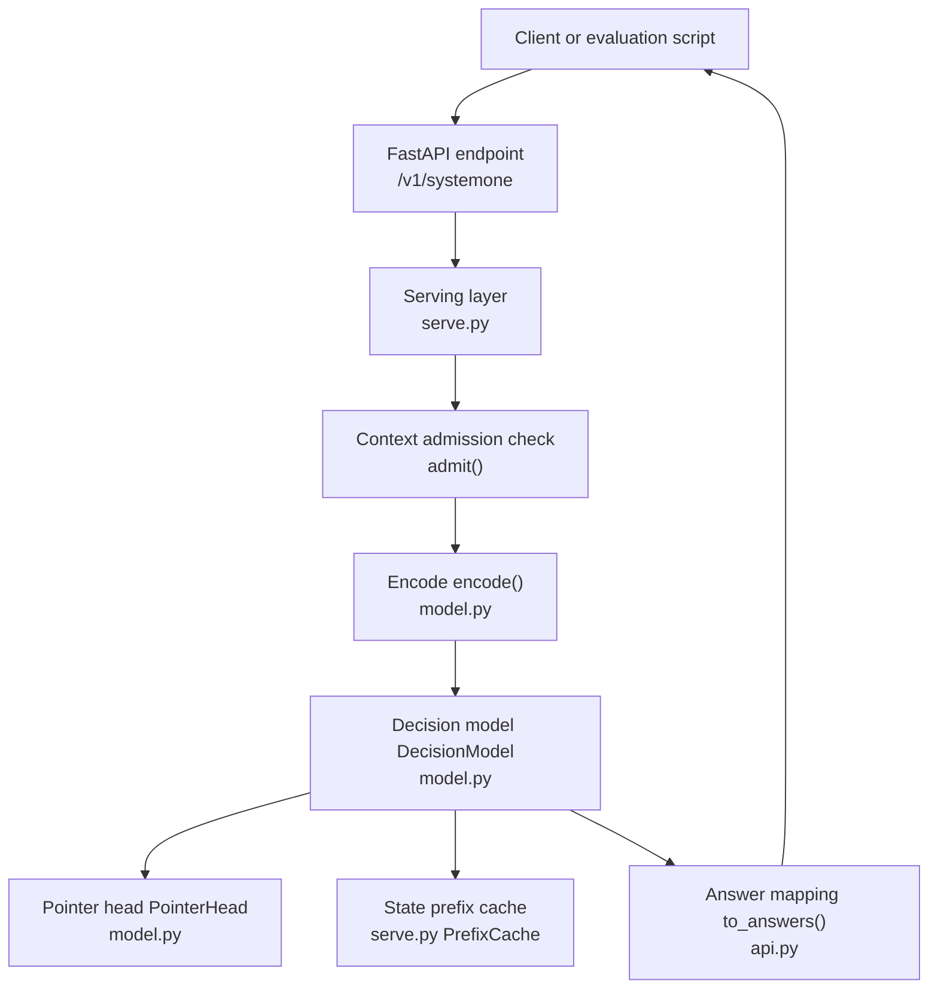
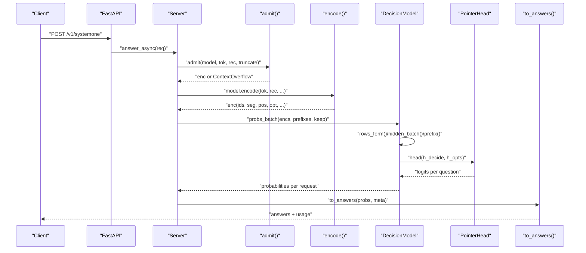
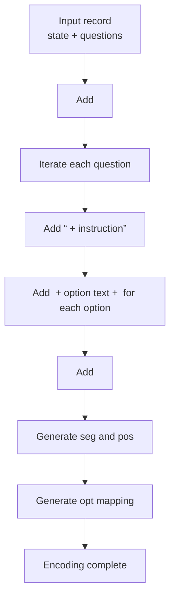
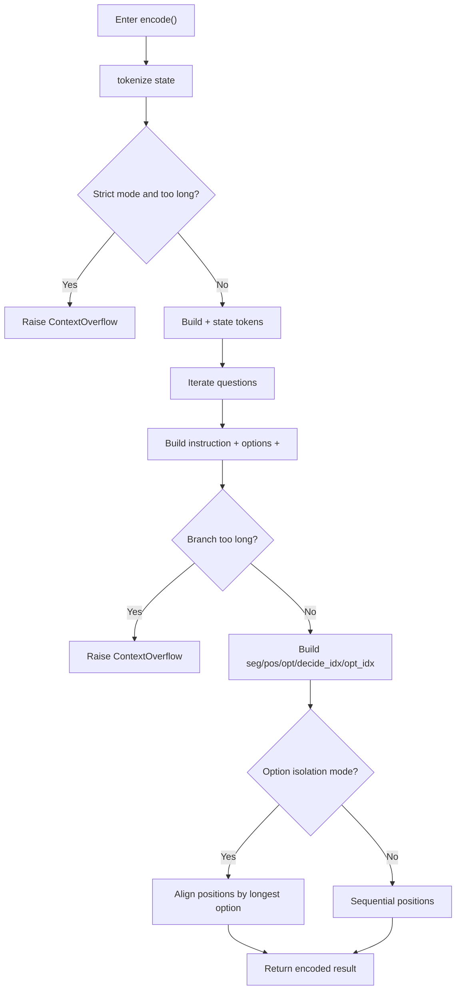
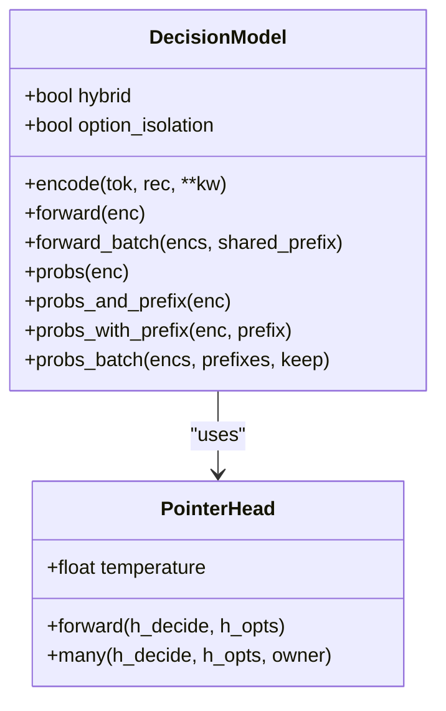
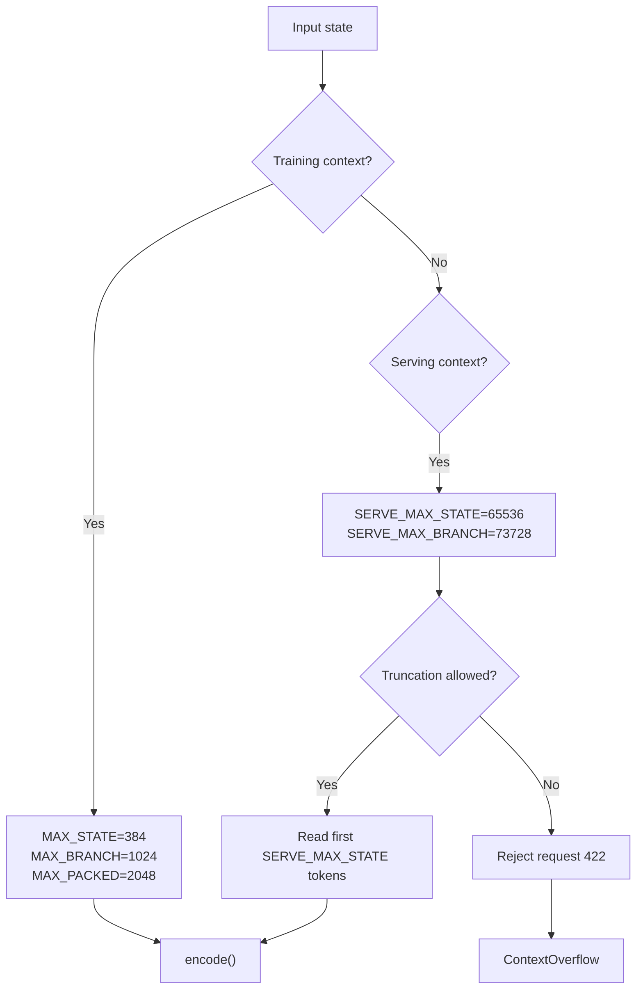
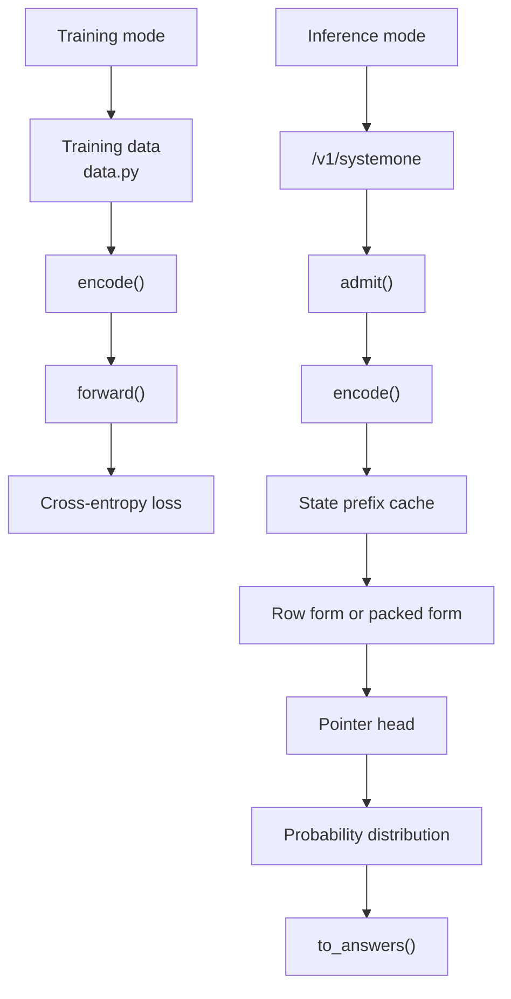
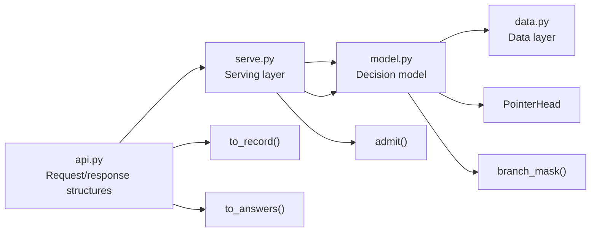

## Table of Contents
1. [Introduction](#introduction)
2. [Project Structure](#project-structure)
3. [Core Components](#core-components)
4. [Architecture Overview](#architecture-overview)
5. [Detailed Component Analysis](#detailed-component-analysis)
6. [Dependency Analysis](#dependency-analysis)
7. [Performance and Context Length](#performance-and-context-length)
8. [Troubleshooting Guide](#troubleshooting-guide)
9. [Conclusion](#conclusion)

## Introduction
Kev is a family of small decision models based on the Qwen backbone, with the goal of answering multiple types of questions—yes/no judgments, multiple choice, and ordinal scoring—in parallel over the same state text. Its core idea is to encode "state text + question" into a token sequence, and use special separators and an attention mask so that the model reads the state in a single forward pass and independently answers each question; finally, a pointer head aligns each question's end marker with the option end markers to obtain a probability distribution.

For beginners, Kev can be understood as:
- Input: a "state" to be judged, plus several questions.
- Processing: concatenate the state and questions into a token stream, and use a mask to ensure "questions do not interfere with each other."
- Output: a probability distribution per question, then mapped back to a human-readable answer.

For experts, the key implementation points include:
- The special token system `<state>`, `<q>`, `<opt>`, `</opt>`, `<decide>`.
- The state truncation, branch construction, and option isolation modes of `encode()`.
- Different inference paths for pure-attention backbones (Qwen3) versus hybrid attention/DeltaNet backbones (Qwen3.5/Qwen3.8).
- Training context and serving context length limits and their practical impact.

## Project Structure
The project's core code is concentrated in the `kev/` directory, where the files directly related to the decision model architecture include:
- `model.py`: defines the special tokens, encoding functions, attention mask, pointer head, decision model class, cache, and batching.
- `serve.py`: the FastAPI serving layer, responsible for request validation, state prefix cache, batch scheduling, error handling, and metric returns.
- `api.py`: TypeSafe-compatible request/response structures, question-to-internal-record conversion, confidence computation.
- `data.py`: conversion of public datasets to Kev training format, data augmentation, and materialization logic.
- `README.md`: user documentation describing the model family, training, deployment, performance, and limitations.

**Diagram Sources**
- [serve.py:249-252](file://kev/serve.py#L249-L252)
- [serve.py:132-145](file://kev/serve.py#L132-L145)
- [model.py:87-127](file://kev/model.py#L87-L127)
- [model.py:205-224](file://kev/model.py#L205-L224)
- [api.py:102-117](file://kev/api.py#L102-L117)
- [api.py:149-160](file://kev/api.py#L149-L160)

**Section Sources**
- [README.md:13-23](file://README.md#L13-L23)
- [README.md:260-280](file://README.md#L260-L280)

## Core Components
The core of Kev consists of the following:

| Component | Responsibility | Key Location |
|---|---|---|
| Special token system | Uses existing Qwen special tokens as state, question, option, and decision boundaries, avoiding vocabulary expansion | [model.py:9-11](file://kev/model.py#L9-L11) |
| Encoder `encode()` | Packs state and questions into ids, seg, pos, opt, and other metadata | [model.py:87-127](file://kev/model.py#L87-L127) |
| Branch mask | Block-causal mask, allowing state and same-question tokens to attend to each other, but forbidding cross-question attention | [model.py:154-185](file://kev/model.py#L154-L185) |
| Pointer head | Compares the `<decide>` hidden state with each option's `</opt>` hidden state, outputs option logits | [model.py:205-224](file://kev/model.py#L205-L224) |
| Decision model | Wraps the backbone model, LoRA, row-form and packed-form inference, prefix cache, and batching | [model.py:243-509](file://kev/model.py#L243-L509) |
| Serving layer | Request parsing, context validation, state prefix cache, batch scheduling, errors and metrics | [serve.py:27-34](file://kev/serve.py#L27-L34), [serve.py:93-220](file://kev/serve.py#L93-L220) |
| API adapter layer | TypeSafe-compatible structures, question rendering, confidence, answer mapping | [api.py:17-47](file://kev/api.py#L17-L47), [api.py:102-160](file://kev/api.py#L102-L160) |
| Data layer | Public datasets to Kev format, augmentation, materialization | [data.py:1-7](file://kev/data.py#L1-L7), [data.py:298-343](file://kev/data.py#L298-L343) |

**Section Sources**
- [model.py:9-11](file://kev/model.py#L9-L11)
- [model.py:87-127](file://kev/model.py#L87-L127)
- [model.py:154-185](file://kev/model.py#L154-L185)
- [model.py:205-224](file://kev/model.py#L205-L224)
- [model.py:243-509](file://kev/model.py#L243-L509)
- [serve.py:27-34](file://kev/serve.py#L27-L34)
- [serve.py:93-220](file://kev/serve.py#L93-L220)
- [api.py:17-47](file://kev/api.py#L17-L47)
- [api.py:102-160](file://kev/api.py#L102-L160)
- [data.py:1-7](file://kev/data.py#L1-L7)
- [data.py:298-343](file://kev/data.py#L298-L343)

## Architecture Overview
The complete data flow from input to output is as follows:

**Diagram Sources**
- [serve.py:249-252](file://kev/serve.py#L249-L252)
- [serve.py:132-145](file://kev/serve.py#L132-L145)
- [model.py:130-143](file://kev/model.py#L130-L143)
- [model.py:294-296](file://kev/model.py#L294-L296)
- [model.py:464-492](file://kev/model.py#L464-L492)
- [model.py:216-224](file://kev/model.py#L216-L224)
- [api.py:149-160](file://kev/api.py#L149-L160)

## Detailed Component Analysis

### Special Token System and Question Representation
Kev reuses Qwen's special tokens as separators rather than expanding the vocabulary:
- `<state>`: state start.
- `<q>`: question instruction start.
- `<opt>`: option start.
- `</opt>`: option end.
- `<decide>`: question decision end.

The advantages of this design are:
- No new embedding rows need to be added.
- LoRA can learn the new meanings of these tokens in the decision task.
- Training and inference use exactly the same text format.

**Diagram Sources**
- [model.py:9-11](file://kev/model.py#L9-L11)
- [model.py:87-127](file://kev/model.py#L87-L127)

**Section Sources**
- [README.md:260-276](file://README.md#L260-L276)
- [model.py:9-11](file://kev/model.py#L9-L11)
- [model.py:87-127](file://kev/model.py#L87-L127)

### How the Encoding Function `encode()` Works
`encode()` is Kev's core data processing function. It is responsible for:
1. Converting the user state text into tokens.
2. In strict mode, checking whether the state exceeds `max_state`.
3. Concatenating `<state>` and state tokens.
4. For each question, concatenating `<q>`, instruction, `<opt>`, option, `</opt>`, `<decide>`.
5. Checking whether the branch length exceeds `max_branch`.
6. Generating segment index `seg`, position index `pos`, and option index `opt`.
7. Supporting the option isolation mode: each option only sees the state, instruction, and itself.

**Diagram Sources**
- [model.py:87-127](file://kev/model.py#L87-L127)

**Section Sources**
- [model.py:87-127](file://kev/model.py#L87-L127)

### Handling Differences Across Backbone Models
Kev chooses the inference path based on the backbone model configuration:

| Backbone type | Characteristics | Inference method | Reason |
|---|---|---|---|
| Qwen3 pure-attention model | Only attention layers | Packed form: all questions and state in one sequence, using block-causal mask | Attention can correctly honor the mask |
| Qwen3.5/Qwen3.8 hybrid model | Attention layers mixed with Gated DeltaNet layers | Row form: each question runs as a separate row, continuing the state's prefix cache | DeltaNet is a recurrent layer and cannot respect attention masks |

**Diagram Sources**
- [model.py:205-224](file://kev/model.py#L205-L224)
- [model.py:243-509](file://kev/model.py#L243-L509)

**Section Sources**
- [README.md:260-276](file://README.md#L260-L276)
- [model.py:69-73](file://kev/model.py#L69-L73)
- [model.py:259-264](file://kev/model.py#L259-L264)
- [model.py:329-333](file://kev/model.py#L329-L333)

### Design and Practical Impact of Context Length Limits
Kev defines multiple context length limits for training and serving respectively:

| Constant | Value | Purpose | Note |
|---|---:|---|---|
| `MAX_STATE` | 384 | Default training state length | Small models are mainly trained at this length |
| `MAX_BRANCH` | 1024 | Default training branch length | Max length of state + one question |
| `MAX_PACKED` | 2048 | Default training packed length | Max length of the entire packed record |
| `SERVE_MAX_STATE` | 65536 | Serving state length upper bound | Longest state accepted by the server |
| `SERVE_MAX_BRANCH` | 73728 | Serving branch length upper bound | Max length of state + one question row |
| `SERVE_MAX_PACKED` | 131072 | Serving packed length upper bound | Server-side packed record upper bound |
| `ROW_PASS_TOKENS` | 16384 | Token budget per single inference pass | Packed sequences longer than this degrade to row form |

**Diagram Sources**
- [model.py:13-28](file://kev/model.py#L13-L28)
- [model.py:87-127](file://kev/model.py#L87-L127)
- [model.py:130-143](file://kev/model.py#L130-L143)
- [serve.py:27-32](file://kev/serve.py#L27-L32)

**Section Sources**
- [model.py:13-28](file://kev/model.py#L13-L28)
- [model.py:31-38](file://kev/model.py#L31-L38)
- [model.py:130-143](file://kev/model.py#L130-L143)
- [serve.py:27-32](file://kev/serve.py#L27-L32)

### Different Processing Paths in Training vs Inference Modes
Training mode:
- Uses the cross-entropy loss.
- Adapters or full weights participate in training.
- The backbone model is usually frozen (except Kev-27B).
- Training data and API requests use the same text format.

Inference mode:
- The serving layer first performs context admission checking.
- The state prefix is cached, so repeated states only need to compute the question branch.
- Hybrid backbones use row form; pure-attention backbones can use packed form.
- The pointer head outputs option logits, then softmax yields probabilities.

**Diagram Sources**
- [data.py:298-343](file://kev/data.py#L298-L343)
- [model.py:87-127](file://kev/model.py#L87-L127)
- [model.py:385-394](file://kev/model.py#L385-L394)
- [model.py:416-462](file://kev/model.py#L416-L462)
- [serve.py:132-145](file://kev/serve.py#L132-L145)
- [api.py:149-160](file://kev/api.py#L149-L160)

**Section Sources**
- [README.md:278-286](file://README.md#L278-L286)
- [data.py:298-343](file://kev/data.py#L298-L343)
- [model.py:385-394](file://kev/model.py#L385-L394)
- [model.py:416-462](file://kev/model.py#L416-L462)
- [serve.py:132-145](file://kev/serve.py#L132-L145)
- [api.py:149-160](file://kev/api.py#L149-L160)

## Dependency Analysis
Kev's core dependency relationships are as follows:

**Diagram Sources**
- [api.py:102-117](file://kev/api.py#L102-L117)
- [api.py:149-160](file://kev/api.py#L149-L160)
- [serve.py:223-225](file://kev/serve.py#L223-L225)
- [serve.py:249-252](file://kev/serve.py#L249-L252)
- [model.py:87-127](file://kev/model.py#L87-L127)
- [model.py:154-185](file://kev/model.py#L154-L185)
- [model.py:205-224](file://kev/model.py#L205-L224)

**Section Sources**
- [api.py:102-117](file://kev/api.py#L102-L117)
- [api.py:149-160](file://kev/api.py#L149-L160)
- [serve.py:223-225](file://kev/serve.py#L223-L225)
- [serve.py:249-252](file://kev/serve.py#L249-L252)
- [model.py:87-127](file://kev/model.py#L87-L127)
- [model.py:154-185](file://kev/model.py#L154-L185)
- [model.py:205-224](file://kev/model.py#L205-L224)

## Performance and Context Length
### Impact of Context Length Limits
- During training, small models are mainly trained within 384 state tokens, but `training_context()` can raise the state length while proportionally increasing the branch and packed budgets.
- During serving, the state is at most 65536 tokens, and each question row at most an additional 8192 tokens.
- If the state is too long and truncation is not enabled, the server returns a 422 error.
- If `KEV_TRUNCATE_STATES=1` is enabled, the server reads the first 65536 tokens and marks `truncated` in the response.

### Inference Performance Optimization Suggestions
- For repeated states, use the state prefix cache to avoid recomputing the state.
- For hybrid backbones, the row form naturally guarantees question isolation but requires caching the state prefix.
- For pure-attention backbones, the packed form can reduce redundant computation, but watch out for the L×L mask memory growth.
- Using bf16 inference can significantly speed up large models, but evaluation should use fp32 to ensure numerical consistency.
- Enabling CUDA Graphs on CUDA reduces kernel launch overhead.

**Section Sources**
- [model.py:31-38](file://kev/model.py#L31-L38)
- [model.py:130-143](file://kev/model.py#L130-L143)
- [serve.py:27-32](file://kev/serve.py#L27-L32)
- [serve.py:132-145](file://kev/serve.py#L132-L145)
- [README.md:355-383](file://README.md#L355-L383)

## Troubleshooting Guide
### Common Issues
1. **422 error due to overly long state**
   - Symptom: the server rejects requests whose state exceeds `SERVE_MAX_STATE`.
   - Solution: shorten the state, split the request, or enable `KEV_TRUNCATE_STATES=1`.
   - Related code: [serve.py:132-145](file://kev/serve.py#L132-L145), [model.py:130-143](file://kev/model.py#L130-L143)

2. **ContextOverflow due to overly long branch**
   - Symptom: a question's instruction + options + end marker exceeds `max_branch`.
   - Solution: reduce the number of options or shorten the instruction.
   - Related code: [model.py:112-113](file://kev/model.py#L112-L113)

3. **Hybrid backbone cannot use option isolation**
   - Symptom: an error is raised when setting `option_isolation=True`.
   - Cause: the hybrid backbone's DeltaNet layer cannot respect the packed mask.
   - Related code: [model.py:263](file://kev/model.py#L263)

4. **Out of memory on Mac**
   - Symptom: memory overflow on the MPS/CPU path during training or inference.
   - Solution: avoid enabling `output_hidden_states`, avoid adding special token indices.
   - Related code: [README.md:421-428](file://README.md#L421-L428)

**Section Sources**
- [serve.py:132-145](file://kev/serve.py#L132-L145)
- [model.py:112-113](file://kev/model.py#L112-L113)
- [model.py:263](file://kev/model.py#L263)
- [README.md:421-428](file://README.md#L421-L428)

## Conclusion
Kev's core architecture revolves around the token sequence of "state + question," achieving parallel multi-question inference through special separators and an attention mask. Its design balances simplicity and extensibility:
- The special token system avoids vocabulary expansion.
- `encode()` provides flexible state truncation, branch construction, and option isolation capabilities.
- Pure-attention and hybrid-attention backbones have different inference paths, ensuring correctness across different model architectures.
- Training and serving context lengths are separated, guaranteeing training stability while improving serving flexibility.

For beginners, it is recommended to start with the README and API documentation to understand the input/output format and basic usage; for experts, it is recommended to read deeply into `model.py`'s `encode()`, `branch_mask()`, `DecisionModel`, and `PointerHead`, and combine them with `serve.py`'s serving layer logic to understand the complete inference pipeline.
