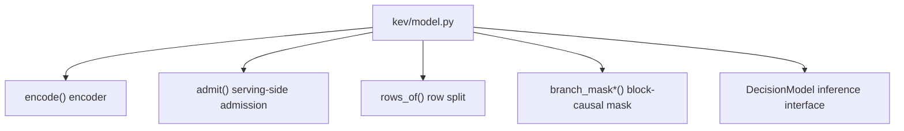
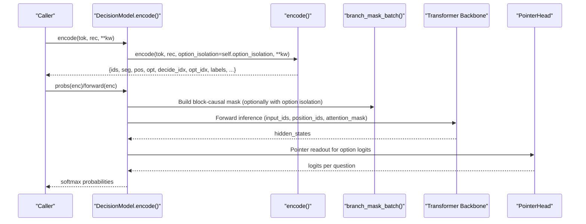
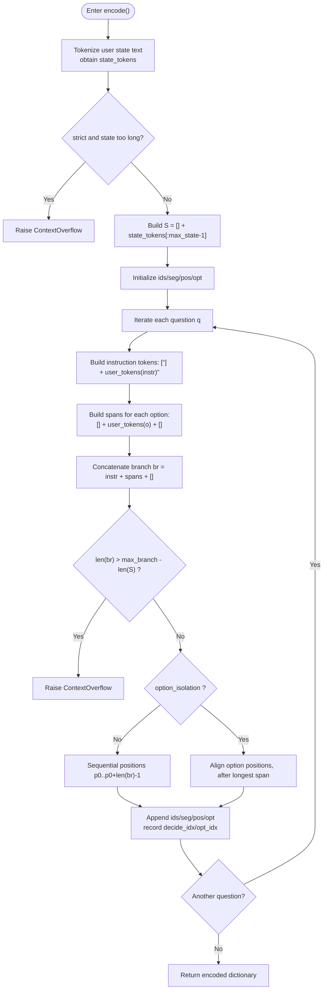
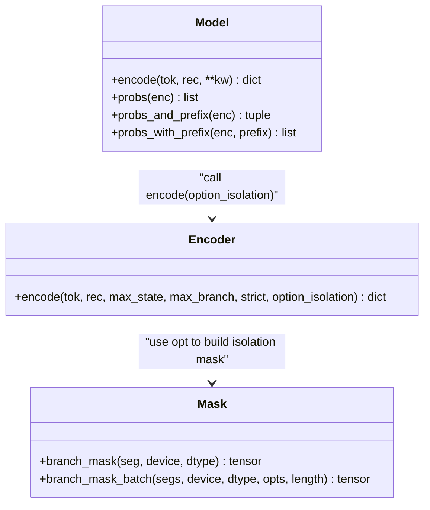
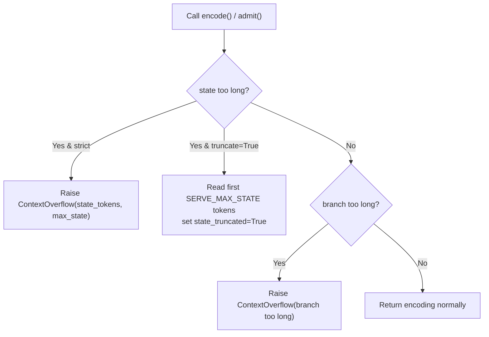
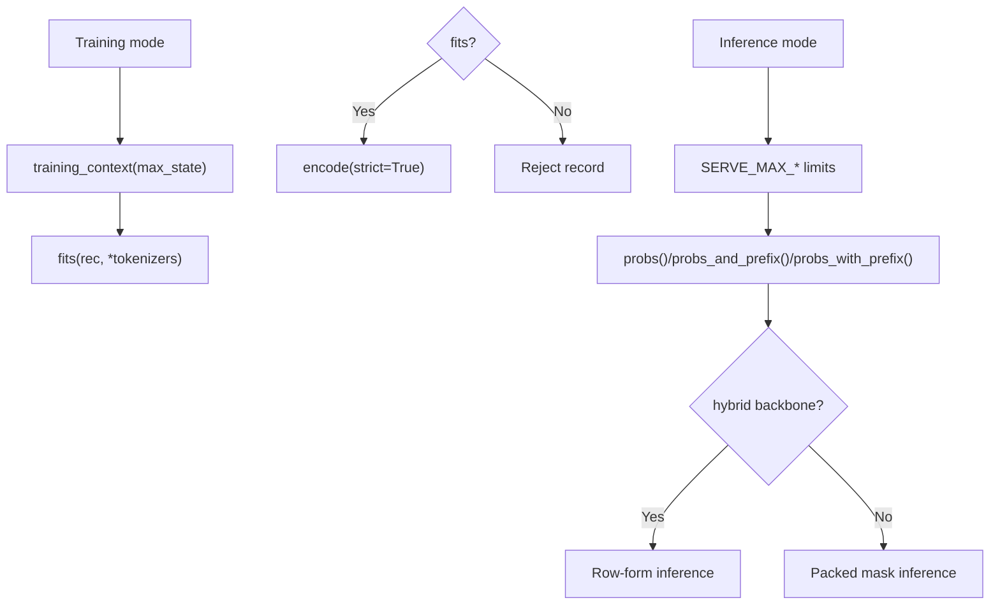
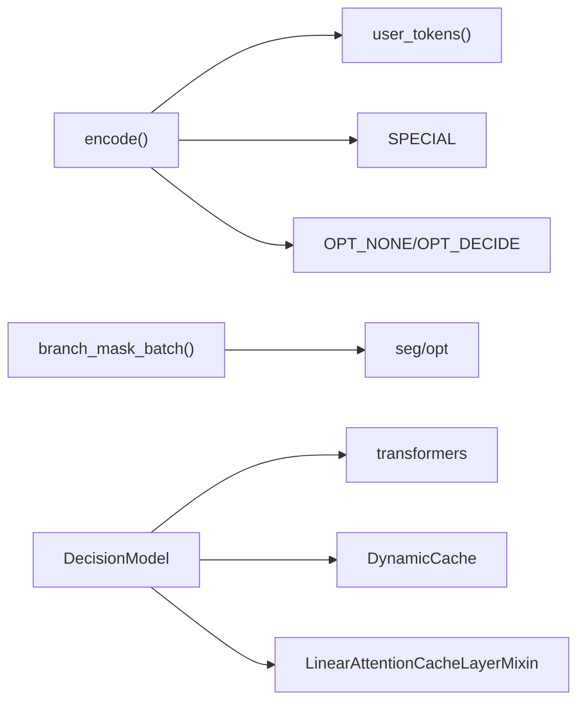

## Table of Contents
1. [Introduction](#introduction)
2. [Project Structure](#project-structure)
3. [Core Components](#core-components)
4. [Architecture Overview](#architecture-overview)
5. [Detailed Component Analysis](#detailed-component-analysis)
6. [Dependency Analysis](#dependency-analysis)
7. [Performance Considerations](#performance-considerations)
8. [Troubleshooting Guide](#troubleshooting-guide)
9. [Conclusion](#conclusion)

## Introduction
This document focuses on the encoding mechanism of the Kev decision model, emphasizing how encode() combines "state text + question instruction + option list" into a model-consumable token sequence. The document covers:
- The special token system: <state>, <q>, <opt>...</opt>, <decide>
- Branch construction and generation of position/segment/option indices
- option_isolation (option isolation) mode and its permutation invariance
- ContextOverflow exception handling and the state_truncated flag
- Encoding differences between training and inference modes
- Concept explanations for beginners and performance optimization suggestions and debugging tips for experts

## Project Structure
The encoding logic of this project is concentrated in kev/model.py, which contains:
- Special token definitions and context length limit constants
- encode() main encoder
- admit() serving-side admission check
- rows_of() splits the packed encoding into "state + per-question branch" row form
- branch_mask()/branch_mask_batch() block-causal attention mask
- DecisionModel class wrapping inference capabilities such as encoding, forward, probability computation, and KV cache

Diagram Sources
- [model.py:87-127](file://kev/model.py#L87-L127)
- [model.py:130-143](file://kev/model.py#L130-L143)
- [model.py:188-202](file://kev/model.py#L188-L202)
- [model.py:154-185](file://kev/model.py#L154-L185)
- [model.py:243-509](file://kev/model.py#L243-L509)

Section Sources
- [model.py:1-509](file://kev/model.py#L1-L509)

## Core Components
- Special tokens and context limits
  - Uses Qwen tokenizer's special tokens as separators: <state>, <q>, <opt>, </opt>, <decide>
  - Training context: MAX_STATE=384, MAX_BRANCH=1024, MAX_PACKED=2048
  - Serving context: SERVE_MAX_STATE=65536, SERVE_MAX_BRANCH=SERVE_MAX_STATE+8192, SERVE_MAX_PACKED=SERVE_MAX_STATE+SERVE_MAX_BRANCH
  - ROW_PASS_TOKENS=16384: the maximum number of tokens a single inference pass can hold

- encode() encoder
  - Input: tokenizer, record rec (containing state, questions), optional parameters max_state, max_branch, strict, option_isolation
  - Output: ids, seg, pos, opt, decide_idx, opt_idx, labels, state_tokens, state_truncated, option_isolation

- admit() serving-side admission
  - Performs strict or truncation-based checking based on SERVE_MAX_* limits
  - Raises ContextOverflow when the state is too long, carrying state_tokens and max_state

- rows_of() row split
  - Splits the packed encoding into (state_ids, state_pos, rows), where each row corresponds to one question's branch

- branch_mask()/branch_mask_batch() block-causal mask
  - Ensures each token within the same question only attends to itself and prior tokens; under option_isolation, option tokens can only attend to their own span, the instruction, and the state, while `<decide>` can attend to the entire branch

- DecisionModel
  - Wraps encode(), forward/probs, prefix/probs_and_prefix/probs_with_prefix, batched inference, etc.
  - Supports different paths for hybrid backbones (e.g., Qwen3.5) and attention-only backbones

Section Sources
- [model.py:9-28](file://kev/model.py#L9-L28)
- [model.py:87-127](file://kev/model.py#L87-L127)
- [model.py:130-143](file://kev/model.py#L130-L143)
- [model.py:154-185](file://kev/model.py#L154-L185)
- [model.py:188-202](file://kev/model.py#L188-L202)
- [model.py:243-509](file://kev/model.py#L243-L509)

## Architecture Overview
The following diagram shows the key flow from an input record to a token sequence and then to model inference.

Diagram Sources
- [model.py:294-296](file://kev/model.py#L294-L296)
- [model.py:87-127](file://kev/model.py#L87-L127)
- [model.py:159-185](file://kev/model.py#L159-L185)
- [model.py:385-394](file://kev/model.py#L385-L394)
- [model.py:396-402](file://kev/model.py#L396-L402)

## Detailed Component Analysis

### How encode() Works
encode() is responsible for packing "state + multiple questions" into one continuous token sequence, annotating each token with:
- ids: token id sequence
- seg: segment number (0=state, k=the k-th question)
- pos: position index (branch positions after the state recount from the state length)
- opt: each token's option number (OPT_NONE/OPT_DECIDE or option ordinal)
- decide_idx: each question's `<decide>` position in ids
- opt_idx: the index list of each question's each option end position
- labels: each question's label
- state_tokens: the original state's token count (including `<state>`)
- state_truncated: whether state truncation occurred

Key steps:
1. Tokenize rec["state"] into user text, obtaining state_tokens
2. If strict=True and len(state_tokens)+1 > max_state, raise ContextOverflow
3. Construct S = [<state>] + state_tokens[:max_state-1]
4. For each question q:
   - Instruction part: [<q>] + user_tokens(q["instr"])
   - Option part: for each option o, construct [<opt>] + user_tokens(o) + [</opt>]
   - Concatenate branch br = instr + all option spans + [<decide>]
   - Validate branch length: if len(br) > max_branch - len(S), raise an error
   - Determine pos strategy based on option_isolation:
     - Non-isolated: sequential positions p0..p0+len(br)-1
     - Isolated: instruction positions fixed, each option span's positions aligned to the same offset, `<decide>` placed after the longest span
   - Update ids/seg/pos/opt, and record decide_idx and opt_idx

Diagram Sources
- [model.py:87-127](file://kev/model.py#L87-L127)

Section Sources
- [model.py:87-127](file://kev/model.py#L87-L127)

### Special Token System Design
- <state>: marks the state start
- <q>: marks the question instruction start
- <opt>...</opt>: wraps each option
- <decide>: marks the decision position (end of each question)

These tokens reuse Qwen tokenizer's special tokens, avoiding new embedding rows, so LoRA can adapt their semantics.

Section Sources
- [model.py:9-11](file://kev/model.py#L9-L11)
- [model.py:87-127](file://kev/model.py#L87-L127)

### option_isolation Mode and Permutation Invariance
- Goal: make each option an independent sub-branch, achieving permutation invariance (option order does not affect the result)
- Behavior:
  - Each option span shares the same position ids (consistent offset after the instruction)
  - `<decide>` is at a fixed position after the longest span
  - The mask layer ensures option tokens only attend to their own span, the instruction, and the state, while `<decide>` can attend to the entire branch
- Effect:
  - Each option's representation is decoupled from its position in the list
  - The pointer head's attention to options has permutation invariance

Diagram Sources
- [model.py:87-127](file://kev/model.py#L87-L127)
- [model.py:159-185](file://kev/model.py#L159-L185)
- [model.py:294-296](file://kev/model.py#L294-L296)

Section Sources
- [model.py:87-127](file://kev/model.py#L87-L127)
- [model.py:159-185](file://kev/model.py#L159-L185)
- [model.py:294-296](file://kev/model.py#L294-L296)

### ContextOverflow Exception Handling and state_truncated
- ContextOverflow(ValueError): raised when a record cannot be encoded within the context limits
  - Attributes: state_tokens (state token count, including `<state>`), max_state (the limit)
- Trigger scenarios:
  - strict=True and state too long
  - Branch too long (state + branch > max_branch)
- admit() serving-side:
  - Default strict check (truncate=False)
  - truncate=True allows reading the first SERVE_MAX_STATE tokens and marks state_truncated in the encoding
- state_truncated:
  - The encoding result contains this flag, indicating the state was truncated

Diagram Sources
- [model.py:50-58](file://kev/model.py#L50-L58)
- [model.py:101-113](file://kev/model.py#L101-L113)
- [model.py:130-143](file://kev/model.py#L130-L143)

Section Sources
- [model.py:50-58](file://kev/model.py#L50-L58)
- [model.py:101-113](file://kev/model.py#L101-L113)
- [model.py:130-143](file://kev/model.py#L130-L143)

### Encoding Differences Between Training and Inference Modes
- Training mode:
  - Use training_context(max_state) to adjust context limits, keeping row/packed budgets consistent
  - Use fits() to check whether the record strictly encodes within MAX_STATE/MAX_BRANCH/MAX_PACKED
- Inference mode:
  - Use SERVE_MAX_* limits
  - DecisionModel.probs()/probs_and_prefix()/probs_with_prefix() support KV cache and row-form inference
  - For hybrid backbones (e.g., Qwen3.5), always run in row form (cannot respect the packed mask)

Diagram Sources
- [model.py:31-38](file://kev/model.py#L31-L38)
- [model.py:145-151](file://kev/model.py#L145-L151)
- [model.py:396-402](file://kev/model.py#L396-L402)
- [model.py:416-462](file://kev/model.py#L416-L462)
- [model.py:329-333](file://kev/model.py#L329-L333)

Section Sources
- [model.py:31-38](file://kev/model.py#L31-L38)
- [model.py:145-151](file://kev/model.py#L145-L151)
- [model.py:329-333](file://kev/model.py#L329-L333)
- [model.py:396-402](file://kev/model.py#L396-L402)
- [model.py:416-462](file://kev/model.py#L416-L462)

### Code Examples (Path References)
- Basic encoding (no isolation):
  - Reference paths: [model.py:87-127](file://kev/model.py#L87-L127)
- Option isolation mode:
  - Reference paths: [model.py:87-127](file://kev/model.py#L87-L127), [model.py:159-185](file://kev/model.py#L159-L185)
- Serving-side admission and truncation:
  - Reference paths: [model.py:130-143](file://kev/model.py#L130-L143)
- Row-form split:
  - Reference paths: [model.py:188-202](file://kev/model.py#L188-L202)

## Dependency Analysis
- encode() depends on:
  - user_tokens(): safely tokenizes user text, avoiding forged separators
  - SPECIAL: special token list
  - OPT_NONE/OPT_DECIDE: option index placeholders
- branch_mask_batch() depends on:
  - seg/opt: used to build the block-causal and option-isolation masks
- DecisionModel depends on:
  - transformers.AutoModel/AutoModelForCausalLM: load backbone
  - DynamicCache: KV cache
  - LinearAttentionCacheLayerMixin: hybrid model state replication

Diagram Sources
- [model.py:78-81](file://kev/model.py#L78-L81)
- [model.py:84-85](file://kev/model.py#L84-L85)
- [model.py:159-185](file://kev/model.py#L159-L185)
- [model.py:243-278](file://kev/model.py#L243-L278)
- [model.py:345-357](file://kev/model.py#L345-L357)

Section Sources
- [model.py:78-81](file://kev/model.py#L78-L81)
- [model.py:84-85](file://kev/model.py#L84-L85)
- [model.py:159-185](file://kev/model.py#L159-L185)
- [model.py:243-278](file://kev/model.py#L243-L278)
- [model.py:345-357](file://kev/model.py#L345-L357)

## Performance Considerations
- Batching and row form:
  - rows_per_pass() controls the number of rows processed per inference pass, avoiding excessive memory peaks
  - rows_form() decides when to use row form (hybrid or packed too long)
- KV cache:
  - prefix()/probs_and_prefix()/probs_with_prefix() reuse the state KV, reducing redundant computation
- Shape buckets (MPS):
  - SHAPE_BUCKET aligns sequence lengths to multiples, warming up kernels and improving MPS inference efficiency
- Hybrid backend:
  - hybrid backbones must use row form; be mindful of their state recomputation overhead

Section Sources
- [model.py:41-47](file://kev/model.py#L41-L47)
- [model.py:329-333](file://kev/model.py#L329-L333)
- [model.py:301-314](file://kev/model.py#L301-L314)
- [model.py:416-462](file://kev/model.py#L416-L462)

## Troubleshooting Guide
- Common causes of ContextOverflow:
  - State too long: check state_tokens and max_state, consider splitting the request or shortening the state
  - Branch too long: check questions/options lengths, reduce the number of options or shorten option text
- state_truncated flag:
  - If True, the state was truncated; assess the downstream task's sensitivity to state length
- Option isolation mode issues:
  - Confirm option_isolation compatibility with the backbone type (hybrid not supported)
  - Check that the mask is built correctly (seg/opt consistency)

Section Sources
- [model.py:50-58](file://kev/model.py#L50-L58)
- [model.py:101-113](file://kev/model.py#L101-L113)
- [model.py:130-143](file://kev/model.py#L130-L143)
- [model.py:263-264](file://kev/model.py#L263-L264)

## Conclusion
Kev's encoding mechanism achieves structured organization of state and question branches through a carefully designed special token system and block-causal mask. encode() provides a flexible option isolation mode, ensuring permutation invariance and efficient inference. ContextOverflow and state_truncated provide robust error handling and observability. Combined with differentiated training/inference mode handling, the system balances accuracy and performance.
