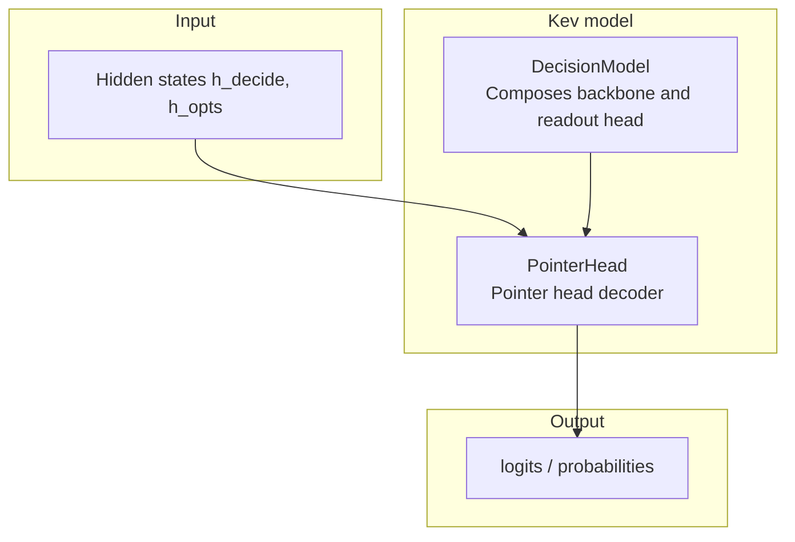
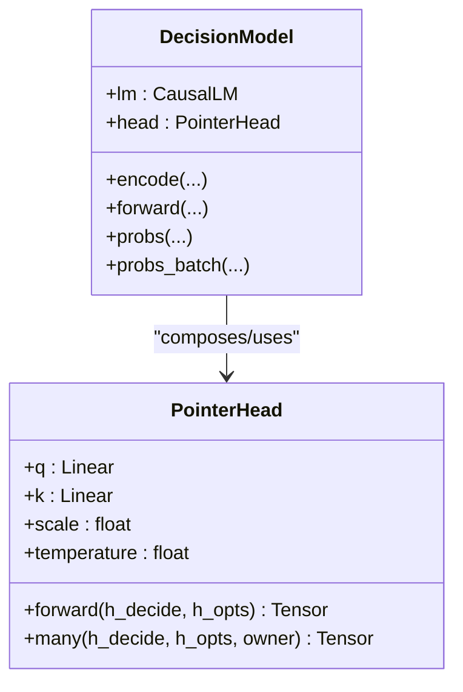
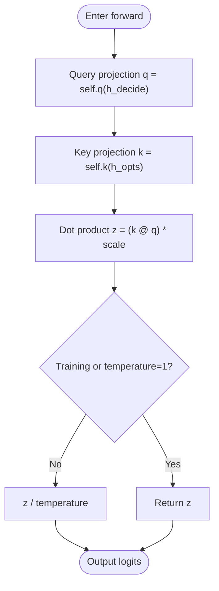
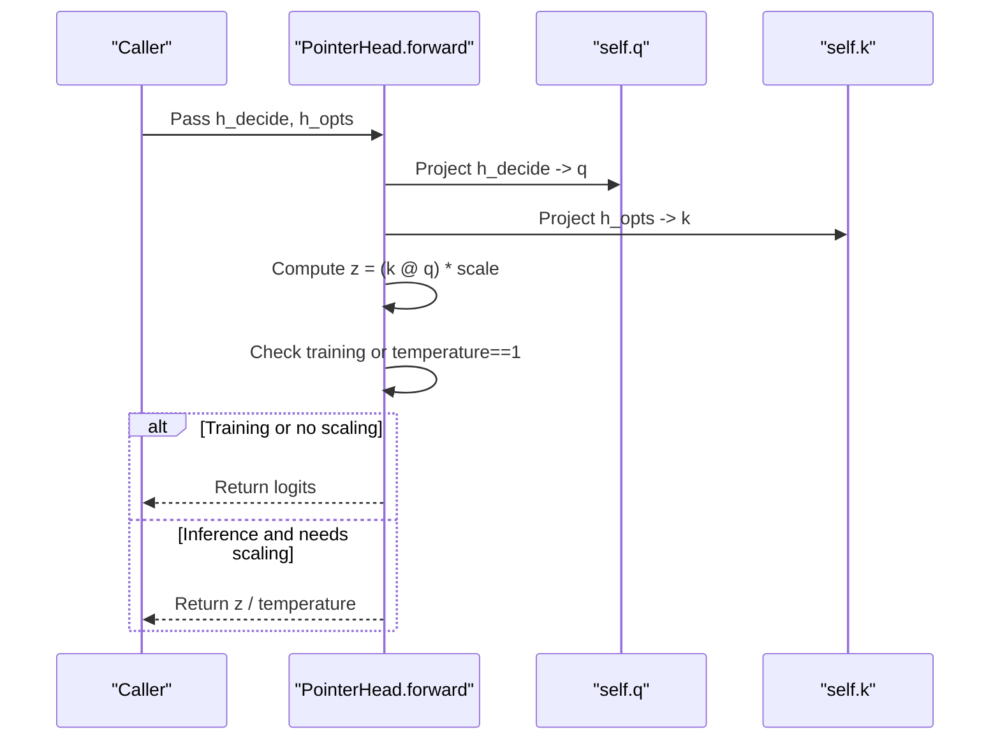
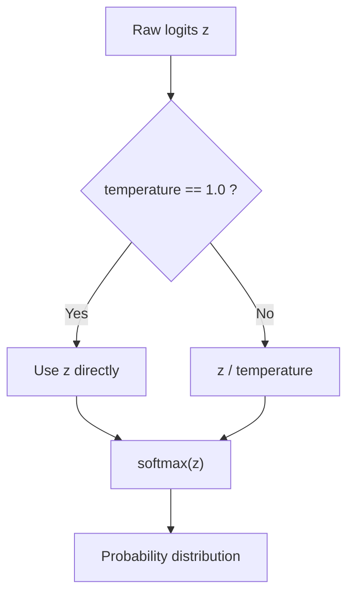
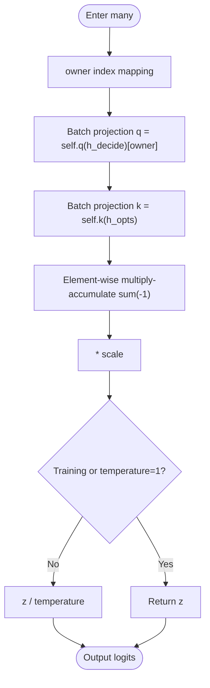
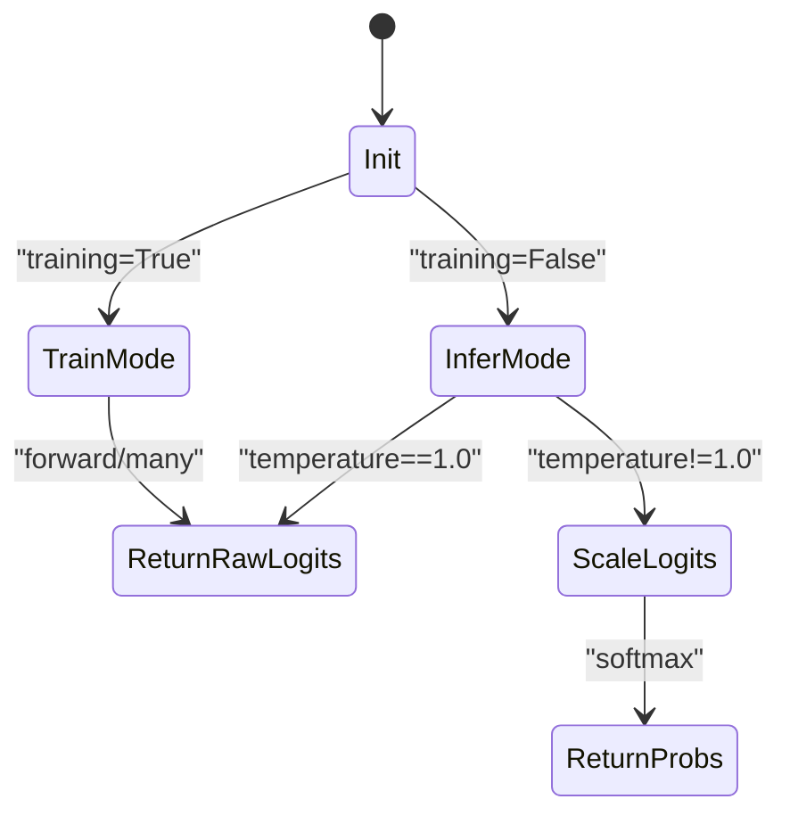
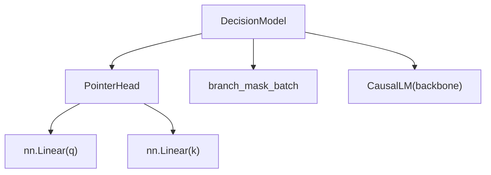

## Table of Contents
1. [Introduction](#introduction)
2. [Project Structure Positioning](#project-structure-positioning)
3. [Core Components](#core-components)
4. [Architecture Overview](#architecture-overview)
5. [Detailed Component Analysis](#detailed-component-analysis)
6. [Dependency Analysis](#dependency-analysis)
7. [Performance and Extension Suggestions](#performance-and-extension-suggestions)
8. [Troubleshooting Guide](#troubleshooting-guide)
9. [Conclusion](#conclusion)

## Introduction
This document focuses on the "pointer head decoder" (PointerHead) in the Kev decision model, explaining how it selects the best answer among several option representations via query-key dot product, and describing the behavioral differences between training and inference modes, the role of the temperature parameter, and how the many() method efficiently batch-processes the options of multiple questions. The document also provides a numerical computation example from hidden states to final probabilities, helping beginners understand the decoder concept and offering experts extension methods and performance tuning suggestions.

## Project Structure Positioning
PointerHead is the core readout head module of the Kev decision model, located in the model definition file and composed by DecisionModel. It receives hidden states from the backbone network, performs attention scoring among several candidate options for each question, outputs logits, and optionally applies temperature scaling at inference time to calibrate confidence.

Chart Sources
- [model.py:205-223](file://kev/model.py#L205-L223)
- [model.py:243-278](file://kev/model.py#L243-L278)

Section Sources
- [model.py:205-223](file://kev/model.py#L205-L223)
- [model.py:243-278](file://kev/model.py#L243-L278)

## Core Components
- PointerHead: implements the option selection logic based on query-key dot product, supporting both single-question forward() and multi-question many() calls; includes a temperature parameter for inference-time probability calibration.
- DecisionModel: composes the Transformer backbone and PointerHead, responsible for encoding, mask construction, forward propagation, probability computation, and the batching serving interface.

Section Sources
- [model.py:205-223](file://kev/model.py#L205-L223)
- [model.py:243-278](file://kev/model.py#L243-L278)

## Architecture Overview
PointerHead's design follows the "query-key dot product" selection paradigm:
- Use the hidden state at the `<decide>` position as the query vector q.
- Use all options' hidden states as key vectors k.
- After linear projection, perform a dot product to obtain each option's raw score (logits).
- In training mode, return logits directly; in inference mode, scale logits by temperature and then apply softmax to obtain probabilities.

Chart Sources
- [model.py:205-223](file://kev/model.py#L205-L223)
- [model.py:243-278](file://kev/model.py#L243-L278)

## Detailed Component Analysis

### PointerHead Design Principle
PointerHead maps hidden states to the pointer dimension dp via two linear layers:
- q = self.q(h_decide): projects the hidden state at the `<decide>` position into the query vector.
- k = self.k(h_opts): projects all options' hidden states into a set of key vectors.
- Dot product z = (k @ q) * scale: computes each option's relevance score to the query, scale = 1/sqrt(dp) to stabilize gradients.

Chart Sources
- [model.py:205-218](file://kev/model.py#L205-L218)

Section Sources
- [model.py:205-218](file://kev/model.py#L205-L218)

### forward() Method Details
forward(h_decide, h_opts) inputs and outputs:
- h_decide: shape [d], corresponding to the hidden state at the `<decide>` position.
- h_opts: shape [K, d], corresponding to the hidden states of the K options of the i-th question.
- Output: logits of shape [K], representing each option's unnormalized score.

Internal steps:
1. Project h_decide into q.
2. Project h_opts into k.
3. Compute the dot product and multiply by the scaling factor.
4. If in training mode or temperature=1.0, return logits directly; otherwise return the scaled logits.

Chart Sources
- [model.py:216-218](file://kev/model.py#L216-L218)

Section Sources
- [model.py:216-218](file://kev/model.py#L216-L218)

### Role of the temperature Parameter
The temperature is used for inference-time probability calibration:
- When temperature > 1.0, logits are shrunk, the probability distribution becomes smoother, reducing extreme confidence.
- When temperature < 1.0, logits are amplified, the probability distribution becomes sharper, improving discriminability.
- In training mode, raw logits are always used (temperature does not participate), to ensure the stability of loss computation.
- In inference mode, if temperature != 1.0, scale the logits first and then apply softmax.

Chart Sources
- [model.py:211-214](file://kev/model.py#L211-L214)
- [model.py:216-218](file://kev/model.py#L216-L218)

Section Sources
- [model.py:211-214](file://kev/model.py#L211-L214)
- [model.py:216-218](file://kev/model.py#L216-L218)

### many() Method: Efficient Batch Processing
many(h_decide, h_opts, owner) processes multiple questions' options in one call, reducing redundant computation:
- h_decide: shape [Q, d], the `<decide>` position hidden state of each question.
- h_opts: shape [sum(K), d], all questions' option hidden states concatenated.
- owner: shape [sum(K)], indicating which question each option belongs to.
- Output: logits of shape [sum(K)], arranged in question order.

Internal optimizations:
- Avoid per-question loops, using matrix multiplication and index aggregation.
- Use owner to aggregate different questions' option results back into a unified tensor.
- Also supports temperature scaling.

Chart Sources
- [model.py:220-223](file://kev/model.py#L220-L223)

Section Sources
- [model.py:220-223](file://kev/model.py#L220-L223)

### Behavioral Differences Between Training and Inference Modes
- Training mode:
  - forward() and many() both return raw logits, without temperature scaling.
  - Facilitates direct optimization by loss functions such as cross-entropy.
- Inference mode:
  - If temperature != 1.0, scale logits first and then apply softmax to obtain probabilities.
  - Helps improve confidence estimation, making predictions more reliable.

Chart Sources
- [model.py:211-214](file://kev/model.py#L211-L214)
- [model.py:216-223](file://kev/model.py#L216-L223)

Section Sources
- [model.py:211-214](file://kev/model.py#L211-L214)
- [model.py:216-223](file://kev/model.py#L216-L223)

### Numerical Computation Example
Assume the following simplified values (for illustration only):
- h_decide = [1.0, 2.0]
- h_opts = [[0.5, 1.0], [-0.5, 0.5], [1.0, -0.5]]
- dp = 2 (for simplicity; actual dp is usually larger)
- q = W_q @ h_decide
- k = W_k @ h_opts
- z = (k @ q) * scale

Steps:
1. Projection: q is [dp], k is [K, dp].
2. Dot product: z_i = k_i · q, i=1..K.
3. Scaling: z *= 1/sqrt(dp).
4. Inference-time scaling: if temperature=0.8, then z' = z / 0.8.
5. Probability: p_i = exp(z'_i) / sum(exp(z'_j)).

Note: the above is only a conceptual demonstration; the actual dimensions and weights are determined by model initialization.

Section Sources
- [model.py:205-218](file://kev/model.py#L205-L218)

## Dependency Analysis
PointerHead relies on torch.nn.Linear for linear projection and uses PyTorch tensor operations to complete dot product and summation. DecisionModel is responsible for:
- Building the block-causal mask, ensuring correct attention among options.
- Managing hidden state extraction and readout.
- Providing serving interfaces such as probs/probs_batch, integrating PointerHead's output.

Chart Sources
- [model.py:205-223](file://kev/model.py#L205-L223)
- [model.py:243-278](file://kev/model.py#L243-L278)
- [model.py:154-185](file://kev/model.py#L154-L185)

Section Sources
- [model.py:205-223](file://kev/model.py#L205-L223)
- [model.py:243-278](file://kev/model.py#L243-L278)
- [model.py:154-185](file://kev/model.py#L154-L185)

## Performance and Extension Suggestions
- Batch optimization:
  - Prefer many() for multi-question option processing, reducing Python-layer loop overhead.
  - In inference serving, combine probs_batch with CUDA Graphs (where applicable) to further improve throughput.
- Temperature calibration:
  - Adjust temperature based on validation-set performance, balancing confidence and accuracy.
  - Keep temperature=1.0 during training to avoid affecting gradient updates.
- Extension directions:
  - A learnable temperature parameter could be introduced, but training/inference consistency must be considered.
  - Consider adding gating or residual connections to h_decide or h_opts to enhance expressiveness.
  - For long-context scenarios, optimize the memory layout and indexing strategy of h_opts.

[This section provides general guidance and does not directly analyze specific code files]

## Troubleshooting Guide
- Dimension mismatch:
  - Check whether the dimensions of h_decide and h_opts match [d] and [K, d].
  - In many(), confirm that the owner length matches the row count of h_opts.
- Temperature anomaly:
  - If inference probabilities are too flat or too sharp, check whether the temperature setting is reasonable.
  - Confirm that temperature participates in scaling in inference mode.
- Mask error:
  - Ensure the block-causal mask is correctly built, avoiding erroneous attention across questions or options.

Section Sources
- [model.py:205-223](file://kev/model.py#L205-L223)
- [model.py:154-185](file://kev/model.py#L154-L185)

## Conclusion
As the pointer head decoder of the Kev decision model, PointerHead achieves precise answer selection in multi-option scenarios through a concise and efficient query-key dot product mechanism. Its forward() and many() methods satisfy single-question and batch processing needs respectively, and the temperature parameter provides flexible control over inference-time probability calibration. Combined with DecisionModel's complete pipeline, this decoder exhibits stable and scalable performance in both training and inference modes, suitable for further extension and optimization to meet diverse application scenarios.

[This section is a summary and does not directly analyze specific code files]
