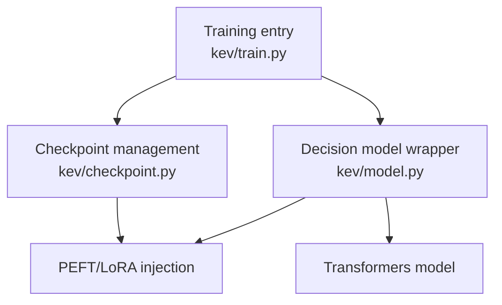
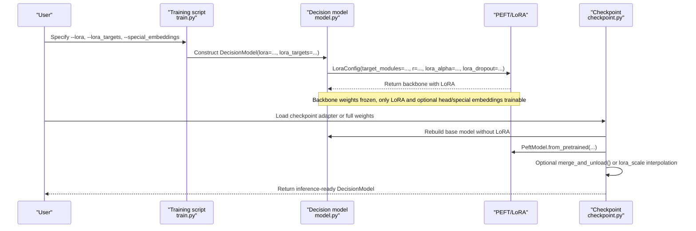
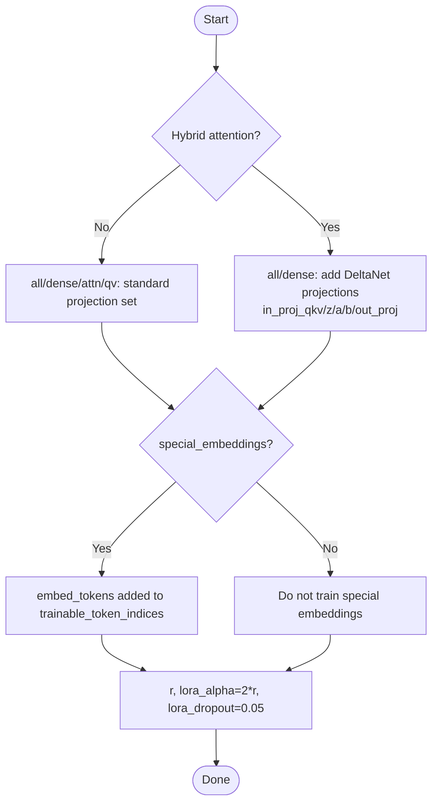
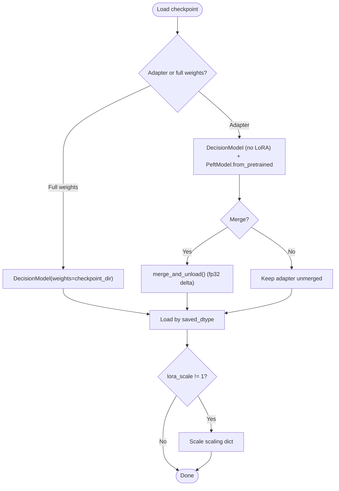
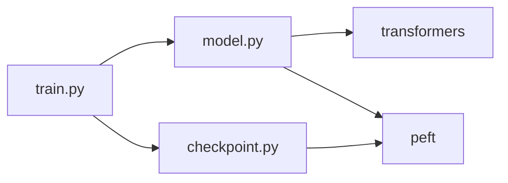

## Table of Contents
1. [Introduction](#introduction)
2. [Project Structure](#project-structure)
3. [Core Components](#core-components)
4. [Architecture Overview](#architecture-overview)
5. [Detailed Component Analysis](#detailed-component-analysis)
6. [Dependency Analysis](#dependency-analysis)
7. [Performance and Memory Characteristics](#performance-and-memory-characteristics)
8. [Fine-Tuning Flow Example](#fine-tuning-flow-example)
9. [Troubleshooting Guide](#troubleshooting-guide)
10. [Conclusion](#conclusion)

## Introduction
This document systematically reviews the implementation and usage of the Low-Rank Adaptation (LoRA) adapter in Kev. Kev uses the PEFT library to inject trainable low-rank matrices into a pretrained language model while keeping the backbone weights frozen; it also supports multiple target module strategies (dense, attn, qv, etc.) and special handling for hybrid attention models (Gated DeltaNet). The document also covers the trainability of special token embeddings, the LoRA parameter initialization strategy and its performance impact, and provides the complete fine-tuning flow from data preparation to weight merging, along with principle explanations for beginners and hyperparameter tuning and troubleshooting advice for experts.

## Project Structure
The code central to LoRA is concentrated in three files:
- kev/train.py: training entry, command-line arguments, training loop, LoRA-related options (e.g., lora_targets, special_embeddings).
- kev/model.py: decision model wrapper, PEFT/LoRA injection logic, hybrid attention detection, special token embedding trainability configuration.
- kev/checkpoint.py: checkpoint loading, LoRA adapter vs full-weight discrimination, weight merging, lora_scale interpolation, warm start.

Chart Sources
- [train.py:370-485](file://kev/train.py#L370-L485)
- [model.py:243-276](file://kev/model.py#L243-L276)
- [checkpoint.py:168-308](file://kev/checkpoint.py#L168-L308)

Section Sources
- [train.py:370-485](file://kev/train.py#L370-L485)
- [model.py:243-276](file://kev/model.py#L243-L276)
- [checkpoint.py:168-308](file://kev/checkpoint.py#L168-L308)

## Core Components
- Training script and parameters
  - Provides key parameters such as --lora, --lora_targets, --special_embeddings, --weights_dtype, controlling the LoRA rank, target module set, whether to train special separator embeddings, and the backbone weight precision.
- Decision model wrapper
  - At construction, selects the target modules to inject LoRA based on lora_targets; for hybrid attention models, additionally includes Gated DeltaNet projection names; when special_embeddings is enabled, adds the special separator token indices to trainable_token_indices.
- Checkpoint and inference loading
  - Automatically determines whether it is a LoRA adapter or full-weight checkpoint; supports merging LoRA, interpolating by lora_scale, and compatible loading and merging strategies on a bf16 backbone.

Section Sources
- [train.py:370-485](file://kev/train.py#L370-L485)
- [model.py:243-276](file://kev/model.py#L243-L276)
- [checkpoint.py:168-308](file://kev/checkpoint.py#L168-L308)

## Architecture Overview
The following diagram shows the overall LoRA workflow in Kev: during training, LoRA is injected via DecisionModel; during inference, it is loaded via Checkpoint and the adapter can optionally be merged.

Chart Sources
- [train.py:523-563](file://kev/train.py#L523-L563)
- [model.py:243-276](file://kev/model.py#L243-L276)
- [checkpoint.py:287-308](file://kev/checkpoint.py#L287-L308)

## Detailed Component Analysis

### LoRA Injection and Target Module Strategy
- Target module mapping
  - all/dense: by default includes q_proj/k_proj/v_proj/o_proj/gate_proj/up_proj/down_proj.
  - attn: only attention layers q_proj/k_proj/v_proj/o_proj.
  - qv: only q_proj/v_proj.
- Special handling for hybrid attention models (Gated DeltaNet)
  - When a hybrid attention model (is_hybrid) is detected and lora_targets is all or attn, additionally append in_proj_qkv/in_proj_z/in_proj_a/in_proj_b/out_proj, ensuring the DeltaNet layer's specific projections are also LoRA-adapted.
- Special token embedding trainability
  - When special_embeddings=True, the indices of the special separator tokens are written into trainable_token_indices, enabling these embeddings to participate in training.
- LoRA parameter initialization
  - r: LoRA rank, passed via --lora.
  - lora_alpha: fixed at 2 * r.
  - lora_dropout: fixed at 0.05.
  - task_type: FEATURE_EXTRACTION (for downstream classification/pointer head).

Chart Sources
- [model.py:265-276](file://kev/model.py#L265-L276)

Section Sources
- [model.py:243-276](file://kev/model.py#L243-L276)

### Hybrid Attention Model Detection and Row-Form Inference
- is_hybrid(config) determines whether it is a hybrid attention model (Qwen3.5) by checking whether layer_types contains linear_attention.
- Hybrid attention cannot honor the block-causal mask, so inference uses the "row form" (each question as an independent causal row), ensuring numerical consistency with the packed form.
- During training, a shared state prefix can be shared on the hybrid backbone via shared_prefix, reducing redundant computation.

Section Sources
- [model.py:69-73](file://kev/model.py#L69-L73)
- [model.py:329-383](file://kev/model.py#L329-L383)

### Checkpoint Loading, Merging, and Interpolation
- Automatic discrimination
  - Presence of adapter_config.json -> LoRA adapter; otherwise, presence of config.json + model*.safetensors -> full weights.
- Merging strategy
  - Torch path: PeftModel.from_pretrained loads the adapter; if opts.merge is true and special token embeddings were not trained, call merge_and_unload() to add the delta back into the backbone at fp32 precision, then cast back to the target dtype.
  - MLX path: always merges the adapter; full weights are loaded directly without merging.
- lora_scale interpolation
  - At inference, WiSE-FT-style interpolation of the adapter scaling can be performed (base=0, fine-tuned=1), valid only on the adapter path.
- bf16 backbone compatibility
  - When weights_dtype=bf16, the Torch path loads the backbone in bf16; if a fused serving path is required, the adapter is merged; otherwise it remains unmerged to keep the exact path consistent.

Chart Sources
- [checkpoint.py:180-200](file://kev/checkpoint.py#L180-L200)
- [checkpoint.py:287-308](file://kev/checkpoint.py#L287-L308)

Section Sources
- [checkpoint.py:168-308](file://kev/checkpoint.py#L168-L308)

### Training Loop and Optimizer Grouping
- Trainable parameter grouping
  - LoRA parameters and the pointer head use separate learning rates (head_lr can be 0 to match the backbone).
- Gradient clipping and scheduling
  - A unified global gradient norm cap; OneCycleLR scheduler.
- Data and batch planning
  - Supports memory optimization strategies such as length_sort, pass_tokens_max, row_budget, avoiding out-of-memory from long sequences.

Section Sources
- [train.py:575-635](file://kev/train.py#L575-L635)

## Dependency Analysis
- External dependencies
  - transformers: AutoModel/AutoTokenizer to load the base model and tokenizer.
  - peft: LoraConfig/get_peft_model/PeftModel for LoRA injection and loading.
- Internal coupling
  - train.py depends on model.py's DecisionModel and utility functions (encode, rows_of, training_context).
  - checkpoint.py depends on model.py's is_hybrid, load_tokenizer, pad_id, etc.

Chart Sources
- [train.py:17-24](file://kev/train.py#L17-L24)
- [model.py:3-8](file://kev/model.py#L3-L8)
- [checkpoint.py:26-28](file://kev/checkpoint.py#L26-L28)

Section Sources
- [train.py:17-24](file://kev/train.py#L17-L24)
- [model.py:3-8](file://kev/model.py#L3-L8)
- [checkpoint.py:26-28](file://kev/checkpoint.py#L26-L28)

## Performance and Memory Characteristics
- Backbone weight precision
  - --weights_dtype bf16 reduces memory footprint, but LoRA and head remain fp32 (PEFT upcasts adapters).
- Inference backend
  - Torch SDPA (CUDA) or eager (MPS/CPU); the MLX backend suits hybrid attention and is faster on MPS.
- Merging and interpolation
  - Merging LoRA reduces extra computation at inference; lora_scale interpolates between base and fine-tuned weights, balancing generalization and overfitting.
- Row form vs packed form
  - Hybrid attention must use row form; attention-only models also switch to row form when exceeding ROW_PASS_TOKENS to avoid O(L^2) mask overhead.

Section Sources
- [train.py:391-393](file://kev/train.py#L391-L393)
- [model.py:329-333](file://kev/model.py#L329-L333)
- [checkpoint.py:88-118](file://kev/checkpoint.py#L88-L118)

## Fine-Tuning Flow Example
The following is the end-to-end LoRA fine-tuning procedure (without specific command content, flow only):
1. Prepare data
   - Use suite partitions or custom JSONL data; if necessary, mix in a small amount of the original recipe data via replay to mitigate forgetting.
2. Select a LoRA strategy
   - Choose --lora_targets (all/dense/attn/qv) based on the task and backbone type; for hybrid attention, dense or all is recommended (DeltaNet projections are automatically included).
3. Decide whether to train special separator embeddings
   - If you need the separator semantics to change with the task, enable --special_embeddings.
4. Set LoRA hyperparameters
   - --lora controls the rank; lora_alpha is fixed at 2*r; lora_dropout is fixed at 0.05.
5. Run training
   - Specify the --out output directory; for full fine-tuning, use --full_ft 1 with --weights_dtype bf16.
6. Save and evaluate
   - After training, save the adapter and head.pt; use Checkpoint.load to load and perform inference or evaluation.
7. Weight merging (optional)
   - At inference, you can choose to merge LoRA (KEV_MERGE=1) for more stable, faster inference; if special token embeddings were trained, keep it unmerged.

Section Sources
- [train.py:370-485](file://kev/train.py#L370-L485)
- [train.py:523-563](file://kev/train.py#L523-L563)
- [checkpoint.py:287-308](file://kev/checkpoint.py#L287-L308)

## Troubleshooting Guide
- Adapter vs full-weight confusion
  - Symptom: weights inconsistency reported at load time.
  - Investigation: confirm whether adapter_config.json or config.json + model*.safetensors exist in the directory; check the weights field in head.pt.
- Merge behavior under bf16 backbone
  - Symptom: inference results differ slightly from expectations.
  - Cause: under a bf16 backbone, if the fused serving path is not enabled, the adapter stays unmerged; it is merged only when fused is enabled.
- lora_scale interpolation ineffective
  - Symptom: no effect observed after setting KEV_LORA_SCALE.
  - Cause: full-weight checkpoints do not support interpolation; only the adapter path is valid.
- Hybrid attention and option_isolation
  - Symptom: an error stating option_isolation is unavailable.
  - Cause: hybrid attention cannot use the packed mask, and option_isolation depends on it, so it is rejected.
- Special token embeddings prevent merging
  - Symptom: the adapter is not merged even when merge is set.
  - Cause: when the adapter contains trainable_token_indices, it is forcibly kept unmerged to guarantee semantic consistency.

Section Sources
- [checkpoint.py:180-200](file://kev/checkpoint.py#L180-L200)
- [checkpoint.py:287-308](file://kev/checkpoint.py#L287-L308)
- [model.py:265-276](file://kev/model.py#L265-L276)

## Conclusion
Kev's LoRA adapter implementation centers on PEFT: while keeping the pretrained backbone frozen, it flexibly injects low-rank matrices, and—through multiple target module strategies and special hybrid attention handling—balances generality and performance. The training side offers rich memory optimization options, and the inference side supports merging and interpolation, facilitating stable results across deployment scenarios. For beginners, it is recommended to start with the dense strategy and default LoRA parameters; for experts, adjust lora_targets, lora_scale, and backend choice according to task characteristics, and use strategies such as length_sort/pass_tokens_max to optimize resource utilization.
