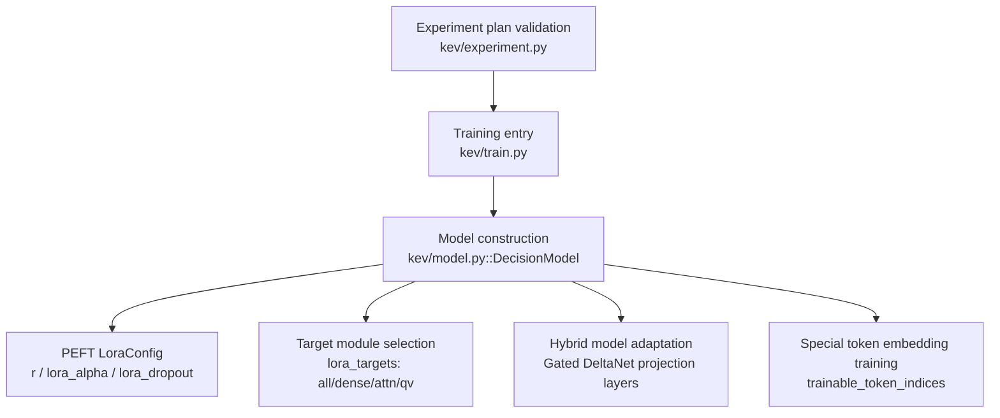
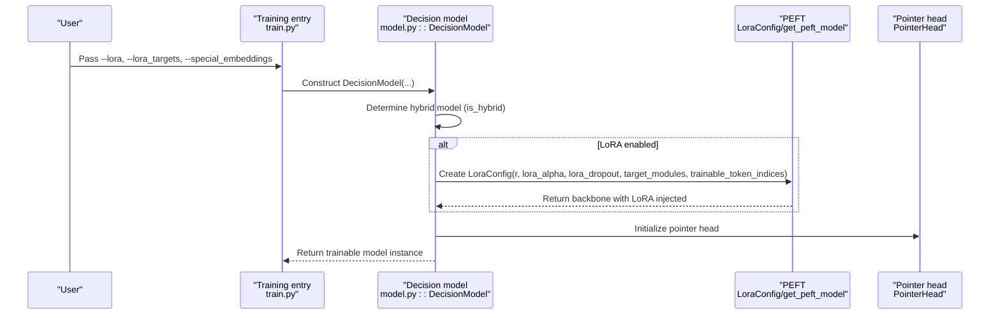
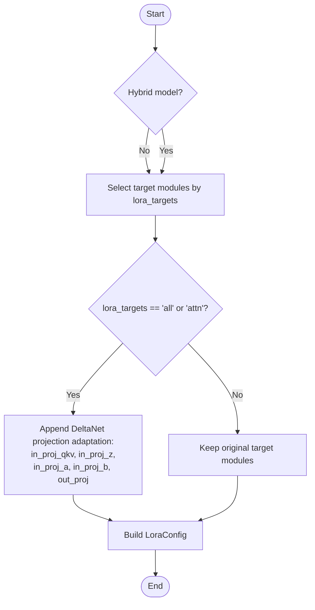
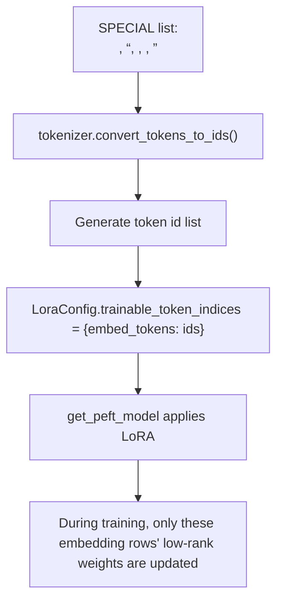
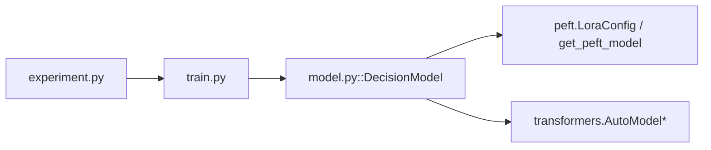

## Table of Contents
1. [Introduction](#introduction)
2. [Project Structure](#project-structure)
3. [Core Components](#core-components)
4. [Architecture Overview](#architecture-overview)
5. [Detailed Component Analysis](#detailed-component-analysis)
6. [Dependency Analysis](#dependency-analysis)
7. [Performance and Tuning Suggestions](#performance-and-tuning-suggestions)
8. [Troubleshooting Guide](#troubleshooting-guide)
9. [Conclusion](#conclusion)
10. [Appendix: LoRA Fundamentals](#appendix-lora-fundamentals)

## Introduction
This document covers Kev's LoRA configuration management system, systematically explaining the following topics:
- How the lora_targets parameter determines the adaptation strategy (all, dense, attn, qv) and its impact on model performance.
- Special handling for hybrid attention models (Gated DeltaNet): automatically detecting and appending projection-layer adaptation (in_proj_qkv, in_proj_z, in_proj_a, in_proj_b).
- The trainable_token_indices mechanism: how to make the embeddings of special separators participate in training, including the SPECIAL token list and ID mapping process.
- Default values and tuning suggestions for the key PEFT LoraConfig hyperparameters r, lora_alpha, lora_dropout.
- Model initialization flow description under different configurations, plus beginner onboarding and expert-level optimization/troubleshooting guides.

## Project Structure
The code directly related to LoRA configuration in Kev is concentrated in three files:
- kev/model.py: defines the decision model DecisionModel, encapsulating LoRA injection, hybrid model detection, special token embedding training switch, etc.
- kev/train.py: training entry and command-line arguments, including options such as lora, lora_targets, special_embeddings.
- kev/experiment.py: experiment plan validator, constraining the tunable LoRA-related hyperparameter ranges and value sets.

Chart Sources
- [train.py:370-439](file://kev/train.py#L370-L439)
- [model.py:243-276](file://kev/model.py#L243-L276)
- [experiment.py:47-49](file://kev/experiment.py#L47-L49)

Section Sources
- [train.py:370-439](file://kev/train.py#L370-L439)
- [model.py:243-276](file://kev/model.py#L243-L276)
- [experiment.py:47-49](file://kev/experiment.py#L47-L49)

## Core Components
- DecisionModel: encapsulates base model loading, LoRA injection, pointer head, inference cache, etc.; the key place where LoRA configuration takes effect.
- LoraConfig: from PEFT, used to declare the LoRA rank, scaling factor, dropout rate, target modules, and trainable token indices.
- Training parameters: --lora, --lora_targets, --special_embeddings, etc., exposed to users via train.py.
- Experiment plan: experiment.py restricts the valid choices for lora_targets to all, dense, attn, qv, and provides default values.

Section Sources
- [model.py:243-276](file://kev/model.py#L243-L276)
- [train.py:370-439](file://kev/train.py#L370-L439)
- [experiment.py:47-49](file://kev/experiment.py#L47-L49)

## Architecture Overview
The following diagram shows the overall flow from the training entry to LoRA configuration injection:

Chart Sources
- [train.py:523-544](file://kev/train.py#L523-L544)
- [model.py:243-276](file://kev/model.py#L243-L276)

## Detailed Component Analysis

### lora_targets Adaptation Strategy and Impact
lora_targets controls the target module set for LoRA, directly affecting the scale of trainable parameters, transferability, and overfitting risk.

- all: applies LoRA to all attention and MLP projection layers, covering q_proj, k_proj, v_proj, o_proj, gate_proj, up_proj, down_proj.
- dense: same target set as all, but on hybrid models it excludes the DeltaNet projection layers, avoiding LoRA adaptation of the recurrent attention.
- attn: applies LoRA only to attention projection layers q_proj, k_proj, v_proj, o_proj.
- qv: applies LoRA only to q_proj, v_proj, further reducing parameters.

In the hybrid model (Gated DeltaNet) scenario, if lora_targets is all or attn, the system automatically appends adaptation for the DeltaNet projection layers: in_proj_qkv, in_proj_z, in_proj_a, in_proj_b, and out_proj. This ensures the critical paths of hybrid attention can also be LoRA fine-tuned.

Chart Sources
- [model.py:265-275](file://kev/model.py#L265-L275)

Section Sources
- [model.py:265-275](file://kev/model.py#L265-L275)
- [train.py:398-398](file://kev/train.py#L398-L398)
- [experiment.py:47-49](file://kev/experiment.py#L47-L49)

### Special Handling Logic for Hybrid Attention Models
The hybrid model is determined by is_hybrid(config), based on whether the configuration contains a linear attention type (e.g., Qwen3.5's Gated DeltaNet). When a hybrid model is detected and lora_targets is all or attn, the system automatically appends the following projection layer names to LoRA adaptation:
- in_proj_qkv
- in_proj_z
- in_proj_a
- in_proj_b
- out_proj

This logic ensures the critical transformation paths of hybrid attention also possess low-rank update capability, thereby allowing the DeltaNet recurrent state to be more fully fine-tuned while preserving the block-causal mask constraint.

Section Sources
- [model.py:69-73](file://kev/model.py#L69-L73)
- [model.py:265-275](file://kev/model.py#L265-L275)

### trainable_token_indices Mechanism and SPECIAL Token
When special_embeddings=True, the system adds the embeddings of 5 special separator tokens into the LoRA trainable set. The SPECIAL list is defined as:
- "<state>"
- "<q>"
- "<opt>"
- "</opt>"
- "<decide>"

These tokens are used as structured separators during encoding, distinguishing state, question instructions, option boundaries, and decision markers. By mapping their token ids to trainable_token_indices.embed_tokens, LoRA can adjust the embedding representation of these separators, allowing the model to better learn task-specific separation semantics.

ID mapping process:
- Use tokenizer.convert_tokens_to_ids(t) to convert each SPECIAL token into its corresponding integer id.
- Put these ids into a `{"embed_tokens": [id_1, id_2, ...]}` structure as the value of LoraConfig.trainable_token_indices.
- Finally, when get_peft_model applies LoRA, only these embedding rows receive low-rank updates.

Chart Sources
- [model.py:9-11](file://kev/model.py#L9-L11)
- [model.py:265-275](file://kev/model.py#L265-L275)

Section Sources
- [model.py:9-11](file://kev/model.py#L9-L11)
- [model.py:265-275](file://kev/model.py#L265-L275)

### PEFT LoraConfig Hyperparameters and Defaults
- r (rank): passed via --lora, default 16. It controls the dimension of the low-rank matrices; larger means stronger expressiveness but more parameters.
- lora_alpha (scaling factor): default 2 * lora, i.e., 32 (when r=16). Together with r it determines the scale of the LoRA update.
- lora_dropout (dropout rate): fixed at 0.05, used to regularize the LoRA branch and prevent overfitting.
- task_type: fixed at FEATURE_EXTRACTION, because Kev does not generate text but extracts hidden representations for the decision head.
- target_modules: determined by lora_targets, see "Adaptation Strategy" above.
- trainable_token_indices: enabled when special_embeddings=True, see "SPECIAL token mechanism" above.

Section Sources
- [model.py:265-275](file://kev/model.py#L265-L275)
- [train.py:377-378](file://kev/train.py#L377-L378)
- [train.py:396-398](file://kev/train.py#L396-L398)

### Model Initialization Flow Example (by configuration)
The following describes the initialization points under different configurations (without directly showing code, only providing path references):

- Full LoRA (all):
  - Set --lora 16 --lora_targets all
  - DecisionModel injects LoRA into q_proj/k_proj/v_proj/o_proj/gate_proj/up_proj/down_proj
  - If hybrid, automatically appends DeltaNet projection layer adaptation
  - Reference paths: [model.py:265-275](file://kev/model.py#L265-L275), [train.py:542-544](file://kev/train.py#L542-L544)

- Attention-only LoRA (attn):
  - Set --lora 16 --lora_targets attn
  - Inject LoRA only into q_proj/k_proj/v_proj/o_proj
  - If hybrid, automatically appends DeltaNet projection layer adaptation
  - Reference paths: [model.py:265-275](file://kev/model.py#L265-L275), [train.py:542-544](file://kev/train.py#L542-L544)

- Q/V projection-only LoRA (qv):
  - Set --lora 16 --lora_targets qv
  - Inject LoRA only into q_proj/v_proj
  - Hybrid model will not append DeltaNet projection layers (since lora_targets is not all/attn)
  - Reference paths: [model.py:265-275](file://kev/model.py#L265-L275), [train.py:542-544](file://kev/train.py#L542-L544)

- Enable special token embedding training:
  - Set --special_embeddings 1
  - Add the 5 SPECIAL tokens' embedding rows into the LoRA trainable set
  - Reference paths: [model.py:9-11](file://kev/model.py#L9-L11), [model.py:265-275](file://kev/model.py#L265-L275), [train.py:396-396](file://kev/train.py#L396-L396)

Section Sources
- [model.py:265-275](file://kev/model.py#L265-L275)
- [train.py:396-398](file://kev/train.py#L396-L398)
- [train.py:542-544](file://kev/train.py#L542-L544)

## Dependency Analysis
- train.py parses the command-line arguments and passes lora, lora_targets, special_embeddings, etc. to DecisionModel.
- model.py internally depends on transformers.AutoModel/AutoModelForCausalLM to load the base model and uses peft.LoraConfig and get_peft_model to inject LoRA.
- experiment.py provides whitelist validation for experiment plans, ensuring lora_targets can only be all, dense, attn, qv, and providing default values.

Chart Sources
- [train.py:523-544](file://kev/train.py#L523-L544)
- [model.py:243-276](file://kev/model.py#L243-L276)
- [experiment.py:47-49](file://kev/experiment.py#L47-L49)

Section Sources
- [train.py:523-544](file://kev/train.py#L523-L544)
- [model.py:243-276](file://kev/model.py#L243-L276)
- [experiment.py:47-49](file://kev/experiment.py#L47-L49)

## Performance and Tuning Suggestions
- r (rank):
  - Default 16. A smaller r (e.g., 8) suits scenarios with limited data and prone to overfitting; a larger r (e.g., 32) suits tasks requiring stronger expressiveness, but increases memory and compute cost.
- lora_alpha (scaling factor):
  - Default 2 * r. Increasing alpha amplifies the LoRA update magnitude, helping fast convergence but potentially destroying pretrained knowledge; it is recommended to search jointly with lr.
- lora_dropout:
  - Fixed at 0.05. If obvious overfitting occurs, consider modestly increasing it without breaking the PEFT interface (verify downstream compatibility).
- lora_targets:
  - all: most parameters, strong transferability, but may introduce more drift.
  - dense: on hybrid models, excludes the DeltaNet projection layers, suitable for scenarios wishing to preserve recurrent attention stability.
  - attn: focuses on the attention path, usually balancing performance and parameter count.
  - qv: smallest parameter set, suitable for quick exploration or resource-constrained environments.
- special_embeddings:
  - Enable only when separator embeddings need to participate in training. In general tasks, disabling it reduces parameters and potential noise.

[This section provides general guidance and does not directly analyze specific files]

## Troubleshooting Guide
- Hybrid model errors on option_isolation:
  - Symptom: enabling option_isolation on a hybrid model throws an error.
  - Cause: hybrid models cannot support the option_isolation mode required by the packed mask.
  - Solution: disable option_isolation or use it on a non-hybrid model.
  - Reference paths: [model.py:259-264](file://kev/model.py#L259-L264)

- pass_tokens_max conflicts with attention-only backbone:
  - Symptom: enabling --pass_tokens_max on an attention-only backbone exits.
  - Cause: pass_tokens_max targets the compute cost of row form or shared prefix, while attention-only backbones run the packed mask and cannot measure it accurately.
  - Solution: use a hybrid model (Gated DeltaNet) or remove --pass_tokens_max.
  - Reference paths: [train.py:557-561](file://kev/train.py#L557-L561)

- full_ft and special_embeddings are mutually exclusive:
  - Symptom: error when full_ft=1 and special_embeddings=1.
  - Cause: full_ft trains bf16 weights; all embeddings already participate in training, so no extra special embedding training is needed.
  - Solution: disable special_embeddings or switch to LoRA.
  - Reference paths: [train.py:460-461](file://kev/train.py#L460-L461)

- lora_targets illegal value:
  - Symptom: lora_targets set in an experiment plan outside the allowed set.
  - Cause: experiment.py validates the CHOICES whitelist.
  - Solution: use only all, dense, attn, qv.
  - Reference paths: [experiment.py:47-49](file://kev/experiment.py#L47-L49)

Section Sources
- [model.py:259-264](file://kev/model.py#L259-L264)
- [train.py:460-461](file://kev/train.py#L460-L461)
- [train.py:557-561](file://kev/train.py#L557-L561)
- [experiment.py:47-49](file://kev/experiment.py#L47-L49)

## Conclusion
Kev's LoRA configuration system is centrally implemented in DecisionModel. It flexibly selects an adaptation strategy via lora_targets and automatically appends DeltaNet projection layer adaptation on hybrid models, ensuring critical paths can be low-rank updated. The trainable_token_indices mechanism allows special separator embeddings to participate in training, enhancing task-specific representations of structured tokens. PEFT LoraConfig's r, lora_alpha, lora_dropout provide a controllable hyperparameter space; together with parameter validation in train.py and experiment.py, they form a robust training pipeline. For beginners, start from attn or qv and gradually explore all/dense; for experts, finely tune r, alpha, dropout, and the target module set in light of task characteristics and resource constraints.

[This section is a summary and does not directly analyze specific files]

## Appendix: LoRA Fundamentals
- LoRA (Low-Rank Adaptation) adds low-rank matrices as a bypass to pretrained model weights, enabling efficient fine-tuning by training only a small number of parameters.
- r controls the rank of the low-rank matrices; larger means stronger expressiveness but more parameters.
- lora_alpha controls the scaling ratio of the LoRA update, often tuned together with r.
- lora_dropout randomly drops out the LoRA branch, improving generalization.
- target_modules specifies which layers LoRA applies to, commonly attention and MLP projection layers.
- trainable_token_indices allows low-rank updates to the embedding rows of specific tokens, commonly used for task-specific separators or special markers.

[This section is conceptual and does not directly analyze specific files]
