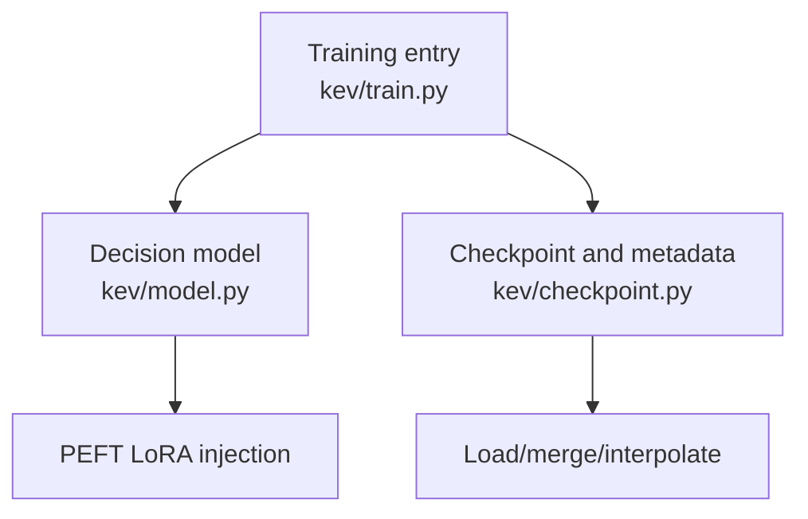
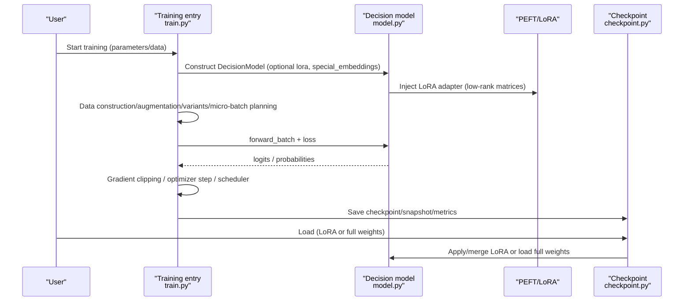
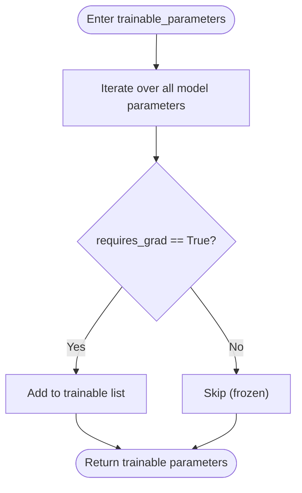
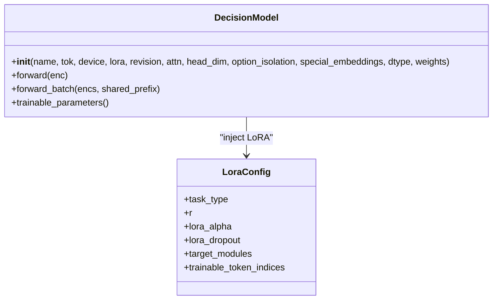
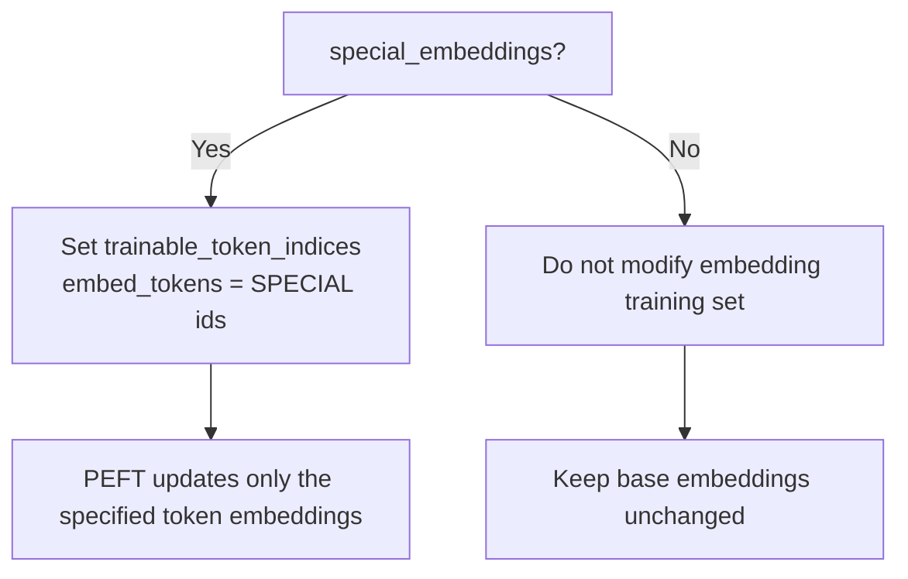
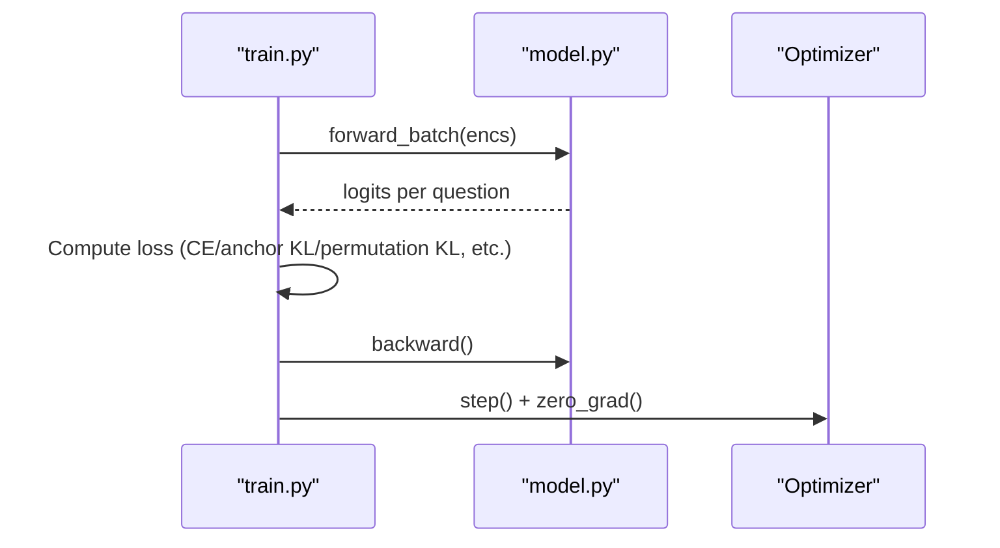
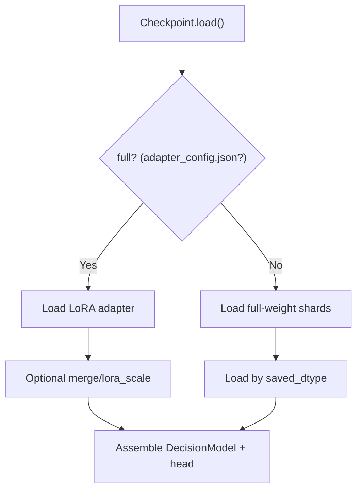
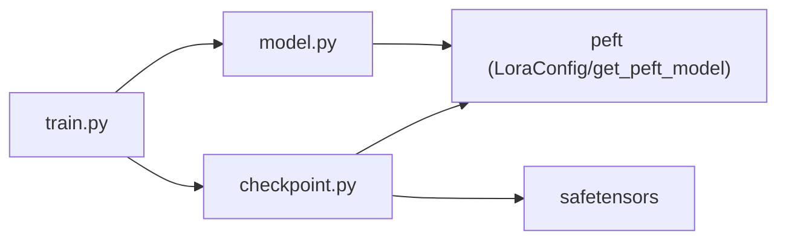

## Table of Contents
1. [Introduction](#introduction)
2. [Project Structure](#project-structure)
3. [Core Components](#core-components)
4. [Architecture Overview](#architecture-overview)
5. [Detailed Component Analysis](#detailed-component-analysis)
6. [Dependency Analysis](#dependency-analysis)
7. [Performance and Optimization](#performance-and-optimization)
8. [Troubleshooting](#troubleshooting)
9. [Conclusion](#conclusion)
10. [Appendix: Complete Training Example](#appendix-complete-training-example)

## Introduction
This document covers LoRA fine-tuning in Kev, systematically walking through the complete flow from data preparation to weight training, with emphasis on:
- The trainable parameter identification mechanism: how `trainable_parameters()` selects the parameters to update, and how the pretrained backbone is frozen.
- The special token embedding training strategy: how `special_embeddings` controls whether separator embeddings participate in training, and its impact on model behavior.
- Gradient flow during training: how the LoRA adapter and backbone network cooperate, and how gradients propagate through the low-rank matrices.
- Monitoring and checkpoint saving mechanisms.
- Environment setup guidance for beginners, and distributed training and performance optimization tips for experts.

## Project Structure
Kev's training entry point, model definition, and checkpoint loading reside in the following modules:
- `kev/train.py`: main training loop, data organization, loss computation, optimizer scheduling, checkpoint and snapshot writing.
- `kev/model.py`: decision model wrapper, LoRA injection, encoding/masking, forward and inference interfaces, trainable parameter exposure.
- `kev/checkpoint.py`: checkpoint metadata, LoRA/full-weight loading rules, merging and interpolation, warm start.

**Diagram Sources**
- [train.py:1-12](file://kev/train.py#L1-L12)
- [model.py:243-276](file://kev/model.py#L243-L276)
- [checkpoint.py:168-308](file://kev/checkpoint.py#L168-L308)

**Section Sources**
- [train.py:1-12](file://kev/train.py#L1-L12)
- [model.py:243-276](file://kev/model.py#L243-L276)
- [checkpoint.py:168-308](file://kev/checkpoint.py#L168-L308)

## Core Components
- Decision model `DecisionModel`: wraps the Transformer backbone, LoRA injection, pointer head (PointerHead), encoding and attention mask, forward and inference interfaces.
- Training pipeline: data construction/augmentation, variant generation, micro-batch planning, loss computation, gradient clipping, optimizer and scheduler, checkpoint and snapshot.
- Checkpoint system: loading, merging, and interpolation of LoRA adapters or full weights, temperature calibration, warm start.

**Section Sources**
- [model.py:205-276](file://kev/model.py#L205-L276)
- [train.py:370-485](file://kev/train.py#L370-L485)
- [checkpoint.py:47-80](file://kev/checkpoint.py#L47-L80)

## Architecture Overview
The following diagram shows the end-to-end flow of LoRA fine-tuning in Kev: data preparation → model assembly (with LoRA) → training loop → checkpoint/snapshot → inference loading.

**Diagram Sources**
- [train.py:523-675](file://kev/train.py#L523-L675)
- [model.py:243-276](file://kev/model.py#L243-L276)
- [checkpoint.py:227-308](file://kev/checkpoint.py#L227-L308)

## Detailed Component Analysis

### Trainable Parameter Identification and Freezing Mechanism
- `DecisionModel.trainable_parameters()` returns all parameters with `requires_grad=True`. By default, after the Transformer backbone is injected with LoRA via PEFT, only the LoRA modules are trainable; the remaining backbone parameters remain frozen.
- The pointer head `PointerHead` is always trainable and is grouped separately during training to support an independent learning rate.
- The training entry splits "non-head trainable parameters" and "head parameters" into two groups, passed to AdamW (or MasterAdamW for full fine-tuning) respectively.

**Diagram Sources**
- [model.py:507-508](file://kev/model.py#L507-L508)

**Section Sources**
- [model.py:507-508](file://kev/model.py#L507-L508)
- [train.py:575-579](file://kev/train.py#L575-L579)

### LoRA Injection and Target Module Selection
- When `lora > 0`, LoRA is injected using `peft.LoraConfig`.
- `lora_targets` controls the target module set:
  - `"all"`: includes attention and MLP projections, plus DeltaNet-related projections on hybrid backbones (Qwen3.5).
  - `"dense"`: excludes DeltaNet projections (used for ablation).
  - `"attn"`: only attention projections.
  - `"qv"`: only q_proj/v_proj.
- The LoRA rank is specified by `--lora`, alpha is fixed at `2 * r`, and dropout is 0.05.

**Diagram Sources**
- [model.py:243-276](file://kev/model.py#L243-L276)

**Section Sources**
- [model.py:243-276](file://kev/model.py#L243-L276)

### Special Token Embedding Training Strategy
- The separator token set `SPECIAL` includes `<state>`, `<q>`, `<opt>`, `</opt>`, `<decide>`.
- When `special_embeddings=True`, these separator embeddings are allowed to participate in training via `LoraConfig.trainable_token_indices`.
- For the LoRA path: only these token indices are marked as trainable in PEFT; for the full fine-tuning path, enabling `special_embeddings` simultaneously is not allowed (because full fine-tuning trains all embeddings).
- Impact: once enabled, the semantic representation of separators can drift with task-specific fine-tuning, thereby changing the model's understanding and response to instruction/option boundaries/decision markers.

**Diagram Sources**
- [model.py:9-11](file://kev/model.py#L9-L11)
- [model.py:265-275](file://kev/model.py#L265-L275)
- [train.py:395-396](file://kev/train.py#L395-L396)
- [train.py:459-461](file://kev/train.py#L459-L461)

**Section Sources**
- [model.py:9-11](file://kev/model.py#L9-L11)
- [model.py:265-275](file://kev/model.py#L265-L275)
- [train.py:395-396](file://kev/train.py#L395-L396)
- [train.py:459-461](file://kev/train.py#L459-L461)

### Gradient Flow During Training
- Forward: `forward_batch` selects the packed block-causal mask or the row form based on the backbone type (attention-type vs hybrid DeltaNet), producing per-question logits.
- Backward: the loss is averaged and accumulated over each variant's question, then `.backward()` accumulates gradients.
- Optimization: the LoRA path uses standard AdamW and applies global gradient norm clipping over `trainable_parameters()`; the full fine-tuning path uses `MasterAdamW` (bf16 weights + fp32 master weights).
- Gradients propagate through the LoRA low-rank matrices: since the backbone is frozen, only the LoRA modules (and head) receive gradients and update, enabling efficient fine-tuning.

**Diagram Sources**
- [train.py:342-365](file://kev/train.py#L342-L365)
- [train.py:624-635](file://kev/train.py#L624-L635)
- [model.py:385-394](file://kev/model.py#L385-L394)

**Section Sources**
- [train.py:342-365](file://kev/train.py#L342-L365)
- [train.py:624-635](file://kev/train.py#L624-L635)
- [model.py:385-394](file://kev/model.py#L385-L394)

### Checkpoint and Snapshot Saving Mechanism
- LoRA checkpoint: saves adapter config, adapter weights, tokenizer, and `head.pt` (containing Meta metadata).
- Full-weight checkpoint: saves backbone shards, config.json, and `head.pt`.
- Loading rules: presence of `adapter_config.json` indicates a LoRA adapter; otherwise, presence of config and shards indicates full weights.
- Merging and interpolation:
  - `merge`: folds the LoRA delta into the base weights at fp32 precision (a single rounding), avoiding intermediate fp32 copies.
  - `lora_scale`: WiSE-FT-style interpolation, allowing adjustment of the base/fine-tuned weight ratio at inference time.
- Warm start: training can resume from an existing LoRA or full-weight checkpoint, after verifying architectural field consistency before loading.

**Diagram Sources**
- [checkpoint.py:180-188](file://kev/checkpoint.py#L180-L188)
- [checkpoint.py:227-308](file://kev/checkpoint.py#L227-L308)
- [checkpoint.py:312-351](file://kev/checkpoint.py#L312-L351)

**Section Sources**
- [checkpoint.py:180-188](file://kev/checkpoint.py#L180-L188)
- [checkpoint.py:227-308](file://kev/checkpoint.py#L227-L308)
- [checkpoint.py:312-351](file://kev/checkpoint.py#L312-L351)

## Dependency Analysis
- `train.py` depends on `model.py`'s `DecisionModel`, `fits`, `rows_of`, `training_context`, `load_tokenizer`.
- `train.py` depends on `checkpoint.py`'s `Checkpoint`, `Meta`, `write_meta`.
- `model.py` depends on `peft` for LoRA injection.
- `checkpoint.py` depends on `peft` and `safetensors` for adapter/shard loading.

**Diagram Sources**
- [train.py:17-24](file://kev/train.py#L17-L24)
- [model.py:265-275](file://kev/model.py#L265-L275)
- [checkpoint.py:287-308](file://kev/checkpoint.py#L287-L308)

**Section Sources**
- [train.py:17-24](file://kev/train.py#L17-L24)
- [model.py:265-275](file://kev/model.py#L265-L275)
- [checkpoint.py:287-308](file://kev/checkpoint.py#L287-L308)

## Performance and Optimization
- Data types:
  - Training: backbone weights can use bf16 (`--weights_dtype bf16`), while LoRA and head stay fp32 (PEFT auto-upcasts).
  - Inference: bf16 can be selected to reduce latency and memory footprint (`LoadOptions.dtype`).
- Gradient clipping: global norm cap `MAX_GRAD_NORM=1.0`, preventing gradient explosion.
- Memory optimization:
  - `--checkpointing` enables activation recomputation.
  - MPS devices release the cache at every step.
  - `--row_budget` splits micro-batches into multiple passes, limiting padded tokens per forward/backward.
  - `--length_sort` and `--pass_tokens_max` balance the load across ranks, reducing padding waste.
- Distributed training:
  - Full fine-tuning uses `torchrun` + FSDP2 (`full_ft.init_distributed`, `shard`, `MasterAdamW`).
  - LoRA fine-tuning can run on a single card, or across multiple cards without FSDP.
- Serving acceleration:
  - CUDA Graphs (hybrid backbone) and fused kernels (`fused_qwen35`) can reduce inference latency.

**Section Sources**
- [train.py:391-393](file://kev/train.py#L391-L393)
- [train.py:503-509](file://kev/train.py#L503-L509)
- [train.py:545-547](file://kev/train.py#L545-L547)
- [train.py:630-637](file://kev/train.py#L630-L637)
- [train.py:418-428](file://kev/train.py#L418-L428)
- [train.py:526-562](file://kev/train.py#L526-L562)
- [checkpoint.py:83-145](file://kev/checkpoint.py#L83-L145)

## Troubleshooting
- Training context overflow: records exceeding `max_state`/`max_branch`/`max_packed` are dropped or raise an error.
- Evaluation-only sources mixed into training: if data contains `eval_only_sources`, training raises an error directly.
- Parameter conflicts:
  - `--full_ft 1` must be paired with `--weights_dtype bf16`, and `special_embeddings` cannot be enabled.
  - `--pass_tokens_max` requires a hybrid backbone (Gated DeltaNet); attention-only backbones are not supported.
  - `--row_budget` is mutually exclusive with `--perm_kl`, `--anchor_w`, and distributed training.
- Checkpoint inconsistency:
  - An error is raised when `head.pt`'s `weights` is inconsistent with the directory contents (adapter or full).
  - During warm start, the architecture fields (base, lora, head_dim, option_isolation, special_embeddings, weights) must be consistent.

**Section Sources**
- [train.py:101-133](file://kev/train.py#L101-L133)
- [train.py:458-477](file://kev/train.py#L458-L477)
- [checkpoint.py:180-188](file://kev/checkpoint.py#L180-L188)
- [checkpoint.py:312-351](file://kev/checkpoint.py#L312-L351)

## Conclusion
Kev's LoRA fine-tuning uses PEFT to precisely inject low-rank adapters, freeze the backbone parameters, and update only the LoRA and pointer head, achieving efficient and controllable fine-tuning. `special_embeddings` provides fine-grained control over key separator embeddings, facilitating adjustment of the model's understanding of instruction/option boundaries. The training pipeline has rich built-in memory and parallelism optimizations, and the checkpoint system unifies LoRA and full-weight loading, merging, and interpolation, facilitating experimental iteration and serving deployment.

## Appendix: Complete Training Example
The following are the steps to complete LoRA fine-tuning from scratch (without the specific code content):
1. Install dependencies and prepare the environment:
   - Install PyTorch, transformers, peft, huggingface_hub, etc.
   - Confirm GPU/CPU/MPS availability and driver versions.
2. Prepare data:
   - Use your own JSONL data, or build a training set based on the suite.
   - Ensure the data conforms to the training context limits (`max_state`/`max_branch`/`max_packed`).
3. Start training:
   - Select a base model (e.g., the Qwen family).
   - Set LoRA hyperparameters: rank, target modules, learning rate, batch, accumulation.
   - Optionally enable `special_embeddings` to train separator embeddings.
   - Output directory and log viewing.
4. Monitoring and checkpointing:
   - Observe loss, gradient norm, step count, and time statistics.
   - LoRA checkpoints are saved in the output directory, including adapter and tokenizer.
5. Inference and deployment:
   - Use `Checkpoint.load` to load the LoRA adapter or full weights.
   - Optionally merge LoRA or perform `lora_scale` interpolation.
   - bf16 inference can be switched on at serving time to improve throughput.

Reference implementation locations:
- Training entry and argument parsing: [train.py:370-485](file://kev/train.py#L370-L485), [train.py:523-675](file://kev/train.py#L523-L675)
- Model assembly and LoRA injection: [model.py:243-276](file://kev/model.py#L243-L276)
- Checkpoint loading and merging: [checkpoint.py:227-308](file://kev/checkpoint.py#L227-L308)
