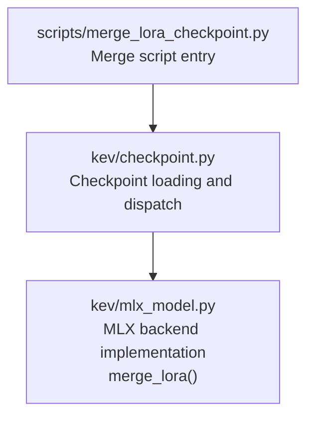
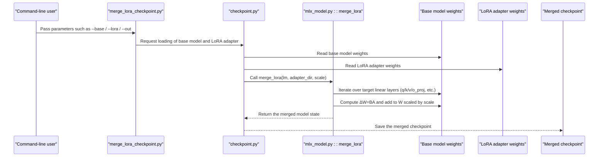
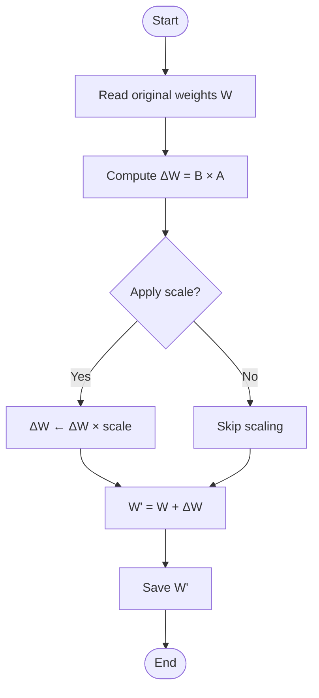
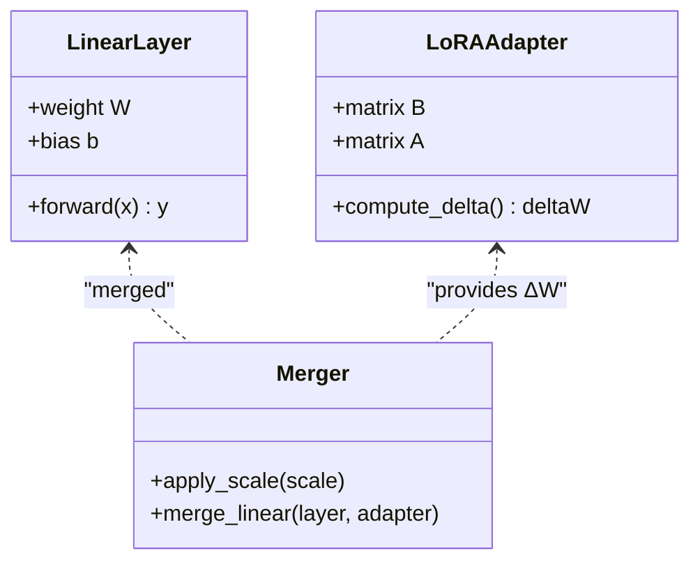
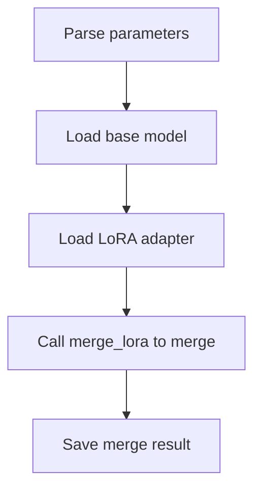
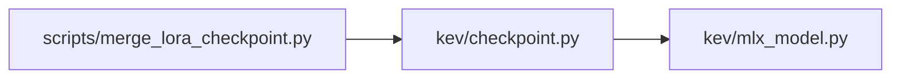

## Table of Contents
1. [Introduction](#introduction)
2. [Project Structure](#project-structure)
3. [Core Components](#core-components)
4. [Architecture Overview](#architecture-overview)
5. [Detailed Component Analysis](#detailed-component-analysis)
6. [Dependency Analysis](#dependency-analysis)
7. [Performance and Precision Considerations](#performance-and-precision-considerations)
8. [Troubleshooting Guide](#troubleshooting-guide)
9. [Conclusion](#conclusion)
10. [Appendix: Command-Line Usage and Verification Flow](#appendix-command-line-usage-and-verification-flow)

## Introduction
This document is a complete technical reference for "merging trained LoRA adapter weights back into the base model," focusing on the merge script and the MLX backend implementation in the repository. It covers:
- Mathematical principles: how to add the low-rank increment ΔW = BA back into the original weights W, yielding W' = W + ΔW.
- Target module strategy: how the merge is performed for linear layers such as q_proj, k_proj, v_proj, and o_proj.
- Merge flow: the steps from loading the base model and LoRA adapter to producing the final checkpoint.
- Consistency verification: how to ensure the merged model's outputs match those of the original LoRA model (numerical precision and performance).
- Format and compatibility: differences in model format before and after merging, and deployment compatibility considerations.
- Usage guide: command-line usage for beginners, plus guidance for experts on extending the custom merge logic.

## Project Structure
Key paths and responsibilities involved in this document:
- scripts/merge_lora_checkpoint.py: the main entry-point script for LoRA weight merging.
- kev/checkpoint.py: unified checkpoint loading and dispatch logic, responsible for invoking merge_lora at the appropriate time.
- kev/mlx_model.py: the concrete MLX backend implementation, containing the merge_lora function and related notes.

**Diagram Sources**
- [merge_lora_checkpoint.py](file://scripts/merge_lora_checkpoint.py)
- [checkpoint.py:247-252](file://kev/checkpoint.py#L247-L252)
- [mlx_model.py:14,96:14-14](file://kev/mlx_model.py#L14-L14)
- [mlx_model.py:96-96](file://kev/mlx_model.py#L96-L96)

**Section Sources**
- [merge_lora_checkpoint.py](file://scripts/merge_lora_checkpoint.py)
- [checkpoint.py:247-252](file://kev/checkpoint.py#L247-L252)
- [mlx_model.py:14,96:14-14](file://kev/mlx_model.py#L14-L14)

## Core Components
- Merge script entry (scripts/merge_lora_checkpoint.py)
  - Role: provides a command-line interface that takes parameters such as the base model path, LoRA adapter path, and output path, and triggers the merge flow.
- Checkpoint dispatch (kev/checkpoint.py)
  - Role: loads checkpoints uniformly and invokes the MLX backend's merge_lora to complete weight merging when needed; also handles routing between full_ft and lora modes.
- MLX backend implementation (kev/mlx_model.py)
  - Role: provides the concrete implementation of merge_lora(lm, adapter_dir, scale=1.0), iterating over and merging the target linear layers according to LoRA naming conventions; its docstring notes that the full-weight checkpoint is built by this script.

**Section Sources**
- [checkpoint.py:247-252](file://kev/checkpoint.py#L247-L252)
- [mlx_model.py:14,96:14-14](file://kev/mlx_model.py#L14-L14)

## Architecture Overview
The following diagram shows the overall data flow and control flow of LoRA weight merging:

**Diagram Sources**
- [merge_lora_checkpoint.py](file://scripts/merge_lora_checkpoint.py)
- [checkpoint.py:247-252](file://kev/checkpoint.py#L247-L252)
- [mlx_model.py:96](file://kev/mlx_model.py#L96-L96)

## Detailed Component Analysis

### Mathematical Principle: Superposition of ΔW = BA
- LoRA decomposes the update into two low-rank matrices B and A, such that ΔW = BA.
- The merge process performs W' = W + ΔW (possibly with a scaling factor scale) for each target linear layer.
- This operation is element-wise addition that preserves dimensionality; it is typically computed in fp32 to ensure numerical stability.

[No diagram source, as this is a conceptual flowchart]

**Section Sources**
- [mlx_model.py:14](file://kev/mlx_model.py#L14-L14)

### Target Module Merge Strategy: q_proj, k_proj, v_proj, o_proj
- The merge script and MLX backend identify target modules via LoRA naming conventions, commonly including:
  - q_proj, k_proj, v_proj, o_proj (attention head projections)
  - Other possible linear layers (e.g., MLP gate/up/down, depending on the specific model)
- Merge rules:
  - If a layer has a corresponding LoRA adapter (B, A), compute ΔW = BA and add it to the original weights.
  - If no corresponding adapter exists, keep the original weights unchanged.
- Scaling factor:
  - The scale can be controlled via a parameter (default typically 1.0), used to adjust the strength of the LoRA contribution.

**Diagram Sources**
- [mlx_model.py:96](file://kev/mlx_model.py#L96-L96)

**Section Sources**
- [mlx_model.py:96](file://kev/mlx_model.py#L96-L96)

### Merge Flow: From Loading to Saving
- Step overview:
  1. Parse command-line arguments (base model path, LoRA adapter path, output path, scale, etc.).
  2. Load the base model weights.
  3. Load the LoRA adapter weights.
  4. Call merge_lora for layer-by-layer merging.
  5. Save the merged checkpoint to the specified path.

[No diagram source, as this is a conceptual flowchart]

**Section Sources**
- [checkpoint.py:247-252](file://kev/checkpoint.py#L247-L252)
- [mlx_model.py:14](file://kev/mlx_model.py#L14-L14)

### Model Format and Compatibility Before and After Merging
- Before merging:
  - Base model weights and LoRA adapter are stored separately and must be dynamically combined at inference time.
- After merging:
  - A "full-weight" checkpoint is produced, which can be loaded directly as a standard model without any additional LoRA adaptation.
- Compatibility:
  - The merged checkpoint should be compatible with downstream inference/serving frameworks (e.g., MLX or Torch backends).
  - Pay attention to consistency of dtype and device layout (recommend merging in fp32, then converting as needed).

**Section Sources**
- [mlx_model.py:14](file://kev/mlx_model.py#L14-L14)

## Dependency Analysis
- The script entry depends on checkpoint dispatch, which depends on the concrete implementation in mlx_model.
- Key dependency chain:
  - scripts/merge_lora_checkpoint.py → kev/checkpoint.py → kev/mlx_model.py

**Diagram Sources**
- [checkpoint.py:247-252](file://kev/checkpoint.py#L247-L252)
- [mlx_model.py:96](file://kev/mlx_model.py#L96-L96)

**Section Sources**
- [checkpoint.py:247-252](file://kev/checkpoint.py#L247-L252)
- [mlx_model.py:96](file://kev/mlx_model.py#L96-L96)

## Performance and Precision Considerations
- Precision:
  - It is recommended to perform the merge in fp32 to avoid accumulated error; quantize or convert to half precision only when necessary.
- Performance:
  - Merging is a one-time offline operation; the main cost is the matrix multiplication BA and the layer-by-layer superposition.
  - For large models, use efficient BLAS/GEMM implementations (MLX/Torch low-level optimizations).
- Memory:
  - During merging, W, B, and A must all be held simultaneously; be mindful of peak memory usage.

[This section provides general guidance and does not directly analyze specific files]

## Troubleshooting Guide
- Common issues:
  - LoRA adapter not found: confirm the adapter directory structure and naming conventions match.
  - Dimension mismatch: check that the dimensions of B, A, and the target linear layer weights are consistent.
  - Inconsistent outputs: verify that the scale parameter matches the one used during training; confirm dtype and device consistency.
- Diagnostic suggestions:
  - Print the norm and relative error of ΔW per layer to locate anomalous layers.
  - Compare the logits difference of the pre- and post-merge models under the same input.

[This section provides general guidance and does not directly analyze specific files]

## Conclusion
By superimposing LoRA's low-rank increment ΔW = BA onto the base model weights W with appropriate scaling, one obtains a full-weight checkpoint that can be deployed directly. This repository provides a stable, reproducible merge flow via a script entry point and the MLX backend implementation, facilitating rapid integration and verification in both research and production environments.

[This section is a summary and does not directly analyze specific files]

## Appendix: Command-Line Usage and Verification Flow

### Command-Line Usage (Beginners)
- Basic command:
  - python scripts/merge_lora_checkpoint.py --base <base model path> --lora <LoRA adapter path> --out <output path> [--scale scaling factor]
- Parameter description:
  - --base: base model weights path
  - --lora: LoRA adapter path
  - --out: merged checkpoint output path
  - --scale: LoRA contribution scaling factor (optional, default typically 1.0)

[This section provides general guidance and does not directly analyze specific files]

### Verification Flow (Experts)
- Numerical consistency verification:
  - Run both "dynamic LoRA combination" and "merged full model" on the same input, and compare logits or loss values.
  - Set a reasonable tolerance (e.g., atol=1e-5, rtol=1e-5) and report the maximum absolute error and relative error.
- Performance testing:
  - Compare inference latency and throughput before and after merging to assess the benefit of merging.
- Regression testing:
  - Evaluate the merged model on multiple task sets to ensure metrics do not degrade.

[This section provides general guidance and does not directly analyze specific files]
