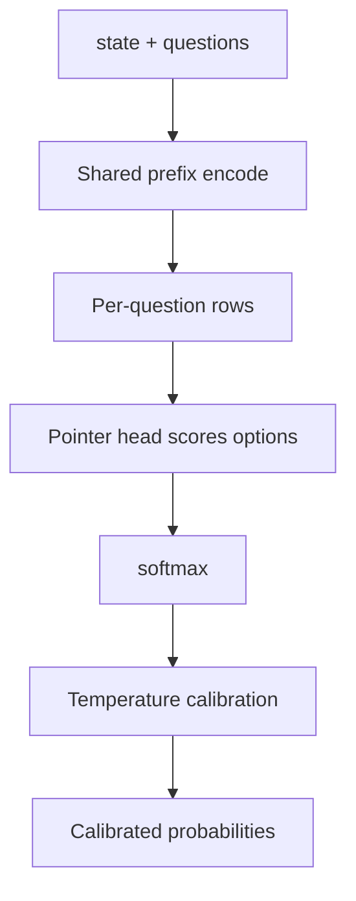
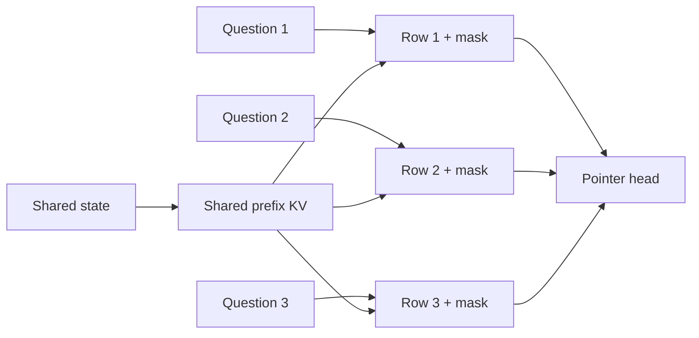
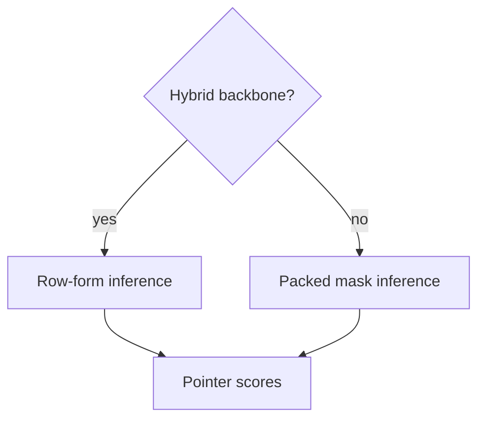
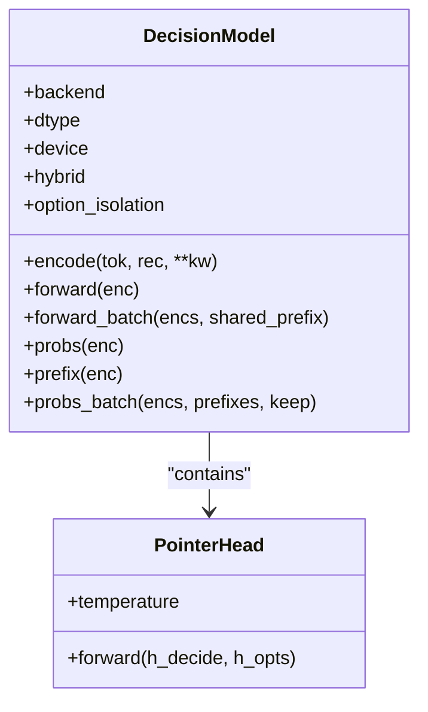

## Table of Contents
1. Introduction
2. Overall Architecture
3. Encoder and Mask
4. Pointer Head
5. Hybrid Backbone and Row Form
6. Prefix Cache
7. Calibration and Temperature
8. LoRA and Full Fine-Tuning
9. Inference Path
10. Key Modules
11. Performance Notes
12. Conclusion

## Introduction
Kev is not a generative chat model but a "prefill-only" decision model. Its input is a shared state and several typed questions; the output is a probability distribution over each question's options. This document covers the encoder and block-causal mask, the pointer head, the hybrid backbone and row-form inference, the prefix cache, and the calibration mechanism, helping you understand how Kev turns a document into independently scored decisions.

## Overall Architecture
The overall flow:
1. Serialize the state and multiple questions into a unified text format.
2. Encode the shared state once (shared prefix).
3. Split into independent rows per question, isolated by a block-causal mask.
4. Score each option with the pointer head.
5. softmax to probabilities.
6. Apply temperature for calibration.

## Encoder and Mask
- encode() packs the state and multiple question branches into one sequence, keeping seg/pos/opt metadata.
- A block-causal mask ensures questions cannot see each other; option_isolation builds strict permutation invariance.
- The shared prefix runs the state once; question branches reuse its keys/values.

## Pointer Head
- PointerHead scores the hidden states at each question's `<decide>` token and the option `</opt>` tokens.
- It outputs raw scores; softmax gives the probability per option.
- In eval mode it scales logits by temperature; training always uses T=1.

## Hybrid Backbone and Row Form
- Kev bases include both pure-attention and hybrid (Gated DeltaNet) backbones.
- For hybrid backbones, or when the packed sequence is too long, inference switches to row-form: each question is a separate row, sharing the state prefix.
- The row form is exact to the packed form and avoids a 64k×64k explicit mask.

## Prefix Cache
- The server caches the state's KV (prefix) to avoid recomputing long documents.
- PrefixCache controls size/min_tokens/max_tokens, LRU eviction, and clears and retries once on OOM.
- Hits significantly reduce repeated-document cost.

## Calibration and Temperature
- Each checkpoint carries a temperature in head.pt.
- Temperature reshapes probabilities without changing the argmax, improving Brier/calibration.
- To get raw probabilities, set KEV_TEMPERATURE=1.0.

## LoRA and Full Fine-Tuning
- LoRA: trains adapters on attention/dense (or all) targets; the pointer head and base are mostly frozen.
- Full fine-tuning: trains the whole backbone plus the head; uses fp32 master weights (MasterAdamW) for stability.
- Both paths export head.pt (head + temperature) and meta (base/lora/head_dim/weights_dtype/holdout).

## Inference Path
- DecisionModel.probs_batch combines CUDA Graphs for batched scheduling.
- For each record: shared prefix → per-question rows → pointer scores → softmax → calibrated probabilities.
- The serving layer assembles answers and usage stats and returns JSON.

## Key Modules
- kev/model.py: DecisionModel, PointerHead, encode, mask, row form.
- kev/checkpoint.py: load/save head.pt and meta; read temperature.
- kev/device.py: backend selection (CUDA/MLX/Torch) and dtype.
- kev/serve.py / kev/api.py: server, prefix cache, request/response mapping.

## Performance Notes
- bf16 by default; fp32 for reproducible eval.
- CUDA Graphs on by default to reduce kernel launch overhead.
- MLX auto-enabled on Apple Silicon; prefix cache hits reduce repeated cost.
- Kev-27B needs ~51 GB weights + buffer; smaller sizes fit on Mac or single L4/L40S.

## Conclusion
Kev's architecture is purpose-built for decision classification: a shared prefix, isolated question rows, and a pointer head turn a document into independently scored, calibrated probabilities. The hybrid/row-form switch and prefix cache keep it efficient on both short and long inputs, while the LoRA and full fine-tuning paths let developers adapt it to their own data.
