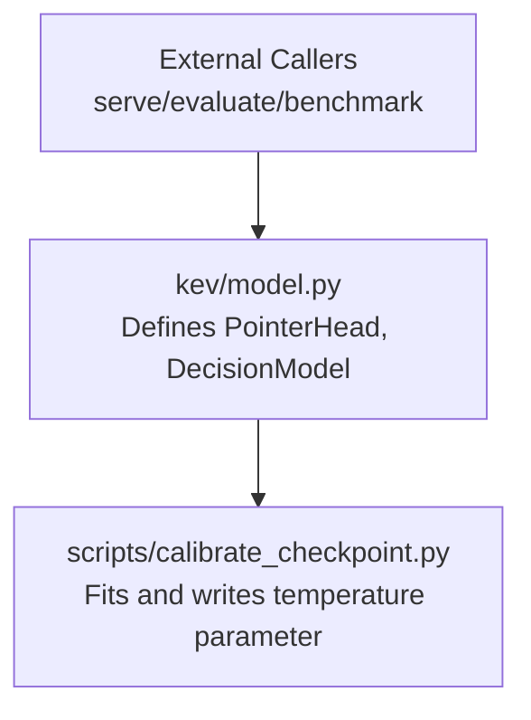
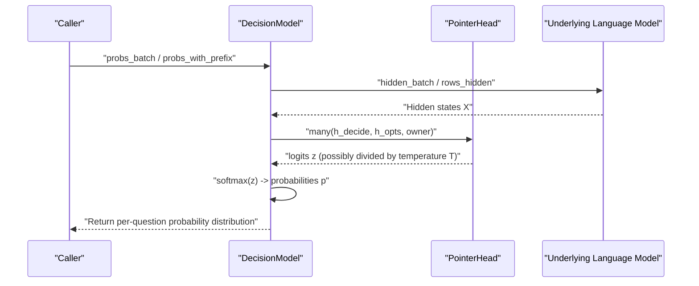
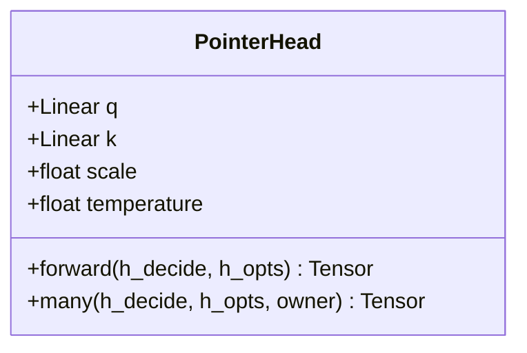
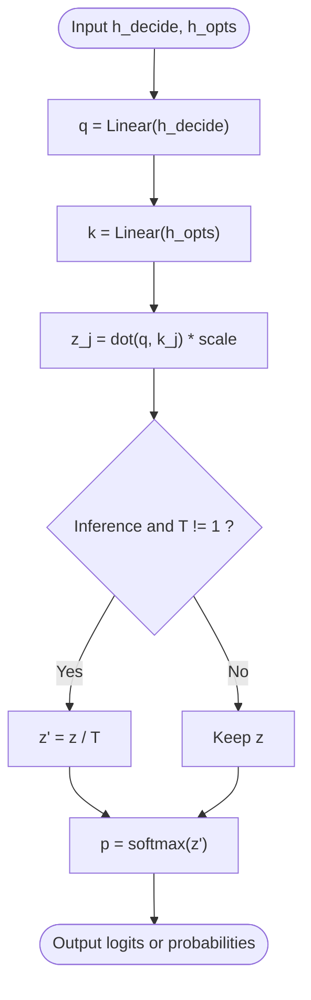
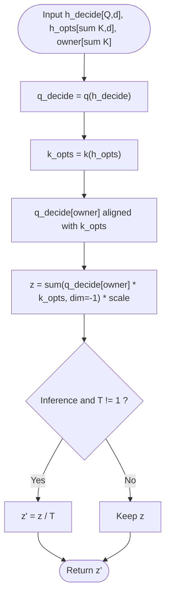
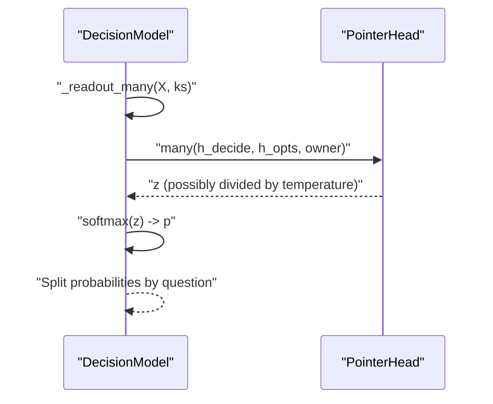
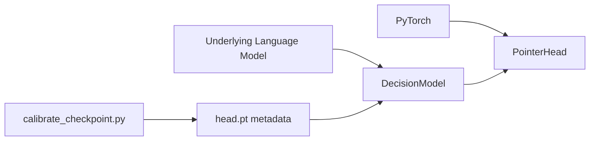
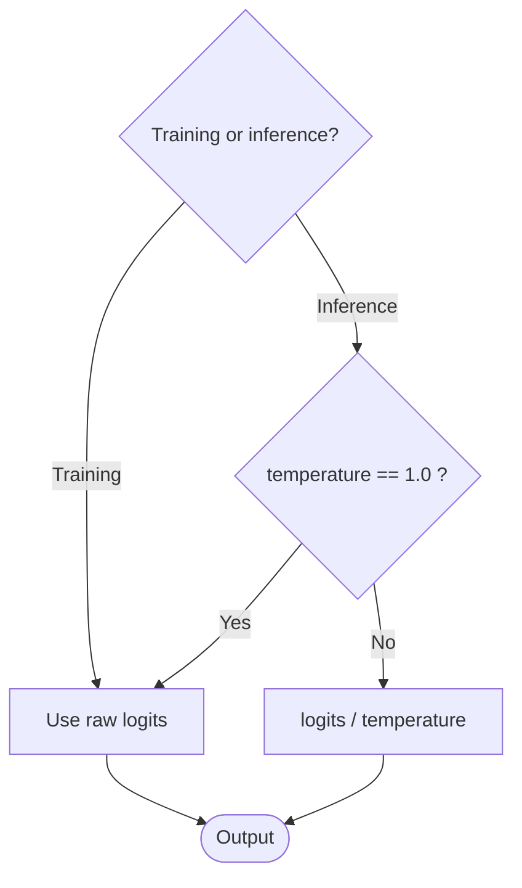

## Table of Contents
1. [Introduction](#introduction)
2. [Project Structure](#project-structure)
3. [Core Components](#core-components)
4. [Architecture Overview](#architecture-overview)
5. [Detailed Component Analysis](#detailed-component-analysis)
6. [Dependency Analysis](#dependency-analysis)
7. [Performance and Batching Optimization](#performance-and-batching-optimization)
8. [Training vs Inference Behavior Differences](#training-vs-inference-behavior-differences)
9. [Mathematical Principles](#mathematical-principles)
10. [Usage Examples and Probability Calibration](#usage-examples-and-probability-calibration)
11. [Troubleshooting Guide](#troubleshooting-guide)
12. [Conclusion](#conclusion)

## Introduction
This document is the technical reference for the "pointer head decoder" (PointerHead), focusing on the following goals:
- Explain how PointerHead selects the best option by computing the similarity between the query vector h_decide and the key vectors h_opts.
- Detail the temperature scaling mechanism: calibrating the logits at inference time to improve the accuracy of probability estimation.
- Explain the batching optimization: how the many() method achieves parallel decoding of multiple questions, avoiding loop overhead.
- Document the different behaviors in training vs inference modes: raw logits are used during training, while the temperature parameter is applied during inference.
- Provide the mathematical formula for dot-product similarity and the softmax probability distribution generation process.
- Provide beginner-friendly conceptual explanations, and offer tuning suggestions and performance optimization strategies for experts.

## Project Structure
The code directly related to the pointer head decoder is in the model module, and the temperature calibration script is in the scripts directory.

Diagram sources
- [model.py:205-223](file://kev/model.py#L205-L223)
- [calibrate_checkpoint.py:1-32](file://scripts/calibrate_checkpoint.py#L1-L32)

Section sources
- [model.py:205-223](file://kev/model.py#L205-L223)
- [calibrate_checkpoint.py:1-32](file://scripts/calibrate_checkpoint.py#L1-L32)

## Core Components
- PointerHead: implements option scoring based on query-key similarity, supporting both a single-question forward interface and a batched many interface; has a built-in temperature scaling switch.
- DecisionModel: encapsulates the underlying language model and PointerHead, responsible for encoding, masking, batching, and probability output; internally calls head.many via _readout_many to complete efficient decoding.

Section sources
- [model.py:205-223](file://kev/model.py#L205-L223)
- [model.py:494-505](file://kev/model.py#L494-L505)

## Architecture Overview
The diagram below shows the overall flow from input encoding to option probability output, and the position of temperature scaling in the inference path.

Diagram sources
- [model.py:389-394](file://kev/model.py#L389-L394)
- [model.py:494-505](file://kev/model.py#L494-L505)
- [model.py:216-223](file://kev/model.py#L216-L223)

## Detailed Component Analysis

### PointerHead Class Design
The core idea of PointerHead is to use the hidden vector at the "decision position" as the query q, and the set of hidden vectors of the "candidate options" as the keys k, perform a dot-product similarity after linear projection, and obtain the unnormalized score (logits) for each option.

Key points
- Dimension control: dp is the pointer dimension, determining the representational capacity of the q/k projections.
- Scaling factor: scale = 1/sqrt(dp), used to stabilize the dot-product similarity.
- Temperature parameter: temperature acts on the logits only during inference (eval) and when not equal to 1.0.
- Two interfaces:
  - forward: single question, shapes [d] and [K,d] produce logits of shape [K].
  - many: batched questions, shapes [Q,d] and [sum K,d] produce logits of shape [sum K], mapped back to each question via owner.

Diagram sources
- [model.py:205-223](file://kev/model.py#L205-L223)

Section sources
- [model.py:205-223](file://kev/model.py#L205-L223)

### Similarity Computation and Option Selection
- Query vector: h_decide is the hidden representation of the "decision position".
- Key vector: h_opts is the set of hidden representations of the "candidate options".
- Similarity: for each option j, compute the dot product of q(h_decide) and k(h_opts[j]), then multiply by the scaling factor scale to obtain the logits for the j-th option.
- Selection strategy: argmax(logits) is the most likely option; if a probability is needed, apply softmax to the logits.

Diagram sources
- [model.py:216-223](file://kev/model.py#L216-L223)

Section sources
- [model.py:216-223](file://kev/model.py#L216-L223)

### Batching Optimization many()
The design goal of many() is to "cover multiple questions in one forward pass", avoiding the Python-layer overhead and device synchronization caused by per-question loops. Its core idea:
- Stack the h_decide of multiple questions into [Q,d].
- Concatenate the h_opts of all questions into [sum K,d].
- Use the owner array to map each option back to its corresponding question index.
- Compute the similarity of all options at once via broadcasting and summation, obtaining logits of shape [sum K].
- The upper layer then reassembles the logits, splits them by question, and finally applies softmax.

Diagram sources
- [model.py:219-223](file://kev/model.py#L219-L223)

Section sources
- [model.py:219-223](file://kev/model.py#L219-L223)

### Integration with DecisionModel
DecisionModel is responsible for:
- Encoding the input records and generating hidden states.
- Selecting the row-wise or packed masking path based on whether it is a hybrid architecture or the sequence length.
- Calling head.many via _readout_many to convert logits into probabilities.

Diagram sources
- [model.py:494-505](file://kev/model.py#L494-L505)
- [model.py:219-223](file://kev/model.py#L219-L223)

Section sources
- [model.py:494-505](file://kev/model.py#L494-L505)
- [model.py:219-223](file://kev/model.py#L219-L223)

## Dependency Analysis
- PointerHead depends on PyTorch's Linear and tensor operations.
- DecisionModel depends on the underlying language model (e.g., Qwen3.5, etc.), and selects the row-wise or packed masking path based on architectural characteristics.
- The temperature calibration script calibrate_checkpoint.py reads/writes the temperature in the checkpoint metadata, ensuring inference uses the calibrated probabilities by default.

Diagram sources
- [model.py:205-223](file://kev/model.py#L205-L223)
- [model.py:494-505](file://kev/model.py#L494-L505)
- [calibrate_checkpoint.py:141-157](file://scripts/calibrate_checkpoint.py#L141-L157)

Section sources
- [model.py:205-223](file://kev/model.py#L205-L223)
- [model.py:494-505](file://kev/model.py#L494-L505)
- [calibrate_checkpoint.py:141-157](file://scripts/calibrate_checkpoint.py#L141-L157)

## Performance and Batching Optimization
- Advantages of many():
  - Reduces Python-layer loop overhead.
  - Computes similarity at once using matrix multiplication and broadcasting.
  - Reduces device synchronization counts and improves throughput.
- Applicable scenarios:
  - Decoding multiple questions simultaneously in serving batches.
  - Batch scoring of large numbers of records in evaluation scripts.
- Notes:
  - The owner array must correctly map each option to its corresponding question.
  - When the number of options varies greatly, pay attention to memory usage and the impact of padding.

Section sources
- [model.py:219-223](file://kev/model.py#L219-L223)
- [model.py:494-505](file://kev/model.py#L494-L505)

## Training vs Inference Behavior Differences
- Training mode (training=True):
  - Temperature scaling is not applied; raw logits are used directly.
  - Beneficial for gradient stability and loss computation.
- Inference mode (eval and temperature != 1.0):
  - Divide the logits by temperature T, making the probability distribution smoother or sharper.
  - argmax remains unchanged, but the probability estimates are better calibrated, helping reliability metrics (such as ECE).

Diagram sources
- [model.py:216-223](file://kev/model.py#L216-L223)

Section sources
- [model.py:216-223](file://kev/model.py#L216-L223)

## Mathematical Principles
- Dot-product similarity:
  - Let q = W_q · h_decide, k_j = W_k · h_opts[j].
  - Similarity s_j = q^T · k_j.
  - After scaling, z_j = s_j / sqrt(dp).
- Temperature scaling:
  - At inference, z'_j = z_j / T.
  - T > 1 makes the distribution smoother; T < 1 makes the distribution sharper.
- Probability distribution:
  - p_j = exp(z'_j) / sum_k(exp(z'_k)).

These formulas are implemented in forward and many in scalar and vector forms respectively, and finally generate probabilities via softmax.

Section sources
- [model.py:216-223](file://kev/model.py#L216-L223)

## Usage Examples and Probability Calibration
- Option selection with the pointer head:
  - Prepare h_decide and h_opts.
  - Call forward (single question) or many (batched).
  - Apply softmax to the output logits to get probabilities.
  - Take argmax to get the best option.
- Probability calibration:
  - Use calibrate_checkpoint.py to fit temperature T on a held-out dataset.
  - Write T into the head.pt metadata of the checkpoint.
  - T is applied automatically at inference time, with no need to manually modify code.

Section sources
- [model.py:216-223](file://kev/model.py#L216-L223)
- [calibrate_checkpoint.py:1-32](file://scripts/calibrate_checkpoint.py#L1-L32)
- [calibrate_checkpoint.py:141-157](file://scripts/calibrate_checkpoint.py#L141-L157)

## Troubleshooting Guide
- Inaccurate probabilities or overconfidence:
  - Check whether temperature T has been fitted, and ensure temperature scaling is enabled in inference mode.
  - Confirm the temperature value in head.pt is reasonable.
- Misaligned batched decoding results:
  - Check whether the owner array correctly maps each option to its corresponding question.
  - Confirm the start and slot computation logic is consistent.
- Training instability:
  - Confirm temperature scaling is not applied in training mode.
  - Check whether the dp dimension is too large, causing numerical instability.

Section sources
- [model.py:216-223](file://kev/model.py#L216-L223)
- [model.py:494-505](file://kev/model.py#L494-L505)
- [calibrate_checkpoint.py:141-157](file://scripts/calibrate_checkpoint.py#L141-L157)

## Conclusion
PointerHead implements option selection through a concise and efficient query-key similarity mechanism, combined with temperature scaling to improve the quality of probability calibration during inference. The many() method significantly optimizes the performance of batched decoding, suitable for serving and evaluation scenarios. It is recommended to fit the temperature on a held-out dataset before deployment and enable temperature scaling during inference to obtain more reliable probability estimates. For large-scale tasks, pay attention to the correctness of owner mapping and memory usage, and adjust dp and batch size as necessary to balance precision and efficiency.
