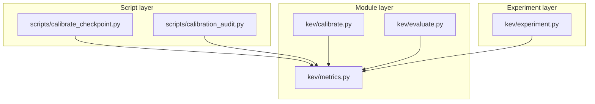
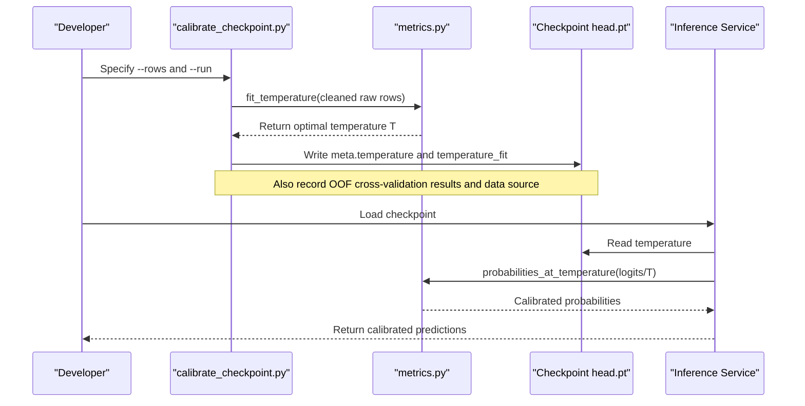
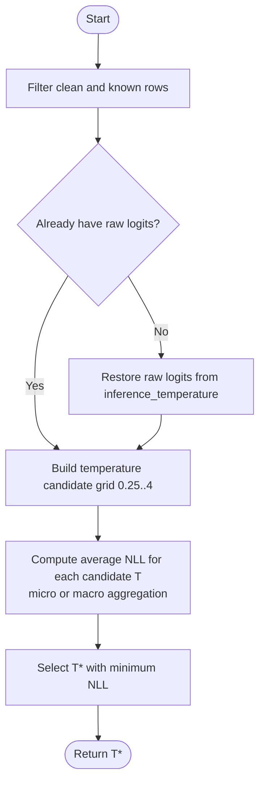
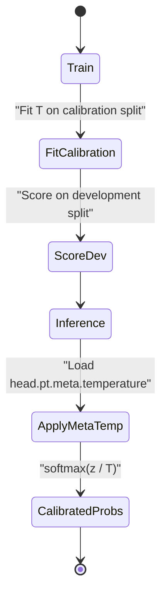
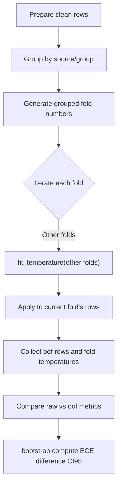
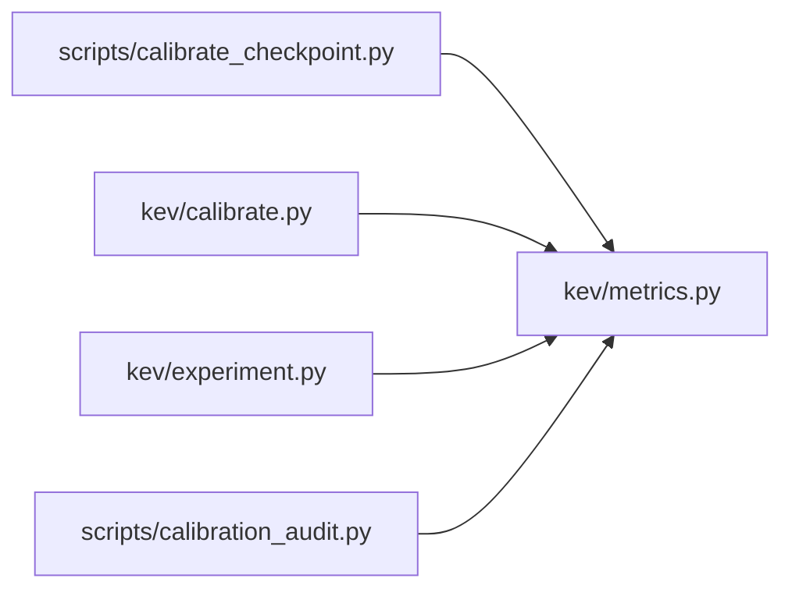

## Table of Contents
1. [Introduction](#introduction)
2. [Project Structure](#project-structure)
3. [Core Components](#core-components)
4. [Architecture Overview](#architecture-overview)
5. [Detailed Component Analysis](#detailed-component-analysis)
6. [Dependency Analysis](#dependency-analysis)
7. [Performance and Numerical Characteristics](#performance-and-numerical-characteristics)
8. [Troubleshooting Guide](#troubleshooting-guide)
9. [Conclusion](#conclusion)
10. [Appendix: Usage Examples and Best Practices](#appendix-usage-examples-and-best-practices)

## Introduction
This document focuses on the topic of "probability calibration", systematically explaining the implementation of temperature scaling in this project, the differences between training and inference behavior, fitting the optimal temperature on the development set, applying the temperature at inference time, and evaluating calibration quality (especially ECE). The document both explains the concept and importance of probability calibration for beginners and provides strategy selection and optimization suggestions for experts.

The essence of temperature scaling is to introduce a scalar parameter T that scales the model's output logits before applying softmax, thereby adjusting the smoothness of the output probability distribution and improving the accuracy of confidence estimation. T > 1 makes the distribution smoother (reducing extreme confidence), and T < 1 makes the distribution sharper (increasing extreme confidence).

## Project Structure
The key code related to probability calibration in this project is distributed across the following locations:
- Script layer: used to compute and write the optimal temperature for a new checkpoint, or to generate a calibration audit report
- Module layer: encapsulates general capabilities such as temperature fitting, metric computation, cross-validation, and paired bootstrap
- Experiment layer: trains, calibrates, and scores by split within the research flow

Diagram sources
- [scripts/calibrate_checkpoint.py:1-32](file://scripts/calibrate_checkpoint.py#L1-L32)
- [scripts/calibration_audit.py:1-16](file://scripts/calibration_audit.py#L1-L16)
- [kev/calibrate.py:1-17](file://kev/calibrate.py#L1-L17)
- [kev/metrics.py:1-6](file://kev/metrics.py#L1-L6)
- [kev/evaluate.py:1-9](file://kev/evaluate.py#L1-L9)
- [kev/experiment.py:1-6](file://kev/experiment.py#L1-L6)

Section sources
- [scripts/calibrate_checkpoint.py:1-32](file://scripts/calibrate_checkpoint.py#L1-L32)
- [scripts/calibration_audit.py:1-16](file://scripts/calibration_audit.py#L1-L16)
- [kev/calibrate.py:1-17](file://kev/calibrate.py#L1-L17)
- [kev/metrics.py:1-6](file://kev/metrics.py#L1-L6)
- [kev/evaluate.py:1-9](file://kev/evaluate.py#L1-L9)
- [kev/experiment.py:1-6](file://kev/experiment.py#L1-L6)

## Core Components
This section focuses on the core implementation and call paths of temperature scaling:
- Metric and temperature operations: [kev/metrics.py]
- Workload calibration report: [kev/calibrate.py]
- Checkpoint temperature fitting and writing: [scripts/calibrate_checkpoint.py]
- Calibration and scoring in the experiment flow: [kev/experiment.py]
- Prototype temperature scaling test: [kev/evaluate.py]
- Calibration audit and comparison: [scripts/calibration_audit.py]

Section sources
- [kev/metrics.py:14-53](file://kev/metrics.py#L14-L53)
- [kev/metrics.py:276-294](file://kev/metrics.py#L276-L294)
- [kev/calibrate.py:28-44](file://kev/calibrate.py#L28-L44)
- [scripts/calibrate_checkpoint.py:115-157](file://scripts/calibrate_checkpoint.py#L115-L157)
- [kev/experiment.py:320-369](file://kev/experiment.py#L320-L369)
- [kev/evaluate.py:164-181](file://kev/evaluate.py#L164-L181)
- [scripts/calibration_audit.py:92-144](file://scripts/calibration_audit.py#L92-L144)

## Architecture Overview
The diagram below shows the overall flow from data to calibration, and then to evaluation and deployment.

Diagram sources
- [scripts/calibrate_checkpoint.py:115-157](file://scripts/calibrate_checkpoint.py#L115-L157)
- [kev/metrics.py:276-294](file://kev/metrics.py#L276-L294)
- [kev/metrics.py:39-45](file://kev/metrics.py#L39-L45)

## Detailed Component Analysis

### Mathematical Principles and Implementation Notes of Temperature Scaling
- Objective function: minimize the average negative log-likelihood (NLL) over the candidate temperature set.
- Candidate temperatures: uniformly sampled in log space (e.g., 0.25..4), mapped back to the positive real domain via exp.
- Aggregation: supports both micro and macro aggregation; macro weights by task counts.
- Input requirement: must be based on "raw logits"; if a row already carries inference_temperature, it must first be restored to T=1 raw logits.
- Output: returns the optimal temperature T.

Key implementation notes (corresponding source locations):
- NLL and probability computation: [kev/metrics.py:48-53], [kev/metrics.py:39-45]
- Temperature grid search and aggregation: [kev/metrics.py:276-294]
- Row-level logits restoration and temperature transformation: [kev/metrics.py:232-243], [kev/metrics.py:224-229]

Diagram sources
- [kev/metrics.py:276-294](file://kev/metrics.py#L276-L294)
- [kev/metrics.py:232-243](file://kev/metrics.py#L232-L243)

Section sources
- [kev/metrics.py:39-53](file://kev/metrics.py#L39-L53)
- [kev/metrics.py:224-243](file://kev/metrics.py#L224-L243)
- [kev/metrics.py:276-294](file://kev/metrics.py#L276-L294)

### Temperature Behavior in Training vs Inference Modes
- Training phase:
  - The experiment flow fits the temperature on the calibration split, but the predictor used for training and scoring loads with temperature=1.0 to ensure gradient propagation is unaffected by temperature.
  - The in-trial temperature obtained on the calibration split serves only as a research screening metric and is not directly written to the checkpoint.
- Inference phase:
  - scripts/calibrate_checkpoint.py writes the optimal temperature "from an independent dataset pool" into the checkpoint's meta.temperature.
  - After the inference service loads the checkpoint, it uses this temperature for probability calibration by default.

Key implementation notes (corresponding source locations):
- Training side: [kev/experiment.py:320-369]
- Inference-side writing: [scripts/calibrate_checkpoint.py:141-157]

Diagram sources
- [kev/experiment.py:320-369](file://kev/experiment.py#L320-L369)
- [scripts/calibrate_checkpoint.py:141-157](file://scripts/calibrate_checkpoint.py#L141-L157)

Section sources
- [kev/experiment.py:320-369](file://kev/experiment.py#L320-L369)
- [scripts/calibrate_checkpoint.py:141-157](file://scripts/calibrate_checkpoint.py#L141-L157)

### Fitting the Optimal Temperature on the Development Set and Cross-Validation
- Single-row temperature fitting: perform grid search on cleaned raw rows and select the temperature with minimum NLL.
- Cross-validation: split folds by (source, group), ensuring samples of the same group do not cross folds; each fold fits the temperature using the other folds, then applies it to that fold to obtain out-of-fold probabilities.
- Statistical inference: for non-linear metrics such as ECE, use source-stratified paired bootstrap to compute the 95% confidence interval and judge whether the raw vs oof difference is significant.

Key implementation notes (corresponding source locations):
- Cross-validated temperature: [kev/metrics.py:333-348], [kev/metrics.py:351-369]
- Grouped folds and clustered resampling: [kev/metrics.py:317-330], [kev/metrics.py:308-315]
- Paired bootstrap: [kev/metrics.py:372-426]

Diagram sources
- [kev/metrics.py:317-348](file://kev/metrics.py#L317-L348)
- [kev/metrics.py:351-369](file://kev/metrics.py#L351-L369)
- [kev/metrics.py:372-426](file://kev/metrics.py#L372-L426)

Section sources
- [kev/metrics.py:308-369](file://kev/metrics.py#L308-L369)
- [kev/metrics.py:372-426](file://kev/metrics.py#L372-L426)

### Calibration Effect Evaluation: ECE and Other Metrics
- ECE (Expected Calibration Error): bins by confidence and measures the deviation between expected confidence and true accuracy.
- Brier score: the mean squared error of the probability distribution.
- NLL: negative log-likelihood, the objective function for temperature fitting.
- Selective prediction: coverage at error budget (e.g., 5%), AURC, high-confidence error rate, etc.
- Grouping and length dimensions: evaluation can be split by task, state token length, and other dimensions.

Key implementation notes (corresponding source locations):
- ECE computation: [kev/metrics.py:15-21]
- Comprehensive metrics: [kev/metrics.py:64-100]
- Selective prediction and risk-coverage curves: [kev/metrics.py:103-146]
- Calibration by length buckets: [kev/metrics.py:206-221]

Section sources
- [kev/metrics.py:15-21](file://kev/metrics.py#L15-L21)
- [kev/metrics.py:64-100](file://kev/metrics.py#L64-L100)
- [kev/metrics.py:103-146](file://kev/metrics.py#L103-L146)
- [kev/metrics.py:206-221](file://kev/metrics.py#L206-L221)

### Workload Calibration Report and Audit
- Workload report: for a single rows.json, compares four arms — raw, shipped, workload (fitted on this row set), and workload_oof (group-disjoint OOF) — and provides ECE/Brier/cov@5%/AURC comparisons and bootstrap intervals.
- Calibration audit: horizontal comparison across different models/checkpoints, including descriptive statistics of raw and temperature_replay, risk-coverage curves, and blind review of failure cases.

Key implementation notes (corresponding source locations):
- Workload report: [kev/calibrate.py:28-44], [kev/calibrate.py:59-69]
- Calibration audit main flow: [scripts/calibration_audit.py:92-144]

Section sources
- [kev/calibrate.py:28-44](file://kev/calibrate.py#L28-L44)
- [kev/calibrate.py:59-69](file://kev/calibrate.py#L59-L69)
- [scripts/calibration_audit.py:92-144](file://scripts/calibration_audit.py#L92-L144)

### Prototype Temperature Scaling Test
- In the older evaluate.py, an LBFGS-based end-to-end temperature scaling example is provided: half the data is used for fitting, and the other half is used to evaluate the change in NLL/ECE.
- Note: this path is mainly for historical prototype evaluation, not the release flow.

Key implementation notes (corresponding source locations):
- Temperature scaling test function: [kev/evaluate.py:164-181]

Section sources
- [kev/evaluate.py:164-181](file://kev/evaluate.py#L164-L181)

## Dependency Analysis
- The script calibrate_checkpoint.py depends on the fit_temperature, cross_validated_temperature, metrics, and other utility functions of metrics.py, as well as reading and writing checkpoint metadata.
- The module calibrate.py depends on fit_temperature, out_of_fold_rows, paired_bootstrap, etc. of metrics.py.
- The experiment experiment.py uses LocalPredictor loaded with temperature=1.0 after training, fits the temperature on the calibration split, and then scores on the development/transfer splits.
- The audit script calibration_audit.py depends on metrics, probabilities_at_temperature, etc. of metrics.py.

Diagram sources
- [scripts/calibrate_checkpoint.py:37-40](file://scripts/calibrate_checkpoint.py#L37-L40)
- [kev/calibrate.py:21-22](file://kev/calibrate.py#L21-L22)
- [kev/experiment.py:33-36](file://kev/experiment.py#L33-L36)
- [scripts/calibration_audit.py:13-15](file://scripts/calibration_audit.py#L13-L15)

Section sources
- [scripts/calibrate_checkpoint.py:37-40](file://scripts/calibrate_checkpoint.py#L37-L40)
- [kev/calibrate.py:21-22](file://kev/calibrate.py#L21-L22)
- [kev/experiment.py:33-36](file://kev/experiment.py#L33-L36)
- [scripts/calibration_audit.py:13-15](file://scripts/calibration_audit.py#L13-L15)

## Performance and Numerical Characteristics
- Numerical stability:
  - When computing tempered logits, the maximum value is subtracted to avoid exponential overflow.
  - Logits are stabilized before probability normalization.
- Complexity:
  - The temperature grid size is fixed (e.g., 121 points); each evaluation computes the average NLL for all candidate T, with time complexity linearly related to the number of candidates.
- Memory and batching:
  - Metric computation is based on numpy, avoiding torch dependency, facilitating offline evaluation of saved rows.json.
- Selective prediction:
  - coverage at error budget and AURC computation are based on sorting and cumulative errors, suitable for large-scale batch computation.

Section sources
- [kev/metrics.py:29-36](file://kev/metrics.py#L29-L36)
- [kev/metrics.py:64-100](file://kev/metrics.py#L64-L100)
- [kev/metrics.py:103-146](file://kev/metrics.py#L103-L146)

## Troubleshooting Guide
Common problems and localization methods:
- Cannot fit temperature:
  - Cause: no available clean labeled rows, or the input is not raw logits.
  - Localization: [kev/metrics.py:276-294]
- Missing logits in rows:
  - Cause: some historical rows did not record logits and cannot be restored to raw logits.
  - Localization: [kev/metrics.py:232-243]
- Data leakage risk:
  - Symptom: using rows overlapping with the checkpoint's training data to fit the temperature.
  - Solution: use an independent held-out datasets pool; the script rejects in-distribution rows unless explicitly allowed.
  - Localization: [scripts/calibrate_checkpoint.py:1-32], [scripts/calibrate_checkpoint.py:128-135]
- Invalid temperature:
  - Symptom: temperature is non-positive or non-finite.
  - Localization: [kev/metrics.py:24-26]
- Abnormal metrics:
  - Symptom: abnormal ECE/Brier/NLL or abnormal selective-prediction coverage.
  - Localization: [kev/metrics.py:64-100], [kev/metrics.py:103-146]

Section sources
- [kev/metrics.py:24-26](file://kev/metrics.py#L24-L26)
- [kev/metrics.py:232-243](file://kev/metrics.py#L232-L243)
- [kev/metrics.py:276-294](file://kev/metrics.py#L276-L294)
- [scripts/calibrate_checkpoint.py:1-32](file://scripts/calibrate_checkpoint.py#L1-L32)
- [scripts/calibrate_checkpoint.py:128-135](file://scripts/calibrate_checkpoint.py#L128-L135)
- [kev/metrics.py:64-100](file://kev/metrics.py#L64-L100)
- [kev/metrics.py:103-146](file://kev/metrics.py#L103-L146)

## Conclusion
This project implements a complete temperature scaling calibration pipeline:
- Fit the optimal temperature on the development set based on raw logits, using micro/macro aggregated average NLL as the objective.
- Keep T=1.0 during training to maintain gradient propagation, and apply the meta.temperature recorded in the checkpoint during inference.
- Provide robust calibration quality estimates (ECE, etc.) through cross-validation and paired bootstrap.
- Provide scripts and audit tools to ensure that the temperature of a new checkpoint comes from an independent dataset pool, avoiding data leakage.

For beginners, it is recommended to first understand the intuitive meaning of ECE and temperature scaling; for experts, the following points are worth attention:
- Use an independent dataset pool to fit the temperature, avoiding in-distribution leakage.
- Use group-disjoint cross-validation and paired bootstrap to assess the significance of calibration gains.
- Combine selective prediction metrics (cov@5%, AURC) with task/length-dimensional analysis to locate weak calibration links.

## Appendix: Usage Examples and Best Practices

### Compute the Optimal Temperature for a New Checkpoint
- Basic usage:
  - Specify --run pointing to the checkpoint directory and --rows pointing to an independent rows.json (or a concatenation of multiple rows.json).
  - Optionally --exclude_rows to exclude certain rows, and --transfer to provide out-of-domain rows.json for reporting.
  - Optionally --folds and --seed to control cross-validation settings.
- Output:
  - Writes the optimal temperature into the checkpoint head.pt.meta.temperature, and records fitting details and OOF results in extra.temperature_fit.
- Reference paths:
  - [scripts/calibrate_checkpoint.py:115-157](file://scripts/calibrate_checkpoint.py#L115-L157)

### Workload Calibration Report
- Purpose: report the metrics and bootstrap intervals of the raw/shipped/workload/workload_oof four arms for a single rows.json.
- Reference paths:
  - [kev/calibrate.py:28-44](file://kev/calibrate.py#L28-L44)
  - [kev/calibrate.py:59-69](file://kev/calibrate.py#L59-L69)

### Calibration Audit and Comparison
- Purpose: horizontal comparison across different models/checkpoints, including descriptive statistics of raw and temperature_replay, risk-coverage curves, and blind review of failure cases.
- Reference paths:
  - [scripts/calibration_audit.py:92-144](file://scripts/calibration_audit.py#L92-L144)

### Best Practice Recommendations
- Data isolation:
  - Always fit the temperature using a held-out datasets pool independent of the training set.
  - Avoid using the calibration/development split of the training source as the fitting set.
- Metric selection:
  - Primarily use ECE, supplemented by Brier, NLL, cov@5%, AURC, and confident_error_rate.
- Robust evaluation:
  - Use group-disjoint cross-validation and paired bootstrap, reporting the 95% CI.
- Deployment consistency:
  - After the inference service loads the checkpoint, it uses meta.temperature by default; if raw logits need to be restored, temperature can be disabled via an environment variable or configuration.

Section sources
- [scripts/calibrate_checkpoint.py:115-157](file://scripts/calibrate_checkpoint.py#L115-L157)
- [kev/calibrate.py:28-44](file://kev/calibrate.py#L28-L44)
- [scripts/calibration_audit.py:92-144](file://scripts/calibration_audit.py#L92-L144)
