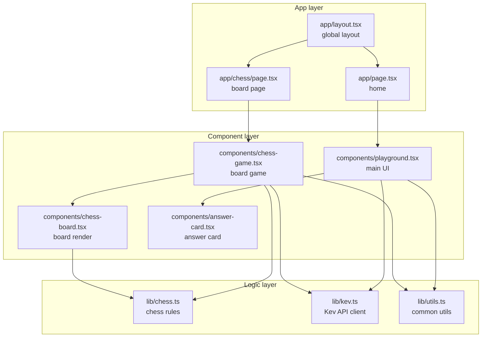
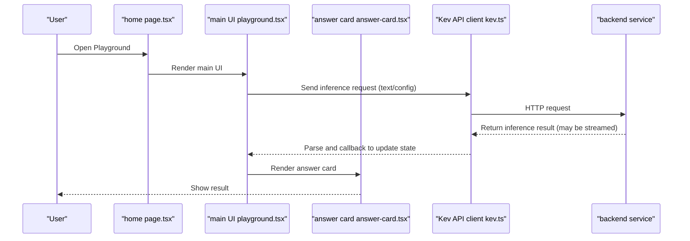
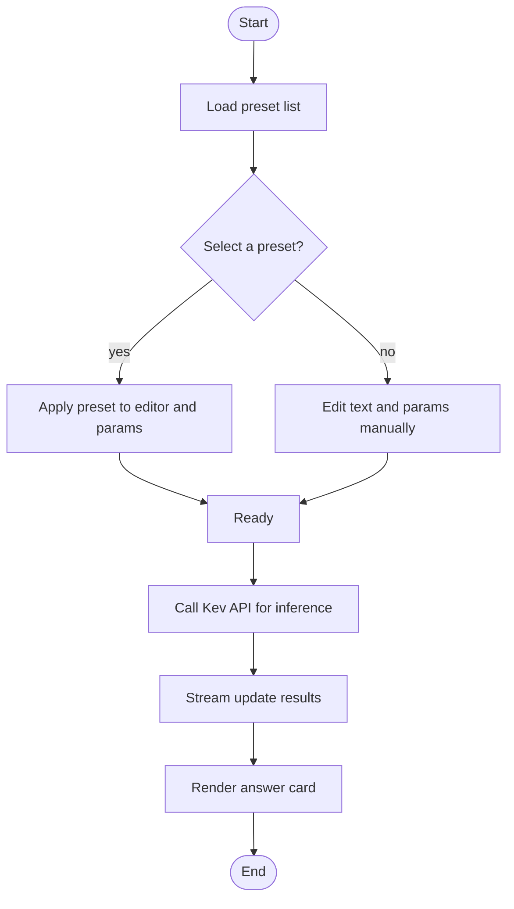
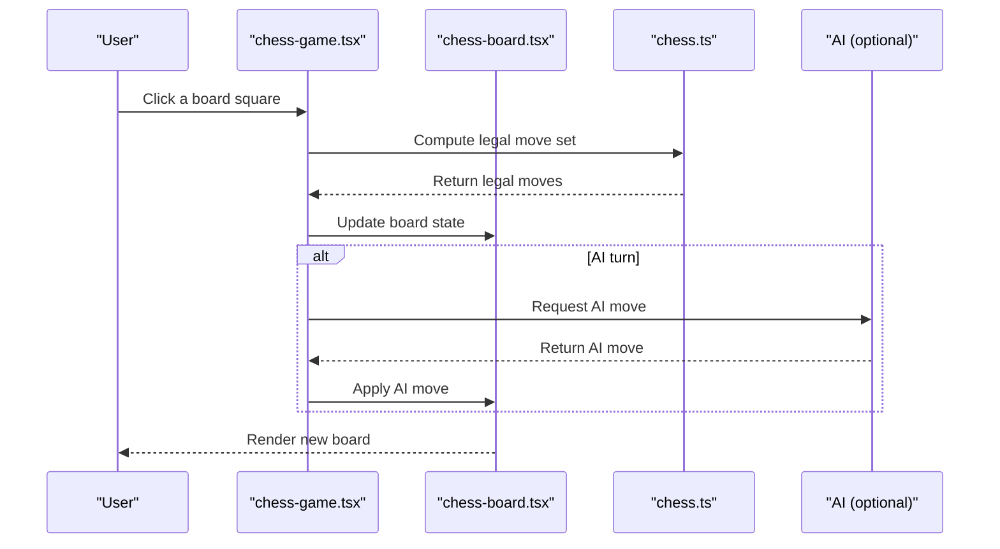
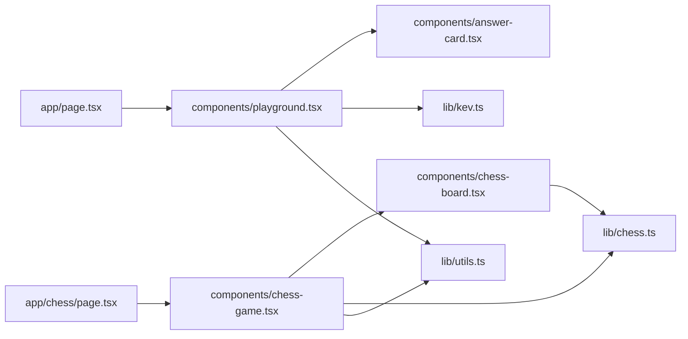

## Table of Contents
1. Introduction
2. Project Structure
3. Core Components
4. Architecture Overview
5. Detailed Component Analysis
6. Dependency Analysis
7. Performance and UX Optimizations
8. Troubleshooting Guide
9. Conclusion
10. Appendix: Development Environment and Debugging

## Introduction
Playground is Kev's interactive frontend, built with Next.js, TypeScript, and React. It provides preset loading, text editing, question configuration, real-time inference, and result display, and includes a built-in chess board game (with rule validation and AI play). This document is for developers and users, helping you quickly understand the frontend stack, component structure, and backend API interaction logic, and provides guides for extending custom presets and the board game.

## Project Structure
Playground uses the Next.js App Router for pages, React components split by function under components, and business logic and utilities under lib. Key directories and responsibilities:
- src/app: Next.js route entries and global layout
- src/components: UI and feature components (main UI, board game, answer cards, etc.)
- src/lib: domain logic (chess rules), API client, and common utilities
- public: static assets
- scripts: helper scripts (e.g. evaluation scripts)

## Core Components
- Main UI component playground.tsx: preset loading, text editing, question parameter config, calling the Kev API for inference, and result display (via answer-card.tsx).
- Board game component chess-game.tsx: manages game state, turn advancement, AI moves, and user interaction.
- Board render component chess-board.tsx: renders squares and pieces from board state and handles click events.
- Answer card component answer-card.tsx: displays inference results and metadata in a structured way.
- Chess rules library chess.ts: board representation, move generation, legality checks, win/loss determination.
- Kev API client kev.ts: wraps request sending, streaming response handling, error handling, and retry strategy.
- Utils library utils.ts: common helpers (formatting, debounce, type guards, etc.).

## Architecture Overview
Playground follows a "page → component → logic" layered architecture. Page components handle routing and container logic; feature components compose UI and state; the lib layer provides reusable domain logic and network clients.

## Detailed Component Analysis

### Main UI Component (playground.tsx)
- Key points
  - Preset loading: load preset templates from local or remote, with selection and switching.
  - Text editing: an input area for writing prompts or task descriptions.
  - Question config: exposes model parameters (e.g. temperature, max length) for the user to adjust.
  - Real-time inference: calls the Kev API client to send requests, supports streaming incremental display.
  - Result display: renders inference results into answer cards, supports copy, share, etc.
- State design
  - text content, selected preset, model parameters, inference state (loading/done/error), result data.
- Interaction flow
  - user edits text and parameters → trigger inference → stream update → render answer card.

### Board Game Component (chess-game.tsx)
- Key points
  - Game lifecycle: init, turn advancement, win/loss determination, reset.
  - User interaction: click to select a piece, highlight legal moves, confirm the move.
  - AI play: call AI move logic at the right moment (can integrate with the Kev API).
  - State sync: keep the view consistent with chess-board.tsx.
- State design
  - board state, side to move, move history, game status (in progress / ended), AI mode toggle.
- Interaction flow
  - user click → validate move legality → update board → if AI turn, auto-move.

### Board Render Component (chess-board.tsx)
- Key points
  - Draw squares and pieces from board state.
  - Handle click events, pass the selected square coordinate to the parent.
  - Highlight legal move paths and target squares.
- Performance considerations
  - Avoid unnecessary re-renders; update only when state changes.
  - Use stable keys and memoization.

### Answer Card Component (answer-card.tsx)
- Key points
  - Structured display of inference results (body, metadata, timestamps, etc.).
  - Supports copy, export, and rating as extended actions.
  - Adapts to different result formats (plain text, JSON, Markdown).
- Interaction design
  - Collapse/expand detailed content.
  - Friendly error messages.

### Chess Rules Library (chess.ts)
- Key points
  - Board representation and coordinate system.
  - Move generation and legality checks (including castling, en passant, promotion).
  - Position evaluation and win/loss determination.
- Complexity and optimization
  - Precompute legal-move tables for performance.
  - Cache position hashes to reduce repeated computation.

### Kev API Client (kev.ts)
- Key points
  - Wraps request sending (GET/POST), supports streaming responses (SSE/ReadableStream).
  - Unified error handling (network exceptions, server errors, timeout retries).
  - Convenience methods: runInference, streamResult, cancelRequest.
- Error handling
  - Distinguishes connection errors, auth errors, and business errors.
  - Provides degradation strategies and user prompts.

### Utils Library (utils.ts)
- Key points
  - Common utilities: debounce, throttle, deep copy, type guards, date formatting.
  - Helper functions paired with UI components (e.g. color mapping, size calculation).

## Dependency Analysis
Dependencies between components and modules:

## Performance and UX Optimizations
- Streaming inference: prefer streaming responses to reduce time-to-first-byte and render answer cards incrementally.
- Component optimization: use React.memo, useMemo, useCallback sensibly to avoid unnecessary re-renders.
- Board rendering: update only changed squares, avoid repainting the whole board.
- Network optimization: request deduplication, timeout control, exponential backoff retries.
- Memory management: release stream readers and timers promptly to prevent leaks.

## Troubleshooting Guide
- Presets fail to load
  - Check the preset data source and CORS configuration.
  - Validate the preset JSON structure and field completeness.
- Inference request fails
  - Inspect the network panel and logs; confirm the backend address and auth.
  - Check whether timeout and retry strategies are reasonable.
- Illegal board move
  - Verify the rule implementation in chess.ts and edge cases (castling, en passant, promotion).
  - Ensure board state and history are consistent.
- Streaming result not updating
  - Check the stream reader's close and error handling.
  - Ensure state updates don't block the UI thread.

## Conclusion
Playground provides a complete interactive inference and board-game experience through clear component layering and a reusable logic library. Its extensible preset mechanism and API client design make it easy to wire in more models and services. The board game has a complete rule implementation and AI play capability, serving as a foundation for further extension.

## Appendix: Development Environment and Debugging
- Requirements
  - Node.js and npm/yarn/pnpm (per the version specified in package.json).
- Install dependencies
  - Run the package manager install command in the project root.
- Start the dev server
  - Run the Next.js dev server and open the localhost port to view the UI.
- Build and preview
  - Run the build command to produce the production bundle, and preview it locally.
- Debugging tips
  - Use browser dev tools to observe network requests and component state.
  - Add logging at key functions to locate the problem chain.
  - For streaming inference, monitor the arrival and parsing of streamed data.
