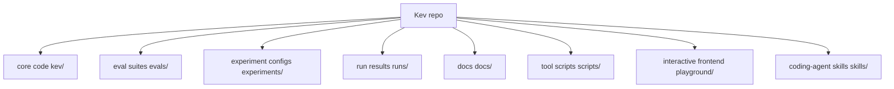
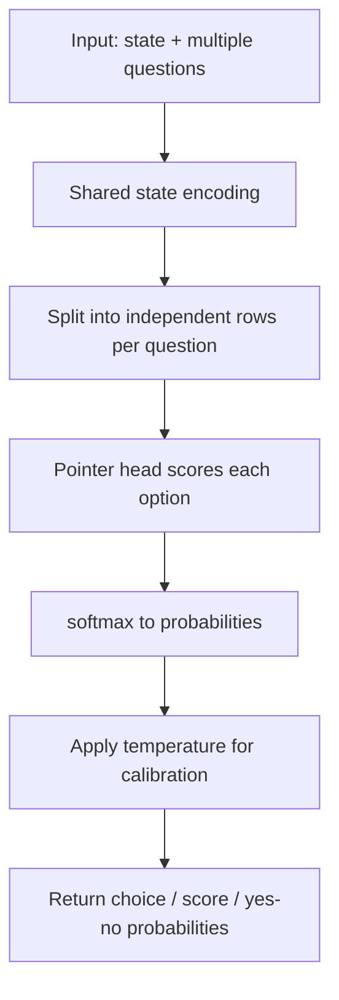
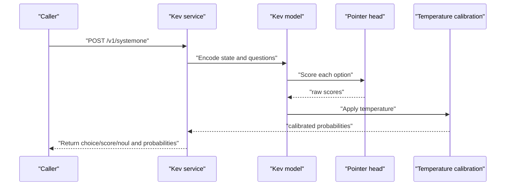
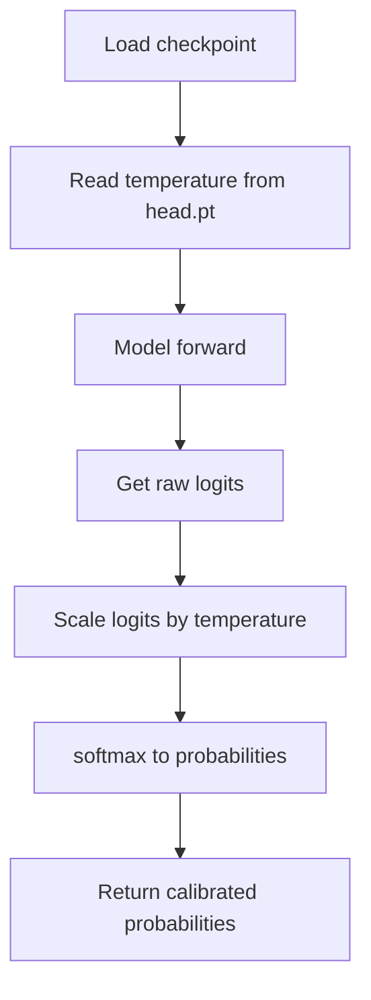
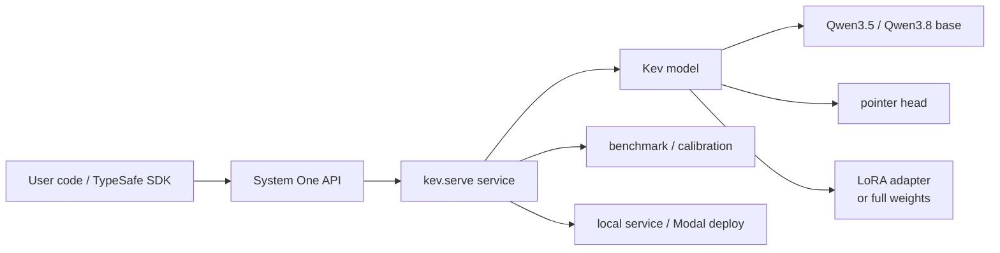

## Table of Contents
1. Introduction
2. Project Structure
3. Core Components
4. Architecture Overview
5. Detailed Component Analysis
6. Dependency Analysis
7. Performance and Hardware Requirements
8. Troubleshooting Guide
9. Conclusion
10. Appendix: Model Sizes and Use Cases

## Introduction
Kev is a family of small decision models whose goal is to let developers train and deploy "text-based decision classifiers" locally. It supports three question types:
- yes/no (noul)
- choice (multiple choice)
- score (rating)

These questions share the same document (state) as input, but cannot read each other. Kev outputs calibrated probabilities by default rather than a single label; this lets the system automate high-confidence requests and route low-confidence ones to human review.

Kev is built on the Qwen3.5 and Qwen3.8 architectures and ships in four sizes:
- Kev-0.8B
- Kev-4B
- Kev-9B
- Kev-27B

Kev's API is compatible with TypeSafe's System One, so it can directly replace Jev's backend without changing caller code. Compared to Jev, Kev's main advantages are:
- locally deployable and fine-tunable
- open weights and evaluation process
- multiple sizes from notebook to datacenter GPU
- built-in temperature calibration for thresholding

## Project Structure
The repo is organized around "model implementation, training, evaluation, serving, experiment records, model cards":
- `kev/`: core Python modules for model loading, inference, training, calibration, evaluation, serving
- `evals/`: frozen evaluation datasets and task suites
- `experiments/`: training plans, experiment configs, release candidates
- `runs/`: many run results, benchmark reports, deployment configs
- `docs/`: model cards, research summaries, declaration manifests
- `scripts/`: data construction, calibration, comparison, report scripts
- `playground/`: browser frontend for interactive testing
- `skills/`: coding-agent skills covering end-to-end flows like fine-tuning and deployment



## Core Components
Kev's core capabilities can be summarized as:

| Dimension | Description |
|---|---|
| Question types | noul, choice, score handled together in one request |
| Probability output | every option has a probability; choice returns the most likely option and confidence; score returns expected level index and confidence |
| Calibration | each checkpoint carries a temperature; calibrated probabilities are returned by default |
| API compatible | implements TypeSafe System One's `/v1/systemone` interface |
| Model sizes | 0.8B, 4B, 9B, 27B for different hardware and precision needs |
| Fine-tuning | LoRA adapter path and full fine-tuning path, with data formats, training commands, eval commands |
| Deployment | local HTTP service, Modal HTTPS endpoint, browser Playground |

## Architecture Overview
Kev is not a generative chat model but a "prefill-only" classification model. Its input is a state and several typed questions; the output is a probability distribution over each question's options.



### Relationship with Jev
- One of Kev's goals is to be a localizable alternative to Jev.
- Kev directly implements the TypeSafe System One protocol, so existing Jev clients can point at the Kev service.
- The README explicitly calls Kev "Jev-like decision models" and stresses "drop-in for Jev".

However, the README also notes this is not a controlled architecture comparison: Jev's training data is unknown, while Kev's evaluation includes both "new source" and "trained source" metrics.

## Detailed Component Analysis

### Model Family and Base
Kev uses Qwen3.5 and Qwen3.8 as bases:
- Kev-0.8B, Kev-4B, Kev-9B: based on Qwen3.5 Base, with LoRA adapter plus pointer head.
- Kev-27B: based on the Qwen3.8 post-trained release, fully fine-tuned, published as bf16 full weights.

```mermaid
classDiagram
class KevFamily {
"decision model family"
"TypeSafe System One compatible"
"calibrated probability output"
}
class Kev0_8B {
"Qwen3.5-0.8B-Base"
"LoRA adapter"
"for low-memory devices"
}
class Kev4B {
"Qwen3.5-4B-Base"
"LoRA adapter"
"balanced accuracy and size"
}
class Kev9B {
"Qwen3.5-9B-Base"
"LoRA adapter"
"higher accuracy"
}
class Kev27B {
"Qwen3.8-27B"
"full fine-tune"
"datacenter GPU"
}
KevFamily --> Kev0_8B : "contains"
KevFamily --> Kev4B : "contains"
KevFamily --> Kev9B : "contains"
KevFamily --> Kev27B : "contains"
```

### Inference Flow
Kev's inference flow includes:
1. Serialize the state and multiple questions into a unified text format.
2. Encode the shared state once.
3. Compute each question separately, so questions don't influence each other.
4. Use the pointer head to score each option's hidden representation.
5. softmax to probabilities.
6. Apply the temperature parameter for calibrated probabilities.



### Calibration Mechanism
Kev stores a temperature parameter in each checkpoint:
- Temperature does not change the argmax, so accuracy is unchanged.
- Temperature reshapes the probability distribution, improving Brier score and calibration error.
- Different models have different fitted temperatures (README notes Kev-4B, Kev-0.8B, Kev-9B, Kev-27B differ in fitting method and source).



### Performance Comparison with Jev
The README provides Kev vs Jev accuracy and Brier on new-source and trained-source. `docs/kev-family-summary.json` further gives transfer_acc and transfer_brier summaries.

| Model | New-source acc | Trained-source acc | New-source Brier |
|---|---:|---:|---:|
| Kev-0.8B | 0.648 / 0.697 | 0.827 / 0.838 | 0.481 / 0.416 |
| Kev-4B | 0.817 / 0.838 | 0.873 / 0.865 | 0.269 / 0.242 |
| Kev-9B | 0.820 / 0.852 | 0.874 / 0.873 | 0.289 / 0.217 |
| Kev-27B | **0.851 / 0.889** | 0.865 / 0.866 | **0.225 / 0.156** |
| Jev | 0.857 / – | 0.845 / – | 0.211 / – |

"development / test" means dev-set and test-set results; lower Brier is better.

## Dependency Analysis
Kev's dependencies fall into three layers:



Key relationships:
- Callers invoke `/v1/systemone` via the TypeSafe SDK or curl.
- The serving layer parses requests, caches state, and processes multiple questions in parallel.
- The model layer chooses the inference path based on whether the base includes Gated DeltaNet.
- The calibration layer applies temperature at load time.
- The deployment layer supports local GPU, Apple Silicon MLX, and cloud Modal.

## Performance and Hardware Requirements
The README provides latency, throughput, and VRAM guidance per model on different GPUs.

| Model | Recommended hardware | Typical use |
|---|---|---|
| Kev-0.8B | Apple Silicon Mac, L4 | small size, resource-constrained scenarios |
| Kev-4B | 32 GB Mac, L40S, H100 | general decision classification, routing |
| Kev-9B | 32 GB Mac, L40S, H100 | higher accuracy, more stable probabilities |
| Kev-27B | B200, H200, H100 80 GB; expected 96–128 GB Mac | highest precision, long docs, production deployment |

The README also gives detailed benchmark tables, including latency for short and multi-turn repeated text, and requests per second under concurrency.

## Troubleshooting Guide
The README's "Troubleshooting" mentions a few common issues:
- MPS out of memory on Apple Silicon: ensure only one training task runs.
- Playground buttons don't work: use `localhost:3001`; Next.js dev hostname checks affect other domains.
- dataset script no longer supported: use `legacy-datasets/banking77`.

In long-term practice also note:
- If probabilities are not trustworthy, first validate thresholds and temperature on your own labeled data.
- If long-document performance drops, consider Kev-27B or recalibrating on your own data.
- If knowledge-type questions perform poorly, realize this is determined by the base model; Kev optimizes decision classification, not general knowledge QA.

## Conclusion
Kev is a small model family aimed at "document decision classification". Through:
- a unified System One API
- calibrated probability output
- multiple model sizes
- local training and deployment

it provides a self-hostable, fine-tunable, auditable alternative to Jev. For beginners, Kev's value is "turning complex decision tasks into a set of interpretable, thresholdable probability problems"; for experienced developers, its value is "open weights, open evaluation, reproducible fine-tuning and serving".

Note:
- Kev is not a chat or generative model.
- Calibrated probability is not equal to true accuracy.
- Different sizes suit different hardware and precision needs.
- The Jev comparison is not a fully controlled experiment, but Kev has clear advantages in deployability and controllability.

## Appendix: Model Sizes and Use Cases

### Model Positioning
| Model | Base | Training | Use case | Hardware floor |
|---|---|---|---|---|
| Kev-0.8B | Qwen3.5-0.8B-Base | LoRA adapter | low-memory devices, quick prototypes, edge | Apple Silicon Mac, L4 |
| Kev-4B | Qwen3.5-4B-Base | LoRA adapter | general decisions, support routing, medium precision | 32 GB Mac, L40S, H100 |
| Kev-9B | Qwen3.5-9B-Base | LoRA adapter | higher accuracy, more stable probabilities | 32 GB Mac, L40S, H100 |
| Kev-27B | Qwen3.8-27B | full fine-tune + weight averaging | high precision, long docs, production | B200/H200/H100 80 GB; expected 96–128 GB Mac |

### When to Choose Kev
- If you already use Jev or TypeSafe System One and want to move serving to local or private cloud, try Kev first.
- If your task is mainly classification, routing, ticket assignment, or policy judgment, Kev is more focused and interpretable than a general LLM.
- If you need probability thresholds to separate "auto-pass" from "human review", Kev's calibrated probabilities are valuable.
- If your data distribution differs greatly from public data, fine-tune with a little labeled data and recalibrate the temperature on your own data.
