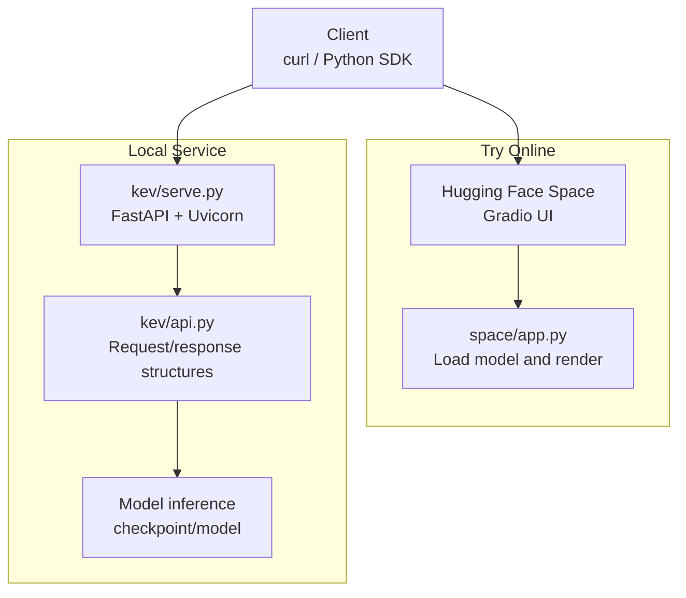

## Table of Contents
1. Introduction
2. Requirements and Installation
3. Try Online
4. Run the Service Locally
5. Sending Requests and Parsing Responses
6. Python SDK Integration Example
7. curl Commands and JSON Request Format
8. Architecture Overview
9. Troubleshooting
10. Conclusion

## Introduction
Kev is a family of small decision models built on Qwen3.5/Qwen3.8, providing a TypeSafe System One compatible `/v1/systemone` API. You can try it online or start the service locally and call it; it also supports connecting to a local Kev service via the Python SDK for inference.

## Requirements and Installation
- Python version: 3.12 or 3.13 (project constraint `>=3.12,<3.14`).
- Package manager: uv.
- Optional dependencies: GPU (CUDA/ROCm) or Apple Silicon (MLX).

Recommended install (from the repo root):
```bash
git clone https://github.com/jaredpalmer/kev.git && cd kev
uv sync --extra serve
```

Notes:
- `--extra serve` installs FastAPI, Uvicorn, the TypeSafe SDK, and other runtime dependencies.
- On first run it automatically downloads the base model and adapter weights.

## Try Online
You can experience Kev-4B and Kev-0.8B directly in a Hugging Face Space without any local installation. The Space provides a visual interface to choose a model, enter state text and question definitions, and returns a probability distribution over each option.

- Entry: Hugging Face Space (use in a browser).
- Capability: a single forward pass outputs probabilities for multiple typed questions (choice/noul/score); no text is generated.
- Consistency: the Space reuses the repo's inference and API code, guaranteeing parity with the local service.

## Run the Service Locally
Start the Kev-4B service in a terminal (default port 8009):
```bash
uv run --extra serve python -m kev.serve --run jaredpalmer/kev-4b --port 8009
```

Key points:
- Automatically detects CUDA/ROCm or Apple Silicon MLX.
- On first run it downloads the adapters and base model.
- `--run` accepts either a local checkpoint directory or a Hub revision name.

After the service starts, send a request from another terminal to test it.

## Sending Requests and Parsing Responses
Use curl to send a request with multiple question types to the local service:
```bash
curl -s localhost:8009/v1/systemone -H 'content-type: application/json' -d '{
  "state": "Shoes arrived two weeks late and in the wrong size. Also I see two charges on my card.",
  "model": "kev-latest",
  "questions": {
    "department":  {"type": "choice", "instructions": "Which team should handle this?",
                    "criteria": {"returns": "Exchanges, refunds, wrong or damaged items",
                                 "shipping": "Delivery status, delays, lost packages",
                                 "billing": "Charges, invoices, payment problems"}},
    "escalate":    {"type": "noul",  "instructions": "Does this need urgent human attention?"},
    "frustration": {"type": "score", "instructions": "How frustrated is the customer?",
                    "criteria": ["Calm", "Frustrated", "Very angry"]}
  }}'
```

Typical response fields:
- `answers`: answers keyed by question ID, including type, confidence, and probability distribution.
- `usage.input_tokens` / `usage.output_tokens`: input and serialized-output token counts.
- `latency_ms`: model-side latency in milliseconds.

## Python SDK Integration Example
If you already use Jev, you can point the client at the local Kev service and keep the rest of your code unchanged. The TypeSafe SDK is installed with `uv sync --extra serve`.

Example flow:
- Create a `TypeSafeClient` with `base_url=http://127.0.0.1:8009`.
- Call `system_one(state=..., questions={...})`.
- Read `nouls`, `choices`, `scores` from the response.

## curl Commands and JSON Request Format
- Endpoint: `POST /v1/systemone`
- Auth: optional. If `KEV_API_KEY` is set, include `Authorization: Bearer <key>` in the request header.
- Request body key fields:
  - `state`: the text or structured content to evaluate (string/object/array).
  - `model`: model name (e.g. `kev-latest`).
  - `questions`: a dictionary of questions, keyed by your own question IDs, with question definitions as values.
- Question types:
  - `noul`: yes/no; the answer is `p(true)`.
  - `choice`: pick one of several; the answer is the most likely option, probability distribution, and confidence.
  - `score`: ordered levels; the answer is the expected level, legend, probability distribution, and confidence.

Other available endpoints:
- `GET /v1/models`: view model info and currently loaded checkpoint details.
- `POST /v1/systemone/permute`: run a single Choice question multiple times with permuted option order.
- `POST /v1/systemone/separate`: run a separate forward pass for each question.

Environment variables (partial):
- `KEV_TEMPERATURE=1.0`: return raw probabilities instead of calibrated ones.
- `KEV_DATE_FACTS=1`: append date-difference facts to the state.
- `KEV_TRUNCATE_STATES=1`: truncate over-long states instead of rejecting, and mark it in the response.
- `KEV_DTYPE=fp32`: use the fp32 path (for evaluation consistency).
- `KEV_API_KEY`: enable Bearer auth.

## Architecture Overview
The diagram below shows how the "Try Online" and "Local Service" paths reuse the same inference and API logic.



## Troubleshooting
- Port conflict: if 8009 is taken, change the `--port` argument.
- Insufficient permissions: if `KEV_API_KEY` is set, ensure the request header carries the correct Bearer token.
- Over-long input: by default returns 422 when exceeding the limit; enable `KEV_TRUNCATE_STATES=1` to truncate instead.
- Performance differences: on Apple Silicon inference is in the hundreds of milliseconds; faster on GPU. Check backend and precision via `/v1/models`.
- Missing dependencies: confirm FastAPI, Uvicorn, and the TypeSafe SDK are installed via `uv sync --extra serve`.

## Conclusion
Hugging Face Space lets you try Kev with zero setup; running locally only needs Python 3.12/3.13 and uv, and a single command starts the service. Then use curl or the Python SDK to send structured questions and get decision results with probabilities and confidence. For production deployment, combine Modal or your own GPU machines to expose an HTTPS endpoint, and control behavior via auth and environment variables.
