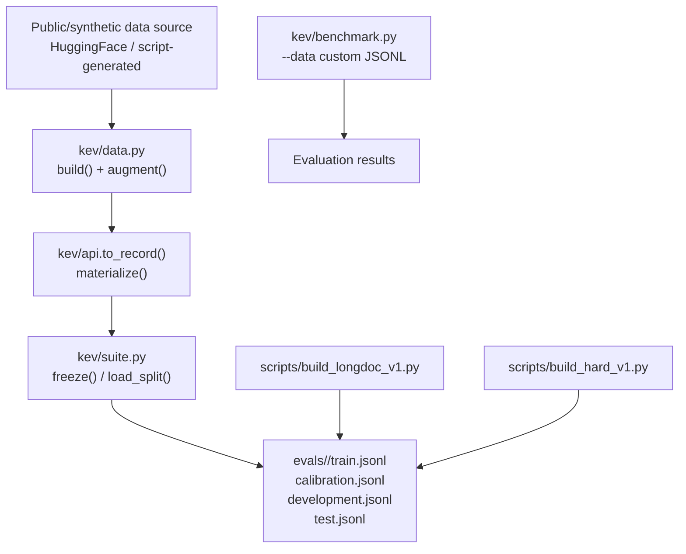
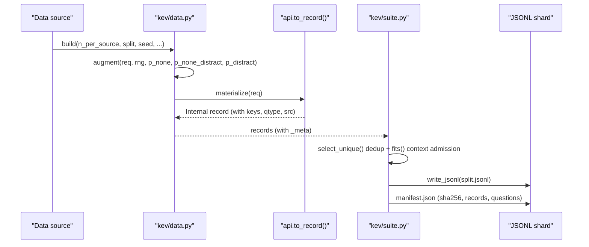
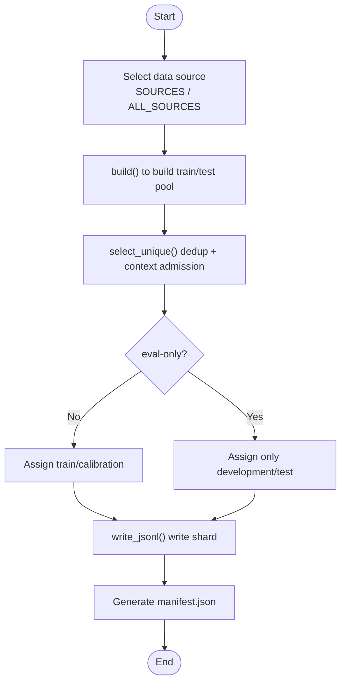
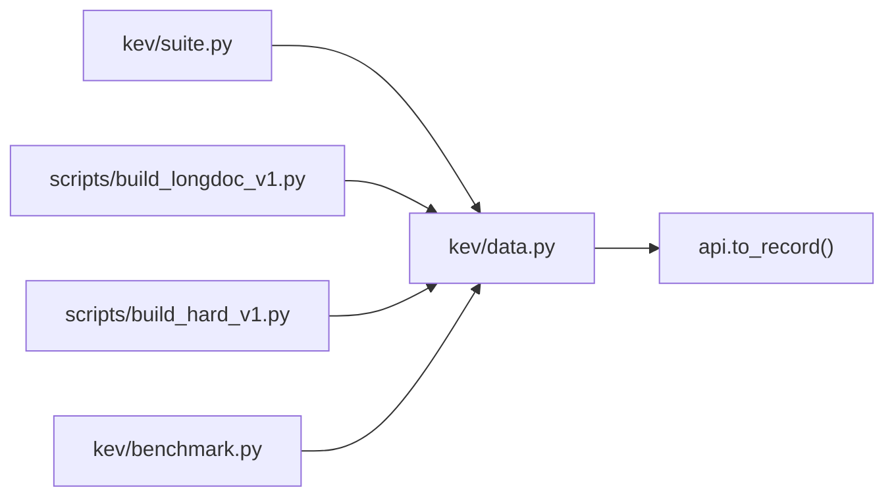

## Table of Contents
1. [Introduction](#introduction)
2. [Project Structure](#project-structure)
3. [Core Components](#core-components)
4. [Architecture Overview](#architecture-overview)
5. [Detailed Component Analysis](#detailed-component-analysis)
6. [Dependency Analysis](#dependency-analysis)
7. [Performance and Scale Characteristics](#performance-and-scale-characteristics)
8. [Troubleshooting Guide](#troubleshooting-guide)
9. [Conclusion](#conclusion)
10. [Appendix: JSONL Specification and Field Dictionary](#appendix-jsonl-specification-and-field-dictionary)

## Introduction
This document targets Kev's data preparation pipeline. Its goal is to help readers understand and correctly build, validate, and use Kev's training and evaluation datasets. The document covers the following points:
- JSONL file format specification: state fields, question types (choice, noul, score), label definitions, and metadata structure.
- Dataset splitting mechanism: generation and freezing flow of the training, calibration, development, and test sets.
- Data augmentation strategies: option permutation, none-option injection, distractor addition, and minimal pair construction.
- Handling of public datasets and synthetic data: source mapping, eval_only restrictions, and filtering rules.
- How to use the custom dataset building and validation tools.
- Data quality checks, format validation, and common issue solutions.

## Project Structure
Kev's data preparation consists of a pipeline of "public/synthetic data source → unified request format → internal record → shard freezing", with the key paths as follows:
- Public data source conversion and augmentation: `kev/data.py`
- Shard freezing, manifest, and load validation: `kev/suite.py`
- Long-document evaluation suite building: `scripts/build_longdoc_v1.py`
- Decision-style evaluation suite building: `scripts/build_hard_v1.py`
- Custom JSONL evaluation entry: `kev/benchmark.py`

**Diagram sources**
- [kev/data.py:298-343](file://kev/data.py#L298-L343)
- [kev/suite.py:316-410](file://kev/suite.py#L316-L410)
- [scripts/build_longdoc_v1.py:348-404](file://scripts/build_longdoc_v1.py#L348-L404)
- [scripts/build_hard_v1.py:179-216](file://scripts/build_hard_v1.py#L179-L216)
- [kev/benchmark.py:177-191](file://kev/benchmark.py#L177-L191)

**Section sources**
- [kev/data.py:1-7](file://kev/data.py#L1-L7)
- [kev/suite.py:19-45](file://kev/suite.py#L19-L45)

## Core Components
This section focuses on the four core modules of data preparation and their responsibilities:
- `kev/data.py`: converts external datasets into Kev's unified request shape; provides augmentation functions; provides custom JSONL reading and API request serialization.
- `kev/suite.py`: responsible for shard freezing, manifest management, partition download, and integrity validation; provides training legality checks.
- `scripts/build_longdoc_v1.py`: builds the long-document evaluation suite (eval-only), dividing the development and test sets by length buckets.
- `scripts/build_hard_v1.py`: builds the decision-style evaluation suite (trainable or eval-only), dividing the three sets by family and template.

**Section sources**
- [kev/data.py:298-411](file://kev/data.py#L298-L411)
- [kev/suite.py:181-220](file://kev/suite.py#L181-L220)
- [scripts/build_longdoc_v1.py:1-32](file://scripts/build_longdoc_v1.py#L1-L32)
- [scripts/build_hard_v1.py:1-24](file://scripts/build_hard_v1.py#L1-L24)

## Architecture Overview
The diagram below shows the end-to-end flow from raw data to the final JSONL shards, including augmentation, materialization, deduplication, context admission, and shard writing.

**Diagram sources**
- [kev/data.py:298-343](file://kev/data.py#L298-L343)
- [kev/data.py:397-411](file://kev/data.py#L397-L411)
- [kev/suite.py:286-304](file://kev/suite.py#L286-L304)
- [kev/suite.py:316-410](file://kev/suite.py#L316-L410)

## Detailed Component Analysis

### JSONL File Format Specification
Kev uses the JSONL format with one JSON object per line to store "annotated requests". Each record contains:
- `state`: the context seen by the model, which can be a string, a structured object, or a conversation list.
- `questions`: a key-value collection of questions, each question containing:
  - `type`: `choice` (single select from multiple options), `noul` (yes/no judgment), `score` (graded rating).
  - `instructions`: the question instruction text.
  - `criteria`: only required for `choice`; a mapping from option name to explanation; `score` may be a grade list; `noul` usually does not require it.
  - `label`: the answer identifier. `choice` is an option name; `noul` is a boolean; `score` is a grade index (starting from 0).
  - `src`: data source marker (optional, auto-filled for custom data).
- `_meta`: metadata, including source, version, ID, group ID, split, and text hash, etc.

Example structure (described in text rather than code):
- A record has `state` and `questions`, where `questions` contains at least one question.
- For a `choice` question, the `label` must equal one of the keys in `criteria`.
- For a `noul` question, the `label` is a boolean value.
- For a `score` question, the `label` is an integer index corresponding to the position in the `criteria` list.

**Section sources**
- [kev/data.py:362-386](file://kev/data.py#L362-L386)
- [kev/data.py:389-411](file://kev/data.py#L389-L411)

### State Fields and Question Types
- State fields support multiple forms: plain text, document objects, ticket objects, conversation history, etc.
- Question types:
  - `choice`: multiple-option selection, requires `criteria` and `label`.
  - `noul`: yes/no question, `label` is boolean.
  - `score`: graded rating, `criteria` is an ordered grade list, `label` is an index.

These types are standardized into an internal representation in `materialize()` for training and evaluation.

**Section sources**
- [kev/data.py:397-411](file://kev/data.py#L397-L411)

### Label Definitions and Metadata Structure
- Label definitions:
  - `choice`: option name.
  - `noul`: boolean value.
  - `score`: grade index.
- Metadata `_meta`:
  - `source`: data source (e.g. `banking77`, `longdoc_cuad`).
  - `variant`: variant (e.g. `clean`).
  - `id`: unique identifier.
  - `group_id`: group identifier (for contrastive pairs or paired samples).
  - `split`: split (e.g. `train`, `development`, `test`).
  - `text_sha256`: hash of the normalized text, used for deduplication.
  - Other fields depend on the data source (e.g. `bucket`, `target_depth`, `family`, etc.).

**Section sources**
- [kev/data.py:312-315](file://kev/data.py#L312-L315)
- [scripts/build_longdoc_v1.py:259-263](file://scripts/build_longdoc_v1.py#L259-L263)
- [scripts/build_hard_v1.py:126-131](file://scripts/build_hard_v1.py#L126-L131)

### Dataset Splitting Mechanism
Kev's shard freezing flow is as follows:
1. Select data sources from `SOURCES` or `ALL_SOURCES`.
2. Call `build()` for each source to obtain the training or test pool.
3. Perform text deduplication and context admission checks via `select_unique()`.
4. Assign to the four shards: `train`, `calibration`, `development`, `test`.
5. Write JSONL and generate `manifest.json`, including sha256, record count, question count, etc.

For eval-only sources (such as MMLU, QNLI, PAWS, SciQ), they do not enter the training set and are used only for development and testing.

**Diagram sources**
- [kev/suite.py:316-410](file://kev/suite.py#L316-L410)
- [kev/data.py:298-317](file://kev/data.py#L298-L317)

**Section sources**
- [kev/suite.py:316-410](file://kev/suite.py#L316-L410)
- [kev/data.py:298-317](file://kev/data.py#L298-L317)

### Data Augmentation Techniques
Kev provides several augmentation strategies, mainly used to improve the model's robustness and generalization:
- Option permutation: each augmentation randomly shuffles the order of `criteria`, preventing the model from learning positional bias of options.
- none-option injection:
  - As the correct answer: remove the original correct option and insert a "none of the above" style option.
  - As a wrong option: keep the original correct option while inserting a none option.
- Distractor addition: randomly select one from a predefined distractor pool and add it to `criteria`.
- Minimal pair construction: generate two variants for a choice question, one containing a none option with none as the answer, and the other removing the original correct option so that none becomes the correct answer.

Augmentation parameters:
- `p_none`: probability of none as the correct answer.
- `p_none_distract`: probability of none as a distractor.
- `p_distract`: probability of adding an irrelevant distractor.

**Section sources**
- [kev/data.py:320-359](file://kev/data.py#L320-L359)

### Public Dataset and Synthetic Data Processing
- Public datasets:
  - Mapped to HuggingFace datasets via `REPOS` and `ALL_REPOS`.
  - Supports parquet branch pinning to ensure reproducibility.
  - Filtering logic: skip records with label=-1, normalize text and compute hash.
- Synthetic data:
  - `scripts/build_longdoc_v1.py` generates tasks such as service agreements, localization, and multi-hop queries.
  - `scripts/build_hard_v1.py` generates tasks such as insurance policy, trade-off decision making, and probabilistic reasoning.
  - All synthetic data is labeled via programmatic solvers, requiring no human annotation.

**Section sources**
- [kev/data.py:16-31](file://kev/data.py#L16-L31)
- [scripts/build_longdoc_v1.py:1-32](file://scripts/build_longdoc_v1.py#L1-L32)
- [scripts/build_hard_v1.py:1-24](file://scripts/build_hard_v1.py#L1-L24)

### eval_only Source Restrictions and Data Filtering Rules
- eval_only sources (such as MMLU, Emotion, TweetEval, QNLI, PAWS, SciQ) do not participate in training and are used only to evaluate transfer capability.
- Training legality check: `validate_training()` rejects training sources that are eval_only or undeclared.
- Data filtering:
  - Skip records with label=-1.
  - Normalize text and compute hash for deduplication.
  - Context admission check: ensure the record does not exceed the maximum branch length under the tokenizer.

**Section sources**
- [kev/data.py:283-291](file://kev/data.py#L283-L291)
- [kev/suite.py:181-197](file://kev/suite.py#L181-L197)
- [kev/data.py:85-97](file://kev/data.py#L85-L97)

### Custom Dataset Building Guide
Users can load a custom JSONL file via `load_records()`, and the format must conform to Kev's request shape:
- Each record must have `state` and `questions`.
- Each question must have a `label`.
- `_meta` is auto-filled, including `source`, `variant`, `id`, `group_id`, `split`, `text_sha256`.

Usage:
- Use the `--data` parameter in `kev/benchmark.py` to specify a custom JSONL file.
- Or load directly via `kev.data.load_records(path, source="custom")`.

**Section sources**
- [kev/data.py:362-386](file://kev/data.py#L362-L386)
- [kev/benchmark.py:177-191](file://kev/benchmark.py#L177-L191)

## Dependency Analysis
Kev's data preparation modules have clear dependencies:
- `kev/data.py` depends on `api.to_record()` for record materialization.
- `kev/suite.py` depends on functions such as `build()` and `materialize()` in `kev.data`.
- The scripts `scripts/build_longdoc_v1.py` and `scripts/build_hard_v1.py` depend on `kev.data.materialize()` and utility functions in `kev.suite`.
- `kev/benchmark.py` depends on `kev.data.load_records()` to support custom data evaluation.

**Diagram sources**
- [kev/data.py:13](file://kev/data.py#L13)
- [kev/suite.py:15](file://kev/suite.py#L15)
- [scripts/build_longdoc_v1.py:39-42](file://scripts/build_longdoc_v1.py#L39-L42)
- [scripts/build_hard_v1.py:31-36](file://scripts/build_hard_v1.py#L31-L36)
- [kev/benchmark.py:21](file://kev/benchmark.py#L21)

**Section sources**
- [kev/data.py:1-14](file://kev/data.py#L1-L14)
- [kev/suite.py:13-17](file://kev/suite.py#L13-L17)
- [scripts/build_longdoc_v1.py:39-42](file://scripts/build_longdoc_v1.py#L39-L42)
- [scripts/build_hard_v1.py:31-36](file://scripts/build_hard_v1.py#L31-L36)
- [kev/benchmark.py:21](file://kev/benchmark.py#L21)

## Performance and Scale Characteristics
- Text deduplication: based on the SHA256 hash of normalized text, ensuring cross-shard deduplication.
- Context admission: uses `fits()` to check whether the record is within the tokenizer's maximum branch length.
- Shard size: large shards (over 10MB) are gitignored, pulled and verified via the Hub mirror.
- Long-document evaluation: divided by 4k, 8k, 16k, 32k, 64k buckets, ensuring both the state and question lines are within budget.

**Section sources**
- [kev/suite.py:286-304](file://kev/suite.py#L286-L304)
- [scripts/build_longdoc_v1.py:46-58](file://scripts/build_longdoc_v1.py#L46-L58)
- [scripts/build_longdoc_v1.py:296-308](file://scripts/build_longdoc_v1.py#L296-L308)

## Troubleshooting Guide
Common issues and solutions:
- Record missing `state` or `questions`: check whether the JSONL format conforms to the specification.
- Question missing `label`: ensure every question has a label.
- eval_only source mistakenly entering the training set: check `trainable_sources` and `eval_only_sources` in `manifest.json`.
- Context exceeded: adjust data augmentation parameters or reduce the number of options.
- Duplicate states: check whether `_meta.text_sha256` is unique.

**Section sources**
- [kev/data.py:372-386](file://kev/data.py#L372-L386)
- [kev/suite.py:181-197](file://kev/suite.py#L181-L197)

## Conclusion
Kev's data preparation pipeline provides a complete toolchain from public data to synthetic data, from augmentation to shard freezing. Through strict format specifications, deduplication mechanisms, and context admission checks, data consistency and reproducibility are ensured. Users can extend custom datasets on top of this framework and evaluate them via `benchmark.py`.

## Appendix: JSONL Specification and Field Dictionary
- `state`: context, supporting string, object, or list.
- `questions`: question dictionary, with keys as question IDs and values as question objects.
- `type`: `choice`, `noul`, `score`.
- `instructions`: question instruction.
- `criteria`: option mapping or grade list.
- `label`: answer identifier, type depends on `type`.
- `_meta`: metadata, including source, version, ID, group, split, text hash, etc.

**Section sources**
- [kev/data.py:362-386](file://kev/data.py#L362-L386)
