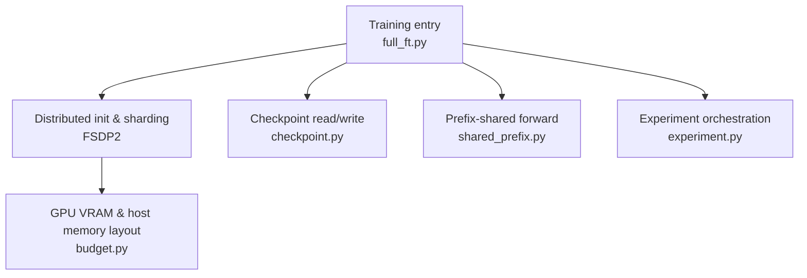
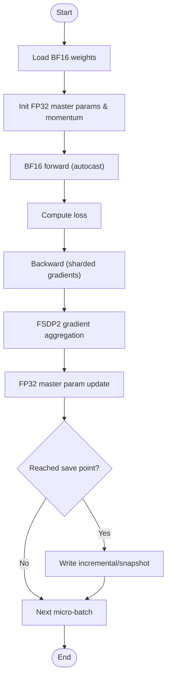
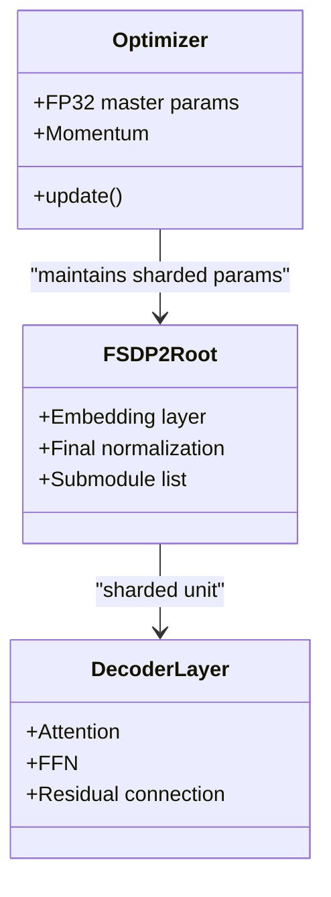
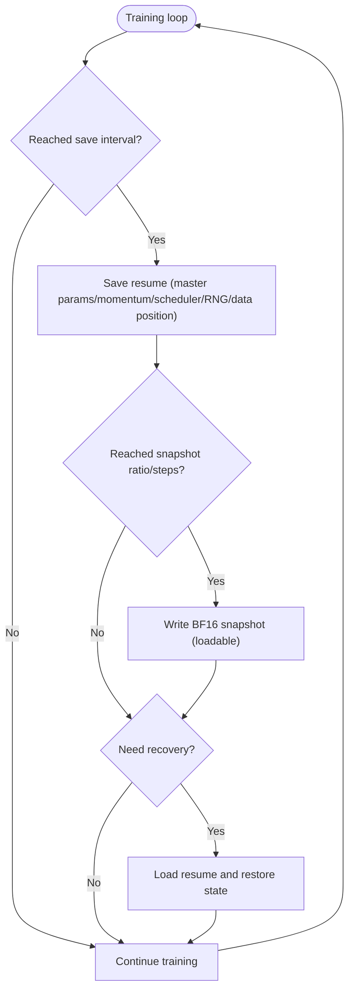
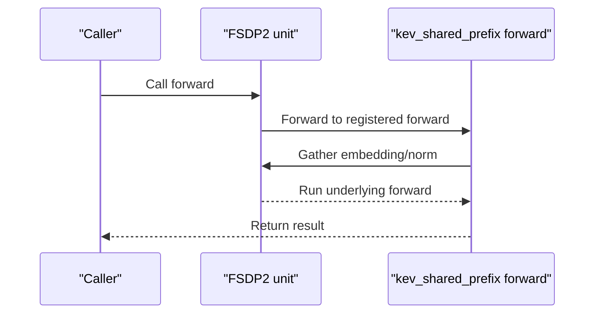
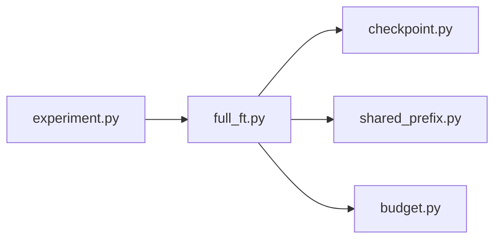

## Table of Contents
1. [Introduction](#introduction)
2. [Project Structure](#project-structure)
3. [Core Components](#core-components)
4. [Architecture Overview](#architecture-overview)
5. [Detailed Component Analysis](#detailed-component-analysis)
6. [Dependency Analysis](#dependency-analysis)
7. [Performance and Resource Planning](#performance-and-resource-planning)
8. [Checkpoint and Recovery](#checkpoint-and-recovery)
9. [Monitoring Metrics and Convergence](#monitoring-metrics-and-convergence)
10. [Performance Tuning Guide](#performance-tuning-guide)
11. [Differences from LoRA Fine-tuning and Selection](#differences-from-lora-fine-tuning-and-selection)
12. [Troubleshooting](#troubleshooting)
13. [Conclusion](#conclusion)

## Introduction
This document targets full fine-tuning of large models such as Kev-27B, and systematically covers the following topics:
- Mixed precision strategy: numerical stability and benefits of BF16 weights + FP32 master parameters during training.
- Distributed training architecture: FSDP2 parallelism, multi-GPU coordination, and parameter sharding mechanisms.
- Training resource requirements: VRAM estimation, GPU count recommendations, and network communication optimization.
- Checkpoint management: incremental saving, snapshot strategy, and recovery mechanisms.
- Monitoring metrics: gradient norm, learning rate scheduling, and convergence analysis.
- Performance tuning: batch size, communication compression, and compute graph optimization.
- Differences from LoRA fine-tuning and selection of applicable scenarios.

## Project Structure
The key code for full fine-tuning is located in the `kev` package, where `full_ft.py` is the core entry point and FSDP2 configuration; `checkpoint.py` handles checkpoint read/write; `shared_prefix.py` provides a prefix-shared FSDP2-compatible forward; `budget.py` describes the layout of state between GPU and host memory; `experiment.py` ties full-parameter training together with torchrun/FSDP2 orchestration.



**Diagram sources**
- [full_ft.py:12-54](file://kev/full_ft.py#L12-L54)
- [checkpoint.py](file://kev/checkpoint.py)
- [shared_prefix.py:25-139](file://kev/shared_prefix.py#L25-L139)
- [budget.py:6](file://kev/budget.py#L6)
- [experiment.py:293](file://kev/experiment.py#L293)

**Section sources**
- [full_ft.py:12-54](file://kev/full_ft.py#L12-L54)
- [shared_prefix.py:25-139](file://kev/shared_prefix.py#L25-L139)
- [budget.py:6](file://kev/budget.py#L6)
- [experiment.py:293](file://kev/experiment.py#L293)

## Core Components
- Full-parameter training entry point and optimizer
  - MasterAdamW: FP32 master parameters and momentum, combined with the BF16 backbone, improving numerical stability and reducing VRAM usage.
  - Supports both host/device placements for the master parameters, facilitating trade-offs under different hardware and scales.
- FSDP2 parallelism
  - Uses capabilities such as shard/rank_share/save_backbone/init_distributed for parameter sharding and cross-device synchronization.
  - Divides the backbone into units by decoder layer, with the root node containing the embedding and final normalization.
- Checkpoint system
  - Incremental saving: saves a resume every N steps (including each rank's FP32 master parameters, momentum, scheduler, random seed, and data position).
  - Snapshot strategy: generates loadable BF16 weight snapshots by step or ratio, for fast rollback and evaluation.
  - Recovery mechanism: restores training state from resume, continuing training without losing progress.
- Prefix sharing
  - Registers a custom forward on the FSDP2 unit via register_fsdp_forward_method, ensuring the embedding and final normalization execute after gather, avoiding redundant computation.

**Section sources**
- [AGENTS.md:45-57](file://AGENTS.md#L45-L57)
- [AGENTS.md:380](file://AGENTS.md#L380)
- [full_ft.py:12-54](file://kev/full_ft.py#L12-L54)
- [full_ft.py:171-186](file://kev/full_ft.py#L171-L186)
- [full_ft.py:316-330](file://kev/full_ft.py#L316-L330)
- [shared_prefix.py:25-139](file://kev/shared_prefix.py#L25-L139)

## Architecture Overview
The diagram below shows the data and control flow of a single FSDP2 full-parameter training step: data reading, micro-batch forward, gradient backward, FSDP2 gather and aggregation, optimizer update, and checkpoint writing.

```mermaid
sequenceDiagram
participant Data as "Data loader"
participant Rank as "Single-rank process (FSDP2)"
participant Model as "FSDP2 sharded model"
participant Opt as "MasterAdamW (FP32)"
participant CKPT as "Checkpoint system"
Data->>Rank : Micro-batch samples
Rank->>Model : Forward (embedding/norm already gathered)
Model-->>Rank : Loss
Rank->>Model : Backward (sharded gradients)
Rank->>Rank : FSDP2 gradient aggregation
Rank->>Opt : Parameter update (FP32 master params)
Opt-->>Rank : New params (sharded)
Rank->>CKPT : Incremental save/snapshot (by policy)
```

**Diagram sources**
- [full_ft.py:171-186](file://kev/full_ft.py#L171-L186)
- [full_ft.py:316-330](file://kev/full_ft.py#L316-L330)
- [shared_prefix.py:91-139](file://kev/shared_prefix.py#L91-L139)

## Detailed Component Analysis

### Mixed Precision and Numerical Stability
- Weights are stored as BF16, reducing VRAM usage and bandwidth pressure.
- The optimizer maintains FP32 master parameters and momentum, improving update stability and avoiding truncation of small gradients.
- The training process uses autocast to control the precision of activations and forward computation, balancing throughput and accuracy.



**Diagram sources**
- [AGENTS.md:45-57](file://AGENTS.md#L45-L57)
- [full_ft.py:171-186](file://kev/full_ft.py#L171-L186)

**Section sources**
- [AGENTS.md:45-57](file://AGENTS.md#L45-L57)
- [docs/model-cards/kev-27b.md:178](file://docs/model-cards/kev-27b.md#L178)

### FSDP2 Parallelism and Parameter Sharding
- Sharding granularity: FSDP2 units are built by decoder layer, with the root node containing the embedding and final normalization.
- Gradient summation: each unit's gradients accumulate locally and are summed in collectives to ensure cross-device consistency.
- State distribution: parameters, gradients, and optimizer state are sharded by rank, reducing per-rank peak VRAM.
- Forward optimization: the embedding and final normalization execute after gather, avoiding redundant computation.



**Diagram sources**
- [full_ft.py:171-186](file://kev/full_ft.py#L171-L186)
- [shared_prefix.py:91-139](file://kev/shared_prefix.py#L91-L139)

**Section sources**
- [full_ft.py:171-186](file://kev/full_ft.py#L171-L186)
- [shared_prefix.py:91-139](file://kev/shared_prefix.py#L91-L139)

### Checkpoint and Recovery Flow
- Incremental saving: saves a resume every N steps, containing each rank's FP32 master parameters, momentum, scheduler, random seed, and data position.
- Snapshot strategy: generates loadable BF16 weight snapshots by step or ratio, for fast rollback and evaluation.
- Recovery mechanism: restores training state from resume, continuing training without losing progress.



**Diagram sources**
- [AGENTS.md:54-57](file://AGENTS.md#L54-L57)
- [full_ft.py:237-240](file://kev/full_ft.py#L237-L240)
- [full_ft.py:316-330](file://kev/full_ft.py#L316-L330)

**Section sources**
- [AGENTS.md:54-57](file://AGENTS.md#L54-L57)
- [full_ft.py:237-240](file://kev/full_ft.py#L237-L240)
- [full_ft.py:316-330](file://kev/full_ft.py#L316-L330)

### Prefix Sharing and FSDP2 Compatibility
- Registers a custom forward method on the FSDP2 unit via register_fsdp_forward_method.
- Ensures the embedding and final normalization execute after gather, avoiding redundant computation and inconsistency.
- Both forward paths call the underlying plain forward, so the FSDP2 unit gathers only once, which helps checkpoint replay.



**Diagram sources**
- [shared_prefix.py:91-139](file://kev/shared_prefix.py#L91-L139)

**Section sources**
- [shared_prefix.py:91-139](file://kev/shared_prefix.py#L91-L139)

## Dependency Analysis
- full_ft.py relies on checkpoint.py for persistence, on shared_prefix.py for an FSDP2-compatible forward, and on budget.py to clarify the layout of state in GPU and host memory.
- experiment.py ties full-parameter training together with torchrun/FSDP2 orchestration, ensuring each container uses all GPUs as FSDP2 ranks.



**Diagram sources**
- [full_ft.py:12-54](file://kev/full_ft.py#L12-L54)
- [experiment.py:293](file://kev/experiment.py#L293)

**Section sources**
- [full_ft.py:12-54](file://kev/full_ft.py#L12-L54)
- [experiment.py:293](file://kev/experiment.py#L293)

## Performance and Resource Planning
- VRAM usage estimation
  - BF16 weights significantly reduce weight VRAM; FP32 master parameters and momentum add a small extra VRAM cost but improve stability.
  - FSDP2 shards parameters, gradients, and optimizer state across multiple devices; per-rank peak VRAM drops roughly linearly with the number of ranks.
  - Activations and the KV cache depend on sequence length and batch size; long context requires attention to KV cache growth.
- GPU count recommendations
  - Kev-27B full fine-tuning is recommended on 8× H200/H100/B200 or other high-end GPUs, per reference docs and practice records.
- Network communication optimization
  - Balance micro-batches: ensure each rank runs the same number of micro-batches to avoid collective alignment issues.
  - Prefix sharing reduces redundant gathers, lowering communication overhead.
  - Set batch size × accumulation steps reasonably so that the effective batch size per step is consistent and bandwidth is fully utilized.

**Section sources**
- [PLAN.md:302](file://PLAN.md#L302)
- [PLAN.md:569](file://PLAN.md#L569)
- [PLAN.md:591](file://PLAN.md#L591)
- [docs/model-cards/kev-27b.md:178](file://docs/model-cards/kev-27b.md#L178)
- [full_ft.py:171-186](file://kev/full_ft.py#L171-L186)

## Checkpoint and Recovery
- Incremental saving
  - Saves a resume every N steps, containing each rank's FP32 master parameters, momentum, scheduler, random seed, and data position.
- Snapshot strategy
  - Generates loadable BF16 weight snapshots by step or ratio, for fast rollback and evaluation.
- Recovery mechanism
  - Restores training state from resume, continuing training without losing progress; if necessary, weights can be loaded from a snapshot for inference or evaluation.

**Section sources**
- [AGENTS.md:54-57](file://AGENTS.md#L54-L57)
- [full_ft.py:237-240](file://kev/full_ft.py#L237-L240)
- [full_ft.py:316-330](file://kev/full_ft.py#L316-L330)

## Monitoring Metrics and Convergence
- Gradient norm
  - Monitor gradient norm to detect gradient explosion or vanishing; Kev-27B training uses gradient norm clipping (e.g. 1.0) to improve stability.
- Learning rate scheduling
  - Uses the OneCycle scheduler, including a warmup phase (e.g. 10%), which helps early stability and later convergence.
- Convergence analysis
  - Observe the loss curve and validation set metrics, and combine gradient norm and learning rate changes to determine whether training has entered a stable convergence range.
  - For long-context tasks, pay attention to the impact of KV cache growth on VRAM and throughput.

**Section sources**
- [docs/model-cards/kev-27b.md:178](file://docs/model-cards/kev-27b.md#L178)

## Performance Tuning Guide
- Batch size optimization
  - Adjust micro-batch and accumulation steps so that the effective batch size per step is consistent; ensure each rank has the same number of micro-batches to avoid collective alignment issues.
- Communication compression
  - Leverage FSDP2's sharding and gather mechanisms to reduce redundant communication; prefix sharing reduces redundant gathers.
- Compute graph optimization
  - Enable fused kernels and CUDA graphs (when available) to improve throughput; pay attention to compatibility with bf16 precision.
- Data and I/O
  - Use efficient data loading and prefetching to avoid I/O becoming a bottleneck; for long-context tasks, manage the KV cache and memory fragmentation.

**Section sources**
- [AGENTS.md:321](file://AGENTS.md#L321)
- [full_ft.py:171-186](file://kev/full_ft.py#L171-L186)
- [shared_prefix.py:91-139](file://kev/shared_prefix.py#L91-L139)

## Differences from LoRA Fine-tuning and Selection
- Full fine-tuning
  - Pros: strong expressive capacity, suitable for domain adaptation and complex tasks; can fully update backbone knowledge.
  - Cons: high VRAM and compute demands, long training time; requires distributed training and mixed precision support.
- LoRA fine-tuning
  - Pros: low VRAM and compute demands, fast training; easy to deploy and switch between multiple adapters.
  - Cons: limited expressive capacity, may underperform full fine-tuning on complex tasks.
- Selection suggestions
  - If resources are sufficient and the task is complex, prefer full fine-tuning; if resources are constrained or fast iteration is needed, choose LoRA.
  - The two can be combined: first use LoRA for quick exploration, then use full fine-tuning to further approach the upper bound.

[This section is conceptual and does not directly analyze specific files]

## Troubleshooting
- Out of memory
  - Check whether BF16 weights and FP32 master parameters are enabled; confirm FSDP2 sharding is in effect; reduce micro-batch or sequence length.
- Training instability
  - Check whether gradient norm clipping is enabled; confirm the learning rate schedule and warmup ratio; monitor gradient norm and the loss curve.
- Corrupted checkpoint or unable to recover
  - Confirm that resume and snapshots are complete; verify dtype and device consistency; if necessary, recover from an earlier resume.
- Communication blocking or low performance
  - Ensure each rank has the same number of micro-batches; check network topology and bandwidth; reduce unnecessary gathers.

**Section sources**
- [AGENTS.md:54-57](file://AGENTS.md#L54-L57)
- [docs/model-cards/kev-27b.md:178](file://docs/model-cards/kev-27b.md#L178)
- [full_ft.py:237-240](file://kev/full_ft.py#L237-L240)

## Conclusion
Full fine-tuning of Kev-27B uses a mixed-precision strategy of BF16 weights and FP32 master parameters, significantly reducing VRAM usage while maintaining numerical stability; with FSDP2's parameter sharding and multi-GPU coordination, a scalable training architecture is achieved. A reasonable checkpoint strategy ensures training recoverability and rollability; through gradient norm, learning rate scheduling, and convergence analysis, training health can be effectively monitored. When resources allow, full fine-tuning yields stronger expressive capacity; when resources are constrained, LoRA is a more economical alternative. In actual deployment, batch size, communication compression, and compute graph optimization should be combined to maximize throughput and stability.
