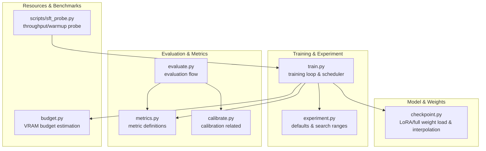
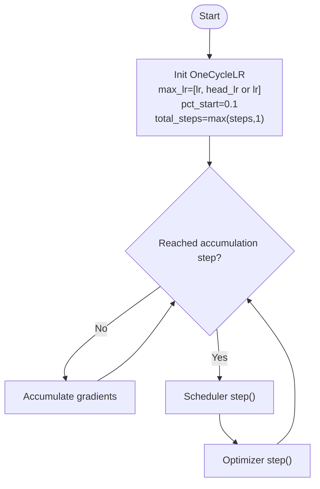
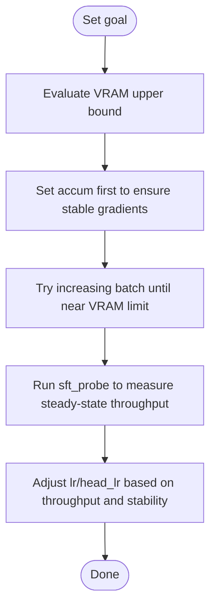
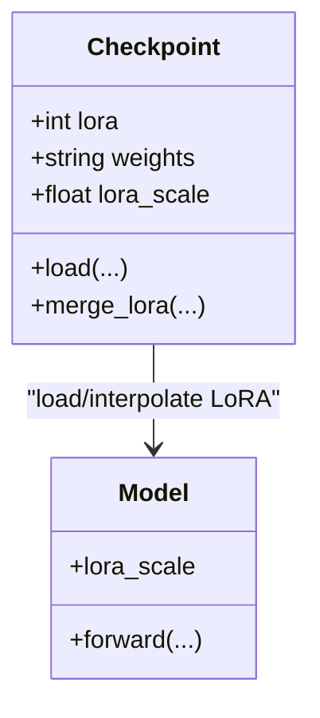
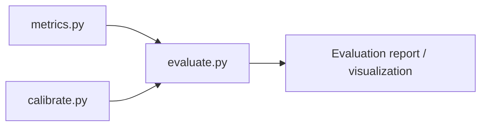
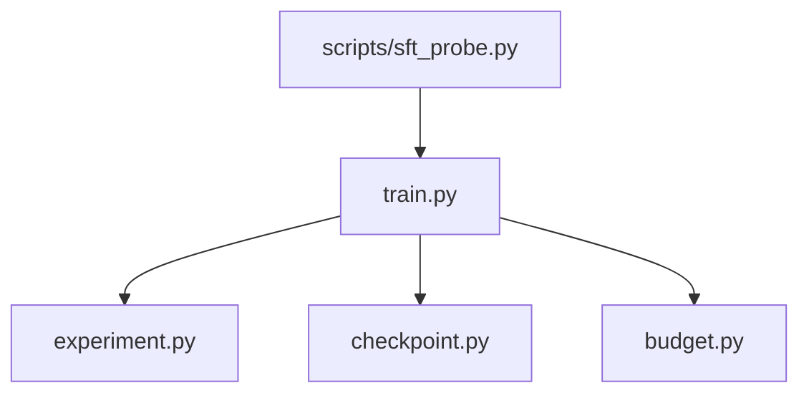

## Table of Contents
1. [Introduction](#introduction)
2. [Project Structure](#project-structure)
3. [Core Components](#core-components)
4. [Architecture Overview](#architecture-overview)
5. [Detailed Component Analysis](#detailed-component-analysis)
6. [Dependency Analysis](#dependency-analysis)
7. [Performance Considerations](#performance-considerations)
8. [Troubleshooting Guide](#troubleshooting-guide)
9. [Conclusion](#conclusion)
10. [Appendix: Reference Configurations and Best Practices](#appendix-reference-configurations-and-best-practices)

## Introduction
This guide is intended for engineers and researchers who use this repository for model fine-tuning and experiments. It systematically explains the mechanism of key hyperparameters, learning rate scheduling strategies, batch size selection principles, evaluation metric systems, and the application of grid search, random search, and Bayesian optimization. It also provides usage suggestions for experiment tracking and result analysis tools, and summarizes best practices and reference configurations for different model scales.

## Project Structure
The key code for hyperparameter tuning is concentrated in the training entry point, experiment defaults and ranges, checkpoint (including LoRA) management, metric computation, and calibration modules; the script layer provides throughput and warmup-related benchmark probes.



**Diagram sources**
- [train.py:580-590](file://kev/train.py#L580-L590)
- [experiment.py:38-42](file://kev/experiment.py#L38-L42)
- [checkpoint.py:54-64](file://kev/checkpoint.py#L54-L64)
- [metrics.py](file://kev/metrics.py)
- [evaluate.py](file://kev/evaluate.py)
- [calibrate.py](file://kev/calibrate.py)
- [budget.py:7-7](file://kev/budget.py#L7-L7)
- [sft_probe.py:6-6](file://scripts/sft_probe.py#L6-L6)

**Section sources**
- [train.py:580-590](file://kev/train.py#L580-L590)
- [experiment.py:38-42](file://kev/experiment.py#L38-L42)
- [checkpoint.py:54-64](file://kev/checkpoint.py#L54-L64)
- [budget.py:7-7](file://kev/budget.py#L7-L7)
- [sft_probe.py:6-6](file://scripts/sft_probe.py#L6-L6)

## Core Components
- Learning rate and scheduling
  - The main learning rate `lr` and head learning rate `head_lr` are passed in as a dual-peak array via OneCycleLR, implementing a single-cycle "warmup + cosine annealing" schedule.
  - Warmup ratio `pct_start=0.1`, i.e. the first 10% of steps rise linearly, then cosine anneal toward near zero.
- Batch size and accumulation
  - `batch` is the actual per-step batch, `accum` is the gradient accumulation steps, effective batch = batch × accum.
  - Under memory-constrained scenarios, prioritize increasing `accum` to maintain stable gradient estimates, then consider increasing `batch`.
- LoRA rank `lora`
  - Controls the rank of the low-rank adapter matrix, affecting the number of trainable parameters and expressive capacity; larger is more flexible but more prone to overfitting and higher memory usage.
- Regularization `weight_decay`
  - L2 regularization term that suppresses overfitting; usually set together with the optimizer and requires coordinated tuning with the learning rate.
- Evaluation metrics
  - Accuracy, calibration error, distribution consistency, etc. are supported by the metrics/evaluate/calibrate modules, used to measure classification quality and probability reliability.

**Section sources**
- [train.py:586-586](file://kev/train.py#L586-L586)
- [experiment.py:38-42](file://kev/experiment.py#L38-L42)
- [checkpoint.py:54-64](file://kev/checkpoint.py#L54-L64)
- [metrics.py](file://kev/metrics.py)
- [evaluate.py](file://kev/evaluate.py)
- [calibrate.py](file://kev/calibrate.py)

## Architecture Overview
The diagram below shows, in a typical training iteration, how hyperparameters drive the scheduler, optimizer, and weight updates, and interact with the LoRA adapter.

```mermaid
sequenceDiagram
participant Runner as "Training entry (train.py)"
participant Exp as "Experiment config (experiment.py)"
participant Opt as "Optimizer"
participant Sch as "OneCycleLR (scheduler)"
participant Model as "Model (with LoRA)"
participant CKPT as "Checkpoint (checkpoint.py)"
Runner->>Exp : Read defaults/ranges (lr, head_lr, batch, accum, lora, weight_decay)
Runner->>Opt : Init optimizer (weight_decay)
Runner->>Sch : Init OneCycleLR (max_lr=[lr, head_lr], pct_start=0.1)
loop Each training step
Runner->>Model : Forward/loss
Runner->>Opt : Backward (accumulate grad)
Opt-->>Runner : Gradients
alt Reached accum steps
Runner->>Sch : step()
Runner->>Opt : step()
Runner->>CKPT : Optional save/merge LoRA
end
end
```

**Diagram sources**
- [train.py:586-586](file://kev/train.py#L586-L586)
- [experiment.py:38-42](file://kev/experiment.py#L38-L42)
- [checkpoint.py:54-64](file://kev/checkpoint.py#L54-L64)

## Detailed Component Analysis

### Learning Rate Scheduling: OneCycleLR Configuration and Behavior
- Dual learning rate
  - `max_lr` accepts an array `[lr, head_lr or lr]`, meaning the backbone and head use different maximum learning rates; if `head_lr` is not specified, it matches `lr`.
- Warmup and annealing
  - `pct_start=0.1` means the first 10% of steps is the warmup phase, then cosine annealing until the end.
- Step upper bound
  - `total_steps=max(steps, 1)`, ensuring at least one scheduling cycle.



**Diagram sources**
- [train.py:586-586](file://kev/train.py#L586-L586)

**Section sources**
- [train.py:586-586](file://kev/train.py#L586-L586)

### Batch Size Selection Principles: Balancing Memory, Stability, and Efficiency
- Memory limits
  - For large models or long context, prioritize increasing `accum` to maintain the gradient stability of the effective batch; `batch` is strictly constrained by memory.
- Gradient stability
  - Small `batch` leads to noisy gradients; increasing `accum` smooths the gradient; too small `accum` amplifies variance.
- Training efficiency
  - Within memory limits, moderately increase `batch` to improve throughput; combine with warmup and scheduling strategy to avoid early oscillations.
- Benchmark probe
  - `sft_probe.py` provides throughput measurement and warmup exclusion logic, facilitating comparison of steady-state throughput under different `batch`/`accum` combinations.



**Diagram sources**
- [budget.py:7-7](file://kev/budget.py#L7-L7)
- [sft_probe.py:6-6](file://scripts/sft_probe.py#L6-L6)

**Section sources**
- [budget.py:7-7](file://kev/budget.py#L7-L7)
- [sft_probe.py:6-6](file://scripts/sft_probe.py#L6-L6)

### The Role and Trade-offs of LoRA Rank `lora`
- Expressive capacity vs overfitting
  - Larger `lora` improves expressive capacity but is more prone to overfitting; smaller `lora` is more robust but may underfit.
- Memory and speed
  - Larger `lora` means more trainable parameters and higher memory and communication overhead.
- Weight loading and interpolation
  - `checkpoint.py` supports identifying and loading LoRA adapters and full weights, and provides `lora_scale` interpolation capability (adjustable at inference time).



**Diagram sources**
- [checkpoint.py:54-64](file://kev/checkpoint.py#L54-L64)
- [checkpoint.py:102-102](file://kev/checkpoint.py#L102-L102)
- [checkpoint.py:122-122](file://kev/checkpoint.py#L122-L122)
- [checkpoint.py:247-252](file://kev/checkpoint.py#L247-L252)
- [checkpoint.py:297-304](file://kev/checkpoint.py#L297-L304)

**Section sources**
- [checkpoint.py:54-64](file://kev/checkpoint.py#L54-L64)
- [checkpoint.py:102-102](file://kev/checkpoint.py#L102-L102)
- [checkpoint.py:122-122](file://kev/checkpoint.py#L122-L122)
- [checkpoint.py:247-252](file://kev/checkpoint.py#L247-L252)
- [checkpoint.py:297-304](file://kev/checkpoint.py#L297-L304)

### Impact of Regularization `weight_decay`
- Suppress overfitting
  - Works with the optimizer to apply L2 penalty to weights; too large may cause underfitting, too small makes overfitting likely.
- Coupled with learning rate
  - High learning rates usually require stronger regularization; lower learning rates can reduce `weight_decay` appropriately.
- Empirical range
  - The experiment defaults and search ranges provide a starting point; local search can be done around them.

**Section sources**
- [experiment.py:38-42](file://kev/experiment.py#L38-L42)

### Evaluation Metrics: Accuracy, Calibration Error, Distribution Consistency
- Accuracy
  - Basic classification correctness, reflecting discriminative ability.
- Calibration error
  - Measures the consistency between predicted probability and true frequency; poor calibration affects decision reliability.
- Distribution consistency
  - Focuses on the stability of model performance under distribution shift or on subsets.
- Toolchain
  - `metrics.py` defines metrics, `evaluate.py` organizes the evaluation flow, `calibrate.py` provides calibration-related capabilities.



**Diagram sources**
- [metrics.py](file://kev/metrics.py)
- [evaluate.py](file://kev/evaluate.py)
- [calibrate.py](file://kev/calibrate.py)

**Section sources**
- [metrics.py](file://kev/metrics.py)
- [evaluate.py](file://kev/evaluate.py)
- [calibrate.py](file://kev/calibrate.py)

## Dependency Analysis
- `train.py` depends on the defaults and search ranges provided by `experiment.py`, and instantiates OneCycleLR in the training loop.
- `checkpoint.py` is responsible for loading, merging, and inference-time scale interpolation of LoRA adapters, reused by training and evaluation.
- `budget.py` provides VRAM budget estimation to assist batch/accum selection.
- `scripts/sft_probe.py` provides benchmark data for throughput and the warmup phase, helping determine warmup steps and steady-state throughput.



**Diagram sources**
- [train.py:586-586](file://kev/train.py#L586-L586)
- [experiment.py:38-42](file://kev/experiment.py#L38-L42)
- [checkpoint.py:54-64](file://kev/checkpoint.py#L54-L64)
- [budget.py:7-7](file://kev/budget.py#L7-L7)
- [sft_probe.py:6-6](file://scripts/sft_probe.py#L6-L6)

**Section sources**
- [train.py:586-586](file://kev/train.py#L586-L586)
- [experiment.py:38-42](file://kev/experiment.py#L38-L42)
- [checkpoint.py:54-64](file://kev/checkpoint.py#L54-L64)
- [budget.py:7-7](file://kev/budget.py#L7-L7)
- [sft_probe.py:6-6](file://scripts/sft_probe.py#L6-L6)

## Performance Considerations
- Throughput and latency
  - Use `sft_probe.py` to measure steady-state step_seconds after warmup, comparing the efficiency of different batch/accum combinations.
- Memory pressure
  - Based on `budget.py`'s VRAM estimation, allocate batch/accum reasonably to avoid OOM.
- Scheduling and convergence
  - OneCycleLR's warmup and cosine annealing help fast convergence and reduce late-stage oscillation; `head_lr` can be tuned separately to improve head convergence speed.

[This section is general guidance and does not directly analyze specific files]

## Troubleshooting Guide
- Training unstable or diverging
  - Check whether `lr` is too large; confirm that OneCycleLR's `pct_start` and `total_steps` are set as expected.
- Out of memory
  - Reduce `batch`, increase `accum`; lower dtype precision or disable unnecessary logging if needed.
- LoRA load failure or mismatch
  - Verify consistency between `--lora_targets` and `adapter_config.json`; check whether `lora_scale` matches the weight type (only valid for adapters).
- Poor calibration
  - Use `calibrate.py` for post-processing calibration; observe calibration error changes and adjust temperature or resampling strategy if necessary.

**Section sources**
- [train.py:586-586](file://kev/train.py#L586-L586)
- [checkpoint.py:247-252](file://kev/checkpoint.py#L247-L252)
- [checkpoint.py:297-304](file://kev/checkpoint.py#L297-L304)
- [calibrate.py](file://kev/calibrate.py)

## Conclusion
- Learning rate scheduling uses OneCycleLR, with dual learning rates supporting differentiated learning for backbone and head; warmup and cosine annealing ensure stable convergence.
- Batch size should follow the "accumulate first, then expand" principle: use `accum` first to ensure gradient stability, then increase `batch` within memory limits.
- LoRA rank needs to be traded off between expressive capacity and overfitting, combined with memory and speed considerations.
- Evaluation should cover accuracy, calibration error, and distribution consistency, forming a multi-dimensional quality profile.
- A systematic tuning methodology includes grid search, random search, and Bayesian optimization, combined with experiment tracking and visualization tools, to iteratively find robust configurations.

[This section is a summary and does not directly analyze specific files]

## Appendix: Reference Configurations and Best Practices

### Key Hyperparameter Quick Reference
- Learning rate
  - `lr`: backbone learning rate; `head_lr`: head learning rate (falls back to `lr` when unspecified).
  - Scheduling: OneCycleLR, `pct_start=0.1`, `total_steps=max(steps,1)`.
- Batch size
  - `batch`: actual per-step batch; `accum`: gradient accumulation steps; effective batch = batch × accum.
- LoRA
  - `lora`: rank; `lora_scale`: inference-time adapter scaling (only valid for adapters).
- Regularization
  - `weight_decay`: L2 regularization strength.

**Section sources**
- [train.py:586-586](file://kev/train.py#L586-L586)
- [experiment.py:38-42](file://kev/experiment.py#L38-L42)
- [checkpoint.py:54-64](file://kev/checkpoint.py#L54-L64)
- [checkpoint.py:102-102](file://kev/checkpoint.py#L102-L102)
- [checkpoint.py:122-122](file://kev/checkpoint.py#L122-L122)

### Best Practices for Different Model Scales
- Small models (e.g. <1B)
  - Can use larger `lr` and smaller `accum`; moderate `lora` rank is sufficient; medium `weight_decay`.
- Medium models (1B–10B)
  - Prioritize `accum` for gradient stability, then gradually increase `batch`; `head_lr` slightly higher than `lr`; adjust `lora` rank with task complexity.
- Large models (>10B)
  - Strictly control memory, prioritize `accum`; conservative `lr`; `lora` rank not too large; set `weight_decay` carefully.

[This section is general guidance and does not directly analyze specific files]

### Systematic Tuning Methodology
- Grid search
  - Suitable for a small number of key hyperparameters (e.g. lr, head_lr, lora), doing fine-grained scanning near the RANGES in `experiment.py`.
- Random search
  - More efficient in high-dimensional spaces, suitable for exploring combinations of lr, weight_decay, and lora.
- Bayesian optimization
  - Using accuracy/calibration error as the objective function, automatically recommends the next set of hyperparameters, suitable for long-term automated experiments.
- Experiment tracking and analysis
  - Record the hyperparameters, metrics, and resource consumption of each run; compare the effects of different strategies and consolidate reproducible configurations.

[This section is general guidance and does not directly analyze specific files]
