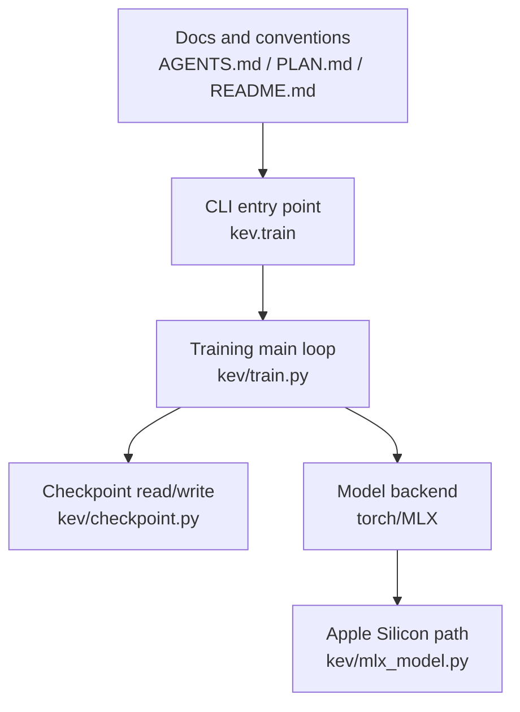
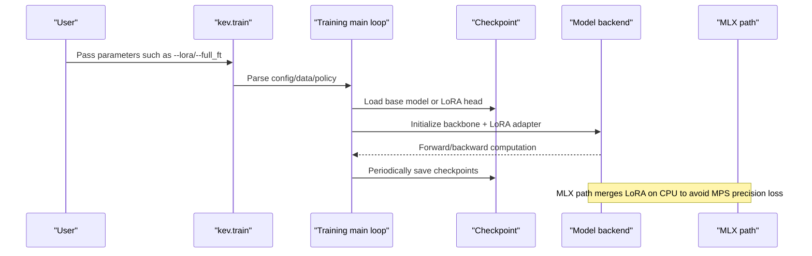
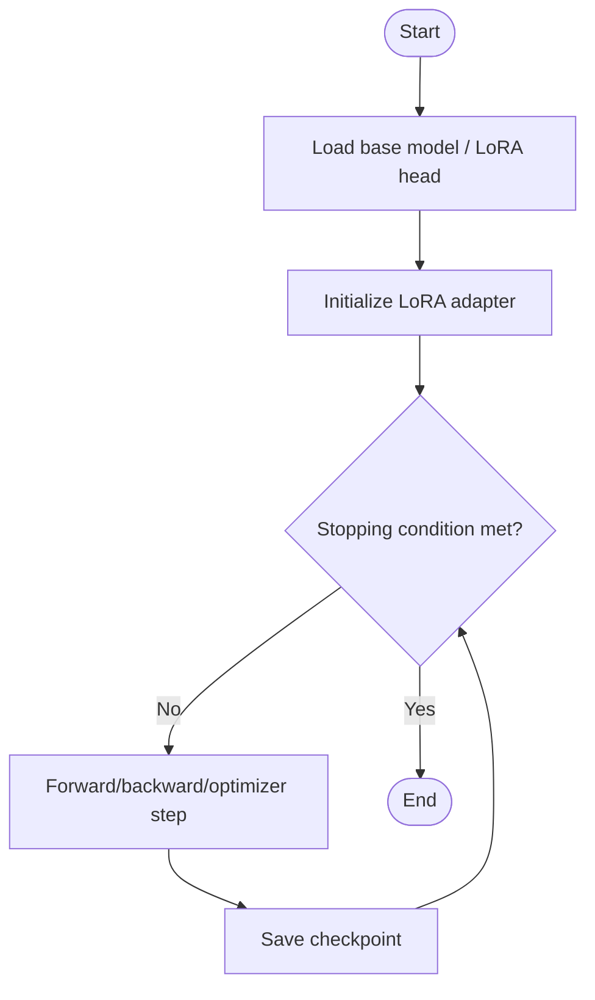
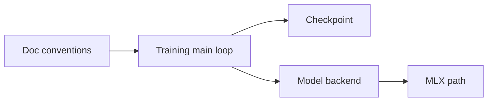

## Table of Contents
1. [Introduction](#introduction)
2. [Project Structure](#project-structure)
3. [Core Components](#core-components)
4. [Architecture Overview](#architecture-overview)
5. [Detailed Component Analysis](#detailed-component-analysis)
6. [Dependency Analysis](#dependency-analysis)
7. [Performance and Optimization](#performance-and-optimization)
8. [Common Issues and Troubleshooting](#common-issues-and-troubleshooting)
9. [Conclusion](#conclusion)
10. [Appendix: Scenario-based Fine-tuning Examples](#appendix-scenario-based-fine-tuning-examples)

## Introduction
This guide is intended for engineers and research users who fine-tune with the Kev repository using LoRA. It systematically covers the following topics:
- LoRA parameter configuration: rank size, target module selection (all/dense/attn/qv), learning rate settings
- Fine-tuning workflow: base model loading, adapter initialization, training loop, checkpoint saving
- Key hyperparameter tuning: learning rate scheduling, batch size, gradient accumulation, weight decay
- Loss function composition: weighting strategies for cross-entropy, Brier score, and focal loss
- Performance optimization: mixed precision, gradient checkpointing, memory management
- Common fault diagnosis and debugging methods

## Project Structure
The Kev repository is built around a full pipeline of "training / inference / evaluation / release". Code directly related to LoRA fine-tuning is concentrated in the `kev` subpackage and orchestrated uniformly through the command-line entry point.

Diagram sources
- [train.py:1-200](file://kev/train.py#L1-L200)
- [checkpoint.py:1-200](file://kev/checkpoint.py#L1-L200)
- [mlx_model.py:1-200](file://kev/mlx_model.py#L1-L200)
- [AGENTS.md:380-420](file://AGENTS.md#L380-L420)

Section sources
- [AGENTS.md:380-420](file://AGENTS.md#L380-L420)
- [PLAN.md:15-30](file://PLAN.md#L15-L30)

## Core Components
- Training entry point and data pipeline
  - Launched via `kev.train`, responsible for parsing training requests, dataset/replay strategies, context filtering, and policy validation, etc.
- Checkpoint system
  - Supports loading/saving of LoRA and full weights; LoRA head and meta information are separated, and full weights are validated for dtype consistency.
- Model backend
  - Dual backends for Torch and MLX; the MLX path performs LoRA merging on the CPU to avoid the fp32 matmul precision degradation issue on MPS.

Section sources
- [AGENTS.md:380-420](file://AGENTS.md#L380-L420)
- [PLAN.md:15-30](file://PLAN.md#L15-L30)

## Architecture Overview
The diagram below shows the overall interaction from the command line to training, checkpointing, and the backend.

Diagram sources
- [train.py:1-200](file://kev/train.py#L1-L200)
- [checkpoint.py:1-200](file://kev/checkpoint.py#L1-L200)
- [mlx_model.py:1-200](file://kev/mlx_model.py#L1-L200)

## Detailed Component Analysis

### LoRA Parameter Configuration
- Rank size (rank)
  - Controls the dimension of the low-rank matrices, affecting the number of trainable parameters and the expressive capacity. Usually start from a small value and gradually increase it based on validation set performance.
- Target modules (target_modules)
  - Supports four modes: all/dense/attn/qv, determining which sub-layers LoRA is injected into. `dense` freezes the DeltaNet projection to reduce unstable updates.
- Learning rate (learning_rate)
  - It is recommended to use warmup together with cosine annealing; LoRA typically uses a smaller learning rate than full fine-tuning to avoid corrupting the pretrained representation.

Section sources
- [AGENTS.md:40-50](file://AGENTS.md#L40-L50)

### Fine-tuning Workflow
- Base model loading
  - Supports loading from the local run directory or a Hub id[@rev]; LoRA and full weights are mutually exclusive, with compatibility checks performed on warm_start.
- Adapter initialization
  - Injects LoRA into the backbone according to target_modules; for the MLX path, fp32 merging is performed later on the CPU.
- Training loop
  - Reads training requests (suite/built/--data+--replay), performs context filtering and policy checks, then enters the standard training iteration.
- Checkpoint saving
  - Saves the LoRA head and meta; full weight saving must satisfy dtype consistency; supports resuming from breakpoints.

Diagram sources
- [train.py:1-200](file://kev/train.py#L1-L200)
- [checkpoint.py:1-200](file://kev/checkpoint.py#L1-L200)

Section sources
- [AGENTS.md:380-420](file://AGENTS.md#L380-L420)

### Key Hyperparameter Tuning
- Learning rate scheduling
  - Warmup + cosine is recommended; the LoRA learning rate is typically 1/10 to 1/5 of that for full fine-tuning.
- Batch size and gradient accumulation
  - Under memory constraints, prioritize increasing the gradient accumulation steps; keep the effective batch size stable.
- Weight decay
  - A smaller weight decay can be used for LoRA parameters to avoid suppressing low-rank updates.

Section sources
- [AGENTS.md:380-420](file://AGENTS.md#L380-L420)

### Loss Function Composition
- Cross-entropy (CE)
  - The main loss term for classification tasks.
- Brier score
  - Can serve as an auxiliary regularization term for calibration tasks or probability output quality assessment.
- Focal Loss
  - Increases the weight of hard samples under class imbalance.
- Weighting suggestions
  - Use CE as the primary term, with Brier/Focal as auxiliary terms; start weights from 0.01~0.1 and adjust based on validation set metrics.

[This section is a generic methodology and does not directly analyze specific files]

### Performance Optimization Tips
- Mixed precision training
  - CUDA/MPS defaults to bf16; can be switched to the fp32 exact path via environment variables.
- Gradient checkpointing
  - Enable for long context or large models to reduce peak memory.
- Memory management
  - The MLX path moves LoRA merging to the CPU stream, avoiding peak usage caused by fp32 matmul precision loss on MPS.

Section sources
- [AGENTS.md:410-420](file://AGENTS.md#L410-L420)
- [mlx_model.py:1-200](file://kev/mlx_model.py#L1-L200)

## Dependency Analysis
- The training entry point depends on the checkpoint system and the model backend; the MLX path is automatically selected only on Apple Silicon and when fp32 is not forced.
- LoRA and full fine-tuning are mutually exclusive; warm_start requires a source hash consistency check.

Diagram sources
- [train.py:1-200](file://kev/train.py#L1-L200)
- [checkpoint.py:1-200](file://kev/checkpoint.py#L1-L200)
- [mlx_model.py:1-200](file://kev/mlx_model.py#L1-L200)
- [AGENTS.md:380-420](file://AGENTS.md#L380-L420)

Section sources
- [AGENTS.md:380-420](file://AGENTS.md#L380-L420)

## Performance and Optimization
- Device and environment
  - CUDA/MPS defaults to bf16; set fp32 if a strict numerical path is required.
- Merging strategy
  - The MLX path performs LoRA merging on the CPU, avoiding bias and peak usage caused by fp32 matmul precision loss on MPS.
- Inference and serving
  - The serving path supports fused and CUDA graphs; after LoRA merging, you can choose to keep it unmerged or fuse it into the backbone.

Section sources
- [AGENTS.md:410-420](file://AGENTS.md#L410-L420)
- [mlx_model.py:1-200](file://kev/mlx_model.py#L1-L200)

## Common Issues and Troubleshooting
- Mixing LoRA and full fine-tuning causes errors
  - Symptom: compatibility check fails on warm_start.
  - Fix: confirm that only LoRA or only full weights are used; do not mix them.
- Checkpoint dtype inconsistency
  - Symptom: dtype mismatch reported when loading full weights.
  - Fix: ensure that the weights_dtype of head.pt matches the dtype in config.json.
- MLX path numerical deviation
  - Symptom: result differences caused by fp32 matmul precision loss on MPS.
  - Fix: perform LoRA merging on the CPU, or switch to the torch path.
- Out of memory
  - Fix: enable gradient checkpointing, reduce batch size, increase gradient accumulation steps.

Section sources
- [AGENTS.md:380-420](file://AGENTS.md#L380-L420)
- [AGENTS.md:410-420](file://AGENTS.md#L410-L420)

## Conclusion
Kev provides a complete LoRA fine-tuning and inference pipeline: from the command-line entry point, the training main loop, the checkpoint system, to the multi-backend model implementation. By configuring LoRA rank, target modules, and learning rate reasonably, and combining mixed precision, gradient checkpointing, and memory management, domain adaptation and skill enhancement can be performed efficiently under limited resources. The LoRA merging strategy of the MLX path further improves usability and stability on Apple Silicon.

[This section is a summary and does not directly analyze specific files]

## Appendix: Scenario-based Fine-tuning Examples
- Domain adaptation
  - Goal: let the model quickly adapt to specific industry terminology and style.
  - Suggestion: small rank (e.g. 4~8), target=all or attn, lr set to 1/2~1/5 of the baseline LoRA, short warmup period.
- Skill enhancement
  - Goal: strengthen a certain type of task (e.g. decision-making / tool calling).
  - Suggestion: target=attn/qv, moderately increase rank (e.g. 8~16), introduce Focal/Brier auxiliary losses, small lr + cosine.
- Multi-task learning
  - Goal: optimize multiple downstream tasks simultaneously.
  - Suggestion: target=dense or attn, use CE as primary with other losses weighted; when batch size is limited by memory, compensate with gradient accumulation.

[This section is a generic methodology and does not directly analyze specific files]
