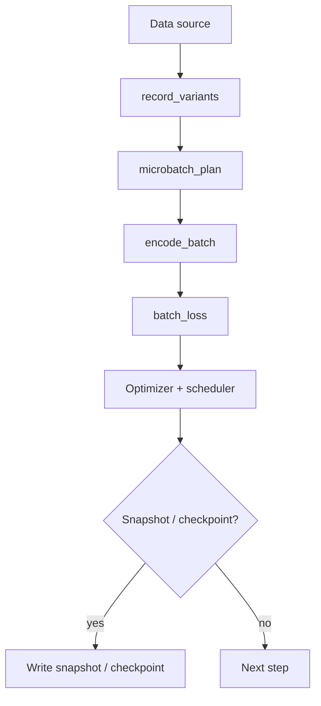
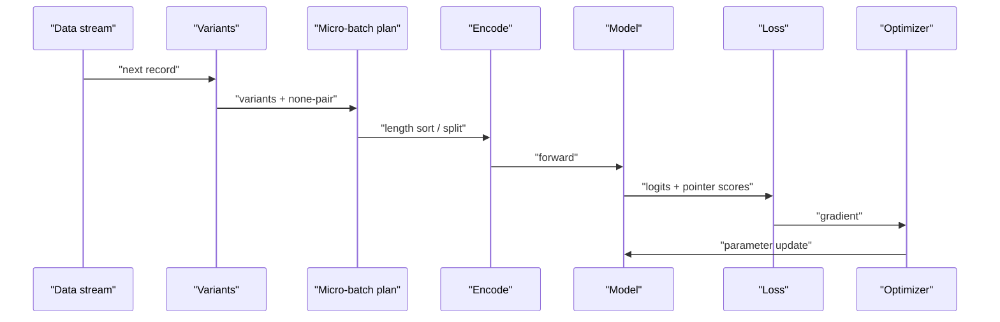
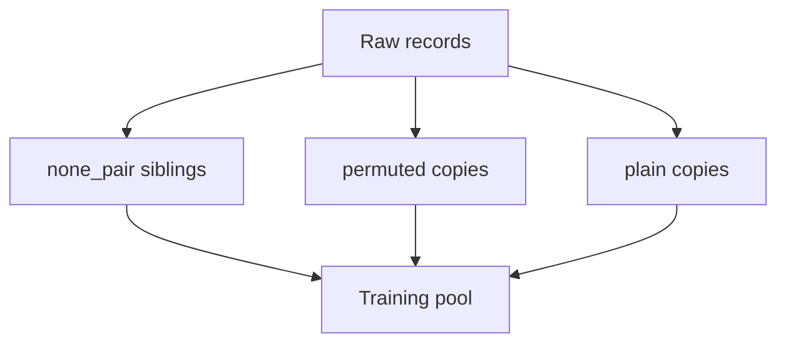
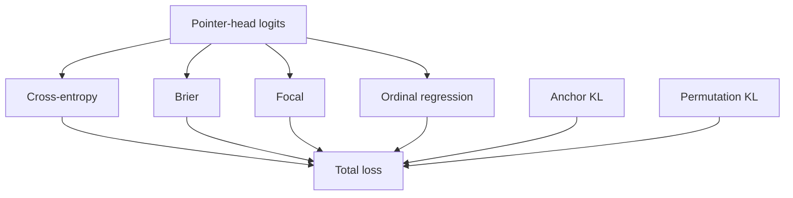

## Table of Contents
1. Introduction
2. Overall Design
3. Data Flow
4. Key Modules
5. Data and Variants
6. Batches and Memory
7. Loss and Optimization
8. Checkpoints and Snapshots
9. Distributed and Resume
10. Experiment Management
11. Troubleshooting
12. Conclusion

## Introduction
Kev's training framework is a unified training system covering LoRA adapter fine-tuning and full fine-tuning. Its goal is to let developers fine-tune decision models on their own data with reproducible commands, and to export checkpoints that can be loaded directly by the serving layer. This document covers the overall design, data flow, key modules, and the responsibilities of the loss, optimizer, checkpoint, and distributed components.

## Overall Design
The framework is organized around "data → variants → micro-batch plan → encode → loss → optimizer → checkpoint":
- A frozen suite or custom JSONL is the data source.
- record_variants generate augmented copies, including none-pair siblings for yes/no balance.
- microbatch_plan controls padded tokens via length sorting or budget splitting.
- encode_batch strictly encodes state and questions into a unified sequence.
- batch_loss computes the loss per question, with optional calibration/permutation/anchor regularizers.
- The optimizer (MasterAdamW or AdamW) and scheduler drive parameter updates.
- Checkpoints and staged snapshots persist results and support resume.

## Data Flow
A typical training step:
1. Read a record from the data stream.
2. Build variants and none-pair siblings.
3. Build the micro-batch plan (length sort / budget split).
4. Encode into a unified sequence with block-causal mask.
5. Forward pass, compute the pointer-head loss per question.
6. Backward, gradient clipping, optimizer step.
7. Periodically write snapshots or checkpoints.

## Key Modules
- data/suite: load frozen suites, custom JSONL, and replay sampling; filter eval-only sources.
- training_requests: orchestrate data loading and variant construction.
- microbatch_plan / row_passes: control padded tokens and per-question row splitting.
- encode_batch: strict encoding with mask and option isolation.
- batch_loss / question_loss: CE/Brier/Focal/ordinal regression losses.
- full_ft: full fine-tuning path, MasterAdamW, fp32 master weights.
- snapshot / checkpoint: staged snapshots and resume.

## Data and Variants
- Data sources: frozen suite, custom JSONL (`--data`), or built on the fly from public sources (`--n_per_source`).
- Augmentation: none_pair builds yes/no balanced siblings from each record's own stream; permuted_copy builds permutation copies for permutation KL.
- Filtering: eval-only sources are excluded from training; holdout sets are reserved for evaluation.

## Batches and Memory
- length_sort: sort records by length and balance micro-batches by padded cost, so no rank waits long on another.
- pass_tokens_max: cut each step on exact token shapes; a pass over the budget is split until none exceeds it.
- row_budget: split a record that does not fit by question (single-GPU row form).
- These controls cap peak VRAM and avoid out-of-memory on long documents.

## Loss and Optimization
- question_loss supports cross-entropy, Brier, Focal, and ordinal regression (score).
- Optional regularizers: anchor_loss (KL toward the frozen base's zero-shot answers) and permutation_kl (permutation invariance).
- Optimizer: MasterAdamW for full fine-tuning (fp32 masters + moments), AdamW for LoRA; OneCycleLR scheduler; gradient clipping.

## Checkpoints and Snapshots
- Checkpoints: save the full model plus head.pt (pointer head and temperature) and meta (base, lora, head_dim, weights_dtype, holdout).
- Snapshots: staged, written at fractions of optimizer steps; never deleted; support resume.
- Interpolation: interpolate_checkpoint.py supports WiSE-FT style linear interpolation.

## Distributed and Resume
- Full fine-tuning runs under torchrun on every GPU of the container.
- Resume: writes a resume point every interval; `--resume 1` continues bit for bit.
- Continuations: on timeout, a watch process spawns the next attempt within a lease ledger.

## Experiment Management
- experiments/*.json define training plans; study scripts drive multi-round experiments on Modal.
- runs/<name>/training_config.json records parameters, suite sha256, base revision, init_source.
- metrics and grad_norm are summarized in training_metrics.json.

## Troubleshooting
- Out of memory: lower batch/accum, enable length_sort, or reduce pass_tokens_max.
- Slow convergence: check learning rate, data filtering, and anchor/permutation weights.
- Mask errors: enable option_isolation and verify encode_batch strictness.
- Resume mismatch: ensure the same arguments and world size as the original run.

## Conclusion
Kev's training framework provides a reproducible, memory-bounded, and extensible path from data to deployable checkpoints. Through variant construction, micro-batch planning, flexible loss, and complete checkpoint/snapshot/resume support, developers can fine-tune on their own data and integrate with the serving and evaluation layers.
