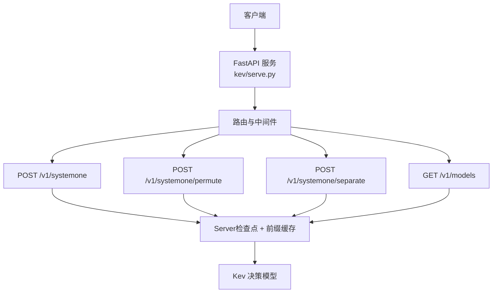
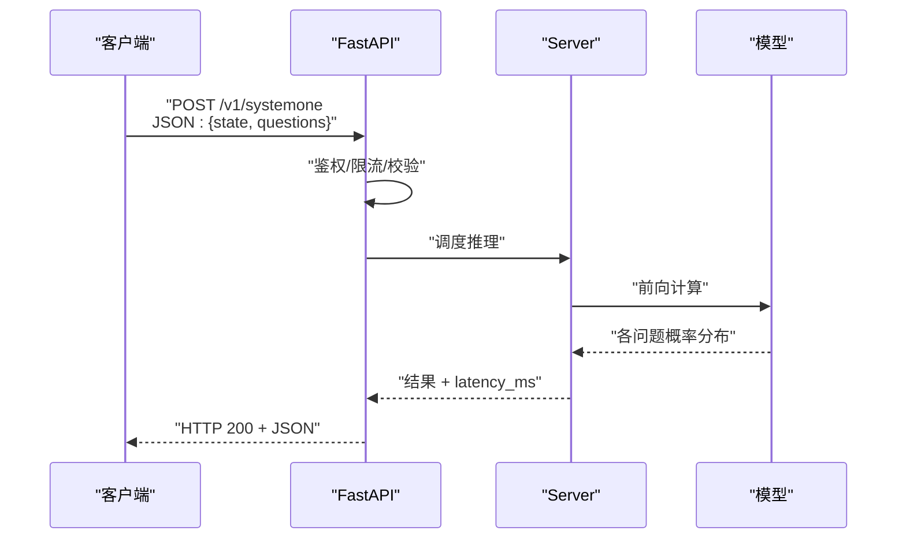
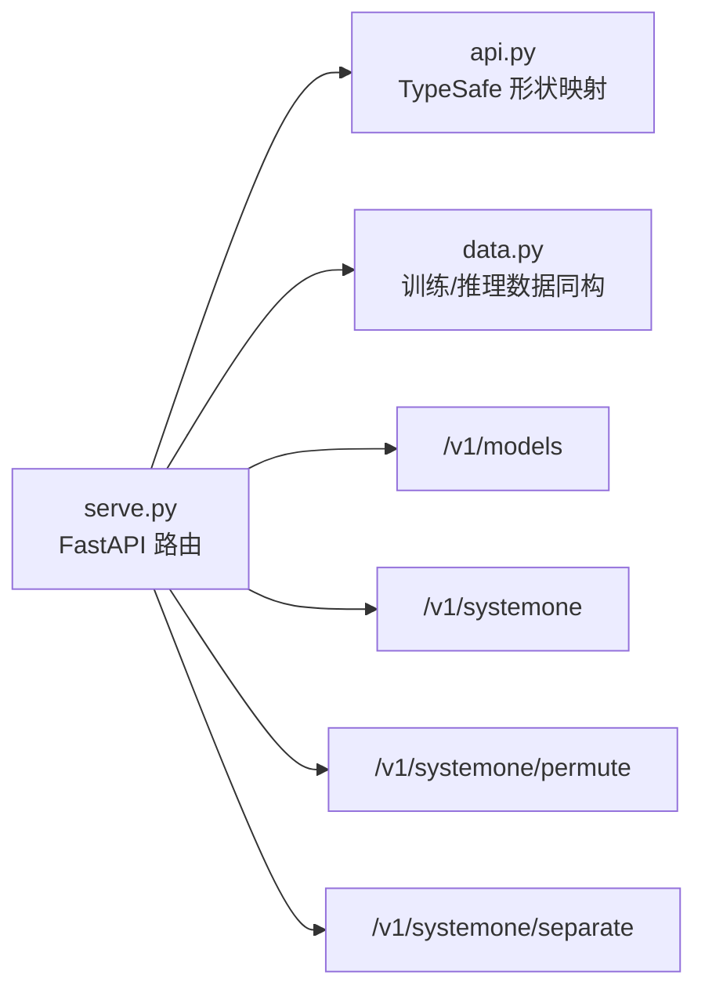

<cite>
**本文引用的文件**   
- [README.md](file://README.md)
- [AGENTS.md](file://AGENTS.md)
- [api.py](file://kev/api.py)
- [serve.py](file://kev/serve.py)
- [data.py](file://kev/data.py)
</cite>

## 目录
1. [简介](#简介)
2. [项目结构](#项目结构)
3. [核心组件](#核心组件)
4. [架构总览](#架构总览)
5. [详细端点说明](#详细端点说明)
6. [依赖关系分析](#依赖关系分析)
7. [性能与精度说明](#性能与精度说明)
8. [错误处理与状态码](#错误处理与状态码)
9. [客户端实现指南](#客户端实现指南)
10. [常见问题排查](#常见问题排查)
11. [结论](#结论)

## 简介
本文件为 Kev 的 RESTful API 提供完整参考，重点覆盖以下端点：
- POST /v1/systemone（主推理端点）
- GET /v1/models（模型信息）
- POST /v1/systemone/permute（选项顺序扰动）
- POST /v1/systemone/separate（逐题独立前向）

Kev 是一个“决策模型”服务：输入一份文档（state）和一组带类型的问题（questions），在一次前向中返回每个问题的概率分布。它不生成文本，而是输出可阈值化的置信度，便于分类、路由、分流或人工复核。

该 API 兼容 TypeSafe 的公开 System One 契约，并可通过 `typesafe-sdk` 直接调用。

**章节来源**
- [README.md:215-247](file://README.md#L215-L247)
- [AGENTS.md:309-334](file://AGENTS.md#L309-L334)

## 项目结构
与本 API 相关的代码主要位于以下模块：
- kev/api.py：定义 TypeSafe 兼容的请求/响应形状映射到单一指针原语
- kev/serve.py：FastAPI 应用，注册 /v1/systemone、/v1/systemone/permute、/v1/systemone/separate 以及 /v1/models；Server 持有检查点与 prefix cache
- README.md：面向用户的接口说明与示例
- AGENTS.md：认证、额外端点、并发与延迟字段等补充说明
- kev/data.py：训练格式与 /v1/systemone 请求体保持一致，确保推理与训练数据同构

**图表来源**
- [serve.py](file://kev/serve.py)
- [api.py](file://kev/api.py)

**章节来源**
- [AGENTS.md:398](file://AGENTS.md#L398)
- [api.py](file://kev/api.py)

## 核心组件
- FastAPI 服务层：负责 HTTP 路由、鉴权、请求校验、并发控制与响应封装
- Server：封装模型加载、前向执行、prefix cache 与运行统计
- 请求/响应形状：遵循 TypeSafe 的 System One 契约，将复杂结构映射到单一指针原语进行高效推理

关键职责划分：
- 路由层：解析 URL、方法、头部与 JSON 体
- 业务层：构造 state/questions、调度模型推理、计算置信度与概率分布
- 基础设施层：GPU/Mac 设备选择、bf16/fp32 精度路径、并发锁与延迟统计

**章节来源**
- [AGENTS.md:398](file://AGENTS.md#L398)
- [api.py](file://kev/api.py)

## 架构总览
下图展示一次典型 /v1/systemone 请求的处理流程：

**图表来源**
- [serve.py](file://kev/serve.py)
- [api.py](file://kev/api.py)

## 详细端点说明

### 通用约定
- 内容类型：application/json
- 版本前缀：/v1
- 认证：当设置环境变量 KEV_API_KEY 时启用 Bearer Token 认证；未设置时为开放服务器
- 响应头：每次响应包含 x-typesafe-request-id
- 延迟字段：/v1/systemone 响应中包含 latency_ms

**章节来源**
- [AGENTS.md:309-334](file://AGENTS.md#L309-L334)

### POST /v1/systemone
用途：接收一份 state 与一组 questions，返回每个问题的概率分布与置信度。

- 方法：POST
- URL：/v1/systemone
- 认证：可选（取决于是否设置 KEV_API_KEY）
- 请求体关键字段：
  - state：string | object | array
    - string：纯文本文档
    - object：结构化文档（键值对）
    - array：文档片段数组
  - questions：对象数组，每项为一个问题，支持三种类型：noul、choice、score
- 响应关键字段：
  - 每个问题返回其选项的概率分布与置信度
  - latency_ms：本次请求耗时（毫秒）

questions 结构与 criteria 规则：
- noul：无选项列表的自由回答型问题（由模型给出答案与置信度）
- choice：从给定选项中选择一个或多个（依具体 schema 而定）
- score：对某项指标打分（如 Likert 量表）

注意：
- 该端点为异步处理，内部使用 Server.lock 进行并发控制
- 长 state 会分批以 EAGER_STATES 大小传入 eager state 阶段

建议：
- 在客户端侧对 latency_ms 做监控与告警
- 根据置信度阈值决定是否转人工复核

**章节来源**
- [README.md:215-247](file://README.md#L215-L247)
- [AGENTS.md:309-334](file://AGENTS.md#L309-L334)

### GET /v1/models
用途：获取可用模型卡片与当前加载的检查点详情。

- 方法：GET
- URL：/v1/models
- 认证：同上（受 KEV_API_KEY 影响）
- 响应字段：
  - name：模型名称
  - description：模型描述
  - release_date：发布日期
  - backend：后端信息
  - dtype：精度（bf16 或 fp32）
  - max_state_tokens：最大 state token 数
  - 其他设备与 prefix-cache 统计信息

**章节来源**
- [README.md:245-247](file://README.md#L245-L247)
- [AGENTS.md:309-315](file://AGENTS.md#L309-L315)

### POST /v1/systemone/permute
用途：对 choice 类问题的选项顺序进行扰动，评估稳定性与顺序偏差。

- 方法：POST
- URL：/v1/systemone/permute
- 请求体关键字段：
  - 一个 choice 类型问题
  - n_perm：扰动次数（1 至 64，默认 6）
- 响应：多次扰动下的概率分布对比，用于分析顺序敏感性

**章节来源**
- [README.md:246-247](file://README.md#L246-L247)
- [AGENTS.md:333-334](file://AGENTS.md#L333-L334)

### POST /v1/systemone/separate
用途：将 packed 的多题合并前向改为逐题独立前向，便于比较 packed vs separate 的差异。

- 方法：POST
- URL：/v1/systemone/separate
- 请求体：与 /v1/systemone 一致（state + questions）
- 响应：每个问题单独前向的结果，便于与 packed 模式对比

**章节来源**
- [README.md:246-247](file://README.md#L246-L247)
- [AGENTS.md:333-334](file://AGENTS.md#L333-L334)

## 依赖关系分析
- FastAPI 服务通过路由分发到不同处理器
- 所有推理相关端点共享 Server 实例，统一访问模型与前缀缓存
- api.py 定义了 TypeSafe 兼容的请求/响应形状，保证与 SDK 的兼容性
- data.py 的训练格式与 /v1/systemone 请求体一致，确保推理与训练数据同构

**图表来源**
- [serve.py](file://kev/serve.py)
- [api.py](file://kev/api.py)
- [data.py](file://kev/data.py)

**章节来源**
- [api.py](file://kev/api.py)
- [data.py:389](file://kev/data.py#L389)

## 性能与精度说明
- 设备与精度：
  - GPU 与 Mac 上默认使用 bf16
  - 可通过 KEV_DTYPE=fp32 切换到 fp32 路径以获得与发布评测一致的数值
- 概率差异：
  - GPU 上 bf16 与 fp32 的概率差异不超过约 0.03
  - Mac 上差异不超过约 0.05
  - 顶部答案变化频率约为每 300 题一次
- 并发与延迟：
  - /v1/systemone 为异步处理，内部使用 Server.lock
  - 响应包含 latency_ms，可用于性能监控

**章节来源**
- [README.md:382](file://README.md#L382)
- [AGENTS.md:326-334](file://AGENTS.md#L326-L334)

## 错误处理与状态码
- 认证失败：当启用 KEV_API_KEY 但未提供有效 Bearer Token 时，应返回 401
- 请求体无效：缺少必填字段或类型不符时，应返回 400
- 资源不存在：查询未知模型或参数越界时，应返回 404
- 服务端错误：模型加载失败、前向异常等，应返回 500
- 速率限制：若部署了限流策略，超限时返回 429（需结合网关或中间件配置）

建议：
- 客户端对所有非 2xx 响应进行重试与退避
- 记录 x-typesafe-request-id 以便日志追踪

**章节来源**
- [AGENTS.md:309-334](file://AGENTS.md#L309-L334)

## 客户端实现指南
- 基础 URL：http://127.0.0.1:8009（本地示例）
- 认证：
  - 若服务器设置了 KEV_API_KEY，需在请求头携带 Authorization: Bearer <token>
- SDK：可直接使用 typesafe-sdk，无需修改即可对接 /v1/systemone
- 请求构造：
  - state：string | object | array
  - questions：数组，包含 noul、choice、score 三类问题
- 响应处理：
  - 读取每个问题的概率分布与置信度
  - 根据置信度阈值决定是否转人工复核
  - 记录 latency_ms 用于性能监控

常见用例：
- 文档分类：choice 问题，按最高概率选项分类
- 评分任务：score 问题，按阈值判断等级
- 自由问答：noul 问题，结合置信度过滤低质量回答
- 顺序鲁棒性：使用 /v1/systemone/permute 评估选项顺序对结果的影响
- 模式对比：使用 /v1/systemone/separate 对比 packed vs separate 的差异

**章节来源**
- [README.md:63-247](file://README.md#L63-L247)
- [AGENTS.md:309-334](file://AGENTS.md#L309-L334)

## 常见问题排查
- 无法连接：确认服务已启动且端口可达
- 认证失败：检查 KEV_API_KEY 与 Bearer Token 是否正确
- 请求体错误：确认 state 与 questions 的类型与必填字段
- 概率异常：切换 KEV_DTYPE=fp32 验证是否为精度路径差异
- 延迟过高：检查并发锁与 GPU 负载，必要时扩容或优化 batch

**章节来源**
- [README.md:382](file://README.md#L382)
- [AGENTS.md:326-334](file://AGENTS.md#L326-L334)

## 结论
Kev 的 RESTful API 提供了稳定、高效的决策模型推理能力，兼容 TypeSafe 的 System One 契约。通过 /v1/systemone 及其辅助端点，开发者可以完成分类、评分、自由问答与鲁棒性分析等任务。建议在客户端侧做好认证、限流、重试与监控，并根据置信度阈值设计人机协同流程。