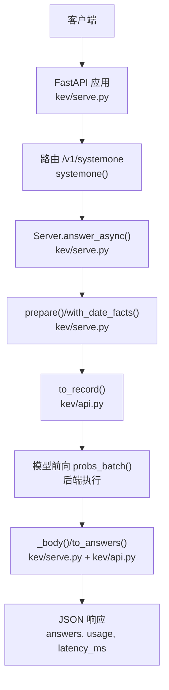
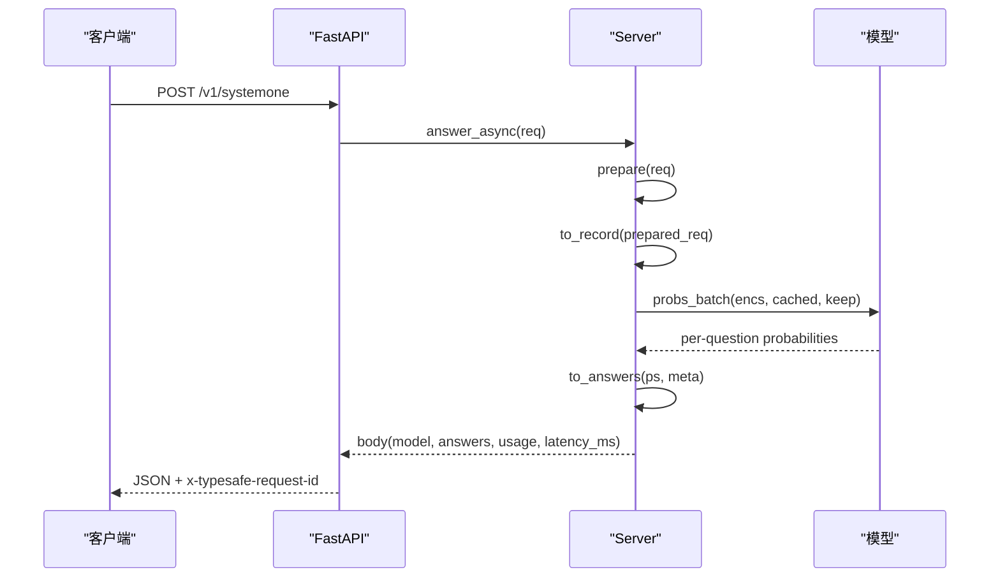
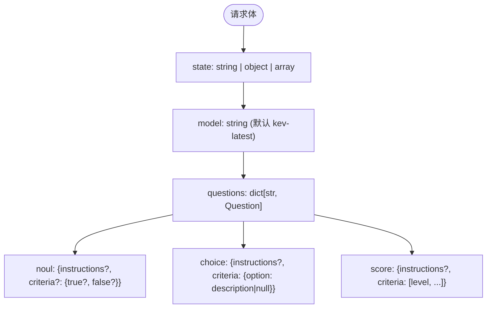
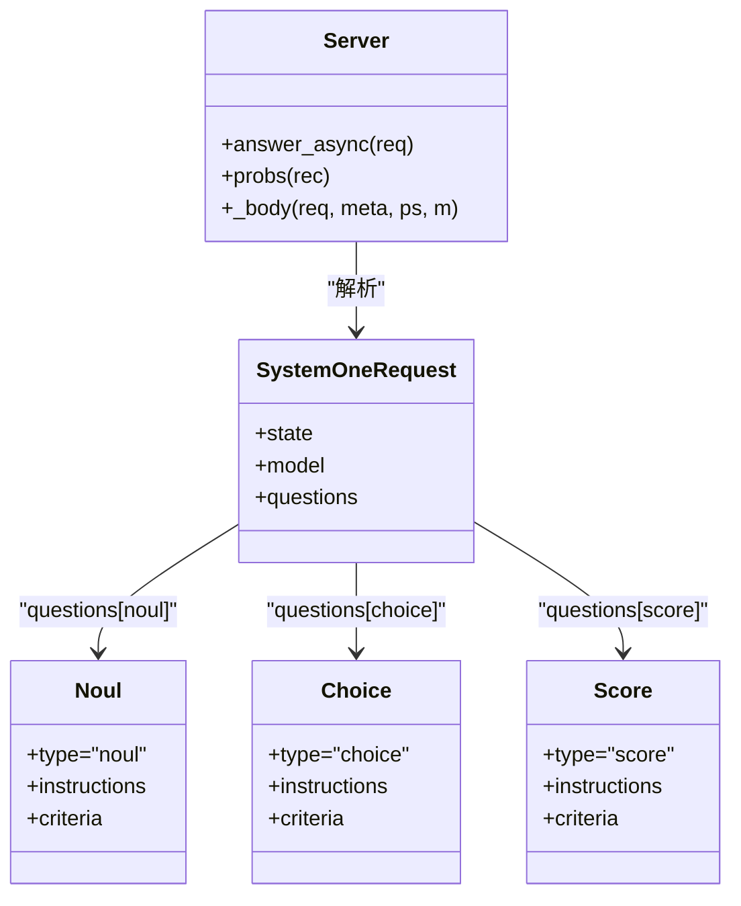

<cite>
**本文引用的文件**   
- [serve.py](file://kev/serve.py)
- [api.py](file://kev/api.py)
- [README.md](file://README.md)
</cite>

## 目录
1. [简介](#简介)
2. [项目结构](#项目结构)
3. [核心组件](#核心组件)
4. [架构总览](#架构总览)
5. [详细组件分析](#详细组件分析)
6. [依赖关系分析](#依赖关系分析)
7. [性能与容量特性](#性能与容量特性)
8. [故障排查指南](#故障排查指南)
9. [结论](#结论)
10. [附录：客户端实现与常见用例](#附录客户端实现与常见用例)

## 简介
本文件为 Kev 的主要 API 端点 `/v1/systemone` 的完整技术文档。该端点用于“一次前向推理”中，对一份文档（state）提出一组结构化问题，并返回每个问题的概率分布、置信度与使用统计。它兼容 TypeSafe System One 契约，支持三种问题类型：noul（是/否）、choice（多选）、score（评分），以及 state 字段的三种类型：string、object、array。

## 项目结构
Kev 的 HTTP 服务由 FastAPI 提供，核心逻辑集中在两个模块：
- `kev/serve.py`：FastAPI 应用、认证中间件、请求路由、批处理与状态前缀缓存、响应体组装。
- `kev/api.py`：TypeSafe 兼容的请求/响应数据模型、问题类型定义、概率到答案的映射、置信度计算与 token 计数。



**图表来源**
- [serve.py:228-252](file://kev/serve.py#L228-L252)
- [serve.py:200-225](file://kev/serve.py#L200-L225)
- [api.py:102-160](file://kev/api.py#L102-L160)

**章节来源**
- [serve.py:1-13](file://kev/serve.py#L1-L13)
- [api.py:1-6](file://kev/api.py#L1-L6)

## 核心组件
- 请求模型
  - `SystemOneRequest`：包含 `state`、可选 `model`、必填 `questions`。
  - `Question` 联合类型：`Noul`、`Choice`、`Score`。
- 响应模型
  - `answers`：按问题 id 返回结构化答案。
  - `usage`：`input_tokens`、`output_tokens`；当启用截断时还包含 `state_tokens`、`state_tokens_used`。
  - `latency_ms`：模型推理耗时。
  - 可选 `truncated`：当服务端截断超长 state 时为 true。

**章节来源**
- [api.py:17-46](file://kev/api.py#L17-L46)
- [serve.py:211-220](file://kev/serve.py#L211-L220)

## 架构总览
`/v1/systemone` 的处理流程如下：
1. FastAPI 接收 POST 请求，进入 `systemone()` 路由。
2. 调用 `Server.answer_async(req)`，内部先通过 `prepare()` 做可选预处理（如日期事实增强）。
3. 将请求转换为内部记录 `to_record()`，并附带每道题的元信息（id、type、keys、legend）。
4. 提交到模型线程进行批处理推理，返回每道题的概率分布。
5. 将概率映射为答案 `to_answers()`，并组装 usage、latency 等字段。
6. 返回 JSON 响应，同时设置 `x-typesafe-request-id` 和 `server-timing` 响应头。



**图表来源**
- [serve.py:249-252](file://kev/serve.py#L249-L252)
- [serve.py:205-220](file://kev/serve.py#L205-L220)
- [api.py:102-160](file://kev/api.py#L102-L160)

## 详细组件分析

### 端点规范：POST /v1/systemone
- 方法：POST
- 路径：`/v1/systemone`
- 内容类型：`application/json`
- 认证：当环境变量 `KEV_API_KEY` 已设置时，需要 `Authorization: Bearer <key>`；否则为开放服务器。
- 成功响应：HTTP 200，JSON 主体包含 `model`、`answers`、`usage`、`latency_ms`，可能包含 `truncated`。
- 错误响应：
  - 401：缺少或无效的 API Key。
  - 422：请求校验失败或 state 过长（除非启用截断）。
  - 503：服务正在停止。

**章节来源**
- [serve.py:232-242](file://kev/serve.py#L232-L242)
- [serve.py:138-145](file://kev/serve.py#L138-L145)

### 请求体结构
- `state`：待评估的内容，类型为 `string | object | array`。对象和数组会被序列化为带标签的文本供模型读取。
- `model`：字符串，默认 `"kev-latest"`。
- `questions`：键值对，键为你自定义的问题 id（模型不看到该键），值为 Question 对象。



**图表来源**
- [api.py:17-46](file://kev/api.py#L17-L46)
- [api.py:49-59](file://kev/api.py#L49-L59)

**章节来源**
- [api.py:43-46](file://kev/api.py#L43-L46)
- [api.py:17-38](file://kev/api.py#L17-L38)

### state 字段支持的三种类型及使用场景
- string：纯文本文档，适合短消息、工单正文、评论等。
- object：结构化文档，适合表单、票据、配置项等，字段名作为标签保留。
- array：列表型文档，适合条目集合、步骤清单等。

对象和数组在内部被渲染为带缩进和标签的文本，便于模型理解层级结构。

**章节来源**
- [api.py:49-59](file://kev/api.py#L49-L59)

### questions 对象结构与三种问题类型

#### noul（是/否问题）
- `type`：`"noul"`
- `instructions`：可选，可为 string/object/array。
- `criteria`：可选，形如 `{true?: ..., false?: ...}`。若未提供，则使用默认选项名称。
- 答案字段：`noul`，表示 yes 的概率。

**章节来源**
- [api.py:17-21](file://kev/api.py#L17-L21)
- [api.py:108-110](file://kev/api.py#L108-L110)
- [api.py:152-153](file://kev/api.py#L152-L153)

#### choice（选择题）
- `type`：`"choice"`
- `instructions`：可选。
- `criteria`：必填，字典形式，键为选项名，值为描述或 null。选项数量范围 1–255。
- 答案字段：
  - `choice`：最可能的选项名。
  - `probabilities`：按选项名的概率分布。
  - `confidence`：基于最大概率与均匀分布偏差的置信度。

**章节来源**
- [api.py:23-31](file://kev/api.py#L23-L31)
- [api.py:111-112](file://kev/api.py#L111-L112)
- [api.py:154-156](file://kev/api.py#L154-L156)

#### score（评分题）
- `type`：`"score"`
- `instructions`：可选。
- `criteria`：必填，有序列表，从最低到最高等级，长度 1–255。
- 答案字段：
  - `score`：期望等级索引（从 0 开始）。
  - `legend`：等级索引到描述的映射。
  - `probabilities`：按等级索引的概率分布。
  - `confidence`：基于分布集中度的置信度。

**章节来源**
- [api.py:34-38](file://kev/api.py#L34-L38)
- [api.py:113-116](file://kev/api.py#L113-L116)
- [api.py:157-159](file://kev/api.py#L157-L159)

### 置信度计算
- choice 置信度：`(p_max − 1/K) / (1 − 1/K)`，其中 K 为选项数；单选项时置信度为 1。
- score 置信度：`max(0, 1 − E|level − mode| / D)`，mode 为最可能等级，D 为均匀分布在等级上的平均绝对偏差。

这些公式与 TypeSafe 参考适配器一致，且不是准确率度量。

**章节来源**
- [api.py:120-140](file://kev/api.py#L120-L140)

### 响应格式
- `model`：请求中的 model 字段。
- `answers`：按问题 id 的结构化答案。
- `usage`：
  - `input_tokens`：输入 token 数。
  - `output_tokens`：序列化答案的 token 数（非生成 token）。
  - 当启用截断时：`state_tokens`（请求 state 的 token 数）、`state_tokens_used`（实际读入模型的 token 数）。
- `latency_ms`：模型推理耗时（毫秒）。
- `truncated`：当服务端截断超长 state 时为 true。

**章节来源**
- [serve.py:211-220](file://kev/serve.py#L211-L220)
- [api.py:163-165](file://kev/api.py#L163-L165)

### 认证机制
- 当 `KEV_API_KEY` 已设置时，所有 `/v1/*` 路径需要 `Authorization: Bearer <key>`。
- 缺失或无效 key 返回 401，并在响应头中包含 `www-authenticate: Bearer`。
- 未设置 `KEV_API_KEY` 时，服务器为开放模式（本地默认）。

**章节来源**
- [serve.py:232-242](file://kev/serve.py#L232-L242)

### 错误处理策略
- 401：认证失败。
- 422：请求校验失败或 state 超过限制（除非启用截断）。
- 503：服务正在停止。
- 其他异常：批处理中的异常会传播给批次中的所有请求，但模型线程继续运行。

**章节来源**
- [serve.py:138-145](file://kev/serve.py#L138-L145)
- [serve.py:161-168](file://kev/serve.py#L161-L168)

### 速率限制
代码库中未实现显式的速率限制器。服务端通过批处理（最多 64 个请求一批）与模型线程队列来吞吐请求。生产部署建议在前置代理层（如 Nginx、Cloudflare、API Gateway）实施速率限制与重试退避。

**章节来源**
- [serve.py:34](file://kev/serve.py#L34)

## 依赖关系分析
- FastAPI 路由依赖 `Server.answer_async()`。
- `Server` 依赖 `Checkpoint`、`LoadOptions`、设备抽象、模型前向接口。
- 请求/响应形状由 `api.py` 定义，并被 `serve.py` 复用。
- 可选预处理 `with_date_facts` 在 `api.py` 中实现，由 `serve.py` 的 `prepare()` 调用。



**图表来源**
- [api.py:17-46](file://kev/api.py#L17-L46)
- [serve.py:200-220](file://kev/serve.py#L200-L220)

**章节来源**
- [serve.py:93-122](file://kev/serve.py#L93-L122)
- [api.py:102-160](file://kev/api.py#L102-L160)

## 性能与容量特性
- 批处理：最多 64 个请求一批，减少内核启动开销。
- 状态前缀缓存：可缓存重复 state 的前缀 KV 与 DeltaNet 状态，命中后仅支付问题行的代价。
- 内存管理：当 OOM 时自动清空缓存并重试。
- 长度限制：默认拒绝超过 `SERVE_MAX_STATE` 的 state；可通过 `KEV_TRUNCATE_STATES=1` 改为截断并返回 `truncated` 标记。
- 精度与后端：GPU 默认 bf16；Apple Silicon 默认 MLX；可通过环境变量切换 dtype、backend、CUDA graphs 等。

**章节来源**
- [serve.py:27-35](file://kev/serve.py#L27-L35)
- [serve.py:38-90](file://kev/serve.py#L38-L90)
- [serve.py:172-191](file://kev/serve.py#L172-L191)
- [serve.py:315-339](file://kev/serve.py#L315-L339)

## 故障排查指南
- 401 认证失败：检查是否设置了 `KEV_API_KEY`，并确保请求携带正确的 `Authorization: Bearer <key>`。
- 422 请求或长度错误：检查 state 是否超过限制；如需截断，设置 `KEV_TRUNCATE_STATES=1`。
- 503 服务停止：服务端关闭过程中新请求会失败。
- 长文档性能差：考虑启用状态前缀缓存（默认开启），或使用更合适的 GPU 与批量大小。
- Apple Silicon 慢：确认使用 MLX 后端；必要时调整 dtype 与 backend。

**章节来源**
- [serve.py:232-242](file://kev/serve.py#L232-L242)
- [serve.py:138-145](file://kev/serve.py#L138-L145)
- [serve.py:172-191](file://kev/serve.py#L172-L191)

## 结论
`/v1/systemone` 提供了 TypeSafe 兼容的决策式 API，支持三类问题与三种 state 类型，返回校准后的概率分布与置信度，并提供 usage 统计与延迟指标。通过环境变量可控制认证、截断、日期事实增强、dtype 与后端行为。生产环境建议结合前置代理进行速率限制与监控，并根据业务需求选择合适模型尺寸与硬件。

## 附录：客户端实现与常见用例

### 完整请求示例
以下为一个客服工单的典型请求，包含部门分类（choice）、是否需要紧急人工关注（noul）、客户情绪评分（score）。

```jsonc
{
  "state": "Shoes arrived two weeks late and in the wrong size. Also I see two charges on my card.",
  "model": "kev-latest",
  "questions": {
    "department":  {"type": "choice", "instructions": "Which team should handle this?",
                    "criteria": {"returns": "Exchanges, refunds, wrong or damaged items",
                                 "shipping": "Delivery status, delays, lost packages",
                                 "billing": "Charges, invoices, payment problems"}},
    "escalate":    {"type": "noul",  "instructions": "Does this ticket need urgent human attention?"},
    "frustration": {"type": "score", "instructions": "How frustrated is the customer?",
                    "criteria": ["Calm", "Frustrated", "Very angry"]}
  }
}
```

**章节来源**
- [README.md:63-76](file://README.md#L63-L76)

### 完整响应示例
对应上述请求的典型响应包含 answers、usage 与 latency_ms。

```jsonc
{
  "model": "kev-latest",
  "answers": {
    "department":  { "type": "choice", "choice": "returns", "confidence": 0.21,
                     "probabilities": { "returns": 0.47, "shipping": 0.28, "billing": 0.25 } },
    "escalate":    { "type": "noul", "noul": 0.93 },
    "frustration": { "type": "score", "score": 1.44, "confidence": 0.34,
                     "legend": { "0": "Calm", "1": "Frustrated", "2": "Very angry" },
                     "probabilities": { "0": 0.00, "1": 0.56, "2": 0.44 } }
  },
  "usage": { "input_tokens": 101, "output_tokens": 161 },
  "latency_ms": 495
}
```

**章节来源**
- [README.md:78-94](file://README.md#L78-L94)

### 客户端实现指南
- 使用 TypeSafe Python SDK 可直接对接 Kev 服务，无需修改调用代码。
- 设置 `base_url` 指向本地或远程 Kev 服务地址。
- 若启用了 `KEV_API_KEY`，需在 SDK 中传入 `api_key`。

```python
from typesafe_sdk import Choice, Noul, Score, TypeSafeClient

client = TypeSafeClient(
    api_key="local",
    base_url="http://127.0.0.1:8009",
    model="kev-latest",
)
response = client.system_one(
    state="I was charged twice. Please fix this ASAP.",
    questions={
        "billing": Noul(instructions="Is this ticket about billing?"),
        "tone": Choice(
            instructions="What is the customer's tone?",
            criteria={"calm": None, "frustrated": None, "angry": None},
        ),
        "urgency": Score(
            instructions="How urgent is this ticket?",
            criteria=["can wait", "this week", "today"],
        ),
    },
)
print(response.nouls["billing"].noul)
print(response.choices["tone"].choice)
print(response.scores["urgency"].score)
```

**章节来源**
- [README.md:98-127](file://README.md#L98-L127)

### 常见用例
- 工单路由：根据内容判断归属部门（choice）。
- 升级判定：是否需要紧急人工介入（noul）。
- 情绪评分：对客户情绪进行分级（score）。
- 合同审阅：对条款风险进行等级评分（score），并结合 choice 判断责任方。
- 多语言支持：通过 instructions 与 criteria 的描述适配不同语言。

[本节为概念性说明，不直接分析具体文件]