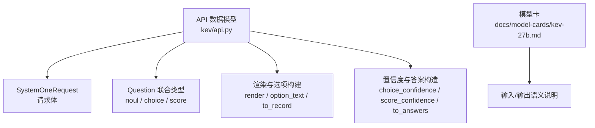
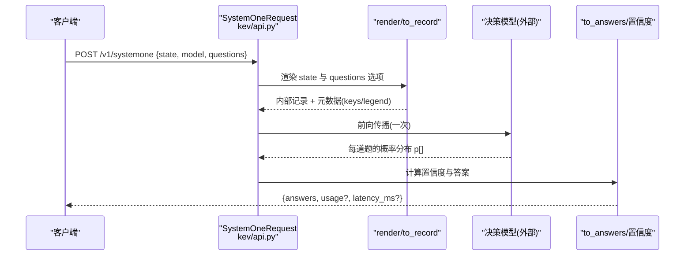
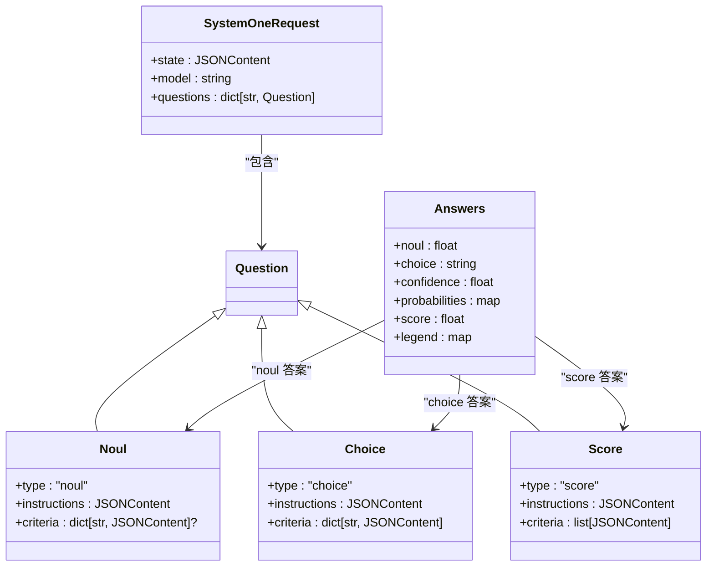

<cite>
**本文引用的文件**   
- [api.py](file://kev/api.py)
- [kev-27b.md](file://docs/model-cards/kev-27b.md)
</cite>

## 目录
1. [简介](#简介)
2. [项目结构](#项目结构)
3. [核心组件](#核心组件)
4. [架构总览](#架构总览)
5. [详细组件分析](#详细组件分析)
6. [依赖关系分析](#依赖关系分析)
7. [性能与精度说明](#性能与精度说明)
8. [故障排查指南](#故障排查指南)
9. [结论](#结论)
10. [附录：完整数据结构示例](#附录完整数据结构示例)

## 简介
本文面向 Kev API 的数据模型，聚焦 SystemOneRequest 请求体、state 的三种形态、questions 的结构与验证规则，以及响应中的 answers、usage、latency_ms 等字段。文档同时解释置信度计算、概率分布和统计信息的含义，并提供可直接用于对接的完整数据结构示例与字段说明。

Kev 是一个“决策模型”接口：输入一个状态（state）和一组类型化的问题（questions），在一次前向传播中返回每个问题的校准概率分布，不生成自由文本。该接口兼容 TypeSafe 的 System One API（POST /v1/systemone）。

**章节来源**
- [kev-27b.md:82-110](file://docs/model-cards/kev-27b.md#L82-L110)

## 项目结构
本项目的 API 数据模型定义集中在 kev/api.py 中，包含请求体、问题类型、渲染逻辑、答案构造、置信度计算与序列化等。模型卡 docs/model-cards/kev-27b.md 对输入输出语义做了业务层面的补充说明。

**图表来源**
- [api.py:17-46](file://kev/api.py#L17-L46)
- [api.py:49-117](file://kev/api.py#L49-L117)
- [api.py:120-160](file://kev/api.py#L120-L160)
- [kev-27b.md:102-110](file://docs/model-cards/kev-27b.md#L102-L110)

**章节来源**
- [api.py:1-166](file://kev/api.py#L1-L166)
- [kev-27b.md:82-110](file://docs/model-cards/kev-27b.md#L82-L110)

## 核心组件
- SystemOneRequest：请求体，包含 state、model、questions。
- Question 联合类型：
  - noul：二元判断（是/否），criteria 可选且为键 false/true 的映射。
  - choice：多选分类，criteria 为键值对，键为选项名，值为可选描述；选项数限制在 1–255。
  - score：有序等级评分，criteria 为有序列表，长度 1–255。
- JSONContent：state 与 criteria 值的通用类型，支持字符串、对象、数组、数字、布尔、空值。
- 渲染器 render：将 str/object/array 展平为模型可见的文本，保留字段名作为标签。
- 选项构建 option_text：将选项名与可选描述拼接为模型可见的选项文本。
- to_record：将请求转换为内部记录，并附带每道题的元数据（id、type、keys、legend）。
- 置信度函数：
  - choice_confidence：基于最大概率与均匀分布偏差的归一化置信度。
  - score_confidence：基于期望等级与最可能等级的绝对偏差的置信度。
- to_answers：根据概率分布构造最终答案，包括 choice/noul/score 三类回答。

**章节来源**
- [api.py:13-46](file://kev/api.py#L13-L46)
- [api.py:49-117](file://kev/api.py#L49-L117)
- [api.py:120-160](file://kev/api.py#L120-L160)

## 架构总览
下图展示从请求到响应的关键数据流：客户端发送 SystemOneRequest，服务端解析并渲染 state 与 questions，计算概率分布，再构造 answers 并返回。

**图表来源**
- [api.py:43-46](file://kev/api.py#L43-L46)
- [api.py:49-117](file://kev/api.py#L49-L117)
- [api.py:120-160](file://kev/api.py#L120-L160)

## 详细组件分析

### SystemOneRequest 请求体
- state：JSONContent，可为字符串、对象或数组。
  - 字符串：直接文本。
  - 对象：结构化数据，会被渲染为带字段名的文本。
  - 数组：混合内容，会被渲染为带缩进的列表项。
- model：字符串，默认 "kev-latest"。
- questions：字典，至少包含一个问题；键为问题 ID，值为 Question 联合类型。

验证规则：
- questions 非空（min_length=1）。
- choice 的 criteria 选项数量必须在 1–255 之间。
- score 的 criteria 列表长度必须在 1–255 之间。
- noul 的 criteria 可选，若提供则应为包含 false/true 键的映射。

**章节来源**
- [api.py:17-46](file://kev/api.py#L17-L46)
- [kev-27b.md:102-110](file://docs/model-cards/kev-27b.md#L102-L110)

### state 字段的三种类型
- 字符串状态：直接文本，适合简短上下文。
- 对象状态：结构化数据，字段名会作为标签保留在渲染文本中，便于模型理解层级关系。
- 数组状态：混合内容，每项会被渲染为列表项，适合多段信息或条目集合。

渲染行为：
- 对象：逐行输出“键: 值”，子对象/数组递归缩进。
- 数组：逐项输出“- 值”，子对象/数组递归缩进。
- 标量：直接转字符串。

**章节来源**
- [api.py:49-55](file://kev/api.py#L49-L55)
- [kev-27b.md:102-110](file://docs/model-cards/kev-27b.md#L102-L110)

### questions 对象结构与 criteria 格式
- noul：
  - type = "noul"
  - instructions：可选，指导语。
  - criteria：可选，键为 "false"/"true"，值为可选描述。
  - 输出：p(true)，即 yes 的概率。
- choice：
  - type = "choice"
  - instructions：可选，指导语。
  - criteria：必填，键为选项名，值为可选描述；选项数 1–255。
  - 输出：选择最可能的选项名，及其概率分布与置信度。
- score：
  - type = "score"
  - instructions：可选，指导语。
  - criteria：必填，有序等级描述列表，长度 1–255。
  - 输出：期望等级索引（按概率加权平均），等级图例 legend，概率分布与置信度。

选项文本构建：
- 若描述为空或 None，仅显示选项名。
- 否则显示“选项名: 描述”。

**章节来源**
- [api.py:17-40](file://kev/api.py#L17-L40)
- [api.py:58-59](file://kev/api.py#L58-L59)
- [api.py:94-117](file://kev/api.py#L94-L117)
- [kev-27b.md:102-110](file://docs/model-cards/kev-27b.md#L102-L110)

### 置信度计算与概率分布
- 概率归一化：将所有概率除以总和；若总和为 0，则退化为均匀分布。
- choice_confidence：
  - 公式：(max(p) - 1/K) / (1 - 1/K)，其中 K 为选项数。
  - 取值范围：[0, 1]；均匀分布时为 0，单选项或完全确定时为 1。
- score_confidence：
  - 以 L 个等级为区间，mode 为最可能等级索引。
  - D 为均匀分布在 [0, L-1] 上的平均绝对偏差。
  - 公式：max(0, 1 - E|level - mode| / D)。
  - 取值范围：[0, 1]；所有质量集中在一个等级时为 1，均匀或极度分散时为 0。
- 概率序列化：四舍五入到小数点后四位，保证 255 选项时 sum(p) 与 1 的误差小于 0.02。

**章节来源**
- [api.py:120-146](file://kev/api.py#L120-L146)

### 答案构造 with answers、usage、latency_ms
- answers：按问题 ID 组织的字典，每个问题包含：
  - noul：{"type": "noul", "noul": p(true)}
  - choice：{"type": "choice", "choice": 最可能选项名, "confidence": 置信度, "probabilities": {选项名: 概率}}
  - score：{"type": "score", "score": 期望等级(浮点), "legend": {等级索引: 等级描述}, "probabilities": {索引: 概率}, "confidence": 置信度}
- usage：当前实现未显式填充；如需计费或用量统计，可在服务层扩展。
- latency_ms：当前实现未显式填充；如需延迟统计，可在服务层扩展。
- output_tokens：用于估算“答案序列化后的 token 数”，非生成 token 计数。

**章节来源**
- [api.py:149-160](file://kev/api.py#L149-L160)
- [api.py:163-166](file://kev/api.py#L163-L166)

## 依赖关系分析
- SystemOneRequest 依赖 Question 联合类型（noul/choice/score）。
- to_record 依赖 render、option_text 与 question_keys，用于构建内部记录与元数据。
- to_answers 依赖 choice_confidence、score_confidence 与 round_prob，用于构造最终答案。
- 模型卡文档对输入输出语义进行业务约束说明，与代码实现保持一致。

**图表来源**
- [api.py:17-46](file://kev/api.py#L17-L46)
- [api.py:149-160](file://kev/api.py#L149-L160)

**章节来源**
- [api.py:17-46](file://kev/api.py#L17-L46)
- [api.py:149-160](file://kev/api.py#L149-L160)

## 性能与精度说明
- 单次前向传播：模型对共享 state 只计算一次，多个问题并行分支，避免重复计算。
- 上下文长度：服务支持最长 65,536 token 的 state，并为每个问题预留至少 8,192 token 空间。
- 校准温度：默认应用校准温度；可通过环境变量关闭以获得原始概率。
- 吞吐与内存：具体数值见模型卡的 serving parity 表格。

**章节来源**
- [kev-27b.md:94-96](file://docs/model-cards/kev-27b.md#L94-L96)
- [kev-27b.md:102-110](file://docs/model-cards/kev-27b.md#L102-L110)
- [kev-27b.md:261-270](file://docs/model-cards/kev-27b.md#L261-L270)

## 故障排查指南
- 选项数量越界：
  - choice 的 criteria 必须为 1–255 个选项；超出会抛出验证错误。
  - score 的 criteria 列表长度必须为 1–255；超出会抛出验证错误。
- 概率分布异常：
  - 若所有概率为 0，系统会退化为均匀分布；检查输入是否缺少有效证据。
- 置信度为 0：
  - choice：当分布接近均匀时置信度趋近 0。
  - score：当分布极度分散或均匀时置信度趋近 0。
- 答案缺失字段：
  - usage 与 latency_ms 在当前实现中未填充；如需使用，请在服务层自行添加。

**章节来源**
- [api.py:28-37](file://kev/api.py#L28-L37)
- [api.py:120-146](file://kev/api.py#L120-L146)
- [api.py:149-160](file://kev/api.py#L149-L160)

## 结论
Kev 的 SystemOneRequest 数据模型通过统一的 JSONContent 承载灵活的 state，并以三种问题类型覆盖二元判断、多选分类与有序评分场景。置信度与概率分布的计算遵循 TypeSafe 参考实现，确保可阈值化与可校准。answers 结构清晰，便于下游自动化处理；usage 与 latency_ms 可由服务层扩展以满足计费与监控需求。

## 附录：完整数据结构示例

### 请求示例（SystemOneRequest）
- state：字符串、对象或数组均可。
- model：默认 "kev-latest"。
- questions：至少一个，类型为 noul/choice/score。

示例要点：
- choice 的 criteria 为键值对，键为选项名，值为可选描述。
- score 的 criteria 为有序等级描述列表。
- noul 的 criteria 可选，键为 "false"/"true"。

**章节来源**
- [api.py:17-46](file://kev/api.py#L17-L46)
- [kev-27b.md:102-110](file://docs/model-cards/kev-27b.md#L102-L110)

### 响应示例（answers）
- noul：{"type": "noul", "noul": 概率}
- choice：{"type": "choice", "choice": 选项名, "confidence": 置信度, "probabilities": {选项名: 概率}}
- score：{"type": "score", "score": 期望等级, "legend": {索引: 等级描述}, "probabilities": {索引: 概率}, "confidence": 置信度}

usage 与 latency_ms：当前实现未填充，可在服务层扩展。

**章节来源**
- [api.py:149-160](file://kev/api.py#L149-L160)