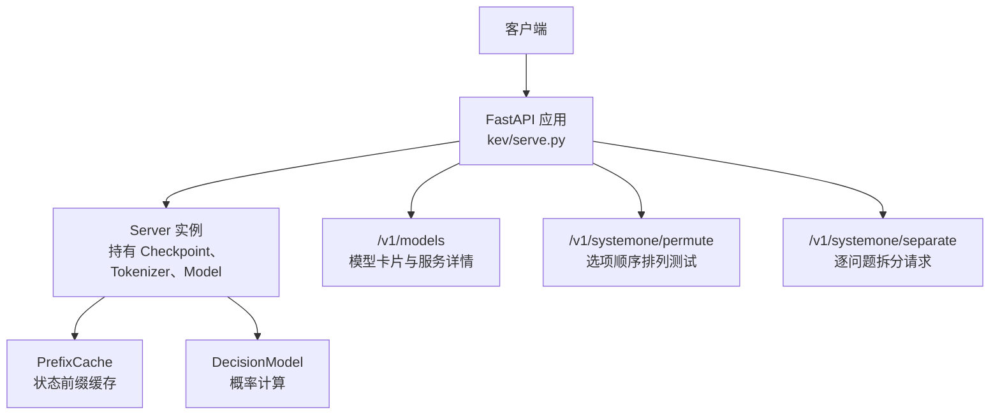
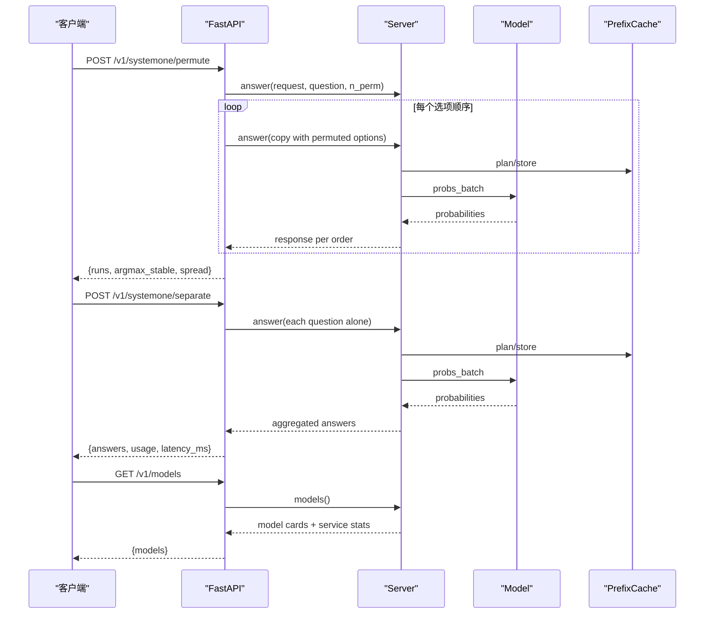
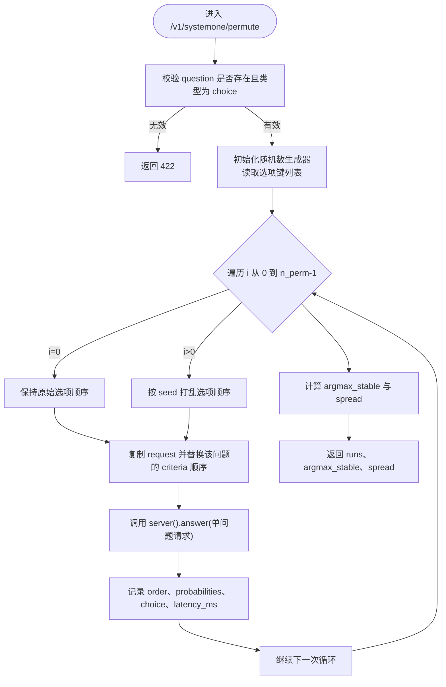
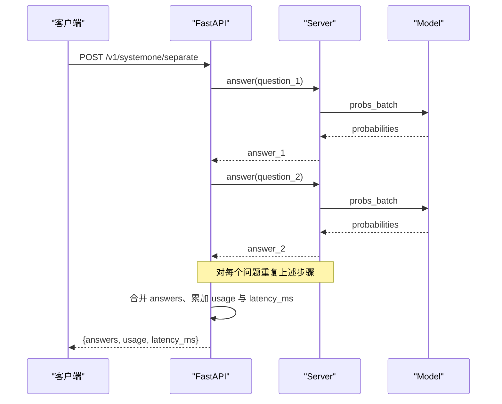
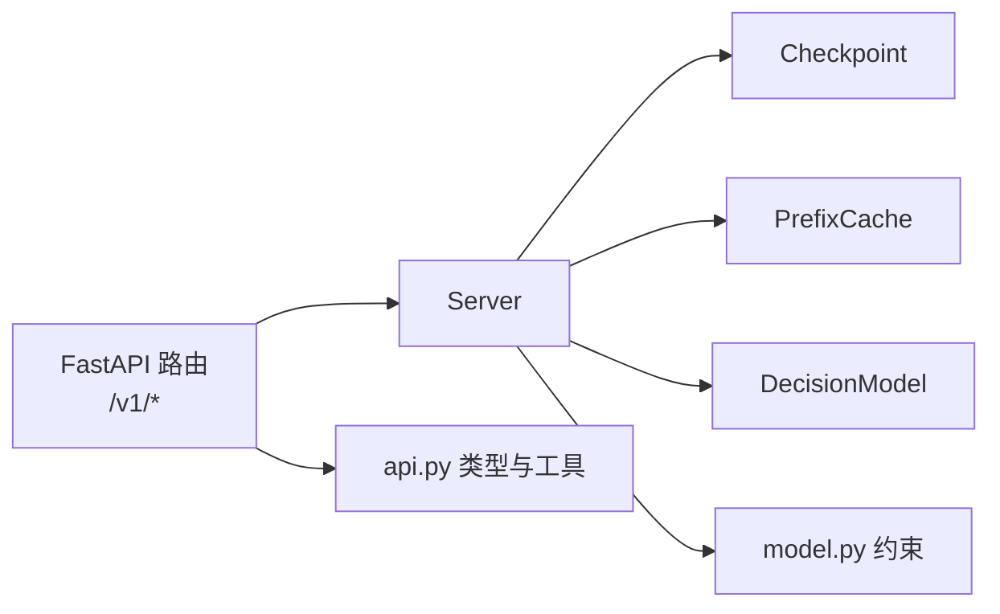

<cite>
**本文引用的文件**   
- [README.md](file://README.md)
- [AGENTS.md](file://AGENTS.md)
- [serve.py](file://kev/serve.py)
</cite>

## 目录
1. [简介](#简介)
2. [项目结构](#项目结构)
3. [核心组件](#核心组件)
4. [架构总览](#架构总览)
5. [详细端点文档](#详细端点文档)
6. [依赖关系分析](#依赖关系分析)
7. [性能与稳定性注意事项](#性能与稳定性注意事项)
8. [故障排查指南](#故障排查指南)
9. [结论](#结论)

## 简介
本文档聚焦 Kev 的辅助 API 端点，面向需要诊断模型行为、评估选项顺序敏感性以及对比“打包提问”和“逐个提问”差异的开发者。重点覆盖以下三个端点：
- `GET /v1/models`：获取当前加载模型的卡片信息、服务细节与缓存统计。
- `POST /v1/systemone/permute`：对单个选择题进行选项顺序排列测试，返回每种顺序的概率分布与稳定性指标。
- `POST /v1/systemone/separate`：将一次请求中的多个问题拆分为单独请求，便于比较“打包 vs 拆分”的行为差异。

这些端点由 FastAPI 服务暴露，内部复用同一份推理逻辑，因此响应结构与主端点 `/v1/systemone` 保持一致或在其基础上扩展。

## 项目结构
Kev 的服务端实现位于 `kev/serve.py`，对外暴露 FastAPI 路由；同时，仓库根目录的 `README.md` 与 `AGENTS.md` 提供了 API 概览、环境变量说明与使用场景。



**图表来源**
- [serve.py:228-312](file://kev/serve.py#L228-L312)

**章节来源**
- [serve.py:1-13](file://kev/serve.py#L1-L13)
- [README.md:214-249](file://README.md#L214-L249)
- [AGENTS.md:308-337](file://AGENTS.md#L308-L337)

## 核心组件
- **Server**：封装已加载的 Checkpoint、Tokenizer、Model，维护一个后台线程执行批量推理，并管理状态前缀缓存与 CUDA Graph 捕获。
- **PrefixCache**：LRU 风格的状态前缀缓存，限制最大状态数量与总 token 数，避免 OOM 并提升重复状态的吞吐。
- **路由层**：提供 `/v1/systemone`、`/v1/systemone/permute`、`/v1/systemone/separate` 与 `/v1/models`。
- **认证与头字段**：可选 Bearer 认证；所有响应携带 `x-typesafe-request-id` 与 `server-timing`。

**章节来源**
- [serve.py:38-121](file://kev/serve.py#L38-L121)
- [serve.py:228-242](file://kev/serve.py#L228-L242)

## 架构总览
下图展示辅助端点的调用路径：客户端请求进入 FastAPI，路由解析参数后调用 `Server.answer` 或组合多次 `Server.answer`，最终返回 TypeSafe 兼容的响应体。



**图表来源**
- [serve.py:255-312](file://kev/serve.py#L255-L312)

## 详细端点文档

### `GET /v1/models`
用于获取当前加载模型的卡片信息和服务细节。

- **用途**
  - 查看模型名称、描述、发布日期。
  - 查看后端设备、后端类型（torch/MLX）、精度（bf16/fp32）。
  - 查看温度、最大状态长度、是否启用截断、CUDA Graph 统计、前缀缓存统计、批处理计数等。

- **请求示例**
  ```bash
  curl -s http://127.0.0.1:8009/v1/models
  ```

- **响应字段**
  - `models`：数组，包含两个模型名对应的卡片对象：
    - `name`：`kev-latest` 或 `jev-latest`。
    - `description`：基于基座模型与请求运行信息的描述。
    - `release_date`：发布日。
    - `run`：加载的运行标识或 Hub 版本。
    - `base`：基座模型名称。
    - `lora`：LoRA 元信息。
    - `device`：设备名。
    - `backend`：后端类型。
    - `dtype`：推理精度。
    - `temperature`：指针头的温度。
    - `max_state_tokens`：最大状态 token 数。
    - `truncate_states`：是否允许截断超长状态。
    - `cuda_graphs`：CUDA Graph 统计（若启用）。
    - `prefix_cache`：前缀缓存配置与命中情况。
    - `batches`：批次数、请求数、队列长度。

- **使用场景**
  - 部署后自检：确认模型、设备、精度、温度与前缀缓存状态。
  - 客户端适配：根据 `max_state_tokens` 与 `truncate_states` 调整输入策略。
  - 性能观察：通过 `prefix_cache` 与 `batches` 判断缓存命中率与吞吐压力。

- **错误处理**
  - 该端点为只读查询，通常不会因业务数据出错；若服务未启动或鉴权失败，会返回 HTTP 错误。

**章节来源**
- [serve.py:298-312](file://kev/serve.py#L298-L312)
- [README.md:245-246](file://README.md#L245-L246)
- [AGENTS.md:308-318](file://AGENTS.md#L308-L318)

---

### `POST /v1/systemone/permute`
对单个选择题进行选项顺序排列测试，支持控制排列数量，返回每种顺序的概率分布与稳定性分析。

- **用途**
  - 检测选择题对选项顺序的敏感性。
  - 观察不同顺序下概率分布的变化幅度。
  - 判断多数答案是否稳定。

- **请求体字段**
  - `request`：TypeSafe 风格的 SystemOne 请求，必须包含至少一个 `choice` 类型的问题。
  - `question`：要测试的问题 ID。
  - `n_perm`：排列数量，取值范围 1 到 64，默认 6。
  - `seed`：随机种子，默认 0，用于复现实验。

- **请求示例**
  ```bash
  curl -s http://127.0.0.1:8009/v1/systemone/permute \
    -H 'content-type: application/json' \
    -d '{
      "request": {
        "model": "kev-latest",
        "state": "鞋子晚到了两周且尺码不对，另外我卡上出现了两笔扣款。",
        "questions": {
          "department": {
            "type": "choice",
            "instructions": "应该由哪个团队处理？",
            "criteria": {
              "returns": "退换货、退款、错发或损坏商品",
              "shipping": "配送状态、延迟、丢件",
              "billing": "扣款、发票、支付问题"
            }
          }
        }
      },
      "question": "department",
      "n_perm": 6,
      "seed": 0
    }'
  ```

- **响应字段**
  - `runs`：数组，每项对应一种选项顺序：
    - `order`：该次使用的选项顺序。
    - `probabilities`：该顺序下的选项概率分布。
    - `choice`：该顺序下的最高概率选项。
    - `latency_ms`：该次推理耗时。
  - `argmax_stable`：布尔值，表示所有顺序的最高答案是否一致。
  - `spread`：每个选项在所有顺序中最大概率与最小概率的差值，反映顺序敏感性。

- **使用场景**
  - 选择题鲁棒性评估：如果 `argmax_stable` 为假或某些选项 `spread` 较大，说明模型对该问题的选项顺序敏感。
  - 提示工程与评测：结合不同 `n_perm` 与 `seed` 做系统性实验。
  - 与 `/v1/systemone/separate` 配合：先观察选项顺序影响，再观察打包 vs 拆分影响。

- **边界情况与错误处理**
  - 如果指定 `question` 不存在或不是 `choice` 类型，返回 422。
  - `n_perm` 超出 1–64 范围会被拒绝。
  - 当 `n_perm` 很大时，每次顺序都是一次完整 forward，整体耗时与显存占用随 `n_perm` 线性增长。



**图表来源**
- [serve.py:255-275](file://kev/serve.py#L255-L275)

**章节来源**
- [serve.py:255-275](file://kev/serve.py#L255-L275)
- [README.md:246-247](file://README.md#L246-L247)
- [AGENTS.md:333-335](file://AGENTS.md#L333-L335)

---

### `POST /v1/systemone/separate`
将一次请求中的多个问题拆分为单独请求进行比较测试。

- **用途**
  - 比较“打包提问”与“逐个提问”的差异。
  - 观察多问题共享状态时的相互影响。
  - 统计拆分后的总 token 与总耗时。

- **请求体字段**
  - `request`：TypeSafe 风格的 SystemOne 请求，可包含任意数量的问题。

- **请求示例**
  ```bash
  curl -s http://127.0.0.1:8009/v1/systemone/separate \
    -H 'content-type: application/json' \
    -d '{
      "model": "kev-latest",
      "state": "鞋子晚到了两周且尺码不对，另外我卡上出现了两笔扣款。",
      "questions": {
        "department": {
          "type": "choice",
          "instructions": "应该由哪个团队处理？",
          "criteria": {
            "returns": "退换货、退款、错发或损坏商品",
            "shipping": "配送状态、延迟、丢件",
            "billing": "扣款、发票、支付问题"
          }
        },
        "escalate": {
          "type": "noul",
          "instructions": "是否需要紧急人工关注？"
        }
      }
    }'
  ```

- **响应字段**
  - `model`：模型名。
  - `answers`：每个问题 ID 对应的答案对象，结构与 `/v1/systemone` 的答案一致。
  - `usage`：
    - `input_tokens`：各拆分请求的 input_tokens 之和。
    - `output_tokens`：对所有答案序列化后的 token 总数。
  - `latency_ms`：各拆分请求 `latency_ms` 之和。
  - 如果服务端启用了状态截断，还会携带 `truncated` 与 `usage.state_tokens`、`usage.state_tokens_used`。

- **使用场景**
  - 打包 vs 拆分对比：先用 `/v1/systemone` 得到打包结果，再用 `/v1/systemone/separate` 得到拆分结果，逐项比较答案与概率。
  - 隔离性诊断：如果拆分后答案变化明显，说明多问题之间可能存在交互或上下文干扰。
  - 成本估算：通过累加的 `latency_ms` 与 `usage.input_tokens` 评估拆分带来的额外开销。

- **边界情况与错误处理**
  - 如果请求为空或没有有效问题，行为取决于底层 `/v1/systemone` 的校验。
  - 拆分会发起 N 次推理，N 为问题数量；当问题较多时，总耗时与 token 消耗会显著增加。
  - 若服务端启用了 `KEV_TRUNCATE_STATES=1`，拆分结果会继承截断标记。



**图表来源**
- [serve.py:278-286](file://kev/serve.py#L278-L286)

**章节来源**
- [serve.py:278-286](file://kev/serve.py#L278-L286)
- [README.md:247-248](file://README.md#L247-L248)
- [AGENTS.md:333-335](file://AGENTS.md#L333-L335)

---

### 通用行为与头部字段
- **认证**
  - 如果设置了 `KEV_API_KEY`，所有 `/v1/*` 请求需要携带 `Authorization: Bearer <key>`。
  - 未设置时为开放服务，适合本地调试。

- **响应头**
  - `x-typesafe-request-id`：每次请求的唯一标识，便于追踪。
  - `server-timing`：进程内耗时，用于区分网络时间与处理时间。

- **状态码**
  - 200：正常响应。
  - 401：缺少或无效的 API Key。
  - 422：请求格式错误或输入超限，例如非 choice 问题传入 `/permute`、状态过长且未启用截断。
  - 503：服务正在停止。

**章节来源**
- [serve.py:232-242](file://kev/serve.py#L232-L242)
- [serve.py:132-145](file://kev/serve.py#L132-L145)
- [README.md:250-258](file://README.md#L250-L258)

## 依赖关系分析
辅助端点依赖以下模块与概念：
- **FastAPI 路由**：定义 `/v1/systemone`、`/v1/systemone/permute`、`/v1/systemone/separate`、`/v1/models`。
- **Server**：统一封装推理流程、缓存管理与并发控制。
- **Checkpoint / LoadOptions**：决定模型加载方式、设备、精度、CUDA Graph、融合内核等。
- **api.py 数据结构**：SystemOneRequest、to_record、to_answers、output_tokens、with_date_facts。
- **model.py 约束**：SERVE_MAX_STATE、ContextOverflow、admit。



**图表来源**
- [serve.py:22-26](file://kev/serve.py#L22-L26)
- [serve.py:93-220](file://kev/serve.py#L93-L220)

**章节来源**
- [serve.py:22-26](file://kev/serve.py#L22-L26)
- [serve.py:93-220](file://kev/serve.py#L93-L220)

## 性能与稳定性注意事项
- **选项排列测试的成本**
  - `/v1/systemone/permute` 的 `n_perm` 越大，forward 次数越多。建议先从较小的 `n_perm` 开始，逐步扩大。
  - 使用固定 `seed` 可保证结果可复现。

- **拆分请求的成本**
  - `/v1/systemone/separate` 会为每个问题发起一次推理，总耗时近似为各问题耗时之和。
  - 对于大量问题，建议先评估打包请求的性能，再决定是否拆分。

- **状态前缀缓存**
  - 重复状态会被缓存，减少重复编码成本。
  - 可通过 `/v1/models` 中的 `prefix_cache` 观察命中情况。

- **状态截断**
  - 默认情况下，超过 `SERVE_MAX_STATE` 的状态会返回 422。
  - 设置 `KEV_TRUNCATE_STATES=1` 后，服务器会读取前 `SERVE_MAX_STATE` 个 token，并在响应中标记 `truncated`。

- **精度与后端**
  - 默认在 GPU 上使用 bf16，可通过 `KEV_DTYPE=fp32` 切换到 fp32 路径。
  - 可通过 `/v1/models` 中的 `backend` 与 `dtype` 确认实际运行环境。

**章节来源**
- [serve.py:27-34](file://kev/serve.py#L27-L34)
- [serve.py:172-191](file://kev/serve.py#L172-L191)
- [serve.py:289-295](file://kev/serve.py#L289-L295)
- [README.md:252-258](file://README.md#L252-L258)

## 故障排查指南
- **422 错误：非 choice 问题传入 `/permute`**
  - 检查 `question` 是否存在于 `request.questions`。
  - 检查该问题的 `type` 是否为 `choice`。

- **422 错误：状态过长**
  - 如果未启用 `KEV_TRUNCATE_STATES=1`，超长状态会被拒绝。
  - 启用截断后，注意响应中的 `truncated` 与 `usage.state_tokens_used`。

- **401 错误：缺少或无效 API Key**
  - 如果设置了 `KEV_API_KEY`，请确保请求头包含正确的 `Authorization: Bearer <key>`。

- **503 错误：服务正在停止**
  - 通常发生在服务关闭过程中，新请求被拒绝。

- **性能异常**
  - 检查 `/v1/models` 中的 `prefix_cache` 与 `batches`。
  - 检查是否启用了 CUDA Graph、融合内核与正确精度。

**章节来源**
- [serve.py:132-145](file://kev/serve.py#L132-L145)
- [serve.py:232-242](file://kev/serve.py#L232-L242)
- [serve.py:255-275](file://kev/serve.py#L255-L275)
- [serve.py:298-312](file://kev/serve.py#L298-L312)

## 结论
Kev 的辅助端点为模型诊断与评测提供了实用工具：
- `/v1/models` 帮助确认模型与服务环境。
- `/v1/systemone/permute` 帮助评估选择题对选项顺序的敏感性。
- `/v1/systemone/separate` 帮助比较打包提问与拆分提问的差异。

使用时应关注 `n_perm` 与问题数量带来的性能成本，并结合 `/v1/models` 的输出监控缓存命中率、设备与精度。遇到 422、401、503 等错误时，优先检查请求结构、认证配置与服务状态。