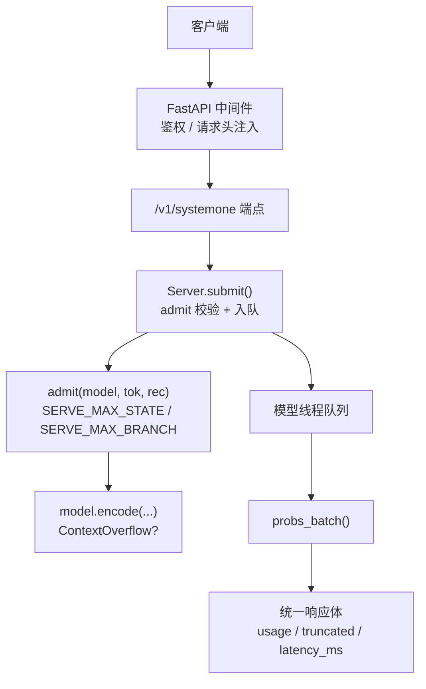
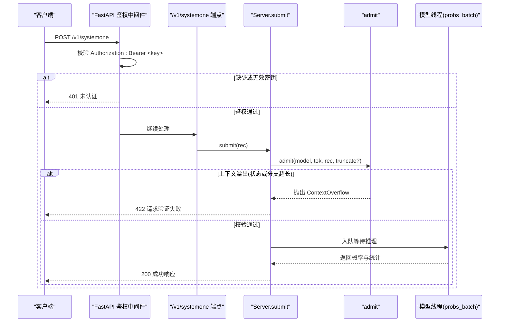
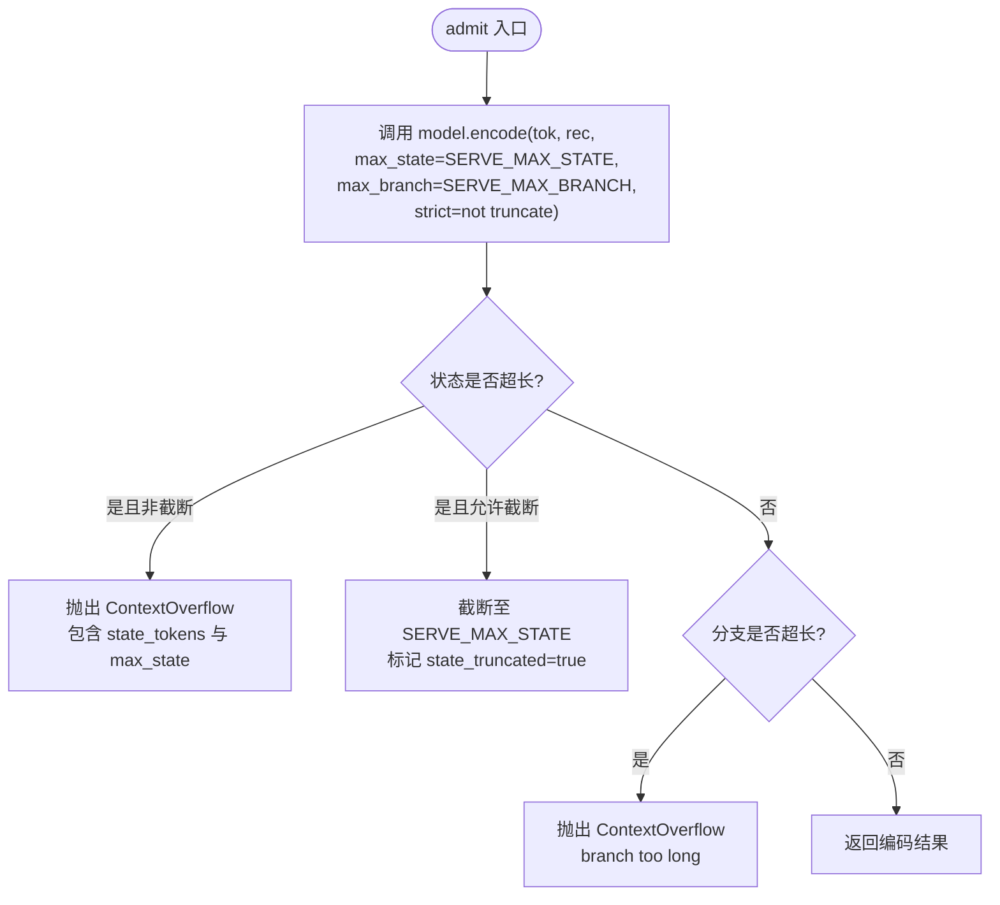
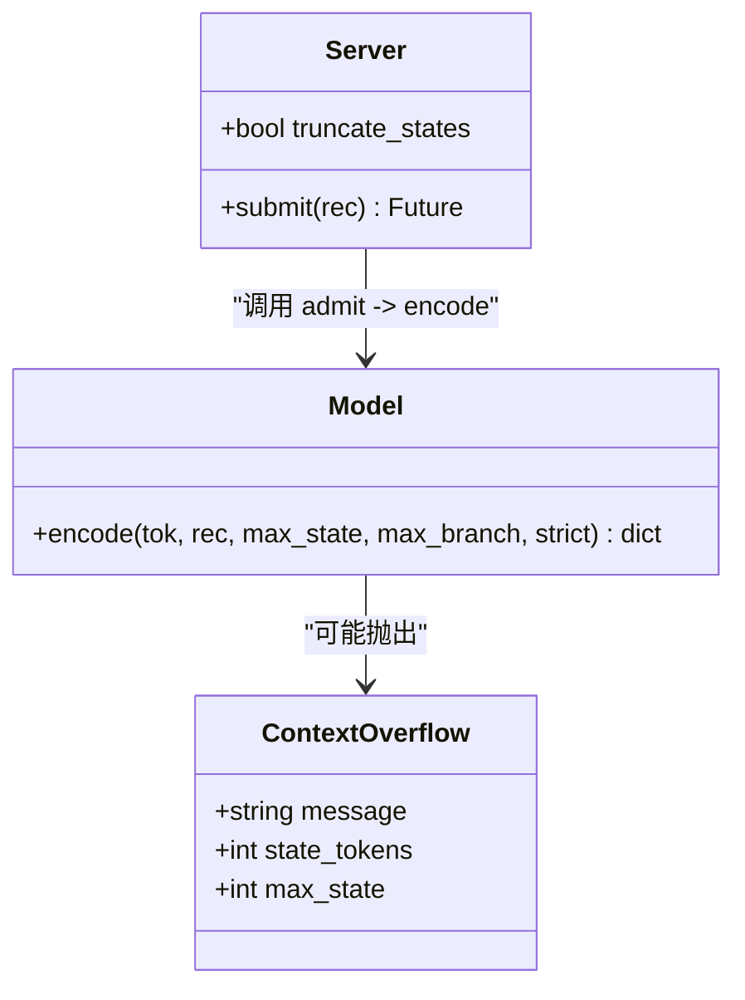
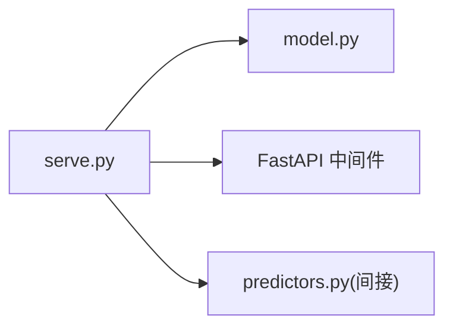

# 错误处理

<cite>
**本文引用的文件**   
- [model.py](file://kev/model.py)
- [serve.py](file://kev/serve.py)
- [README.md](file://README.md)
</cite>

## 目录
1. [简介](#简介)
2. [项目结构](#项目结构)
3. [核心组件](#核心组件)
4. [架构总览](#架构总览)
5. [详细组件分析](#详细组件分析)
6. [依赖关系分析](#依赖关系分析)
7. [性能与容量限制](#性能与容量限制)
8. [故障诊断与排错指南](#故障诊断与排错指南)
9. [结论](#结论)

## 简介
本文面向 Kev API 的错误处理机制，重点说明以下方面：
- HTTP 状态码含义：401（认证失败）、422（请求验证失败）、503（服务停止）。
- 常见错误消息：上下文溢出、状态长度超限、问题分支过长等。
- `admit` 函数的验证逻辑，包括 SERVE_MAX_STATE 与 SERVE_MAX_BRANCH 的限制。
- ContextOverflow 异常的处理方式，以及截断模式 KEV_TRUNCATE_STATES=1 的行为。
- 错误诊断与故障排除建议，帮助快速定位并修复问题。

## 项目结构
Kev 的 API 错误处理主要涉及两个模块：
- kev.model：定义上下文上限常量、编码与校验逻辑，以及 ContextOverflow 异常。
- kev.serve：FastAPI 服务端入口，负责鉴权、请求入队、调用 admit 校验、返回统一响应体与错误码。

**图示来源**
- [serve.py:232-242](file://kev/serve.py#L232-L242)
- [serve.py:249-252](file://kev/serve.py#L249-L252)
- [serve.py:132-145](file://kev/serve.py#L132-L145)
- [model.py:130-143](file://kev/model.py#L130-L143)

**章节来源**
- [serve.py:1-13](file://kev/serve.py#L1-L13)
- [model.py:15-28](file://kev/model.py#L15-L28)

## 核心组件
- ContextOverflow：表示记录无法在给定上下文中编码（状态或分支超长），用于向上层抛出结构化错误信息。
- admit：服务端的“准入”校验函数，依据 SERVE_MAX_STATE 与 SERVE_MAX_BRANCH 对请求进行严格检查；支持可选截断策略。
- Server.submit：将请求交给 admit 校验，若失败则直接返回 422；若通过则进入模型线程队列执行推理。
- FastAPI 鉴权中间件：当设置 KEV_API_KEY 时，对 /v1/* 路径进行 Bearer 鉴权，失败返回 401。

**章节来源**
- [model.py:50-58](file://kev/model.py#L50-L58)
- [model.py:130-143](file://kev/model.py#L130-L143)
- [serve.py:132-145](file://kev/serve.py#L132-L145)
- [serve.py:232-242](file://kev/serve.py#L232-L242)

## 架构总览
下图展示一次典型请求从到达 FastAPI 到返回结果的流程，以及错误分支如何被捕获并映射为 HTTP 状态码。

**图示来源**
- [serve.py:232-242](file://kev/serve.py#L232-L242)
- [serve.py:249-252](file://kev/serve.py#L249-L252)
- [serve.py:132-145](file://kev/serve.py#L132-L145)
- [model.py:130-143](file://kev/model.py#L130-L143)

## 详细组件分析

### HTTP 状态码与错误语义
- 401 未认证
  - 触发条件：设置了 KEV_API_KEY，但请求未携带正确的 Authorization: Bearer <key>。
  - 行为：FastAPI 中间件直接返回 401，并在响应头中附带 www-authenticate: Bearer。
- 422 请求验证失败
  - 触发条件：admit 校验失败，例如状态超过 SERVE_MAX_STATE 或问题分支超过 SERVE_MAX_BRANCH。
  - 行为：服务端返回 422，错误消息包含具体原因与修复建议；若为状态超长，还会提示可通过 KEV_TRUNCATE_STATES=1 启用截断模式。
- 503 服务停止
  - 触发条件：Server.close 已调用，服务正在停止或已停止。
  - 行为：submit 直接返回 503，提示“the server is stopping”。

**章节来源**
- [serve.py:232-242](file://kev/serve.py#L232-L242)
- [serve.py:138-142](file://kev/serve.py#L138-L142)

### admit 函数的验证逻辑
admit 是服务端的核心“准入”函数，负责将请求转换为模型可接受的编码，并应用以下限制：
- SERVE_MAX_STATE：状态最大 token 数（含 <state> 标记）。
- SERVE_MAX_BRANCH：单条问题的行预算（state + 该问题的分支 tokens）。
- strict 参数：默认严格模式，超出即抛 ContextOverflow；当 truncate=True 时，允许截断状态至 SERVE_MAX_STATE，并在编码结果中标记 state_truncated 与 state_tokens。

**图示来源**
- [model.py:130-143](file://kev/model.py#L130-L143)
- [model.py:87-127](file://kev/model.py#L87-L127)

**章节来源**
- [model.py:15-28](file://kev/model.py#L15-L28)
- [model.py:87-127](file://kev/model.py#L87-L127)
- [model.py:130-143](file://kev/model.py#L130-L143)

### ContextOverflow 异常与截断模式
- ContextOverflow 继承自 ValueError，包含额外字段：
  - state_tokens：状态的 token 计数（含 <state>）。
  - max_state：限制值。
- 截断模式 KEV_TRUNCATE_STATES=1：
  - 服务端启动时读取环境变量 TRUNCATE_STATES。
  - 开启后，admit 以 truncate=True 调用 encode，允许状态超长被截断至 SERVE_MAX_STATE。
  - 每次响应会携带 usage.state_tokens 与 usage.state_tokens_used，以及 truncated 标志位，表明是否发生了截断。

**图示来源**
- [model.py:50-58](file://kev/model.py#L50-L58)
- [serve.py:31-33](file://kev/serve.py#L31-L33)
- [serve.py:108-145](file://kev/serve.py#L108-L145)

**章节来源**
- [model.py:50-58](file://kev/model.py#L50-L58)
- [serve.py:31-33](file://kev/serve.py#L31-L33)
- [serve.py:108-145](file://kev/serve.py#L108-L145)

### 常见错误消息与含义
- “state exceeds ... tokens: ...”
  - 含义：状态 token 数量超过 SERVE_MAX_STATE。
  - 修复建议：缩短文档或将长文档拆分到多个请求；或在服务端启用 KEV_TRUNCATE_STATES=1。
- “branch too long: ... tokens with a ...-token state (row limit ...)”
  - 含义：单个问题的分支过长，导致整行（state + branch）超过 SERVE_MAX_BRANCH。
  - 修复建议：精简问题指令或选项描述，减少分支长度。
- “packed request exceeds the ...-token limit”
  - 含义：打包请求超过内部 packed 限制（多见于预测器侧，非服务端主路径）。
  - 修复建议：减少单次请求的问题数量或简化输入。

**章节来源**
- [model.py:102-113](file://kev/model.py#L102-L113)
- [model.py:138-142](file://kev/model.py#L138-L142)
- [predictors.py:129](file://kev/predictors.py#L129)

## 依赖关系分析
- serve.py 依赖 model.py 中的 admit、ContextOverflow 与 SERVE_MAX_STATE。
- FastAPI 中间件在 /v1/* 路径上拦截鉴权，失败返回 401。
- Server.submit 调用 admit 进行校验，失败返回 422；成功则入队由模型线程执行 probs_batch。
- 响应体由 _body 统一构造，包含 answers、usage、latency_ms，以及在截断模式下附加 truncated 与 state_tokens/state_tokens_used。

**图示来源**
- [serve.py:23-25](file://kev/serve.py#L23-L25)
- [serve.py:232-242](file://kev/serve.py#L232-L242)
- [serve.py:132-145](file://kev/serve.py#L132-L145)

**章节来源**
- [serve.py:23-25](file://kev/serve.py#L23-L25)
- [serve.py:232-242](file://kev/serve.py#L232-L242)
- [serve.py:132-145](file://kev/serve.py#L132-L145)

## 性能与容量限制
- 状态上限：SERVE_MAX_STATE = 65,536 tokens。
- 分支上限：SERVE_MAX_BRANCH = SERVE_MAX_STATE + 8,192。
- 打包上限：SERVE_MAX_PACKED = SERVE_MAX_STATE + SERVE_MAX_BRANCH。
- 每 pass 行数预算：ROW_PASS_TOKENS = 16,384，用于控制注意力掩码大小与内存占用。
- 训练上下文：MAX_STATE = 384，MAX_BRANCH = 1,024，MAX_PACKED = 2,048（与 serving 不同）。

这些限制直接影响 admit 的校验与错误消息生成。

**章节来源**
- [model.py:15-28](file://kev/model.py#L15-L28)
- [model.py:31-38](file://kev/model.py#L31-L38)

## 故障诊断与排错指南

### 快速识别错误类型
- 收到 401：检查是否设置了 KEV_API_KEY，并确保请求头包含 Authorization: Bearer <key>。
- 收到 422：查看错误消息是否包含“state exceeds”或“branch too long”，据此判断是状态超长还是分支过长。
- 收到 503：确认服务是否正在关闭或已停止；重试前等待服务恢复。

### 针对 422 的具体处理
- 状态超长（state exceeds）
  - 方案一：缩短文档或拆分请求。
  - 方案二：在服务端启用 KEV_TRUNCATE_STATES=1，使超长状态仅读取前 65,536 tokens，并在响应中标记 truncated=true。
- 分支过长（branch too long）
  - 精简问题指令或选项描述，确保单条问题的分支不超过 SERVE_MAX_BRANCH。

### 使用截断模式的注意事项
- 启用 KEV_TRUNCATE_STATES=1 后，所有响应都会包含：
  - truncated：是否发生截断。
  - usage.state_tokens：原始状态的 token 数。
  - usage.state_tokens_used：实际使用的 token 数（截断后小于等于前者）。
- 客户端应检查 truncated 字段，必要时调整上游数据预处理逻辑。

### 常见问题排查清单
- 鉴权失败（401）
  - 确认 KEV_API_KEY 已设置。
  - 确认请求头 Authorization: Bearer <key> 正确。
- 请求验证失败（422）
  - 检查 state 长度是否超过 65,536 tokens。
  - 检查每个问题的分支长度是否超过 SERVE_MAX_BRANCH。
  - 如确需处理超长状态，考虑启用 KEV_TRUNCATE_STATES=1。
- 服务不可用（503）
  - 检查服务进程是否仍在运行。
  - 避免在 close() 期间提交新请求。

**章节来源**
- [serve.py:232-242](file://kev/serve.py#L232-L242)
- [serve.py:138-142](file://kev/serve.py#L138-L142)
- [serve.py:211-220](file://kev/serve.py#L211-L220)
- [README.md:252-258](file://README.md#L252-L258)

## 结论
Kev API 的错误处理围绕三个关键状态码展开：401 鉴权失败、422 请求验证失败、503 服务停止。其中 422 主要由 admit 的上下文限制触发，包括状态超长与分支过长。通过理解 SERVE_MAX_STATE 与 SERVE_MAX_BRANCH 的含义，并结合 KEV_TRUNCATE_STATES=1 的截断模式，可以有效提升对超长输入的兼容性。配合本文的诊断与排错指南，可以快速定位并解决大多数错误场景。