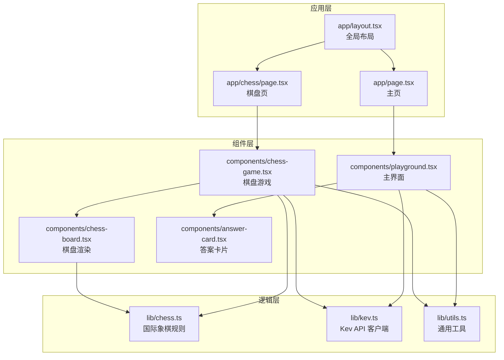
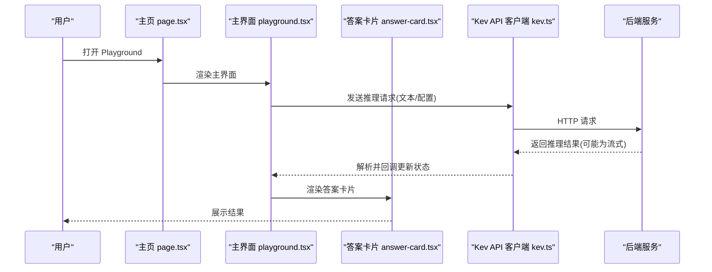
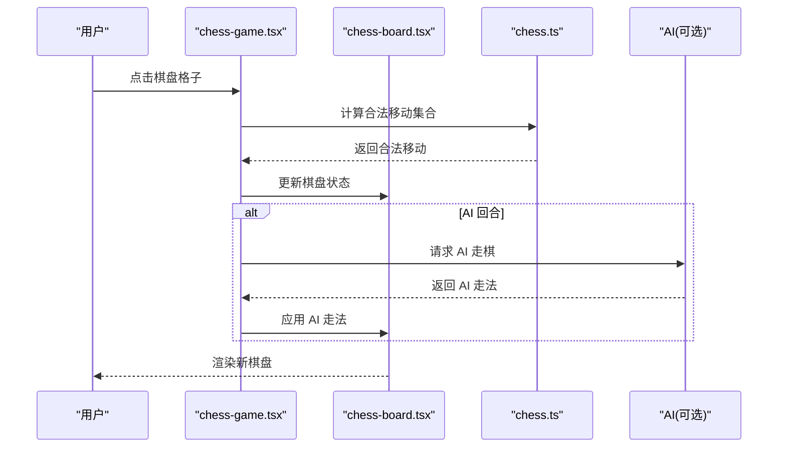
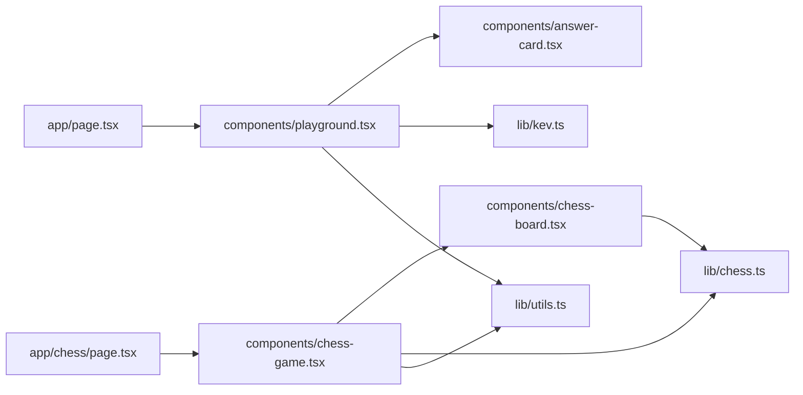

<cite>
**本文引用的文件**   
- [playground/package.json](file://playground/package.json)
- [playground/next.config.ts](file://playground/next.config.ts)
- [playground/tsconfig.json](file://playground/tsconfig.json)
- [playground/src/app/layout.tsx](file://playground/src/app/layout.tsx)
- [playground/src/app/page.tsx](file://playground/src/app/page.tsx)
- [playground/src/app/chess/page.tsx](file://playground/src/app/chess/page.tsx)
- [playground/src/components/playground.tsx](file://playground/src/components/playground.tsx)
- [playground/src/components/chess-game.tsx](file://playground/src/components/chess-game.tsx)
- [playground/src/components/chess-board.tsx](file://playground/src/components/chess-board.tsx)
- [playground/src/components/answer-card.tsx](file://playground/src/components/answer-card.tsx)
- [playground/src/lib/chess.ts](file://playground/src/lib/chess.ts)
- [playground/src/lib/kev.ts](file://playground/src/lib/kev.ts)
- [playground/src/lib/utils.ts](file://playground/src/lib/utils.ts)
</cite>

## 目录
1. [简介](#简介)
2. [项目结构](#项目结构)
3. [核心组件](#核心组件)
4. [架构总览](#架构总览)
5. [详细组件分析](#详细组件分析)
6. [依赖关系分析](#依赖关系分析)
7. [性能与体验优化](#性能与体验优化)
8. [故障排查指南](#故障排查指南)
9. [结论](#结论)
10. [附录：开发环境与调试](#附录开发环境与调试)

## 简介
Playground 是 Kev 的前端交互式界面，基于 Next.js、TypeScript 与 React 构建。它提供预设加载、文本编辑、问题配置、实时推理与结果展示等能力，并内置国际象棋棋盘游戏（含规则校验与 AI 对战）。文档面向开发者与使用者，帮助快速理解前端技术栈、组件结构与后端 API 交互逻辑，并提供扩展自定义预设与棋盘游戏的指南。

## 项目结构
Playground 采用 Next.js App Router 组织页面，React 组件按功能拆分到 components 目录，业务逻辑与工具函数位于 lib 目录。关键目录与职责如下：
- src/app：Next.js 路由入口与全局布局
- src/components：UI 与业务组件（主界面、棋盘游戏、答案卡片等）
- src/lib：领域逻辑（国际象棋规则）、API 客户端与通用工具
- public：静态资源
- scripts：辅助脚本（如评测脚本）

图示来源
- [playground/src/app/layout.tsx](file://playground/src/app/layout.tsx)
- [playground/src/app/page.tsx](file://playground/src/app/page.tsx)
- [playground/src/app/chess/page.tsx](file://playground/src/app/chess/page.tsx)
- [playground/src/components/playground.tsx](file://playground/src/components/playground.tsx)
- [playground/src/components/chess-game.tsx](file://playground/src/components/chess-game.tsx)
- [playground/src/components/chess-board.tsx](file://playground/src/components/chess-board.tsx)
- [playground/src/components/answer-card.tsx](file://playground/src/components/answer-card.tsx)
- [playground/src/lib/chess.ts](file://playground/src/lib/chess.ts)
- [playground/src/lib/kev.ts](file://playground/src/lib/kev.ts)
- [playground/src/lib/utils.ts](file://playground/src/lib/utils.ts)

章节来源
- [playground/package.json](file://playground/package.json)
- [playground/next.config.ts](file://playground/next.config.ts)
- [playground/tsconfig.json](file://playground/tsconfig.json)

## 核心组件
- 主界面组件 playground.tsx：负责预设加载、文本编辑、问题参数配置、调用 Kev API 进行推理，以及结果展示（通过 answer-card.tsx）。
- 棋盘游戏组件 chess-game.tsx：管理对局状态、回合推进、AI 走棋与用户交互。
- 棋盘渲染组件 chess-board.tsx：根据棋盘状态渲染格子与棋子，处理点击事件。
- 答案卡片组件 answer-card.tsx：以结构化方式展示推理结果与元数据。
- 国际象棋规则库 chess.ts：定义棋盘表示、移动生成、合法性检查、胜负判定等。
- Kev API 客户端 kev.ts：封装请求发送、流式响应处理、错误处理与重试策略。
- 工具库 utils.ts：通用工具函数（如格式化、防抖、类型判断等）。

章节来源
- [playground/src/components/playground.tsx](file://playground/src/components/playground.tsx)
- [playground/src/components/chess-game.tsx](file://playground/src/components/chess-game.tsx)
- [playground/src/components/chess-board.tsx](file://playground/src/components/chess-board.tsx)
- [playground/src/components/answer-card.tsx](file://playground/src/components/answer-card.tsx)
- [playground/src/lib/chess.ts](file://playground/src/lib/chess.ts)
- [playground/src/lib/kev.ts](file://playground/src/lib/kev.ts)
- [playground/src/lib/utils.ts](file://playground/src/lib/utils.ts)

## 架构总览
Playground 遵循“页面 → 组件 → 逻辑”的分层架构。页面组件负责路由与容器逻辑；业务组件组合 UI 与状态；lib 层提供可复用的领域逻辑与网络客户端。

图示来源
- [playground/src/app/page.tsx](file://playground/src/app/page.tsx)
- [playground/src/components/playground.tsx](file://playground/src/components/playground.tsx)
- [playground/src/components/answer-card.tsx](file://playground/src/components/answer-card.tsx)
- [playground/src/lib/kev.ts](file://playground/src/lib/kev.ts)

## 详细组件分析

### 主界面组件（playground.tsx）
- 功能要点
  - 预设加载：从本地或远端加载预设模板，支持选择与切换。
  - 文本编辑：提供输入区域用于编写提示词或任务描述。
  - 问题配置：暴露模型参数（如温度、最大长度等）供用户调整。
  - 实时推理：调用 Kev API 客户端发起请求，支持流式增量显示。
  - 结果展示：将推理结果渲染至答案卡片，支持复制、分享等操作。
- 状态设计
  - 文本内容、已选预设、模型参数、推理状态（加载中/完成/失败）、结果数据。
- 交互流程
  - 用户编辑文本与参数 → 触发推理 → 流式更新 → 渲染答案卡片。

图示来源
- [playground/src/components/playground.tsx](file://playground/src/components/playground.tsx)
- [playground/src/lib/kev.ts](file://playground/src/lib/kev.ts)

章节来源
- [playground/src/components/playground.tsx](file://playground/src/components/playground.tsx)
- [playground/src/lib/kev.ts](file://playground/src/lib/kev.ts)

### 棋盘游戏组件（chess-game.tsx）
- 功能要点
  - 对局生命周期：初始化、回合推进、胜负判定、重置。
  - 用户交互：点击选中棋子、合法移动高亮、落子确认。
  - AI 对战：在指定时机调用 AI 走棋逻辑（可与 Kev API 集成）。
  - 状态同步：与 chess-board.tsx 保持视图一致。
- 状态设计
  - 棋盘状态、当前执棋方、历史走法、游戏状态（进行中/结束）、AI 模式开关。
- 交互流程
  - 用户点击 → 校验移动合法性 → 更新棋盘 → 若为 AI 回合则自动走棋。

图示来源
- [playground/src/components/chess-game.tsx](file://playground/src/components/chess-game.tsx)
- [playground/src/components/chess-board.tsx](file://playground/src/components/chess-board.tsx)
- [playground/src/lib/chess.ts](file://playground/src/lib/chess.ts)

章节来源
- [playground/src/components/chess-game.tsx](file://playground/src/components/chess-game.tsx)
- [playground/src/components/chess-board.tsx](file://playground/src/components/chess-board.tsx)
- [playground/src/lib/chess.ts](file://playground/src/lib/chess.ts)

### 棋盘渲染组件（chess-board.tsx）
- 功能要点
  - 根据棋盘状态绘制格子与棋子。
  - 处理点击事件，向父组件传递选中格子坐标。
  - 高亮合法移动路径与目标格。
- 性能考虑
  - 避免不必要的重渲染，仅在状态变化时更新。
  - 使用稳定的 key 与 memo 优化。

章节来源
- [playground/src/components/chess-board.tsx](file://playground/src/components/chess-board.tsx)
- [playground/src/lib/chess.ts](file://playground/src/lib/chess.ts)

### 答案卡片组件（answer-card.tsx）
- 功能要点
  - 结构化展示推理结果（正文、元数据、时间戳等）。
  - 支持复制、导出、评分等扩展操作。
  - 适配不同结果格式（纯文本、JSON、Markdown）。
- 交互设计
  - 折叠/展开详细内容。
  - 错误信息友好提示。

章节来源
- [playground/src/components/answer-card.tsx](file://playground/src/components/answer-card.tsx)

### 国际象棋规则库（chess.ts）
- 功能要点
  - 棋盘表示与坐标系统。
  - 移动生成与合法性检查（包括王车易位、吃过路兵、升变等）。
  - 局面评估与胜负判定。
- 复杂度与优化
  - 预计算合法移动表以提升性能。
  - 缓存局面哈希以减少重复计算。

章节来源
- [playground/src/lib/chess.ts](file://playground/src/lib/chess.ts)

### Kev API 客户端（kev.ts）
- 功能要点
  - 封装请求发送（GET/POST），支持流式响应（SSE/ReadableStream）。
  - 统一错误处理（网络异常、服务端错误、超时重试）。
  - 提供便捷方法：runInference、streamResult、cancelRequest。
- 错误处理
  - 区分连接错误、认证错误、业务错误。
  - 提供降级策略与用户提示。

章节来源
- [playground/src/lib/kev.ts](file://playground/src/lib/kev.ts)

### 工具库（utils.ts）
- 功能要点
  - 通用工具：防抖、节流、深拷贝、类型守卫、日期格式化等。
  - 与 UI 组件配合的辅助函数（如颜色映射、尺寸计算）。

章节来源
- [playground/src/lib/utils.ts](file://playground/src/lib/utils.ts)

## 依赖关系分析
组件与模块之间的依赖关系如下：

图示来源
- [playground/src/app/page.tsx](file://playground/src/app/page.tsx)
- [playground/src/app/chess/page.tsx](file://playground/src/app/chess/page.tsx)
- [playground/src/components/playground.tsx](file://playground/src/components/playground.tsx)
- [playground/src/components/chess-game.tsx](file://playground/src/components/chess-game.tsx)
- [playground/src/components/chess-board.tsx](file://playground/src/components/chess-board.tsx)
- [playground/src/components/answer-card.tsx](file://playground/src/components/answer-card.tsx)
- [playground/src/lib/kev.ts](file://playground/src/lib/kev.ts)
- [playground/src/lib/chess.ts](file://playground/src/lib/chess.ts)
- [playground/src/lib/utils.ts](file://playground/src/lib/utils.ts)

章节来源
- [playground/src/app/page.tsx](file://playground/src/app/page.tsx)
- [playground/src/app/chess/page.tsx](file://playground/src/app/chess/page.tsx)
- [playground/src/components/playground.tsx](file://playground/src/components/playground.tsx)
- [playground/src/components/chess-game.tsx](file://playground/src/components/chess-game.tsx)
- [playground/src/components/chess-board.tsx](file://playground/src/components/chess-board.tsx)
- [playground/src/components/answer-card.tsx](file://playground/src/components/answer-card.tsx)
- [playground/src/lib/kev.ts](file://playground/src/lib/kev.ts)
- [playground/src/lib/chess.ts](file://playground/src/lib/chess.ts)
- [playground/src/lib/utils.ts](file://playground/src/lib/utils.ts)

## 性能与体验优化
- 流式推理：优先使用流式响应减少首字节延迟，逐步渲染答案卡片。
- 组件优化：合理使用 React.memo、useMemo、useCallback 避免不必要重渲染。
- 棋盘渲染：仅更新变化格子，避免整盘重绘。
- 网络优化：请求去重、超时控制、指数退避重试。
- 内存管理：及时释放流式读取器与定时器，防止内存泄漏。

[本节为通用指导，不直接分析具体文件]

## 故障排查指南
- 无法加载预设
  - 检查预设数据来源与 CORS 配置。
  - 验证预设 JSON 结构与字段完整性。
- 推理请求失败
  - 查看网络面板与日志，确认后端地址与鉴权。
  - 检查超时与重试策略是否合理。
- 棋盘移动非法
  - 核对 chess.ts 中的规则实现与边界情况（王车易位、吃过路兵、升变）。
  - 确认棋盘状态与历史记录一致性。
- 流式结果不更新
  - 检查流式读取器的关闭与错误处理。
  - 确保状态更新不会阻塞 UI 线程。

章节来源
- [playground/src/lib/kev.ts](file://playground/src/lib/kev.ts)
- [playground/src/lib/chess.ts](file://playground/src/lib/chess.ts)

## 结论
Playground 通过清晰的组件分层与可复用的逻辑库，提供了完整的交互式推理与棋盘游戏体验。其可扩展的预设机制与 API 客户端设计，便于后续接入更多模型与服务。棋盘游戏具备完善的规则实现与 AI 对战能力，可作为进一步扩展的基础。

[本节为总结性内容，不直接分析具体文件]

## 附录：开发环境与调试
- 环境要求
  - Node.js 与 npm/yarn/pnpm（依据 package.json 指定版本）。
- 安装依赖
  - 在项目根目录执行包管理器安装命令。
- 启动开发服务器
  - 运行 Next.js 开发服务器，访问 localhost 端口查看界面。
- 构建与预览
  - 执行构建命令生成生产包，并通过预览命令本地预览。
- 调试建议
  - 使用浏览器开发者工具观察网络请求与组件状态。
  - 在关键函数添加日志输出，定位问题链路。
  - 针对流式推理，监控流式数据的到达与解析过程。

章节来源
- [playground/package.json](file://playground/package.json)
- [playground/next.config.ts](file://playground/next.config.ts)
- [playground/tsconfig.json](file://playground/tsconfig.json)