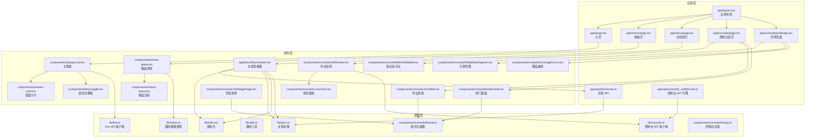
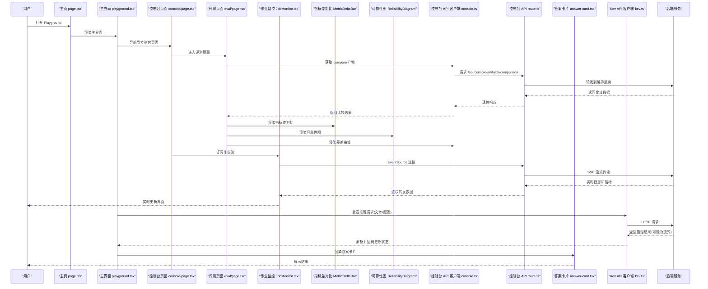
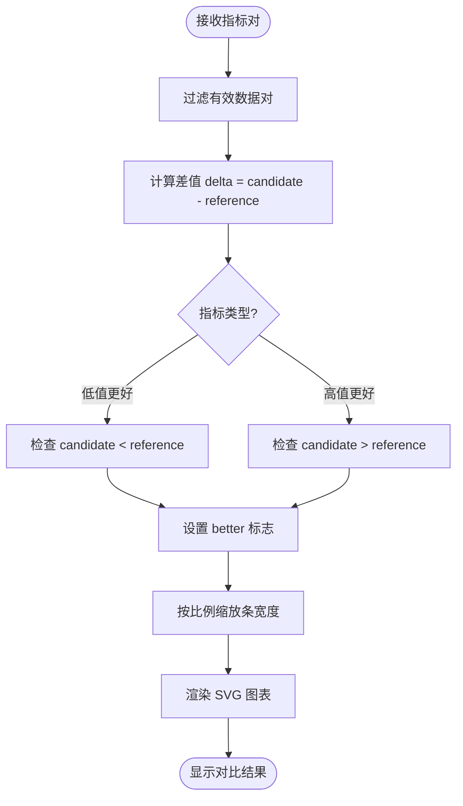
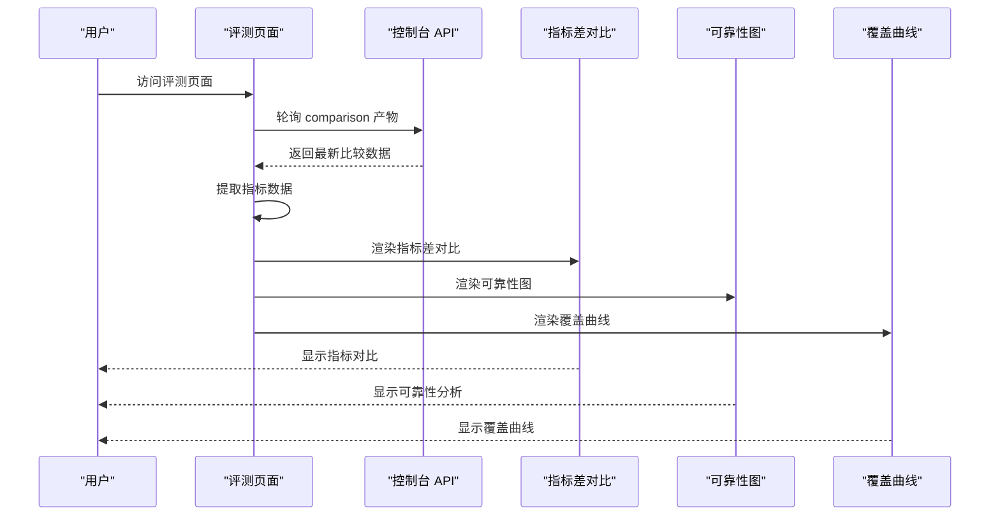
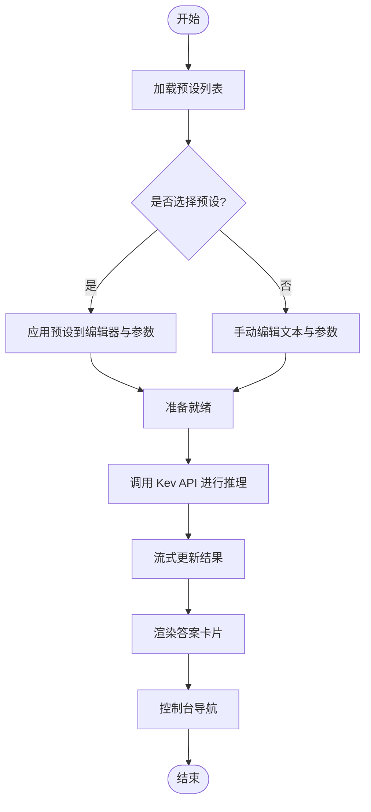
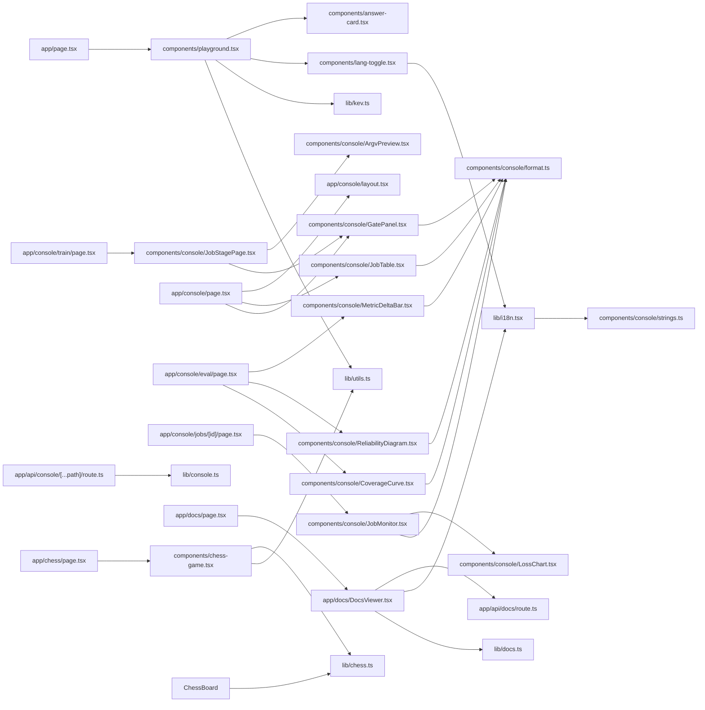

# Playground 界面

<cite>
**本文引用的文件**   
- [playground/package.json](file://playground/package.json)
- [playground/next.config.ts](file://playground/next.config.ts)
- [playground/tsconfig.json](file://playground/tsconfig.json)
- [playground/src/app/layout.tsx](file://playground/src/app/layout.tsx)
- [playground/src/app/page.tsx](file://playground/src/app/page.tsx)
- [playground/src/app/chess/page.tsx](file://playground/src/app/chess/page.tsx)
- [playground/src/app/docs/page.tsx](file://playground/src/app/docs/page.tsx)
- [playground/src/app/docs/DocsViewer.tsx](file://playground/src/app/docs/DocsViewer.tsx)
- [playground/src/app/api/docs/route.ts](file://playground/src/app/api/docs/route.ts)
- [playground/src/app/api/console/[...path]/route.ts](file://playground/src/app/api/console/[...path]/route.ts)
- [playground/src/components/playground.tsx](file://playground/src/components/playground.tsx)
- [playground/src/components/chess-game.tsx](file://playground/src/components/chess-game.tsx)
- [playground/src/components/chess-board.tsx](file://playground/src/components/chess-board.tsx)
- [playground/src/components/answer-card.tsx](file://playground/src/components/answer-card.tsx)
- [playground/src/components/lang-toggle.tsx](file://playground/src/components/lang-toggle.tsx)
- [playground/src/lib/chess.ts](file://playground/src/lib/chess.ts)
- [playground/src/lib/kev.ts](file://playground/src/lib/kev.ts)
- [playground/src/lib/utils.ts](file://playground/src/lib/utils.ts)
- [playground/src/lib/i18n.tsx](file://playground/src/lib/i18n.tsx)
- [playground/src/lib/docs.ts](file://playground/src/lib/docs.ts)
- [playground/src/lib/console.ts](file://playground/src/lib/console.ts)
- [playground/src/app/console/page.tsx](file://playground/src/app/console/page.tsx)
- [playground/src/app/console/layout.tsx](file://playground/src/app/console/layout.tsx)
- [playground/src/app/console/jobs/[id]/page.tsx](file://playground/src/app/console/jobs/[id]/page.tsx)
- [playground/src/app/console/train/page.tsx](file://playground/src/app/console/train/page.tsx)
- [playground/src/app/console/eval/page.tsx](file://playground/src/app/console/eval/page.tsx)
- [playground/src/components/console/JobMonitor.tsx](file://playground/src/components/console/JobMonitor.tsx)
- [playground/src/components/console/JobTable.tsx](file://playground/src/components/console/JobTable.tsx)
- [playground/src/components/console/LossChart.tsx](file://playground/src/components/console/LossChart.tsx)
- [playground/src/components/console/GatePanel.tsx](file://playground/src/components/console/GatePanel.tsx)
- [playground/src/components/console/format.ts](file://playground/src/components/console/format.ts)
- [playground/src/components/console/JobStagePage.tsx](file://playground/src/components/console/JobStagePage.tsx)
- [playground/src/components/console/MetricDeltaBar.tsx](file://playground/src/components/console/MetricDeltaBar.tsx)
- [playground/src/components/console/ReliabilityDiagram.tsx](file://playground/src/components/console/ReliabilityDiagram.tsx)
- [playground/src/components/console/CoverageCurve.tsx](file://playground/src/components/console/CoverageCurve.tsx)
- [playground/src/components/console/strings.ts](file://playground/src/components/console/strings.ts)
</cite>

## 更新摘要
**所做更改**   
- 新增三个医疗微调评估可视化组件：指标差对比图、可靠性图和覆盖曲线
- 实现完整的控制台评测页面，支持 baseline/benchmark/compare 三阶段工作流
- 增强国际化系统，新增大量控制台相关翻译键值和医疗场景专用文案
- 扩展主界面以集成控制台导航入口和文档查看功能
- 完善控制台管理界面，包含作业监控、训练配置和结果可视化功能

## 目录
1. [简介](#简介)
2. [项目结构](#项目结构)
3. [核心组件](#核心组件)
4. [架构总览](#架构总览)
5. [详细组件分析](#详细组件分析)
6. [依赖关系分析](#依赖关系分析)
7. [性能与体验优化](#性能与体验优化)
8. [故障排查指南](#故障排查指南)
9. [结论](#结论)
10. [附录：开发环境与调试](#附录开发环境与调试)

## 简介
Playground 是 Kev 的前端交互式界面，基于 Next.js、TypeScript 与 React 构建。它提供预设加载、文本编辑、问题配置、实时推理与结果展示等能力，并内置国际象棋棋盘游戏（含规则校验与 AI 对战）。最新版本新增了完整的控制台管理界面，支持作业监控、训练配置、产物管理和实时指标可视化。特别新增了医疗微调评估功能，包含指标差对比、校准可靠性和选择性覆盖等高级可视化组件。同时增强了文档查看器功能，支持多语言界面和直接在 Playground 中查看项目文档。文档面向开发者与使用者，帮助快速理解前端技术栈、组件结构与后端 API 交互逻辑，并提供扩展自定义预设与棋盘游戏的指南。

## 项目结构
Playground 采用 Next.js App Router 组织页面，React 组件按功能拆分到 components 目录，业务逻辑与工具函数位于 lib 目录。关键目录与职责如下：
- src/app：Next.js 路由入口与全局布局，包括新增的 console 控制台页面、eval 评测页面和 api 路由
- src/components：UI 与业务组件（主界面、棋盘游戏、答案卡片、语言切换器、控制台组件、医疗评估可视化组件）
- src/lib：领域逻辑（国际象棋规则）、API 客户端、i18n 国际化、文档处理工具、控制台客户端
- public：静态资源
- scripts：辅助脚本（如评测脚本）

图示来源
- [playground/src/app/layout.tsx](file://playground/src/app/layout.tsx)
- [playground/src/app/page.tsx](file://playground/src/app/page.tsx)
- [playground/src/app/chess/page.tsx](file://playground/src/app/chess/page.tsx)
- [playground/src/app/docs/page.tsx](file://playground/src/app/docs/page.tsx)
- [playground/src/app/console/page.tsx](file://playground/src/app/console/page.tsx)
- [playground/src/app/console/eval/page.tsx](file://playground/src/app/console/eval/page.tsx)
- [playground/src/app/api/docs/route.ts](file://playground/src/app/api/docs/route.ts)
- [playground/src/app/api/console/[...path]/route.ts](file://playground/src/app/api/console/[...path]/route.ts)
- [playground/src/components/playground.tsx](file://playground/src/components/playground.tsx)
- [playground/src/components/chess-game.tsx](file://playground/src/components/chess-game.tsx)
- [playground/src/components/chess-board.tsx](file://playground/src/components/chess-board.tsx)
- [playground/src/components/answer-card.tsx](file://playground/src/components/answer-card.tsx)
- [playground/src/components/lang-toggle.tsx](file://playground/src/components/lang-toggle.tsx)
- [playground/src/app/docs/DocsViewer.tsx](file://playground/src/app/docs/DocsViewer.tsx)
- [playground/src/components/console/JobMonitor.tsx](file://playground/src/components/console/JobMonitor.tsx)
- [playground/src/components/console/JobTable.tsx](file://playground/src/components/console/JobTable.tsx)
- [playground/src/components/console/LossChart.tsx](file://playground/src/components/console/LossChart.tsx)
- [playground/src/components/console/GatePanel.tsx](file://playground/src/components/console/GatePanel.tsx)
- [playground/src/components/console/JobStagePage.tsx](file://playground/src/components/console/JobStagePage.tsx)
- [playground/src/components/console/MetricDeltaBar.tsx](file://playground/src/components/console/MetricDeltaBar.tsx)
- [playground/src/components/console/ReliabilityDiagram.tsx](file://playground/src/components/console/ReliabilityDiagram.tsx)
- [playground/src/components/console/CoverageCurve.tsx](file://playground/src/components/console/CoverageCurve.tsx)
- [playground/src/lib/chess.ts](file://playground/src/lib/chess.ts)
- [playground/src/lib/kev.ts](file://playground/src/lib/kev.ts)
- [playground/src/lib/console.ts](file://playground/src/lib/console.ts)
- [playground/src/lib/utils.ts](file://playground/src/lib/utils.ts)
- [playground/src/lib/i18n.tsx](file://playground/src/lib/i18n.tsx)
- [playground/src/lib/docs.ts](file://playground/src/lib/docs.ts)
- [playground/src/components/console/format.ts](file://playground/src/components/console/format.ts)
- [playground/src/components/console/strings.ts](file://playground/src/components/console/strings.ts)

章节来源
- [playground/package.json](file://playground/package.json)
- [playground/next.config.ts](file://playground/next.config.ts)
- [playground/tsconfig.json](file://playground/tsconfig.json)

## 核心组件
- 主界面组件 playground.tsx：负责预设加载、文本编辑、问题参数配置、调用 Kev API 进行推理，以及结果展示（通过 answer-card.tsx）。现已集成语言切换器、文档导航和控制台导航入口。
- 控制台管理界面：全新的作业监控系统，包含作业列表、详情查看、实时日志、损失图表和闸门验证。
- **新增** 评测页面 eval/page.tsx：医疗微调评估的核心界面，支持 baseline/benchmark/compare 三阶段工作流，集成三个高级可视化组件。
- **新增** 指标差对比组件 MetricDeltaBar.tsx：手写 SVG 实现的 baseline vs 微调指标对比图，智能判断指标改善方向。
- **新增** 可靠性图组件 ReliabilityDiagram.tsx：可视化高置信区间的模型校准可靠性，检测过度自信问题。
- **新增** 覆盖曲线组件 CoverageCurve.tsx：展示选择性覆盖 vs 错误率的关系，评估模型自主决策能力。
- 文档查看器 DocsViewer.tsx：支持文档树导航、搜索、语言切换和 Mermaid 图表渲染。
- 语言切换器 lang-toggle.tsx：提供中英文界面切换功能，使用 i18n 系统管理 UI 文本。
- 棋盘游戏组件 chess-game.tsx：管理对局状态、回合推进、AI 走棋与用户交互。
- 棋盘渲染组件 chess-board.tsx：根据棋盘状态渲染格子与棋子，处理点击事件。
- 答案卡片组件 answer-card.tsx：以结构化方式展示推理结果与元数据。
- 作业监控组件 JobMonitor.tsx：实时显示训练进度、日志输出和指标曲线。
- 作业表格组件 JobTable.tsx：展示所有作业的状态、操作和基本信息。
- 损失图表组件 LossChart.tsx：手写 SVG 实现的训练指标可视化。
- 闸门面板组件 GatePanel.tsx：显示验收门槛的通过/失败状态。
- 阶段表单组件 JobStagePage.tsx：通用的作业提交表单，支持动态字段和预览。
- 国际象棋规则库 chess.ts：定义棋盘表示、移动生成、合法性检查、胜负判定等。
- Kev API 客户端 kev.ts：封装请求发送、流式响应处理、错误处理与重试策略。
- 控制台 API 客户端 console.ts：统一管理控制台相关的 API 调用和类型定义。
- **新增** 控制台文案 strings.ts：集中管理控制台界面的中英文翻译，支持医疗场景专用文案。
- 国际化系统 i18n.tsx：提供多语言支持和翻译管理，合并控制台字符串到统一字典。
- 文档处理工具 docs.ts：处理文档树构建、路径解析和内容过滤。
- 工具库 utils.ts：通用工具函数（如格式化、防抖、类型判断等）。

章节来源
- [playground/src/components/playground.tsx](file://playground/src/components/playground.tsx)
- [playground/src/app/console/eval/page.tsx](file://playground/src/app/console/eval/page.tsx)
- [playground/src/components/console/MetricDeltaBar.tsx](file://playground/src/components/console/MetricDeltaBar.tsx)
- [playground/src/components/console/ReliabilityDiagram.tsx](file://playground/src/components/console/ReliabilityDiagram.tsx)
- [playground/src/components/console/CoverageCurve.tsx](file://playground/src/components/console/CoverageCurve.tsx)
- [playground/src/app/docs/DocsViewer.tsx](file://playground/src/app/docs/DocsViewer.tsx)
- [playground/src/components/lang-toggle.tsx](file://playground/src/components/lang-toggle.tsx)
- [playground/src/components/chess-game.tsx](file://playground/src/components/chess-game.tsx)
- [playground/src/components/chess-board.tsx](file://playground/src/components/chess-board.tsx)
- [playground/src/components/answer-card.tsx](file://playground/src/components/answer-card.tsx)
- [playground/src/components/console/JobMonitor.tsx](file://playground/src/components/console/JobMonitor.tsx)
- [playground/src/components/console/JobTable.tsx](file://playground/src/components/console/JobTable.tsx)
- [playground/src/components/console/LossChart.tsx](file://playground/src/components/console/LossChart.tsx)
- [playground/src/components/console/GatePanel.tsx](file://playground/src/components/console/GatePanel.tsx)
- [playground/src/components/console/JobStagePage.tsx](file://playground/src/components/console/JobStagePage.tsx)
- [playground/src/lib/chess.ts](file://playground/src/lib/chess.ts)
- [playground/src/lib/kev.ts](file://playground/src/lib/kev.ts)
- [playground/src/lib/console.ts](file://playground/src/lib/console.ts)
- [playground/src/components/console/strings.ts](file://playground/src/components/console/strings.ts)
- [playground/src/lib/i18n.tsx](file://playground/src/lib/i18n.tsx)
- [playground/src/lib/docs.ts](file://playground/src/lib/docs.ts)
- [playground/src/lib/utils.ts](file://playground/src/lib/utils.ts)

## 架构总览
Playground 遵循"页面 → 组件 → 逻辑"的分层架构。页面组件负责路由与容器逻辑；业务组件组合 UI 与状态；lib 层提供可复用的领域逻辑与网络客户端。新增的控制台管理界面通过 API 路由代理与编排服务通信，支持 SSE 流式传输和实时作业监控。评测页面专门处理医疗微调评估流程，通过三个高级可视化组件展示模型性能对比和校准质量。文档查看器通过 API 路由动态加载 Markdown 内容，支持多语言切换和 Mermaid 图表渲染。

图示来源
- [playground/src/app/page.tsx](file://playground/src/app/page.tsx)
- [playground/src/components/playground.tsx](file://playground/src/components/playground.tsx)
- [playground/src/app/console/page.tsx](file://playground/src/app/console/page.tsx)
- [playground/src/app/console/eval/page.tsx](file://playground/src/app/console/eval/page.tsx)
- [playground/src/components/console/JobMonitor.tsx](file://playground/src/components/console/JobMonitor.tsx)
- [playground/src/components/console/MetricDeltaBar.tsx](file://playground/src/components/console/MetricDeltaBar.tsx)
- [playground/src/components/console/ReliabilityDiagram.tsx](file://playground/src/components/console/ReliabilityDiagram.tsx)
- [playground/src/components/console/CoverageCurve.tsx](file://playground/src/components/console/CoverageCurve.tsx)
- [playground/src/app/api/console/[...path]/route.ts](file://playground/src/app/api/console/[...path]/route.ts)
- [playground/src/components/answer-card.tsx](file://playground/src/components/answer-card.tsx)
- [playground/src/lib/kev.ts](file://playground/src/lib/kev.ts)
- [playground/src/lib/console.ts](file://playground/src/lib/console.ts)

## 详细组件分析

### 指标差对比组件（MetricDeltaBar.tsx）
- 功能要点
  - 手写 SVG 实现：不依赖第三方图表库，保持轻量级依赖。
  - 智能方向判断：自动识别不同指标的改善方向（ECE/Brier/NLL/AURC/confident_error_rate 越低越好，acc/coverage_* 越高越好）。
  - 双栏对比：左侧显示退步（红色），右侧显示进步（绿色）。
  - 零线基准：以零线为中心，直观展示改进或退步幅度。
  - 多语言支持：标签和说明支持中英文切换。
- 数据格式
  - MetricPair 类型：包含 name、reference（基线值）、candidate（候选值）。
  - 自动计算 delta 值和 better 标志。
- 视觉设计
  - 使用 CSS 变量定义的色板（--color-chart-2 绿色表示改善，--color-chart-5 红色表示退步）。
  - 渐变条状图，宽度与变化幅度成正比。
  - 底部说明文字解释颜色含义和注意事项。

**新增** 这是新创建的指标差对比组件，用于医疗微调场景中 baseline vs 微调模型的指标对比。

图示来源
- [playground/src/components/console/MetricDeltaBar.tsx](file://playground/src/components/console/MetricDeltaBar.tsx)

章节来源
- [playground/src/components/console/MetricDeltaBar.tsx](file://playground/src/components/console/MetricDeltaBar.tsx)

### 可靠性图组件（ReliabilityDiagram.tsx）
- 功能要点
  - 高置信区间可视化：展示 0.9/0.95/0.99 三个置信度阈值的可靠性。
  - 过度自信检测：柱顶低于横线表示模型在该置信度上过度自信。
  - ECE 指标：显示 Expected Calibration Error 数值。
  - 梯度填充：使用线性渐变增强视觉效果。
  - 样本数量标注：每个区间显示样本数量 n。
- 数据格式
  - TopBin 类型：包含 n（样本数）、errors（错误数）、error_rate（错误率）。
  - 支持可选的 ece 参数显示整体校准误差。
- 视觉设计
  - 柱状图高度表示实测准确率（1 - error_rate）。
  - 横线表示置信度阈值，柱顶应达到该线。
  - 颜色编码：绿色表示校准良好，红色表示过度自信。
  - 网格线和刻度标记提升可读性。

**新增** 这是新创建的可靠性图组件，用于检测模型在高置信度下的过度自信问题。

章节来源
- [playground/src/components/console/ReliabilityDiagram.tsx](file://playground/src/components/console/ReliabilityDiagram.tsx)

### 覆盖曲线组件（CoverageCurve.tsx）
- 功能要点
  - 选择性覆盖可视化：展示在不同错误率上限下的模型覆盖率。
  - 多数据源融合：支持 selective 数据和 coverage_at_*_error 数据点。
  - 折线图绘制：如实绘制原始数据点，不做平滑插值。
  - 性能评估：评估模型在给定错误率约束下能自动接受多少决策。
- 数据格式
  - SelectiveBin 类型：包含 coverage（覆盖率）、accuracy（准确率）、confidence_cutoff（置信度阈值）。
  - 支持 coverageAt5Pct 和 coverageAt1Pct 两个关键数据点。
- 视觉设计
  - 折线图展示 coverage vs error rate 关系。
  - 坐标轴标注清晰，网格线辅助读数。
  - 数据点标记和标签说明数据来源。
  - 右下角区域表示更好的性能（高覆盖率、低错误率）。

**新增** 这是新创建的覆盖曲线组件，用于评估模型的选择性决策能力。

章节来源
- [playground/src/components/console/CoverageCurve.tsx](file://playground/src/components/console/CoverageCurve.tsx)

### 评测页面（eval/page.tsx）
- 功能要点
  - 三阶段工作流：baseline → benchmark → compare，确保数据一致性。
  - 配对 CI 计算：基于 paired_flip 方法计算置信区间。
  - 闸门检查：G4「增益真实」闸门验证。
  - 可视化集成：整合三个高级可视化组件展示评估结果。
  - 实时轮询：自动刷新 compare 产物数据。
- 状态管理
  - 使用 usePoll 钩子定期轮询 artifacts("comparison")。
  - 动态提取指标数据：acc、ece、brier、nll、aurc、confident_error_rate、coverage_at_5pct_error。
  - 条件渲染：根据数据可用性显示相应图表。
- 用户体验
  - 顺序提示：强调 baseline 与 benchmark 必须使用同一份 development.jsonl。
  - 空状态处理：当缺少必要数据时显示友好提示。
  - 多语言支持：所有界面文本支持中英文切换。

**新增** 这是新创建的控制台评测页面，作为医疗微调评估的核心界面。

图示来源
- [playground/src/app/console/eval/page.tsx](file://playground/src/app/console/eval/page.tsx)
- [playground/src/components/console/MetricDeltaBar.tsx](file://playground/src/components/console/MetricDeltaBar.tsx)
- [playground/src/components/console/ReliabilityDiagram.tsx](file://playground/src/components/console/ReliabilityDiagram.tsx)
- [playground/src/components/console/CoverageCurve.tsx](file://playground/src/components/console/CoverageCurve.tsx)

章节来源
- [playground/src/app/console/eval/page.tsx](file://playground/src/app/console/eval/page.tsx)

### 控制台 API 代理路由（console route.ts）
- 功能要点
  - 薄代理模式：规避 CORS 问题，为未来鉴权预留接口。
  - SSE 流式传输：使用 ReadableStream 逐块转发，避免缓冲导致的数据延迟。
  - 断点续传支持：透传 Last-Event-ID 头，支持 EventSource 重连时的增量同步。
  - 动态路由匹配：支持任意路径的 API 转发。
  - 缓存控制：禁用缓存确保实时数据的准确性。
- 安全特性
  - 环境变量配置：通过 KEV_CONSOLE_API 环境变量配置后端地址。
  - 请求方法支持：同时支持 GET 和 POST 请求。
  - 查询参数透传：保持原始请求的查询参数。

章节来源
- [playground/src/app/api/console/[...path]/route.ts](file://playground/src/app/api/console/[...path]/route.ts)

### 控制台 API 客户端（console.ts）
- 功能要点
  - 统一 API 封装：提供 config、scenarios、datasets、jobs、artifacts、gates 等方法。
  - 类型安全：定义 Job、Metric、Gate、Artifact 等完整类型。
  - 错误处理：ApiError 类支持闸门失败的详细解析。
  - SSE 订阅：streamJob 和 subscribeStream 支持实时日志和指标流。
  - 凭据安全：/config 只返回布尔态，不暴露敏感信息。
- 数据类型
  - JobStatus：作业状态枚举（pending、queued、running、succeeded、failed、canceled、interrupted）
  - Metric：训练指标（ep、step、total、loss、kl、anchor、sec）
  - Gate：闸门检查结果（id、ok、detail、actual、need）
  - Artifact：产物信息（id、kind、name、path、meta、bytes、created_at）

章节来源
- [playground/src/lib/console.ts](file://playground/src/lib/console.ts)

### 控制台首页（console/page.tsx）
- 功能要点
  - 作业概览：显示所有作业的状态统计和快速导航。
  - 闸门检查：实时显示 critical-value 场景的验收门槛状态。
  - 产物管理：展示已生成的产物及其血缘关系。
  - 后端健康检查：检测编排服务是否可达。
  - 多语言支持：中英文界面自动切换。
- 状态管理
  - 使用 usePoll 钩子定期轮询作业、产物和闸门状态。
  - 错误状态处理：当后端不可达时显示友好提示。

章节来源
- [playground/src/app/console/page.tsx](file://playground/src/app/console/page.tsx)

### 作业监控组件（JobMonitor.tsx）
- 功能要点
  - 实时日志：显示作业的标准输出和错误输出。
  - 指标曲线：可视化 loss、kl、anchor 等训练指标。
  - 进度跟踪：显示当前 epoch、step、预计剩余时间。
  - 内存管理：限制日志行数（MAX_LINES=5000），避免浏览器内存溢出。
  - 自动滚动：支持跟随模式和手动滚动。
- 性能优化
  - 仅在作业活跃时订阅流（pending、queued、running）。
  - 指标数据限制在 2000 个点以内。
  - 使用 useRef 优化 DOM 操作。

章节来源
- [playground/src/components/console/JobMonitor.tsx](file://playground/src/components/console/JobMonitor.tsx)

### 作业表格组件（JobTable.tsx）
- 功能要点
  - 作业列表：展示所有作业的详细信息（状态、阶段、类型、场景、运行名等）。
  - 状态标识：使用不同颜色的 Badge 区分作业状态。
  - 操作按钮：支持取消运行中的作业、重试失败或中断的作业。
  - 详情链接：跳转到作业详情页查看完整信息。
  - 多语言支持：表头和标签支持中英文切换。

章节来源
- [playground/src/components/console/JobTable.tsx](file://playground/src/components/console/JobTable.tsx)

### 损失图表组件（LossChart.tsx）
- 功能要点
  - 手写 SVG：不使用第三方图表库，保持轻量级依赖。
  - 多序列显示：同时绘制 loss、kl、anchor 三条曲线。
  - 渐变填充：loss 曲线下方使用渐变色填充。
  - 自适应缩放：根据数据范围自动调整坐标轴。
  - 性能优化：仅渲染最近的数据点，避免大量 DOM 操作。
- 视觉设计
  - 使用 CSS 变量定义的色板（--color-chart-1..5）。
  - 网格线和刻度标记提升可读性。
  - 响应式设计适配不同屏幕尺寸。

章节来源
- [playground/src/components/console/LossChart.tsx](file://playground/src/components/console/LossChart.tsx)

### 闸门面板组件（GatePanel.tsx）
- 功能要点
  - 闸门状态：显示 G1-G7 等验收门槛的通过/失败状态。
  - 失败详情：展示实际值与期望值的对比。
  - 特殊提示：针对 G4 闸门提供特定的改进建议。
  - 统计信息：显示通过的闸门数量和总体状态。
- 用户体验
  - 成功状态使用绿色标识，失败状态使用红色标识。
  - 悬停效果提升交互体验。
  - 清晰的层次结构和信息密度。

章节来源
- [playground/src/components/console/GatePanel.tsx](file://playground/src/components/console/GatePanel.tsx)

### 阶段表单组件（JobStagePage.tsx）
- 功能要点
  - 动态表单：根据字段规格动态渲染输入控件。
  - 条件显示：支持 when 函数控制字段的显示条件。
  - 实时预览：ArgvPreview 组件实时显示即将执行的命令。
  - 闸门检查：提交前检查验收门槛是否满足。
  - 错误处理：区分闸门失败和其他类型的错误。
- 表单类型
  - text：普通文本输入
  - number：数值输入
  - select：下拉选择框
  - 支持选项配置和提示信息

章节来源
- [playground/src/components/console/JobStagePage.tsx](file://playground/src/components/console/JobStagePage.tsx)

### 格式化函数（format.ts）
- 功能要点
  - 指标格式化：metricAt、formatMetric、formatNumber 等工具函数。
  - 命令行渲染：renderArgv 安全地渲染命令行参数。
  - 时间格式化：formatDuration 将秒数转换为人类可读格式。
  - 状态映射：STATUS_LABELS、STAGE_LABELS 提供多语言标签。
  - CI 计算：deltaBadge 计算置信区间并生成徽章。
- 测试覆盖
  - 纯函数设计便于单元测试。
  - 独立的 format.test.ts 文件覆盖主要用例。

章节来源
- [playground/src/components/console/format.ts](file://playground/src/components/console/format.ts)

### 控制台文案（strings.ts）
- 功能要点
  - 集中管理：所有控制台界面的中英文翻译集中在单一文件中。
  - 医疗场景专用：包含医疗微调相关的专业术语和说明文案。
  - 五阶段导航：data、train、eval、image、deploy 各阶段的标题和描述。
  - 作业管理：作业操作、状态、闸门等相关文案。
  - 命令预览：ArgvPreview 组件的界面文本。
- 翻译结构
  - 沿用 i18n.tsx 的 {en, zh} 格式，保持统一的翻译接口。
  - 支持占位符替换（如 {n}、{name}）。
  - 按功能模块分组组织翻译键值。

**新增** 这是新创建的控制台文案文件，为控制台界面提供完整的中英文翻译支持。

章节来源
- [playground/src/components/console/strings.ts](file://playground/src/components/console/strings.ts)

### 主界面组件（playground.tsx）
- 功能要点
  - 预设加载：从本地或远端加载预设模板，支持选择与切换。
  - 文本编辑：提供输入区域用于编写提示词或任务描述。
  - 问题配置：暴露模型参数（如温度、最大长度等）供用户调整。
  - 实时推理：调用 Kev API 客户端发起请求，支持流式增量显示。
  - 结果展示：将推理结果渲染至答案卡片，支持复制、分享等操作。
  - 语言切换：集成 LangToggle 组件，支持中英文界面切换。
  - 文档导航：提供到文档页面的链接，当前语言感知。
  - 控制台导航：新增控制台页面的快捷入口。
- 状态设计
  - 文本内容、已选预设、模型参数、推理状态（加载中/完成/失败）、结果数据、当前语言。
- 交互流程
  - 用户编辑文本与参数 → 触发推理 → 流式更新 → 渲染答案卡片。
  - 语言切换时自动重新加载对应语言的预设内容。

**更新** 新增了控制台导航入口，现在可以从主界面直接跳转到控制台页面。

图示来源
- [playground/src/components/playground.tsx](file://playground/src/components/playground.tsx)
- [playground/src/lib/kev.ts](file://playground/src/lib/kev.ts)

章节来源
- [playground/src/components/playground.tsx](file://playground/src/components/playground.tsx)
- [playground/src/lib/kev.ts](file://playground/src/lib/kev.ts)

### 文档查看器组件（DocsViewer.tsx）
- 功能要点
  - 文档树导航：递归渲染文档目录结构，支持文件夹展开/折叠。
  - 搜索功能：实时搜索文档标题和路径。
  - 语言切换：在中文和英文文档间切换，保持当前文档位置。
  - Mermaid 图表：动态加载并渲染 Mermaid 流程图和架构图。
  - 内容加载：通过 API 路由获取 Markdown 内容并转换为 HTML。
  - 回退机制：当目标语言文档不存在时，自动回退到另一种语言。
- 状态设计
  - 文档树结构、当前选中文档、搜索查询、加载状态、错误信息、回退标志。
- 交互流程
  - 用户选择文档 → 调用 API 获取内容 → 渲染 HTML → 升级 Mermaid 图表。

章节来源
- [playground/src/app/docs/DocsViewer.tsx](file://playground/src/app/docs/DocsViewer.tsx)

### 语言切换器组件（lang-toggle.tsx）
- 功能要点
  - 提供简洁的中英文切换按钮。
  - 使用 i18n 系统管理当前语言状态。
  - 支持键盘无障碍访问。
  - 视觉反馈显示当前选中的语言。
- 状态设计
  - 当前语言状态、语言切换处理器。
- 交互流程
  - 用户点击语言按钮 → 更新全局语言状态 → 触发界面重新渲染。

章节来源
- [playground/src/components/lang-toggle.tsx](file://playground/src/components/lang-toggle.tsx)
- [playground/src/lib/i18n.tsx](file://playground/src/lib/i18n.tsx)

### 文档 API 路由（route.ts）
- 功能要点
  - 动态加载 Markdown 文档内容。
  - 支持中英文文档路径解析。
  - 安全的路径遍历防护。
  - Markdown 到 HTML 的服务器端转换。
  - 自动回退机制：当英文文档缺失时返回中文原文。
  - 缓存控制：禁用浏览器缓存以确保内容最新。
- 安全特性
  - 防止路径遍历攻击。
  - 验证文件扩展名为 .md。
  - 检查文件存在性和可读性。

章节来源
- [playground/src/app/api/docs/route.ts](file://playground/src/app/api/docs/route.ts)
- [playground/src/lib/docs.ts](file://playground/src/lib/docs.ts)

### 国际化系统（i18n.tsx）
- 功能要点
  - 集中管理所有 UI 文本的中英文翻译。
  - 提供 useLang hook 用于组件内语言访问。
  - 支持带参数的文本替换（如 {name}）。
  - 持久化用户语言偏好到 localStorage。
  - 自动设置 HTML 文档的 lang 属性。
  - **新增** 合并控制台字符串：通过 CONSOLE_STRINGS 导入控制台文案，统一到 t() 接口。
- 翻译键值
  - kev.*：主界面相关文本
  - chess.*：棋盘游戏相关文本
  - console.*：控制台相关文本（从 strings.ts 导入）
  - lang.toggle：语言切换器文本

**更新** 新增了控制台相关翻译键值的导入和合并，支持控制台界面的多语言显示。

章节来源
- [playground/src/lib/i18n.tsx](file://playground/src/lib/i18n.tsx)
- [playground/src/components/console/strings.ts](file://playground/src/components/console/strings.ts)

### 文档处理工具（docs.ts）
- 功能要点
  - 构建文档树结构，递归扫描文档目录。
  - 提取 Markdown 文件的第一个标题作为显示名称。
  - 智能排序：顶级目录优先显示 intro 页面，嵌套目录优先显示分类。
  - 清理 repowiki 生成的引用标记和文件链接。
  - 提供语言检测和路径解析工具。
- 文档结构
  - 支持嵌套文件夹和文件组织。
  - 自动识别 overview.md 文件作为文件夹标签。

章节来源
- [playground/src/lib/docs.ts](file://playground/src/lib/docs.ts)

### 棋盘游戏组件（chess-game.tsx）
- 功能要点
  - 对局生命周期：初始化、回合推进、胜负判定、重置。
  - 用户交互：点击选中棋子、合法移动高亮、落子确认。
  - AI 对战：在指定时机调用 AI 走棋逻辑（可与 Kev API 集成）。
  - 状态同步：与 chess-board.tsx 保持视图一致。
- 状态设计
  - 棋盘状态、当前执棋方、历史走法、游戏状态（进行中/结束）、AI 模式开关。
- 交互流程
  - 用户点击 → 校验移动合法性 → 更新棋盘 → 若为 AI 回合则自动走棋。

章节来源
- [playground/src/components/chess-game.tsx](file://playground/src/components/chess-game.tsx)
- [playground/src/components/chess-board.tsx](file://playground/src/components/chess-board.tsx)
- [playground/src/lib/chess.ts](file://playground/src/lib/chess.ts)

### 棋盘渲染组件（chess-board.tsx）
- 功能要点
  - 根据棋盘状态绘制格子与棋子。
  - 处理点击事件，向父组件传递选中格子坐标。
  - 高亮合法移动路径与目标格。
- 性能考虑
  - 避免不必要的重渲染，仅在状态变化时更新。
  - 使用稳定的 key 与 memo 优化。

章节来源
- [playground/src/components/chess-board.tsx](file://playground/src/components/chess-board.tsx)
- [playground/src/lib/chess.ts](file://playground/src/lib/chess.ts)

### 答案卡片组件（answer-card.tsx）
- 功能要点
  - 结构化展示推理结果（正文、元数据、时间戳等）。
  - 支持复制、导出、评分等扩展操作。
  - 适配不同结果格式（纯文本、JSON、Markdown）。
- 交互设计
  - 折叠/展开详细内容。
  - 错误信息友好提示。

章节来源
- [playground/src/components/answer-card.tsx](file://playground/src/components/answer-card.tsx)

### 国际象棋规则库（chess.ts）
- 功能要点
  - 棋盘表示与坐标系统。
  - 移动生成与合法性检查（包括王车易位、吃过路兵、升变等）。
  - 局面评估与胜负判定。
- 复杂度与优化
  - 预计算合法移动表以提升性能。
  - 缓存局面哈希以减少重复计算。

章节来源
- [playground/src/lib/chess.ts](file://playground/src/lib/chess.ts)

### Kev API 客户端（kev.ts）
- 功能要点
  - 封装请求发送（GET/POST），支持流式响应（SSE/ReadableStream）。
  - 统一错误处理（网络异常、服务端错误、超时重试）。
  - 提供便捷方法：runInference、streamResult、cancelRequest。
- 错误处理
  - 区分连接错误、认证错误、业务错误。
  - 提供降级策略与用户提示。

章节来源
- [playground/src/lib/kev.ts](file://playground/src/lib/kev.ts)

### 工具库（utils.ts）
- 功能要点
  - 通用工具：防抖、节流、深拷贝、类型守卫、日期格式化等。
  - 与 UI 组件配合的辅助函数（如颜色映射、尺寸计算）。

章节来源
- [playground/src/lib/utils.ts](file://playground/src/lib/utils.ts)

## 依赖关系分析
组件与模块之间的依赖关系如下：

图示来源
- [playground/src/app/page.tsx](file://playground/src/app/page.tsx)
- [playground/src/app/chess/page.tsx](file://playground/src/app/chess/page.tsx)
- [playground/src/app/console/page.tsx](file://playground/src/app/console/page.tsx)
- [playground/src/app/console/layout.tsx](file://playground/src/app/console/layout.tsx)
- [playground/src/app/console/eval/page.tsx](file://playground/src/app/console/eval/page.tsx)
- [playground/src/app/console/jobs/[id]/page.tsx](file://playground/src/app/console/jobs/[id]/page.tsx)
- [playground/src/app/console/train/page.tsx](file://playground/src/app/console/train/page.tsx)
- [playground/src/app/docs/page.tsx](file://playground/src/app/docs/page.tsx)
- [playground/src/app/docs/DocsViewer.tsx](file://playground/src/app/docs/DocsViewer.tsx)
- [playground/src/app/api/docs/route.ts](file://playground/src/app/api/docs/route.ts)
- [playground/src/app/api/console/[...path]/route.ts](file://playground/src/app/api/console/[...path]/route.ts)
- [playground/src/components/playground.tsx](file://playground/src/components/playground.tsx)
- [playground/src/components/chess-game.tsx](file://playground/src/components/chess-game.tsx)
- [playground/src/components/chess-board.tsx](file://playground/src/components/chess-board.tsx)
- [playground/src/components/answer-card.tsx](file://playground/src/components/answer-card.tsx)
- [playground/src/components/lang-toggle.tsx](file://playground/src/components/lang-toggle.tsx)
- [playground/src/components/console/JobMonitor.tsx](file://playground/src/components/console/JobMonitor.tsx)
- [playground/src/components/console/JobTable.tsx](file://playground/src/components/console/JobTable.tsx)
- [playground/src/components/console/LossChart.tsx](file://playground/src/components/console/LossChart.tsx)
- [playground/src/components/console/GatePanel.tsx](file://playground/src/components/console/GatePanel.tsx)
- [playground/src/components/console/JobStagePage.tsx](file://playground/src/components/console/JobStagePage.tsx)
- [playground/src/components/console/MetricDeltaBar.tsx](file://playground/src/components/console/MetricDeltaBar.tsx)
- [playground/src/components/console/ReliabilityDiagram.tsx](file://playground/src/components/console/ReliabilityDiagram.tsx)
- [playground/src/components/console/CoverageCurve.tsx](file://playground/src/components/console/CoverageCurve.tsx)
- [playground/src/lib/kev.ts](file://playground/src/lib/kev.ts)
- [playground/src/lib/console.ts](file://playground/src/lib/console.ts)
- [playground/src/lib/chess.ts](file://playground/src/lib/chess.ts)
- [playground/src/lib/utils.ts](file://playground/src/lib/utils.ts)
- [playground/src/lib/i18n.tsx](file://playground/src/lib/i18n.tsx)
- [playground/src/lib/docs.ts](file://playground/src/lib/docs.ts)
- [playground/src/components/console/format.ts](file://playground/src/components/console/format.ts)
- [playground/src/components/console/strings.ts](file://playground/src/components/console/strings.ts)

章节来源
- [playground/src/app/page.tsx](file://playground/src/app/page.tsx)
- [playground/src/app/chess/page.tsx](file://playground/src/app/chess/page.tsx)
- [playground/src/app/console/page.tsx](file://playground/src/app/console/page.tsx)
- [playground/src/app/console/layout.tsx](file://playground/src/app/console/layout.tsx)
- [playground/src/app/console/eval/page.tsx](file://playground/src/app/console/eval/page.tsx)
- [playground/src/app/console/jobs/[id]/page.tsx](file://playground/src/app/console/jobs/[id]/page.tsx)
- [playground/src/app/console/train/page.tsx](file://playground/src/app/console/train/page.tsx)
- [playground/src/app/docs/page.tsx](file://playground/src/app/docs/page.tsx)
- [playground/src/app/docs/DocsViewer.tsx](file://playground/src/app/docs/DocsViewer.tsx)
- [playground/src/app/api/docs/route.ts](file://playground/src/app/api/docs/route.ts)
- [playground/src/app/api/console/[...path]/route.ts](file://playground/src/app/api/console/[...path]/route.ts)
- [playground/src/components/playground.tsx](file://playground/src/components/playground.tsx)
- [playground/src/components/chess-game.tsx](file://playground/src/components/chess-game.tsx)
- [playground/src/components/chess-board.tsx](file://playground/src/components/chess-board.tsx)
- [playground/src/components/answer-card.tsx](file://playground/src/components/answer-card.tsx)
- [playground/src/components/lang-toggle.tsx](file://playground/src/components/lang-toggle.tsx)
- [playground/src/components/console/JobMonitor.tsx](file://playground/src/components/console/JobMonitor.tsx)
- [playground/src/components/console/JobTable.tsx](file://playground/src/components/console/JobTable.tsx)
- [playground/src/components/console/LossChart.tsx](file://playground/src/components/console/LossChart.tsx)
- [playground/src/components/console/GatePanel.tsx](file://playground/src/components/console/GatePanel.tsx)
- [playground/src/components/console/JobStagePage.tsx](file://playground/src/components/console/JobStagePage.tsx)
- [playground/src/components/console/MetricDeltaBar.tsx](file://playground/src/components/console/MetricDeltaBar.tsx)
- [playground/src/components/console/ReliabilityDiagram.tsx](file://playground/src/components/console/ReliabilityDiagram.tsx)
- [playground/src/components/console/CoverageCurve.tsx](file://playground/src/components/console/CoverageCurve.tsx)
- [playground/src/lib/kev.ts](file://playground/src/lib/kev.ts)
- [playground/src/lib/console.ts](file://playground/src/lib/console.ts)
- [playground/src/lib/chess.ts](file://playground/src/lib/chess.ts)
- [playground/src/lib/utils.ts](file://playground/src/lib/utils.ts)
- [playground/src/lib/i18n.tsx](file://playground/src/lib/i18n.tsx)
- [playground/src/lib/docs.ts](file://playground/src/lib/docs.ts)
- [playground/src/components/console/format.ts](file://playground/src/components/console/format.ts)
- [playground/src/components/console/strings.ts](file://playground/src/components/console/strings.ts)

## 性能与体验优化
- 流式推理：优先使用流式响应减少首字节延迟，逐步渲染答案卡片。
- 组件优化：合理使用 React.memo、useMemo、useCallback 避免不必要重渲染。
- 棋盘渲染：仅更新变化格子，避免整盘重绘。
- 网络优化：请求去重、超时控制、指数退避重试。
- 内存管理：及时释放流式读取器与定时器，防止内存泄漏。
- 文档加载：懒加载 Mermaid 库，按需渲染图表。
- 缓存策略：文档内容禁用缓存确保实时更新。
- 国际化：语言状态持久化，避免重复初始化。
- 控制台优化：SSE 流式传输避免全量缓冲，支持断点续传。
- 日志限制：限制浏览器端日志行数，避免内存溢出。
- 图表性能：手写 SVG 图表避免第三方库开销，仅渲染必要数据点。
- **新增** 医疗评估优化：三个可视化组件均采用轻量级 SVG 实现，避免引入重型图表库。
- **新增** 数据过滤：MetricDeltaBar 自动过滤无效数据对，ReliabilityDiagram 和 CoverageCurve 都有空状态处理。
- **新增** 增量更新：评测页面使用 usePoll 钩子实现高效的增量数据刷新。

[本节为通用指导，不直接分析具体文件]

## 故障排查指南
- 无法加载预设
  - 检查预设数据来源与 CORS 配置。
  - 验证预设 JSON 结构与字段完整性。
- 推理请求失败
  - 查看网络面板与日志，确认后端地址与鉴权。
  - 检查超时与重试策略是否合理。
- 棋盘移动非法
  - 核对 chess.ts 中的规则实现与边界情况（王车易位、吃过路兵、升变）。
  - 确认棋盘状态与历史记录一致性。
- 流式结果不更新
  - 检查流式读取器的关闭与错误处理。
  - 确保状态更新不会阻塞 UI 线程。
- 文档加载失败
  - 检查 API 路由是否正确配置。
  - 验证文档路径和语言参数。
  - 确认文档文件存在且可读。
- 语言切换无效
  - 检查 LanguageProvider 是否正确包裹应用。
  - 验证 localStorage 权限和存储。
  - 确认翻译键值是否存在。
- 控制台连接失败
  - 检查 KEV_CONSOLE_API 环境变量配置。
  - 验证编排服务是否在运行（uv run python -m kev.console）。
  - 确认端口 8790 未被防火墙阻止。
- SSE 流中断
  - 检查 Last-Event-ID 头是否正确透传。
  - 验证 EventSource 的重连机制。
  - 确认后端支持 SSE 协议。
- 作业监控不更新
  - 检查作业状态是否为活跃状态（pending/queued/running）。
  - 验证日志流订阅是否正确建立。
  - 确认内存限制（MAX_LINES=5000）未触发。
- **新增** 医疗评估图表不显示
  - 检查 compare 产物是否包含必要的指标数据。
  - 验证 baseline、benchmark、compare 三阶段是否按正确顺序执行。
  - 确认 development.jsonl 文件在 baseline 和 benchmark 中使用的是同一份。
- **新增** 指标差对比方向错误
  - 检查 LOWER_IS_BETTER 集合是否正确包含需要最小化的指标。
  - 确认 acc 和 coverage_* 指标被正确识别为需要最大化的指标。
- **新增** 可靠性图显示过度自信
  - 检查 top_bins 数据中的 error_rate 计算是否正确。
  - 确认置信度阈值（0.9/0.95/0.99）对应的样本量足够。
- **新增** 覆盖曲线数据点不足
  - 验证 selective 数据是否包含有效的 coverage 和 accuracy 字段。
  - 检查 coverage_at_5pct_error 和 coverage_at_1pct_error 是否存在。

章节来源
- [playground/src/lib/kev.ts](file://playground/src/lib/kev.ts)
- [playground/src/lib/chess.ts](file://playground/src/lib/chess.ts)
- [playground/src/app/api/docs/route.ts](file://playground/src/app/api/docs/route.ts)
- [playground/src/lib/i18n.tsx](file://playground/src/lib/i18n.tsx)
- [playground/src/app/api/console/[...path]/route.ts](file://playground/src/app/api/console/[...path]/route.ts)
- [playground/src/lib/console.ts](file://playground/src/lib/console.ts)
- [playground/src/components/console/JobMonitor.tsx](file://playground/src/components/console/JobMonitor.tsx)
- [playground/src/components/console/MetricDeltaBar.tsx](file://playground/src/components/console/MetricDeltaBar.tsx)
- [playground/src/components/console/ReliabilityDiagram.tsx](file://playground/src/components/console/ReliabilityDiagram.tsx)
- [playground/src/components/console/CoverageCurve.tsx](file://playground/src/components/console/CoverageCurve.tsx)
- [playground/src/app/console/eval/page.tsx](file://playground/src/app/console/eval/page.tsx)

## 结论
Playground 通过清晰的组件分层与可复用的逻辑库，提供了完整的交互式推理与棋盘游戏体验。最新版本新增了强大的控制台管理界面，支持作业监控、训练配置、产物管理和实时指标可视化。特别新增了医疗微调评估功能，包含三个高级可视化组件：指标差对比、可靠性图和覆盖曲线，为医疗场景提供专业的模型性能分析工具。控制台通过 Next.js API 路由代理与编排服务通信，实现了 CORS 处理和 SSE 流式传输。同时增强了文档查看器功能，支持多语言界面和直接在 Playground 中查看项目文档。其可扩展的预设机制与 API 客户端设计，便于后续接入更多模型与服务。棋盘游戏具备完善的规则实现与 AI 对战能力，可作为进一步扩展的基础。新增的控制台管理界面、医疗评估功能和文档查看器显著提升了用户体验，使 Playground 成为一个更加完整和友好的开发环境。

[本节为总结性内容，不直接分析具体文件]

## 附录：开发环境与调试
- 环境要求
  - Node.js 与 npm/yarn/pnpm（依据 package.json 指定版本）。
  - Python 环境（用于启动编排服务）。
- 安装依赖
  - 在项目根目录执行包管理器安装命令。
- 启动开发服务器
  - 运行 Next.js 开发服务器，访问 localhost 端口查看界面。
  - 启动编排服务：uv run python -m kev.console（绑定 127.0.0.1:8790）。
- 构建与预览
  - 执行构建命令生成生产包，并通过预览命令本地预览。
- 调试建议
  - 使用浏览器开发者工具观察网络请求与组件状态。
  - 在关键函数添加日志输出，定位问题链路。
  - 针对流式推理，监控流式数据的到达与解析过程。
  - 检查文档 API 路由的响应内容和错误信息。
  - 验证国际化系统的翻译键值和语言切换功能。
  - 监控控制台 SSE 连接的建立和数据流。
  - 检查编排服务的日志输出和错误信息。
  - 验证作业监控的实时数据和图表渲染。
  - **新增** 医疗评估调试：检查 compare 产物的数据结构，验证 baseline/benchmark/compare 三阶段的数据一致性。
  - **新增** 可视化组件调试：检查 SVG 渲染的坐标计算和颜色映射，验证数据点的正确性。
  - **新增** 国际化调试：验证控制台文案的翻译键值是否正确加载，检查中英文切换功能。

章节来源
- [playground/package.json](file://playground/package.json)
- [playground/next.config.ts](file://playground/next.config.ts)
- [playground/tsconfig.json](file://playground/tsconfig.json)