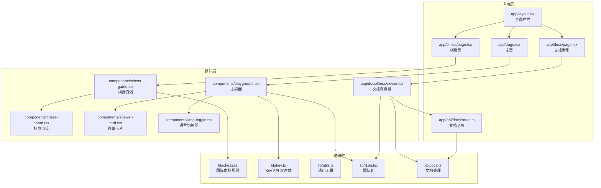
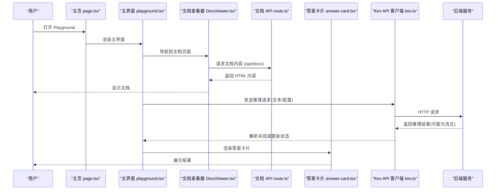
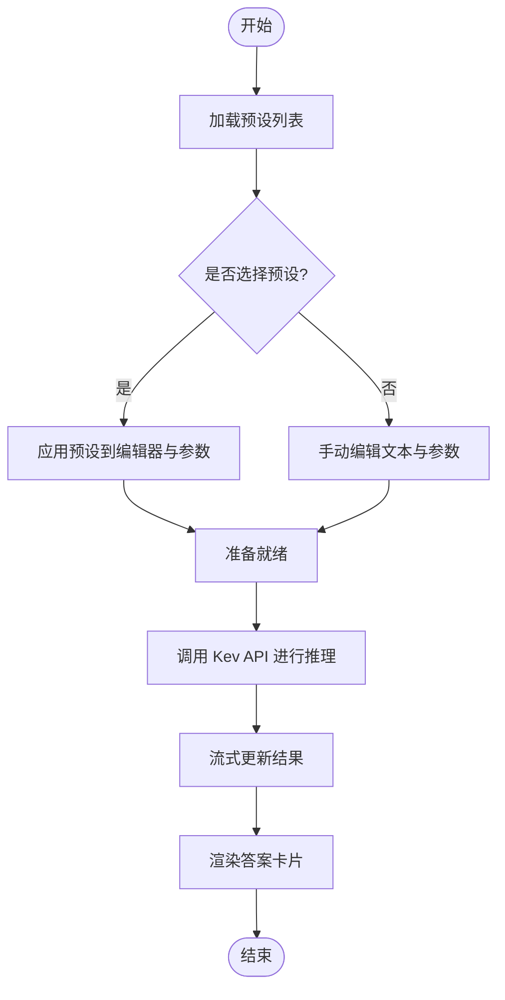
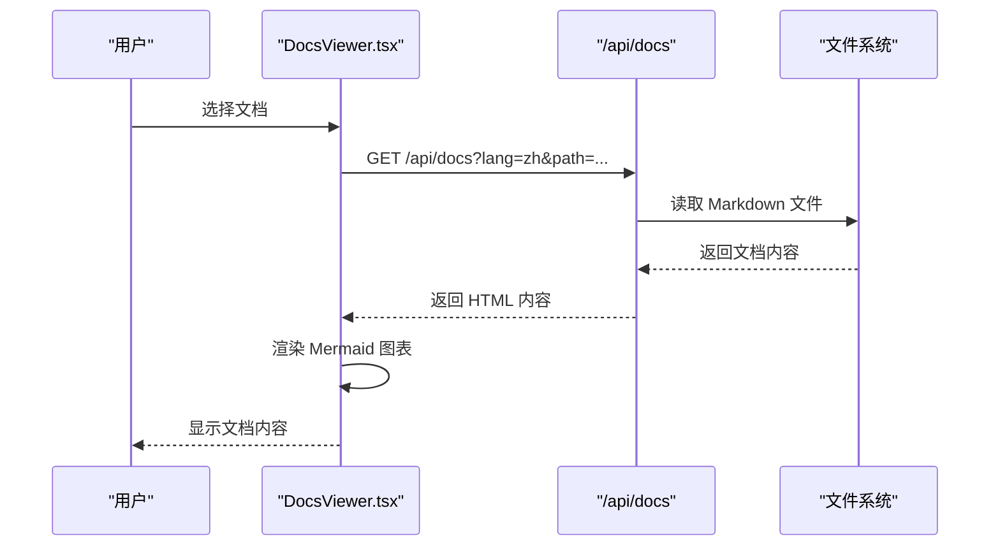
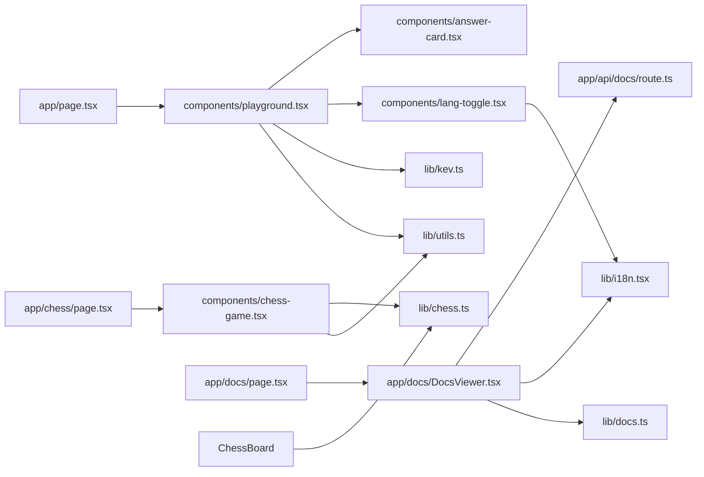

# Playground 界面

<cite>
**本文引用的文件**   
- [playground/package.json](file://playground/package.json)
- [playground/next.config.ts](file://playground/next.config.ts)
- [playground/tsconfig.json](file://playground/tsconfig.json)
- [playground/src/app/layout.tsx](file://playground/src/app/layout.tsx)
- [playground/src/app/page.tsx](file://playground/src/app/page.tsx)
- [playground/src/app/chess/page.tsx](file://playground/src/app/chess/page.tsx)
- [playground/src/app/docs/page.tsx](file://playground/src/app/docs/page.tsx)
- [playground/src/app/docs/DocsViewer.tsx](file://playground/src/app/docs/DocsViewer.tsx)
- [playground/src/app/api/docs/route.ts](file://playground/src/app/api/docs/route.ts)
- [playground/src/components/playground.tsx](file://playground/src/components/playground.tsx)
- [playground/src/components/chess-game.tsx](file://playground/src/components/chess-game.tsx)
- [playground/src/components/chess-board.tsx](file://playground/src/components/chess-board.tsx)
- [playground/src/components/answer-card.tsx](file://playground/src/components/answer-card.tsx)
- [playground/src/components/lang-toggle.tsx](file://playground/src/components/lang-toggle.tsx)
- [playground/src/lib/chess.ts](file://playground/src/lib/chess.ts)
- [playground/src/lib/kev.ts](file://playground/src/lib/kev.ts)
- [playground/src/lib/utils.ts](file://playground/src/lib/utils.ts)
- [playground/src/lib/i18n.tsx](file://playground/src/lib/i18n.tsx)
- [playground/src/lib/docs.ts](file://playground/src/lib/docs.ts)
</cite>

## 更新摘要
**所做更改**   
- 新增文档查看器功能，支持在 Playground 环境中直接查看项目文档
- 添加多语言支持（中英文），包含 i18n 组件和语言切换功能
- 实现 API 路由 `/api/docs` 用于动态加载和渲染 Markdown 文档
- 增强文档集成，支持 Mermaid 图表渲染和文档树导航
- 更新主界面以集成新的文档查看器和语言切换功能

## 目录
1. [简介](#简介)
2. [项目结构](#项目结构)
3. [核心组件](#核心组件)
4. [架构总览](#架构总览)
5. [详细组件分析](#详细组件分析)
6. [依赖关系分析](#依赖关系分析)
7. [性能与体验优化](#性能与体验优化)
8. [故障排查指南](#故障排查指南)
9. [结论](#结论)
10. [附录：开发环境与调试](#附录开发环境与调试)

## 简介
Playground 是 Kev 的前端交互式界面，基于 Next.js、TypeScript 与 React 构建。它提供预设加载、文本编辑、问题配置、实时推理与结果展示等能力，并内置国际象棋棋盘游戏（含规则校验与 AI 对战）。最新版本增强了文档查看器功能，支持多语言界面和直接在 Playground 中查看项目文档。文档面向开发者与使用者，帮助快速理解前端技术栈、组件结构与后端 API 交互逻辑，并提供扩展自定义预设与棋盘游戏的指南。

## 项目结构
Playground 采用 Next.js App Router 组织页面，React 组件按功能拆分到 components 目录，业务逻辑与工具函数位于 lib 目录。关键目录与职责如下：
- src/app：Next.js 路由入口与全局布局，包括新增的 docs 页面和 api 路由
- src/components：UI 与业务组件（主界面、棋盘游戏、答案卡片、语言切换器等）
- src/lib：领域逻辑（国际象棋规则）、API 客户端、i18n 国际化、文档处理工具
- public：静态资源
- scripts：辅助脚本（如评测脚本）

图示来源
- [playground/src/app/layout.tsx](file://playground/src/app/layout.tsx)
- [playground/src/app/page.tsx](file://playground/src/app/page.tsx)
- [playground/src/app/chess/page.tsx](file://playground/src/app/chess/page.tsx)
- [playground/src/app/docs/page.tsx](file://playground/src/app/docs/page.tsx)
- [playground/src/app/api/docs/route.ts](file://playground/src/app/api/docs/route.ts)
- [playground/src/components/playground.tsx](file://playground/src/components/playground.tsx)
- [playground/src/components/chess-game.tsx](file://playground/src/components/chess-game.tsx)
- [playground/src/components/chess-board.tsx](file://playground/src/components/chess-board.tsx)
- [playground/src/components/answer-card.tsx](file://playground/src/components/answer-card.tsx)
- [playground/src/components/lang-toggle.tsx](file://playground/src/components/lang-toggle.tsx)
- [playground/src/app/docs/DocsViewer.tsx](file://playground/src/app/docs/DocsViewer.tsx)
- [playground/src/lib/chess.ts](file://playground/src/lib/chess.ts)
- [playground/src/lib/kev.ts](file://playground/src/lib/kev.ts)
- [playground/src/lib/utils.ts](file://playground/src/lib/utils.ts)
- [playground/src/lib/i18n.tsx](file://playground/src/lib/i18n.tsx)
- [playground/src/lib/docs.ts](file://playground/src/lib/docs.ts)

章节来源
- [playground/package.json](file://playground/package.json)
- [playground/next.config.ts](file://playground/next.config.ts)
- [playground/tsconfig.json](file://playground/tsconfig.json)

## 核心组件
- 主界面组件 playground.tsx：负责预设加载、文本编辑、问题参数配置、调用 Kev API 进行推理，以及结果展示（通过 answer-card.tsx）。现已集成语言切换器和文档导航。
- 文档查看器 DocsViewer.tsx：全新的文档浏览组件，支持文档树导航、搜索、语言切换和 Mermaid 图表渲染。
- 语言切换器 lang-toggle.tsx：提供中英文界面切换功能，使用 i18n 系统管理 UI 文本。
- 棋盘游戏组件 chess-game.tsx：管理对局状态、回合推进、AI 走棋与用户交互。
- 棋盘渲染组件 chess-board.tsx：根据棋盘状态渲染格子与棋子，处理点击事件。
- 答案卡片组件 answer-card.tsx：以结构化方式展示推理结果与元数据。
- 国际象棋规则库 chess.ts：定义棋盘表示、移动生成、合法性检查、胜负判定等。
- Kev API 客户端 kev.ts：封装请求发送、流式响应处理、错误处理与重试策略。
- 国际化系统 i18n.tsx：提供多语言支持和翻译管理。
- 文档处理工具 docs.ts：处理文档树构建、路径解析和内容过滤。
- 工具库 utils.ts：通用工具函数（如格式化、防抖、类型判断等）。

章节来源
- [playground/src/components/playground.tsx](file://playground/src/components/playground.tsx)
- [playground/src/app/docs/DocsViewer.tsx](file://playground/src/app/docs/DocsViewer.tsx)
- [playground/src/components/lang-toggle.tsx](file://playground/src/components/lang-toggle.tsx)
- [playground/src/components/chess-game.tsx](file://playground/src/components/chess-game.tsx)
- [playground/src/components/chess-board.tsx](file://playground/src/components/chess-board.tsx)
- [playground/src/components/answer-card.tsx](file://playground/src/components/answer-card.tsx)
- [playground/src/lib/chess.ts](file://playground/src/lib/chess.ts)
- [playground/src/lib/kev.ts](file://playground/src/lib/kev.ts)
- [playground/src/lib/i18n.tsx](file://playground/src/lib/i18n.tsx)
- [playground/src/lib/docs.ts](file://playground/src/lib/docs.ts)
- [playground/src/lib/utils.ts](file://playground/src/lib/utils.ts)

## 架构总览
Playground 遵循"页面 → 组件 → 逻辑"的分层架构。页面组件负责路由与容器逻辑；业务组件组合 UI 与状态；lib 层提供可复用的领域逻辑与网络客户端。新增的文档查看器通过 API 路由动态加载 Markdown 内容，支持多语言切换和 Mermaid 图表渲染。

图示来源
- [playground/src/app/page.tsx](file://playground/src/app/page.tsx)
- [playground/src/components/playground.tsx](file://playground/src/components/playground.tsx)
- [playground/src/app/docs/DocsViewer.tsx](file://playground/src/app/docs/DocsViewer.tsx)
- [playground/src/app/api/docs/route.ts](file://playground/src/app/api/docs/route.ts)
- [playground/src/components/answer-card.tsx](file://playground/src/components/answer-card.tsx)
- [playground/src/lib/kev.ts](file://playground/src/lib/kev.ts)

## 详细组件分析

### 主界面组件（playground.tsx）
- 功能要点
  - 预设加载：从本地或远端加载预设模板，支持选择与切换。
  - 文本编辑：提供输入区域用于编写提示词或任务描述。
  - 问题配置：暴露模型参数（如温度、最大长度等）供用户调整。
  - 实时推理：调用 Kev API 客户端发起请求，支持流式增量显示。
  - 结果展示：将推理结果渲染至答案卡片，支持复制、分享等操作。
  - 语言切换：集成 LangToggle 组件，支持中英文界面切换。
  - 文档导航：提供到文档页面的链接，当前语言感知。
- 状态设计
  - 文本内容、已选预设、模型参数、推理状态（加载中/完成/失败）、结果数据、当前语言。
- 交互流程
  - 用户编辑文本与参数 → 触发推理 → 流式更新 → 渲染答案卡片。
  - 语言切换时自动重新加载对应语言的预设内容。

**更新** 新增了语言切换功能和文档导航链接，现在可以无缝切换到文档查看器。

图示来源
- [playground/src/components/playground.tsx](file://playground/src/components/playground.tsx)
- [playground/src/lib/kev.ts](file://playground/src/lib/kev.ts)

章节来源
- [playground/src/components/playground.tsx](file://playground/src/components/playground.tsx)
- [playground/src/lib/kev.ts](file://playground/src/lib/kev.ts)

### 文档查看器组件（DocsViewer.tsx）
- 功能要点
  - 文档树导航：递归渲染文档目录结构，支持文件夹展开/折叠。
  - 搜索功能：实时搜索文档标题和路径。
  - 语言切换：在中文和英文文档间切换，保持当前文档位置。
  - Mermaid 图表：动态加载并渲染 Mermaid 流程图和架构图。
  - 内容加载：通过 API 路由获取 Markdown 内容并转换为 HTML。
  - 回退机制：当目标语言文档不存在时，自动回退到另一种语言。
- 状态设计
  - 文档树结构、当前选中文档、搜索查询、加载状态、错误信息、回退标志。
- 交互流程
  - 用户选择文档 → 调用 API 获取内容 → 渲染 HTML → 升级 Mermaid 图表。

**新增** 这是全新的文档查看功能，允许用户在 Playground 内直接浏览项目文档。

图示来源
- [playground/src/app/docs/DocsViewer.tsx](file://playground/src/app/docs/DocsViewer.tsx)
- [playground/src/app/api/docs/route.ts](file://playground/src/app/api/docs/route.ts)

章节来源
- [playground/src/app/docs/DocsViewer.tsx](file://playground/src/app/docs/DocsViewer.tsx)

### 语言切换器组件（lang-toggle.tsx）
- 功能要点
  - 提供简洁的中英文切换按钮。
  - 使用 i18n 系统管理当前语言状态。
  - 支持键盘无障碍访问。
  - 视觉反馈显示当前选中的语言。
- 状态设计
  - 当前语言状态、语言切换处理器。
- 交互流程
  - 用户点击语言按钮 → 更新全局语言状态 → 触发界面重新渲染。

**新增** 这是新添加的语言切换功能，为用户提供多语言界面支持。

章节来源
- [playground/src/components/lang-toggle.tsx](file://playground/src/components/lang-toggle.tsx)
- [playground/src/lib/i18n.tsx](file://playground/src/lib/i18n.tsx)

### 文档 API 路由（route.ts）
- 功能要点
  - 动态加载 Markdown 文档内容。
  - 支持中英文文档路径解析。
  - 安全的路径遍历防护。
  - Markdown 到 HTML 的服务器端转换。
  - 自动回退机制：当英文文档缺失时返回中文原文。
  - 缓存控制：禁用浏览器缓存以确保内容最新。
- 安全特性
  - 防止路径遍历攻击。
  - 验证文件扩展名为 .md。
  - 检查文件存在性和可读性。

**新增** 这是新实现的文档 API 端点，为文档查看器提供内容服务。

章节来源
- [playground/src/app/api/docs/route.ts](file://playground/src/app/api/docs/route.ts)
- [playground/src/lib/docs.ts](file://playground/src/lib/docs.ts)

### 国际化系统（i18n.tsx）
- 功能要点
  - 集中管理所有 UI 文本的中英文翻译。
  - 提供 useLang hook 用于组件内语言访问。
  - 支持带参数的文本替换（如 {name}）。
  - 持久化用户语言偏好到 localStorage。
  - 自动设置 HTML 文档的 lang 属性。
- 翻译键值
  - kev.*：主界面相关文本
  - chess.*：棋盘游戏相关文本
  - lang.toggle：语言切换器文本

**新增** 这是新建立的国际化框架，为整个应用提供多语言支持。

章节来源
- [playground/src/lib/i18n.tsx](file://playground/src/lib/i18n.tsx)

### 文档处理工具（docs.ts）
- 功能要点
  - 构建文档树结构，递归扫描文档目录。
  - 提取 Markdown 文件的第一个标题作为显示名称。
  - 智能排序：顶级目录优先显示 intro 页面，嵌套目录优先显示分类。
  - 清理 repowiki 生成的引用标记和文件链接。
  - 提供语言检测和路径解析工具。
- 文档结构
  - 支持嵌套文件夹和文件组织。
  - 自动识别 overview.md 文件作为文件夹标签。

**新增** 这是新创建的文档处理工具，为文档查看器提供数据结构支持。

章节来源
- [playground/src/lib/docs.ts](file://playground/src/lib/docs.ts)

### 棋盘游戏组件（chess-game.tsx）
- 功能要点
  - 对局生命周期：初始化、回合推进、胜负判定、重置。
  - 用户交互：点击选中棋子、合法移动高亮、落子确认。
  - AI 对战：在指定时机调用 AI 走棋逻辑（可与 Kev API 集成）。
  - 状态同步：与 chess-board.tsx 保持视图一致。
- 状态设计
  - 棋盘状态、当前执棋方、历史走法、游戏状态（进行中/结束）、AI 模式开关。
- 交互流程
  - 用户点击 → 校验移动合法性 → 更新棋盘 → 若为 AI 回合则自动走棋。

章节来源
- [playground/src/components/chess-game.tsx](file://playground/src/components/chess-game.tsx)
- [playground/src/components/chess-board.tsx](file://playground/src/components/chess-board.tsx)
- [playground/src/lib/chess.ts](file://playground/src/lib/chess.ts)

### 棋盘渲染组件（chess-board.tsx）
- 功能要点
  - 根据棋盘状态绘制格子与棋子。
  - 处理点击事件，向父组件传递选中格子坐标。
  - 高亮合法移动路径与目标格。
- 性能考虑
  - 避免不必要的重渲染，仅在状态变化时更新。
  - 使用稳定的 key 与 memo 优化。

章节来源
- [playground/src/components/chess-board.tsx](file://playground/src/components/chess-board.tsx)
- [playground/src/lib/chess.ts](file://playground/src/lib/chess.ts)

### 答案卡片组件（answer-card.tsx）
- 功能要点
  - 结构化展示推理结果（正文、元数据、时间戳等）。
  - 支持复制、导出、评分等扩展操作。
  - 适配不同结果格式（纯文本、JSON、Markdown）。
- 交互设计
  - 折叠/展开详细内容。
  - 错误信息友好提示。

章节来源
- [playground/src/components/answer-card.tsx](file://playground/src/components/answer-card.tsx)

### 国际象棋规则库（chess.ts）
- 功能要点
  - 棋盘表示与坐标系统。
  - 移动生成与合法性检查（包括王车易位、吃过路兵、升变等）。
  - 局面评估与胜负判定。
- 复杂度与优化
  - 预计算合法移动表以提升性能。
  - 缓存局面哈希以减少重复计算。

章节来源
- [playground/src/lib/chess.ts](file://playground/src/lib/chess.ts)

### Kev API 客户端（kev.ts）
- 功能要点
  - 封装请求发送（GET/POST），支持流式响应（SSE/ReadableStream）。
  - 统一错误处理（网络异常、服务端错误、超时重试）。
  - 提供便捷方法：runInference、streamResult、cancelRequest。
- 错误处理
  - 区分连接错误、认证错误、业务错误。
  - 提供降级策略与用户提示。

章节来源
- [playground/src/lib/kev.ts](file://playground/src/lib/kev.ts)

### 工具库（utils.ts）
- 功能要点
  - 通用工具：防抖、节流、深拷贝、类型守卫、日期格式化等。
  - 与 UI 组件配合的辅助函数（如颜色映射、尺寸计算）。

章节来源
- [playground/src/lib/utils.ts](file://playground/src/lib/utils.ts)

## 依赖关系分析
组件与模块之间的依赖关系如下：

图示来源
- [playground/src/app/page.tsx](file://playground/src/app/page.tsx)
- [playground/src/app/chess/page.tsx](file://playground/src/app/chess/page.tsx)
- [playground/src/app/docs/page.tsx](file://playground/src/app/docs/page.tsx)
- [playground/src/app/docs/DocsViewer.tsx](file://playground/src/app/docs/DocsViewer.tsx)
- [playground/src/app/api/docs/route.ts](file://playground/src/app/api/docs/route.ts)
- [playground/src/components/playground.tsx](file://playground/src/components/playground.tsx)
- [playground/src/components/chess-game.tsx](file://playground/src/components/chess-game.tsx)
- [playground/src/components/chess-board.tsx](file://playground/src/components/chess-board.tsx)
- [playground/src/components/answer-card.tsx](file://playground/src/components/answer-card.tsx)
- [playground/src/components/lang-toggle.tsx](file://playground/src/components/lang-toggle.tsx)
- [playground/src/lib/kev.ts](file://playground/src/lib/kev.ts)
- [playground/src/lib/chess.ts](file://playground/src/lib/chess.ts)
- [playground/src/lib/utils.ts](file://playground/src/lib/utils.ts)
- [playground/src/lib/i18n.tsx](file://playground/src/lib/i18n.tsx)
- [playground/src/lib/docs.ts](file://playground/src/lib/docs.ts)

章节来源
- [playground/src/app/page.tsx](file://playground/src/app/page.tsx)
- [playground/src/app/chess/page.tsx](file://playground/src/app/chess/page.tsx)
- [playground/src/app/docs/page.tsx](file://playground/src/app/docs/page.tsx)
- [playground/src/app/docs/DocsViewer.tsx](file://playground/src/app/docs/DocsViewer.tsx)
- [playground/src/app/api/docs/route.ts](file://playground/src/app/api/docs/route.ts)
- [playground/src/components/playground.tsx](file://playground/src/components/playground.tsx)
- [playground/src/components/chess-game.tsx](file://playground/src/components/chess-game.tsx)
- [playground/src/components/chess-board.tsx](file://playground/src/components/chess-board.tsx)
- [playground/src/components/answer-card.tsx](file://playground/src/components/answer-card.tsx)
- [playground/src/components/lang-toggle.tsx](file://playground/src/components/lang-toggle.tsx)
- [playground/src/lib/kev.ts](file://playground/src/lib/kev.ts)
- [playground/src/lib/chess.ts](file://playground/src/lib/chess.ts)
- [playground/src/lib/utils.ts](file://playground/src/lib/utils.ts)
- [playground/src/lib/i18n.tsx](file://playground/src/lib/i18n.tsx)
- [playground/src/lib/docs.ts](file://playground/src/lib/docs.ts)

## 性能与体验优化
- 流式推理：优先使用流式响应减少首字节延迟，逐步渲染答案卡片。
- 组件优化：合理使用 React.memo、useMemo、useCallback 避免不必要重渲染。
- 棋盘渲染：仅更新变化格子，避免整盘重绘。
- 网络优化：请求去重、超时控制、指数退避重试。
- 内存管理：及时释放流式读取器与定时器，防止内存泄漏。
- 文档加载：懒加载 Mermaid 库，按需渲染图表。
- 缓存策略：文档内容禁用缓存确保实时更新。
- 国际化：语言状态持久化，避免重复初始化。

[本节为通用指导，不直接分析具体文件]

## 故障排查指南
- 无法加载预设
  - 检查预设数据来源与 CORS 配置。
  - 验证预设 JSON 结构与字段完整性。
- 推理请求失败
  - 查看网络面板与日志，确认后端地址与鉴权。
  - 检查超时与重试策略是否合理。
- 棋盘移动非法
  - 核对 chess.ts 中的规则实现与边界情况（王车易位、吃过路兵、升变）。
  - 确认棋盘状态与历史记录一致性。
- 流式结果不更新
  - 检查流式读取器的关闭与错误处理。
  - 确保状态更新不会阻塞 UI 线程。
- 文档加载失败
  - 检查 API 路由是否正确配置。
  - 验证文档路径和语言参数。
  - 确认文档文件存在且可读。
- 语言切换无效
  - 检查 LanguageProvider 是否正确包裹应用。
  - 验证 localStorage 权限和存储。
  - 确认翻译键值是否存在。

章节来源
- [playground/src/lib/kev.ts](file://playground/src/lib/kev.ts)
- [playground/src/lib/chess.ts](file://playground/src/lib/chess.ts)
- [playground/src/app/api/docs/route.ts](file://playground/src/app/api/docs/route.ts)
- [playground/src/lib/i18n.tsx](file://playground/src/lib/i18n.tsx)

## 结论
Playground 通过清晰的组件分层与可复用的逻辑库，提供了完整的交互式推理与棋盘游戏体验。最新版本增强了文档查看器功能，支持多语言界面和直接在 Playground 中查看项目文档。其可扩展的预设机制与 API 客户端设计，便于后续接入更多模型与服务。棋盘游戏具备完善的规则实现与 AI 对战能力，可作为进一步扩展的基础。新增的文档查看器和国际化系统显著提升了用户体验，使 Playground 成为一个更加完整和友好的开发环境。

[本节为总结性内容，不直接分析具体文件]

## 附录：开发环境与调试
- 环境要求
  - Node.js 与 npm/yarn/pnpm（依据 package.json 指定版本）。
- 安装依赖
  - 在项目根目录执行包管理器安装命令。
- 启动开发服务器
  - 运行 Next.js 开发服务器，访问 localhost 端口查看界面。
- 构建与预览
  - 执行构建命令生成生产包，并通过预览命令本地预览。
- 调试建议
  - 使用浏览器开发者工具观察网络请求与组件状态。
  - 在关键函数添加日志输出，定位问题链路。
  - 针对流式推理，监控流式数据的到达与解析过程。
  - 检查文档 API 路由的响应内容和错误信息。
  - 验证国际化系统的翻译键值和语言切换功能。

章节来源
- [playground/package.json](file://playground/package.json)
- [playground/next.config.ts](file://playground/next.config.ts)
- [playground/tsconfig.json](file://playground/tsconfig.json)