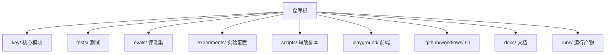
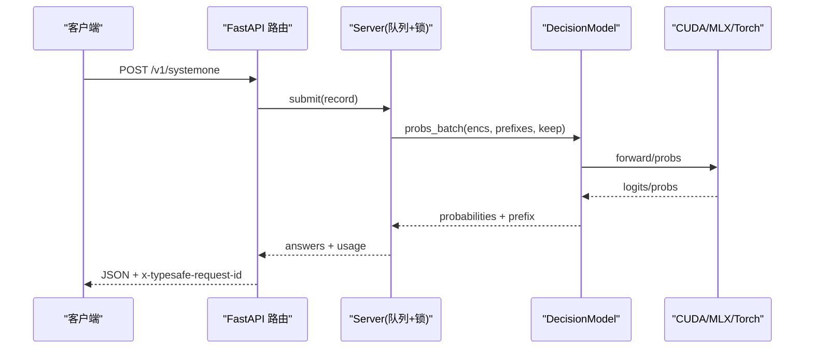
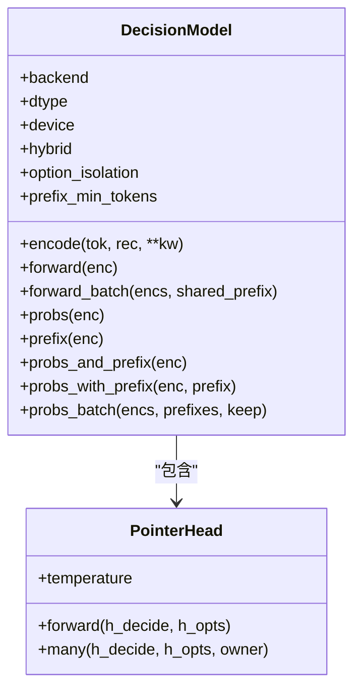
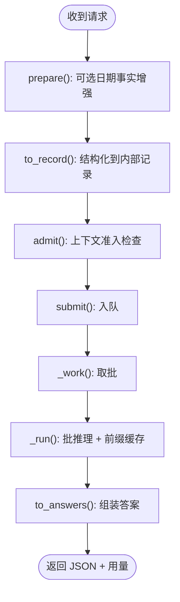
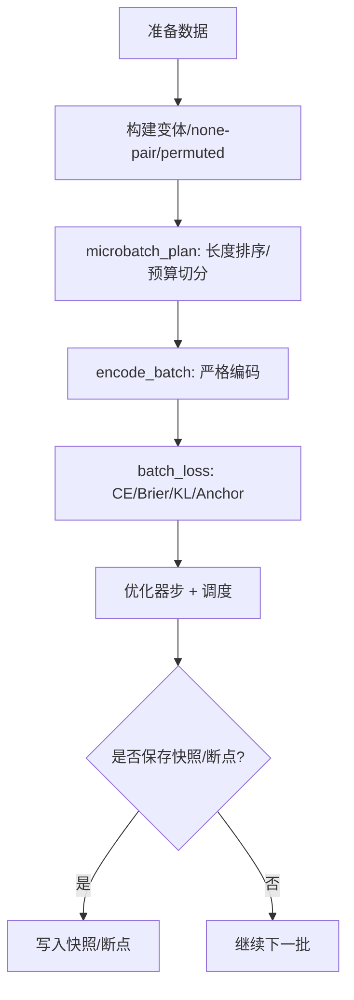
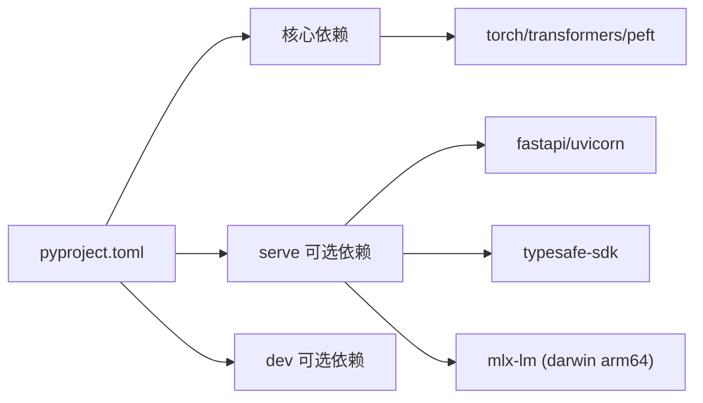
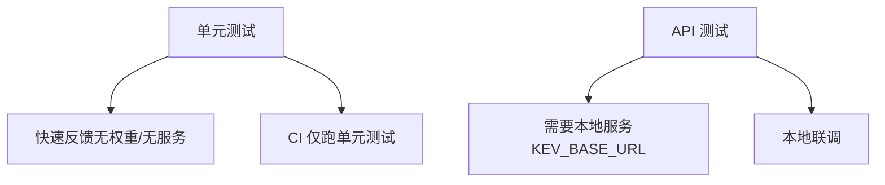
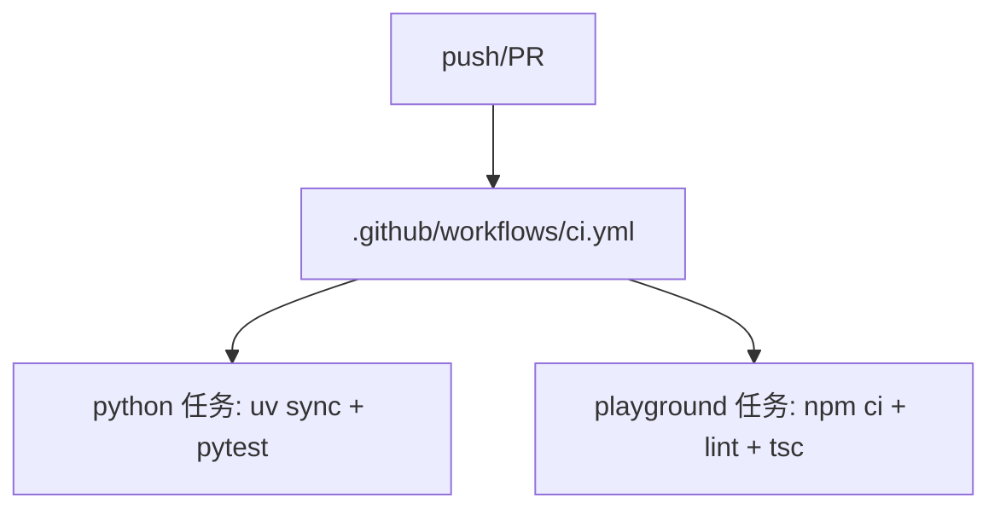

<cite>
**本文引用的文件**   
- [README.md](file://README.md)
- [pyproject.toml](file://pyproject.toml)
- [.github/workflows/ci.yml](file://.github/workflows/ci.yml)
- [kev/model.py](file://kev/model.py)
- [kev/serve.py](file://kev/serve.py)
- [kev/train.py](file://kev/train.py)
- [tests/test_unit.py](file://tests/test_unit.py)
- [tests/test_api.py](file://tests/test_api.py)
</cite>

## 目录
1. [简介](#简介)
2. [项目结构](#项目结构)
3. [核心组件](#核心组件)
4. [架构总览](#架构总览)
5. [详细组件分析](#详细组件分析)
6. [依赖关系分析](#依赖关系分析)
7. [性能与容量规划](#性能与容量规划)
8. [测试策略](#测试策略)
9. [代码规范](#代码规范)
10. [持续集成流程](#持续集成流程)
11. [调试技巧与常用工具](#调试技巧与常用工具)
12. [贡献指南](#贡献指南)
13. [实验管理](#实验管理)
14. [结论](#结论)

## 简介
Kev 是基于 Qwen3.5/Qwen3.8 的小型决策模型家族，提供 TypeSafe System One 兼容的推理 API。它支持二选一（noul）、多选（choice）和评分（score）三类问题，默认输出校准概率，并提供 LoRA 微调、全量微调、本地/云端部署、评测基准等完整能力。本指南面向开发者，覆盖环境搭建、模块职责、依赖关系、测试、CI、调试、贡献与实验管理等主题。

## 项目结构
仓库采用“Python 核心 + 前端 Playground + 评测数据 + 实验配置”的分层组织：
- kev/: Python 核心实现（模型、训练、服务、评测、工具）
- tests/: 单元测试、API 一致性测试、MLX 后端校验等
- evals/: 冻结评测集与清单
- experiments/: 实验计划与版本化配置
- scripts/: 数据处理、报告生成、插值等辅助脚本
- playground/: Next.js 交互式前端
- .github/workflows: CI 流水线
- docs/: 模型卡与说明文档
- runs/: 训练/评测运行产物（由用户或 CI 生成）

**章节来源**
- [README.md:43-170](file://README.md#L43-L170)
- [README.md:282-347](file://README.md#L282-L347)

## 核心组件
- 模型与推理
  - 编码器与注意力掩码：将状态与多问题打包为单一序列，使用块因果掩码保证问题间隔离；对混合骨干（含 Gated DeltaNet）自动切换行形式推理。
  - 指针头：对每个问题的 <decide> 与选项 </opt> 隐藏状态打分，推理时可选温度校准。
  - 前缀缓存：在服务端缓存状态 KV，避免重复计算长文档。
- 训练
  - LoRA 与全量微调：支持从基座或已训练检查点增量微调；支持共享前缀、长度排序、微批次切分、梯度裁剪、快照与断点续训。
- 服务
  - FastAPI 网关：暴露 /v1/systemone 及演示接口；Bearer 鉴权；请求 ID 透传；状态前缀缓存与 OOM 恢复。
- 评测
  - 基准评估：准确率、Brier、校准误差、自动化比例、选项顺序稳定性、问题隔离性。

**章节来源**
- [kev/model.py:1-509](file://kev/model.py#L1-L509)
- [kev/serve.py:1-344](file://kev/serve.py#L1-L344)
- [kev/train.py:1-680](file://kev/train.py#L1-L680)

## 架构总览
Kev 的核心链路：客户端 → FastAPI 服务 → 模型线程 → 推理后端（CUDA/MLX/Torch）→ 返回答案与用量统计。训练侧通过 train.py 加载数据集、构建变体、执行优化并保存检查点。

**图表来源**
- [kev/serve.py:249-312](file://kev/serve.py#L249-L312)
- [kev/model.py:389-492](file://kev/model.py#L389-L492)

**章节来源**
- [kev/serve.py:93-220](file://kev/serve.py#L93-L220)
- [kev/model.py:243-492](file://kev/model.py#L243-L492)

## 详细组件分析

### 模型与推理（DecisionModel）
- 编码与上下文限制
  - encode() 将 state 与多个 question 分支打包，维护 seg/pos/opt 等元信息；支持 option_isolation 以构造严格置换不变性。
  - admit()/ContextOverflow 在服务端做上下文准入检查，拒绝超长状态或分支。
- 掩码与行形式
  - branch_mask/branch_mask_batch 实现块因果掩码；当 backbone 为混合类型或 packed 过长时，切换到 rows_form 行形式推理。
- 指针头与温度
  - PointerHead 在 eval 模式下按 temperature 缩放 logits；训练始终 T=1。
- 前缀缓存与批处理
  - prefix()/probs_and_prefix()/probs_with_prefix() 复用状态 KV；probs_batch() 结合 CUDA Graphs 批量调度。

**图表来源**
- [kev/model.py:205-229](file://kev/model.py#L205-L229)
- [kev/model.py:243-492](file://kev/model.py#L243-L492)

**章节来源**
- [kev/model.py:1-229](file://kev/model.py#L1-L229)
- [kev/model.py:243-492](file://kev/model.py#L243-L492)

### 服务（FastAPI + Server）
- 路由与鉴权
  - /v1/systemone 主入口；/v1/models 模型卡；演示接口 permute/separate。
  - Bearer 鉴权（KEV_API_KEY），响应头 x-typesafe-request-id。
- 请求处理
  - prepare() 可选日期事实增强；to_record/to_answers 完成输入输出映射。
  - Server.submit() 入队，_work() 单模型线程消费，_run() 批处理并维护 PrefixCache。
- 前缀缓存
  - PrefixCache 控制 size/min_tokens/max_tokens，LRU 淘汰，OOM 时清空并重试一次。

**图表来源**
- [kev/serve.py:223-226](file://kev/serve.py#L223-L226)
- [kev/serve.py:249-312](file://kev/serve.py#L249-L312)
- [kev/serve.py:38-90](file://kev/serve.py#L38-L90)

**章节来源**
- [kev/serve.py:1-344](file://kev/serve.py#L1-L344)

### 训练（LoRA/全量微调）
- 数据与变体
  - training_requests() 支持 frozen suite、自建 JSONL、回放采样；过滤 eval-only 源。
  - record_variants() 生成增强副本与 none-pair 兄弟；permuted_copy() 用于 permutation KL。
- 批次与内存
  - microbatch_plan() 支持 length_sort 与 pass_tokens_max 控制 padded tokens；row_passes() 按预算拆分 forward/backward。
- 损失与优化
  - question_loss() 支持 CE/Brier/Focal/有序回归；anchor_loss/permutation_kl 可选正则。
  - MasterAdamW（全量）或 AdamW（LoRA），OneCycleLR 调度，梯度裁剪。
- 检查点与快照
  - 支持断点续训、阶段快照、权重插值（WiSE-FT）。

**图表来源**
- [kev/train.py:86-133](file://kev/train.py#L86-L133)
- [kev/train.py:181-256](file://kev/train.py#L181-L256)
- [kev/train.py:319-365](file://kev/train.py#L319-L365)
- [kev/train.py:523-675](file://kev/train.py#L523-L675)

**章节来源**
- [kev/train.py:1-680](file://kev/train.py#L1-L680)

## 依赖关系分析
- Python 运行时与核心库
  - Python >=3.12,<3.14；torch>=2.6,<2.9；transformers>=5.17,<6；accelerate/datasets/peft/pydantic/scikit-learn。
- 可选依赖
  - serve: fastapi/typesafe-sdk/uvicorn；Apple Silicon 下可选 mlx-lm。
  - dev: httpx/matplotlib/modal/pytest。
- 关键耦合
  - serve.py 依赖 api/checkpoint/device/model；train.py 依赖 data/suite/model/full_ft；tests 覆盖 unit/api/mlx 等路径。

**图表来源**
- [pyproject.toml:1-62](file://pyproject.toml#L1-L62)

**章节来源**
- [pyproject.toml:1-62](file://pyproject.toml#L1-L62)

## 性能与容量规划
- 推理
  - GPU 选择与吞吐见 README 表格；bf16 默认，fp32 可复现评测路径；CUDA Graphs 默认开启以降低内核启动开销。
  - 前缀缓存命中可显著降低重复文档成本；MLX 在 Apple Silicon 上自动启用。
- 训练
  - bf16 autocast + fp32 master（全量）；MPS 每步释放缓存；length_sort/pass_tokens_max 控制 padded tokens 上限。
- 容量建议
  - Kev-4B 约需 ~17 GB 显存；Kev-27B 约 51 GB 权重 + 缓冲；Mac 上全量权重直接加载，无需合并。

**章节来源**
- [README.md:355-383](file://README.md#L355-L383)
- [kev/serve.py:315-339](file://kev/serve.py#L315-L339)
- [kev/train.py:523-675](file://kev/train.py#L523-L675)

## 测试策略
- 单元测试（无权重、无服务器）
  - 覆盖 API 映射、置信度公式、掩码规则、tokenizer 安全、前缀缓存行为、OOM 恢复、CUDA Graphs 分组等。
  - 命令：uv run --extra serve python -m pytest tests/test_unit.py -q
- API 一致性测试（需要运行中的服务端）
  - 验证 TypeSafe 示例请求、SDK 同步/异步客户端、模型卡字段、超长状态拒绝与截断标记。
  - 命令：KEV_BASE_URL=http://127.0.0.1:8009 uv run --extra serve python -m pytest tests/test_api.py -q
- 其他测试
  - 研究/生成器/约定/文档工具/Hard/DevTools/Breadth/Rounds/Skill Scripts 等均在 CI 中运行。

**图表来源**
- [tests/test_unit.py:1-14](file://tests/test_unit.py#L1-L14)
- [tests/test_api.py:1-10](file://tests/test_api.py#L1-L10)

**章节来源**
- [tests/test_unit.py:1-800](file://tests/test_unit.py#L1-L800)
- [tests/test_api.py:1-169](file://tests/test_api.py#L1-L169)
- [README.md:395-404](file://README.md#L395-L404)

## 代码规范
- 命名与风格
  - Python 模块小写下划线；函数/变量 snake_case；类 PascalCase；常量 UPPER_SNAKE_CASE。
  - 使用 pydantic 进行请求/响应建模；错误优先抛出明确异常（如 ContextOverflow）。
- 注释标准
  - 模块级 docstring 说明职责与用法；关键函数附参数/返回值说明；复杂逻辑用行内注释解释设计权衡。
- 提交消息格式
  - 建议遵循 Conventional Commits：<type>(<scope>): <subject>，例如 feat(train): add length_sort for balanced micro-batches。
- 类型与校验
  - 所有外部输入经 pydantic 校验；服务层统一 422 错误语义；日志与指标保持最小必要信息。

[本节为通用规范说明，不直接分析具体文件]

## 持续集成流程
- 触发条件
  - push 到 main 与所有 pull_request。
- 任务
  - python: 安装依赖（含 serve extra），运行单元测试集合（不含服务器与权重）。
  - playground: Node 22，npm ci，lint，Next typegen 与 tsc 类型检查。

**图表来源**
- [.github/workflows/ci.yml:1-35](file://.github/workflows/ci.yml#L1-L35)

**章节来源**
- [.github/workflows/ci.yml:1-35](file://.github/workflows/ci.yml#L1-L35)

## 调试技巧与常用工具
- 常见问题
  - MPS 显存不足：确保单任务运行；避免 output_hidden_states 与 peft trainable_token_indices。
  - Playground 按钮不可用：使用 localhost:3001；必要时调整 allowedDevOrigins。
  - datasets 脚本不支持：使用 legacy-datasets/banking77（仓库已适配）。
- 诊断接口
  - /v1/models 查看后端、精度、温度、前缀缓存统计、CUDA Graphs 统计。
  - /v1/systemone/permute 观察选项顺序对概率的影响；/v1/systemone/separate 对比 packed vs separate。
- 环境变量
  - KEV_TEMPERATURE/KEV_DATE_FACTS/KEV_TRUNCATE_STATES/KEV_DTYPE/KEV_API_KEY 等控制行为。

**章节来源**
- [README.md:421-428](file://README.md#L421-L428)
- [kev/serve.py:298-312](file://kev/serve.py#L298-L312)
- [README.md:252-258](file://README.md#L252-L258)

## 贡献指南
- 分支策略
  - main 保护；功能分支以 feat/fix/chore 前缀命名；提交消息遵循 Conventional Commits。
- Pull Request 流程
  - 自测：本地运行单元测试与 API 测试；必要时启动本地服务验证端到端流程。
  - 评审：关注变更影响面（模型/服务/训练/评测），附带必要用例与结果。
- 代码审查标准
  - 正确性：边界条件、错误处理、类型校验完备。
  - 性能：避免不必要的全量复制；合理使用缓存与批处理。
  - 可维护性：清晰的模块划分与注释；新增配置需有默认值与环境变量开关。

[本节为通用流程说明，不直接分析具体文件]

## 实验管理
- 实验配置
  - experiments/*.json 定义训练计划；study_v3 等脚本驱动 Modal 上的多轮实验。
- 结果记录
  - runs/<name>/training_config.json 记录参数、suite sha256、base revision、init_source 等；metrics 与 grad_norm 汇总。
- 模型版本控制
  - Checkpoint.meta 记录 base/lora/head_dim/weights_dtype/holdout 等；head.pt 携带指针头与温度；支持从 Hub ID 或本地目录加载。
- 权重插值与快照
  - interpolate_checkpoint.py 支持 WiSE-FT 风格的线性插值；full_ft 支持阶段快照与断点续训。

**章节来源**
- [kev/train.py:523-675](file://kev/train.py#L523-L675)
- [README.md:303-323](file://README.md#L303-L323)

## 结论
Kev 提供了从训练到服务的一体化决策模型解决方案。通过清晰的模块划分、严格的上下文与掩码设计、完善的测试与 CI，以及灵活的实验与部署能力，开发者可以快速迭代自己的决策任务并在生产环境中稳定运行。建议在贡献时遵循本文规范，充分利用评测与调试工具，确保质量与效率。