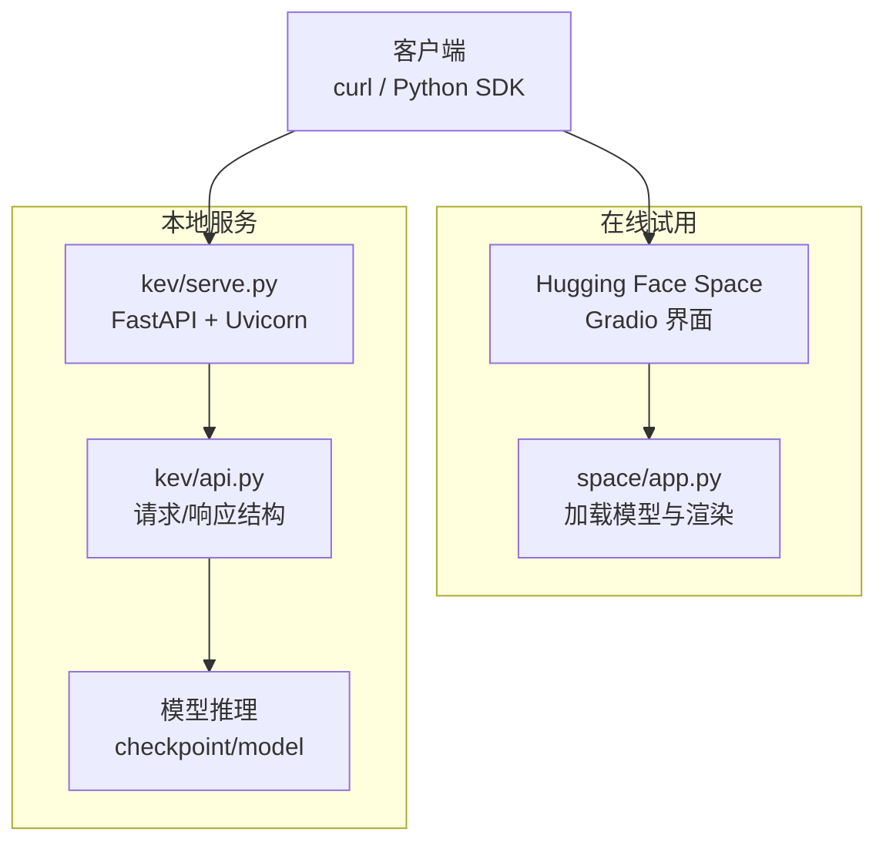

# 快速开始

<cite>
**本文引用的文件**   
- [README.md](file://README.md)
- [pyproject.toml](file://pyproject.toml)
- [space/app.py](file://space/app.py)
- [space/README.md](file://space/README.md)
- [modal_app.py](file://modal_app.py)
- [kev/serve.py](file://kev/serve.py)
- [kev/api.py](file://kev/api.py)
</cite>

## 目录
1. [简介](#简介)
2. [环境要求与安装](#环境要求与安装)
3. [在线试用](#在线试用)
4. [本地运行服务](#本地运行服务)
5. [发送请求与解析响应](#发送请求与解析响应)
6. [Python SDK 集成示例](#python-sdk-集成示例)
7. [curl 命令与 JSON 请求格式](#curl-命令与-json-请求格式)
8. [架构总览](#架构总览)
9. [常见问题排查](#常见问题排查)
10. [结论](#结论)

## 简介
Kev 是一组小型决策模型，基于 Qwen3.5/Qwen3.8，提供 TypeSafe System One 兼容的 `/v1/systemone` API。你可以直接在线试用，也可以在本机启动服务并调用；同时支持使用 Python SDK 连接本地 Kev 服务进行推理。

## 环境要求与安装
- Python 版本：3.12 或 3.13（项目约束 `>=3.12,<3.14`）。
- 包管理器：uv。
- 可选依赖：GPU（CUDA/ROCm）或 Apple Silicon（MLX）。

推荐安装步骤（以仓库根目录为例）：
```bash
git clone https://github.com/jaredpalmer/kev.git && cd kev
uv sync --extra serve
```

说明：
- `--extra serve` 会安装 FastAPI、Uvicorn、TypeSafe SDK 等运行时依赖。
- 首次运行会自动下载基础模型与适配器权重。

**章节来源**
- [README.md:49-59](file://README.md#L49-L59)
- [pyproject.toml:13-43](file://pyproject.toml#L13-L43)

## 在线试用
你可以在 Hugging Face Space 中直接体验 Kev-4B 与 Kev-0.8B，无需本地安装。Space 提供可视化界面，支持选择模型、输入状态文本与问题定义，并返回每个选项的概率分布。

- 入口：Hugging Face Space（浏览器即可使用）。
- 能力：一次前向推理输出多个类型问题的概率（choice/noul/score），不生成文本。
- 行为一致性：Space 复用了仓库中的推理与 API 代码，保证与本地服务一致。

**章节来源**
- [README.md:45-47](file://README.md#L45-L47)
- [space/README.md:27-66](file://space/README.md#L27-L66)
- [space/app.py:1-8](file://space/app.py#L1-L8)

## 本地运行服务
在终端中启动 Kev-4B 服务（默认端口 8009）：
```bash
uv run --extra serve python -m kev.serve --run jaredpalmer/kev-4b --port 8009
```

要点：
- 自动检测 CUDA/ROCm 或 Apple Silicon MLX。
- 首次运行会下载适配器和基础模型。
- `--run` 可接受本地检查点目录或 Hub 修订名。

服务启动后，可在另一个终端发送请求进行测试。

**章节来源**
- [README.md:53-59](file://README.md#L53-L59)
- [kev/serve.py:315-339](file://kev/serve.py#L315-L339)

## 发送请求与解析响应
使用 curl 向本地服务发送一个包含多种问题类型的请求：
```bash
curl -s localhost:8009/v1/systemone -H 'content-type: application/json' -d '{
  "state": "Shoes arrived two weeks late and in the wrong size. Also I see two charges on my card.",
  "model": "kev-latest",
  "questions": {
    "department":  {"type": "choice", "instructions": "Which team should handle this?",
                    "criteria": {"returns": "Exchanges, refunds, wrong or damaged items",
                                 "shipping": "Delivery status, delays, lost packages",
                                 "billing": "Charges, invoices, payment problems"}},
    "escalate":    {"type": "noul",  "instructions": "Does this need urgent human attention?"},
    "frustration": {"type": "score", "instructions": "How frustrated is the customer?",
                    "criteria": ["Calm", "Frustrated", "Very angry"]}
  }}'
```

典型响应字段：
- `answers`：按问题 ID 返回答案，包含类型、置信度、概率分布等。
- `usage.input_tokens` / `usage.output_tokens`：输入与序列化输出的 token 数。
- `latency_ms`：模型侧延迟（毫秒）。

**章节来源**
- [README.md:61-96](file://README.md#L61-L96)
- [kev/serve.py:249-252](file://kev/serve.py#L249-L252)
- [kev/api.py:149-166](file://kev/api.py#L149-L166)

## Python SDK 集成示例
如果你已经在使用 Jev，可以直接将客户端指向本地 Kev 服务，保持其余代码不变。TypeSafe SDK 已随 `uv sync --extra serve` 安装。

示例流程：
- 创建 `TypeSafeClient`，设置 `base_url=http://127.0.0.1:8009`。
- 调用 `system_one(state=..., questions={...})`。
- 从响应中读取 `nouls`、`choices`、`scores`。

参考路径：
- [README.md:98-127](file://README.md#L98-L127)

**章节来源**
- [README.md:98-127](file://README.md#L98-L127)

## curl 命令与 JSON 请求格式
- 端点：`POST /v1/systemone`
- 认证：可选。若设置环境变量 `KEV_API_KEY`，则需在请求头携带 `Authorization: Bearer <key>`。
- 请求体关键字段：
  - `state`：要评估的文本或结构化内容（字符串/对象/数组）。
  - `model`：模型名称（如 `kev-latest`）。
  - `questions`：问题字典，键为你自定义的问题 ID，值为问题定义。
- 问题类型：
  - `noul`：是/否，答案为 `p(true)`。
  - `choice`：多选一，答案为最可能选项、概率分布与置信度。
  - `score`：有序等级，答案为期望等级、图例、概率分布与置信度。

其他可用端点：
- `GET /v1/models`：查看模型信息与当前加载的检查点详情。
- `POST /v1/systemone/permute`：对单个 Choice 问题重排选项顺序多次运行。
- `POST /v1/systemone/separate`：对每个问题单独进行一次前向推理。

环境变量（部分）：
- `KEV_TEMPERATURE=1.0`：返回原始概率而非校准后的概率。
- `KEV_DATE_FACTS=1`：在 state 中追加日期差事实。
- `KEV_TRUNCATE_STATES=1`：超长 state 截断而非拒绝，并在响应中标记。
- `KEV_DTYPE=fp32`：使用 fp32 路径（评测一致性）。
- `KEV_API_KEY`：启用 Bearer 鉴权。

**章节来源**
- [README.md:214-259](file://README.md#L214-L259)
- [kev/serve.py:228-242](file://kev/serve.py#L228-L242)
- [kev/api.py:43-47](file://kev/api.py#L43-L47)

## 架构总览
下图展示了“在线试用”和“本地服务”两条路径如何复用相同的推理与 API 逻辑。



**图表来源**
- [space/app.py:1-8](file://space/app.py#L1-L8)
- [space/app.py:30-87](file://space/app.py#L30-L87)
- [kev/serve.py:228-252](file://kev/serve.py#L228-L252)
- [kev/api.py:43-47](file://kev/api.py#L43-L47)

## 常见问题排查
- 端口冲突：如果 8009 被占用，更换 `--port` 参数。
- 权限不足：若设置了 `KEV_API_KEY`，请确保请求头包含正确的 Bearer Token。
- 超长输入：超过限制时默认返回 422；可开启 `KEV_TRUNCATE_STATES=1` 改为截断。
- 性能差异：Apple Silicon 上推理为百毫秒级；GPU 上更快。可通过 `/v1/models` 查看后端与精度。
- 依赖缺失：确认已通过 `uv sync --extra serve` 安装 FastAPI、Uvicorn、TypeSafe SDK。

**章节来源**
- [README.md:240-259](file://README.md#L240-L259)
- [kev/serve.py:232-242](file://kev/serve.py#L232-L242)
- [README.md:355-383](file://README.md#L355-L383)

## 结论
通过 Hugging Face Space 可以零门槛体验 Kev；本地运行只需 Python 3.12/3.13 与 uv，一条命令即可启动服务。随后使用 curl 或 Python SDK 发送结构化问题，即可获得带概率与置信度的决策结果。对于生产部署，可结合 Modal 或自有 GPU 机器暴露 HTTPS 端点，并通过鉴权与环境变量控制行为。