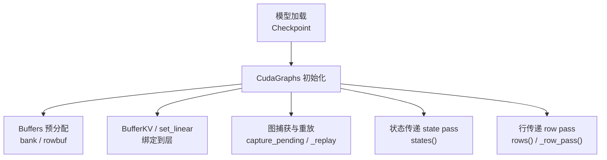
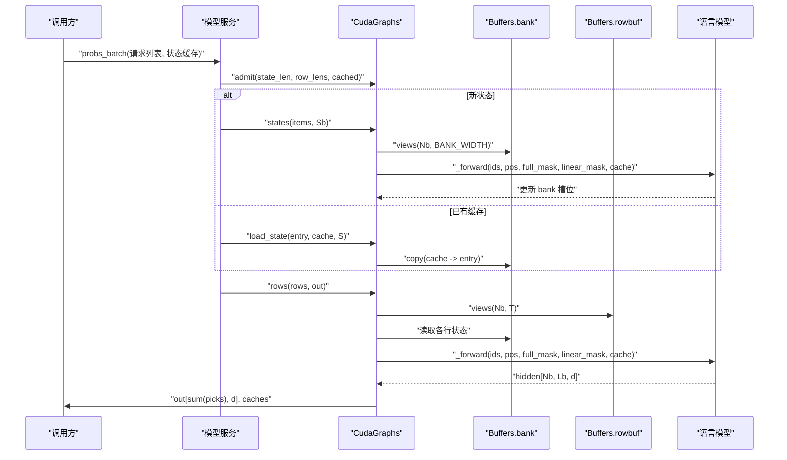
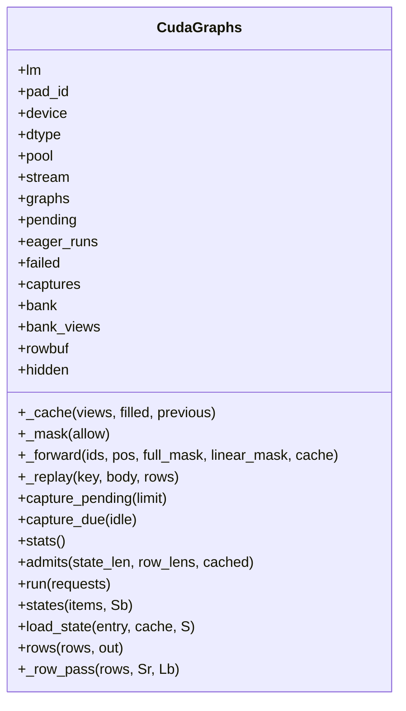
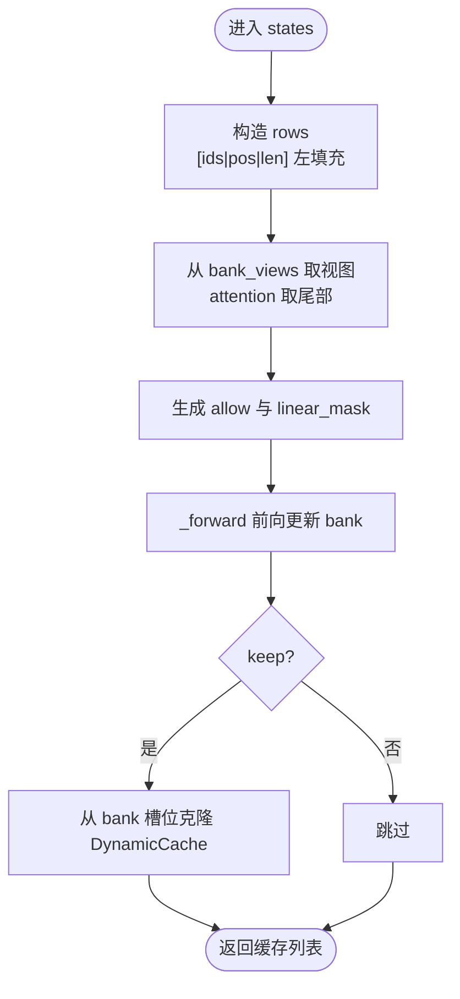
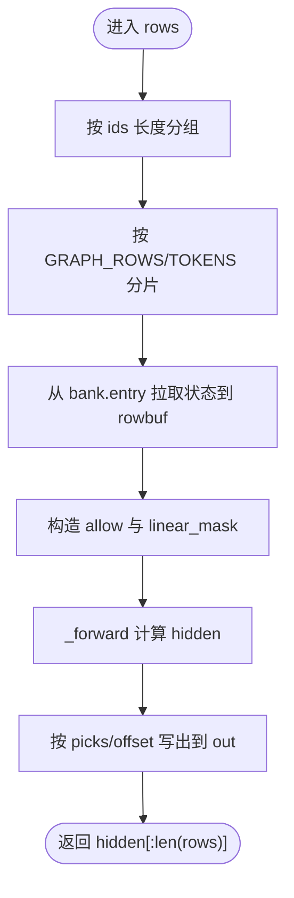
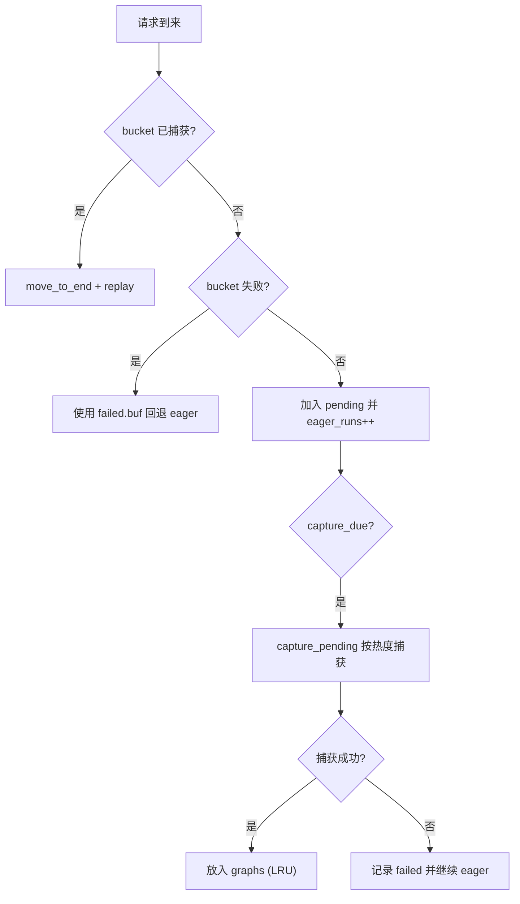
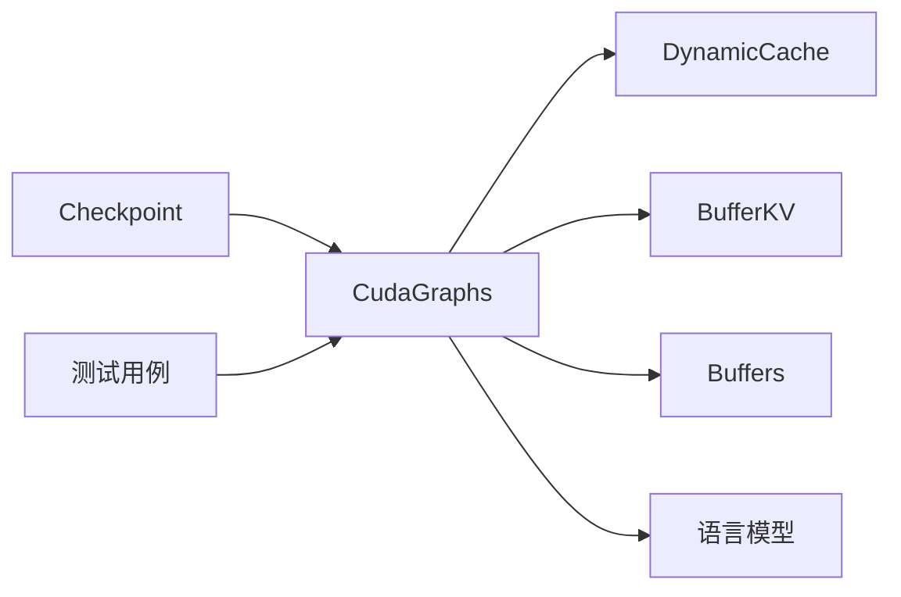

# CUDA 图优化

<cite>
**本文引用的文件**   
- [cuda_graphs.py](file://kev/cuda_graphs.py)
- [checkpoint.py](file://kev/checkpoint.py)
- [test_model.py](file://tests/test_model.py)
</cite>

## 目录
1. [简介](#简介)
2. [项目结构](#项目结构)
3. [核心组件](#核心组件)
4. [架构总览](#架构总览)
5. [详细组件分析](#详细组件分析)
6. [依赖关系分析](#依赖关系分析)
7. [性能考量](#性能考量)
8. [故障排除指南](#故障排除指南)
9. [结论](#结论)

## 简介
本文件面向 CUDA 图优化子系统，聚焦 CudaGraphs 类的设计与实现，系统阐述图捕获机制、重放流程、内存管理策略，以及状态传递（state pass）和行传递（row pass）的工作原理。文档还涵盖缓冲区布局、掩码处理、形状对齐、图缓存的 LRU 淘汰与热桶检测、动态捕获机制，并解释 BufferKV 与 Buffers 类的预分配缓冲设计如何避免 Python 对象开销。最后提供性能基准建议与常见问题排查路径。

## 项目结构
CUDA 图优化相关代码集中在 kev/cuda_graphs.py，并在模型加载时通过 Checkpoint 集成；测试用例验证了图路径与 eager 路径的一致性。

**图示来源**
- [cuda_graphs.py:165-189](file://kev/cuda_graphs.py#L165-L189)
- [cuda_graphs.py:190-204](file://kev/cuda_graphs.py#L190-L204)
- [cuda_graphs.py:206-263](file://kev/cuda_graphs.py#L206-L263)
- [cuda_graphs.py:301-375](file://kev/cuda_graphs.py#L301-L375)

**章节来源**
- [cuda_graphs.py:165-375](file://kev/cuda_graphs.py#L165-L375)
- [checkpoint.py:126-126](file://kev/checkpoint.py#L126-L126)

## 核心组件
- CudaGraphs：封装图捕获、重放、缓存与调度逻辑，维护共享内存池、流、图字典、待捕获桶、失败桶等状态。
- Buffers：基于固定容量与步长的二维视图缓冲管理器，用于 bank 与 row 的预分配与视图切片，避免频繁分配与 Python 对象创建。
- BufferKV：将注意力层的 key/value 张量直接绑定到 Buffers 的视图上，减少拷贝与对象开销。
- DynamicCache：作为高层缓存接口，被 CudaGraphs 在图内以 BufferKV 或 set_linear 替换为底层视图。

关键职责划分：
- 捕获阶段：预热 + 捕获，使用独立 stream 与 thread_local 错误模式，避免 GC/同步阻塞。
- 重放阶段：按 bucket 键复用图，未命中则回退 eager 执行并加入 pending。
- 状态传递：批量构造 attention/DeltaNet 的初始态，写入 bank 指定槽位。
- 行传递：从 bank 拉取每行的状态，计算隐藏表示并按选择索引写回输出。

**章节来源**
- [cuda_graphs.py:165-189](file://kev/cuda_graphs.py#L165-L189)
- [cuda_graphs.py:190-204](file://kev/cuda_graphs.py#L190-L204)
- [cuda_graphs.py:206-263](file://kev/cuda_graphs.py#L206-L263)
- [cuda_graphs.py:301-375](file://kev/cuda_graphs.py#L301-L375)

## 架构总览
下图展示请求进入后的整体流程：先进行 admit 判定，随后根据是否为新状态走 state pass 或复用 bank 槽位，再统一进入 row pass 完成 token 级推理，最终写出结果与可选的状态缓存。

**图示来源**
- [cuda_graphs.py:267-299](file://kev/cuda_graphs.py#L267-L299)
- [cuda_graphs.py:301-330](file://kev/cuda_graphs.py#L301-L330)
- [cuda_graphs.py:332-375](file://kev/cuda_graphs.py#L332-L375)

## 详细组件分析

### CudaGraphs 类设计与行为
- 初始化
  - 记录模型、pad_id、设备与 dtype。
  - 创建共享内存池与捕获流，维护图缓存、待捕获桶、eager 计数、失败桶。
  - 通过一次 eager 探测获取 DynamicCache 布局，校验仅支持特定层类型。
  - 预分配 bank 与 rowbuf，准备 hidden 缓冲。
- 缓存与掩码
  - _cache：用 BufferKV 或 set_linear 替换 DynamicCache 的层，使注意力与线性层直接读写 bank 视图。
  - _mask：生成加法掩码，dtype 与模型一致。
- 重放与捕获
  - _replay：按 bucket key 复用图；若未命中则回退 eager 执行，并将 rows 复制到共享 buf。
  - capture_pending：按 eager_runs 热度优先捕获，使用独立 stream 与 thread_local 捕获错误模式；失败时保留 eager 运行并记录失败原因。
  - capture_due：空闲或热桶达到阈值时触发捕获。
- 批处理入口
  - run：按状态长度分组，先 states 后 rows，输出拼接至 out，返回每个请求的状态缓存。
  - states：批量构造新状态，写入 bank 槽位，返回需要持久化的缓存。
  - load_state：将外部缓存拷贝进 bank 槽位。
  - rows/_row_pass：按行长度分组，从 bank 拉取状态，计算隐藏表示并按 picks 索引写出。

**图示来源**
- [cuda_graphs.py:165-375](file://kev/cuda_graphs.py#L165-L375)

**章节来源**
- [cuda_graphs.py:165-375](file://kev/cuda_graphs.py#L165-L375)

### 状态传递（state pass）工作原理
- 输入 items：[(ids, pos, keep)]，每个最多 Sb <= GRAPH_STATE tokens。
- 构建左填充 rows：[ids | positions | real length]，并补齐至 Nb = count_bucket(len(items))。
- 掩码 allow：保证因果性与有效位置；linear_mask：指示哪些行走线性注意力。
- 视图 views：从 bank_views 中取出对应槽位的切片，attention 层只取 BANK_WIDTH - Sb 之后的尾部。
- 前向：_forward 将 ids/pos/mask/cache 送入模型，更新 bank 槽位。
- 输出：对 keep=True 的状态，从 bank 槽位克隆出独立的 DynamicCache，供后续请求复用。

**图示来源**
- [cuda_graphs.py:301-330](file://kev/cuda_graphs.py#L301-L330)

**章节来源**
- [cuda_graphs.py:301-330](file://kev/cuda_graphs.py#L301-L330)

### 行传递（row pass）工作原理
- 输入 rows：包含 ids、pos、state_len、entry、offset、picks 的行集合。
- 分组与分片：按 ids 长度分组，按 GRAPH_ROWS 与 GRAPH_TOKENS 限制分批。
- 视图与状态拉取：从 bank 的 entry 槽位复制状态到 rowbuf 视图，attention 只取前 Sr 个位置。
- 掩码 allow：结合 Sr、plen、rowlen 与 q/k 位置关系构造因果掩码；linear_mask：按行长度决定线性注意力。
- 前向：_forward 计算 hidden[Nb, Lb, d]。
- 写出：按 picks 与 offset 将选定位置的隐藏向量 index_copy 到 out。

**图示来源**
- [cuda_graphs.py:340-375](file://kev/cuda_graphs.py#L340-L375)

**章节来源**
- [cuda_graphs.py:340-375](file://kev/cuda_graphs.py#L340-L375)

### 缓冲区布局、掩码处理与形状对齐
- 缓冲区布局
  - bank：[GRAPH_STATES, heads, BANK_WIDTH, dim]（注意力），或 [GRAPH_STATES, *state]（DeltaNet）。
  - rowbuf：[Nb, T]，T = Sr + Lb，Sr 为状态长度的 2 次幂对齐，Lb 为行长度桶。
- 掩码处理
  - _mask：将布尔 allow 转换为加法掩码，dtype 与模型一致。
  - state pass：allow 由 q/k 与 pad 控制；linear_mask 为 i >= pad。
  - row pass：allow 综合 Sr、plen、rowlen 与 q/k；linear_mask 为行长度标志。
- 形状对齐
  - 使用 bucket/count_bucket/pow2 对齐长度，确保图捕获时的静态形状稳定。
  - 左填充与右对齐（attention 尾部）避免越界与重复计算。

**章节来源**
- [cuda_graphs.py:183-189](file://kev/cuda_graphs.py#L183-L189)
- [cuda_graphs.py:198-204](file://kev/cuda_graphs.py#L198-L204)
- [cuda_graphs.py:301-375](file://kev/cuda_graphs.py#L301-L375)

### 图缓存系统：LRU、热桶检测与动态捕获
- LRU 淘汰
  - graphs 使用有序字典，访问即 move_to_end；超过 GRAPHS_KEPT 时弹出最久未使用的项。
- 热桶检测
  - eager_runs 统计每个 bucket 的 eager 次数；capture_pending 优先捕获最高频的 pending 桶。
  - capture_due 在空闲或最大 eager_runs >= HOT_BUCKET 时触发捕获。
- 动态捕获
  - capture_pending 使用独立 stream 与 thread_local 捕获错误模式；失败时显式结束分配器路由，避免污染后续捕获。
  - 捕获前先 warm-up，避免在捕获期间发生 autotuning 或 lazy setup。

**图示来源**
- [cuda_graphs.py:206-263](file://kev/cuda_graphs.py#L206-L263)

**章节来源**
- [cuda_graphs.py:206-263](file://kev/cuda_graphs.py#L206-L263)

### BufferKV 与 Buffers：预分配缓冲与零 Python 对象开销
- Buffers
  - 预分配固定容量的连续缓冲，并提供 views(N, M) 切片视图，避免每次分配与 Python 对象创建。
  - bank 与 rowbuf 分别服务于状态与行数据，视图与原始缓冲共享内存。
- BufferKV
  - 将注意力层的 keys/values 直接绑定到 Buffers 的视图上，避免中间对象与拷贝。
- set_linear
  - 将 DeltaNet 线性层的参数绑定到 Buffers 视图，保持与注意力层一致的视图语义。

这些设计使得图内前向可直接读写 bank/rowbuf，减少 Python/GIL 与分配开销，提升吞吐与稳定性。

**章节来源**
- [cuda_graphs.py:183-189](file://kev/cuda_graphs.py#L183-L189)
- [cuda_graphs.py:190-204](file://kev/cuda_graphs.py#L190-L204)

## 依赖关系分析
- CudaGraphs 依赖 torch.cuda.graph/stream/pool 与模型配置；通过 DynamicCache 抽象层类型，并以 BufferKV/set_linear 注入底层视图。
- Checkpoint 在加载模型时可选择启用 cuda_graphs，从而在推理路径中使用图优化。
- 测试用例验证图路径与 eager 路径数值一致性，覆盖新状态、缓存状态、超长行/状态等边界场景。

**图示来源**
- [checkpoint.py:126-126](file://kev/checkpoint.py#L126-L126)
- [cuda_graphs.py:165-375](file://kev/cuda_graphs.py#L165-L375)
- [test_model.py:321-351](file://tests/test_model.py#L321-L351)

**章节来源**
- [checkpoint.py:126-126](file://kev/checkpoint.py#L126-L126)
- [test_model.py:321-351](file://tests/test_model.py#L321-L351)

## 性能考量
- 图捕获时间
  - 首次捕获包含 warm-up 与 cuBLAS/Triton 设置，建议在空闲时段或后台线程进行；capture_due 可依据 idle 与热桶阈值自动触发。
- 重放加速比
  - 命中图的重放路径避免了 Python 调度与分配，通常显著降低延迟；未命中时回退 eager，不影响正确性。
- 内存使用
  - bank 与 rowbuf 预分配固定大小，避免峰值抖动；失败捕获会清理分配器路由，防止泄漏。
- 形状对齐与分组
  - 使用 bucket/count_bucket/pow2 对齐长度，减少图失效与重新捕获频率；按 GRAPH_ROWS/TOKENS 分片平衡吞吐与内存。

[本节为通用指导，不直接分析具体文件]

## 故障排除指南
- 图捕获失败
  - 现象：某 bucket 捕获失败，日志提示失败原因，该 bucket 继续以 eager 方式运行。
  - 可能原因：新形状导致 OOM、捕获期间资源竞争、thread_local 错误模式下的异常。
  - 处理：检查输入长度是否超出 GRAPH_STATE/GRAPH_ROW；调整批次大小；确认 capture_pending 在空闲或后台线程执行。
- 内存溢出
  - 现象：捕获过程中报 OOM。
  - 处理：增大 GRAPH_STATES/GRAPH_ROWS 或减小 batch；确保 capture_pending 不在高负载下频繁触发；必要时手动调用 capture_pending 控制时机。
- 数值不一致
  - 现象：图路径与 eager 路径结果差异较大。
  - 处理：参考测试用例，确保 dtype 与 fused 选项一致；检查是否混用了不同缓存路径；验证 mask 与 padding 是否正确。

**章节来源**
- [cuda_graphs.py:223-254](file://kev/cuda_graphs.py#L223-L254)
- [test_model.py:321-351](file://tests/test_model.py#L321-L351)

## 结论
CudaGraphs 通过预分配缓冲、视图绑定、状态/行两阶段流水线与智能缓存策略，实现了稳定的低延迟图推理路径。其 LRU 淘汰、热桶检测与动态捕获机制在保证吞吐的同时，兼顾了鲁棒性与可维护性。配合 BufferKV/Buffers 的零对象开销设计，系统在长上下文与多请求并发场景下具备良好扩展性。实际部署中应关注形状对齐、捕获时机与内存预算，以获得最佳性能与稳定性。