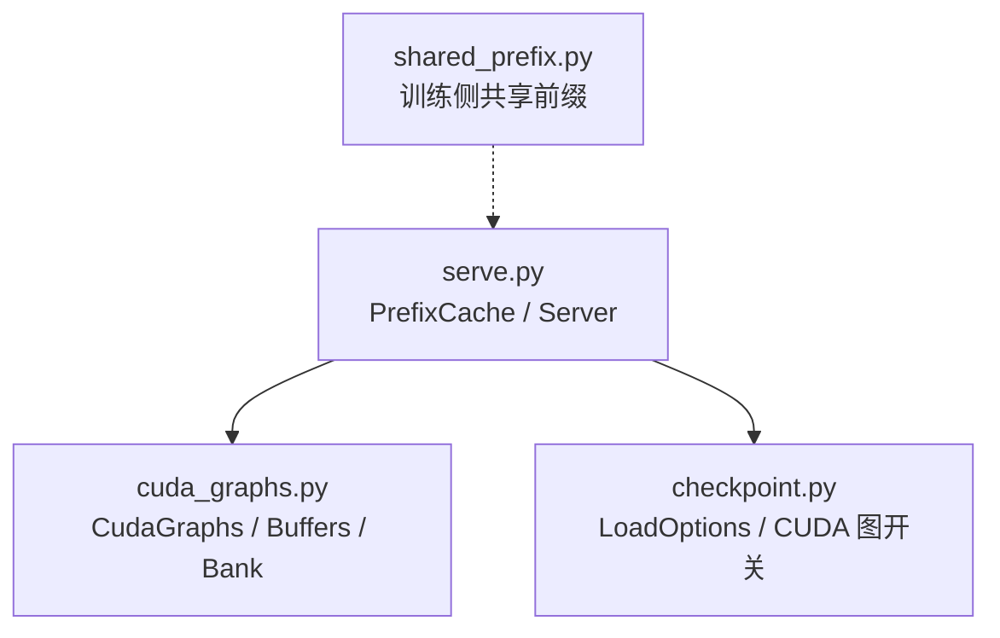
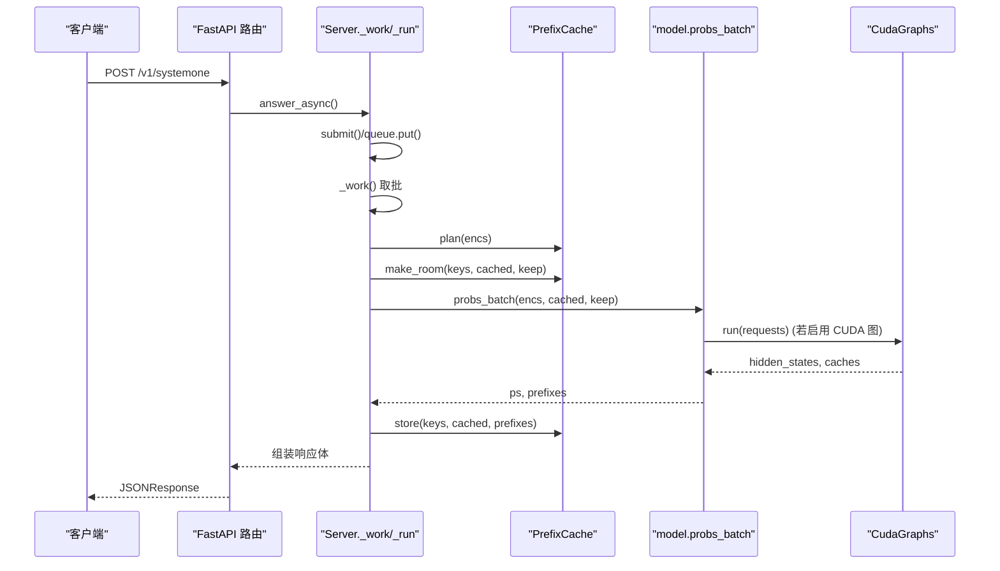
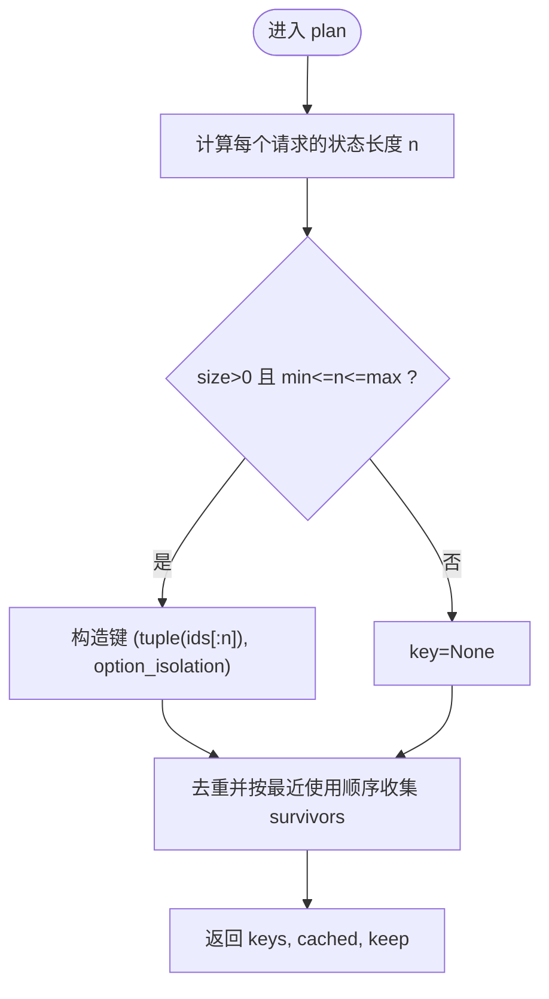
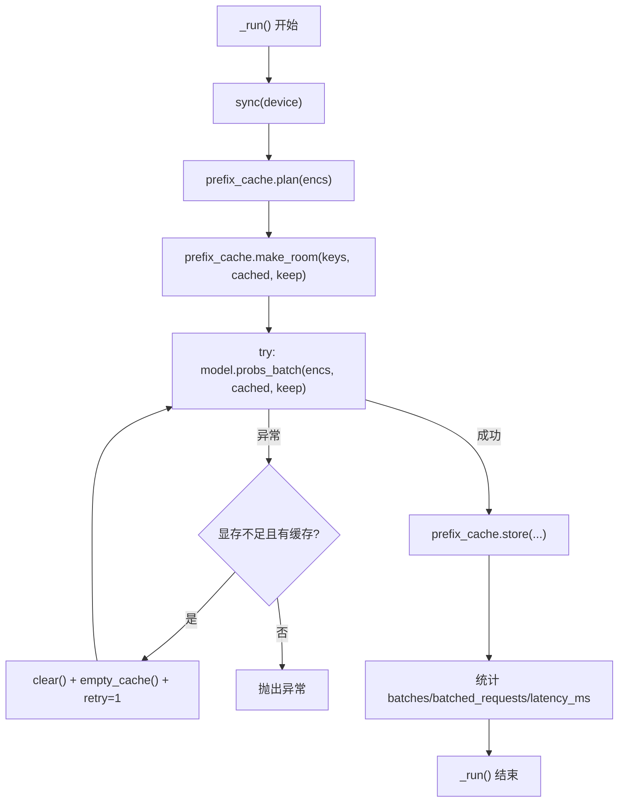
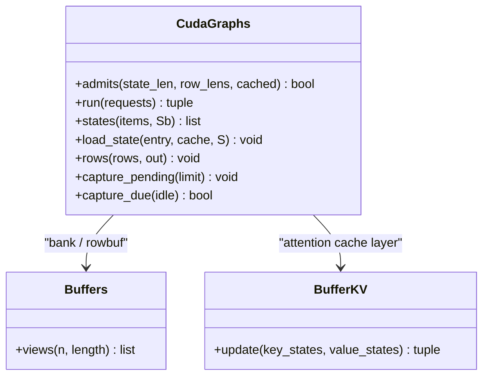
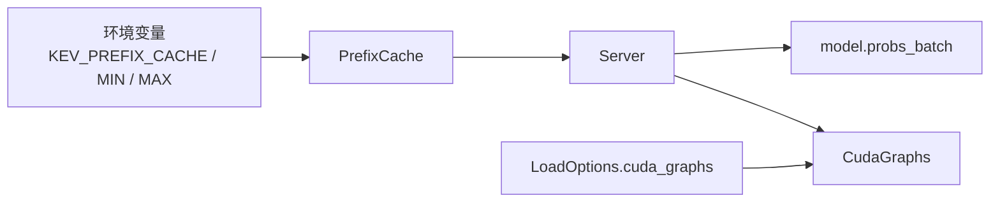

# 前缀缓存系统

<cite>
**本文引用的文件**   
- [serve.py](file://kev/serve.py)
- [cuda_graphs.py](file://kev/cuda_graphs.py)
- [shared_prefix.py](file://kev/shared_prefix.py)
- [checkpoint.py](file://kev/checkpoint.py)
</cite>

## 目录
1. [简介](#简介)
2. [项目结构](#项目结构)
3. [核心组件](#核心组件)
4. [架构总览](#架构总览)
5. [详细组件分析](#详细组件分析)
6. [依赖关系分析](#依赖关系分析)
7. [性能考量](#性能考量)
8. [故障排查指南](#故障排查指南)
9. [结论](#结论)
10. [附录](#附录)

## 简介
本技术文档聚焦于“前缀缓存系统”，围绕 PrefixCache 类的设计与实现，系统性阐述以下主题：
- 缓存键生成策略、LRU 淘汰算法与内存占用控制
- 命中率统计、缓存容量限制与自动清理策略
- 与 CUDA 图的集成方式，包括状态银行（state bank）布局与访问模式
- 缓存生命周期管理：创建、更新、失效与回收
- 性能监控指标：命中率、平均访问时间、内存使用量等
- 配置调优建议与部署最佳实践

该前缀缓存用于在推理服务中复用“状态前缀”（即模型上下文），避免重复计算，从而显著降低延迟并提升吞吐。

## 项目结构
前缀缓存相关代码主要分布在以下模块：
- serve.py：提供 PrefixCache 类与 Server 调度逻辑，负责请求入队、批处理、CUDA 图捕获时机以及缓存的 plan/store/make_room 流程
- cuda_graphs.py：定义 CUDA 图运行框架、状态银行（state bank）布局、行缓冲与批分组策略，以及与动态缓存的动态适配
- shared_prefix.py：训练侧共享前缀的前向路径（与本缓存无直接耦合，但有助于理解 KV/DeltaNet 状态的语义）
- checkpoint.py：加载选项与 CUDA 图开关，决定服务是否启用 CUDA 图

图表来源
- [serve.py:38-90](file://kev/serve.py#L38-L90)
- [cuda_graphs.py:146-189](file://kev/cuda_graphs.py#L146-L189)
- [checkpoint.py:111-125](file://kev/checkpoint.py#L111-L125)

章节来源
- [serve.py:38-90](file://kev/serve.py#L38-L90)
- [cuda_graphs.py:146-189](file://kev/cuda_graphs.py#L146-L189)
- [checkpoint.py:111-125](file://kev/checkpoint.py#L111-L125)

## 核心组件
- PrefixCache：基于 LRU 的进程内缓存，维护“状态前缀 -> 缓存对象”的映射，支持命中/未命中计数、OOM 重试计数、按数量与 token 数双重上限的淘汰
- Server：封装模型线程、请求队列、CUDA 图捕获时机，并在 _run 中协调 prefix_cache.plan/make_room/model.probs_batch/prefix_cache.store
- CudaGraphs：管理 CUDA 图的生命周期、批分组、状态银行（state bank）与行缓冲，提供 admits/run/states/load_state/rows 等方法
- Buffers：为注意力层与 DeltaNet 层预分配扁平缓冲区，并以视图形式暴露给不同形状的重放

章节来源
- [serve.py:38-90](file://kev/serve.py#L38-L90)
- [serve.py:93-191](file://kev/serve.py#L93-L191)
- [cuda_graphs.py:146-189](file://kev/cuda_graphs.py#L146-L189)
- [cuda_graphs.py:267-376](file://kev/cuda_graphs.py#L267-L376)

## 架构总览
下图展示一次请求从 HTTP 到模型前向再到响应返回的关键路径，以及前缀缓存与 CUDA 图的协作点。

图表来源
- [serve.py:249-252](file://kev/serve.py#L249-L252)
- [serve.py:150-191](file://kev/serve.py#L150-L191)
- [cuda_graphs.py:273-299](file://kev/cuda_graphs.py#L273-L299)

## 详细组件分析

### PrefixCache：LRU 前缀缓存
设计要点
- 缓存键：(状态 token 元组, option_isolation)；仅当长度在 [min_tokens, max_tokens] 范围内才参与缓存
- 容量约束：同时受 entries 数量 size 与所有条目 token 总数 max_tokens 限制
- 淘汰策略：LRU，优先保留最近使用的条目；store() 在插入后循环淘汰直到满足约束
- 批量优化：plan() 会先筛选出“本批次结束后仍可能存活”的候选集合，避免短期命中的条目污染 LRU 顺序
- OOM 恢复：_run() 在显存不足时清空缓存并重跑一次，记录 oom_retries

关键方法
- plan(encs)：为每个请求生成 key、查找已有缓存、判断是否需要保留新状态
- over(keys)：判断一组键是否超过数量或 token 上限
- make_room(keys, cached, keep)：提前删除本批次将被淘汰的旧条目，减少竞争
- store(keys, cached, prefixes)：统计命中/未命中，按 LRU 顺序插入，必要时触发淘汰
- clear()：清空全部缓存

图表来源
- [serve.py:52-61](file://kev/serve.py#L52-L61)

章节来源
- [serve.py:38-90](file://kev/serve.py#L38-L90)

### Server：请求调度与前缀缓存集成
职责
- 管理模型线程与请求队列，批量执行 model.probs_batch
- 在每次批处理前后调用 PrefixCache.plan/make_room/store
- 根据 CUDA 图能力，在空闲或热桶阈值到达时触发 capture_pending
- 统一封装 TypeSafe 兼容的请求/响应格式，并输出 latency_ms 与 prefix_cache_hit

关键流程
- submit()：校验请求长度，编码后入队
- _work()：拉取一批请求，加锁后调用 _run()
- _run()：计划缓存、预留空间、执行前向、存储结果、统计指标
- wait_idle()：等待队列清空与图捕获完成

图表来源
- [serve.py:172-191](file://kev/serve.py#L172-L191)

章节来源
- [serve.py:93-191](file://kev/serve.py#L93-L191)

### CudaGraphs：CUDA 图与状态银行
设计要点
- 两套共享缓冲：
  - 状态银行（state bank）：每层注意力 K/V 或 DeltaNet 状态，固定布局，便于行 pass 以相同方式读取任意 state pass 写入的状态
  - 行缓冲（row buffers）：每行 question row 的临时缓冲，逐行聚合后写回输出
- 批分组：按长度 bucket/count_bucket 分组，减少形状爆炸；length_groups 动态规划最小化 padded tokens
- 图捕获：首次以 eager 运行加入 pending，随后在空闲或 HOT_BUCKET 阈值达到时异步捕获；失败则降级为 eager
- 状态复制：load_state() 将 DynamicCache 拷贝进 bank entry；states() 返回可被 PrefixCache 保存的 cache

关键方法
- admits(state_len, row_lens, cached)：判定请求是否适合走 CUDA 图路径
- run(requests)：分组、状态 pass、行 pass，返回 picked hidden states 与 caches
- states(items, Sb)：批量状态 pass，返回需要持久化的 cache
- load_state(entry, cache, S)：将缓存状态载入 bank entry
- rows(rows, out)：批量行 pass，将所需位置的结果直接写入 out

图表来源
- [cuda_graphs.py:146-189](file://kev/cuda_graphs.py#L146-L189)
- [cuda_graphs.py:267-376](file://kev/cuda_graphs.py#L267-L376)

章节来源
- [cuda_graphs.py:146-189](file://kev/cuda_graphs.py#L146-L189)
- [cuda_graphs.py:267-376](file://kev/cuda_graphs.py#L267-L376)

### 训练侧共享前缀（背景参考）
shared_prefix.py 定义了 Prefix 与共享前缀前向，帮助理解 KV 与 DeltaNet 状态在层间的传递方式。虽然不直接参与服务期缓存，但其对“状态语义”的描述有助于理解缓存项的内容与访问模式。

章节来源
- [shared_prefix.py:30-70](file://kev/shared_prefix.py#L30-L70)
- [shared_prefix.py:99-132](file://kev/shared_prefix.py#L99-L132)

## 依赖关系分析
- PrefixCache 依赖环境变量 PREFIX_CACHE_SIZE/PREFIX_MIN_TOKENS/PREFIX_MAX_TOKENS 控制行为
- Server 依赖 model.probs_batch 与可选的 CudaGraphs；通过 LoadOptions.cuda_graphs 决定是否启用
- CudaGraphs 依赖 transformers.cache_utils.DynamicLayer/LinearAttentionLayer 的布局约定，并通过 Buffers 预分配内存

图表来源
- [serve.py:27-31](file://kev/serve.py#L27-L31)
- [checkpoint.py:111-125](file://kev/checkpoint.py#L111-L125)

章节来源
- [serve.py:27-31](file://kev/serve.py#L27-L31)
- [checkpoint.py:111-125](file://kev/checkpoint.py#L111-L125)

## 性能考量
- 命中率与吞吐：高命中率意味着更多请求可直接复用状态前缀，减少重复计算；结合 CUDA 图可减少 kernel 启动与 Python 调度开销
- 批大小与分组：MAX_BATCH 与 length_groups 共同决定批内 token 总量与 padding 比例，影响 GPU 利用率与延迟
- 图捕获成本：首次捕获约数百毫秒，应尽量避免频繁捕获；HOT_BUCKET 与 idle 策略平衡了热桶的捕获时机
- 显存压力：长状态（如 64k）会占用大量显存；PrefixCache.max_tokens 与 BANK_WIDTH 需协同调参以避免 OOM

[本节为通用性能讨论，无需特定文件引用]

## 故障排查指南
常见问题与定位
- 命中率低：检查 PREFIX_MIN_TOKENS 是否过高导致短前缀不被缓存；确认 option_isolation 是否合理
- 频繁 OOM 重试：观察 oom_retries 增长；适当降低 PREFIX_CACHE_SIZE 或 max_tokens，或增大 BANK_WIDTH（由模型与硬件决定）
- CUDA 图捕获失败：查看 graphs.stats().failed 列表；失败桶将回退到 eager 路径，不影响服务可用性
- 延迟抖动：关注 capture_due 与 capture_pending 的调用频率；确保在空闲时段进行捕获

可观测指标
- 命中率：hits / (hits + misses)
- 平均延迟：latency_ms（来自响应 usage）
- 缓存规模：cached_states = len(entries)
- OOM 重试次数：oom_retries
- 图状态：captured/kept/pending/failed

章节来源
- [serve.py:172-191](file://kev/serve.py#L172-L191)
- [serve.py:298-312](file://kev/serve.py#L298-L312)
- [cuda_graphs.py:223-263](file://kev/cuda_graphs.py#L223-L263)

## 结论
前缀缓存系统通过 PrefixCache 的 LRU 策略与双重容量约束，有效复用跨请求的状态前缀，显著降低重复计算成本；与 CUDA 图结合后，进一步减少了内核启动与调度开销。合理的配置（min/max tokens、size、BANK_WIDTH、MAX_BATCH）与监控（命中率、延迟、OOM 重试、图捕获状态）是保障稳定高性能运行的关键。

[本节为总结性内容，无需特定文件引用]

## 附录

### 配置与环境变量
- KEV_PREFIX_CACHE：缓存条目数量上限，0 表示禁用
- KEV_PREFIX_MIN_TOKENS：最短状态 token 数阈值，低于此值不缓存
- KEV_PREFIX_MAX_TOKENS：所有缓存条目的 token 总数上限
- KEV_CUDA_GRAPHS：是否启用 CUDA 图（默认在 CUDA 上开启）
- KEV_FUSED：是否启用融合算子（与 CUDA 图配合）
- KEV_TRUNCATE_STATES：超长状态是否截断而非拒绝

章节来源
- [serve.py:27-33](file://kev/serve.py#L27-L33)
- [checkpoint.py:143-145](file://kev/checkpoint.py#L143-L145)

### 性能监控接口
- /v1/models 返回 prefix_cache 与 cuda_graphs 统计信息，便于外部监控系统采集

章节来源
- [serve.py:298-312](file://kev/serve.py#L298-L312)