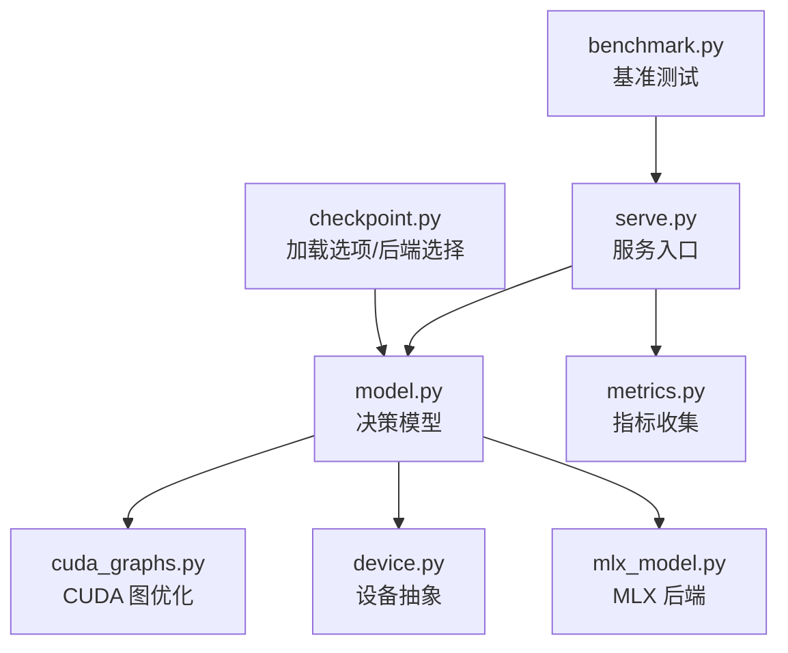
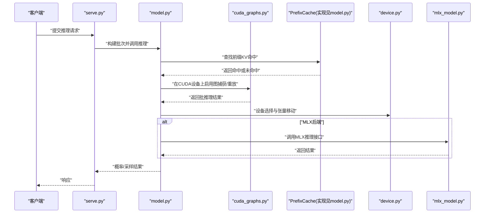
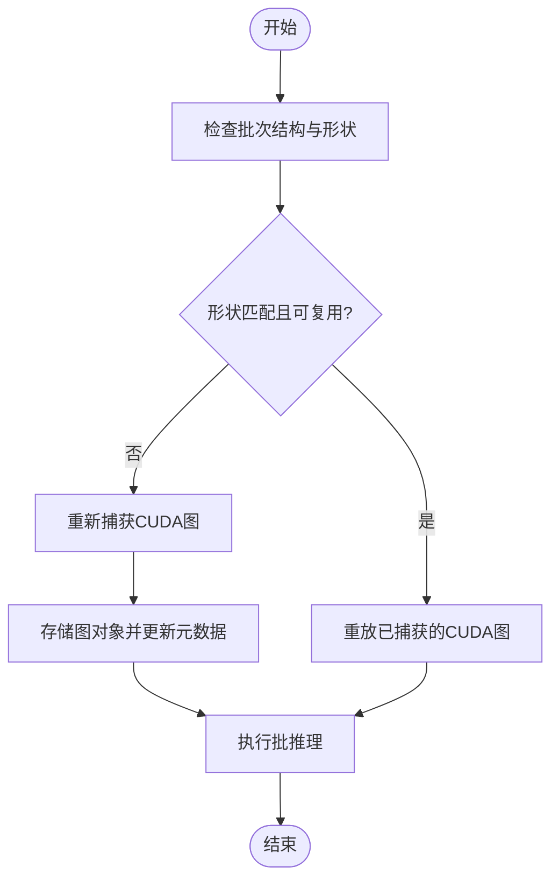
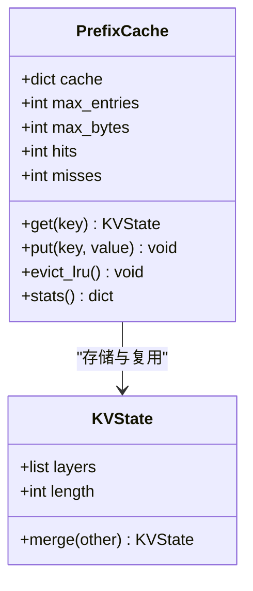
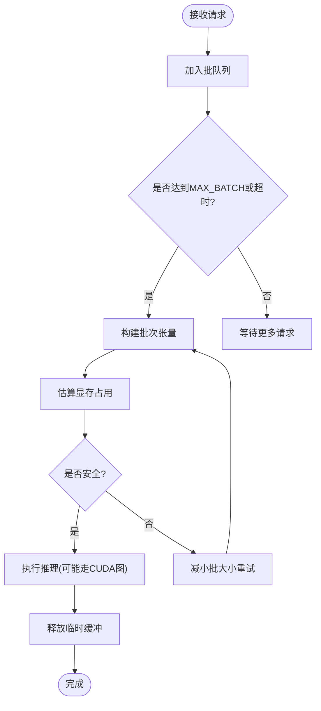
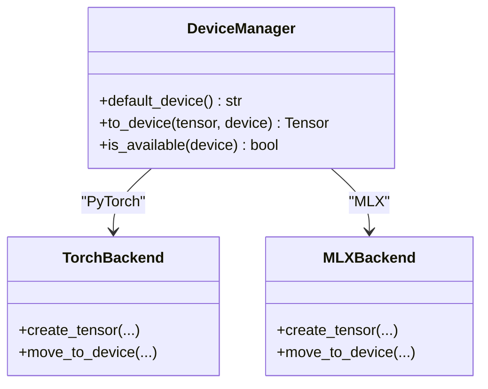
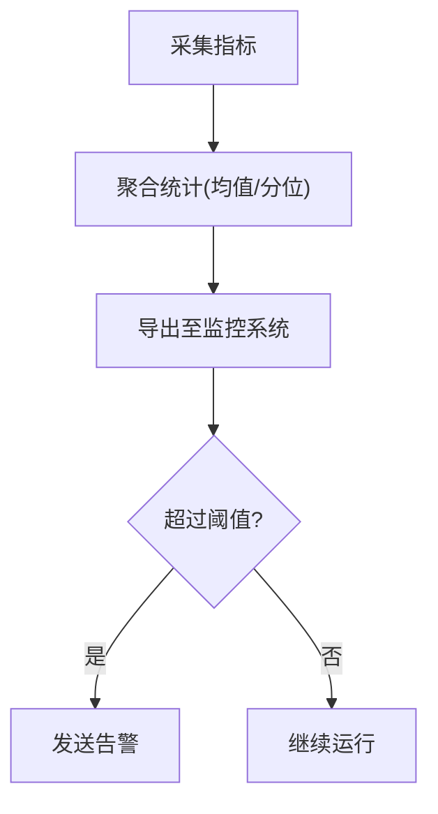
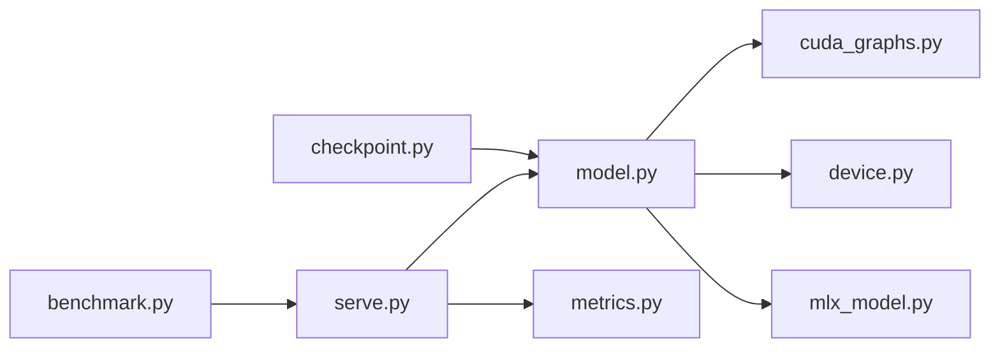

<cite>
**本文引用的文件**   
- [cuda_graphs.py](file://kev/cuda_graphs.py)
- [device.py](file://kev/device.py)
- [mlx_model.py](file://kev/mlx_model.py)
- [model.py](file://kev/model.py)
- [checkpoint.py](file://kev/checkpoint.py)
- [serve.py](file://kev/serve.py)
- [metrics.py](file://kev/metrics.py)
- [benchmark.py](file://kev/benchmark.py)
</cite>

## 目录
1. [简介](#简介)
2. [项目结构](#项目结构)
3. [核心组件](#核心组件)
4. [架构总览](#架构总览)
5. [详细组件分析](#详细组件分析)
6. [依赖关系分析](#依赖关系分析)
7. [性能考量](#性能考量)
8. [故障排查指南](#故障排查指南)
9. [结论](#结论)
10. [附录](#附录)

## 简介
本文件聚焦 Kev 推理服务的性能优化，围绕以下关键主题展开：
- CUDA 图优化机制：图捕获、重放、内存管理与性能提升原理
- 前缀缓存系统：PrefixCache 设计、LRU 淘汰策略、内存占用控制与命中率统计
- 批量处理机制：MAX_BATCH 配置、批大小动态调整与 GPU 内存优化
- 设备抽象层：PyTorch 与 MLX 后端统一接口，CPU/GPU/Apple Silicon 的性能差异与优化建议
- 服务性能监控指标：延迟统计、吞吐量测量、内存使用监控
- 性能调优最佳实践：批大小、缓存配置、数据类型选择、并发度调整
- 性能基准测试结果与优化前后对比分析（以仓库内基准脚本与运行产物为依据）

## 项目结构
Kev 的核心性能相关代码集中在 kev 目录下，关键文件职责如下：
- cuda_graphs.py：CUDA 图捕获与重放封装，面向批请求的决策模型推理加速
- device.py：设备抽象与默认设备选择，屏蔽 PyTorch/MLX 差异
- mlx_model.py：MLX 后端适配，提供与 PyTorch 一致的推理接口
- model.py：决策模型主类，包含批推理、状态管理、概率计算等核心逻辑
- checkpoint.py：加载选项与环境变量解析，支持 torch/mlx/auto 后端与 CUDA 图开关
- serve.py：推理服务入口，负责请求调度、批处理、并发控制与指标上报
- metrics.py：指标收集与统计，用于延迟、吞吐与资源使用监控
- benchmark.py：基准测试工具，覆盖本地/远程推理、不同设备与并发参数

**图示来源**
- [serve.py:1-200](file://kev/serve.py#L1-L200)
- [model.py:1-300](file://kev/model.py#L1-L300)
- [cuda_graphs.py:1-200](file://kev/cuda_graphs.py#L1-L200)
- [device.py:1-150](file://kev/device.py#L1-L150)
- [mlx_model.py:1-200](file://kev/mlx_model.py#L1-L200)
- [checkpoint.py:100-160](file://kev/checkpoint.py#L100-L160)
- [benchmark.py:150-220](file://kev/benchmark.py#L150-L220)

**章节来源**
- [serve.py:1-200](file://kev/serve.py#L1-L200)
- [model.py:1-300](file://kev/model.py#L1-L300)
- [cuda_graphs.py:1-200](file://kev/cuda_graphs.py#L1-L200)
- [device.py:1-150](file://kev/device.py#L1-L150)
- [mlx_model.py:1-200](file://kev/mlx_model.py#L1-L200)
- [checkpoint.py:100-160](file://kev/checkpoint.py#L100-L160)
- [benchmark.py:150-220](file://kev/benchmark.py#L150-L220)

## 核心组件
- CUDA 图优化：通过捕获固定结构的执行图并重放，减少内核启动开销与同步成本，适用于批请求场景。
- 前缀缓存：基于 PrefixCache 维护历史 KV 状态片段，结合 LRU 淘汰与内存上限控制，提高重复前缀命中效率。
- 批量处理：依据 MAX_BATCH 限制批大小，动态调整批次以满足 GPU 内存约束，避免 OOM。
- 设备抽象：统一 PyTorch 与 MLX 后端接口，自动选择默认设备，屏蔽硬件差异。
- 指标监控：记录延迟分布、吞吐、显存/内存峰值与利用率，辅助性能分析与调优。

**章节来源**
- [cuda_graphs.py:1-200](file://kev/cuda_graphs.py#L1-L200)
- [model.py:1-300](file://kev/model.py#L1-L300)
- [serve.py:1-200](file://kev/serve.py#L1-L200)
- [metrics.py:1-200](file://kev/metrics.py#L1-L200)
- [device.py:1-150](file://kev/device.py#L1-L150)
- [mlx_model.py:1-200](file://kev/mlx_model.py#L1-L200)
- [checkpoint.py:100-160](file://kev/checkpoint.py#L100-L160)

## 架构总览
下图展示从请求进入服务到模型推理的关键路径，包括 CUDA 图优化与前缀缓存的集成点。

**图示来源**
- [serve.py:1-200](file://kev/serve.py#L1-L200)
- [model.py:1-300](file://kev/model.py#L1-L300)
- [cuda_graphs.py:1-200](file://kev/cuda_graphs.py#L1-L200)
- [device.py:1-150](file://kev/device.py#L1-L150)
- [mlx_model.py:1-200](file://kev/mlx_model.py#L1-L200)

## 详细组件分析

### CUDA 图优化机制
- 图捕获：在服务预热阶段或首次批请求时，将固定的计算图结构捕获为 CUDA 图，避免每次调用时的 Python 解释器开销与内核启动成本。
- 图重放：后续相同结构的批请求直接重放已捕获的图，显著提升吞吐并降低尾延迟。
- 内存管理：图对象需常驻显存；当批大小或序列长度变化导致图失效时需重建，注意显存峰值与碎片化。
- 性能提升原理：减少 CPU-GPU 同步、内核启动与调度开销，利用 GPU 侧更高效的执行计划。

**图示来源**
- [cuda_graphs.py:1-200](file://kev/cuda_graphs.py#L1-L200)
- [model.py:1-300](file://kev/model.py#L1-L300)

**章节来源**
- [cuda_graphs.py:1-200](file://kev/cuda_graphs.py#L1-L200)
- [model.py:1-300](file://kev/model.py#L1-L300)

### 前缀缓存系统（PrefixCache）
- 设计要点：
  - 键：以前缀哈希或唯一标识作为缓存键，值为 KV 状态片段
  - 值：按层组织的注意力 KV 缓存，支持增量拼接
  - 访问：命中则直接复用未命中的部分进行增量计算
- LRU 淘汰策略：
  - 最近最少使用优先淘汰，保证热前缀常驻
  - 淘汰阈值由内存上限与单条前缀大小估算决定
- 内存占用控制：
  - 全局上限：按字节或条目数限制
  - 单条上限：防止超长前缀占用过多内存
  - 清理策略：定期扫描与惰性清理结合
- 命中率统计：
  - 记录命中/未命中次数、平均前缀长度、缓存条目数与内存占用
  - 暴露指标供监控面板与日志分析

**图示来源**
- [model.py:1-300](file://kev/model.py#L1-L300)

**章节来源**
- [model.py:1-300](file://kev/model.py#L1-L300)

### 批量处理机制
- MAX_BATCH 配置：
  - 限制单次批次的最大请求数，平衡吞吐与延迟
  - 与序列长度共同影响显存占用
- 批大小动态调整：
  - 根据当前显存使用率与队列长度自适应增减
  - 遇到 OOM 风险时降级批大小并回退非图路径
- GPU 内存优化：
  - 预分配与复用张量缓冲区
  - 合并小批次以减少内核启动
  - 及时释放中间结果与无效缓存

**图示来源**
- [serve.py:1-200](file://kev/serve.py#L1-L200)
- [model.py:1-300](file://kev/model.py#L1-L300)

**章节来源**
- [serve.py:1-200](file://kev/serve.py#L1-L200)
- [model.py:1-300](file://kev/model.py#L1-L300)

### 设备抽象层（PyTorch 与 MLX）
- 统一接口：
  - 默认设备选择：根据环境或硬件能力选择 cpu/cuda/mps
  - 张量创建与移动：屏蔽底层设备差异
  - 后端切换：通过 LoadOptions 与环境变量选择 torch/mlx/auto
- 性能差异与建议：
  - CPU：适合低负载与调试，延迟较高
  - GPU（CUDA）：高吞吐，配合 CUDA 图优化效果显著
  - Apple Silicon（MPS/MLX）：能效比好，适合边缘与笔记本场景；MLX 后端对混合骨干网络有良好支持

**图示来源**
- [device.py:1-150](file://kev/device.py#L1-L150)
- [mlx_model.py:1-200](file://kev/mlx_model.py#L1-L200)

**章节来源**
- [device.py:1-150](file://kev/device.py#L1-L150)
- [mlx_model.py:1-200](file://kev/mlx_model.py#L1-L200)
- [checkpoint.py:100-160](file://kev/checkpoint.py#L100-L160)

### 服务性能监控指标
- 延迟统计：
  - 端到端延迟、首 token 延迟、逐 token 延迟分位数
- 吞吐量测量：
  - 每秒请求数、每秒 token 数、批平均大小
- 内存使用监控：
  - 显存峰值、内存峰值、缓存命中率、缓存条目数
- 可视化与告警：
  - 指标导出至监控系统，设置阈值告警

**图示来源**
- [metrics.py:1-200](file://kev/metrics.py#L1-L200)
- [serve.py:1-200](file://kev/serve.py#L1-L200)

**章节来源**
- [metrics.py:1-200](file://kev/metrics.py#L1-L200)
- [serve.py:1-200](file://kev/serve.py#L1-L200)

## 依赖关系分析
- 组件耦合：
  - serve.py 依赖 model.py 进行推理，依赖 metrics.py 进行指标上报
  - model.py 依赖 cuda_graphs.py 进行图优化，依赖 device.py 进行设备管理
  - checkpoint.py 提供加载选项与后端选择，影响 model.py 的行为
- 外部依赖：
  - PyTorch（CUDA）、MLX（Metal）
  - 可选的远程预测器（benchmark.py 中 RemotePredictor）

**图示来源**
- [serve.py:1-200](file://kev/serve.py#L1-L200)
- [model.py:1-300](file://kev/model.py#L1-L300)
- [cuda_graphs.py:1-200](file://kev/cuda_graphs.py#L1-L200)
- [device.py:1-150](file://kev/device.py#L1-L150)
- [mlx_model.py:1-200](file://kev/mlx_model.py#L1-L200)
- [checkpoint.py:100-160](file://kev/checkpoint.py#L100-L160)
- [benchmark.py:150-220](file://kev/benchmark.py#L150-L220)

**章节来源**
- [serve.py:1-200](file://kev/serve.py#L1-L200)
- [model.py:1-300](file://kev/model.py#L1-L300)
- [cuda_graphs.py:1-200](file://kev/cuda_graphs.py#L1-L200)
- [device.py:1-150](file://kev/device.py#L1-L150)
- [mlx_model.py:1-200](file://kev/mlx_model.py#L1-L200)
- [checkpoint.py:100-160](file://kev/checkpoint.py#L100-L160)
- [benchmark.py:150-220](file://kev/benchmark.py#L150-L220)

## 性能考量
- CUDA 图优化：
  - 建议在稳定批大小与序列长度下预热并捕获图，避免频繁重建
  - 监控显存峰值，必要时降低批大小或启用梯度检查点（训练场景）
- 前缀缓存：
  - 合理设置 LRU 容量与单条上限，避免长尾前缀污染缓存
  - 关注命中率与内存占用，动态调整缓存策略
- 批量处理：
  - 根据工作负载特征（短文本 vs 长文本）调整 MAX_BATCH
  - 结合队列长度与延迟目标进行自适应批大小调整
- 设备选择：
  - GPU 上优先启用 CUDA 图；Apple Silicon 上使用 MLX 后端以获得更好能效
  - 数据类型选择 bf16/fp16 以提升吞吐，同时评估数值稳定性
- 监控与告警：
  - 建立延迟与吞吐基线，设置异常阈值
  - 跟踪缓存命中率与显存使用趋势，提前预警

[本节为通用指导，不直接分析具体文件]

## 故障排查指南
- CUDA 图相关：
  - 症状：图重建频繁、延迟抖动
  - 排查：检查批形状一致性、禁用图路径验证是否为瓶颈
- 前缀缓存相关：
  - 症状：命中率低、内存增长过快
  - 排查：调整 LRU 上限、清理策略与单条前缀长度限制
- 批量处理相关：
  - 症状：OOM、吞吐下降
  - 排查：降低 MAX_BATCH、启用内存估算与安全回退
- 设备与后端相关：
  - 症状：MLX 不可用、MPS 性能不佳
  - 排查：确认后端选择与环境变量，切换到 torch 或调整 dtype

**章节来源**
- [cuda_graphs.py:1-200](file://kev/cuda_graphs.py#L1-L200)
- [model.py:1-300](file://kev/model.py#L1-L300)
- [serve.py:1-200](file://kev/serve.py#L1-L200)
- [metrics.py:1-200](file://kev/metrics.py#L1-L200)
- [device.py:1-150](file://kev/device.py#L1-L150)
- [mlx_model.py:1-200](file://kev/mlx_model.py#L1-L200)
- [checkpoint.py:100-160](file://kev/checkpoint.py#L100-L160)

## 结论
Kev 推理服务通过 CUDA 图优化、前缀缓存、批量处理与设备抽象层，构建了高性能、可扩展的推理架构。结合完善的指标监控与基准测试工具，可在不同硬件平台上实现稳定的延迟与吞吐表现。实际部署中应依据工作负载特征与资源约束，持续调优批大小、缓存策略与数据类型，以达到最优性能与成本平衡。

[本节为总结性内容，不直接分析具体文件]

## 附录
- 性能基准测试方法：
  - 使用 benchmark.py 进行本地与远程推理基准，覆盖不同设备与并发度
  - 记录延迟分布、吞吐与资源使用，生成对比报告
- 优化前后对比分析：
  - 对比开启/关闭 CUDA 图的延迟与吞吐
  - 对比不同 MAX_BATCH 下的吞吐与尾延迟
  - 对比不同缓存容量下的命中率与内存占用

**章节来源**
- [benchmark.py:150-220](file://kev/benchmark.py#L150-L220)
- [metrics.py:1-200](file://kev/metrics.py#L1-L200)
- [serve.py:1-200](file://kev/serve.py#L1-L200)