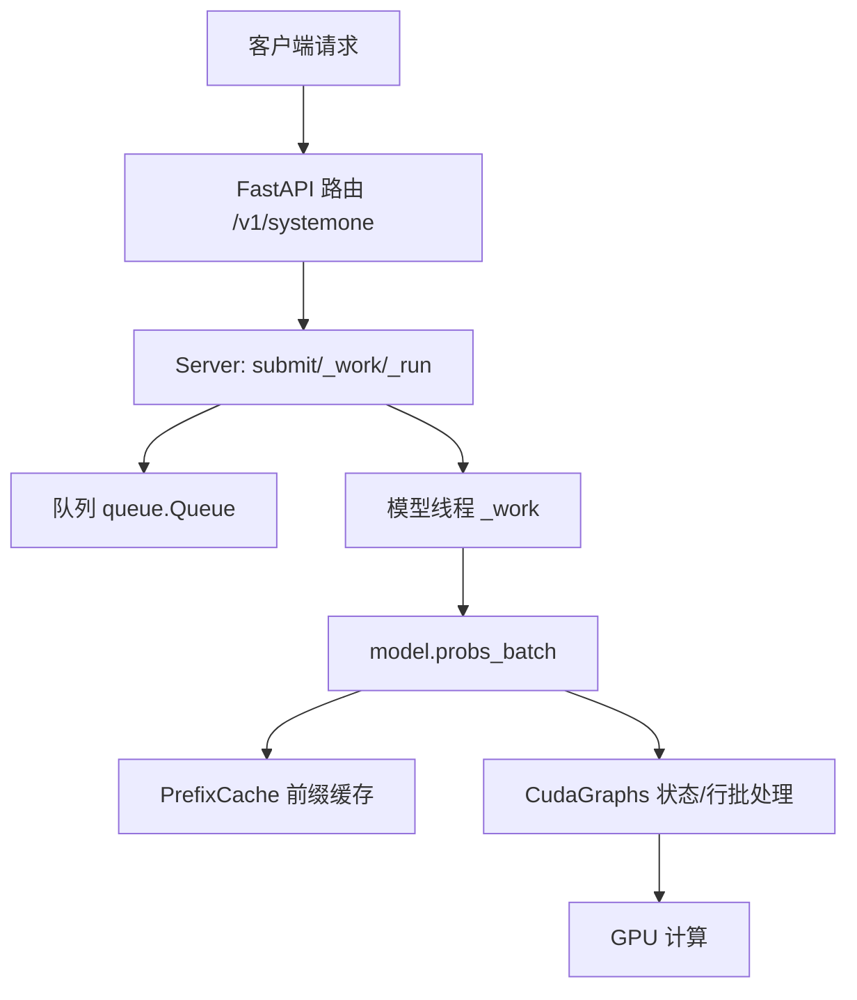
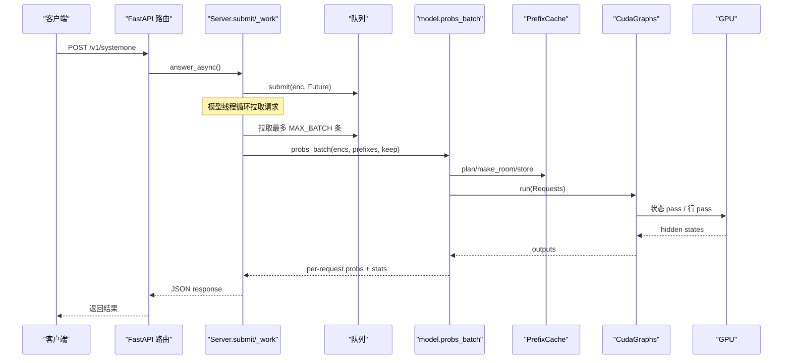
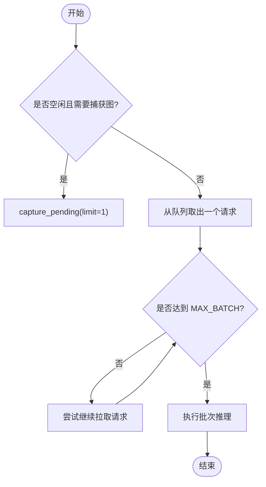
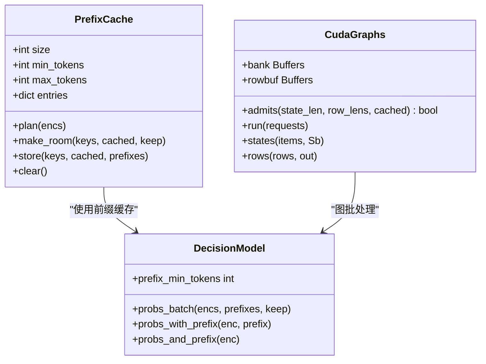
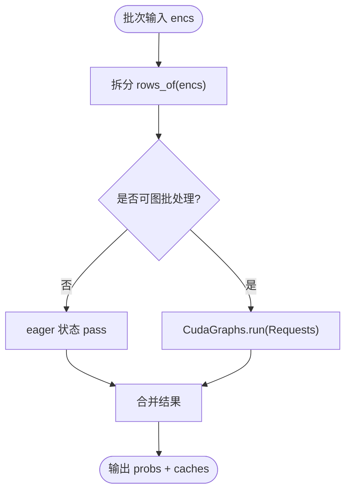
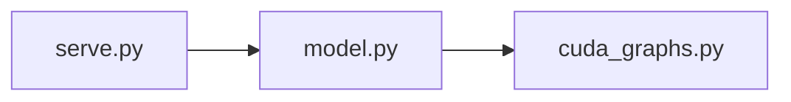

<cite>
**本文引用的文件**   
- [serve.py](file://kev/serve.py)
- [model.py](file://kev/model.py)
- [cuda_graphs.py](file://kev/cuda_graphs.py)
- [README.md](file://README.md)
</cite>

## 目录
1. [简介](#简介)
2. [项目结构](#项目结构)
3. [核心组件](#核心组件)
4. [架构总览](#架构总览)
5. [详细组件分析](#详细组件分析)
6. [依赖关系分析](#依赖关系分析)
7. [性能考量](#性能考量)
8. [故障排查指南](#故障排查指南)
9. [结论](#结论)
10. [附录](#附录)

## 简介
本文面向 Kev 推理服务中的“批量处理机制”，系统性解释请求如何被分组、长度如何分组、动态批大小如何调整，以及 MAX_BATCH 配置的作用与调优方法。文档还覆盖 GPU 内存优化（前缀缓存、CUDA Graphs、行批处理）、流水线设计（状态批处理与行批处理的协调），并给出延迟与吞吐的权衡策略、性能分析方法与不同负载场景下的优化案例。

## 项目结构
本项目的批量处理主要涉及三个模块：
- 服务层调度与队列：负责接收请求、维护模型线程、按 MAX_BATCH 拉取请求并执行批次推理。
- 模型层批处理接口：提供 probs_batch、probs_with_prefix、probs_and_prefix 等接口，支持状态前缀复用与行批处理。
- CUDA Graphs 批处理：对混合架构（Qwen3.5）在 CUDA 上的状态 pass 与行 pass 进行图录制与回放，减少内核启动开销。

**图表来源**
- [serve.py:150-191](file://kev/serve.py#L150-L191)
- [model.py:464-492](file://kev/model.py#L464-L492)
- [cuda_graphs.py:267-299](file://kev/cuda_graphs.py#L267-L299)

**章节来源**
- [serve.py:150-191](file://kev/serve.py#L150-L191)
- [model.py:464-492](file://kev/model.py#L464-L492)
- [cuda_graphs.py:267-299](file://kev/cuda_graphs.py#L267-L299)

## 核心组件
- 服务层（Server）
  - 单模型线程从队列中批量拉取请求，最多拉取 MAX_BATCH 个请求后统一执行。
  - 通过锁保护每次批次的执行，避免并发访问共享资源。
  - 维护批次统计信息（batches、batched_requests）和队列长度。
- 前缀缓存（PrefixCache）
  - 基于 LRU 的策略缓存状态前缀（KV + DeltaNet 状态），限制最大条目数与总 token 数。
  - 在批次运行前主动清理将被替换或淘汰的条目，降低 OOM 风险。
- 模型批处理（DecisionModel.probs_batch）
  - 将多个请求拆分为“状态 pass”和“行 pass”，复用已缓存的状态前缀。
  - 对长状态请求先单独跑一次 eager 状态 pass，再进入图批处理。
- CUDA Graphs（CudaGraphs）
  - 对状态 pass 与行 pass 分别录制图，按长度分组以减少 padding 浪费。
  - 使用固定大小的 bank 与 row buffers，避免重复分配，提升吞吐。

**章节来源**
- [serve.py:38-90](file://kev/serve.py#L38-L90)
- [serve.py:93-191](file://kev/serve.py#L93-L191)
- [model.py:464-492](file://kev/model.py#L464-L492)
- [cuda_graphs.py:146-189](file://kev/cuda_graphs.py#L146-L189)

## 架构总览
下图展示从 HTTP 请求到 GPU 计算的完整路径，包括批处理、前缀缓存与 CUDA Graphs 的协作。

**图表来源**
- [serve.py:200-220](file://kev/serve.py#L200-L220)
- [serve.py:150-191](file://kev/serve.py#L150-L191)
- [model.py:464-492](file://kev/model.py#L464-L492)
- [cuda_graphs.py:267-299](file://kev/cuda_graphs.py#L267-L299)

## 详细组件分析

### 调度算法：请求分组、长度分组与动态批大小
- 请求分组
  - 模型线程在空闲时尝试捕获 CUDA Graphs；当有请求入队时，先从队列取出一个作为批次起点，然后尽可能多地追加请求直到达到 MAX_BATCH。
  - 该策略简单高效，适合突发流量下快速聚合请求，提高 GPU 利用率。
- 长度分组
  - CUDA Graphs 内部对状态长度与行长度分别进行分组（length_groups），以最小化 padding 带来的额外计算。
  - 分组采用动态规划，目标是最小化总 padded tokens，同时保证每个 pass 至少 PASS_TOKENS 的计算量以避免纯访存瓶颈。
- 动态批大小调整
  - 当前实现中 MAX_BATCH 为固定上限；实际批大小由队列堆积情况决定。
  - 若需动态调整，可在 _work 中根据队列长度、GPU 利用率或延迟目标自适应地调整单次拉取数量。

**图表来源**
- [serve.py:150-170](file://kev/serve.py#L150-L170)
- [cuda_graphs.py:76-90](file://kev/cuda_graphs.py#L76-L90)

**章节来源**
- [serve.py:150-170](file://kev/serve.py#L150-L170)
- [cuda_graphs.py:76-90](file://kev/cuda_graphs.py#L76-L90)

### MAX_BATCH 配置参数与作用调优
- 作用
  - 控制模型线程一次从队列中拉取的最大请求数，直接影响批大小上限与 GPU 并行度。
  - 注释说明：MAX_BATCH 的请求会被 kev.cuda_graphs 进一步拆分以适应其缓冲区限制。
- 调优建议
  - 低延迟优先：适当减小 MAX_BATCH，缩短排队等待时间，但可能降低吞吐。
  - 高吞吐优先：增大 MAX_BATCH，充分利用 GPU 并行能力，但会增加尾部延迟。
  - 结合队列监控：观察 s.queue.qsize() 与 s.batched_requests，动态调整 MAX_BATCH 以平衡延迟与吞吐。
  - 注意 CUDA Graphs 的限制：过大的批可能导致图录制失败或频繁回退到 eager 模式。

**章节来源**
- [serve.py:33-35](file://kev/serve.py#L33-L35)
- [serve.py:158-160](file://kev/serve.py#L158-L160)
- [serve.py:309-311](file://kev/serve.py#L309-L311)

### GPU 内存优化技术
- 前缀缓存（PrefixCache）
  - 限制缓存条目数与总 token 数，LRU 淘汰策略。
  - 批次运行前主动清理将被替换的条目，避免旧状态长期驻留导致 OOM。
  - 当发生 OOM 时，清空缓存并重试，确保服务稳定性。
- CUDA Graphs 缓冲池
  - 使用固定大小的 bank 与 row buffers，避免重复分配。
  - 状态 pass 左填充，行 pass 右填充，精确掩码保证数值等价性。
  - 图录制失败时自动回退到 eager 模式，不影响服务可用性。
- 行批处理
  - 将每个问题作为独立因果行，复用状态前缀，避免重复计算 state。
  - 通过 rows_per_pass 控制每批行数，防止单批内存爆炸。

**图表来源**
- [serve.py:38-90](file://kev/serve.py#L38-L90)
- [cuda_graphs.py:146-189](file://kev/cuda_graphs.py#L146-L189)
- [model.py:464-492](file://kev/model.py#L464-L492)

**章节来源**
- [serve.py:38-90](file://kev/serve.py#L38-L90)
- [cuda_graphs.py:146-189](file://kev/cuda_graphs.py#L146-L189)
- [model.py:464-492](file://kev/model.py#L464-L492)

### 流水线设计：状态批处理与行批处理的协调
- 状态批处理
  - 对多个新状态请求合并执行状态 pass，共享 bank 中的状态条目。
  - 仅保留需要缓存的状态的 DynamicCache，其他状态直接丢弃以减少拷贝开销。
- 行批处理
  - 每个问题的行继续对应状态的 bank 条目，读取 KV 与 DeltaNet 状态后计算隐藏状态。
  - 行 pass 按长度分组，进一步按 buffer 容量拆分，确保不超出 GRAPH_TOKENS 限制。
- 协调机制
  - model.probs_batch 首先判断哪些请求可走图批处理，哪些需要 eager 状态 pass。
  - 对长状态请求，先单独执行 eager 状态 pass，再将其行并入图批处理。

**图表来源**
- [model.py:464-492](file://kev/model.py#L464-L492)
- [cuda_graphs.py:267-299](file://kev/cuda_graphs.py#L267-L299)

**章节来源**
- [model.py:464-492](file://kev/model.py#L464-L492)
- [cuda_graphs.py:267-299](file://kev/cuda_graphs.py#L267-L299)

### 批处理对延迟与吞吐量的影响
- 延迟
  - 批处理增加排队等待时间，但减少单个请求的模型时间（latency_ms）。
  - CUDA Graphs 显著降低 warm latency，减少内核启动开销。
- 吞吐量
  - 更大的批大小提升 GPU 利用率，提高 requests/s。
  - 长度分组减少 padding 浪费，进一步提升吞吐。
- 权衡
  - 低延迟场景：减小 MAX_BATCH，启用前缀缓存，避免过长状态。
  - 高吞吐场景：增大 MAX_BATCH，启用 CUDA Graphs，利用长度分组。

**章节来源**
- [README.md:355-373](file://README.md#L355-L373)
- [serve.py:186-191](file://kev/serve.py#L186-L191)

### 批处理性能分析工具与方法
- 批大小选择策略
  - 观察 s.batches、s.batched_requests、s.queue.qsize()，评估批大小是否合理。
  - 在不同 MAX_BATCH 值下进行压测，对比 latency_ms 与 requests/s。
- 内存使用监控
  - 监控 GPU 显存峰值，关注 EAGER_STATES 限制与前缀缓存占用。
  - 使用 torch.cuda.memory_allocated() 与 torch.cuda.max_memory_allocated() 跟踪峰值。
- 性能瓶颈识别
  - 若 CUDA Graphs 捕获失败增多，检查形状 bucket 与 BUFFER 容量。
  - 若行批处理频繁拆分，检查 ROW_PASS_TOKENS 与 GRAPH_TOKENS 设置。

**章节来源**
- [serve.py:309-311](file://kev/serve.py#L309-L311)
- [cuda_graphs.py:44-56](file://kev/cuda_graphs.py#L44-L56)
- [model.py:41-47](file://kev/model.py#L41-L47)

### 不同负载场景下的批处理优化案例
- 突发流量处理
  - 增大 MAX_BATCH 以快速聚合请求，减少排队抖动。
  - 启用 CUDA Graphs，降低内核启动开销。
  - 监控队列长度，必要时动态调整 MAX_BATCH。
- 稳定流量最佳配置
  - 保持适中 MAX_BATCH，避免过度排队。
  - 启用前缀缓存，复用常见状态前缀。
  - 调整 length_groups 参数，优化 padding 效率。

**章节来源**
- [serve.py:150-170](file://kev/serve.py#L150-L170)
- [cuda_graphs.py:76-90](file://kev/cuda_graphs.py#L76-L90)

## 依赖关系分析
- 服务层依赖模型层接口（probs_batch、probs_with_prefix 等）。
- 模型层依赖 CUDA Graphs 进行图批处理。
- CUDA Graphs 依赖固定缓冲池与长度分组算法。

**图表来源**
- [serve.py:150-191](file://kev/serve.py#L150-L191)
- [model.py:464-492](file://kev/model.py#L464-L492)
- [cuda_graphs.py:267-299](file://kev/cuda_graphs.py#L267-L299)

**章节来源**
- [serve.py:150-191](file://kev/serve.py#L150-L191)
- [model.py:464-492](file://kev/model.py#L464-L492)
- [cuda_graphs.py:267-299](file://kev/cuda_graphs.py#L267-L299)

## 性能考量
- 批大小与延迟的权衡：增大批大小提升吞吐但增加延迟。
- CUDA Graphs 的收益：显著降低 warm latency，减少内核启动开销。
- 前缀缓存的效率：复用状态前缀，避免重复计算。
- 长度分组的优化：减少 padding 浪费，提升 GPU 利用率。

[本节为通用指导，无需具体文件分析]

## 故障排查指南
- OOM 问题
  - 检查前缀缓存是否过大，必要时调整 PREFIX_CACHE_SIZE 与 PREFIX_MAX_TOKENS。
  - 监控 EAGER_STATES 限制，避免过多长状态同时驻留。
- CUDA Graphs 捕获失败
  - 检查形状 bucket 是否合理，调整 GRAPH_STATE、GRAPH_ROW 等参数。
  - 观察 failed 计数，确认是否频繁回退到 eager 模式。
- 延迟异常升高
  - 检查 MAX_BATCH 是否过大，导致排队时间过长。
  - 监控队列长度与批大小，动态调整批处理策略。

**章节来源**
- [serve.py:172-191](file://kev/serve.py#L172-L191)
- [cuda_graphs.py:223-254](file://kev/cuda_graphs.py#L223-L254)

## 结论
Kev 的批量处理机制通过服务层调度、模型层批处理与 CUDA Graphs 图批处理的协同，实现了高效的 GPU 利用率与稳定的延迟表现。MAX_BATCH 配置是关键调优点，需结合负载特征进行优化。前缀缓存与长度分组进一步提升了内存效率与计算效率。在实际部署中，应持续监控关键指标，动态调整批处理策略，以平衡延迟与吞吐。

[本节为总结性内容，无需具体文件分析]

## 附录
- 环境变量与配置
  - KEV_PREFIX_CACHE：前缀缓存大小
  - KEV_PREFIX_MIN_TOKENS：最小缓存 token 数
  - KEV_PREFIX_MAX_TOKENS：最大缓存 token 数
  - KEV_CUDA_GRAPHS：是否启用 CUDA Graphs
  - MAX_BATCH：最大批大小（代码常量）

**章节来源**
- [serve.py:27-35](file://kev/serve.py#L27-L35)